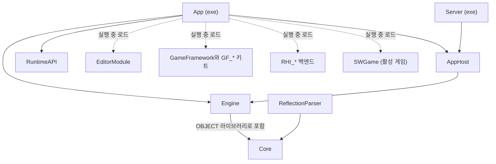

# Architecture (엔진 구조)

이 문서는 엔진 전체의 구조를 설명합니다. 어떤 빌드 타깃이 무엇을 링크하는지, 모듈 경계가 어디인지, 엔진 전체에서 지켜야 할 규칙이 무엇인지를 다룹니다.
한 모듈 안의 규칙은 그 폴더의 README에 있고, 목록은 [문서 지도](docs/02_DocumentMap.md)에 있습니다. 빌드 방법은 [시작하기](docs/01_GettingStarted.md)를 보세요.

## 빌드 타깃의 관계

엔진은 여러 빌드 타깃으로 나뉩니다. 실행 파일 `App` 은 일부러 얇게 만들었습니다. App은 컴파일할 때 게임, 에디터, GameFramework의 클래스를 전혀 모르고, 실행 중에 모듈을 로드해서 연결합니다.
그래서 게임 코드를 바꿔도 App을 다시 빌드할 필요가 없고, 게임 모듈만 바꿔 끼울 수 있습니다.

그림의 실선은 컴파일할 때의 링크이고, 점선은 개발 빌드에서 실행 중에 로드하는 모듈입니다.

**App** 은 엔진 루프와 모듈 호스트만 가진 실행 파일입니다. 링크하는 것은 `Engine`, `RuntimeAPI`, `AppHost` 셋입니다.

**AppHost**(`Source/AppHost`)는 모듈 호스트, 핫 리로드, 프레임 시간 계산을 묶은 정적 라이브러리입니다. App과 전용 서버 실행 파일이 같이 씁니다.

**Server** 는 전용 서버 실행 파일입니다. 창, RHI, 플레이어 설정 단계 없이 게임 모듈을 고정 틱으로 돌립니다. 자세한 내용은 [Source/Server/README.md](Source/Server/README.md)에 있습니다.

**Core** 는 로그, 파일, 문자열, 메모리, 태스크, 압축, 네트워크 공통 계층 같은 기반 라이브러리입니다. OBJECT 라이브러리로 컴파일되고, `Engine` 이 이것을 포함해서 다시 내보냅니다. Core는 Engine을 모릅니다.

**ReflectionParser** 는 헤더를 읽어 리플렉션 코드를 생성하는 도구입니다. Engine보다 먼저 빌드되어야 하므로 Core만 링크합니다. Engine을 링크하면 Engine.dll과 순환 의존이 생깁니다.

### 개발 빌드와 배포 빌드

개발 빌드(Dev)에서 `Engine` 은 DLL이고, `EditorModule`, `SWGame`, `GF_*` 키트, `RHI_*` 백엔드는 동적으로 로드하는 모듈입니다.
그래서 App을 끄지 않고 이 모듈들을 다시 로드할 수 있습니다. 동작 방식은 [핫 리로드와 C-ABI](docs/03_LiveReload_and_ABI.md)에 있습니다.

배포 빌드(Shipping)에서는 에디터와 핫 리로드 코드가 빠집니다. 게임, 키트, 그리고 `SW_SHIPPING_RHI_BACKEND` 로 고른 RHI 백엔드 하나가 실행 파일 하나에 정적 링크됩니다.

빌드 타깃 종류(`SW_TARGET_TYPE`)는 어떤 실행 파일을 만들지 정합니다.

| 종류 | 언제 | 만드는 실행 파일 |
|---|---|---|
| Game | 개발 빌드의 기본값 | App과 Server |
| Client | 배포 빌드(`*-Shipping` 프리셋) | App만 |
| Server | `*-Server` 프리셋 | Server만 |

Server 타깃에는 에디터, RHI 백엔드, X11이 없습니다. 모듈은 매니페스트의 `_listTarget` 에 적은 타깃에만 들어갑니다.
빌드 옵션(`SW_*`)의 원본은 `cmake/Config/BuildOptions.cmake` 이고, CMake 구조는 [cmake/README.md](cmake/README.md)에 있습니다.

## 모듈 경계 — C-ABI

App과 모듈 사이를 오가는 것은 `Source/RuntimeAPI` 에 정의한 `extern "C"` 함수 테이블, 불투명 핸들, 서비스 테이블뿐입니다.
C 함수만 경계를 넘기 때문에, 컴파일러 설정이나 표준 라이브러리 구현이 달라도 모듈이 서로를 부를 수 있습니다.
RuntimeAPI는 헤더만 있고, Engine이나 App의 헤더를 include하지 않습니다.

export 매크로는 네 가지이고 서로 바꿔 쓰지 않습니다. `SW_API`, `SW_MODULE_API`, `SW_GF_API`, `SW_GAMESERVICE_API` 가 그것입니다.
각 매크로의 뜻과 진입점 목록은 [RuntimeAPI/README.md](Source/RuntimeAPI/README.md)에 있습니다.

## 엔진의 시작과 종료

엔진을 시작하는 순서는 단계 목록 하나(`Source/Engine/EngineInitStepList.xxx`)가 정합니다.
목록의 각 줄에는 단계 하나와 그 단계가 기다려야 하는 단계를 적습니다. `EngineInitSequence` 가 이 목록을 위상 정렬해서 그 순서대로 초기화하고, 종료할 때는 역순으로 정리합니다.
시작과 종료를 목록 하나로 정하기 때문에, 단계를 추가할 때 두 순서를 따로 맞출 필요가 없습니다. `EngineLoop` 와 테스트 하네스는 같은 부트스트랩 코드(`EngineBootstrap`)를 씁니다.

엔진 서비스는 `Source/RuntimeAPI/Service/EngineServiceList.xxx` 에 한 줄씩 정의합니다.

씬은 모든 타입이 등록된 뒤에만 로드합니다. 엔진, 게임, 에디터 모듈이 타입 등록을 마치는 단계가 `ModuleTypes` 입니다.
이보다 먼저 씬을 읽으면 씬 파일에 적힌 컴포넌트 타입을 찾지 못합니다. `ModuleHost` 는 게임 인스턴스를 에디터보다 먼저 만듭니다.

GPU 디바이스에 묶인 단계도 같은 목록에 있습니다. 그래서 그래픽 API를 실행 중에 바꿀 때는 그 단계들을 종료했다가 다시 초기화합니다.
단계와 루트 파일 하나하나의 규칙은 [Source/Engine/README.md](Source/Engine/README.md)의 "루트 파일" 절에 있습니다.

## 엔진 계층

`Source/Engine` 은 링크 단위로는 하나이지만, 폴더 사이의 include 관계는 방향이 정해진 그래프입니다. `Scripts/lint/gate/CheckEngineLayers.py` 가 이 방향을 검사합니다.

핵심 원칙은 세 가지입니다.

- RHI는 창을 모릅니다. 그릴 표면만 넘겨받습니다.
- 월드는 렌더러를 모릅니다. 렌더러가 씬을 읽어서 그립니다.
- Engine은 `Editor/`, `GameFramework/`, `Games/` 를 include하지 않습니다. 에디터와 통신해야 하면 RuntimeAPI, 델리게이트, 이벤트를 씁니다.

이렇게 방향을 정해 두면 아래 계층을 위 계층 없이 테스트하고 재사용할 수 있습니다. 계층 표와 상용 엔진과의 비교는 [Source/Engine/README.md](Source/Engine/README.md)에 있습니다.
GameFramework 기반 폴더의 계층은 [Source/GameFramework/README.md](Source/GameFramework/README.md)에 있습니다.

### 같은 이름의 폴더 — Engine 과 GameFramework 의 몫

몇 영역은 Engine 과 GameFramework 기반에 같은 이름의 폴더가 있습니다. 나누는 기준은 하나입니다.
Engine 은 장르와 무관한 장치 · 자료 · 질의를 맡고, GameFramework 는 그 위에서 게임플레이 규칙을 정합니다. 새 코드가 게임 규칙(누가, 언제, 왜)을 알면 GameFramework 에 둡니다.

| 영역 | Engine | GameFramework 기반 |
|---|---|---|
| 입력 | `Engine/Input` — 장치 사건, 입력 맵, 액션 값, 재생 | `Base/Control` — 컨트롤러가 액션을 읽어 `ControlIntent` 로 바꾸고 폰이 그 의도를 따릅니다. `Base/Input` — 명령 버퍼, 타이밍 판정 같은 장르 공통 해석 |
| 내비게이션 | `Engine/Navigation` · `Engine/Object/Component/Navigation` — 3D 내비메시 베이크, 경로 질의, 군중, 에이전트 컴포넌트 | `Base/Navigation` — 타일 · 격자 게임의 격자 경로 찾기, 흐름장, 도달 범위 |
