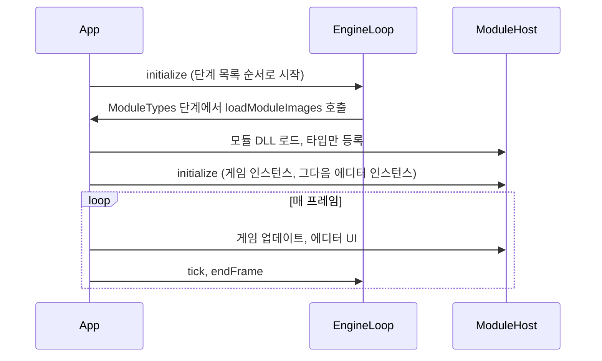

# App (진입점 프로그램)

## 이것은 무엇이고 왜 있나

`App` 은 엔진을 실행하는 실행 파일입니다. 일부러 얇게 만들었습니다.
App이 컴파일할 때 링크하는 것은 `Engine`, `RuntimeAPI`, `ModuleHost` 셋뿐이고, 게임과 에디터의 클래스는 전혀 모릅니다.
게임과 에디터는 실행 중에 모듈로 로드하고, `Source/RuntimeAPI` 의 C 함수 테이블로만 부릅니다.
이렇게 해야 개발 빌드에서 App을 끄지 않고 게임이나 에디터 DLL을 바꿔 끼울 수 있습니다(핫 리로드).

App이 직접 하는 일은 네 가지입니다. 모듈 로더를 엔진에 연결하고, 메인 창을 소유하고, 한 프레임의 순서를 정하고, 콜백을 연결합니다.
엔진을 시작하고 종료하는 순서는 App이 아니라 엔진의 단계 목록(`Source/Engine/EngineInitStepList.xxx`)이 정합니다.
새로운 시스템이 필요하면 App이 아니라 `Engine` 에 둡니다.

모듈 호스트와 핫 리로드는 정적 라이브러리 [ModuleHost](../ModuleHost/README.md)(`Source/ModuleHost`)에 있습니다. 전용 서버 실행 파일(`Source/Server`)도 이 라이브러리를 같이 씁니다.
App 은 그 위에 App 전용 층 `EditorModuleHost`(이 폴더)를 얹습니다. 에디터 인스턴스 · 에디터 리로드 · 에디터 UI · RHI 교체 뒤 재초기화 · 원본 임포트가 여기 있고, 서버는 이 파일을 링크하지 않습니다.
언리얼에 비유하면 App은 `GuardedMain` 과 `FEngineLoop` 를 부르는 런처입니다.

## 머릿속 그림



모듈 이미지와 인스턴스, `ModuleHost`, `LiveReloadManager` 는 [ModuleHost](../ModuleHost/README.md) 에 설명이 있습니다.
프레임 시간을 가변 델타와 고정 스텝 수로 나누는 `FixedTimestep` 은 Engine(`Source/Engine/Config/FixedTimestep.h`)에 있고, 그 정책은 아래 "시간 정책" 에 있습니다.

**RHIBackendSwitcher** 는 `gv_rhiBackend` 가 바뀌면 프레임 경계에서 그래픽 API를 교체합니다. App만 쓰지만 교체 순서를 아는 유일한 곳이라 `RHIBackendSwitcher.cpp` 로 따로 둡니다.

**UserSettingsHost** 는 엔진의 `UserSettingsManager` 가 쌓은 화면 요청(창 방식 · 해상도 · VSync)을 App이 소유한 창과 스왑체인에 적용합니다.
설정 정책(보류 · 적용 · 확인 카운트다운)은 엔진에 있고, 이 파일은 창 소유자의 적용 단계라 App 에 둡니다. 창 크기 통보는 `App::onResize` 로 돌아와 스왑체인을 바꾸므로, 스왑체인을 바꾸는 길은 OS 리사이즈와 하나입니다.

## 따라 해 보기 — 창 없이 실행하기

App은 창을 띄우지 않고 작업만 하고 끝나는 헤드리스 실행을 지원합니다. 셰이더를 쿠킹해 보겠습니다.

```powershell
cd build/Ninja-Debug/Bin
./App.exe --cook-shaders
echo $LASTEXITCODE
```

창이 뜨지 않고 로그만 출력된 뒤 끝납니다. 성공하면 종료 코드가 0입니다.
엔진 시작 단계 중 `Headless` 단계가 명령줄을 보고 창, RHI, 렌더러 단계를 건너뜁니다. 작업이 실패하면 `App::initialize` 가 false를 반환하고 종료 코드가 0이 아니게 됩니다.
`Scripts/generate/CookAssets.py` 는 이 종료 코드로 실패를 알아냅니다.

자주 쓰는 헤드리스 인자는 다음과 같습니다. 높이장 임포트, 립싱크 분석, PO 교환, 프리팹 초상화 렌더링, 자동화 시나리오 같은 나머지 인자는 생성 문서 [명령줄 인자](../../docs/Config/CommandLine.md)에 있습니다.

| 인자 | 하는 일 | 처리하는 곳 |
|---|---|---|
| `--cook-shaders` | 셰이더 쿠킹 | 엔진의 `Headless` 단계 |
| `--cook-scenes --cooked-dir=<폴더>` | 씬, 프리팹, 내비메시 쿠킹 | 엔진의 `Headless` 단계 |
| `--import-textures`, `--check-textures` | 텍스처 임포트, 또는 원본과 DDS 대조만 | 에디터 모듈 |
| `--import-models`, `--check-models` | glTF 모델 임포트, 또는 원본과 `.mesh` 대조만 | 에디터 모듈 |
| `--gather-text`, `--check-text` | 로컬라이제이션 텍스트 수집, 또는 표가 최신인지만 확인 | 에디터 모듈 |

몇 가지는 더 알아 둘 것이 있습니다.

- 셰이더 쿠킹은 `ShaderCookDriver::cookAllShaders` 가 합니다.
- 씬 쿠킹은 씬과 프리팹 외에 GUID 레지스트리, VAT, 내비 표면이 있는 씬의 `.navmesh` 도 씁니다. 입력은 팩을 마운트하지 않은 소스 트리(`ContentSource::SourceTree`)입니다.
  모든 타입이 등록된 `ModuleTypes` 단계 뒤에만 쿠킹하고, 모르는 타입의 컴포넌트(`MissingComponent`)가 있는 씬은 실패로 셉니다.
- 임포트는 App이 `EditorModuleHost::importAssetsWithEditorModule` 로 에디터 모듈을 인스턴스 없이 로드해서 부릅니다. 에디터가 없는 Shipping 빌드에서는 실패합니다.
- 로컬라이제이션 도구(`--gather-text` · `--check-text` · `--import-po` · `--export-po`)도 같은 길입니다(`EditorModuleHost::runLocalizationWithEditorModule`, 진입점 `runEditorLocalizationTask`).

## 작동 원리

### 시작 순서

1. `App::initialize` 가 `EngineLoop::initialize` 를 부릅니다. 엔진은 단계 목록 순서로 시작하고, 창과 RHI 디바이스도 그 목록의 `RHI` 단계가 만듭니다.
   App은 그 뒤 활성 창의 소유권을 넘겨받습니다(`acquireMainWindow`).
2. `ModuleTypes` 단계에서 App이 `EngineLoop::setModuleTypeLoader` 로 등록해 둔 `App::loadModuleImages` 가 불립니다.
   개발 빌드에서는 `Bin/Modules/` 폴더의 모듈 매니페스트를 읽어 해석합니다(`ModuleCatalog`). 모듈 DLL 도 그 폴더에 있습니다(`ModuleImageUtil::findModuleLibraryPath`). 꺼진 모듈은 이유를 로그에 한 줄 남기고 건너뜁니다.
   그다음 `LiveReloadManager` 를 만들고, `ModuleHost::loadModuleImages` 가 GameFramework, 키트, `SWGame` 순서로 이미지를 로드해 타입만 등록합니다.
   Shipping은 모두 정적 링크라 로드할 이미지가 없습니다.
3. 엔진 시작이 끝나면 `EditorModuleHost::initialize` 가 게임 인스턴스를 만들고, 그다음 에디터 인스턴스를 만듭니다. 에디터는 `-EnableEditor` 일 때만 로드합니다.
   씬 매니저는 마지막 요청을 따르므로, 에디터의 시작 씬(`-gv_editorStartupScene`)이 게임의 첫 씬 요청보다 우선합니다.
4. `App::run` 이 게임 루프를 돕니다. `main.cpp` 는 초기화가 실패해도 `shutdown` 을 불러, 일부만 초기화된 서브시스템을 정해진 순서로 정리합니다.

### 한 프레임의 순서

`App::run` 의 한 프레임은 아래 순서를 지킵니다. 순서를 바꾸면 조용히 깨지는 곳이 있어서, 단계마다 그 위치에 있는 이유를 적었습니다.

| 단계 | 그 위치에 있는 이유 |
|---|---|
| `FixedTimestep::advance` | 이번 프레임의 델타와 고정 스텝 수를 먼저 확정합니다 |
| `UserSettingsHost::tick` | 화면 설정 변경은 OS 리사이즈처럼 프레임 시작 전에 합니다 |
| `EngineLoop::beginFrame`, `ModuleHost::beginFrame` | 에디터의 Play 상태를 한 번 읽어 고정합니다 |
| `pollReloadHotkeys`, `updateDevConsole` | 개발 빌드의 단축키와 개발 콘솔을 처리합니다 |
| `fixedUpdateGame` × N, `updateGame` | 고정된 Play 상태를 읽으므로 모든 스텝이 같은 답을 봅니다 |
| `ModuleHost::updateEditorUI` | 에디터가 입력을 처리한 뒤에 게임 뷰 · 씬 뷰 RT(보이는 패널만)와 틱 여부를 정합니다 |
| `LiveReloadManager::update` | 모듈 교체는 틱 직전에 합니다 |
| `EngineLoop::tick`, `ModuleHost::endEditorFrame` | 고정한 프레임 상태(`ModuleFrameState`)를 그대로 넘깁니다 |
| `RHIBackendSwitcher::applyIfPending`, `EngineLoop::endFrame` | 그래픽 API 교체는 프레임 경계에서만 합니다 |

표의 몇 줄은 이유가 더 있습니다.

- Play 상태를 프레임 처음에 고정하는 것은 DLL 경계를 여러 번 넘지 않기 위해서입니다. 고정 스텝이 여섯 번 돌아도 상태는 한 번만 묻습니다.
- 에디터 UI 질의를 게임 업데이트 앞으로 옮기면, 에디터의 Step 버튼 한 번이 틱 없이 소비됩니다.
- 뷰 카메라는 `EngineLoop::tick` 안에서 늦게 찾습니다. 미리 찾아 두면 씬 전환이나 핫 리로드가 파괴한 객체를 참조하게 됩니다.
- 창 크기 변경 통보는 `App::onResize` 로 따로 받습니다.

### 시간 정책

고정 스텝 길이와 프레임당 상한은 `EngineConfig` 의 `_fixedDeltaTime`, `_maxFixedStepPerFrame`, `_maxFrameDeltaTime` 이 정하고, `FixedTimestep` 이 적용합니다.
상한은 꼭 필요합니다. 상한이 없으면 느린 프레임이 고정 스텝을 더 많이 부르고, 그래서 다음 프레임이 더 느려지는 악순환에 빠집니다.
상한을 넘은 시간은 버립니다. 실시간을 따라잡는 대신 시뮬레이션이 실시간보다 느려지는 쪽을 택한 것입니다.

게임 시간 배율(`gv_timeScale`)은 최대 델타로 자른 뒤에 곱합니다(`FixedTimestep::advance`). 그래서 고정 스텝 수도 배율을 따라 늘고 줄며, 상한은 그대로입니다. 배율이 0이면 게임 시간이 멈춥니다.
`-gv_fixedFrameDelta=<초>` 를 주면 벽시계 대신 매 프레임 그 시간만큼 흐릅니다. App 이 선언해 `FixedTimestep::advance` 에 넘기며, 자동화 시나리오나 픽셀 비교처럼 결과가 매번 같아야 하는 실행에 씁니다.

### 리로드 단축키와 개발 콘솔

리로드 단축키는 `EngineLoop` 가 가진 셸 전용 입력 맵의 `Debug` 레이어(`Resource/engine/input/default.input.xml`)로 받습니다.
Ctrl+F8은 셰이더 리로드이고 엔진이 처리합니다. Ctrl+F6은 에디터, Ctrl+F7은 게임 모듈 리로드이고 `App::pollReloadHotkeys` 가 `EngineLoop::wasDebugActionTriggered` 로 확인합니다.
이 단축키는 개발 빌드 전용입니다. Shipping에는 리로드할 모듈이 없어서 `App::pollReloadHotkeys` 가 비어 있습니다.

에디터 없이 실행하면 `~` 키로 게임 창 위에 개발 콘솔(`Source/Engine/Input/DevConsoleController.h`)을 엽니다.
명령이나 `gv_이름 [값]` 을 입력하고 Enter를 누릅니다. Tab은 자동 완성, ↑와 ↓는 입력 기록, Esc나 `~` 는 닫기입니다.
콘솔이 열려 있는 동안은 콘솔이 `InputManager` 의 키보드 포커스를 가져가므로 게임은 키 입력을 받지 않습니다. 창 메시지를 가로채지는 않으므로 입력 재생과 테스트의 입력 주입도 콘솔에 도달합니다.
에디터가 있으면 Output Log 창의 입력 줄이 같은 콘솔입니다.
`-gv_devConsoleExec="timescale 0.5;gv_viewMode 2"` 는 시작 씬이 열린 뒤 명령을 실행하고, `-gv_devConsoleOpen=1` 은 콘솔을 연 채로 시작합니다. Shipping에는 콘솔이 없습니다.

## 무엇이 일어났는지 보기

디버거 없이 "왜 이렇게 됐나"를 확인하는 방법입니다. 실행 인자는 `App.exe` 뒤에 붙이고, 확인이 끝나면 앱이 스스로 끝나도록 `-gv_profileFrames=3` 을 같이 줍니다.
`-gv_dump` 로 시작하는 변수는 Debug와 Release 빌드에만 있고 Shipping에서는 빠집니다.

| 알고 싶은 것 | 보는 방법 |
|---|---|
| 타입이나 enum이 실행 중에 어떻게 등록됐나 | `-gv_dumpReflection=CameraComponent,CameraRole` |
| 리플렉션 파서가 헤더에서 무엇을 뽑았나 | `ReflectionParser --dump` |
| 렌더 패스가 어떤 순서로 돌고 무엇이 컬링됐나 | `-gv_dumpRenderGraph=1` |
| 렌더 그래프가 순환해서 화면이 나오지 않는다 | 로그의 `'A' waits on 'B'` 줄 |
| 씬, 프리팹, XML, JSON 파일을 왜 못 읽나 | 로그의 `경로:줄:열: 이유` 줄 |
| 에셋에 적은 enum 값이 왜 적용되지 않나 | 경고 `'Bogus' is not a value of enum ...` |
| 짧은 타입 이름이 겹친다 | 경고 `Reflected type name 'X' now means ...` |
| 디버거 없이 `SW_ASSERT` 가 멈춘 위치 | stderr의 `[SW_ASSERT]` 줄 |
| 크래시가 난 위치 | `Saved/Logs` 의 `crash_<세션>` 파일 |
| 화면에 실제로 무엇이 나갔나 | `-gv_screenshot=out.ppm` |

표의 몇 줄은 설명이 더 필요합니다.

- `-gv_dumpReflection` 은 첫 프레임에 그 타입의 부모 클래스, 필드 위치와 범위, 플래그, 열거자를 로그로 남깁니다. 이름은 쉼표로 여러 개 줄 수 있습니다.
- `ReflectionParser --dump` 의 예시 명령은 [ReflectionParser 문서](../../Tools/ReflectionParser/README.md)에 있습니다.
- 파일 읽기 오류는 어느 줄의 몇 번째 글자에서 무엇이 틀렸는지 알려 줍니다. 파일이 아예 없을 때만 `not found` 라고 씁니다. 코드에서는 `XmlDocument` 와 `JsonDocument` 의 `getLastError()` 로 같은 내용을 읽습니다.
- enum 경고가 나면 그 필드는 원래 값을 유지합니다. 오타 하나가 조용히 기본값으로 바뀌지 않게 하려는 것입니다.
- 타입 이름 경고는 씬과 프리팹이 짧은 이름으로 타입을 찾기 때문에 납니다. 같은 짧은 이름이 둘이면 나중에 등록한 쪽이 이깁니다.
- `[SW_ASSERT]` 줄 아래에는 실패한 식, 파일과 줄, 함수 이름이 이어서 나옵니다.
- 로그에 잘못된 UTF-8 바이트가 섞이면 그 바이트만 `\xNN` 으로 바뀌고 나머지 글은 그대로 남습니다.
- 스크린샷은 기본으로 10번째 프레임을 찍습니다. 다른 프레임은 `-gv_screenshotFrame=N`, 여러 장은 `-gv_screenshotCount=N` 과 `-gv_screenshotInterval=K` 로 정합니다.

## 확장하는 법

**헤드리스 작업을 하나 더할 때**

1. 인자를 `Source/Core/Predefined/ArgumentList.xxx` 에 한 줄 추가합니다.
2. 엔진이 할 수 있는 작업이면 엔진의 `Headless` 단계에서 처리합니다. 에디터 코드가 필요하거나 엔진 서비스 없이 도는 작업이면 `App.cpp` 의 헤드리스 작업 표(`kArrHeadlessTask`)에 한 줄 더합니다.
   에디터 임포트는 `EditorImportKind` 에 종류를 더하고 `runEditorImport<종류, 임포트 인자, 대조 인자>` 줄을 씁니다.
3. 작업이 `Failed` 를 돌려주면 `App::initialize` 가 false를 반환해 종료 코드로 알립니다. `Finished` 는 그 작업만 하고 성공으로 끝냅니다(크래시 보고).
4. `py -3 Scripts/generate/GenerateConfigReference.py` 로 인자 문서를 다시 생성합니다.

모듈을 다시 만들어야 하는 새 이유(디바이스 상실, 어댑터 변경 등)를 더하는 법은 [ModuleHost](../ModuleHost/README.md) "확장하는 법" 에 있습니다.

## 함정과 주의

모듈 호스트와 핫 리로드의 함정(프레임 상태 고정, 리로드 거절 시점, 섀도 복사본, 지연 언로드, `ModuleCallGuard`)은 [ModuleHost](../ModuleHost/README.md) "함정과 주의" 에 있습니다.

**Linux 스플래시 창은 서버가 정상이라고 해도 화면에 없을 수 있습니다.** `XPutImage` 는 확대 축소를 하지 않아서 이미지를 직접 줄여서 그립니다.
`Expose` 이벤트마다 창 내용이 지워지므로 배경 픽스맵을 씁니다. `override_redirect` 창은 XWayland에서 보이지 않아서 EWMH의 `_NET_WM_WINDOW_TYPE_SPLASH` 를 씁니다.
최종 확인은 사람이 눈으로 합니다. 창의 `isVisible()` 은 지금 화면에 있는지를, `isVisibleRequested()` 는 보이게 하려는 의도를 묻는 서로 다른 질문입니다.

## 더 볼 곳

- [ModuleHost](../ModuleHost/README.md): App · Server 가 같이 쓰는 모듈 호스트와 핫 리로드
- [핫 리로드와 C-ABI](../../docs/03_LiveReload_and_ABI.md): 리로드가 도는 순서와 지켜야 할 규칙
- [RuntimeAPI](../RuntimeAPI/README.md): App과 모듈 사이의 C 인터페이스
- [Module](../Engine/Module/README.md): 모듈 매니페스트와 타입 등록
- [Server](../Server/README.md): 같은 `ModuleHost` 를 쓰는 전용 서버

| 파일 | 내용 |
|---|---|
| `App.cpp` | 앱 수명, 프레임 순서, 헤드리스 작업 표 |
| `RHIBackendSwitcher.cpp` | 프레임 경계의 그래픽 API 교체 |
| `UserSettingsHost.cpp` | 사용자 설정의 화면 요청 적용 |
