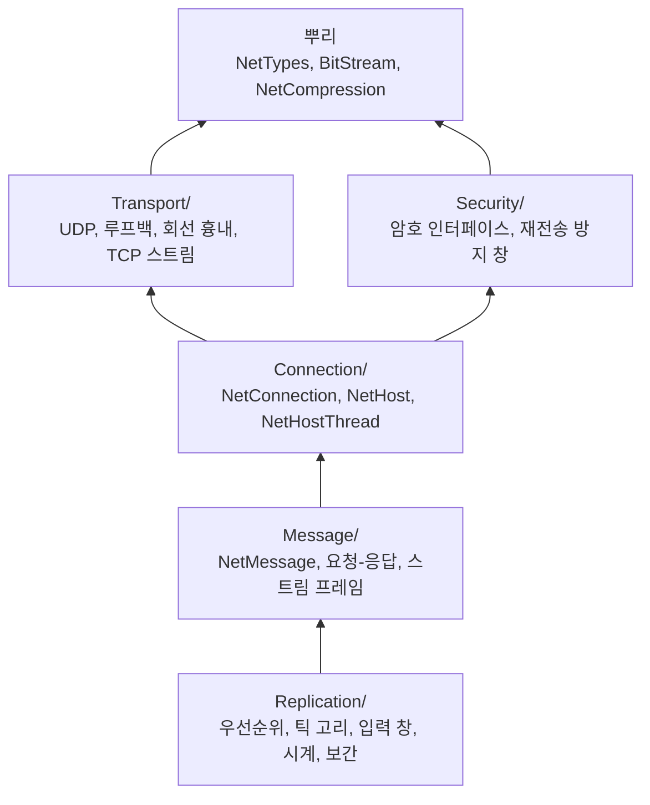

# Core/Network — 네트워크 공통 계층

## 이것은 무엇이고 왜 있나

이 폴더는 게임 장르를 모르는 네트워크 계층입니다. 패킷을 보내고 받는 전송, 연결 하나의 신뢰성, 메시지 나누기, 복제에 공통으로 쓰는 부품을 담습니다.
권위 서버 복제, 락스텝, 롤백, 턴 중계, MMO 관심 영역 같은 장르별 방식은 이 위에 GameFramework의 `GF_Net*` 키트(DLL)로 구현합니다.
그래서 싱글 플레이 게임은 키트를 링크하지 않고, 이 계층만으로는 네트워크 코드가 실행되지 않습니다.

언리얼의 NetDriver와 NetConnection, 채널 계층, 유니티 Netcode for Entities의 전송 계층에 해당합니다.
Core에 있으므로 Engine 없이 이 계층만 링크하는 도구와 테스트도 쓸 수 있습니다. 외부 압축 코덱은 Engine에, 암호 구현(OpenSSL)은 GameFramework(`Base/Online/Security`)에 있습니다.

## 머릿속 그림

폴더가 곧 계층이고, 아래 계층은 위 계층을 include하지 않습니다(`CheckCoreNetworkLayers.py` 게이트).



이 그림에서 기억할 개념은 네 가지입니다.

**전송.** `INetTransport` 는 데이터그램을 보내고 받는 인터페이스입니다. 실제 UDP(`UDPNetTransport`), 한 프로세스 안의 루프백(`LoopbackNetwork`), 회선 흉내(`NetEmulationTransport`)가 이것을 구현합니다.
`send` 는 아무 스레드에서나 부를 수 있고, `receive` 와 `waitForReceive` 는 `update` 를 도는 스레드 하나에서만 부릅니다.

**연결과 채널.** `NetConnection` 은 연결 하나의 신뢰성을 맡습니다. 패킷 시퀀스와 확인(ack), 재전송, RTT와 손실률 측정을 합니다.
메시지는 채널로 보냅니다. 신뢰 순서, 신뢰 순서 없음, 순서만(메시지 종류마다 가장 새 것 하나), 비신뢰 네 가지입니다.

**호스트.** `NetHost` 는 서버나 클라이언트의 엔드포인트입니다. 연결 핸드셰이크와 연결 목록, 대역폭 상한, 암호화를 맡고, 공개 함수는 잠금 하나로 보호되어 아무 스레드에서나 부를 수 있습니다.
`NetHostThread` 는 호스트를 전용 스레드에서 돌려, 게임 프레임이 멈춰도 확인과 재전송이 계속되게 합니다.

**메시지 라우터.** `NetMessageRouter` 는 메시지의 첫 바이트(종류)로 처리기를 찾아 넘깁니다. 키트는 `INetMessageHandler` 를 구현해 자기 종류만 읽습니다.

## 따라 해 보기 — 루프백으로 서버와 클라이언트 연결하기

네트워크 코드는 테스트로 익히는 것이 가장 빠릅니다. `Test/CoreTest/Network/` 의 테스트가 루프백 망 위에서 서버와 클라이언트 호스트를 한 스레드로 돌립니다.

```powershell
py -3 -m Scripts test NetworkTest.*
py -3 -m Scripts test NetworkThreadTest.*
```

1. 루프백 망(`LoopbackNetwork`)을 하나 만들고, 서버와 클라이언트가 각자 그 망의 전송을 씁니다. 루프백은 보낸 순서대로 다음 `update` 에 배달만 하므로 결과가 결정적입니다.
2. 서버 `NetHost` 가 듣고, 클라이언트 `NetHost` 가 연결합니다. 비동기로 연결하려면 `connectAsync` 가 돌려주는 `TaskFuture<NetConnectResult>` 를 씁니다.
3. 매 프레임 두 호스트의 `update` 를 부르면 핸드셰이크가 진행되고, 연결되면 `sendMessage` 로 보낸 메시지를 반대쪽이 꺼냅니다.
4. 회선을 나쁘게 만들려면 전송을 `NetEmulationTransport` 로 감싸고 지연, 손실, 순서 뒤바뀜을 겁니다.

스트림(TCP) 쪽은 `test::StreamEndpointPair`(`Test/TestFramework/TestStreamEndpointPair.h`)가 루프백 위의 엔드포인트 한 쌍을 한 스레드로 돌립니다.

<!-- snippet: 루프백 서버-클라이언트 연결 — 5b U7 에서 TestNetwork.cpp 구간과 대조 -->

## 작동 원리

### 비트 스트림

`BitWriter` 와 `BitReader`(`BitStream.h`)는 범위 정수, 양자화 실수, 가변 정수를 비트 단위로 쓰고 읽고, 넘침을 감지합니다.
내부적으로는 비트를 바이트 덩어리로 모아 쓰고, 바이트 경계에 맞은 데이터는 `memcpy` 로 옮깁니다.
길이가 붙은 덩어리는 `writeBlob` 과 `readBlob( out, maxSize )`, `skipBlob` 으로 다룹니다. 상한을 넘는 길이는 자르지 않고 넘침으로 거부합니다.
쓸 비트 수는 `BitMath::computeVarUintBits` 와 `computeBlobBits` 로 정확히 셉니다.

### 연결 하나의 신뢰성

메시지 길이 필드는 11비트(0~1024)입니다. 신뢰 순서 메시지는 64KB까지 1KB 조각으로 나눠 보냅니다(언리얼의 partial bunch).
조각마다 신뢰 id를 하나씩 쓰므로 재전송과 확인과 창이 조각 단위입니다. 받는 쪽은 순서대로 모아 마지막 조각에서 메시지를 넘기고, 연결이 끊기면 모으던 것을 버립니다.
다른 채널은 조각나지 않으므로 1KB까지입니다. 상한을 넘는 보내기는 오류 로그와 함께 false이고, 창이 메시지 전체를 받을 수 없으면 로그 없이 false입니다. 반쪽 메시지는 생기지 않습니다.

재전송은 RTT + 50ms가 지났을 때, 또는 뒤 패킷 셋이 확인됐는데 이 패킷의 확인이 없을 때(빠른 재전송) 합니다.
받은 패킷은 본문을 다 읽은 뒤에야 시퀀스를 기록합니다. 깨진 패킷을 확인해 주면 보낸 쪽이 그 안의 신뢰 메시지를 전달된 것으로 지우기 때문입니다.
패킷 끝에는 "확인 요청" 비트가 있습니다. 확인만 담은 답에서는 이 비트를 꺼서, 한가한 연결에서 답에 답이 계속 꼬리를 무는 것을 막습니다.

### 호스트와 핸드셰이크

연결은 요청, 챌린지, 응답, 수락 순서로 맺습니다. 서버는 요청을 받아도 자리를 잡지 않는 **상태 없는 챌린지**를 씁니다.
비밀 키, 주소, 솔트, 5초 단위 시간으로 만든 챌린지 값만 돌려주고, 그 값을 되돌려 준 응답이 같은 시간 단위나 다음 단위 안에 와야 자리를 잡습니다. 위조된 주소로 자리를 채우는 공격을 막기 위해서입니다.
프로토콜 id와 체크섬으로 다른 프로그램의 패킷과 깨진 패킷을 걸러 냅니다. 클라이언트는 `Accepted` 를 받아야만 연결된 것으로 봅니다.

**와이어 버전.** 프로토콜 id는 게임 id(`_gameId`), Core 버전(`NetWireVersion::kCore`), 게임과 키트 버전(`_wireVersion`, 키트는 `NetKitWireVersion`)을 섞어 만듭니다.
형식을 바꾸는 커밋은 그 계층의 버전을 올리고, 예전 형식은 읽지 않습니다. 버전이 다르면 서버가 `VersionMismatch`(다른 게임이면 `Rejected`)로 거절하고 양쪽 로그에 두 프로토콜 id를 남깁니다.
요청과 거절 패킷만 버전과 상관없는 고정 머리(`NetProtocol::kHandshakeId`)로 감싸서 버전이 달라도 읽힙니다. 그래서 이 두 패킷의 배치는 바꾸지 않습니다.

**대역폭.** 연결마다 대역폭 상한(`_maxBytesPerSecond`, 기본 100,000B/s)이 있습니다. 언리얼의 `NetSpeed` 에 해당합니다.
보낼 것이 없으면 `_keepAliveInterval`(0.25초)마다만 보냅니다. 호스트는 주소에서 연결을 해시로 찾으므로 연결 수와 관계없이 패킷 하나를 O(1)로 처리합니다.

**스레드.** `update` 는 소켓 받기와 보내기를 잠금 밖에서 한 번에 최대 512개씩 처리하고, 잠금 안에서는 패킷 처리만 합니다.
`NetHostThread` 는 소켓을 기다렸다가(`poll`, `WSAPoll`, 최대 2ms) `update` 를 부릅니다. 기다리는 일이라 TaskManager 워커가 아니라 전용 스레드를 씁니다.
여러 스레드가 쓰는 동안 연결 통계는 사본(`getConnectionStats`)으로 읽습니다.

**암호화.** `NetHostSettings::_security`(`NetHostSecurity.h`, 기본은 꺼짐)를 켜면 응답과 수락에 일회용 X25519 공개 키가 실립니다.
키는 HKDF(공유 비밀, 솔트 = 세션 비밀)로 만들고, 데이터와 끊기 패킷은 AEAD로 암호화합니다. 토큰 결속(`INetConnectAuthenticator`, `NetConnectCredentials`)을 쓰면 세션 비밀의 증명 태그가 맞아야 자리를 잡습니다.
인증기 없는 암호화는 개발 빌드에서만 허용하고, Shipping 서버는 listen에 실패합니다. 암호 구현은 `Security/INetSecurityProvider` 인터페이스 뒤에 있고, 구현체는 Engine의 OpenSSL 코드입니다.

### 메시지와 라우터

`NetMessageWriter` 는 종류 바이트와 본문을 쓰고 버퍼를 다시 씁니다. `INetMessageHandler` 는 메시지 영역 하나와 그 안의 종류 마스크를 맡습니다.
본문은 종류 바이트 뒤의 `BitReader` 로 읽고, 결과는 `NetHandleResult`(`Handled`, `Malformed`)입니다.

`NetMessageRouter::pump( host )` 는 `NetHost::drainInbound` 로 연결 사건과 메시지를 잠금 한 번에 꺼냅니다.
**사건을 먼저** 모든 처리기에 알리고 그다음 메시지를 나눕니다. 같은 자리에 새로 들어온 연결의 메시지가 예전 연결 상태로 읽히지 않게 하기 위해서입니다.
깨진 메시지는 세고(`getMalformedCount`) 버리며, 처리기가 없는 메시지만 돌려줍니다.

`NetSendBudget` 은 메시지 하나의 비트 예산을 셉니다. 종류 바이트, 머리, 목록 길이, 끝 표시까지 포함합니다. 키트의 틱 예산은 `computeTickBudget` 으로 구하고, 설정값과 "연결 상한 × 틱 간격 × 0.5" 중 작은 값입니다.

서비스 호출용 요청-응답(`NetRequestClient`, `NetRequestServer`)도 이 계층에 있습니다. 복제용 RPC가 아니라 서비스 호출입니다.
클라이언트 콜백은 응답, 시한 초과, 취소, 연결 끊김, 과부하 중 정확히 하나로 한 번 불립니다. 서버는 메서드마다 처리기를 두고, 바로 답하거나 토큰으로 나중에 `respond` 합니다.

### 스트림(TCP)

`IStreamTransport` 는 수락, 연결, 읽기, 쓰기 완료를 `IStreamHandler` 로 알립니다. I/O 스레드 N개를 쓰거나 `pollIO` 로 직접 돌릴 수 있습니다.
리슨할 주소는 받습니다. 운영 엔드포인트는 `NetAddress::makeLoopback`, 서버는 `makeAnyInterface` 를 씁니다.
보낼 줄(`StreamSendQueue`)은 64KB 덩어리와 높은 물금, 낮은 물금, 상한으로 배압을 겁니다. 루프백(`LoopbackStreamNetwork`)은 결정적이고 I/O 스레드가 없습니다.
구현은 Windows IOCP와 리눅스 epoll(에지 트리거)이고 `StreamTransportFactory` 가 고릅니다.

스트림 메시지는 길이 접두 프레임(`StreamFrame`: `[u32 길이][종류][플래그][본문]`)입니다. 상한은 머리 4바이트로 본문이 오기 전에 확인하고, 모르는 종류나 플래그는 연결을 끊습니다.
`StreamMessageEndpoint` 는 I/O 스레드에서 프레임을 잘라 연결별 줄에 넣고, 게임 스레드의 `pump` 가 잠금 한 번에 열림, 프레임, 닫힘 순서로 꺼냅니다.
TLS 컨텍스트를 주면 연결마다 TLS 1.3 세션을 쓰고, 압축을 켜면 프레임 본문을 압축 봉투(`NetCompressionUtil`)로 감쌉니다. 순서는 압축 다음 TLS입니다.
UDP 패킷 압축은 측정 결과(`NetCompressionBenchTest`) 이득이 없어 쓰지 않습니다.

### 복제 부품

키트들이 함께 쓰는 부품이 `Replication/` 에 있습니다. 클래스마다 자세한 규칙은 헤더 주석에 있습니다.

- `NetPrioritizer` 는 관찰자 하나에 대해 엔티티마다 우선도를 누적합니다. 틱마다 "우선도 × 지난 시간"을 쌓고, 보낸 것만 0으로 돌립니다. 언리얼 `NetPriority`, 유니티 고스트 중요도와 같은 방식입니다.
- `TickRingBuffer` 는 32비트 틱이나 프레임으로 찾는 고리입니다. 예측, 스냅숏, 랙 보정, 롤백 기록, 락스텝 입력, 체크섬이 함께 씁니다. 16비트로 감기는 패킷 시퀀스는 `SequenceBuffer` 입니다.
- `NetInputWindow` 는 여러 틱의 입력을 비신뢰로 함께 보내는 창입니다. `NetInputSendWindow` 가 보내고 `NetInputReceiveBuffer` 가 받습니다. 롤백과 권위 서버 입력이 함께 씁니다.
- `NetClock` 은 받은 서버 틱으로 서버 틱을 추정하고, 지연만큼 과거의 렌더 틱을 흘립니다. 유니티 `NetworkTime` 에 해당합니다.
- `InterpolationBuffer` 는 틱 순서의 표본 줄입니다. 렌더 틱 이하의 가장 새 표본과 그보다 큰 첫 표본을 찾습니다. 유니티 `BufferedLinearInterpolator` 에 해당합니다.
- `NetParallel` 은 서버 키트가 연결마다의 일을 `TaskManager::runParallel` 로 나누는 `NetParallelFor` 와 스레드별 작업 공간 `NetParallelScratch<T>` 입니다.

## 확장하는 법

### 새 메시지 종류 넣기

1. 메시지 첫 바이트 영역(`NetMessageRange`) 안에서 종류 값을 하나 정합니다.
2. 처리기(`INetMessageHandler`)의 종류 마스크에 그 값을 더하고, 본문을 `BitReader` 로 읽습니다. 형식이 틀리면 `Malformed` 를 돌려줍니다.
3. 메시지 크기 상한은 메시지 구조체에 상수 하나로 두고, 보내는 쪽과 받는 쪽이 같이 씁니다.
4. 형식을 바꿨다면 그 계층의 와이어 버전(Core면 `NetWireVersion::kCore`, 키트면 `NetKitWireVersion`)을 올립니다.

## 함정과 주의

**상한은 보내는 쪽에서도 확인하세요.** 받는 쪽만 상한을 보면, 넘는 메시지가 보낸 쪽에서는 "보냈다", 받는 쪽에서는 깨짐으로 조용히 사라집니다.
턴 행동 900B가 그렇게 사라졌고, 락스텝은 보내기가 실패했는데 내 입력을 이미 예약해 나만 진행했습니다.
상한 상수는 메시지 구조체에 하나(`NetTurnRelayMessage::kMaxActionBytes`, `NetLockstepMessage::kMaxInputBytes`)를 두고 양쪽이 같이 씁니다.

**복제 예산은 메시지 전체를 정확히 세세요**(`NetSendBudget`). 1024B를 넘는 메시지는 `sendMessage` 가 버리고, 확인이 오지 않아 기준이 그대로이므로 다음 틱에도 같은 크기로 다시 버려집니다.
이렇게 라이브락이 되어 클라이언트 틱이 멈춘 적이 있습니다. 길이는 `writeBlob` 과 `readBlob( 상한 )` 하나로 다룹니다.

**순서만 채널(`UnreliableSequenced`)은 메시지 종류마다 흐름이 하나입니다.** 같은 종류로 여러 오브젝트의 상태를 보내면 서로 지웁니다.
그런 데이터는 비신뢰로 보내고 받는 쪽에서 틱으로 정렬합니다(`DestructionReplication` 의 자세).

**채널을 바꿀 때는 받는 쪽이 기대던 순서를 모두 적으세요.** 신뢰 순서 없음으로 옮긴 메시지는 같은 채널의 다른 메시지와의 앞뒤 관계도 잃습니다.
파괴 사건은 "요청한 스냅숏보다 뒤의 사건은 늦게 온다"는 순서를 채널에 기대고 있었습니다. 스냅숏을 기다리는 동안 사건을 쌓아 두지 않으면 스냅숏이 이미 적용한 사건을 덮어 영영 빠집니다.

**큰 신뢰 메시지도 조각마다 창 슬롯 하나를 씁니다.** 메시지를 묶어도 창 사용량(바이트 ÷ 1KB)은 줄지 않습니다.
그래서 앞부분이라도 먼저 내보내려고 나누는 경우(MMO 나감, 턴 대기 줄)에는 키트의 쪼개기를 남깁니다. 묶어서 이득을 보는 것은 엔티티마다의 작은 메시지가 많을 때입니다.

**조각이 패킷을 채우면 비신뢰 메시지가 굶습니다.** 1KB 조각 뒤에는 150B 정도만 남아 600B 스냅숏이 들어가지 못합니다. `NetConnection::writePacket` 은 남긴 쪽부터 번갈아 싣습니다.

**대역폭 상한은 빚을 허용하는 토큰 버킷입니다.** 남은 양이 0보다 크면 꽉 찬 패킷 하나를 보내고, 쌓을 수 있는 양은 보내기 간격 두 번어치입니다.
다 써도 확인과 유지 머리는 보내므로 타임아웃보다 오래 포화되어도 연결이 끊기지 않습니다. 상한 없이 "한 차례에 패킷 여럿"만 넣으면 회선을 넘칩니다. 둘은 함께 있어야 합니다.

**재전송 간격을 짧게 고정하지 마세요.** 0.1초 고정은 250ms 지연과 15% 손실에서 사건 최대 지연을 1.0초로 줄였지만, 메시지당 재전송이 3.5번, 서버 업로드가 3배가 되어 파괴 테스트가 실패했습니다.
RTT + 50ms와 빠른 재전송 조합은 재전송 1.9배, 업로드 +9%로 최대 지연을 4.1초에서 1.3초로 줄였습니다(2026-10-05 측정).

**확인만 담은 패킷이 확인을 요청하면 한가한 연결이 30Hz로 핑퐁합니다.** 그래서 확인 요청 비트가 있습니다.
반대로 요청을 끄기만 하면 양쪽 유지 시각이 맞물려 한쪽은 늘 답만 보내고 RTT 표본이 0이 됩니다. 그래서 답이라도 마지막 요청 뒤 유지 간격이 지나면 요청합니다.
RTT는 요청 패킷이 가장 새 확인으로 돌아올 때만 측정합니다. 묶어서 늦게 확인된 것에는 상대가 기다린 시간이 섞이기 때문입니다.

**비신뢰 입력을 "최근 N개"만 겹쳐 보내지 마세요.** N을 넘는 연속 손실이 영구 빈틈이 됩니다. 롤백이 30틱 끊김 뒤 양쪽 모두 120프레임에서 영원히 멈춘 적이 있습니다.
상대가 확인한 다음 틱부터 보냅니다(GGPO). `NetInputSendWindow` 가 구조로 그렇게 하고, 예산이 모자라면 **오래된 것부터** 싣습니다. 새 것부터 실으면 못 실은 옛 것이 같은 빈틈이 됩니다.
받는 고리(`NetInputReceiveBuffer`)는 아래 창과 위 창을 둘 다 둡니다. 위 창이 없으면 고리 한 바퀴 뒤의 먼 틱이 받아 둔 입력을 덮습니다.
권위 서버 입력도 같은 부품이고, 확인은 스냅숏의 `_firstMissingInputTick` 입니다(`InputBurstLossLeavesNoGap`).

**`TickRingBuffer` 의 `acquire` 는 옛 값을 비우지 않습니다.** 버퍼를 다시 쓰기 위해서입니다. 처음 넣는 틱이면 쓰는 쪽이 비웁니다.
키 전체를 기록하므로 감김 처리와 건너뛴 슬롯 비우기가 없고, 무엇이 낡았는지는 쓰는 쪽이 넣기 전에 확인합니다. 창 너비를 고리 크기로 두면 창 안의 항목끼리 덮지 않습니다(락스텝 입력 256, 체크섬 512).

**렌더 지연은 max( 최소 지연, 표본 간격 × 2 )입니다**(`NetClock`). 유니티 Netcode for Entities의 기본값 2틱과 같습니다.
간격 하나뿐이면 표본 하나를 잃을 때마다 보간할 뒤 표본이 없어 멈춥니다. 시계는 받은 틱을 하한, 받은 가장 새 틱 + 지연을 상한으로 두고, 렌더 틱은 되돌아가지 않습니다(`NetClientServerTest.RenderTickNeverGoesBackAcrossASnapshotGap`).
구간 규칙(앞 표본 이하, 뒤 표본 초과, 끝이면 멈춤, 외삽 없음)은 `InterpolationBuffer` 와 `NetInterpolationUtil::computeAlpha` 하나입니다.

**비신뢰로 보낸 우선도는 확인을 기다립니다**(`NetPrioritizer::markSentUnconfirmed`, `resolveSend`). 보낸 순간 0으로 돌리면 잃은 상태가 한 차례를 통째로 다시 기다립니다.
같은 이유로 비신뢰 갱신의 "보낸 상태"와 "확인된 상태"를 나눕니다(MMO `_listInFlightState`, `_listSentState`). 보낸 순간 기준을 바꾸면 잃은 갱신이 "안 바뀜"이 되어 다시 보내지 않습니다.

**회선 나쁨은 `NetEmulationTransport` 하나로 만듭니다.** 루프백 망은 순서대로 배달만 합니다.
흉내는 보내는 쪽 줄이므로, 호스트를 한 스레드에서 차례로 돌리는 테스트는 프레임마다 흉내를 **모두 먼저** `update` 합니다. 아니면 뒤에 도는 호스트가 보낸 것이 한 프레임 늦습니다.
깨짐 난수는 깨짐을 켰을 때만 뽑으므로 다른 조건의 난수 수열이 바뀌지 않습니다. 조건은 `-gv_netEmuLatencyMs` 같은 전역 변수로 줄 수 있습니다(`NetEmulationConditions::makeFromGlobalVariables`).

**UDP 암호화는 협상하지 않습니다.** 암호화와 토큰 결속 여부를 프로토콜 id에 섞어, 한쪽만 다르면 `SecurityMismatch` 로 거절합니다. 평문으로 내려가는 경로가 없습니다.
AEAD nonce는 방향별 IV XOR 64비트 패킷 번호입니다. 재전송 방지 창(1024)은 **복호가 통과한 뒤에** 표시합니다. 먼저 표시하면 위조 패킷이 진짜 번호를 써 버립니다.

**Windows UDP의 두 방어를 지우지 마세요.** `SIO_UDP_CONNRESET` 끄기와 받기 루프의 "오류는 건너뛰고 다음 것"을 둘 다 빼도 테스트는 통과합니다. 루프백 ICMP 리셋을 테스트가 재현하지 못하기 때문입니다.

**스트림 연결의 수명은 걸린 작업 수로 셉니다.** 닫힘은 그 수가 0이 되는 첫 순간 한 번이고, 그 뒤에 슬롯을 세대 +1로 돌려줍니다.
걸린 작업이 없는 연결을 닫으면 완료가 오지 않으므로 정리 항목을 루프에 넣습니다. 열림 콜백은 받기를 걸기 **전에** 부르므로 늘 첫 콜백입니다.
I/O 스레드를 끝낼 때 완료 포트의 멈춤 표시는 깨우기용으로만 씁니다. `GetQueuedCompletionStatusEx` 는 한 번에 여러 표시를 한 스레드에 줄 수 있어서, 표시 수로 끝내면 다른 스레드가 영영 기다립니다.

**스트림 보낼 줄이 넘치면 메시지를 버리지 않고 연결을 끊습니다**(`SendQueueOverflow`). 버리면 그 위의 순서가 깨지기 때문입니다.

**멱등 기억은 연결이 아니라 주체에 묶습니다.** 거래 요청이 처리된 뒤 응답 전에 끊기면 클라이언트는 새 연결에서 같은 키로 다시 보냅니다. 범위가 연결이면 두 번 처리됩니다(`NetRequestServer::setPrincipal`).
처리 중인 키가 다시 오면 처리하지 않고 첫 응답을 같이 받게 합니다. 연결이 닫혀도 처리 중 기록은 남겨 늦은 응답을 기억합니다.

**병렬 본문은 컨테이너를 만지지 않고 나누기 전에 받은 포인터로만 접근합니다**(`NetParallelScratch`). 컨테이너의 `operator[]` 는 Debug 경합 검출기에 쓰기로 집계됩니다.

## 더 볼 곳

- [Core](../README.md) — 압축 코덱 레지스트리와 로그 문맥
- [GameFramework](../../GameFramework/README.md) — 장르별 네트워크 키트
- [Server](../../Server/README.md) — 전용 서버 실행 파일
- `docs/Config/ServerConfig.md` — 서버 설정 값

| 파일 | 내용 |
|---|---|
| `Connection/NetConnection.h` | 채널, 조각, 재전송, 확인 요청 비트 |
| `Connection/NetHost.h` | 핸드셰이크, 와이어 버전, 대역폭, 암호화 |
| `Message/NetMessage.h` | 메시지 처리기와 라우터 |
| `Transport/NetEmulation.h` | 회선 흉내 조건 |
| `Replication/` | 우선도, 틱 고리, 입력 창, 시계, 보간 |
