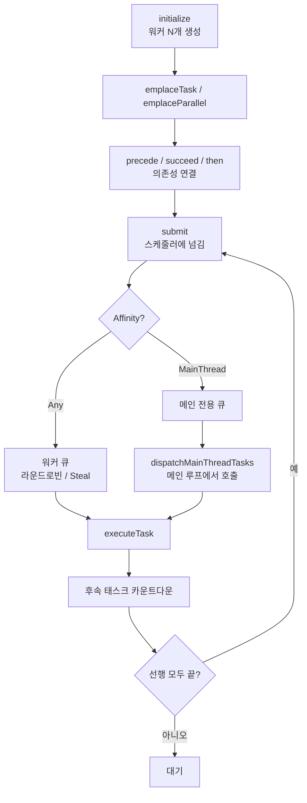
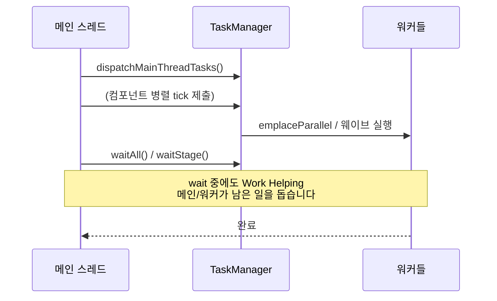
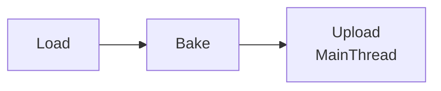
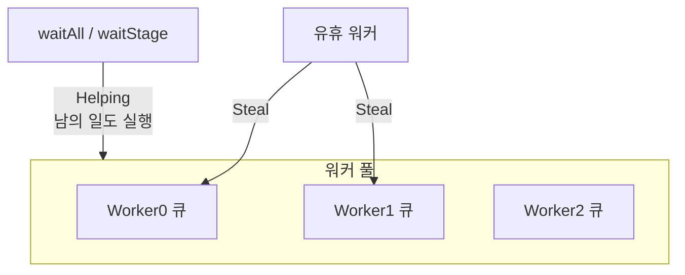

# Task (TaskManager · 비동기 작업)

> **[🏠 위키 홈으로 돌아가기](../../../README.md)** | **[📖 서브시스템 목록](../../../docs/02_EngineSubsystems.md)**
> ---

엔진의 **스레드 풀 + 작업 스케줄러**입니다.  
무거운 일을 워커 스레드에 맡기거나, 여러 일을 의존성(순서) 있게 이어서 실행할 때 사용합니다.

경로: `Source/Core/Task/`  
접근: App/Engine 쪽에서는 `engine::getTaskManager()` (Editor는 `editor::getTaskManager()`)

관련: [Core 개요](../README.md) · [엔진 개요](../../Engine/README.md) · [Object 틱과의 관계](../../Engine/Object/README.md)

---

## 한 줄로 이해하기

| 개념 | 역할 |
|------|------|
| **TaskManager** | 워커 스레드 풀을 돌리고, 대기열의 작업을 분배합니다. |
| **TaskHandle** | 만든 작업 하나. `submit` / `precede` / `then` 으로 연결합니다. |
| **TaskStageHandle** | 여러 작업을 한 “단계”로 묶어 `waitStage` 로 끝날 때까지 기다립니다. |
| **Affinity** | `Any`(아무 워커) 또는 `MainThread`(메인만). |
| **Work Helping** | `wait` 할 때 놀지 않고 **다른 대기 작업을 대신 실행**합니다. |

```text
메인 스레드                     워커 스레드들
─────────                     ─────────────
emplaceTask / submit  ──────►  큐에서 꺼내 실행
dispatchMainThreadTasks ◄────  (MainThread 친화 작업만)
waitAll / waitStage   ◄────►  Work Helping 으로 같이 진행
```

---

## 파일

| 파일 | 내용 |
|------|------|
| `TaskManager.h` / `.cpp` | 스레드 풀, 스케줄, wait, 메인 큐 |
| `TaskTypes.h` / `.cpp` | `TaskHandle`, `TaskStageHandle`, `TaskArgs`, 델리게이트, Affinity |
| `TaskNode.h` / `.cpp` | 내부 노드(태스크 · 스테이지 · 병렬 그룹 · 조인 카운터) — **공개 API 아님** |
| `TaskNodePool.h` / `.cpp` | 노드 슬랩 · 스테이지 · 병렬 그룹 풀 — **공개 API 아님** |
| `TaskFuture.h` | `TaskFuture<T>` / `TaskPromise<T>` — **결과를 돌려받는** 쪽. `.then` 체이닝, `whenAll` / `whenAny` |

---

## 전체 흐름



엔진 루프와의 관계(예: Object 틱):



---

## 기본 사용법

### 1) 한 번 돌릴 작업

```cpp
TaskManager& tm = engine::getTaskManager();

TaskHandle h = tm.emplaceTask( "LoadStuff", []()
{
    // 워커에서 실행 (기본 Affinity = Any)
} );
h.submit();   // 또는 tm.submit( h );

tm.waitAll(); // 전부 끝날 때까지 (Helping 포함)
```

이름을 생략해도 됩니다: `tm.emplaceTask( [](){ ... } );`

### 2) 인자 가방 (`TaskArgs`)

타입이 다른 값을 몇 개 넘길 때:

```cpp
TaskArgs args = MakeTaskArgs( 42, string( "map01" ) );

TaskHandle h = tm.emplaceTask( "WithArgs",
    []( const TaskArgs& a )
    {
        int32 id = a.get<int32>( 0 );
        string name = a.get<string>( 1 );
        (void)id;
        (void)name;
    },
    args );
h.submit();
```

`TaskValue`는 작은 타입(≤32바이트)은 힙 없이 인라인 저장합니다.

### 3) 병렬 for (`emplaceParallel`)

인덱스 `0 .. count-1` 을 워커들에 나눠 줍니다.

```cpp
TaskHandle h = tm.emplaceParallel( 1000, []( uint32 index )
{
    // index번째 요소 처리
} );
h.submit();
tm.waitAll();
```

범위 덩어리로 나누려면 `emplaceParallelBlock( start, end, []( uint32 begin, uint32 end ){ ... } )`.

### 4) 순서 붙이기 (DAG)

```cpp
TaskHandle load = tm.emplaceTask( "Load", [](){ /* ... */ } );
TaskHandle bake = tm.emplaceTask( "Bake", [](){ /* ... */ } );
TaskHandle upload = tm.emplaceTask( "Upload", [](){ /* ... */ },
                                    TaskThreadAffinity::MainThread );

// load 가 끝난 뒤 bake, bake 가 끝난 뒤 upload
load.precede( bake );
bake.precede( upload );

load.submit();
bake.submit();
upload.submit();
```

같은 뜻의 다른 표현:

```cpp
bake.succeed( load );           // bake 는 load 다음
load.then( [](){ /* bake 역할 */ } );  // 체이닝으로 후속 생성
```



“여러 개 다 끝나면” / “하나라도 끝나면” 은 `TaskFuture.h` 의 `whenAllFutures` / `whenAnyFuture` 입니다 (아래 7번).

### 5) 스테이지로 묶어서 기다리기

```cpp
TaskStageHandle stage = tm.createStage();

TaskHandle a = tm.emplaceTask( [](){} );
TaskHandle b = tm.emplaceTask( [](){} );
stage.addTask( a );
stage.addTask( b );
a.submit();
b.submit();

tm.waitStage( stage ); // 스테이지에 넣은 일이 모두 끝날 때까지
```

- `addTask` 는 **제출 전에** 부릅니다. 스테이지는 남은 수만 세고 태스크를 붙들지 않습니다.
- 이름으로 찾는 스테이지는 없습니다. 여러 곳이 같은 스테이지를 봐야 하면 핸들을 복사해 건넵니다.
- 끝날 때까지 기다리기만 할 병렬 for 라면 스테이지 대신 `runParallel` 이 더 쌉니다(노드 · 스테이지 · 힙 없이 호출 스레드가 함께 돕니다).

### 6) 메인 스레드 전용 작업

UI, RHI, “메인만 만져야 하는” 상태는 Affinity를 `MainThread` 로:

```cpp
TaskHandle h = tm.emplaceTask( "OnMain", []()
{
    // 메인에서만 실행됨
}, TaskThreadAffinity::MainThread );
h.submit();
```

메인은 **매 프레임** (또는 주기적으로) 아래를 호출해야 큐가 소비됩니다.

```cpp
tm.dispatchMainThreadTasks();
```

`GameObjectManager::tick` 시작 시에도 이를 호출합니다.

### 7) 결과를 돌려받기 — `TaskFuture<T>`

`TaskHandle` 은 “언제 끝났는가”만 다룹니다. **값**을 돌려받아 이어서 쓰려면 `TaskFuture.h` 를 씁니다.
씬 비동기 로드(`SceneManager`)와 에셋 스트리밍(`AssetStreamingQueue`)이 이 위에 서 있습니다.

```cpp
TaskPromise<int32> promise;
TaskFuture<int32>  future = promise.getFuture();

tm.emplaceTask( "Compute", [promise]() mutable { promise.setValue( 42 ); } ).submit();

future.wait();                       // 또는 future.waitFor( 100 )
const int32 value = future.get();

// 체이닝 — 끝나는 즉시(또는 이미 끝났으면 그 자리에서) 이어 돈다
future.then( []( const int32& v ) { return v * 2; } )
      .then( []( const int32& v ) { SW_LOG_INFO( "%#", v ); } );

future.fallback( -1 );               // 원본이 유효하지 않으면 이 값으로
```

여러 개 모으기:

```cpp
TaskFuture<vector<int32>> all = whenAllFutures( listFuture ); // 전부 끝나면, 입력과 같은 순서
TaskFuture<int32>         any = whenAnyFuture( listFuture );  // 가장 먼저 끝난 하나
```

| 주의 | 이유 |
|------|------|
| **기본 생성된 `TaskFuture` 는 유효하지 않다** (`isValid() == false`) | 상태가 없어 `then` 이 콜백을 걸지 않는다. `get()` 은 Debug 에서만 단정이 잡아 준다. |
| `whenAllFutures` 의 결과는 **입력과 같은 길이** | 유효하지 않은 자리는 기본값으로 남는다 — 기다릴 대상이 없기 때문이다. |
| `whenAnyFuture` 는 후보가 없으면 **유효하지 않은 future** 를 준다 | 값을 만들 길이 없다. `isValid()` 로 물어볼 것. |

---

## Affinity · 스레드 확인

| Affinity | 의미 |
|----------|------|
| `Any` | 아무 워커. 기본값. |
| `MainThread` | `dispatchMainThreadTasks` 가 돌릴 때만 실행. |

헬퍼:

```cpp
tm.isMainThread();
tm.isWorkerThread();
tm.isInsideParallelTask();          // emplaceParallel* · runParallel 본문 안인지 (문턱 아래로 한 번에 돌아도 true)
tm.getCurrentThreadScratchSlot();   // 스레드마다 하나씩 쓰는 스크래치 칸(워커 번호, 아니면 도우미 번호)

tm.ensureMainThread();              // Debug에서 아니면 assert
tm.ensureWorkerThread();
tm.ensureInsideParallelTask();

// 병렬 본문에서 부르면 안 되는 함수는 스스로를 지킨다 (UE 의 IsInParallelRenderingThread 같은 검사)
SW_ASSERT( tm.isInsideParallelTask() == false );
```

끝났는지 **묻기만** 하려면 `TaskHandle::isCompleted()` — 본문과 그 안에서 만든 자식이 모두 끝나면 true
(Unity `JobHandle.IsCompleted` · UE `FGraphEvent::IsComplete()` 자리). 빈 핸들은 true 입니다.

---

## 내부가 하는 일 (초심자용)

몰라도 쓸 수 있지만, “왜 wait가 빠른지”를 이해할 때 도움이 됩니다.



- **Work-Stealing**: 내 큐가 비면 다른 워커 큐에서 일을 가져옵니다.  
- **DAG**: 선행이 끝나면 후속의 `_unresolvedDependencies` 가 줄어들고, 0이 되면 자동 스케줄.  
- **Work Helping**: `wait` 중 슬립만 하지 않고 대기열 작업을 직접 돕습니다 → 데드락·코어 낭비 완화.  
- **짧은 스핀 뒤 주소 대기**: 잠깐 `cpuPause` 로 돌다가 자기 워드 하나에서 잠들고(`Futex`), 깨우는 쪽은 그 주소만 깨웁니다.
- **병렬 그룹 = 티켓**: `emplaceParallel*` · `runParallel` 은 청크마다 노드를 만들지 않고, 티켓 몇 장을 받은 스레드가 원자 카운터로 청크를 이어 가져갑니다.

---

## 수명 · 초기화 및 큐 비우기 (Clear)

```cpp
tm.initialize( 0 );  // 0 = 논리 코어 수에 맞춤
// ... 엔진 가동 ...
tm.waitAll();
tm.clear();          // 대기 중인 모든 작업을 안전하게 취소 (Shutdown 직전)
tm.shutdown();
```

- **안전한 취소 (Thread-safe Clear)**: `TaskManager::clear()`는 큐를 비울 때 반복자(iterator) 무효화나 락 경합(lock contention)을 방지하기 위해 `std::erase_if`를 사용하지 않습니다. 대신 **`Queue::steal()`을 통해 작업을 원자적으로 가져와(steal) 안전하게 메모리를 해제**합니다. 엔진 종료 시나 씬 전환 시 락 경합 없이 잔여 작업을 빠르게 비울 수 있습니다.

- App이 `EngineLoop` 초기화 때 TaskManager를 만들고 `engine::bindEngineServices` 로 붙입니다.  
- 게임 모듈은 보통 **직접 TaskManager를 만들지 않고**, 이미 돌아가는 엔진 서비스를 쓰거나 Object씬/리소스 API** 뒤에 숨은 비동기를 사용합니다.

Games에서 `EngineServices` 를 include 하지 않는 규칙은 [Object README](../../Engine/Object/README.md) / lint와 같습니다.  
게임 쪽에서 비동기가 필요하면 엔진이 제공하는 고수준 API(씬 비동기 로드 등)를 우선하세요.

---

## 자주 하는 실수

| 실수 | 결과 | 올바른 방법 |
|------|------|-------------|
| `emplace` 후 `submit` 안 함 | 영원히 Pending | `handle.submit()` 또는 `tm.submit(handle)` |
| `MainThread` 작업만 넣고 `dispatchMainThreadTasks` 안 함 | 큐에 쌓인 채 미실행 | 메인 루프마다 dispatch |
| 워커에서 메인 전용 자원(RHI/UI) 직접 사용 | 크래시·레이스 | Affinity `MainThread` 또는 메인으로 다시 넘기기 |
| `waitAll` 없이 종료 | 미완료 작업 / 종료 레이스 | `shutdown` 전 `waitAll` |
| parallel 본문에서 또 무거운 동기 wait | 스레드 고갈 위험 | 의존성은 DAG/`precede`로, 깊은 wait 중첩 피하기 |
| Games에서 `engine::getTaskManager` 직접 남용 | 레이어 경계 흐려짐 | 엔진/씬 API 경유, 또는 팀 규칙에 맞는 서비스 |

---

## 엔진 안에서 이미 쓰는 곳 (참고)

- **Object / GameObject**: 컴포넌트 tick 웨이브를 `emplaceParallel` + stage wait  
- **SceneManager**: 씬 비동기 로드 태스크  
- **RenderPass / Pipeline**: 에셋 비동기 로드  
- **LiveReload / ModuleHost**: 언로드 전 `waitAll`

---

## 더 볼 곳

- `TaskManager.h` — API 주석  
- `TaskTypes.h` — `TaskHandle::precede` / `then` / `submit`
- `TaskFuture.h` — `TaskFuture<T>` / `TaskPromise<T>` / `whenAllFutures` / `whenAnyFuture`  
- [Object/README.md](../../Engine/Object/README.md) — 병렬 tick과 `waitAll` 타이밍  
- [ARCHITECTURE.md](../../../ARCHITECTURE.md) — 병렬 tick Gotcha
