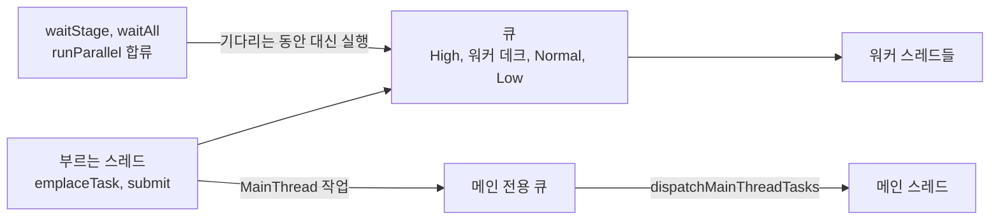

# Task — 워커 풀과 태스크 그래프

## 이것은 무엇이고 왜 있나

엔진은 텍스처 로드, 씬 로드, 컴포넌트 틱, 렌더 패스 기록처럼 오래 걸리거나 나눠서 할 수 있는 일을 여러 CPU 코어에 나눠 실행합니다.
그 일을 맡는 것이 `TaskManager` 입니다. 워커 스레드 풀을 돌리고, 작업 사이의 순서(의존성)를 지키며 작업을 나눠 줍니다.
언리얼의 TaskGraph와 `ParallelFor`, 유니티의 Job System에 해당합니다.

엔진 안에서 스레드를 직접 만들 일은 거의 없습니다. 기다리는 일(로그, 파일 감시, 네트워크 소켓)만 전용 스레드를 쓰고, 계산하는 일은 모두 이 풀에 넣습니다.
게임 모듈은 보통 `TaskManager` 를 직접 쓰지 않고, 씬 비동기 로드나 에셋 스트리밍처럼 엔진이 제공하는 비동기 API를 씁니다.

## 머릿속 그림


```mermaid
flowchart LR
  Caller["부르는 스레드<br/>emplaceTask, submit"] --> Queues["큐<br/>High, 워커 데크, Normal, Low"]
  Queues --> Workers["워커 스레드들"]
  Caller -- "MainThread 작업" --> MainQ["메인 전용 큐"] -- "dispatchMainThreadTasks" --> Main["메인 스레드"]
  Wait["waitStage, waitAll<br/>runParallel 합류"] -- "기다리는 동안 대신 실행" --> Queues
```

이 그림에서 기억할 개념은 다섯 가지입니다.

**태스크와 핸들.** `emplaceTask` 로 만든 작업 하나가 태스크이고, 돌려받는 `TaskHandle` 로 그 태스크를 가리킵니다. 만들기만 해서는 실행되지 않고 `submit()` 해야 실행됩니다.

**의존성.** `runBefore`, `runAfter`, `then` 으로 "A가 끝난 뒤 B" 같은 순서를 겁니다. 태스크들은 방향 있는 비순환 그래프(DAG)를 이루고, 선행 태스크가 모두 끝나면 후속 태스크가 자동으로 큐에 들어갑니다.

**스테이지.** `TaskStageHandle` 은 여러 태스크를 한 단계로 묶어 `waitStage` 로 모두 끝날 때까지 기다리게 합니다.

**퓨처.** `TaskHandle` 은 "언제 끝났는가"만 다룹니다. 결과 값을 받으려면 `TaskFuture<T>` 와 `TaskPromise<T>` 를 씁니다.

**도우며 기다리기.** 기다리는 스레드는 그냥 잠들지 않고, 큐에 있는 다른 작업을 대신 실행합니다(work helping). 그래서 기다림 때문에 코어가 놀거나 교착되는 일이 줄어듭니다.

## 따라 해 보기 — 읽고, 가공하고, 메인 스레드에서 마무리하기

파일을 읽고(워커), 내용을 가공하고(워커), 결과를 메인 스레드에서 적용하는 세 단계를 태스크로 만들어 보겠습니다.
엔진 코드에서는 `engine::getTaskManager()` 로 매니저를 얻습니다.

### 1단계 — 태스크 세 개와 순서

<!-- snippet: Load → Cook → Upload DAG — 5b U7 에서 문서 예시 테스트(TaskManagerTest)로 대조 -->
```cpp
TaskManager& tm = engine::getTaskManager();

TaskHandle load   = tm.emplaceTask( "Load", SW_DELEGATE_LAMBDA( TaskDelegate, [](){ /* 파일 읽기 */ } ) );
TaskHandle cook   = tm.emplaceTask( "Cook", SW_DELEGATE_LAMBDA( TaskDelegate, [](){ /* 가공 */ } ) );
TaskHandle upload = tm.emplaceTask( "Upload", SW_DELEGATE_LAMBDA( TaskDelegate, [](){ /* 적용 */ } ), TaskThreadAffinity::MainThread );

load.runBefore( cook );   // load 가 끝난 뒤 cook
cook.runBefore( upload ); // cook 이 끝난 뒤 upload

load.submit();
cook.submit();
upload.submit();
```

본문은 엔진의 델리게이트(`TaskDelegate`)로 넘깁니다. 람다는 `SW_DELEGATE_LAMBDA( 델리게이트 타입, 람다 )` 로 감싸고, 메서드는 `SW_DELEGATE_METHOD` 로 감쌉니다.
`Load` 와 `Cook` 은 아무 워커에서 돌고, `Upload` 는 메인 스레드에서만 돕니다(`TaskThreadAffinity::MainThread`).
메인 전용 작업은 메인 스레드가 `dispatchMainThreadTasks()` 를 불러야 실행됩니다. 엔진은 씬 프레임의 첫 단계(`MainThreadTasks`)에서 매 프레임 이 함수를 부릅니다.

`cook.runAfter( load )` 는 `load.runBefore( cook )` 와 같은 뜻입니다. `load.then( 본문 )` 은 후속 태스크를 새로 만들어 연결합니다.
여러 태스크가 모두 끝나거나 하나라도 끝났을 때 이어 가려면 `tm.whenAll( 목록, 후속 )` 과 `tm.whenAny( 목록, 후속 )` 를 씁니다.

### 2단계 — 결과 값 받기

<!-- snippet: TaskPromise / TaskFuture 와 then 체이닝 — 5b U7 에서 대조 -->
```cpp
TaskPromise<int32> promise;
TaskFuture<int32>  future = promise.getFuture();

tm.emplaceTask( "Compute", SW_DELEGATE_LAMBDA( TaskDelegate, [promise]() mutable { promise.setValue( 42 ); } ) ).submit();

future.then( []( const int32& value ) { return value * 2; } )
      .then( []( const int32& value ) { SW_LOG_INFO( "%#", value ); } );
```

`then` 은 값이 정해지는 즉시, 이미 정해졌다면 그 자리에서 이어서 실행합니다. 로그에는 `84` 가 남습니다.
값을 직접 기다리려면 `future.wait()` 나 `future.waitFor( 100 )` 뒤에 `future.get()` 을 부릅니다. 씬 비동기 로드(`SceneManager::requestLoadFuture`)와 에셋 스트리밍이 이 방식을 씁니다.

### 3단계 — 병렬 for

인덱스 0부터 count-1까지를 여러 스레드에 나눠 처리하고 끝날 때까지 기다리는 일은 `engine::runParallel` 한 줄로 씁니다(`Engine/Common/EngineParallel.h`).

```cpp
engine::runParallel( count, /*serialThreshold*/ 256, SW_DELEGATE_LAMBDA( ParallelBlockDelegate, []( uint32 begin, uint32 end )
{
    for ( uint32 index = begin; index < end; ++index ) { /* index 번째 처리 */ }
} ) );
```

둘째 인자는 청크 크기가 아니라 **직렬 처리 임계값**입니다. count가 이 값보다 작으면 나누지 않고 부른 스레드에서 바로 처리합니다. 나누는 비용이 처리 비용보다 클 때를 피하기 위해서입니다.
`runParallel` 은 노드나 스테이지를 만들지 않고, 부른 스레드도 청크를 함께 처리합니다. 그래서 끝까지 기다릴 병렬 for에는 스테이지보다 쌉니다.
기다리지 않고 제출만 할 병렬 작업은 `emplaceParallel( count, 본문 )` 이나 `emplaceParallelBlock( start, end, 본문 )` 으로 태스크를 만듭니다.

이 기능들의 테스트는 다음 명령으로 실행합니다.

```powershell
py -3 -m Scripts test TaskManagerTest.*
```

## 작동 원리

### 큐와 우선순위

태스크는 제출 전에 `handle.setPriority( TaskPriority::High )` 처럼 우선순위를 정합니다. 워커는 일을 찾을 때 다음 순서로 봅니다.

1. 전역 High 큐. 병렬 그룹의 청크 사이에서도 비웁니다.
2. 자기 워커 데크. 워커가 넣은 Normal 태스크가 여기 들어갑니다.
3. 전역 Normal 큐. 워커가 아닌 스레드가 넣은 Normal 태스크가 여기 들어갑니다.
4. 다른 워커의 데크에서 훔쳐 오기(work stealing).
5. 전역 Low 큐. 훔쳐 올 것도 없을 때만 봅니다.

게임 스레드의 대량 작업과 렌더 스레드의 기록이 같은 풀을 씁니다. 그래서 렌더 스레드가 곧바로 기다리는 일(`RenderGraph` 의 병렬 패스 기록)은 `High` 로 넣어 대량 작업 뒤에 줄 서지 않게 합니다.
백그라운드 I/O와 통계 같은 일은 `Low` 입니다.

### 기다리는 방법

`waitStage`, `waitAll`, `runParallel` 의 합류는 기다리는 동안 다른 태스크를 대신 실행합니다(`tryHelpAndExecute`).
렌더 스레드나 로더 스레드처럼 워커가 아닌 스레드도 기다리는 동안 남의 태스크를 실행합니다.

예외가 하나 있습니다. `runParallel` 의 합류는 Low 큐를 돕지 않습니다. 합류가 기다리는 것은 자기 청크와 다른 스레드가 처리 중인 청크뿐이라, Low 태스크를 하나 집으면 그만큼 합류가 늦어지기 때문입니다(`TaskManagerTest.RunParallelJoinDoesNotHelpLowPriorityTasks`).
스테이지와 `waitAll` 은 Low도 돕습니다. 워커가 Low 스테이지를 기다릴 수 있기 때문입니다.

일이 없으면 잠깐 `cpuPause` 로 돌다가 자기 워드 하나에서 잠듭니다(`Futex`). 깨우는 쪽은 그 주소만 깨웁니다.
병렬 그룹(`emplaceParallel*`, `runParallel`)은 청크마다 노드를 만들지 않습니다. 티켓 몇 장을 받은 스레드가 원자 카운터로 다음 청크를 이어서 가져갑니다.

### 스레드 확인과 스크래치 슬롯

`isMainThread()` 와 `isWorkerThread()` 로 지금 스레드를 묻고, `ensureMainThread()` 와 `ensureWorkerThread()` 는 Debug에서 아니면 단언합니다.
태스크가 끝났는지 묻기만 하려면 `TaskHandle::isCompleted()` 를 씁니다. 본문과 그 안에서 만든 자식이 모두 끝나면 true이고, 빈 핸들도 true입니다. 유니티의 `JobHandle.IsCompleted` 에 해당합니다.

스레드마다 하나씩 쓰는 임시 버퍼는 `getCurrentThreadScratchSlot()` 이 주는 번호로 고릅니다. 슬롯 수(`getScratchSlotCount()`)는 워커 수에 `kMaxHelperThreadCount`(8)를 더한 값입니다.
워커가 아닌 스레드(메인, 렌더, 로더, 업로드)도 기다리는 동안 태스크를 실행하므로, 그 스레드들을 위한 도우미 슬롯이 필요합니다.
렌더 스레드처럼 다시 만들어지는 스레드는 끝나기 직전에 `releaseCurrentThreadHelperSlot()` 으로 슬롯을 반납해야 상한을 넘지 않습니다.

"지금 병렬 본문 안인가"를 묻는 함수는 없습니다. 틱 중에 하면 안 되는 구조 변경은 단언하지 않고 틱 뒤로 미룹니다([Object](../../Engine/Object/README.md)).

### 메모리 태그 상속

태스크와 병렬 그룹을 만들 때 그 스레드의 현재 `MemoryTag` 를 노드에 담고(`TaskNode::_memoryTag`, `ParallelGroup::_memoryTag`), 실행하는 동안 실행 스레드의 태그를 그것으로 바꿉니다.
그래서 워커에서 한 에셋 로드도 요청한 쪽의 태그(`Texture`, `Scene`)로 집계됩니다. 태그 스코프가 동작하는 구성(`SW_DEBUG`)에서만 담고 바꿉니다. 태그 자체는 [Core](../README.md)의 메모리 태그 절에 있습니다.

### 시간

대기 시한(`waitAll( timeoutMs )`)과 워커의 스핀 구간은 `Stopwatch`(`Core/Time/MonotonicClock.h`)로 측정합니다. 기다림의 상한은 횟수가 아니라 시간으로 둡니다.
yield 1024번 같은 횟수 상한은 느린 CI 머신에서 정상적인 대기를 실패로 만든 적이 있습니다.

### 수명

`TaskManager` 는 엔진 서비스 목록(`RuntimeAPI/Service/EngineServiceList.xxx`)의 한 줄이고, 기동 단계 `Task` 가 `initialize` 와 `shutdown` 을 부릅니다.
`initialize( 0 )` 은 논리 코어 수에 맞춰 워커를 만듭니다. 태스크를 기다리는 단계(`ModuleImages`, `Audio`, `Scene`, `FrameRenderer`)는 `Task` 에 의존하므로 종료할 때 먼저 내려갑니다.

`clear()` 는 워커 데크와 메인, 전역 큐에서 노드를 모두 꺼내 놓고, 활성 수를 0으로 만들고, 스테이지를 모두 돌려줍니다. 테스트 전용이고, **아무것도 돌고 있지 않을 때만** 부릅니다.

이름 있는 태스크와 스테이지는 Tracy를 켜면 구간이 됩니다. `ProfilerBackend::startTracy` 가 `TaskManager::setProfileHook` 으로 훅을 꽂습니다. 이름 없는 태스크는 구간이 없고, Shipping에서는 이름을 버립니다.

### 엔진 안에서 쓰는 곳

- 컴포넌트 틱은 `engine::runParallel` 로 나누고, 부른 스레드도 합류까지 함께 처리합니다.
- `SceneManager` 와 `AssetStreamingQueue` 는 `TaskFuture` 로 씬 비동기 로드와 에셋 스트리밍을 합니다.
- `RenderGraph` 는 병렬 패스 기록을 `High` 태스크와 스테이지로 합니다. `GPUUploadQueue` 는 메시 업로드를 `emplaceParallel` 과 스테이지로 합니다.
- 모듈 핫 리로드는 언로드 전에 `waitAll` 로 모든 태스크를 기다립니다.

## 확장하는 법

### 프레임마다 도는 태스크 만들기

1. 본문은 람다 대신 메서드 델리게이트(`SW_DELEGATE_METHOD`)로 만듭니다. 인라인 인자 슬롯은 노드를 키워서 그래프 기록 비용을 늘립니다.
2. 인자가 꼭 필요하면 `MakeTaskArgs( 값… )` 으로 `TaskArgs` 를 만들고 본문에서 `args.get<T>( 인덱스 )` 로 읽습니다. 32바이트 이하의 값은 힙 없이 인라인으로 보관합니다(`TaskValue`).
3. 여러 태스크를 한 번에 제출하면 `submitWithoutWake` 로 넣고 마지막에 `wakeSleepingWorkers( n )` 을 한 번 부릅니다.

## 함정과 주의

**`emplaceTask` 뒤에 `submit()` 을 빠뜨리지 마세요.** 제출하지 않은 태스크는 영원히 대기 상태로 남습니다.

**`MainThread` 태스크만 넣고 `dispatchMainThreadTasks()` 를 부르지 않으면 실행되지 않습니다.** 엔진 루프 밖의 도구나 테스트에서는 직접 불러야 합니다.

**스테이지에 넣는 `addTask` 는 제출 전에 부르세요.** 스테이지는 남은 수만 세고 태스크를 붙들지 않습니다. 이름으로 찾는 스테이지는 없으므로 여러 곳이 같은 스테이지를 봐야 하면 핸들을 복사해 넘깁니다.

**스트리밍 I/O를 `TaskPriority::High` 에 넣지 마세요.** High 큐는 병렬 그룹의 청크 사이에서도 비우므로 파일 읽기가 프레임 작업을 막습니다.
에셋 스트리밍은 `High` 와 `Immediate` 를 `Normal` 로, `Low` 와 `Normal` 을 백그라운드(`Low`)로 옮깁니다.

**깨우기는 넣은 만큼만 하세요.** `submitWithoutWake` 로 묶어 넣었다면 끝에 `wakeSleepingWorkers( n )` 을 꼭 부릅니다. 이 경로는 세대 번호도 올리지 않으므로 빠뜨리면 워커가 깨지 않습니다.
`notify_all` 로 모두 깨우면 측정에서 2배 손해였습니다. 모두 깨우기는 처음 읽은 유휴 마스크 안에서만 합니다. 다시 잠든 워커를 쫓아가면 WSL에서 1~90초가 걸렸습니다.

**`tick()` 같은 프레임 경로에서 `waitAll()` 을 부르지 마세요.** 렌더 기록, 스트리밍, 오디오 작업까지 모두 기다립니다. 자기가 띄운 일만 `waitStage` 로 기다립니다.

**병렬 본문 안에서 다시 무거운 동기 대기를 하지 마세요.** 대기가 깊게 중첩되면 스레드가 모자랄 수 있습니다. 순서가 필요하면 `runBefore` 로 의존성을 겁니다.

**워커에서 메인 전용 자원을 직접 쓰지 마세요.** RHI나 UI처럼 메인 스레드만 만져야 하는 상태는 `MainThread` 태스크로 넘깁니다.

**`TaskHandle` 은 참조 카운트를 가지므로 `const&` 로 넘깁니다.** 값으로 넘기면 카운트를 올리고 내리는 원자 연산이 매번 생깁니다.

**대기 표시와 알림의 순서를 지키세요.** `_activeTaskCount` 감소는 스테이지 통지보다 **앞**이어야 합니다. 멈춤 표시는 대기하는 쪽과 같은 잠금 안에서 세웁니다. 잠금 밖에서 세우면 알림을 잃어 `join` 이 멈춥니다.
자기 잠금을 쥔 채 콜백을 부르지 않습니다. 병렬 본문 스코프는 "현재 태스크"를 바꾸기 **전에** 만듭니다.

**`clear()` 는 아무것도 돌지 않을 때만 부르세요.** 도는 중에 부르면 활성 수가 0xFFFFFFFF로 감깁니다.

**스케줄러 테스트의 모든 대기에는 시한을 두세요.** 시한이 없으면 실패한 테스트가 CI를 멈춥니다.

**기본 생성된 `TaskFuture` 는 유효하지 않습니다**(`isValid() == false`). 상태가 없어서 `then` 이 콜백을 걸지 않고, `get()` 은 Debug에서만 단언이 잡아 줍니다.
`then()` 과 조합 함수는 유효하지 않은 입력에 유효하지 않은 퓨처를 돌려줍니다. `whenAnyFuture` 는 후보가 없으면 유효하지 않은 퓨처를 줍니다.
`whenAllFutures` 의 결과는 입력과 같은 길이이고, 유효하지 않았던 위치는 기본값으로 남습니다. `fallback( 값 )` 은 원본이 유효하지 않을 때 그 값을 씁니다.
"잠금 안에서 완료 표시, 알림과 후속 실행은 잠금 밖"이라는 규칙은 `SharedFutureSignal` 하나가 구현합니다.

## 더 볼 곳

- [Core](../README.md) — 메모리 태그, 시간, 동시성 도구
- [Object](../../Engine/Object/README.md) — 병렬 틱과 구조 변경 미루기
- [Engine](../../Engine/README.md) — 기동 단계와 엔진 서비스

| 파일 | 내용 |
|---|---|
| `TaskManager.h` | 워커 풀, 큐, 대기, 메인 전용 큐, 스크래치 슬롯 |
| `TaskTypes.h` | `TaskHandle`, `TaskStageHandle`, `TaskArgs`, 우선순위, 친화도 |
| `TaskFuture.h` | `TaskFuture<T>`, `TaskPromise<T>`, `whenAllFutures`, `whenAnyFuture` |
| `Engine/Common/EngineParallel.h` | `engine::runParallel`, 병렬 스크래치 슬롯 |
| `Test/CoreTest/Task/` | 스케줄러 테스트 |
