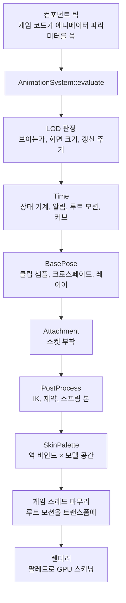

# Animation — 스켈레탈 애니메이션과 스프라이트 클립

> **[🏠 위키 홈으로 돌아가기](../../../README.md)** | **[📖 문서 지도](../../../docs/02_DocumentMap.md)**

## 이것은 무엇이고 왜 있나

캐릭터가 걷고 뛰려면 매 프레임 "지금 각 본이 어디에 있는가"를 계산해야 합니다. 이 폴더는 그 계산에 필요한 데이터와 재생 코드를 가지고 있습니다.
데이터는 스켈레톤(본 계층), 클립(시간에 따른 본의 움직임), 클립을 압축하는 코덱입니다.
재생 코드는 시간 커서, 두 클립 사이의 크로스페이드, 상태 기계, 알림, 동기 그룹입니다. 그 위에 IK 와 스프링 본 같은 후처리 리그와 리타깃이 있습니다.
언리얼의 애니메이션 블루프린트와 Control Rig, 유니티의 Animator 와 Animation Rigging 에 해당하는 기능입니다.

2D 스프라이트 애니메이션도 같은 재생 코드를 씁니다. 2D 와 3D 는 "재생 시각으로 무엇을 샘플하는가"만 다릅니다. 2D 는 프레임 번호를, 3D 는 본 포즈를 꺼냅니다.

이 폴더는 오브젝트를 모르는 순수 계산입니다. 그래서 오브젝트 없이 테스트할 수 있습니다. 나머지는 다른 폴더에 있습니다.

- 누가 언제 포즈를 만드는지(평가)는 `Object/Animation/AnimationSystem` 입니다.
- 컴포넌트는 `Object/Component/3D/` 의 `SkeletalMeshComponent` 와 `SkeletalAnimatorComponent`, 그리고 `Object/Component/2D/SpriteAnimatorComponent` 입니다.
- 경로로 스켈레톤과 클립을 나눠 주는 캐시(`SkeletonCache`, `AnimClipCache`)는 `Resource/AnimationAssetCache` 에 있습니다. 에셋 캐시 계층이 이 폴더보다 위에 있기 때문입니다.
- 후처리 리그를 유닛에 붙이는 컴포넌트, 알림 처리기, 래그돌은 [Character](../Character/README.md)에 있습니다.

## 머릿속 그림

한 프레임에 애니메이션이 하는 일은 다음과 같습니다.



**유닛.** 애니메이션 평가의 단위는 `SkeletalMeshComponent` 하나이고, 이것을 유닛이라 부릅니다. 몸, 투구, 무기처럼 장비 부품 하나가 오브젝트 하나이고 유닛 하나입니다.
유닛은 스켈레톤과 그 스켈레톤의 포즈를 가지고 있습니다. 스켈레톤이 없으면 본 하나(`root`)짜리 스켈레톤으로 취급합니다.

**단계.** 평가는 다섯 단계(`AnimationPhase`)로 나뉩니다. 단계마다 모든 유닛을 의존 순서대로 처리하고, 의존이 없는 유닛끼리는 워커 스레드에서 병렬로 처리합니다.
무기 유닛이 손 본을 따라가야 하면 무기가 몸에 의존한다고 선언합니다(`addAnimationDependency`). 그러면 몸이 먼저 평가됩니다. 의존에 순환이 있으면 오류입니다.

**일.** 유닛의 각 단계에 끼어드는 작업을 일(`IAnimationPhaseTask`)이라 부릅니다.
애니메이터(`SkeletalAnimatorBinding`)는 Time 과 BasePose 단계를 맡고, 후처리 리그(`PoseModifierBinding`)는 PostProcess 단계를 맡습니다. 소켓 부착은 Attachment 단계에 끼어듭니다.
할 일이 없는 유닛은 평가에서 빠지므로 쉬는 캐릭터는 비용이 없습니다.

**포즈와 스킨 팔레트.** 포즈(`Pose`)는 본마다 부모 기준의 이동, 회전, 스케일을 SoA 로 보관합니다. 포즈에서 모델 공간 행렬을 구하고, 거기에 역 바인드 행렬을 곱한 것이 스킨 팔레트입니다.
렌더러는 팔레트를 받아 컴퓨트 셰이더(`meshskin.hlsl`)로 정점을 스키닝합니다.

## 따라 해 보기 — 캐릭터에 애니메이션 붙이기

KayKit 기사 캐릭터를 Idle 상태로 시작하고, 게임 코드에서 걷기로 바꾸고, 상체에 조준 레이어를 겹쳐 보겠습니다.

### 1단계 — 유닛과 애니메이터 붙이기

<!-- snippet: SkeletalMeshComponent + SkeletalAnimatorComponent 붙이기 — 5b U7 에서 실제 소스 구간이나 문서 예시 테스트로 대조 -->
```cpp
#include "Engine/Object/Component/3D/SkeletalAnimatorComponent.h"
#include "Engine/Object/Component/3D/SkeletalMeshComponent.h"

SkeletalMeshComponent* pMesh = pObject->addComponent<SkeletalMeshComponent>();
pMesh->setMeshId( "game/shooter3d/models/kaykit/knight.mesh" );
pMesh->setSkeletonPath( "game/shooter3d/models/kaykit/knight/knight.skeleton.json" );

SkeletalAnimatorComponent* pAnimator = pObject->addComponent<SkeletalAnimatorComponent>();
pAnimator->setClipFolder( "game/shooter3d/models/kaykit/knight/clips" );
pAnimator->setInitialState( "Idle" );
```

애니메이터는 클립 폴더에서 `<클립 이름 소문자>.animclip` 파일을 찾습니다. 플레이가 시작되면 애니메이션 시스템이 이 유닛을 매 프레임 평가합니다.
이 코드를 틱 안에서 실행한다면 `executeOrDeferPostTick` 블록 안에서 실행해야 합니다([Object](../Object/README.md) 참고).

### 2단계 — 게임 코드에서 움직임 바꾸기

```cpp
pAnimator->getParameters().setFloat( hashed_string( "Speed" ), 3.0f );    // 상태 기계 파라미터
pAnimator->play( hashed_string( "Walking_A" ), true, 0.2f );              // 직접 재생, 0.2초 크로스페이드
pAnimator->addLayer( AnimLayerDesc{ hashed_string( "1H_Ranged_Aiming" ), hashed_string( "spine" ), 1.0f } );
```

- 상태 기계 그래프가 있으면 파라미터만 쓰고 전이는 그래프에 맡깁니다.
- `play` 는 그래프를 거치지 않고 바로 클립을 틉니다. 세 번째 인자는 크로스페이드 길이(초)입니다.
- `addLayer` 는 `spine` 본과 그 자손에만 조준 클립을 덮어씁니다. 하체는 걷기를 그대로 따릅니다.

### 3단계 — 알림 받기

```cpp
for ( const AnimFiredNotify& fired : pAnimator->getFiredNotifies() )
{
    // 발소리, 이펙트
}
```

`getFiredNotifies` 는 이번 프레임에 지나간 알림을 돌려줍니다. 알림 이름마다 소리나 이펙트를 연결하는 일은 보통 코드 대신 알림 테이블(`*.notifies.xml`)로 합니다([Character](../Character/README.md) 의 "애니메이션 알림" 절).

## 작동 원리

### 본 계층과 스키닝 행렬

`Skeleton` 은 본 배열이고, 부모가 항상 자식보다 앞에 옵니다. `addBone` 이 이 순서를 강제합니다. 그래서 배열을 앞에서부터 한 번 훑으면 모든 본의 모델 공간 행렬을 구할 수 있습니다.

엔진은 행벡터 규약을 씁니다. 자식의 로컬 행렬을 먼저 곱하고 부모의 모델 공간 행렬을 나중에 곱합니다.

```text
Model[i]   = Local[i] × Model[parent(i)]      // Pose::computeModelSpace
Palette[i] = InverseBind[i] × Model[i]        // Pose::computeSkinPalette
```

레퍼런스 포즈(바인드 포즈)에서는 팔레트가 단위 행렬이라 정점이 움직이지 않습니다. GPU 는 팔레트를 본마다 `float4` 세 개(행렬의 0, 1, 2열)로 받고, 정점마다 본 네 개를 가중치로 섞습니다.

glTF 의 열 우선 행렬 배열을 행 우선으로 읽으면 그대로 이 규약이 됩니다. 엔진 공간(왼손 좌표계)으로 옮길 때 행렬은 `S·M·S`(`S = diag(-1, 1, 1, 1)`)로, 회전 쿼터니언은 `(x, -y, -z, w)` 로 바꿉니다.

### 재생 — 커서, 플레이어, 상태 기계

**커서**(`AnimClipCursor`)는 재생 시각, 반복 여부, 끝났는지를 관리합니다. 클립이든 스프라이트 구간이든 `IAnimPlayable` 이면 같은 커서로 재생합니다.

**플레이어**(`AnimPlayer`)는 슬롯 두 개로 크로스페이드합니다. 새 클립을 틀면 지금 클립에서 새 클립으로 정해진 시간 동안 가중치를 옮깁니다.
전환 곡선은 `BlendCurve`(`BlendCurveSpec`, `evaluateBlendWeight`)이고, 카메라 디렉터, 시퀀서, 소켓 부착의 되돌아가기도 같은 구현을 씁니다.

**상태 기계**(`AnimGraphPlayer`)는 JSON 그래프(`AnimGraphAsset`)를 실행합니다. 노드가 상태이고 링크가 전이입니다.
전이 조건은 파라미터(`AnimParameterSet`)와 비교 연산자(`>`, `<`, `>=`, `<=`, `==`, `!=`) 또는 `trigger` 로 적습니다. 전이마다 블렌드 시간이 있고, 노드마다 반복 여부가 있습니다.

**동기 그룹**(`AnimSyncGroup`)은 같은 그룹의 클립들이 리더의 위상(재생 비율)을 따라가게 합니다. 걷기와 뛰기를 섞을 때 발이 엇갈리지 않게 하는 데 씁니다.

**레이어와 가산 포즈.** 레이어는 본 하나와 그 자손에 다른 클립을 덮어쓰거나(`Override`) 더합니다(`Additive`). 가산 포즈는 `Pose::makeAdditive` 로 만들고 `applyAdditive` 로 얹습니다.

### 알림

알림은 클립의 특정 시각(또는 구간)에 붙은 이름입니다. `AnimNotifyTrack` 이 지나간 알림을 정확히 한 번씩 알려 줍니다.

- 판정 구간은 반 열린 구간 `(이전 시각, 지금 시각]` 입니다. 재생을 시작한 직후의 첫 걸음만 시작 시각을 포함합니다.
- 반복 경계를 넘으면 `(이전, 끝]` 과 `[0, 지금]` 을 함께 봅니다. 그래서 한 시각의 알림은 한 바퀴에 한 번만 울립니다.
- 길이가 있는 알림(구간 알림)은 시작에서 `Begin`, 끝에서 `End` 가 울립니다(`AnimNotifyPhase`). 끝은 한 바퀴의 끝을 넘지 않고, 같은 시각이면 `End` 가 먼저 울립니다.
- `AnimFiredNotify::_pSource` 와 `_eventIndex` 로 같은 이름의 구간들을 서로 구별합니다.

애니메이터는 울린 알림을 프레임마다 한 번 받는 쪽(`IAnimNotifyListener`)에 넘깁니다. 이름을 처리기에 연결하는 쪽은 `Engine/Character/AnimNotify/AnimNotifyComponent` 입니다.

### 2D 와 3D 가 함께 쓰는 것

| 기능 | 2D(`SpriteAnimatorComponent`) | 3D(`SkeletalAnimatorComponent`) |
|---|---|---|
| 재생할 것 | `SpriteClipPlayable` | `AnimClip` |
| 시간, 반복, 크로스페이드 | `AnimClipCursor`, `AnimPlayer` | 같음 |
| 상태 기계 | `AnimGraphPlayer` | 같음 |
| 알림, 동기 그룹 | `AnimNotifyTrack`, `AnimSyncGroup` | 같음 |
| 샘플 결과 | 구간 안의 프레임 | 코덱으로 푼 본 포즈 |
| LOD | `SpriteAnimatorLodClient` | `SkeletalMeshLodClient` |

`SpriteClipPlayable` 은 스프라이트 클립(`.sprite.json`)의 이름 붙은 구간 하나를 `IAnimPlayable` 로 보여 줍니다. 구간 길이는 프레임 시간의 합입니다.
스프라이트 알림은 구간마다 `animations[].notifies` 에 구간 시작 기준 초로 적습니다.

알림을 넘기는 스레드는 다릅니다. 3D 는 게임 스레드의 마무리 단계에서 넘깁니다.
2D 는 틱(워커 스레드)에서 넘기고, 받는 쪽이 틱 뒤로 미룹니다. 구간이 바뀐 틱에는 `_bRestarted` 가 켜집니다.

### 애니메이션 LOD

화면에 작게 보이거나 보이지 않는 캐릭터까지 매 프레임 포즈를 만들면 군중 장면에서 비용이 커집니다.
`Object/Animation/AnimationLod` 는 언리얼의 URO(Update Rate Optimization), Significance Manager, Animation Budget Allocator 를 합친 것에 해당합니다.

엔진 루프가 프레임마다 뷰 목록을 넣습니다(`AnimationSystem::setLodViews`). 주 시점과, 이번 프레임에 그리는 화면 분할이나 렌더 텍스처의 뷰가 들어갑니다.
평가 전에 LOD 클라이언트(`IAnimationLodClient`)마다 경계 구로 다음을 판정합니다.

- **가시성.** 어느 뷰의 절두체에도 없으면 포즈를 만들지 않습니다(`setVisibleHint( false )`). 시간과 알림은 계속 흐릅니다. `_bAnimateWhenOffscreen` 을 켜면 계속 포즈를 만듭니다.
  쉬는 추가 뷰는 목록에 넣지 않으므로, CCTV 화면에만 보이는 캐릭터는 그 화면을 그리는 프레임에만 포즈를 만듭니다.
- **갱신 주기.** 화면 크기는 경계 구 지름을 화면 높이로 나눈 값입니다(`AnimationLodUtil::computeScreenSize`). 화면 크기 단계마다 갱신 주기와 보간 여부가 정해집니다.
  같은 주기의 유닛들은 위상이 달라서 한 프레임에 몰리지 않습니다. 컴포넌트의 `_updateRateDivisor` 는 주기의 하한입니다.
- **보간.** 건너뛴 프레임에는 직전 두 포즈 사이를 보간합니다. 그래서 한 주기만큼 늦습니다. 언리얼 URO 보간과 같습니다.
- **본 LOD.** 스켈레톤 곁의 `.bonelod.json` 이 고른 본은 코덱이 풀지 않고 레퍼런스 포즈로 부모를 따라갑니다.
- **예산.** 유닛 하나의 비용을 측정해(포즈 단계의 실제 시간을 평가한 유닛 수로 나눈 이동 평균), 전체 비용이 예산을 넘으면 화면이 작은 유닛부터 주기를 두 배씩 늘립니다(`AnimationLodUtil::allocateBudget`).

단계, 화면 밖 주기, 예산은 `engine/animation/animationlod.json` 에 있습니다. 뷰를 한 번도 받지 않은 시스템(테스트, 서버, 헤드리스)은 판정하지 않습니다. `-gv_animationLod=0` 이면 LOD 를 끕니다.

### 군중 공유

같은 캐릭터가 같은 클립을 재생하면 포즈 계산을 나눠 쓸 수 있습니다. `Object/Animation/AnimationCrowd` 가 이 일을 하고, 언리얼의 Animation Sharing 에 해당합니다.
유닛의 `_bShareCrowdPose` 를 켜면 시간 단계 뒤에 그 유닛이 다음 셋 중 하나가 됩니다(`updateCrowdMembership`). 설정은 `engine/animation/animationcrowd.json` 입니다.

**그룹 공유.** 스켈레톤, 스킨 원본, 클립, 재생 속도, 루트 모션 처리, 변형 번호가 같은 유닛들은 포즈 하나, 메시 하나, 팔레트 하나, 드로우 배치 하나를 나눠 씁니다. 멤버 수와 관계없이 비용이 같습니다.
변형 번호는 클립 한 바퀴를 `variations_per_clip` 개로 나눈 위상입니다. 그래서 모든 군중이 똑같이 움직이지 않습니다.
멤버는 포즈 단계를 거치지 않고, 포즈를 읽으면(`getLocalPose`, `getSkinPalette`) 그룹의 것을 돌려줍니다. 시간, 상태 기계, 알림, 루트 모션, 커브는 유닛마다 따로 돕니다.

**혼자 평가.** 크로스페이드 중이거나, 레이어가 있거나, 시퀀서가 덮어쓰거나, 반복하지 않는 클립이거나, 후처리 리그가 있으면 나눠 쓸 수 없습니다.
이때는 사본 풀(`acquireSoloMesh`)의 메시로 혼자 평가하고, 그룹의 마지막 포즈에서 이어 섞으므로 튀지 않습니다.

**정점 애니메이션(VAT).** 화면 크기가 `vertex_animation_screen_size` 보다 작으면, 미리 구운 정점 애니메이션 메시 하나로 넘어갑니다. 이 메시는 프레임마다 정점 위치를 텍스처처럼 가지고 있어서 스키닝이 필요 없습니다.
Shipping 은 쿠킹 때 `*.vertexanimation.json` 이 고른 (메시, 클립)을 `.vat` 로 구워 둡니다(`VertexAnimationCooker`). Dev 는 처음 쓸 때 같은 함수(`MeshVertexAnimationBaker`, 15 fps)로 굽습니다.

멤버가 없는 그룹은 `bucket_keep_seconds` 뒤에 지웁니다. 상태가 자주 오갈 때 메시를 다시 만들지 않기 위해서입니다.
진단에는 `GT.Animation.crowd*` 와 `RT.Skin.*` 프로파일 카운터, 그리고 모든 공유 유닛을 VAT 로 그리는 `-gv_animationForceVertexAnimation=1` 을 씁니다.

### 리더 포즈, 모프 가중치, 얼굴

**리더 포즈.** `setLeaderPose( 몸 )` 을 부르거나 `_bFollowParentPose` 를 켜면, 팔로워 유닛은 리더의 로컬 포즈를 본 이름으로 찾아 받습니다. 리더는 자동으로 의존이 됩니다.
옷이나 투구처럼 몸과 같은 스켈레톤을 쓰는 부품에 씁니다.

**모프 가중치.** 유닛은 그리는 메시의 모프 타깃 수만큼 가중치를 가지고 있습니다(`getMorphWeights`). BasePose 단계가 0 으로 비우고, 일들이 더합니다.
애니메이터는 이름이 타깃과 같은 클립 커브를 그대로 더하고, 얼굴은 후처리 단계에서 더합니다. 렌더러는 가중치를 [0, 1] 로 자른 뒤 스키닝 컴퓨트가 스키닝 **전에** 레스트 위치에 더합니다.
모프 가중치가 0 이 아닌 유닛은 군중 그룹에 들어가지 않습니다. 그룹은 가중치를 나눠 쓰지 않기 때문입니다.

**얼굴.** `Object/Component/3D/FacialAnimationComponent` 가 같은 오브젝트 유닛의 일로 돕니다. 언리얼 MetaHuman 의 표정 커브, 포즈 에셋, 립싱크 플러그인에 해당합니다.
얼굴 리그(`Facial/FacialRig`, `.facial.json`)는 표정과 비즘을 모프 가중치 그룹으로, 깜빡임과 시선(눈 본, 최대 각, 사카드)을 설정으로 가지고 있습니다.

- 시간 단계에서 깜빡임과 사카드 타이머, 말하기 시각을 진행합니다. 난수는 컴포넌트 id 를 씨앗으로 써서 결정적입니다.
- 후처리 단계에서 표정(`setExpressionWeight` 와 애니메이터의 같은 이름 커브), 비즘, 깜빡임을 가중치로 더하고 눈 본을 시선 목표 쪽으로 돌립니다.
- 비즘 트랙(`<음성>.visemes.json`)은 `App --import-lipsync` 가 음성 파일 곁에 씁니다(`Facial/LipSync`). 트랙이 없으면 재생 중인 소리의 진폭으로 입을 엽니다.
- 시선 목표는 게임 스레드의 마무리 단계에서 모델 공간으로 옮겨 두므로 한 프레임 늦습니다.

테스트 머리는 `game/empty/models/testhead.*` 입니다. 모프 타깃 일곱 개와 눈 본 두 개를 가진 합성 모델이고, KayKit 모델에는 모프가 없기 때문에 따로 만들었습니다.

### 되감기

`Object/Animation/AnimationRewind` 는 언리얼의 Rewind Debugger 에 해당하고 Shipping 에는 없습니다.
기록을 켜면(`-gv_animationRewind=1`, 콘솔 `anim.rewind on`, 에디터 Animation Rewind 패널) 평가가 끝날 때마다 일한 유닛의 상태를 링 버퍼에 남깁니다.
남기는 것은 압축한 포즈, 월드 행렬, 그래프 상태, 이번 프레임의 알림과 커브, 루트 모션입니다(`IAnimationPhaseTask::collectDebugState`). 기본 창은 10초(`-gv_animationRewindSeconds`)입니다.

포즈는 본마다 회전 `int16` 네 개와 이동 `int16` 세 개로 압축합니다. 스케일이 1 이 아닐 때만 세 개를 더 씁니다. 압축하지 않으면 40바이트인 본 하나가 14바이트(스케일 포함 20바이트)가 됩니다.
되감는 동안(`setScrubTime`, 콘솔 `anim.rewind.scrub <초 전>`) 평가가 멈추고 기록된 포즈가 유닛에 적용됩니다. 되감기를 풀면 모든 유닛을 다시 평가합니다.
유닛이 사라져도 기록은 창을 벗어날 때까지 남습니다.

### 블렌드 스페이스와 듀얼 쿼터니언

**블렌드 스페이스.** `BlendSpace1D` 는 속도 같은 파라미터 하나로 Idle, Walk, Run 을 이어 섞습니다. 속도 2.5 는 Idle 과 Walk 를 반씩, 7.5 는 Walk 와 Run 을 반씩 섞는 식입니다.
`BlendSpace2D` 는 방향과 속도 두 파라미터로 여덟 방향 이동 클립을 섞습니다. 가중치는 역거리 가중치(IDW)입니다.

```text
Weight[i] = 1 / dist(p, p[i])^2,   NormalizedWeight[i] = Weight[i] / ΣWeight
```

표본 개수에는 상한이 없습니다. 가중치를 고정 크기 배열에 담지 않기 때문입니다.

**듀얼 쿼터니언.** 선형 블렌드 스키닝(LBS)은 손목이 180도 가까이 비틀리면 관절이 사탕 포장지처럼 쪼그라드는 캔디 랩퍼 현상이 생깁니다.
듀얼 쿼터니언(`DualQuaternion`)은 회전과 이동을 함께 담고(`q = q_r + ε q_d`, `q_d = ½ t q_r`), 선형으로 섞은 뒤 정규화하면 부피를 잃지 않고 보간합니다(DLB).

듀얼 쿼터니언은 회전과 이동만 담고 스케일은 담지 않습니다. 그래서 두 가지를 지킵니다.

- 행렬에서 회전을 뽑기 전에 축 길이로 나눕니다. `DualQuaternion::fromMatrix` 는 `float4x4::decompose` 를 거쳐 이 처리를 합니다.
  나누지 않으면 스케일이 회전에 섞여, 스케일 (2, 1, 1) 과 Z축 90도가 섞인 포즈가 112.6도로 읽힙니다.
- 포즈를 섞을 때 스케일은 따로 선형 보간합니다. `BlendSpace` 는 포즈를 스케일과 강체 변환으로 나눠 섞고 다시 곱합니다.
  나누지 않으면 표본 지점에서는 원본 포즈가 나오지만 그 사이에서만 스케일이 1 로 떨어져, 파라미터를 조금만 움직여도 포즈가 튑니다.

### 클립 압축 — 코덱

클립의 본 트랙은 코덱이 압축한 블롭으로 저장됩니다. 코드는 코덱을 이름으로만 고르고, 어느 코덱을 쓸지는 임포트 규칙(데이터)이 정합니다(`AnimCodecRegistry`).

- `Raw` 는 압축하지 않은 균일 샘플입니다. 비교 기준과 디버그용입니다.
- `Acl` 은 Animation Compression Library 2.1 입니다. 가변 비트율, 상수 트랙 제거, 오차 기준 키 줄이기를 합니다.

`AnimCodecRegistry::measureMaxError` 는 원본과 블롭을 같은 시각들에서 샘플해 모델 공간 가상 정점의 최대 거리를 측정합니다. 가상 정점은 본 원점에서 세 축 방향으로 shell 거리만큼 떨어진 점입니다.
코덱과 무관한 하나의 기준이라 Raw 와 ACL 을 같은 수치로 비교할 수 있습니다.

### 후처리 리그 — IK, 제약, 스프링 본

`Rig/` 는 상태 기계가 만든 포즈 위에서 **순서 있는 노드 목록**을 실행합니다. 노드 목록은 데이터(`*.rig.json`)이고, PostProcess 단계에서 캐릭터마다 병렬로, 스키닝 전에 돕니다.
유닛에 붙이는 컴포넌트는 `PoseModifierComponent`([Character](../Character/README.md) 의 "후처리 리그" 절)입니다.

| 노드 종류 | 하는 일 |
|---|---|
| `TwoBoneIk` | 팔이나 다리의 2본 IK. 극점(pole)으로 무릎 방향을 정합니다 |
| `FabrikChain`, `CcdChain` | 여러 본 사슬의 IK. 관절 제한(원뿔, 경첩)을 걸 수 있습니다 |
| `Aim` | 본이 대상을 바라보게 합니다. 척추와 목이 나눠 받을 수 있습니다 |
| `FootPlacement` | 땅 높이에 맞춰 발을 딛고 골반을 내립니다 |
| `CopyTransform`, `Position`, `Rotation` | 대상의 변환을 복사합니다 |
| `ParentSwitch` | 본의 부모를 바꿉니다. 바꾸는 순간 튀지 않습니다 |
| `Distance`, `LimitRotation` | 거리와 회전 범위를 제한합니다 |
| `TwistDistribution` | 손의 비틀림을 팔뚝 본들에 나눕니다 |
| `PoseDriver` | 관절 각도로 보정 모프와 본을 구동합니다(RBF) |
| `SpringChain` | 꼬리, 머리카락, 망토 같은 2차 움직임을 시뮬레이션합니다 |

노드마다 받는 JSON 키는 그 노드 클래스의 주석(`RigIkNodes.cpp`, `RigConstraintNodes.cpp`, `RigSecondaryNodes.cpp`)에 있습니다. 모르는 키나 모르는 노드 종류는 로드 오류입니다.

**평가 순서.** 게임 스레드의 `prepare` 가 땅 광선, 거리 LOD, 시간을 준비합니다. 워커의 `evaluate` 는 로컬 포즈로 작업 포즈(`RigPoseBuffer`)를 열고 노드를 파일 순서대로 실행합니다.
**순서가 결과를 정합니다.** "위치 복사 후 거리 제한"과 그 반대는 결과가 다릅니다.

**노드 가중치.** 가중치는 `weight` × `weight_curve` 의 클립 커브 값 × `weight_slot` 에 시퀀서가 넣은 값입니다. 커브가 클립에 없으면 0, 시퀀서가 값을 넣지 않았으면 1 입니다.
가중치가 1 보다 작으면 노드가 쓴 본을 노드 전의 값과 섞고, 0 이면 노드를 실행하지 않습니다.

**대상.** 노드가 향하는 대상은 `bone`, `socket`, `object` 중 하나입니다.
- 자기 유닛의 본이나 소켓은 **지금 작업 포즈**를 읽으므로 앞 노드의 결과가 보입니다.
- `unit` 을 적으면 다른 유닛의 이번 프레임 포즈를 읽습니다. 그 유닛이 먼저 평가되도록 의존을 등록하고, 순환이면 로드 오류입니다.
- `object` 는 프레임 시작 시점의 월드 변환입니다.
- `space: "<자기 본>"` 을 적으면 대상을 프레임 시작에 그 본 기준으로 기록해 두었다가 지금의 그 본에 얹습니다.
  손에 쥔 무기의 손잡이처럼 본에 붙어 다니는 것을 늦지 않게 따라가면서도, 손 → 무기 → 손 순환 의존을 만들지 않습니다.

**2D.** `"planar": true` 인 리그는 모든 계산을 XY 평면과 Z축 회전으로 합니다(`RigSolveSpace`). 같은 노드와 같은 데이터 형식을 씁니다.

**데모.** `App -gv_benchRig=1` 은 Empty 게임의 리그 벤치(`Source/Games/Empty/BenchSceneRig.cpp`)를 실행합니다.
KayKit 기사가 비탈 위에서 발을 디디고, 움직이는 구를 바라보며, 왼손으로 쇠뇌 손잡이를 잡습니다. 망토는 스프링 사슬 유닛입니다.
데이터는 `game/shooter3d/rigs/` 에 있습니다. `-gv_benchRigView=0..3` 은 카메라, `-gv_benchRigEnabled=0` 은 리그를 끈 비교군, `-gv_benchRig=N` 은 N명입니다.

### 리타깃 — 비율이 다른 스켈레톤 사이

`Retarget/` 는 한 스켈레톤의 애니메이션을 비율이 다른 스켈레톤에 옮깁니다.
프로필(`RetargetProfile`, `*.retarget.json`)이 원본과 대상 스켈레톤, 뿌리와 골반 짝, 이동 처리 방식, 본 사슬 짝을 정합니다. 본 수가 다른 사슬은 사슬 길이 비율로 짝짓습니다.
실행 중에는 `PoseRetargeter` 를 쓰고, 컴포넌트는 `Object/Component/3D/PoseRetargetComponent` 입니다. 오프라인으로 클립을 구우려면 `RetargetBakeUtil::bakeClip` 을 씁니다.

한 번 옮기는 순서는 다음과 같습니다.

1. 짝지은 본은 **모델 공간 회전 차이**(원본 × 원본 레퍼런스의 역 × 대상 레퍼런스)를 옮깁니다. 두 스켈레톤의 로컬 축 방향이 달라도 맞습니다.
2. 뿌리와 골반의 이동은 레퍼런스에서 움직인 만큼에 골반 높이 비율을 곱합니다.
3. IK 목표가 있는 사슬(다리)은 끝을 "대상 끝 레퍼런스 + 원본 끝의 움직임 × 비율"에 두고 IK 로 풉니다. 보폭이 골반 이동과 같은 비율이라 발이 미끄러지지 않습니다.
   다리를 다 펴도 닿지 않으면 골반을 그만큼 내립니다. 그러지 않으면 KayKit 걷기에서 발이 4cm 뜹니다.

테스트(`RetargetTest.KnightWalkOnProportionedMinion`)는 해골 하수인의 다리를 본 비율로 1.25배 늘려 기사 걷기를 옮깁니다. 본 비율은 `BoneProportion::applyToPose`(`Engine/Character`)로 대상 레퍼런스에 적용합니다.

### 데이터 파일

| 파일 | 형식이 적힌 곳 |
|---|---|
| `.skeleton.json` | `Skeleton.h` |
| `.animclip` | `AnimClip.h` |
| `.bonelod.json` | `SkeletonBoneLod.h` |
| `.mesh` 의 스킨 스트림과 모프 블록 | `Graphics/Mesh/MeshAssetFormat.h` |
| `.facial.json` | `Facial/FacialRig.h` |
| `engine/animation/lipsync.json`, `.visemes.json` | `Facial/LipSync.h` |
| `.rig.json` | `Rig/RigAsset.h` |
| `.retarget.json` | `Retarget/RetargetProfile.h` |
| `engine/animation/animationlod.json` | `Object/Animation/AnimationLod.h` |
| `.vertexanimation.json` | `Object/Animation/VertexAnimationCooker.h` |

모든 파일은 모르는 키, 없는 본을 가리키는 이름, 앞에 없는 부모를 로드 오류로 처리합니다. `ResourceDataSchemaTest` 가 `Resource/` 의 모든 파일을 읽어 확인합니다.
`.animclip` 은 지금 버전만 읽습니다. 옛 버전은 원본에서 다시 임포트합니다.

스켈레톤, 클립, 모프는 에디터의 `ModelImporter` 가 glTF 에서 만듭니다([Editor](../../Editor/README.md)).
임포트 규칙(`Config/Editor/ModelImportConfig.json`)이 코덱, 샘플링 비율, 정밀도, 가져올 클립을 고르고, 원본 옆의 `<이름>.clips.json` 이 클립의 반복, 알림, 커브를 정합니다.
glTF 모프 타깃은 `.mesh` 의 모프 블록으로, `weights` 채널은 타깃 이름의 클립 커브로 들어갑니다.

## 확장하는 법

### 새 리그 노드

1. `RigNode` 를 상속하고 `clone`, `getTypeName`, 읽기와 평가 함수를 구현합니다. JSON 은 `RigJsonReader` 로 읽습니다. 읽은 키를 기록하므로 모르는 키가 자동으로 오류가 됩니다.
2. `RigNodeRegistry::registerNode( 이름, 팩토리 )` 로 등록합니다. 엔진 노드는 `RigNodeLibrary` 가 처음 쓸 때 등록하고, 게임과 키트는 같은 함수로 더합니다.
3. `.rig.json` 의 `type` 에 그 이름을 씁니다.

### 유닛 단계에 끼어드는 새 일

1. `IAnimationPhaseTask` 를 구현합니다. `isAnimationActive` 가 false 이면 그 프레임에 비용이 없습니다.
2. 게임 스레드에서 해야 하는 준비(월드 행렬 읽기, 물리 질의)는 `prepareAnimationFrame` 에, 단계 계산은 `runAnimationPhase` 에, 트랜스폼 쓰기는 `finishAnimationFrame` 에 둡니다.
3. 유닛에 `SkeletalMeshComponent::addAnimationPhaseTask` 로 등록합니다. 다른 유닛을 읽으면 `addAnimationDependency` 로 의존을 선언합니다.

`runAnimationPhase` 는 워커에서 실행되므로 자기 유닛과 의존으로 선언한 유닛만 읽습니다.

### 새 코덱

1. `AnimCodecId` 에 값을 추가합니다. 이 값은 파일에 기록되므로 기존 값을 바꾸지 않습니다.
2. `IAnimCodec` 을 구현하고 코덱 테이블(`AnimCodec.cpp`)에 넣습니다.
3. 서드파티 라이브러리를 쓴다면 그 헤더는 코덱 폴더의 `.cpp` 에서만 include 합니다(`CheckThirdPartyIsolation.py`).

## 함정과 주의

**가산 포즈의 회전 순서를 바꾸지 마세요.** 가산 델타는 `inverse(ref) * pose`(로컬에서 먼저 적용)이고, 얹을 때는 `base * delta` 입니다. 순서를 바꾸면 부모 공간에서 회전해 팔이 엉뚱한 축으로 돕니다.

**크로스페이드가 다른 크로스페이드로 끊기면 튑니다.** 플레이어는 섞이던 슬롯 하나를 버립니다(`AnimPlayer::getInterruptCount` 가 증가).
스켈레탈 애니메이터는 끊긴 순간의 포즈를 새 페이드 길이 동안 섞어 이어 붙입니다. 포즈를 직접 섞는 다른 코드도 같은 처리를 해야 튀지 않습니다.

**끝 자세로 끝나는 클립을 반복 레이어로 돌리지 마세요.** 겨누기나 들어 올리기 클립을 반복하면 끝에서 처음으로 넘어갈 때 튑니다. 레이어의 `_bLoop` 를 끄면 끝 자세를 유지합니다.

**애니메이션이 튀면 본 하나의 프레임 간 이동량부터 측정하세요.** 튀는 간격이 클립 길이와 같은지부터 봅니다.
Shooter3D 에서는 원인 셋이 겹쳐 있었습니다. 반복으로 돌린 겨누기 레이어의 끝에서 처음(1초마다 32cm), 대각선에서 상태가 오가며 클립을 처음부터 다시 틀기, 끊긴 크로스페이드입니다.
몸 전체가 튀면 Shooter3D 의 `-gv_shooterMotionTrace=<경로>` 로 프레임별 CSV 를 남겨 발 위치, 루트 본, 요 각속도, 카메라 이동을 나눠 봅니다.
자동 조준이 표적을 바꿀 때 초당 20라디안으로 돌던 요 스냅이 원인인 경우도 있었습니다. 각속도 상한은 `OrientationUtil::turnTowardAngle` 로 제한합니다.

**ACL 블롭은 16바이트 정렬이어야 합니다.** `AnimClip` 은 블롭을 `AnimCodecBlock` 배열로 보관합니다. 바이트 배열에서 오차를 측정하는 곳(`measureMaxError`)은 정렬된 사본을 만듭니다.

**ACL 의 정밀도 기본값은 센티미터 기준입니다.** ACL 의 기본값은 정밀도 0.01, shell 거리 3.0 입니다. 엔진은 미터를 쓰므로 임포트 규칙의 기본값은 `animation_precision` 0.0001, `animation_shell_distance` 0.1 입니다.

**ACL 과 RTM 헤더는 `Codec/Acl/` 의 `.cpp` 에서만 include 하세요.** 다른 곳에서 include 하면 `CheckThirdPartyIsolation.py` 가 막습니다.

**`AnimPlayback.h` 를 `Component.h` 에서 include 하지 마세요.** `Component.h` 는 PCH 에 들어 있어서, 거기서 include 한 헤더를 고치면 PCH 가 다시 빌드됩니다.
그래서 `Component.h` 는 알림 종류 하나만 담은 `AnimNotifyPhase.h` 만 include 합니다.

**되감는 동안 평가가 멈춘다는 것을 기억하세요.** 기록 요청은 프로세스 전역이고, 씬마다의 기록기가 평가 전에 그 요청을 따릅니다. 테스트에서 요청을 바꿨으면 되돌립니다(`ScopedRecording`).
군중 그룹을 나눠 쓰는 유닛에는 기록된 포즈를 적용하지 않습니다. 포즈가 그룹의 것이기 때문입니다. 기록과 뼈대 그리기만 됩니다.

**`quaternion::fromToRotation` 을 IK 에 쓰지 마세요.** 코사인 차가 1e-6(약 0.08도) 안쪽이면 단위 회전으로 버립니다. 사슬 IK 의 마지막 몇 mm 가 그 안이라 CCD 가 멈춥니다. 리그는 `RigIkSolver::makeFromToRotation` 을 씁니다.

**식 안에서 `quaternion::inverse()` 를 부르지 마세요.** const 가 아닌 값에서는 제자리에서 바꾸는 버전(반환값 `void`)이 골라집니다. 식 안에서는 `RigIkSolver::makeInverse` 를 씁니다.

**트위스트 본이 소스의 조상이면 비틀림을 부모 쪽(왼쪽)에서 빼세요.** 그래야 손의 모델 방향이 유지됩니다. 흔들림(swing)과 비틀림(twist)은 교환 법칙이 성립하지 않습니다.

## 더 볼 곳

- [Character](../Character/README.md) — 후처리 리그 컴포넌트, 알림 처리기, 래그돌, 소켓
- [Object](../Object/README.md) — 한 프레임 안에서 애니메이션 단계의 위치
- [Object/Component/2D](../Object/Component/2D/README.md) — 스프라이트 애니메이터
- [Editor](../../Editor/README.md) — 모델 임포트

자주 여는 파일은 다음과 같습니다.

| 파일 | 내용 |
|---|---|
| `Object/Animation/AnimationSystem.h` | 단계, 유닛 평가, 일 인터페이스 |
| `Object/Component/3D/SkeletalAnimatorComponent.h` | 재생, 레이어, 파라미터, 알림 |
| `Object/Component/3D/SkeletalMeshComponent.h` | 유닛, LOD 설정, 군중 공유 |
| `Pose.h` | 포즈, 섞기, 모델 공간, 스킨 팔레트 |
| `AnimPlayer.h`, `AnimGraphPlayer.h` | 크로스페이드, 상태 기계 |
| `AnimPlayback.h` | 커서, 알림 트랙 |
| `Rig/RigAsset.h`, `Rig/RigInstance.h` | 리그 에셋과 실행 상태 |
| `Object/Animation/AnimationLod.h`, `AnimationCrowd.h` | LOD, 군중 공유 |
