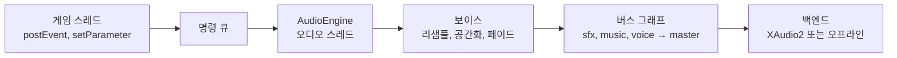

# Audio — 소프트웨어 믹서와 사운드 이벤트

> **[🏠 위키 홈으로 돌아가기](../../../README.md)** | **[📖 문서 지도](../../../docs/02_DocumentMap.md)**

## 이것은 무엇이고 왜 있나

게임의 소리는 클립 하나를 트는 것으로 끝나지 않습니다. 발소리는 매번 조금씩 다르게 들려야 하고, 벽 뒤의 폭발은 먹먹하게 들려야 하며, 동굴에 들어가면 울림이 생겨야 합니다.
동시에 소리가 너무 많이 나면 중요한 소리부터 남겨야 합니다. 이 폴더가 이런 일을 합니다.

엔진의 오디오는 **플랫폼과 무관한 소프트웨어 믹서**(`AudioEngine`)와, 믹서의 출력을 장치로 보내는 얇은 백엔드로 나뉩니다.
믹서, 보이스, 버스 그래프, 이펙트는 모두 엔진 코드이고 서드파티 오디오 라이브러리를 쓰지 않습니다. 백엔드는 출력 장치를 열고 닫는 일만 합니다.
Wwise 나 FMOD 같은 오디오 미들웨어가 하는 일(버스, 이벤트, 컨테이너, 파라미터, 스냅샷, 적응형 음악)을 작은 규모로 직접 구현해 볼 수 있는 곳입니다.

## 머릿속 그림



**보이스.** 지금 재생 중인 소리 하나입니다(`AudioVoice`). 재생 위치, 피치, 팬, 페이드를 가지고 있습니다. 들리지 않는 보이스는 섞지 않고 시간만 흐르는 **가상 보이스**가 될 수 있습니다.

**버스.** 보이스가 섞이는 경로입니다. `sfx`, `music`, `voice` 같은 버스가 부모 버스로 모이고, 맨 위는 `master` 하나입니다. 언리얼의 서브믹스, Wwise 의 버스 계층에 해당합니다.

**이벤트.** 게임 코드는 클립 경로 대신 이벤트 이름(`"Footstep"`)만 압니다. 어떤 클립을 어떤 규칙으로 낼지는 이벤트 라이브러리 데이터(`*.audioevents.xml`)가 정합니다.

**명령과 게시.** 게임 스레드는 명령만 쌓고, 오디오 스레드만 엔진 상태를 바꿉니다. 게임 스레드가 읽는 값(`isPlaying`, `getStats`)은 블록마다 게시한 사본입니다.

## 따라 해 보기 — 이벤트로 소리 내기

Shooter3D 가 플레이어가 착지할 때와 적을 맞혔을 때 소리를 내는 방법을 따라가 보겠습니다.

### 1단계 — 이벤트 라이브러리 쓰기

`Resource/game/shooter3d/audio/shooter3d.audioevents.xml` 의 한 이벤트입니다.

```xml
<AudioEventDesc _name="Land" _bus="sfx" _container="Random" _priority="40" _cooldownSeconds="0.15"
                _maxInstances="2" _steal="Oldest" _volumeDbMin="-4" _volumeDbMax="0" _pitchMin="-1.5" _pitchMax="1">
    <_listClip>
        <AudioClipEntry _path="game/shooter3d/sounds/footstep_concrete_000.ogg" />
    </_listClip>
</AudioEventDesc>
```

착지 소리는 `sfx` 버스로 나가고, 재생할 때마다 볼륨(-4 ~ 0 dB)과 피치(-1.5 ~ +1 반음)를 무작위로 골라 매번 조금씩 다르게 들립니다.
0.15초 안에 다시 요청하면 무시하고(쿨다운), 동시에 두 개를 넘으면 가장 오래된 것을 멈춥니다.

### 2단계 — 라이브러리 로드

```cpp
bool Shooter3DGame::onInitialize()
{
    if ( GameSound::loadEvents( Shooter3DGameInternal::kAudioEvents ) == false )
        SW_LOG_WARNING( "[Shooter] %# could not be loaded - sounds stay silent", Shooter3DGameInternal::kAudioEvents );
    // …
}
```

`GameSound` 는 GameFramework 의 도우미입니다. 오디오 서비스를 찾고, 서비스가 없는 구성(헤드리스, 테스트)에서는 조용히 넘어갑니다.
로드할 때 파일 안의 규칙과 버스 그래프를 함께 검사하고, 맞지 않으면 오류를 남기고 로드하지 않습니다.

### 3단계 — 틱에서 이벤트 내기

```cpp
_soundQueue.queueEvent( "Land" );           // 틱(워커 스레드) 안
_soundQueue.playAll();                      // 틱 뒤 게임 스레드에서
```

오디오 명령은 게임 스레드에서만 내야 합니다. 컴포넌트의 틱은 워커 스레드에서 돌기 때문에, 틱에서는 `GameSoundQueue` 에 쌓아 두었다가 틱 뒤에 냅니다.
틱 밖이라면 `GameSound::postEvent( 이름 )` 이나, 월드 위치에서 내는 `GameSound::postEventAt( 이름, 위치 )` 를 바로 불러도 됩니다.

오브젝트를 따라다니는 소리나 루프 소리는 `AudioEmitterComponent` 를 붙이고 `_event` 프로퍼티에 이벤트 이름을 적습니다. 시작할 때 소리가 나고 끝날 때 멈춥니다.

## 작동 원리

### 형식과 스레드

믹서는 **48 kHz, 스테레오, float32 교차 배치** 한 가지 형식으로 돕니다. 클립은 읽을 때 float 로 풀고, 3채널 이상이면 앞의 두 채널만 씁니다. 재생할 때 피치와 함께 선형 보간으로 리샘플합니다.

렌더는 **블록**(`audio::kBlockFrameCount`, 256프레임, 약 5.3ms) 단위입니다. 블록을 시작할 때 쌓인 명령을 적용하고, 볼륨과 팬은 블록 안에서 샘플마다 천천히 바꿔 지퍼 잡음이 나지 않게 합니다.
장치 버퍼 길이와 블록 길이는 관계없습니다. `render` 가 블록을 잘라 이어 줍니다.

오디오 스레드는 장치 콜백(XAudio2 의 버퍼 끝 콜백)입니다. 장치가 없으면 게임 스레드의 `IAudioSystem::update` 가 흐른 시간만큼 렌더합니다.
그래서 재생이 끝나는 시각과 가상 보이스는 장치가 있을 때와 똑같이 흐릅니다.

**결정적입니다.** 같은 명령과 같은 씨앗(`setRandomSeed`)이면 같은 샘플이 나옵니다.
그래서 오디오 테스트는 장치 없이 `AudioEngine` 을 만들고 `render` 로 버퍼에 렌더한 뒤, 평균, RMS, 피크, 특정 주파수의 진폭, 첫 소리 프레임 같은 수치로 확인합니다(`Test/EngineTest/AudioTestUtil.h`).

### 클립과 디코드

`AudioClip` 은 float 샘플이고, `AudioClipStore` 가 경로로 클립을 캐시하고 비동기로 디코드합니다. 공통 디코더(`AudioClipDecoder`)는 WAV 와 OGG 를 읽습니다.
OGG 디코더(stb_vorbis)의 메모리는 엔진 아레나에서 받고, 256KB 에서 시작해 64MB 를 넘지 않습니다(`AudioVorbisDecode.cpp`). 깨진 파일이 과하게 할당하거나 누수를 내더라도 아레나 안에서 끝납니다.
공통 디코더가 못 읽는 형식(MP3, ADPCM WAV)은 백엔드의 대체 디코더(`AudioClipStore::setFallbackDecoder`)가 풉니다. Windows 는 Media Foundation 을 씁니다.

### 버스 그래프

데이터는 `engine/audio/default.audiomixer.xml` 이고, 파일이 없으면 `AudioMixerDesc::makeDefault` 를 씁니다. 게임은 `IAudioSystem::loadMixer` 로 그래프를 바꿀 수 있고, 재생 중인 보이스는 같은 이름의 버스로 옮겨 갑니다.

```xml
<AudioMixerDesc _maxVoiceCount="256" _maxRealVoiceCount="64" _inaudibleDb="-60">
    <_listBus>
        <AudioBusDesc _name="master" />
        <AudioBusDesc _name="sfx" _parent="master" _volumeDb="-3">
            <_listSend><AudioSendDesc _bus="reverb" _levelDb="-14" _bPreFader="false" /></_listSend>
        </AudioBusDesc>
    </_listBus>
</AudioMixerDesc>
```

- 루트는 `master` 하나입니다. 부모와 센드 대상은 이름으로 적습니다. 모르는 이름, 겹친 이름, 순환은 **읽기 오류**입니다.
- 처리 순서는 보내는 버스가 먼저인 위상 순서입니다. 각 버스는 입력(보이스, 자식 버스, 센드의 합)을 받아 프리 페이더 센드, 페이더, 포스트 페이더 센드를 거쳐 부모로 보냅니다.
- **페이더 게인은 데이터 볼륨(dB), 사용자 볼륨, 스냅샷 오프셋(dB), 음소거와 솔로를 곱한 값입니다.**
  사용자 볼륨은 옵션 메뉴의 `audio.busVolume` 이 `IAudioSystem::setBusVolume` 으로 넣고, 그래프를 바꿔도 버스 이름으로 유지됩니다. 음소거(`setMute`)는 `master` 한 곳에만 겁니다.
- 버스 하나라도 솔로면, 솔로 버스의 조상(신호가 지나는 경로)과 자손만 소리를 냅니다. DAW 와 Wwise 의 솔로와 같습니다.

### 이펙트

버스마다 인서트 체인(`AudioBusDesc::_listEffect`)이 있고, 센드와 페이더 전에 순서대로 실행합니다. 이펙트 종류는 `AudioEffectRegistry` 에 이름으로 등록되어 있습니다(`Dsp/AudioEffect`).
데이터는 종류 이름과 파라미터 이름으로만 고르고, 모르는 종류나 파라미터, 같은 버스의 겹친 이펙트 이름은 읽기 오류입니다.

| 종류 | 알고리즘 |
|---|---|
| `LowPass`, `HighPass`, `BandPass`, `Peaking`, `LowShelf`, `HighShelf` | RBJ cookbook 2차 바이쿼드 |
| `Compressor` | 피드 포워드, 스테레오 링크 피크, 소프트 니 |
| `Limiter` | 미리 보기(lookahead) 브릭월 리미터 |
| `Reverb` | Freeverb(콤 필터 8개, 올패스 4개) |
| `Delay` | 피드백 경로에 로우패스가 있는 딜레이 |

파라미터 이름과 기본값은 `Dsp/AudioEffect.h` 에 있습니다. 20kHz 로우패스와 10Hz 하이패스는 아무것도 하지 않으므로 계산을 건너뜁니다. 스냅샷이 평소에는 열어 두는 필터를 비용 없이 걸어 둘 수 있습니다.
리미터는 출력이 천장 값을 넘지 않습니다. 필요한 게인의 최솟값을 미리 보기 창에서 구해 다듬고, 소리를 그만큼 늦추기 때문입니다.

기본 그래프는 `master` 에 리미터(-1 dBFS)를, `reverb` 리턴 버스에 리버브를 두고, `sfx`, `voice`, `ambient` 가 센드로 리버브에 보냅니다.
이펙트 이름(`AudioEffectDesc::_name`, 비우면 종류 이름)은 스냅샷이 파라미터를 바꿀 때 씁니다.

### 공간화

보이스에 에미터(`_emitterID`)와 감쇠 프리셋(`_attenuation`)이 모두 있으면 블록마다 리스너 기준으로 공간화합니다. 하나라도 없으면 공간화하지 않는 2D 소리입니다(`AudioSpatial`).
감쇠 프리셋은 믹서 데이터의 `_listAttenuation` 에 있습니다. Wwise 의 Attenuation ShareSet, 언리얼의 Sound Attenuation 에 해당합니다.

**리스너.** `setListener( 번호, AudioListenerState )` 로 최대 4개(화면 분할)를 둡니다. 리스너가 여럿이면 보이스마다 가장 크게 들리는 리스너를 기준으로 계산합니다. 리스너를 섞는 다중 리스너 믹스는 없습니다.

**팬.** 3D 모드(`World3D`)는 소리 방향의 리스너 오른쪽 성분으로 좌우를 정하고, 고도는 쓰지 않습니다. 리스너에 아주 가까운 소리는 가운데로 모읍니다.
모노 소리는 등전력 팬(가운데 -3 dB)이고 스테레오 소리는 밸런스입니다. HRTF(바이노럴)와 서라운드 출력은 없고, 출력은 스테레오입니다.

**2D 모드**(`Screen2D`)는 화면 가로 거리를 화면 반폭(`_screenHalfWidth`)으로 나눈 값으로 팬을 정하고, 거리는 시선 방향 성분을 뺀 화면 평면 거리로 계산합니다.
옆에서 본 2D 게임(XY 세계)은 XY 거리를, 위에서 본 직교 카메라(XZ 세계)는 XZ 거리를 씁니다.

**거리 감쇠**는 `Linear`, `Inverse`(OpenAL 의 inverse clamped), `InverseSquare`, `Custom`(거리와 dB 점 목록) 가운데 고릅니다. 공기 흡수는 거리에 따른 로우패스 주파수로 표현합니다.

**도플러.** 비율은 `(c − v_리스너·u) / (c − v_소스·u)` 이고, `u` 는 소스에서 리스너로 향하는 방향, `c` 는 음속입니다.
속도는 음속의 절반 안으로 자르고, 비율은 [0.5, 2] 로 자른 뒤 프리셋의 세기(`_dopplerFactor`, 0 이면 끔)만큼 적용합니다.

**가림.** 게임 스레드가 0 ~ 1 의 가림 값을 구해(`IAudioOcclusionQuery`) `setEmitterOcclusion` 으로 넣습니다.
엔진은 `_occlusion._smoothingSeconds` 동안 그 값을 따라가며 볼륨(`_volumeDb` × 값)과 로우패스(20kHz 에서 `_lowPassHz` 까지, 로그 축)를 바꿉니다. 프리셋의 `_bOcclusion` 이 꺼져 있으면 무시합니다.
가림(occlusion)과 막힘(obstruction)을 따로 두지 않고 한 값으로 다룹니다.

### 이벤트

라이브러리(`AudioEventLibrary`)가 이벤트마다 클립, 버스, 감쇠, 재생 규칙을 정합니다.
Wwise 의 Event, Random/Sequence/Blend 컨테이너, Playback Limit, RTPC 에 해당합니다. FMOD 의 Event 와 Parameter, 언리얼의 Sound Cue 와 Sound Concurrency 도 같은 역할입니다.

**컨테이너.** `Random` 은 가중치로 고르고, `_bAvoidRepeat` 이면 바로 앞의 클립을 제외합니다. `Sequence` 는 이벤트마다 커서로 차례대로 고르고, `Layer` 는 모든 클립을 함께 냅니다.
볼륨과 피치 범위는 재생마다 한 번 뽑아 레이어들이 함께 씁니다. 난수는 엔진 씨앗을 쓰므로 결정적입니다.

**쿨다운과 동시 재생 상한.** 쿨다운은 렌더한 프레임으로 잰 오디오 시각을 기준으로 합니다. `_maxInstances`(0 이면 제한 없음)를 넘으면 `_steal` 이 정한 방식으로 처리합니다.
`Reject` 는 새 요청을 버리고, `Oldest`, `Quietest`, `Farthest` 는 그 기준으로 기존 인스턴스 하나를 뺏습니다. 뺏긴 인스턴스는 `_fadeOutSeconds` 동안 사라지고 상한 계산에서 빠집니다.

**실제 보이스 상한과 가상화.** 믹서가 실제로 섞는 보이스는 그래프의 `_maxRealVoiceCount` 개까지입니다. 블록마다 보이스의 들림 정도를 계산합니다.
들림 정도는 보이스 자신의 게인(거리, 가림, 파라미터, 페이드 목표)이고 버스 페이더는 넣지 않습니다. `_inaudibleDb` 보다 작으면 들리지 않는 보이스입니다.
나머지를 우선순위, 들림 정도 순으로 상한까지 섞고, 밖으로 밀린 보이스는 이벤트의 `_virtual` 이 정한 대로 처리합니다.

| `_virtual` | 상한 밖이거나 들리지 않을 때 |
|---|---|
| `Virtualize` | 섞지 않고 시간만 흐릅니다. 다시 들리면 그 위치에서 게인 0 부터 이어 재생합니다 |
| `Stop` | 들리지 않으면 바로, 밀렸으면 한 블록 페이드로 멈춥니다 |
| `KeepReal` | 늘 섞고, 상한을 먼저 차지합니다 |

**파라미터(RTPC).** `setParameter` 는 전역 파라미터를, `setEmitterParameter` 는 에미터마다의 파라미터를 바꿉니다. 에미터 값이 전역 값보다 우선합니다.
값은 라이브러리의 범위로 자르고 `_seekSpeed`(초당 단위)로 따라갑니다. `AudioParameterMapping` 곡선이 볼륨(dB, 더함), 피치(반음, 더함), 로우패스(Hz, 낮은 쪽)를 정합니다.

**로드 검사.** `AudioEngine::loadEventLibrary( 이름, 라이브러리 )` 는 세 가지를 확인합니다.
파일 안의 규칙(이름, 클립, 범위, 곡선 순서, 모르는 파라미터), 그래프와의 대조(버스, 감쇠 프리셋), 다른 라이브러리와의 이벤트와 파라미터 이름 충돌입니다. 하나라도 어긋나면 오류이고 로드하지 않습니다.
같은 이름으로 다시 로드하면 교체합니다(핫 리로드). 쿨다운과 순서 커서는 이름으로 이어집니다. 로드할 때 클립 디코드도 시작합니다(뱅크 로드). 재생 중인 인스턴스는 자기 라이브러리를 끝까지 씁니다.

### 스냅샷

스냅샷은 버스 페이더 오프셋(dB), 센드 레벨, 이펙트 파라미터를 묶은 것이고, 그래프 데이터의 `_listSnapshot` 에 있습니다. Wwise 의 State, FMOD 의 Snapshot, 언리얼의 Sound Mix 에 해당합니다.

`startSnapshot` 과 `stopSnapshot` 은 `_fadeInSeconds`, `_fadeOutSeconds` 동안 세기를 0 과 1 사이로 옮기고, `setSnapshotIntensity` 는 세기를 바로 정합니다. 리버브 존의 경계 블렌드가 `setSnapshotIntensity` 를 씁니다.
버스 오프셋은 세기 × dB 를 **더합니다.** 센드와 이펙트 파라미터는 데이터 값에서 시작해 **켠 순서대로** 세기만큼 보간하고, 주파수 파라미터는 로그 축으로 보간합니다. 모든 스냅샷이 빠지면 데이터 값으로 돌아옵니다.
기본 그래프에는 `Underwater`, `PauseMenu`, `Cave`, `Hall` 스냅샷이 있습니다.

### 적응형 음악

`*.music.xml`(`AudioMusicDesc`)은 템포, 구간, 레이어, 전환 규칙을 정합니다. Wwise 의 Interactive Music, FMOD 의 transition marker 에 해당합니다.
`IAudioSystem::playAdaptiveMusic( 경로 )` 나 `AudioEngine::startMusic` 으로 시작하고, `setMusicSegment( 이름 )` 으로 구간을 바꿉니다.

**템포.** 음악의 `_tempo` 와 `_beatsPerBar` 로 박과 마디를 정하고, 구간이 덮어쓸 수 있습니다. 구간 길이는 마디 수 × 마디당 박 수 × 박 길이이고, 클립은 이 길이로 만듭니다.
`getMusicStatus()` 가 지금 구간, 박(소수), 마디, 템포를 게시하므로 박자에 맞춘 게임플레이에 쓸 수 있습니다.

**가로 재배치.** 구간을 바꿀 때는 전환 규칙(`_listTransition`)의 맞춤 지점(`Immediate`, `NextBeat`, `NextBar`, `SegmentEnd`)을 렌더 프레임으로 계산합니다.
구간을 적은 규칙이 `*` 규칙보다 먼저입니다. 새 구간 레이어는 그 프레임까지 시작을 늦추고, 옛 레이어는 그 프레임부터 페이드아웃하므로 **샘플 단위로 정확하게** 바뀝니다.
그 시점에 스팅어(한 번 나는 소리)가 납니다. 기다리는 동안 다른 구간을 요청하면 경계는 그대로 두고 목적지만 바꿉니다.
반복하지 않는 구간은 끝에서 `_next` 구간으로 이어집니다. 클립 디코드가 늦게 끝나면 그만큼 앞부분을 건너뛰어 박을 지킵니다.

**세로 레이어.** 레이어마다 게임 파라미터를 dB 로 바꾸는 곡선이 있고, 볼륨을 `_layerFadeSeconds` 동안 옮깁니다. 긴장도 파라미터가 오르면 드럼 레이어가 들어오는 식으로 씁니다.

음악 보이스는 `KeepReal`(가상화하지 않음)이고 우선순위가 100 입니다. 버스는 `_bus` 이고, 비우면 `music` 입니다.

### 씬 연결과 오디오 컴포넌트

오디오 컴포넌트는 틱하지 않고, 씬의 `SceneAudio`(`GameObjectManager` 소유)에 등록합니다.
활성 씬의 틱이 끝나면 `Scene::tick` 이 게임 스레드에서 `SceneAudio::update` 를 한 번 부르고, 그것이 리스너와 에미터의 위치, 속도, 가림, 리버브 존 세기를 엔진에 넣습니다.

| 컴포넌트 | 하는 일 |
|---|---|
| (없음) | 게임 카메라가 리스너 0 입니다. 직교 카메라면 `Screen2D` 모드입니다 |
| `AudioListenerComponent` | 카메라 대신 그 위치를 리스너로 씁니다 |
| `AudioEmitterComponent` | 이벤트를 내고, 위치와 속도를 프레임마다 넣습니다 |
| `AudioAmbientEmitterComponent` | 점, 상자, 구 모양의 루프 환경음 |
| `AudioReverbZoneComponent` | 상자나 구 안에 들어간 깊이로 스냅샷 세기를 정합니다 |

- 직교 카메라의 화면 반폭은 직교 높이 × 16/9 ÷ 2 로 가정합니다. 정확한 반폭이 필요하면 리스너 컴포넌트에 적습니다. 리스너 컴포넌트는 3인칭 머리 위치나 화면 분할 슬롯(0 ~ 3)에도 씁니다.
- 에미터 id 는 컴포넌트 id 입니다. `post( 이벤트 )`, `stopAll`, `setParameter` 를 제공합니다.
- 환경음은 리스너 쪽으로 **가장 가까운 점**에서 소리를 냅니다. 리스너가 모양 안에 있으면 리스너 위치에서 납니다. 가림은 기본으로 꺼져 있습니다.
- 리버브 존은 경계에서 0, `_fadeDistance` 안쪽에서 1 인 세기로 스냅샷(`Cave`, `Hall`, `Underwater`)을 겁니다. 같은 스냅샷을 쓰는 존이 여럿이면 가장 큰 세기를 씁니다.

**가림 질의.** 3D 물리 씬이 있으면 `PhysicsAudioOcclusionQuery` 가 `IPhysicsScene3D::raycast` 광선 세 개(가운데와 좌우)를 쏴 막힌 비율을 구합니다. 에미터 몇 개씩 프레임마다 돌아가며 계산하고, 오프셋 값은 헤더에 있습니다.
물리 씬이 없거나 2D(Box2D) 씬이면 가림은 0 입니다. `setOcclusionQuery` 로 내비메시나 방 그래프 같은 다른 기하를 쓰는 질의로 바꿀 수 있습니다.

사라진 에미터는 엔진에서 바로 지우지 않고, 그 위치의 한 번짜리 소리가 끝난 뒤 지웁니다. 위치를 잃은 소리가 2D 로 돌아가 크게 들리지 않게 하기 위해서입니다.
엔진은 오디오 서비스(`engine::getAudioSystem`)의 것이고, 테스트는 `SceneAudio::setAudioEngine` 으로 장치 없는 엔진을 연결합니다.

### 클립을 바로 재생하기

이벤트 없이 클립을 바로 틀 수도 있습니다.

```cpp
IAudioSystem* pAudio = game::getService<IAudioSystem>();
pAudio->play( "game/x/sounds/click.ogg", hashed_string( "ui" ) ); // 버스를 고른다. 비우면 sfx
pAudio->playMusic( "game/x/music/theme.ogg" );                     // music 버스 루프. 곡이 바뀌면 0.25초 크로스페이드
AudioEngine& engine = pAudio->getEngine();                         // 이벤트, 파라미터, 스냅샷, 음악, 공간화
```

### 플랫폼

**Windows** 는 `XAudio2System` 입니다. 마스터링 보이스와, float32 스테레오 48kHz 소스 보이스 하나를 씁니다. 512프레임 버퍼 세 개를 돌려 쓰고, 버퍼가 끝날 때마다 XAudio2 처리 스레드에서 다음 버퍼를 렌더해 제출합니다.
지연은 약 21ms 에 블록 하나를 더한 정도입니다. 장치를 열지 못하면 오프라인으로 돌고 로그에 `offline - no device` 를 남깁니다.

**Linux** 에는 출력 백엔드가 없고 `NullAudioSystem` 으로 오프라인 렌더합니다. 엔진 코드에는 플랫폼 분기가 없습니다.

**립싱크 임포트.** `App --import-lipsync` 는 `voice/` 폴더의 음성 파일을 분석해 비즘 트랙(`.visemes.json`)을 곁에 씁니다(`LipSyncImport`). 분석기와 트랙 형식은 `Animation/Facial/LipSync` 에 있습니다.

## 확장하는 법

### 새 버스 이펙트

1. `Dsp/AudioEffect.h` 의 `IAudioEffect` 를 구현합니다. 파라미터 이름과 기본값을 선언하면, 데이터에 모르는 파라미터가 있을 때 읽기 오류가 됩니다.
2. `AudioEffectRegistry` 에 종류 이름으로 등록합니다.
3. 믹서 데이터의 버스 `_listEffect` 에 그 이름을 씁니다. 스냅샷에서 파라미터를 바꾸려면 이펙트 이름을 붙입니다.

테스트는 장치 없는 `AudioEngine` 으로 렌더해 수치로 확인합니다(`Test/EngineTest/AudioTestUtil.h`).

### 새 출력 백엔드

`IAudioSystem` 을 상속하고 `openOutput` 과 `closeOutput` 을 구현합니다. 장치 콜백에서 `AudioEngine::render` 로 버퍼를 채웁니다. 믹스는 모두 엔진이 하므로 백엔드는 장치만 다룹니다.
공통 디코더가 못 읽는 형식이 있으면 `AudioClipStore::setFallbackDecoder` 로 대체 디코더를 등록합니다.

## 함정과 주의

**오디오 장치가 없는 환경을 오류로 다루지 마세요.** GitHub 의 Windows 러너에는 출력 장치가 없어 `CreateMasteringVoice` 가 `0x80070490`(`ERROR_NOT_FOUND`)을 돌려줍니다.
출력의 `[Warning]` 줄을 세는 테스트(`AppCookTest`)가 이것 때문에 실패한 적이 있습니다. 그래서 장치가 없으면 Info 로그만 남기고 오프라인 렌더로 돕니다.

**틱 안에서 오디오를 직접 부르지 마세요.** 오디오 명령은 게임 스레드에서만 냅니다. 틱에서는 `GameSoundQueue` 에 쌓았다가 틱 뒤에 냅니다.

**볼륨 설정을 버스 데이터 볼륨에 쓰지 마세요.** 옵션 메뉴의 볼륨은 같은 이름 버스의 사용자 볼륨이고, 데이터 볼륨과 따로 곱해집니다. 그래프를 바꿔도 사용자 볼륨은 이름으로 남습니다.

**소리 동작은 귀가 아니라 수치로 확인하세요.** `AudioEngine::render` 로 버퍼에 렌더하면 결정적인 결과가 나오므로, RMS 나 주파수 진폭으로 테스트할 수 있습니다.

## 더 볼 곳

- [Object](../Object/README.md) — 컴포넌트 수명
- [Animation](../Animation/README.md) — 얼굴과 립싱크
- [Physics](../Physics/README.md) — 가림 질의가 쓰는 레이 캐스트

자주 여는 파일은 다음과 같습니다.

| 파일 | 내용 |
|---|---|
| `IAudioSystem.h` | 오디오 서비스, 볼륨, 음악 |
| `AudioEngine.h` | 명령, 이벤트, 파라미터, 스냅샷 |
| `AudioMixerDesc.h` | 버스 그래프 데이터 |
| `AudioEvent.h` | 이벤트 라이브러리 데이터 |
| `AudioMusic.h` | 적응형 음악 데이터 |
| `AudioSpatial.h` | 리스너, 감쇠, 가림 |
| `Dsp/AudioEffect.h` | 이펙트 종류와 파라미터 |
| `Object/GameObject/SceneAudio.h` | 씬과 오디오 연결 |
