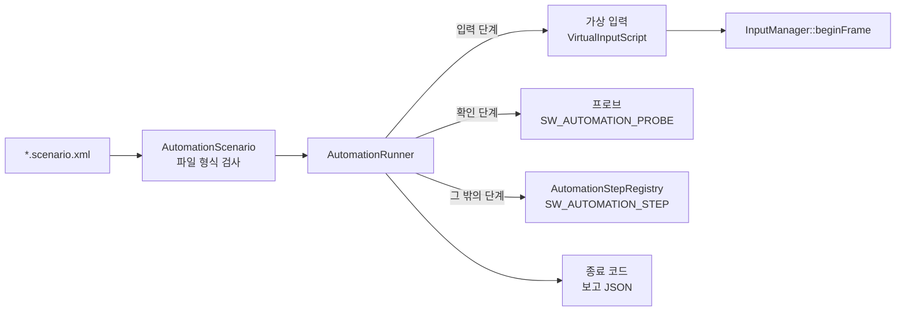

# Automation — 자동화 시나리오

## 이것은 무엇이고 왜 있나

"무기 교체 키를 한 번 누르면 무기가 정확히 다음 무기로 한 번만 바뀌는가", "창을 닫으면 10초 안에 프로세스가 끝나는가" 같은 확인은 실제 App을 띄워야만 할 수 있습니다.
이런 확인을 사람이 손으로 하거나 OS 입력을 흉내 내는 외부 스크립트로 하면, 실행할 때마다 결과가 달라지고 다시 돌리기도 어렵습니다.

이 모듈은 그런 확인을 **시나리오 파일 하나**로 적게 합니다. 시나리오는 "몇 번째 프레임에 무슨 입력을 넣고 무엇을 확인한다"를 XML로 적은 것입니다.
App을 `-scenario=` 인자로 실행하면 시나리오대로 입력을 넣고 확인한 뒤, 결과를 **종료 코드**로 돌려줍니다.

언리얼의 Functional Test(레벨 안에서 단계와 단언을 실행)와 Gauntlet(프로세스를 띄워 결과 코드와 로그를 수집)을 합친 것에 해당합니다.
유니티 Test Framework의 `InputTestFixture.Press/Release` 와 프레임 단위 `yield` 도 같은 일을 합니다. 다른 점은 시나리오가 코드가 아니라 데이터라서, 새 시나리오를 쓰는 데 빌드가 필요 없다는 것입니다.

엔진 계층으로는 8층입니다.

## 머릿속 그림



**프레임과 고정 시간.** 시나리오의 프레임 번호는 시작 조건이 처음 참이 된 프레임이 0입니다. 시나리오가 도는 동안 App은 벽시계 대신 고정 프레임 시간(`fixedDelta`)을 씁니다.
그래서 같은 시나리오는 어느 기계에서나 같은 프레임에 같은 일이 일어납니다.

**단계.** 시나리오의 각 동작을 단계라고 부릅니다. 단계는 입력(`Tap`, `MouseDelta`), 환경(`Variable`, `CloseWindow`), 결과 확인(`Expect`, `ExpectImage`), 끝(`Pass`, `Fail`)으로 나뉩니다.
엔진이 모르는 단계는 다른 모듈이 레지스트리에 등록합니다.

**프로브.** 프로브(probe)는 시나리오가 읽을 수 있게 게임이 이름을 붙여 내놓은 값입니다. `Shooter3D.WeaponIndex` 처럼 씁니다. `<Expect>` 단계가 프로브 값을 확인합니다.

**종료 코드.** 결과는 프로세스 종료 코드로 나옵니다(`AutomationResult`).

| 코드 | 뜻 |
|---|---|
| 0 | 통과 |
| 10 | 실패. 단언이 하나라도 틀렸습니다 |
| 11 | 읽기 오류. 파일 형식, 모르는 단계나 속성, 모르는 프로브, 모르는 전역 변수 |
| 12 | 시간 초과. 시작 조건이나 `<Pass/>` 가 제한 프레임 안에 오지 않았습니다 |
| 13 | 건너뜀. 이 기계에서 돌 수 없습니다(전경 창을 얻지 못한 경우 등) |

## 따라 해 보기 — 무기 교체 시나리오

Shooter3D의 `weaponswitch` 시나리오입니다. E 키를 짧게, 길게, 같은 프레임에 눌렀다 떼도 무기가 정확히 한 단계씩 바뀌는지 확인합니다.

**1단계 — 시나리오 파일을 씁니다.** 게임 팩의 `automation/` 폴더에 `<이름>.scenario.xml` 을 만듭니다.

<!-- snippet: Resource/game/shooter3d/automation/weaponswitch.scenario.xml 의 앞부분과 끝 — 5b U7 에서 대조 -->
```xml
<Scenario name="shooter3d.weaponswitch" fixedDelta="0.0166667" timeoutFrames="600" startAfter="ScenePlaying" startTimeoutFrames="900" input="exclusive">
	<At frame="0">
		<Variable name="gv_shooterAutoPlay" value="0"/>
		<Expect probe="Shooter3D.WeaponIndex" equals="0"/>
	</At>
	<!-- E 를 한 프레임 -->
	<At frame="20"><Tap slot="Key.E" hold="1"/></At>
	<At frame="30"><Expect probe="Shooter3D.WeaponIndex" equals="1"/></At>
	<!-- ... -->
	<At frame="280">
		<Expect probe="Shooter3D.PlayerAlive" equals="1"/>
		<ExpectLog contains="[Shooter] " atLeast="7" since="1"/>
		<Pass/>
	</At>
</Scenario>
```

0 프레임에서 자동 플레이를 끄고, 20 프레임에 E를 한 프레임 누르고, 30 프레임에 무기 번호가 1인지 확인합니다. 마지막에 `<Pass/>` 로 끝냅니다.
같은 프레임의 단계는 적은 순서대로 실행됩니다.

**2단계 — 실행합니다.**

```powershell
cd build/Ninja-Debug-Shooter3D/Bin
./App.exe -dx12 -scenario=game/shooter3d/automation/weaponswitch.scenario.xml -scenario-report=Saved/Automation/ws.json
echo $LASTEXITCODE
```

로그에 `[Scenario] PASS shooter3d.weaponswitch (280 frame(s))` 가 찍히고 종료 코드가 0이면 통과입니다. 실패하면 `[Scenario] FAIL` 줄 뒤에 실패한 단언이 한 줄씩 나옵니다.
`-scenario-report` 를 주면 같은 결과를 JSON으로도 씁니다. 스크린샷 같은 산출물은 `Saved/Automation/<시나리오 이름>/` 에 생깁니다.

**3단계 — CTest에 넣습니다.** 할 일이 없습니다. 파일을 `automation/` 폴더에 두기만 하면 `AppScenarioTest` 가 찾아서 돌립니다(아래 "작동 원리").

## 작동 원리

### 루트 속성

| 속성 | 기본값 | 뜻 |
|---|---|---|
| `name` | 필수 | 보고와 산출물 폴더 이름 |
| `fixedDelta` | `1/60` | 프레임마다 흐르는 시간(초) |
| `timeoutFrames` | 3600 | 이 프레임 수 안에 `<Pass/>` 가 없으면 12 |
| `startAfter` | `ScenePlaying` | 시작 조건. `ScenePlaying` 또는 `Immediately` |
| `startTimeoutFrames` | 1200 | 시작 조건을 이만큼 기다려도 오지 않으면 12 |
| `input` | `exclusive` | `exclusive` 는 OS 입력을 무시하고, `mixed` 는 OS 입력도 받습니다 |

`ScenePlaying` 은 활성 씬이 플레이를 시작했고 로딩 화면이 사라진 첫 프레임입니다. 로딩 화면이 게임 입력을 막기 때문에 그 뒤에 시작합니다.
`mixed` 는 진짜 OS 창 상태를 확인하는 시나리오에 씁니다. 이때 실행 중에 사람이 키보드나 마우스를 만지면 그 입력도 섞입니다.

### 엔진 단계

엔진이 직접 처리하는 단계입니다. 속성의 허용 값과 오류 메시지는 `AutomationRunner::validateEngineStep` 에 있습니다.

| 단계 | 속성 | 하는 일 |
|---|---|---|
| `Press`, `Release` | `slot` | 가상 입력 사건을 넣습니다 |
| `Tap` | `slot`, `hold`(프레임, 기본 1) | 누르고 `hold` 프레임 뒤에 뗍니다. 0이면 같은 프레임에 뗍니다 |
| `MouseDelta` | `x`, `y`(픽셀) | 마우스 이동량(`MouseRawDelta`) |
| `MousePosition` | `x`, `y`(창 클라이언트 영역의 0..1 비율) | 커서를 옮깁니다(`MouseMove`) |
| `GamepadAxis` | `axis`, `value`, `pad` | 게임패드 축 값 |
| `Text` | `value` | 글자 입력 |
| `Variable` | `name`, `value` | 전역 변수(gv) 값을 바꿉니다 |
| `Expect` | `probe` 와 비교 하나 | 프로브 값을 확인합니다 |
| `ExpectLog` | `contains`, `count` 또는 `atLeast`, `since` | 시나리오 동안 그 글을 담은 로그 줄 수를 확인합니다 |
| `Screenshot` | `file` | 그 프레임의 화면을 PPM으로 저장합니다 |
| `ExpectImage` | `file`, `metric`, `region`, `ratio`, `reference` 와 비교 하나 | 스크린샷 영역의 지표를 확인합니다 |
| `CloseWindow` | `withinSeconds`(기본 10) | 창 닫기를 요청하고, 그 시간 안에 루프가 끝나야 통과입니다 |
| `ExpectExitWithin` | `seconds`(기본 10) | 앞 단계가 창을 닫게 했을 때, 그 시간 안에 끝나야 통과입니다 |
| `Pass`, `Fail`, `Skip` | `reason`(`Fail`, `Skip`) | 시나리오를 끝냅니다 |

- `slot` 은 `InputSlotUtil` 의 문자열입니다(`Key.E`, `Mouse.Left`, `Gamepad.A`, 두 번째 패드는 `Gamepad1.A`).
- `MousePosition` 의 비율은 시작할 때의 창 크기로 픽셀로 바뀝니다. 그 뒤의 마우스 버튼은 이 위치에서 눌립니다. RTS 선택이나 건물 배치처럼 커서 아래를 고르는 조작에 씁니다.
- 비교 속성은 `equals`, `near`(`tolerance` 와 함께), `atLeast`, `atMost` 중 정확히 하나입니다. `Expect` 는 틀려도 실패를 기록하고 계속 진행합니다.
- `ExpectLog` 는 실행기 자신의 `[Scenario]` 줄을 세지 않습니다.
- `Pass` 는 앞에서 실패가 기록되었으면 10으로 끝납니다.

### 등록 단계

엔진 밖 모듈이 `SW_AUTOMATION_STEP` 으로 등록하는 단계입니다. 실행기는 엔진 단계가 아니면 레지스트리(`AutomationStepRegistry`)에서 이름으로 찾습니다.

| 단계 | 속성 | 등록하는 곳 | 하는 일 |
|---|---|---|---|
| `Intent` | `pawn`, `move`, `up`, `yaw`, `pitch`, `buttons`, `frames` | GameFramework `ControlAutomationSteps` | 폰에 이동 의도를 직접 넣습니다 |
| `Possess` | `controller`, `pawn` | GameFramework `ControlAutomationSteps` | 컨트롤러가 빙의할 폰을 바꿉니다 |
| `ExpectUI` | `focus`, `screen`, `screens` 중 하나 이상 | `Engine/UI/Automation/UIAutomationSteps` | 런타임 UI의 포커스 위젯, 활성 화면, 화면 수를 확인합니다 |
| `UILayoutDump` | `file` | `Engine/UI/Automation/UIAutomationSteps` | UI 화면마다 위젯 이름과 픽셀 사각형을 파일로 씁니다 |
| `EditorClick` | `mark`, `button`(0..4), `mods`, `state`(`down`, `up`) | 에디터 `EditorScenarioSteps` | `mark` 이름이 붙은 위젯 가운데를 클릭합니다. `state="down"` 은 누른 채 두고 `up` 까지 커서를 그 자리에 붙잡습니다(뷰포트 비행 · 끌기) |
| `EditorText` | `value` | 에디터 `EditorScenarioSteps` | ImGui에 글자를 입력합니다 |
| `EditorKey` | `key`(ImGui 키 이름, 수정자는 `+` — `Enter`, `Escape`, `Ctrl+Z`), `state`(`down`, `up`) | 에디터 `EditorScenarioSteps` | 수정자를 누르고 키를 눌렀다 뗍니다(단축키, 입력 칸 확정). `state` 를 주면 누르기만, 떼기만 합니다(`D` 를 누른 채 몇 프레임) |
| `EditorExpectObject` | `name`, `count`(기본 1), `component`, `selected` | 에디터 `EditorScenarioSteps` | 활성 씬에서 그 이름의 오브젝트 수를 확인합니다. `component` 는 그 컴포넌트를 가진 것만, `selected=1` 은 선택된 것만 셉니다 |
| `EditorExpectDockLayout` | `minNodeSize`(px, 기본 24) | 에디터 `EditorScenarioSteps` | 창이 에디터 최소 크기 이상이고, 메인 뷰포트가 창과 같고, 보이는 도크 칸이 모두 화면 안에서 최소 변 이상인지 확인합니다 |
| `DevCommand` | `line` | `AutomationEnvironmentSteps` | 개발 명령(`SW_DEV_COMMAND`) 한 줄을 부릅니다(`play`, `stop`, `editor <커맨드 id>`, `scene.saveAs <경로>`). 모르는 명령은 읽기 오류, 명령이 false 면 실패입니다. Shipping 에는 없습니다 |
| `ResizeWindow` | `width`, `height`(픽셀) | `AutomationEnvironmentSteps` | 창을 창 모드의 그 클라이언트 크기로 바꿉니다. 창의 최소 크기보다 작으면 거기서 멈춥니다 |
| `PostWindowMessage` | `message` | `AutomationWindowSteps` | 자기 창에 OS 메시지를 보냅니다 |
| `ExpectCursorClip` | `state`(`locked`, `free`) | `AutomationWindowSteps` | 커서 가두기 상태를 확인합니다(`GetClipCursor`) |
| `RequireForeground` | 없음 | `AutomationWindowSteps` | 전경 창을 얻지 못하면 13으로 끝냅니다 |

- `Intent` 와 `Possess` 는 그 프레임의 입력 재생 **전**에 돕니다(등록 시 `_bBeforeInput` 이 참). 빙의와 의도는 [GameFramework README](../../GameFramework/README.md)의 Control 절에 있습니다.
- `ExpectUI` 와 같은 판정을 nogpu 테스트 `UINavigationScriptTest` 도 씁니다. `UILayoutDump` 결과는 `AppUITest` 가 스크린샷 안의 위젯을 이름으로 찾는 데 씁니다.
- 에디터 단계는 `-EnableEditor` 로 에디터를 켰을 때만 있습니다. 에디터 패널의 입력은 엔진 입력 계층이 아니라 ImGui가 Win32 메시지를 직접 받으므로, 가상 입력 장치가 아니라 ImGui 사건으로 넣습니다.
  이 단계를 쓰는 시나리오는 시작할 때 위젯 이름 기록(`EditorSelfTestMarks::note`)을 켭니다.
- 창 단계는 Windows에서만 동작하고, 다른 플랫폼에서는 같은 이름으로 13(건너뜀)을 냅니다.
  `PostWindowMessage` 의 `message` 는 `WM_ACTIVATE_INACTIVE`, `WM_ACTIVATE_ACTIVE`, `WM_KILLFOCUS`, `WM_SETFOCUS`, `WM_LBUTTONDOWN_CLIENT`, `WM_LBUTTONUP_CLIENT`, `WM_CLOSE` 중 하나입니다.
  `WM_CLOSE` 만 `PostMessage` 로 보내고, 나머지는 처리기가 끝난 뒤 돌아오는 `SendMessage` 로 보냅니다. 버튼 메시지는 클라이언트 영역 가운데를 누릅니다.
  커서 가두기는 전경 창에서만 걸리므로 `ExpectCursorClip` 앞에 `RequireForeground` 를 둡니다.

### 실행 순서

- 단계 종류와 프로브 이름은 시작 조건이 참이 되는 프레임에 검사합니다. 게임과 에디터 모듈이 등록하는 이름이 그때 모두 채워져 있기 때문입니다.
- 입력 단계는 시작할 때 가상 입력 소스로 옮겨지고, 각 프레임의 `InputManager::beginFrame` 에서 OS 사건과 같은 위치로 들어갑니다([Input README](../Input/README.md)).
- 확인 단계와 환경 단계는 그 프레임의 씬 틱 뒤, `EngineLoop::endFrame` 이 입력 프레임을 닫기 전에 돕니다.
- `EngineLoop` 는 시나리오를 시작할 때 App의 `gv_fixedFrameDelta` 를 시나리오의 `fixedDelta` 로 바꿉니다.
- 끝나면 `EngineLoop::requestQuit( 결과 )` 를 부르고, App은 그 코드로 종료합니다.

### 스크린샷과 이미지 지표

`-gv_screenshot` 은 렌더 스레드의 자기 프레임 번호로 찍어서 시나리오 프레임과 맞지 않습니다.
그래서 `<Screenshot>` 은 저장 경로를 **렌더 패킷에 실어** 보내고, 렌더 스레드가 그 패킷을 그린 뒤 화면에 나간 이미지(Present 결과)를 씁니다.
`<ExpectImage>` 는 스크린샷이 다 써질 때까지 최대 30 프레임 기다린 뒤 PPM을 읽어 지표를 계산합니다.

| 지표 | 정의 |
|---|---|
| `meanLuma` | 영역 평균 휘도(0..1, Rec.709) |
| `darkFraction` | 휘도가 영역 중앙값 × `ratio`(기본 0.7)보다 어두운 픽셀 비율. 그림자나 실루엣을 봅니다 |
| `meanRedMinusBlue` | 평균 (R − B). 배경 대비 색을 봅니다 |
| `differentFrom` | `reference` 이미지와의 평균 절대 차(0..1). 백엔드 일치나 움직임을 봅니다 |

`region` 은 `x0,y0,x1,y1` 형식의 0..1 비율입니다. `darkFraction` 은 영역 전체가 한 밝기면 0이 나오므로, 밝기가 섞인 영역을 골라야 합니다.
지표 값은 언제나 로그(`[Scenario] metric darkFraction(0,0,1,0.12) park.ppm = 0.034`)와 보고 JSON에 적힙니다. 임계값은 이렇게 측정한 값을 보고 정합니다.

### CTest — `AppScenarioTest`

`Test/AppTest/TestAppScenario.cpp` 는 `Resource/engine/automation/*.scenario.xml` 과 활성 게임 팩의 `automation/*.scenario.xml` 을 모두 찾습니다.
게임 팩은 `Config/Game/<게임>.json` 의 `_packRoot` 로 정합니다. 찾은 시나리오를 **백엔드마다** `App -scenario=… -scenario-report=…` 로 띄우고 종료 코드 0을 확인합니다.
13(건너뜀)과 77(이 기계에 없는 백엔드)은 건너뛰고, 시나리오 하나에 180초 제한이 있습니다(`AppTestUtil::kScenarioTimeoutSeconds`).

파일 목록을 CMake에 적지 않으므로 파일을 두기만 하면 돕니다. 게임은 프리셋마다 하나이므로, 게임 시나리오는 그 게임의 프리셋에서 돕니다.

```powershell
ctest --test-dir build/Ninja-Debug-Shooter3D -L hostgpu -R AppTest_HostOnly --output-on-failure
```

로그와 보고는 `Bin/Saved/Automation/<시나리오>_<백엔드>.log` 와 `.json` 입니다.

### 에디터 시나리오

에디터 동작은 `Resource/engine/automation/editor/` 의 시나리오로 확인합니다(작업 흐름 `workflow`, 화면 `screen`, Hierarchy 검색 `hierarchyfilter`).
`AppScenarioTest.EditorScenariosPassOnEveryBackend` 가 `-EnableEditor` 로 백엔드마다 돌리고, 사용자 에디터 상태(`Saved/Editor`)를 앞뒤로 바이트째 되돌립니다.
편집 씬은 플레이를 시작하지 않으므로 시작 조건은 `Immediately` 이고, 패널이 한 번씩 그려지도록 첫 단계를 60 프레임쯤 뒤에 둡니다.

에디터 프로브는 다음과 같습니다.

| 프로브 | 값 |
|---|---|
| `Editor.PlayState` | 0 정지, 1 플레이, 2 일시 정지 |
| `Editor.SceneDirty` | 저장하지 않은 변경이 있으면 1 |
| `App.AssertDialogInstalled` | App 이 대화형 단언 대화상자를 걸었으면 1 — 자동 실행(시나리오 · `-unattended`)에서는 늘 0 |
| `Editor.RenderDocAvailable` | RenderDoc 이 이 프로세스에 붙어 있으면 1(`-renderdoc` 또는 RenderDoc 에서 실행) |
| `Editor.WindowTitleDirty` | 창 제목이 미저장 표시(`*`)를 달고 있으면 1 — 셸이 실제로 창에 건 제목을 읽는다 |
| `Editor.ObjectCount`, `Editor.SelectionCount` | 활성 씬의 오브젝트 수, 선택 수 |
| `Editor.HierarchyVisibleRoots` | Hierarchy 가 마지막 프레임에 보인 루트 수(필터 뒤) |
| `Editor.NoSearchResultHintShown` | 검색어가 있는 0 건 안내를 이번 또는 지난 프레임에 그렸으면 1 |
| `Editor.ThemePreset`, `Editor.AccentColor`, `Editor.UIScale` | 테마 프리셋(0 ModernDark … 3 ClassicDark), 액센트 색(0xRRGGBB), UI 배율 |
| `Editor.GridStep`, `Editor.GridMajorLines`, `Editor.GridMisplacedMajorLines` | 뷰포트 격자 간격(1 · 10 · 100 m), 지난 프레임에 그린 굵은 선 수, 그중 월드 5 배수 선이 아닌 수(0 이 정상) |
| `Editor.SceneViewCameraX`, `Editor.SceneViewCameraY` | 씬 뷰 카메라(에디터 카메라)의 월드 X · Y — Play 중에도 에디터 카메라다 |
| `Editor.GameViewCameraX`, `Editor.GameViewCameraY` | 게임 뷰가 그리는 카메라(활성 씬의 게임 카메라)의 월드 X · Y |
| `Editor.SceneViewRequested`, `Editor.GameViewRequested` | 이번 프레임에 에디터가 호스트에 그 뷰 RT 를 그려 달라고 했으면 1. 게임 뷰는 패널이 안 보이면(접힘 · 닫힘 · 다른 탭) 0 이고, 씬 뷰는 두 뷰가 다 가려져도 1 이다 |
| `Editor.SceneViewDrawn` | 이번 UI 프레임에 Scene 패널이 씬 뷰를 그렸으면(앞 탭으로 보이면) 1 — 씬 뷰가 보이는지는 이것으로 본다 |

`EditorClick` 이 누르는 위젯 이름표에는 `hierarchy.create`, `hierarchy.filter`, `hierarchy.selectedRow`, `hierarchy.activeToggle`, `hierarchy.addComponent`,
`hierarchy.addComponent.search`, `hierarchy.addComponent.<타입>`, `inspector.name`, `theme.swatch.violet`, 씬 뷰 캔버스 `sceneView.canvas` · 스크린샷 `sceneView.screenshot`, 게임 뷰 `gameView.canvas` · `gameView.aspect` · 스크린샷 `gameView.screenshot`,
상단 툴바 `toolbar.play` · `toolbar.simulate` · `toolbar.pause` · `toolbar.stop` · `toolbar.playAnyway`(미저장 확인 모달) · `toolbar.renderDoc` 이 있습니다. 씬 뷰와 게임 뷰는 같은 영역의 탭이라
앞에 없는 쪽은 이름표를 남기지 않습니다 — 그쪽을 누르려면 먼저 `DevCommand line="panel.focus game_view"` 로 탭을 앞으로 가져옵니다.
이름표가 없는 위젯을 누르려면 그 위젯 바로 뒤에 `EditorSelfTestMarks::note` 한 줄을 더합니다.

## 확장하는 법

**게임 값을 시나리오에서 읽으려면 프로브를 등록합니다.**

<!-- snippet: Source/Games/Shooter3D/ShooterPlayerComponent.cpp 의 SW_AUTOMATION_PROBE — 5b U7 에서 대조 -->
```cpp
namespace sw
{
    SW_AUTOMATION_PROBE( shooterWeaponIndex, "Shooter3D.WeaponIndex", "Weapon slot of the first shooter player (0 rifle, 1 shotgun, 2 pistol)",
                         &ShooterPlayerProbeInternal::readWeaponIndex );
} // namespace sw
```

1. 값을 읽는 함수 `bool read( const GameObjectManager* pManager, float64& outValue )` 를 만듭니다. 값이 없으면 false를 돌려줍니다.
2. 그 게임의 컴포넌트 `.cpp` 에 `SW_AUTOMATION_PROBE` 한 줄을 둡니다. 다른 심볼이 쓰이는 파일에 두어야 Shipping 정적 링크에서 등록 코드가 빠지지 않습니다.
3. 시나리오에서 `<Expect probe="게임.이름" .../>` 로 확인합니다.

**새 단계 종류를 만들려면** `SW_AUTOMATION_STEP( 변수 이름, "단계 이름", 실행 함수, 검사 함수, 입력 전 여부 )` 로 등록합니다. `ControlAutomationSteps.cpp` 와 `UIAutomationSteps.cpp` 가 참고할 예입니다.
검사 함수는 모르는 속성을 오류로 돌려줘야 합니다.

## 함정과 주의

- **모르는 것은 조용히 버리지 않습니다.** 모르는 요소, 모르는 속성, 형식이 틀린 값, 모르는 프로브, 모르는 전역 변수는 모두 읽기 오류(11)입니다. 오타가 "통과"로 숨지 않게 하기 위해서입니다.
- **같은 이름을 두 번 등록하지 마세요.** 프로브와 단계는 같은 이름이 두 번 등록되면 뒤의 것을 거절하고 오류를 냅니다. 모듈을 핫 리로드로 언로드하면 그 모듈의 프로브와 단계도 빠집니다.
- **이미지 비교에는 `-gv_screenshot` 대신 `<Screenshot>` 을 쓰세요.** `-gv_screenshot` 의 프레임 번호는 렌더 스레드 기준이라 시나리오 프레임과 어긋납니다.
- **확인하려는 상태가 다른 이유로 바뀌지 않게 전제를 같이 확인하세요.** `weaponswitch` 는 플레이어가 죽으면 라운드가 다시 시작해 무기 번호가 0으로 돌아갑니다. 그래서 마지막에 `Shooter3D.PlayerAlive` 를 확인합니다.

## 더 볼 곳

| 파일 | 내용 |
|---|---|
| `AutomationScenario.h` | 시나리오 파일을 읽은 값과 루트 속성 |
| `AutomationRunner.h` | 실행기와 종료 코드(`AutomationResult`) |
| `AutomationProbe.h` | 프로브 레지스트리와 `SW_AUTOMATION_PROBE` |
| `AutomationStepRegistry.h` | 등록 단계 레지스트리와 `SW_AUTOMATION_STEP` |
| `AutomationImageMetric.h` | 이미지 지표 |
| `AutomationWindowSteps.cpp` | 창 단계 |

- 시나리오 예: `Resource/engine/automation/`, `Resource/game/<팩>/automation/` (`weaponswitch`, `closewindow`, `shadow`, 게임마다 `control`)
- 테스트 작성 전반: [Test/README.md](../../../Test/README.md)
