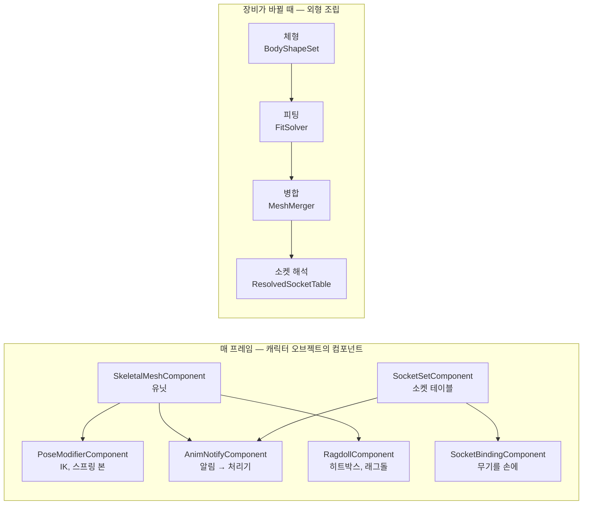

# Character — 캐릭터 외형과 캐릭터 런타임

> **[🏠 위키 홈으로 돌아가기](../../../README.md)** | **[📖 문서 지도](../../../docs/02_DocumentMap.md)**

## 이것은 무엇이고 왜 있나

캐릭터는 스켈레톤과 클립만으로 완성되지 않습니다. 손에 칼을 쥐어야 하고, 칼을 휘두르는 순간에 맞힘 판정을 해야 하고, 쓰러지면 래그돌이 되어야 합니다.
체형을 바꾸면 옷이 몸에 맞게 줄거나 늘어나야 하고, 옷에 가려진 몸은 그리지 않아야 합니다. 이 폴더가 그런 일을 합니다.

이 폴더의 기능은 두 가지로 나뉩니다.

- **캐릭터 런타임.** 매 프레임 캐릭터 오브젝트 위에서 도는 컴포넌트입니다. 소켓, 소켓 부착, 후처리 리그, 애니메이션 알림, 래그돌, 절단, 맞힘 판정이 있습니다.
- **외형 형상 계산.** 장비가 바뀔 때 한 번 하는 계산입니다. 체형, 장비 피팅, 메시 병합, 자르기, 표면 상태가 있습니다.

다른 모듈과의 경계는 다음과 같습니다. 스켈레톤, 클립, 포즈, 스키닝은 [Animation](../Animation/README.md)이 맡고, 강체는 [Physics](../Physics/README.md)가 맡습니다.
장비 슬롯, 아이템 외형, 외형 규칙, 프리셋을 해석하는 일은 GameFramework 의 `Base/Appearance` 가 맡습니다.
모션 워핑처럼 캐릭터 형상과 소켓을 모르는 애니메이션 기능은 `Object/Animation/` 에 있습니다.

이 폴더는 엔진 계층 7 에 있습니다(Scene, Sequencer 와 같은 층). 컴포넌트(Object, 계층 6), 공간 질의, 블렌드 곡선, XML 읽기 위에 있고, 씬과 렌더러는 모릅니다.
알림, 후처리 리그, 레퍼런스 포즈가 `Animation`(계층 2)이 아니라 여기 있는 것도 그 때문입니다. 이 기능들은 소켓과 맞힘 판정을 읽어야 합니다.

## 머릿속 그림



**소켓.** 소켓은 본에 붙은 이름 있는 위치입니다. `SwordTip` 은 오른손 본에서 칼날 방향으로 1.1m 떨어진 위치입니다.
알림 처리기, 상호작용 마커, 무기 총구가 모두 소켓 이름으로 위치를 찾습니다(`SocketLookupUtil::findSocketWorldTransform`). 소켓 테이블에 없으면 같은 이름의 본을 찾습니다.

**데이터 테이블.** 소켓, 알림, 물리 에셋, 체형, 피팅 규칙은 모두 사람이 고치는 XML 파일입니다. 읽기는 `CharacterDataReader` 하나가 합니다.
모르는 속성이나 원소, 숫자가 아닌 숫자 값, 겹친 이름은 **오류**이고, 읽기가 끝날 때 한꺼번에 로그로 남기고 실패합니다.
벡터는 `"x y z"`, 회전은 도 단위의 `"피치 요 롤"` 로 적습니다. 엔진 기본 테이블은 `Resource/engine/character/` 에 있습니다.

**중립 형상.** 외형 계산은 `Mesh` 와 포즈를 직접 다루지 않고, `CharacterGeometry.h` 의 값 타입 위에서 합니다.
`AppearanceGeometry` 는 위치, 법선, UV, 인덱스와 선택적인 스킨, 정점 그룹, 모프를 가지고 있습니다. `CharacterBoneArray` 는 본 배열이고, `SurfaceBvh` 는 표면 여러 개를 담은 BVH 입니다.
조립하는 쪽이 메시와 포즈를 이 형태로 바꿔 넘기고, 결과를 다시 GPU 에 올립니다. 그래서 피팅과 병합은 렌더러 없이 테스트할 수 있습니다.

## 따라 해 보기 — 칼을 휘두를 때 맞힘 판정하기

KayKit 스켈레톤 전사가 걸을 때 발소리를 내고, 칼을 휘두르는 구간에 칼날로 맞힘 판정을 하게 만들어 보겠습니다.
`App -gv_benchCombat=1` 로 실행하면 이 예제가 완성된 장면(`Source/Games/Empty/BenchCombatComponent.cpp`)을 볼 수 있습니다.

### 1단계 — 클립에 알림 이름 달기

클립에는 알림의 이름, 시각, 길이만 적습니다. 무엇을 할지는 적지 않습니다. 모델 원본 옆의 `<모델>.clips.json` 에 적고 임포트하면 클립에 들어갑니다.

```json
"1H_Melee_Attack_Slice_Horizontal": {
  "notifies": [
    { "name": "Swing", "time": 0.35, "duration": 0.25 },
    { "name": "Impact", "time": 0.5 }
  ]
}
```

`Swing` 은 0.35초부터 0.25초 동안 열리는 구간 알림이고, `Impact` 는 0.5초에 한 번 울리는 알림입니다(`Resource/game/shooter3d/models_raw/kaykit/skeleton_warrior.clips.json`).

### 2단계 — 칼끝 소켓 만들기

```xml
<SocketSet>
    <Socket name="SwordTip" parent="handslot.r" kind="TrailEnd" translation="0 1.1 0"/>
    <Socket name="SwordGrip" parent="handslot.r" kind="Attach"/>
</SocketSet>
```

`skeleton_warrior.sockets.xml` 입니다. KayKit 무기 메시는 +Y 가 칼날 방향이라, 오른손 손잡이 위치에서 +Y 로 1.1m 를 칼끝으로 잡았습니다.

### 3단계 — 알림 이름에 처리기 연결하기

```xml
<AnimNotifies>
    <Notify name="FootL" handler="Footstep" socket="foot.l" distance="0.5"/>
    <Notify name="FootR" handler="Footstep" socket="foot.r" distance="0.5"/>
    <Notify name="Swing" handler="HitWindow" socketA="handslot.r" socketB="SwordTip" radius="0.05" damage="25" impulse="60"/>
    <Notify name="Impact" handler="CameraShake" amplitude="0.05" duration="0.25" frequency="35" socket="SwordTip"/>
</AnimNotifies>
```

`skeleton_warrior.notifies.xml` 입니다. `HitWindow` 는 구간이 열려 있는 동안 두 소켓 사이의 칼날을 프레임마다 쓸어, 맞은 오브젝트마다 구간당 한 번 `onHitReceived` 를 부릅니다.
`Footstep` 은 발 소켓에서 아래로 광선을 쏘고, 맞은 물리 재질의 이름으로 소리 경로의 `{surface}` 를 바꿉니다. 그래서 돌 바닥과 풀 바닥에서 다른 발소리가 납니다.

### 4단계 — 컴포넌트 붙이기

<!-- snippet: Source/Games/Empty/BenchCombatComponent.cpp 의 적 생성 구간 — 5b U7 에서 doc 구간 표시로 대조 -->
```cpp
SkeletalMeshComponent*     pUnit     = pEnemy->addComponent<SkeletalMeshComponent>();
SkeletalAnimatorComponent* pAnimator = pEnemy->addComponent<SkeletalAnimatorComponent>();
AnimNotifyComponent*       pNotify   = pEnemy->addComponent<AnimNotifyComponent>();
SocketSetComponent*        pSockets  = pEnemy->addComponent<SocketSetComponent>();
RagdollComponent*          pRagdoll  = pEnemy->addComponent<RagdollComponent>();
// … 메시, 스켈레톤, 클립 폴더 설정 …
pNotify->setNotifyTablePath( "game/shooter3d/characters/skeleton_warrior/skeleton_warrior.notifies.xml" );
pSockets->setSocketSetPath( "game/shooter3d/characters/skeleton_warrior/skeleton_warrior.sockets.xml" );
pRagdoll->setPhysicsAssetPath( "game/shooter3d/characters/skeleton_warrior/skeleton_warrior.physics.xml" );
```

씬이나 프리팹에서는 같은 값을 프로퍼티(`_notifyTablePath`, `_socketSetPath`, `_physicsAssetPath`)로 적습니다.
이제 공격 클립이 재생되면 칼날에 맞은 오브젝트가 `onHitReceived` 를 받고, 래그돌이 있는 캐릭터는 맞은 부위가 움찔합니다. 치명적인 맞음이면 래그돌로 쓰러집니다.

## 작동 원리

### 애니메이션 알림

이름이 무엇을 하는지는 캐릭터마다 알림 테이블(`*.notifies.xml`, `AnimNotifyTable`)의 한 줄이고, 코드에는 처리기 **종류**만 있습니다(`AnimNotifyHandlerRegistry`).
모르는 처리기, 모르는 인자, 빠진 필수 인자는 읽기 오류입니다. 테이블은 공유 캐시(`AnimNotifyTableCache`)에서 받고, 파일을 고치면 열린 구간을 닫고 새 테이블로 이어 갑니다.

내장 처리기는 `PlaySound`, `SpawnPrefab`, `Footstep`, `HitWindow`, `CameraShake`, `GameplayEvent`, `MotionWarp` 입니다. 처리기마다의 인자는 `AnimNotify/AnimNotifyHandlers.h` 머리말의 테이블에 있습니다.
`CameraShake` 는 엔진이 카메라를 모르기 때문에 요청만 냅니다(`AnimNotifyHandlerUtil::getCameraShakeRequested`). GameFramework 의 `CameraManagerComponent` 가 그 요청을 받습니다.

**한 번씩 울린다.** 알림 트랙의 규칙을 그대로 따릅니다([Animation](../Animation/README.md) 의 "알림" 절). 구간 알림은 `Begin`, 프레임마다 틱, `End` 순서로 처리합니다.
클립이 전이나 정지로 재생에서 빠지면 `End` 를 대신 냅니다. 한 프레임 안의 처리 순서는 다음과 같습니다.

1. 끊긴 구간을 닫습니다.
2. 지난 프레임부터 열려 있던 구간의 틱을 처리합니다.
3. 이번 프레임의 알림을 시각 순서로 처리합니다. 이번에 끝나는 구간도 마지막 움직임까지 판정합니다.

**스레드.** 3D 는 애니메이션 시스템의 게임 스레드 마무리 단계(`finishAnimationFrame`)에서, 루트 모션을 적용하기 **전에** 처리합니다.
2D 는 스프라이트 틱(워커 스레드)에서 알림을 복사해 두었다가 틱 뒤 게임 스레드에서 처리합니다. 처리기는 스폰, 물리 질의, 맞음 알림을 하므로 언제나 게임 스레드에서 실행됩니다.
처리기가 한 일은 `getActions()` 에 남아 진단과 테스트에 씁니다.

### 소켓

**층.** 소켓은 세 층을 겹쳐 정합니다. 스켈레톤의 소켓, 메시(부품)의 소켓, 외형의 소켓 순서로 `SocketSet::applyOverride` 가 겹칩니다.
위층은 같은 이름 항목에서 **적은 값만** 바꿉니다.

**해석된 소켓 테이블**(`ResolvedSocketTable`)은 여러 유닛의 소켓을 이름 하나의 공간으로 모읍니다. `beginResolve` 후 유닛마다 `addUnit` 을 부르고 `endResolve` 로 끝냅니다.
몸의 소켓은 접두어가 없고, 부품의 소켓은 `MainHand.Muzzle` 처럼 슬롯 이름이 붙습니다.

- 이름에서 얻은 `SocketId` 는 다시 해석해도 같습니다. 이번 해석에 없는 이름은 꺼집니다(`isSocketActive`). 그래서 무기를 바꾸면 같은 id 가 새 무기의 총구를 가리킵니다.
- 후보 목록(`fallback="Belt.Hook"`)은 `endResolve` 가 처리합니다. 처음 켜진 후보를 쓰고, 없으면 자기 위치를 씁니다.
- 부모 본이 스켈레톤에 있는지는 `addUnit` 이 확인합니다.

**변환.** `computeUnitTransform` 은 유닛 공간의 소켓 변환을, `getSocketTransform( 이름, SocketPoseView )` 는 월드 변환을 돌려줍니다.
본 기준 소켓은 본 비율 보정이 옮긴 본을 그대로 따릅니다. 표면 기준 소켓은 바인드할 때 가장 가까운 삼각형에 묶이고, 체형을 적용한 형상(`applyShapedGeometry`)에서 계산한 보정을 부모 본 축으로 더합니다.

**소켓 테이블 컴포넌트**(`SocketSetComponent`)는 오브젝트 하나의 소켓과 마커 테이블(`*.sockets.xml`, 공유 캐시 `SocketSetCache`)을 가지고 있습니다.
소켓은 같은 오브젝트에 있는 유닛의 지금 본을 따르고, 유닛이 없는 오브젝트(문, 레버)는 오브젝트 루트를 기준으로 합니다. 부모 본은 시작할 때 유닛 스켈레톤과 대조하며, 모르는 본은 오류입니다.

`.mesh` 와 스켈레톤은 glTF 를 다시 임포트하면 덮어써지므로, 소켓, 레퍼런스 포즈, 부품 피팅은 **임포트 결과와 따로 둔 원본 파일**에 적습니다.
`SocketImportUtil` 은 임포트 노드(본에 붙은 강체 메시)로 소켓 초안을 만들되 **파일이 없을 때만** 씁니다.

### 소켓 부착 — `SocketBindingComponent`

무기나 투구 같은 유닛을 다른 유닛의 소켓에 붙이고, 떼고, 되돌립니다. 상태는 `Bound`, `ReleasedAnimated`, `ReleasedPhysics`, `Returning` 넷입니다.

**붙어 있는 동안은 비용이 없습니다.** 붙은 오브젝트의 루트를 소켓을 가진 쪽(holder)의 루트에 붙이고 소켓 변환을 로컬로 적을 뿐이라, 나머지는 트랜스폼 계층이 처리합니다. 틱도 꺼져 있습니다.
소켓의 본이 움직이면 부착을 만든 쪽이 `updateSocketTransform` 을 부릅니다. 지금은 GameFramework 의 `CharacterAppearanceComponent` 가 부릅니다. 값이 같으면 아무것도 하지 않습니다.

- **떼기**는 지금 월드 위치에서 출발하므로 튀지 않습니다.
- **물리로 떼기**는 `ISocketPhysicsBody`(`Object/Component/Physics/SocketPhysicsBody.h`)에 맡깁니다. 강체 컴포넌트가 이 인터페이스를 구현하고, 시작할 때 같은 오브젝트의 `RigidBodyComponent` 를 자동으로 연결합니다.
  붙어 있는 동안은 키네마틱으로 손을 따르고, 떼면 동적 바디가 되어 시작 속도를 받고, 되돌아가면 다시 키네마틱이 됩니다. 강체는 그 유닛의 루트에 둡니다.
- **되돌아가기**는 지금 월드 위치에서 소켓까지 `BlendCurveSpec`(카메라 블렌드와 같은 구현, `Engine/Animation/Graph/BlendCurve.h`)으로 섞습니다.
- **주인 바꾸기**(`transferTo`)는 다시 스폰하지 않습니다. 땅에 떨어진 무기를 줍거나 다른 캐릭터에게 넘길 때 씁니다.

2D 도 같습니다. 2D 오브젝트도 씬 컴포넌트(X, Y 와 Z축 회전)를 쓰기 때문입니다.

### 후처리 리그 — `PoseModifierComponent`

리그 에셋(`*.rig.json`)을 유닛에 붙여 `AnimationPhase::PostProcess` 단계에서 실행합니다. 상태 기계 뒤, 스키닝 전이고, 같은 의존 레벨의 유닛끼리는 병렬입니다.
노드 종류와 대상 규칙은 [Animation](../Animation/README.md) 의 "후처리 리그" 절에 있습니다. 같은 오브젝트의 `SkeletalMeshComponent` 에 단계 일(`PoseModifierBinding`)로 붙습니다.

| 단계 | 스레드 | 하는 일 |
|---|---|---|
| `onBeginPlay`, `bindRig` | 게임 | 리그 인스턴스를 만들고 바깥 대상을 연결합니다 |
| `prepareAnimationFrame` | 게임 | 대상의 월드 행렬을 기록하고 발 디딤의 땅 광선을 쏩니다 |
| `PostProcess` | 워커 | 대상 값을 채우고 노드를 실행합니다 |

`bindRig` 는 에셋(`RigAssetCache`)과 소켓(`_socketSetPath` 또는 `setOwnSockets`)으로 `RigInstance` 를 만듭니다.
다른 유닛을 대상으로 삼으면 의존을 등록하고, 순환이 생기면 오류를 남기고 그 대상을 끕니다. 리그 파일이 핫 리로드되면 `prepareAnimationFrame` 이 알아채고 다시 바인딩합니다.
땅 광선은 씬 물리(`IPhysicsScene3D`)로 쏘고, 평면 리그면 2D 물리로 쏩니다.

- **대상 연결.** `bindUnit( 이름, 유닛, 소켓 에셋 )` 과 `bindObject( 이름, 오브젝트 )` 로 먼저 연결한 것을 쓰고, 없으면 같은 이름의 자식, 그다음 매니저 전체에서 찾습니다.
  외형 조립 쪽은 `setSocketTable( 해석된 테이블, 유닛 목록 )` 으로 `MainHand.Grip` 같은 이름을 그 테이블에서 찾게 합니다. 이때 표면 기준 소켓의 체형 보정은 따르지 않습니다.
- **무기 손잡이.** 무기 유닛은 오른손 소켓에 붙어 몸을 따르고, 왼손 IK 는 무기의 `Grip` 소켓을 `"space": "handslot.r"` 대상으로 잡습니다. 몸, 무기, 몸으로 이어지는 순환 의존 없이 이번 프레임의 오른손을 따라갑니다.
- **가중치.** `setSlotWeight( 슬롯, 값 )` 은 시퀀서 슬롯 값(샷 중간에 무기를 다른 손으로 옮겨 쥐기)을, 애니메이터의 `getCurveValue` 는 클립 커브를 노드 가중치로 넘깁니다. `setNodeControl( 노드, "parent", 번호 )` 는 부모 바꾸기 노드를 조절합니다.
- **모프 출력.** 포즈 구동(RBF) 노드가 낸 보정 모프 가중치는 유닛의 같은 이름 모프 타깃에 더해집니다(`getMorphWeights`). 보정 본은 바로 포즈에 들어갑니다.
- **비용.** `setRigEnabled( false )` 면 쉬는 유닛처럼 평가에서 빠집니다. 스프링 사슬은 `AnimationSystem::setLodViewPosition` 기준으로 `lod_distance` 밖에서 꺼지고, 다시 켜지면 애니메이션 자세에서 시작합니다.

### 래그돌과 히트박스 — `RagdollComponent`

캐릭터의 물리 에셋(`*.physics.xml`, 공유 캐시 `PhysicsAssetCache`)으로 `PhysicsRagdollBuilder` 가 본마다 바디를 만듭니다. 바디의 사용자 값은 오브젝트 id 이고 레이어는 `Ragdoll` 입니다.
물리 에셋 파일을 고치면 바디를 다시 만듭니다.

**바디마다 물리 혼합 가중치가 하나 있습니다.** 0 은 애니메이션, 1 은 물리입니다. 이 하나의 값으로 모든 상태를 처리합니다.
가중치가 0 이면 키네마틱 바디가 되어, 물리 스텝마다 이번 프레임 포즈까지 나눠 끌려갑니다. 그래서 키네마틱 바디에 밀린 동적 바디가 속도를 받습니다. 가중치가 0 보다 크면 동적 바디입니다.

| 상태 | 바디 | 포즈 |
|---|---|---|
| `Animated` | 키네마틱 히트박스 | 애니메이션 |
| 맞음 반응 | 맞은 바디 아래만 잠시 동적 | 물리를 줄여 가며 섞고 움찔 클립을 더함 |
| `Ragdoll` | 모두 동적 | 물리 |
| `Partial` | `_partialRootBone` 아래만 동적 | 그 아래만 물리 |
| `BlendingBack` | 키네마틱 | 물리 자세에서 애니메이션으로 |

- **맞음 반응**(`applyHitReaction`, 치명적이지 않은 `onHitReceived`)은 맞은 바디 아래를 `_hitReactionSeconds` 동안 중력 없는 동적 바디로 만들고 충격량을 줍니다. 가중치는 `_hitReactionWeight` 에서 0 으로 줄고, 가산 움찔 클립(`_flinchClip`)을 더합니다.
- **래그돌**(치명적 맞음, `startRagdoll`)은 모든 바디를 동적으로 만들고 애니메이션 속도를 이어받습니다. 캐릭터 컨트롤러는 꺼집니다.
- **부분 래그돌**(`startPartialRagdoll`)은 관절이 키네마틱 골반에 매달린 채로 그 아래만 물리로 움직입니다.
- **돌아오기**(`getUp`, `stopPartialRagdoll`)는 시작할 때의 물리 자세에서 `_blendBackSeconds` 동안 애니메이션으로 섞습니다.

포즈는 후처리 단계에서 애니메이션 포즈와 **지난 물리 프레임**의 바디 자세(`readBoneTransforms`)를 본 가중치로 섞어 만듭니다. 바디가 없는 본은 가장 가까운 조상 바디를 따릅니다.

**기상**(`getUp`)은 바디가 가라앉은 뒤에 합니다. 모든 바디가 `_settleSpeed` 보다 느린 상태로 `_settleSeconds` 가 지나면 가라앉은 것입니다(`isSettled`).
골반 앞이 위를 보면 누운 자세의 기상 클립을, 아니면 엎드린 자세의 클립을 고릅니다. 그 클립 첫 자세의 골반 방향을 래그돌에 맞추도록 오브젝트를 돌리고 옮긴 뒤 섞어 돌아옵니다.
클립이 끝나면 `_getUpExitState` 상태로 갑니다.

KayKit 스켈레톤 리그(본 41개)의 물리 에셋은 `Resource/game/shooter3d/characters/skeleton_warrior/skeleton_warrior.physics.xml` 입니다.
바디는 16개이고, 셰이프 크기는 스킨 정점이 그 본을 따르는 범위에서 골랐습니다. 바디마다 히트 존과 피해 배율이 있습니다(머리 2.0, 다리 0.7 등).

### 맞힘 — `CharacterHitUtil`

광선(3D, 2D)이 바디에 맞으면 바디의 사용자 값으로 오브젝트를 찾고, 히트 존을 찾아 `Component::onHitReceived( HitInfo )` 를 부릅니다.
히트 존은 래그돌 물리 에셋 바디의 `_hitZone`(이름과 피해 배율)을 먼저 보고, 없으면 강체 컴포넌트의 `_hitZone` 을 봅니다(`resolveHitZone`).
쏘는 오브젝트의 바디는 모두 건너뜁니다(`PhysicsQueryFilter::_ignoreUserData`). 자기 래그돌 본이나 들고 있는 무기에 맞지 않게 하기 위해서입니다. 무기 한 발은 `traceWeaponHit` 으로 판정합니다.
엔진은 체력을 모릅니다. 피해에 배율을 곱한 값을 어떻게 쓸지는 받는 컴포넌트가 정합니다.

### 절단 — `DismembermentComponent`

치명적 맞음(`HitInfo::_bFatal`)이 잘라 낼 수 있는 영역(`_listSeverableRegion`)의 본에 맞으면 `severRegion` 을 실행합니다. 코드에서 바로 불러도 됩니다.
맞은 본은 래그돌 바디, 물리 에셋의 본, 몸 영역 테이블(`*.fit.xml` 의 `<Region bones=…>`) 순서로 찾습니다.

1. 유닛의 지금 스킨 메시를 위치로 이어 붙여 위상을 얻고, 영역 테이블로 정점마다 영역을 매긴 뒤 `DismembermentUtil::severRegions` 로 자릅니다.
2. 남은 몸은 잘린 삼각형을 뺀 원래 정점에, 자른 자리를 막는 캡을 스킨 정점으로 붙인 새 메시가 됩니다(`setMesh`).
3. 떨어진 조각은 지금 포즈로 CPU 스키닝한 정적 메시와, 그 정점의 볼록 껍질 강체를 가진 새 오브젝트가 됩니다. 맞은 방향으로 충격량을 받습니다.
   래그돌이 있으면 그 영역 본의 바디를 떼어 냅니다(`RagdollComponent::detachBoneBodies`).
4. 표면 상태(`CharacterSurfaceState`)의 그 영역 `_bloodChannel` 값을 1 로 만듭니다. 이 값을 머티리얼 파라미터로 올리는 일은 외형 조립 쪽이 담당합니다.

자른 자리의 캡은 남은 쪽과 떨어진 쪽이 **정점을 나눠 쓸 때만** 생깁니다. KayKit 해골이나 기사처럼 부위마다 따로 떨어진 메시는 캡이 없습니다.
KayKit 리그의 영역 테이블은 `skeleton_warrior.fit.xml`(Head, Arm_L, Arm_R, Leg_L, Leg_R, Torso)입니다.

### 외형 형상 — 체형, 피팅, 병합

**체형.** `BodyShapeSet::evaluate( 축 값들 )` 은 모프 가중치와 본 비율(`BoneProportion`)을 냅니다. 체형 축마다 양쪽 끝에 모프 하나와 본 비율 줄이 있습니다.
본 비율은 **애니메이션 위의 가산 층**입니다. 매 프레임 애니메이션이 로컬 포즈를 정한 뒤 `BoneProportion::apply` 가 스케일은 곱하고 오프셋은 더하며, 그다음에 스키닝합니다.
같은 보정을 레퍼런스 포즈에 적용하면(`applyToPose`) 리타깃의 대상 레퍼런스로 넘길 수 있습니다. `BodyShapeUtil` 은 같은 일을 CPU 형상에 해서, 피팅과 소켓 보정이 체형을 적용한 바인드 형상을 보게 합니다.

**장비 피팅**(`FitSolver`)은 장비가 바뀔 때 한 번, 체형을 적용한 바인드 포즈에서 풉니다. 입력은 부품들(`FitPartInput`)과 바인드 본, 체형 모프 가중치이고, 몸도 `Body` 겹의 부품 하나입니다.

1. 겹마다 표면 BVH 를 한 번 만듭니다.
2. **변형.** 안쪽 겹과 바깥 겹의 짝마다 상호작용 테이블의 변형 연산이 정점 이동량을 쌓고, 야코비 반복(기본 3회)으로 평균을 적용합니다.
   `Shrink` 는 부드러운 안쪽 정점을 단단한 바깥 부품 안으로 당기고, `Push` 는 단단한 안쪽 부품에 묻힌 부드러운 바깥 정점을 밖으로 밉니다.
3. 손으로 만든 보정 조각을 체형 모프 가중치만큼 적용합니다.
4. **덮임.** `Cut` 은 안쪽 정점의 법선 방향 광선이 덮임 거리 안에서 바깥 부품에 맞으면 덮인 것으로 보고, 세 정점이 모두 덮인 삼각형을 숨깁니다. 경계 한 겹은 남깁니다.
5. **검증.** `Report` 는 두 부품이 서로 파고든 정점을 세어 관통 목록에 남깁니다. 고치지는 않습니다.

결과(`FitResult`)는 부품마다 삼각형 보임 비트(`FitPartResult::_listVisibleBit`), 바인드 공간 정점 이동량, 보고입니다.
짝의 순서는 겹 순서이고, 겹 순서가 같으면 입력에서 앞에 있는 부품이 안쪽입니다.

**몸에서 장비로 전이**(`SurfaceTransferUtil`)는 장비 정점마다 몸의 가장 가까운 삼각형에 묶고, 몸의 모프 이동량과 스킨 가중치를 옮깁니다. 쿠킹 때 한 번 합니다.

**병합**(`MeshMerger::merge`)은 같은 스켈레톤(`_skeletonId`)의 부품만 합칩니다. 보임 마스크로 숨긴 삼각형을 빼고, 쓰는 정점만 원래 순서대로 남기고, 피팅 이동량을 적용합니다.
머티리얼 그룹마다 구간을 냅니다(`IMeshMergeHooks` 가 아틀라스와 UV 이동을 맡습니다). 쉬는 강체 부품은 소켓 본에 가중치 1 로 묶고, `extractPart` 로 다시 떼어 낼 수 있습니다.

**자르기 도우미**(`GeometryCutUtil`)는 마스크로 나누기, 경계 고리 찾기, 캡 만들기, 닫힘 검사, 이어 붙이기를 합니다. 절단, 찢김, 병합, 파괴(`Destruction`)가 함께 씁니다.

**표면 상태**(`CharacterSurfaceState`)는 영역 × 채널 값(젖음, 흙, 피, 상처, 찢김)과 부품 × 채널 UV 마스크(`SurfaceMask`)를 가지고 있습니다.
맞은 위치에 `stampHit` 으로 자국을 찍고, 시간이 지나면 감쇠합니다. 찢김 채널은 머티리얼이 알파로 자르고, 다 찢긴 삼각형은 `SurfaceMaskUtil::markTornTriangles` 와 `hideTriangles` 로 메시에서 뺍니다.

### 외형 조립 순서

해석된 외형(GameFramework)과 메시, 포즈를 받아 그린 결과를 만드는 순서는 다음과 같습니다.
지금은 소켓 부분(5번)만 GameFramework 의 `CharacterAppearanceComponent` 와 `AppearanceSocketRig` 로 연결되어 있고, 나머지 연결은 [백로그](../../../docs/06_Backlog.md)의 "캐릭터 외형 편집" 항목에 있습니다.

1. 유닛마다 `Mesh` 와 스켈레톤을 `AppearanceGeometry` 와 `CharacterBoneArray` 로 바꿉니다(`CharacterPoseUtil::makeBindBones`, `copyUnitPose`). 레퍼런스 포즈 덮어쓰기(`ReferencePoseOverride::apply`)를 적용한 것이 바인드 본입니다.
2. 체형을 적용합니다. 몸 형상에 `BodyShapeUtil::applyMorphs`, 바인드 본에 `BoneProportion::apply` 를 적용하고 `BodyShapeUtil::skinToPose` 로 체형 바인드 형상을 만듭니다.
3. `FitSolver::solve` 로 부품마다 마스크와 이동량을 얻습니다. 이동량은 보정 모프로 GPU 모프 풀에 올리고, 스키닝은 그 뒤입니다.
4. 같은 스켈레톤끼리 `MeshMerger::merge` 로 합쳐 인덱스와 정점 버퍼를 만들고 구간마다 그립니다.
5. 소켓을 해석하고(`ResolvedSocketTable`, `applyShapedGeometry`), 매 프레임 포즈로 `getSocketTransform` 을 구해 부착 유닛을 갱신합니다(`SocketBindingComponent::bindToSocket`, `updateSocketTransform`).
6. 맞음과 날씨는 `CharacterSurfaceState::stampHit`, `setRegionValue`, `tick` 으로 머티리얼 파라미터와 마스크 텍스처를 갱신합니다. 찢김과 절단 마스크는 병합 전에 `hideTriangles` 로 적용합니다.

### 데이터 파일

| 파일 | 타입 | 내용 |
|---|---|---|
| `*.socketkinds.xml` | `SocketKindTable` | 소켓 종류(부착, 접지점, 히트박스 중심, 락온) |
| `*.sockets.xml` | `SocketSet` | 소켓과 가상 본 |
| `*.refpose.xml` | `ReferencePoseOverride` | 본별 레퍼런스 포즈 덮어쓰기, 좌우 대칭 짝 |
| `*.bodyshape.xml` | `BodyShapeSet` | 체형 축 |
| `*.fit.xml` | `FitTables` | 겹, 몸 영역, 피팅 프로필, 상호작용 |
| `*.partfit.xml` | `FitPartData` | 장비 하나의 겹, 숨김 영역, 조임 고리, 보정 조각 |
| `*.surfacechannels.xml` | `SurfaceChannelTable` | 표면 채널의 감쇠, 최댓값, 마스크 해상도 |
| `*.notifies.xml` | `AnimNotifyTable` | 알림 이름 → 처리기와 인자 |
| `*.physics.xml` | 물리 에셋 | 래그돌 바디, 관절, 히트 존 |

각 파일의 속성 목록은 타입 헤더의 주석에 있습니다.

## 확장하는 법

### 새 알림 처리기

1. 처리기를 구현해 `AnimNotifyHandlerRegistry` 에 이름으로 등록합니다. 내장 처리기는 `AnimNotifyHandlerUtil::registerBuiltInHandlers` 가 등록합니다.
2. 처리기의 `getParams()` 가 받는 인자와 필수 여부를 선언합니다(`AnimNotifyParamDef`). 테이블에 모르는 인자가 있거나 필수 인자가 빠지면 읽기 오류가 됩니다.
3. 알림 테이블의 `handler` 에 그 이름을 씁니다.

게임만 아는 반응은 새 처리기보다 `GameplayEvent` 를 쓰는 편이 간단합니다. 같은 오브젝트의 컴포넌트가 `onAnimNotify` 로 받습니다.

### 새 피팅 연산

피팅 연산은 이름으로 등록되고(`FitOperatorRegistry`), 테이블이 이름으로 고릅니다. 새 효과는 `IFitOperator` 하나를 등록하고 `*.fit.xml` 의 상호작용에 한 줄을 씁니다.
모르는 연산이나 인자는 로드 오류입니다.

## 함정과 주의

**소켓과 레퍼런스 포즈를 임포트 결과 폴더에 넣지 마세요.** `.mesh` 와 스켈레톤은 glTF 를 다시 임포트하면 덮어써집니다. 사람이 고치는 데이터는 따로 둔 원본 파일에 둡니다.

**래그돌에서 바디를 뗄 때는 그 바디에 걸린 관절도 지우세요.** `RagdollComponent::detachBoneBodies` 는 바디를 시뮬레이션에서 빼고 그 바디의 관절을 지웁니다.
빠진 바디를 잇는 관절이 남아 있으면 Jolt 솔버가 넓은 단계(broad phase) 밖의 바디를 건드려 assert 가 발생합니다.

**용접 키를 성분 곱의 XOR 로 만들지 마세요.** 부호만 다른 대칭 꼭짓점이 같은 키가 됩니다. `GeometryCutUtil` 은 성분을 차례로 섞어 키를 만듭니다.

**처리기에서 워커 스레드를 가정하지 마세요.** 처리기는 언제나 게임 스레드에서 실행됩니다. 2D 알림은 워커에서 복사만 하고 틱 뒤에 처리합니다.

**3D 알림은 루트 모션보다 먼저 처리된다는 것을 기억하세요.** 그래서 모션 워핑 구간의 끝 알림을 처리한 뒤에도 그 프레임의 루트 모션까지 워프가 적용되고 창이 닫힙니다.

## 더 볼 곳

- [Animation](../Animation/README.md) — 유닛, 알림 규칙, 후처리 리그 노드, 리타깃
- [Physics](../Physics/README.md) — 강체, 물리 에셋, 질의
- [Object](../Object/README.md) — 컴포넌트 수명
- `Source/GameFramework/Base/Gameplay/Appearance/` — 외형 슬롯, 프리셋, `CharacterAppearanceComponent`

모션 워핑(`MotionWarpingComponent`)과 이동 보정(`LocomotionWarpingComponent`)은 `Object/Animation/` 에 있고, 규칙은 각 헤더의 주석에 있습니다.

자주 여는 파일은 다음과 같습니다.

| 파일 | 내용 |
|---|---|
| `AnimNotify/AnimNotifyHandlers.h` | 내장 처리기와 인자 |
| `AnimNotify/AnimNotifyComponent.h` | 알림 디스패치 |
| `Socket/ResolvedSocketTable.h` | 소켓 해석과 변환 |
| `Socket/SocketBindingComponent.h` | 소켓 부착 상태 |
| `PoseModifier/PoseModifierComponent.h` | 후처리 리그 연결 |
| `Hit/RagdollComponent.h` | 래그돌 상태와 설정 |
| `Hit/CharacterHit.h` | 광선 맞힘과 히트 존 |
| `Fit/FitSolver.h` | 장비 피팅 |
| `Fit/CharacterGeometry.h` | 중립 형상 타입 |
