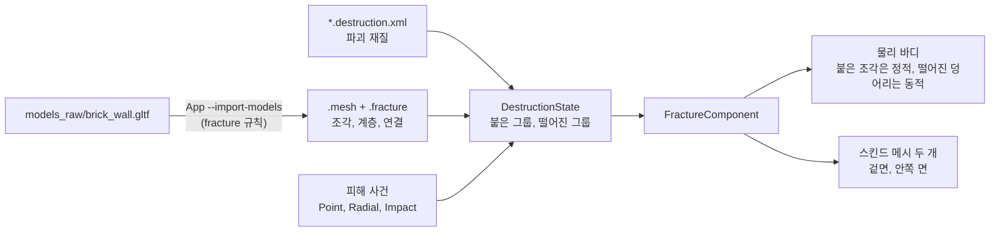

# Destruction — 파괴 가능한 메시

## 이것은 무엇이고 왜 있나

벽이 폭발에 맞아 벽돌 조각으로 무너지고, 받침을 잃은 위쪽이 큰 덩어리째 떨어지는 장면을 만드는 모듈입니다.
메시를 미리 조각으로 쪼개 두고(쿠킹), 실행 중에는 피해를 받은 부분만 조각으로 바꿔 물리로 움직입니다.
언리얼 Chaos Destruction의 Geometry Collection에 해당하고, 받침이 없으면 무너지는 구조 계산은 레드 팩션 게릴라의 방식을 따릅니다.

이 모듈은 세 층으로 나뉩니다.

- **쿠킹.** 모델을 임포트할 때 보로노이 분할로 조각을 만들고 `.fracture` 파일에 저장합니다.
- **구조 상태.** 어느 조각이 아직 붙어 있고 어느 덩어리가 떨어졌는지를 물리나 렌더링과 상관없이 계산합니다(`DestructionState`). 같은 입력이면 어느 기계에서나 같은 결과가 나옵니다.
- **런타임.** `FractureComponent` 가 구조 상태에 맞춰 물리 바디와 스킨드 메시를 만들고 움직입니다. 2D 게임용 `Fracture2DComponent` 도 같은 코드를 씁니다.

엔진 계층으로는 8층(렌더러, Module과 같은 층)입니다. 캐릭터 모듈의 메시 자르기 도구(`Character/Fit/GeometryCut`, 7층), 컴포넌트(6층), 물리(3층)를 쓰고, 렌더러는 이 모듈을 모릅니다.

## 머릿속 그림



**조각과 계층.** 쿠킹이 만든 가장 작은 조각을 **잎**(leaf)이라고 부릅니다. 잎 여러 개는 다시 클러스터(cluster)로 묶이고, 클러스터는 더 큰 클러스터로 묶입니다.
약한 피해는 큰 클러스터만 가르고, 센 피해는 여러 단계를 지나 잎까지 내려갑니다. Chaos의 클러스터 레벨과 같은 개념입니다.

**연결.** 서로 맞닿은 두 잎 사이에는 연결(`FractureLink`)이 있고, 연결의 세기는 맞닿은 면의 넓이에 비례합니다. 클러스터가 갈라지는 것과 떨어지는 것은 다릅니다. 덩어리는 연결이 끊겨야 떨어집니다.

**앵커와 지지.** 땅이나 고정된 물체에 닿은 잎이 **앵커**입니다. 끊기지 않은 연결로 앵커까지 이어진 그룹은 붙어 있고(정적), 이어지지 않은 그룹은 떨어집니다(동적).
붙은 그룹은 자기 무게를 앵커 쪽으로 흘려 보내고, 버티지 못하는 연결은 끊깁니다. 그래서 벽 아래쪽을 부수면 위쪽이 무너집니다.

**결정성.** 같은 쿠킹 결과와 같은 재질, 같은 앵커에 같은 순서의 피해 사건을 주면 어느 기계에서나 같은 구조 상태가 나옵니다(`computeStateHash` 가 같음).
그래서 네트워크로는 조각의 위치가 아니라 피해 사건 목록을 보냅니다.

## 따라 해 보기 — 벽 하나를 부수기

쇼케이스의 벽돌 벽과 같은 절차입니다. `FractureComponentTest.WallBreaksIntoPiecesThatFlySettleAndBake` 가 3단계와 4단계를 그대로 테스트합니다.

**1단계 — 쪼갤 모델을 정합니다.** `Config/Editor/ModelImportConfig.json` 에 `fracture` 키가 있는 규칙을 더합니다. 키의 뜻은 `Editor/Common/Asset/ModelImportConfig.h` 에 있습니다.

<!-- snippet: Config/Editor/ModelImportConfig.json 의 Destruction_BrickWall 규칙 — 5b U7 에서 대조 -->
```json
{
  "name": "Destruction_BrickWall",
  "include_patterns": ["*/empty/models_raw/brick_wall*"],
  "fracture": { "pattern": "uniform", "pieces": 200, "seed": 7, "levels": [6, 30], "interior_color": [0.55, 0.5, 0.45, 1.0] }
}
```

`pieces` 는 잎의 수, `levels` 는 위에서 아래로 클러스터 계층의 단계별 클러스터 수, `interior_color` 는 잘린 안쪽 면의 색입니다.

**2단계 — 임포트합니다.** `App.exe --import-models` 를 돌리면 `.mesh` 옆에 `brick_wall.fracture` 가 생깁니다.
규칙에서 빠진 모델을 다시 임포트하면 이전 `.fracture` 가 지워집니다. 임포트 스탬프(`models_raw/import.stamp`)가 이 파일까지 추적합니다.

**3단계 — 오브젝트를 구성합니다.** 뿌리에 강체를 두고, 그 위에 메시와 `FractureComponent` 를 붙입니다.

<!-- snippet: TestFractureComponent.cpp 의 spawnWall — 5b U7 에서 대조 -->
```cpp
GameObject*         pWall = manager.createGameObject( hashed_string( "Wall" ) );
RigidBodyComponent* pBody = pWall->addComponent<RigidBodyComponent>(); // 뿌리: 오브젝트 자세를 맡는다
pBody->setShape( box );
pBody->setBodyType( PhysicsBodyType::Static );
MeshComponent* pMesh = pWall->addComponent<MeshComponent>();
pMesh->setMesh( mesh ); // 테스트는 상자 메시를 직접 만든다. 씬에서는 _meshId 에 .mesh 경로를 적는다
FractureComponent* pFracture = pWall->addComponent<FractureComponent>();
pFracture->setFracturePath( fracturePath );
pFracture->setProfilePath( profilePath );
pFracture->setAnchorMode( FractureAnchorMode::Bottom ); // 가장 낮은 면에 닿은 조각이 앵커
```

`setFracturePath` 를 비워 두면 메시 옆의 `.fracture` 를, `setProfilePath` 를 비워 두면 기본 재질(`Resource/engine/destruction/default.destruction.xml`)을 씁니다.
앵커 모드는 `None`(상자나 통처럼 통째로 동적), `Bottom`(벽이나 기둥), `World`(시작할 때 다른 정적 바디에 닿은 조각) 세 가지입니다.

**4단계 — 피해를 줍니다.** 폭발이면 반경 피해를 줍니다.

```cpp
pFracture->applyRadialDamageAtWorld( center, 1.2f /*반경*/, 400.0f /*변형*/, 300.0f /*충격량*/ );
```

다음 물리 프레임에 벽의 메시가 숨고 조각으로 바뀝니다. 앵커에 이어진 조각은 제자리에 남고, 떨어진 덩어리는 폭발에 밀려 날아갑니다.
시간이 지나 조각이 멈추면 작은 파편은 사라지고, 남은 조각은 정적 메시로 베이크되어 프레임 비용이 0이 됩니다.

**5단계 — 쇼케이스로 확인합니다.** `App.exe "-gv_firstScene=game/empty/maps/destructionshowcase.scene.xml"` 로 실행합니다.
벽돌 벽(200조각, 바닥 앵커), 나무 상자 세 개(대리 부피 24조각, `wood.destruction.xml`), 폭발 통 두 개(20조각)가 있습니다.
`BarrelFuse` 가 1.5초 도화선(`_fuseTime`) 뒤에 터지고, 반경 3 m 안의 `BarrelChain` 이 연쇄로 터집니다. 벽 아래쪽이 깨지고 받침을 잃은 위쪽이 큰 덩어리로 무너집니다.
부서진 뒤를 찍으려면 `-gv_screenshotFrame=900 -gv_screenshot=<경로>.ppm` 을 더합니다. `DestructionShowcaseTest` 가 같은 흐름을 테스트합니다.

## 작동 원리

### 쿠킹 — 보로노이 분할

`MeshFractureUtil` 이 메시 안에 씨앗 점을 뿌리고, 씨앗마다 보로노이 셀 하나를 조각으로 만듭니다. 씨앗 배치는 패턴으로 고릅니다.

| 패턴 | 씨앗 배치 |
|---|---|
| `uniform` | 메시 안에 고르게 `pieces` 개. 메시 밖에 떨어진 셀은 버립니다 |
| `clustered` | `impact_point` 주변 `cluster_radius` 안에 `cluster_fraction` 비율, 나머지는 고르게 |
| `slices` | 축마다 셀 수를 준 `slices` 격자에 `slice_jitter` 만큼 흔듦 |

`clustered` 는 맞은 곳은 잘게, 먼 곳은 크게 부서지게 할 때 씁니다. `slices` 는 한 축만 주면 판 모양 조각이, 두 축을 주면 벽돌 모양이 나옵니다.

**자르기.** 셀 i는 다른 모든 씨앗 j와의 이등분 평면 안쪽을 모두 겹친 영역입니다. 메시를 가까운 씨앗의 평면부터 차례로 자릅니다.
조각이 평면에 닿지 않으면 건너뛰고, 남은 평면이 조각 반경보다 멀면 끝냅니다. 잘린 단면은 끊긴 고리를 이어 귀 자르기 삼각분할(`PolygonTriangulationUtil`)로 막습니다. 오목한 단면과 구멍 있는 단면도 처리합니다.

조각은 **위치가 비트까지 같은 정점끼리 닫힌 메시**여야 합니다(`MeshFractureUtil::isClosedMesh`). 이 조건을 지키는 방법은 "함정과 주의"에 있습니다.

**닫히지 않은 모델.** 판자를 겹쳐 만든 상자나 바닥이 열린 벽처럼 닫히지 않은 모델은 그대로 쪼갤 수 없습니다. Kenney 에셋의 상자와 벽이 대개 그렇습니다.
이럴 때는 `volume` 키로 닫힌 **대리 부피**를 고릅니다. `bounds` 는 경계 상자를, `hull` 은 정점의 볼록 껍질(`MeshFractureUtil::makeConvexHull`)을 씁니다.
대리 부피를 쪼개 부피, 무게 중심, 충돌 껍질, 안쪽 면, 연결을 얻고, 겉면은 원래 메시를 같은 평면으로 잘라 조각마다 붙입니다. 대리 부피의 바깥 면은 그리지 않습니다.
기본값 `mesh` 는 모델이 닫혀 있어야 하고, 닫혀 있지 않으면 임포트 오류입니다.

**결과.** `FractureAsset` 에는 조각마다 다음 값이 들어갑니다.

- 삼각형 목록(`RHIVertex`). 슬롯 0은 겉면, 슬롯 1은 안쪽 면이고, 안쪽 면은 `interior_color` 와 평면 투영 UV를 씁니다.
- 무게 중심 기준의 볼록 껍질 점. `max_hull_points` 를 넘으면 고르게 뽑은 방향마다 가장 먼 점만 남깁니다.
- 무게 중심, 부피, 경계 상자

연결의 넓이는 두 조각이 서로를 향해 낸 안쪽 면 넓이 중 작은 값입니다.
클러스터 계층은 `FractureGraphUtil::buildHierarchy` 가 아래에서 위로 만듭니다. 가장 먼 점 고르기로 시작점을 정하고 k-평균으로 묶습니다.
연결로 이어지지 않은 클러스터는 덩어리마다 나누고, 잎 번호를 깊이 우선 순서로 다시 매겨 노드마다 잎 번호가 연속 구간이 되게 합니다.
난수는 `DestructionRandom`(splitmix64)으로 뽑고 표준 라이브러리 분포를 쓰지 않습니다. 그래서 같은 메시와 규칙, 씨앗이면 바이트까지 같은 결과가 나옵니다.

`.fracture` 형식은 리틀 엔디언이고 매직은 `SWFR`, 버전은 `FractureAsset::kVersion` 입니다. 배치 순서는 `FractureAsset.h` 에 있습니다.
읽을 때는 지금 형식만 받고 구조를 검사해 틀리면 거절합니다. `FractureAssetCache` 가 약한 참조로 캐시하고, 핫 리로드하면 새 객체로 바꾸고 `getReloadGeneration` 을 올립니다.

### 구조 상태

`DestructionState` 는 오브젝트 하나의 구조 상태입니다. 2D와 3D가 같이 쓰고, 물리와 렌더링을 모릅니다.

- **계층.** 현재 한 몸으로 움직이는 클러스터를 **활성 노드**라고 부릅니다. 클러스터가 갈라지면(`breakNode`) 자식들이 활성 노드가 됩니다. 갈라진다고 떨어지지는 않습니다.
- **연결.** 활성 노드가 서로 다른 두 잎 사이의 연결만 끊길 수 있습니다. 갈라지지 않은 클러스터 안은 한 몸이기 때문입니다.
  `detachLeaf` 는 잎이 활성 노드가 될 때까지 위의 클러스터를 가르고, 그 잎의 연결을 모두 끊고, 앵커에서도 뺍니다.
- **그룹.** 끊기지 않은 연결로 이어진 활성 노드의 모임이 **그룹**입니다. 앵커 잎을 포함하면 붙은 그룹, 아니면 떨어진 그룹입니다.

**지지 계산.** 붙은 그룹은 앵커에서 너비 우선으로 깊이를 매깁니다. 가장 깊은 노드부터 자기 무게(부피 × `density` × g)와 위에서 받은 하중을 더해 더 얕은 이웃에게 넘깁니다.
넘기는 비율은 맞닿은 세기(넓이 × `supportStrength`)에 비례합니다. 넘긴 하중이 세기를 넘는 연결은 끊고, 끊기면 다시 나눕니다. 최대 8번까지 반복합니다.

**그룹 번호.** 한 덩어리 그대로 남은 그룹은 번호를 유지합니다. 클러스터가 갈라졌을 뿐이면 바디도 렌더링도 바뀌지 않습니다.
그룹이 갈라지면 이전 번호는 사라지고, 덩어리마다 새 번호가 생깁니다. 새 번호는 늘기만 하고, 가장 작은 노드 순서로 붙습니다.
변화는 `DestructionChange` 로 돌려줍니다. 사라진 그룹과 새 그룹, 갈라진 노드, 끊긴 연결, 무게 때문에 끊긴 연결 수가 들어 있습니다.
모든 처리 순서가 노드, 연결, 그룹 번호 순이므로 같은 조작 순서면 같은 상태가 나옵니다.

**파괴 재질.** 파괴 재질 파일(`*.destruction.xml`, `DestructionProfile`)은 같은 `.fracture` 를 다르게 부수는 값입니다. 재질을 바꿔도 다시 쿠킹하지 않습니다.
기본 재질은 `default.destruction.xml`(돌)과 `wood.destruction.xml`(나무)이고 `Resource/engine/destruction/` 에 있습니다. 요소별 뜻은 `DestructionProfile.h` 의 머리 주석에 있습니다.

<!-- snippet: Resource/engine/destruction/default.destruction.xml — 5b U7 에서 대조 -->
```xml
<DestructionProfile density="2000" physicsMaterial="Stone">
  <Strain thresholds="60 90 40"/>
  <Links strength="400" supportStrength="30000"/>
  <Impact impulseToStrain="0.4" minImpulse="40" radius="0.35"/>
  <Debris lifetime="10" maxBodies="96" smallVolume="0.002" fadeTime="0.5" sleepRemoveTime="1.5" keepCollisionVolume="0.05" hullShrink="0.01"/>
  <Network poseRate="10"/>
</DestructionProfile>
```

모르는 요소나 속성, 틀린 숫자, 같은 요소 두 번은 로드 오류입니다(`CharacterDataReader`). `ResourceDataSchemaTest` 가 저장소의 모든 재질 파일을 읽어 확인합니다.

### 피해

피해 사건(`DestructionDamageEvent`)은 **메시 공간**의 중심, 변형량, 반경, 맞은 잎(선택), 방향, 충격량으로 이루어집니다. 종류는 셋입니다.

| 종류 | 쓰는 곳 | 변형 |
|---|---|---|
| `Point` | 무기 | 광선이 고른 잎에 감쇠 없이 |
| `Radial` | 폭발 | 반경 안에서 `1 - 거리 / 반경` 으로 선형 감쇠. 떨어진 조각을 바깥으로 밉니다 |
| `Impact` | 물리 충돌 | `minImpulse` 를 넘은 충격량 × `impulseToStrain`, 반경은 `Impact radius` (`makeImpactEvent`) |

`DestructionState::applyDamage` 는 다음 순서로 적용합니다. 모든 단계는 노드와 연결 번호 순서로 돕니다.

1. 잎마다 변형량을 계산합니다(`computeLeafStrain`).
2. 활성 노드마다 그 잎들의 최대 변형을 누적합니다(`getNodeStrain`). 누적값이 그 깊이의 임계값(`Strain thresholds`, 깊이 0이 뿌리)을 넘으면 클러스터가 자식으로 갈라집니다.
   이때 넘친 비율(`(누적값 - 임계값) / 이번 변형`)만큼을 자식에게 다시 줍니다. 그래서 센 피해 한 번은 여러 단계를 지나고, 약한 피해는 쌓여서 큰 덩어리만 가릅니다.
   잎이 임계값을 넘으면 `detachLeaf` 처럼 떨어져 나갑니다.
3. 활성 노드가 다른 두 잎 사이의 연결에 두 잎 변형의 평균을 누적하고, 넓이 × `Links strength` 를 넘으면 끊습니다. 조각이 깨지지 않아도 떨어질 수 있는 이유입니다.
4. 맞은 그룹을 다시 나누고 지지를 계산합니다.

### 결정성과 네트워크

같은 그래프(같은 씨앗으로 쿠킹), 같은 재질, 같은 앵커에 같은 순서의 사건을 적용하면 어느 기계에서나 같은 상태가 됩니다(`computeStateHash`, `getEventCount`).
그래서 네트워크로는 변환 대신 `DestructionEventLog`(씨앗과 사건 목록, 매직 `SWDE`)를 보내고, 받는 쪽이 같은 순서로 `applyDamage` 합니다. 순서를 바꾸면 다른 상태가 됩니다.
충돌 사건은 물리에서 나오므로 기계마다 다를 수 있습니다. 그래서 권한을 가진 쪽이 만든 사건만 기록에 넣습니다.

늦게 참가한 클라이언트나 어긋난 상태를 바로잡을 때는 사건을 처음부터 다시 적용하지 않고 스냅숏을 씁니다(`DestructionState::writeSnapshot`, `readSnapshot`).
스냅숏에는 끊긴 노드와 연결, 앵커 잎, 0이 아닌 변형 누적값(비트 그대로), 그룹, 다음 그룹 번호, 사건 수가 들어갑니다.
읽은 쪽의 `computeStateHash` 는 쓴 쪽과 같고, 이어지는 사건도 같은 결과를 냅니다. 다른 그래프의 스냅숏이나 잘린 바이트는 거절하고 상태를 그대로 둡니다.

### 런타임 — `FractureComponent`

**온전할 때.** 렌더링은 오브젝트의 메시 하나, 물리는 오브젝트의 강체 하나입니다. `FractureComponent` 는 구조 상태만 보관합니다.

**처음 떨어지는 그룹이 생길 때** 쪼갠 상태로 바뀝니다.

- 오브젝트 메시를 숨기고 강체를 끕니다. 강체의 바디는 바로 빼서 새 조각과 겹치지 않게 합니다.
- 조각마다 본이 하나인 **스킨드 메시 두 개**(겉면, 안쪽 면)를 같은 오브젝트에 붙입니다(`FractureRenderUtil`). 조각이 수백 개여도 슬롯마다 드로우 하나이고, 스키닝은 GPU가 합니다.
- 붙은 그룹의 잎은 잎마다 **정적 바디**를 만듭니다. 미리 만든 잎 껍질 모양을 공유하고 `createBodies` 한 번으로 만듭니다.
- 떨어진 그룹은 그룹마다 **동적 바디 하나**를 만듭니다. 잎 모양을 묶은 `createCompoundShape` 를 쓰고, 잎이 하나면 그 모양을 그대로 씁니다.
- 붙은 그룹이 갈라져도 붙어 있는 잎의 정적 바디는 그대로 둡니다(`syncStaticBodies`).

**잎 충돌 모양은 시작할 때 모두 만듭니다.** 플레이 첫 물리 프레임에 만듭니다. 볼록 껍질 생성이 부서지는 프레임 비용의 거의 전부이기 때문입니다.
쇼케이스 벽(200조각)의 첫 파괴 처리가 Release에서 10~14 ms에서 2~4 ms로 줄었습니다. 대신 시작 프레임이 껍질 하나당 약 80 µs 늘어납니다(쇼케이스 파괴물 6개, 잎 312개에 약 25 ms).
구조 상태 갱신(그래프, 지지, 피해) 자체는 0.1 ms 남짓입니다. 크기가 바뀐 채 부서지면 그때 다시 만듭니다.

**갈라질 때.** 자식 그룹은 부모 바디의 자세에서, 부모 질량 중심 속도에 각속도 × 거리를 더한 속도로 생깁니다. 그리고 사건의 충격량을 받습니다.
폭발은 바깥 방향으로 거리 감쇠를, 무기는 맞은 방향을 주고, 씨앗으로 조금 흩뜨립니다. 이 흩뜨림은 구조 상태에 들어가지 않습니다.
같은 오브젝트의 조각끼리 부딪힌 것은 생긴 지 0.3초 안이면 피해로 치지 않습니다. 조각은 서로 맞닿은 채 생기기 때문입니다.

**매 물리 프레임.** 동적 바디의 자세를 읽어 잎마다 본의 로컬 변환을 씁니다(회전은 오브젝트 역회전 × 그룹 회전).
물리가 애니메이션 평가보다 늦게 돌기 때문에 `SkeletalMeshComponent::applyExternalPose` 로 그 자리에서 본 팔레트를 다시 계산합니다.
수명, 잠, 페이드는 이번 프레임에 돈 고정 스텝 시간으로 셉니다.

**정리.**

- 잠든 그룹이 `sleepRemoveTime` 동안 쉬면 바디를 뺍니다. 부피가 `keepCollisionVolume` 이상이면 잠든 바디를 남겨 충돌을 유지합니다.
- 작은 파편은 `lifetime` 이 지나면 `fadeTime` 동안 본 크기를 0으로 줄여 사라집니다.
- 떨어진 그룹 바디가 `maxBodies`(오브젝트마다) 또는 `gv_destructionMaxDebrisBodies`(씬마다, 기본 512)를 넘으면 오래된 것부터, 같은 조건이면 작은 것부터 사라지게 합니다.
  씬 단위 개수는 `ScenePhysics::getDebrisBodyCount` 로 셉니다. 그래서 한 프로세스에 월드가 여럿이어도 서로의 예산을 쓰지 않습니다.
- 30프레임 동안 움직인 조각이 없으면 지금 자세를 **정적 메시 두 개에 베이크**하고 스킨드 메시를 숨깁니다. 다시 움직이면 스킨드 메시로 돌아옵니다.

**피해 API.** 아래 함수는 어느 틱에서나 불러도 됩니다. 요청은 잠금 아래에 쌓였다가 다음 물리 프레임에 게임 스레드에서 적용됩니다.

| 함수 | 쓰는 곳 |
|---|---|
| `applyDamage` | 메시 공간 사건. 네트워크로 받은 사건 |
| `applyPointDamageAtWorld` | 무기. 맞은 바디가 떨어진 덩어리면 그 그룹에만 |
| `applyRadialDamageAtWorld` | 폭발. 붙은 구조와 반경 안 덩어리마다 그 자세로 사건 하나씩 |
| `applyRaycastDamage` | 광선을 쏴서 맞은 바디의 오브젝트에 피해 |

물리 충돌도 시작 충격량이 `minImpulse` 를 넘고 권한이 있으면 피해가 됩니다.
적용한 사건은 `getEventLog()` 에 쌓입니다. 받는 쪽(`setAuthority( false )`)이 같은 순서로 `applyDamage` 하면 같은 구조 상태가 됩니다. 조각의 물리 자세는 기계마다 다를 수 있고, 연출로 봅니다.
흩뜨림 씨앗의 번호는 상태의 사건 수라서, 스냅숏을 받은 쪽도 서버와 같은 번호를 씁니다.
떨어진 덩어리를 맞힌 사건은 맞기 직전의 덩어리 자세를 `getEventGroupPoses()` 에 기록합니다. 받는 쪽은 `applyDamage( event, groupPose )` 로 덩어리를 그 위치로 옮긴 뒤 가릅니다.

**네트워크 API.** GameFramework의 `GF_NetDestruction` 키트가 아래 함수를 씁니다.

- `collectGroupPoses` 는 떨어진 그룹마다 원점, 질량 중심, 회전, 부피, 멈춤과 사라짐 여부, 레이어를 모읍니다.
- `makeNetworkSnapshot` 과 `applyNetworkSnapshot` 은 구조 스냅숏과 떨어진 그룹 자세를 주고받습니다. 받는 쪽은 그룹 바디와 렌더링을 다시 만들고, 덩어리를 그 자세의 키네마틱 바디로 둡니다.
- `driveGroup( 그룹, 질량 중심, 회전 )` 은 받는 쪽 덩어리를 키네마틱으로 바꾸고 스텝마다 그 자세로 옮깁니다.
- `isChunkVolume` 은 부피가 재질의 `keepCollisionVolume` 이상인지 봅니다. 이상이면 덩어리로, 서버가 자세를 보내고 플레이어와 부딪힙니다. 미만이면 파편으로, Debris 레이어에서 클라이언트 연출로만 움직입니다.
- `findRecentStateHash` 는 받는 쪽이 사건마다 기록한 최근 64개의 (사건 수, 해시) 쌍을 찾습니다. 사건이 프레임마다 묶여 적용되어도 서버 해시와 같은 시점끼리 비교할 수 있습니다.
- `hasPendingDamage` 는 아직 적용하지 않은 피해 요청이 있는지 봅니다.

`SkeletalMeshComponent` 에는 이 모듈을 위해 두 가지가 있습니다. `setSkeleton` 으로 런타임에 지정한 스켈레톤은 경로가 바뀔 때까지 유지되고, 시작 시점의 렌더 에셋 해석이 덮어쓰지 않습니다.
`applyExternalPose` 는 애니메이션 평가 밖에서 고친 로컬 포즈로 본 팔레트를 바로 계산합니다.

### 2D — `Fracture2DComponent`

2D는 조각을 만드는 방법과 물리 씬만 다르고, 나머지(그래프, 클러스터 계층, 구조, 지지, 피해, 사건 기록, 런타임, 스킨드 조각 렌더링)는 같은 코드입니다.
`PolygonFractureUtil` 이 XY 다각형을 같은 `FractureSettings` 로 반평면마다 잘라 `FractureAsset` 을 만듭니다. 다각형은 오목해도 되고, 시계 방향이면 뒤집습니다.
2D에서는 부피 대신 넓이, 연결 넓이 대신 맞닿은 변의 길이를 씁니다. 렌더링은 Z = 0의 앞뒤 두 면이고, UV는 경계 상자를 [0, 1]로 맞춥니다.

2D 쪼개기는 싸서 쿠킹하지 않고 시작할 때 합니다. 씨앗(`_fractureSeed`)과 모양이 같으면 모든 기계에서 같은 조각이 나오므로 네트워크로는 씨앗과 사건만 보냅니다.

오브젝트는 뿌리에 `RigidBody2DComponent`(온전할 때의 충돌)를 두고 `Fracture2DComponent` 를 붙입니다.
모양은 `_listBorder` 다각형이나 `_size` 상자(바닥 가운데가 원점)로 주고, `_pieceCount`, `_pattern`, `_listLevelCount` 로 쪼갭니다.
그릴 메시가 없으면 쉬고 있는 조각을 베이크한 평평한 메시를 `MeshComponent` 로 더합니다.
조각 바디는 Box2D로 만듭니다(`IFracturePhysics` 의 2D 구현). 껍질은 8점 이하의 볼록 다각형으로 줄이고, 자세는 XY 위치와 Z축 회전이며, 깊이는 오브젝트의 값을 씁니다.

## 확장하는 법

**새 파괴 재질을 만들려면**

1. `Resource/engine/destruction/default.destruction.xml` 을 복사해 `<이름>.destruction.xml` 을 만듭니다.
2. 임계값과 세기, 밀도, 물리 재질을 고칩니다. 값의 뜻은 `DestructionProfile.h` 에 있습니다.
3. `FractureComponent` 의 `_profilePath` 에 경로를 적습니다. `.fracture` 는 다시 쿠킹하지 않아도 됩니다.

**게임플레이에서 부수려면** 게임 코드는 `applyPointDamageAtWorld` 나 `applyRadialDamageAtWorld` 를 부릅니다. GameFramework의 기믹이 참고할 예입니다.

- `ExplosiveBarrelComponent` 는 폭발 반경이 경계 구에 닿은(`isReachedBy`) 파괴 오브젝트에 `applyRadialDamageAtWorld` 를 줍니다(변형 `_fractureStrain`, 충격량 `_blastImpulse`).
  자기에게도 파쇄 데이터가 있으면 몸을 끄지 않고 스스로 부서집니다. 그래서 연쇄 폭발이 근처의 벽과 상자를 부숩니다.
- `DestructibleComponent` 는 단계마다 중심에 변형을 줘서 조금씩 깎고, 마지막 단계에 통째로 부숩니다. 파쇄 데이터가 없으면 몸을 끕니다.

자세한 내용은 [Gimmick README](../../GameFramework/Base/Gimmick/README.md)에 있고, `GimmickFractureTest` 가 테스트합니다.

**쪼개기 알고리즘을 고치려면** 결과가 바뀌는 수정마다 `MeshFractureUtil::kAlgorithmVersion` 을 올립니다. 이 값은 임포트 원본 해시에 섞이므로, 올리면 기존 `.fracture` 가 낡은 것으로 판정되어 다시 임포트됩니다.

## 함정과 주의

- **모서리 교점은 양 끝 정점을 위치 순으로 정렬한 뒤 계산하세요.** 이웃한 두 셀이 같은 모서리를 반대 방향으로 자르면 부동소수 오차로 교점의 비트가 달라지고, 조각 사이에 틈이 생깁니다.
  같은 이유로 평면에서 1e-5 m 안의 정점은 평면 위에 있다고 봅니다. 판정을 정점마다 하므로 이웃 조각도 같은 결과를 얻습니다.
- **세 셀이 만나는 꼭짓점에서만 용접합니다.** 세 평면이 만나는 점은 서로 다른 모서리에서 따로 계산되어 1e-7 m쯤 어긋난 두 점이 됩니다.
  그런 쌍이 생긴 조각만 용접하고 겹친 삼각형과 서로 뒤집힌 쌍을 지웁니다(`cleanPiece`). 이 정리를 하지 않으면 한 모서리에 면 네 개가 붙어(씨앗 30개 × 조각 40개 중 10%) 다음 자르기의 고리가 끊깁니다.
  모든 조각에 항상 돌리면 느리므로 그런 쌍이 있을 때만 돌립니다.
- **귀 자르기에서 일직선 위의 점을 삼각형 없이 버리지 마세요.** 이웃 면이 그 점을 쓰고 있으면 T자 틈이 생깁니다.
- **안쪽 면을 다시 만들 때는 그 점을 쓰는 모든 면이 안쪽 면일 때만 점을 뺍니다.** 자를 때마다 앞 단면의 대각선 교점이 다음 단면의 고리에 일직선으로 쌓입니다.
  셀마다 자르기를 마치면 안쪽 면을 평면마다 다시 만들어 이 점을 줄입니다(`simplifyCaps`). 겉면이 쓰는 점을 빼면 겉면에 틈이 생깁니다.
- **강체가 뿌리여야 합니다.** 메시를 뿌리로 두면 물리는 강체 컴포넌트만 옮기고 오브젝트 자세는 그대로 남습니다. 그러면 쪼갤 때 조각이 처음 위치에서 생깁니다.
- **회전하는 덩어리는 질량 중심으로 보간합니다.** 그룹 원점(오브젝트 원점)은 덩어리에서 몇 미터 떨어져 있을 수 있습니다. 원점을 직선 보간하면 오차가 1 m를 넘습니다(질량 중심으로 바꾼 뒤 p99 0.44 m에서 0.07 m).
- **부서지기 전에 통째로 움직이는 것은 오브젝트 복제(`ReplicationServer` 엔티티)가 맡습니다.** 파괴 키트는 부서진 뒤의 조각만 보냅니다. 언리얼도 Geometry Collection 액터의 통째 이동은 `bReplicateMovement` 로 보냅니다.
  게임이 오브젝트 이동을 복제하지 않으면 클라이언트의 조각은 클라이언트에 있던 위치에서 생깁니다.

## 더 볼 곳

| 파일 | 내용 |
|---|---|
| `MeshFracture.h` | `MeshFractureUtil`, `FractureSettings`, `FracturePattern` |
| `FractureGraph.h` | `FractureGraph`, `FractureNode`, `FractureLink`, `FractureGraphUtil`. 2D와 3D 공용 |
| `FractureAsset.h` | `FractureAsset`, `FracturePiece`, `FractureSurfaceSlot`, `.fracture` 형식 |
| `DestructionState.h` | 구조 상태, 지지, 스냅숏 |
| `DestructionDamage.h` | 피해 사건과 사건 기록 |
| `DestructionProfile.h` | 파괴 재질 파일 형식 |
| `FractureComponentBase.h` | 2D와 3D 공용 런타임, 피해와 네트워크 API |

- 테스트: `Test/EngineTest/Destruction/` 의 `FractureTest`, `DestructionStateTest`, `DestructionDamageTest`, `DestructionSnapshotTest`, `FractureComponentTest`, `Fracture2DTest`, `DestructionShowcaseTest`
- 임포트 테스트: `ModelImporterTest.FractureRuleWritesFractureAssetBesideTheMesh`
- 상위 문서: [Engine/README.md](../README.md)
