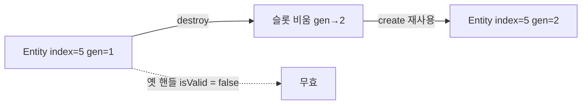
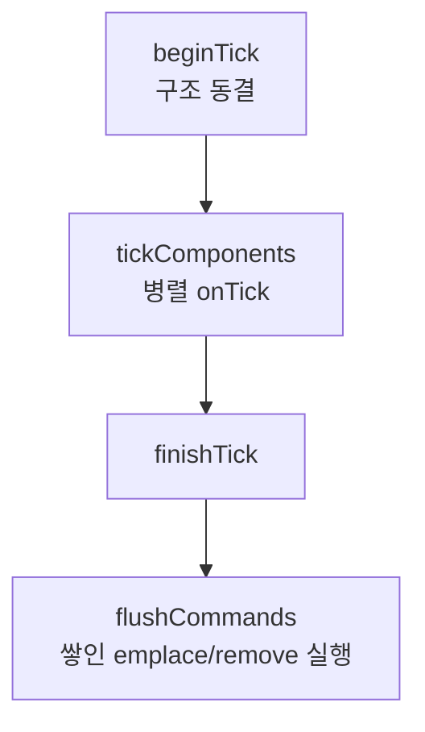
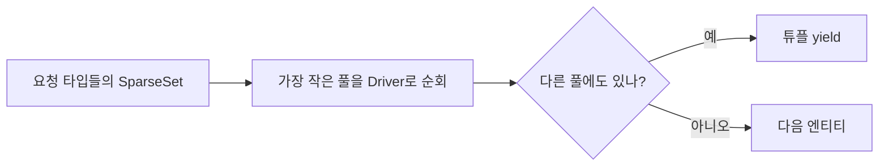

# ECS (Entity · Component · Registry)

오브젝트 데이터를 **엔티티 ID + 타입별 컴포넌트 풀**로 관리하는 저수준 레이어입니다.  
게임 코드는 보통 `GameObject` / `addComponent` 만 쓰고, ECS는 Manager·엔진 시스템이 내부에서 사용합니다.

경로: `Source/Engine/ECS/`  
상위 사용법: [Object/README.md](../Object/README.md)

---

## 한 줄로 이해하기

| 개념 | 역할 |
|------|------|
| **Entity** | 숫자 핸들(인덱스 + 세대). “빈 슬롯” 이름표. |
| **Component 데이터** | 엔티티에 붙는 실제 값. 타입마다 **연속 풀**에 모입니다. |
| **Registry** | 엔티티 생성/파괴, emplace/remove, 병렬 tick, CommandBuffer. |
| **ComponentHandle** | `(Entity, typeId)`. 포인터 대신 들고, 쓸 때 resolve. |
| **View&lt;A,B,…&gt;** | A·B를 **모두** 가진 엔티티만 빠르게 순회. |

```text
Registry
 ├─ Entity #3 (generation 2)
 ├─ Pool<SceneComponent>   [ index → 데이터 ]
 ├─ Pool<MonsterComponent> [ index → 데이터 ]
 └─ CommandBuffer          (tick 중 구조 변경 지연)
```

`GameObject` 는 Entity 하나를 감싸고, `addComponent<T>()` 가 Registry에 `emplace<T>` 합니다.

---

## 파일

| 파일 | 내용 |
|------|------|
| `Entity.h` | `Entity` / `kNullEntity` (세대 있는 ObjectHandle) |
| `Registry.h` / `.cpp` | 풀, tick 웨이브, 팩토리, CommandBuffer |
| `ComponentHandle.h` | 타입 소거 / `TComponentHandle<T>` |
| `View.h` | 다중 컴포넌트 필터 순회 |

---

## 엔티티 세대(Generation)란?

엔티티 슬롯을 재사용하면, 예전에 들고 있던 핸들이 **같은 인덱스라도 무효**가 되어야 합니다.



그래서 포인터를 오래 캐시하지 말고, **핸들 + resolve** 또는 Soft 포인터(`GameObjectPtr` / `ComponentPtr`)를 쓰세요.

---

## Registry 기본 API (엔진/내부용)

```cpp
Registry& reg = /* GameObjectManager 내부 */;

Entity e = reg.create();
reg.emplace<MyData>( e /*, args... */ );

if ( reg.has<MyData>( e ) )
{
    MyData& d = reg.get<MyData>( e );
    MyData* p = reg.getPtr<MyData>( e );
}

reg.remove<MyData>( e );
reg.destroy( e );
```

이름으로 붙이기(팩토리 등록된 타입):

```cpp
Component* c = reg.addComponentByName( e, hashed_string( "MonsterComponent" ) );
```

---

## Tick · 구조 동결 · CommandBuffer

병렬 컴포넌트 tick 구간에는 풀을 함부로 바꾸면 안 됩니다.



| 호출 시점 | `emplace` / `remove` |
|-----------|----------------------|
| 동결 중 | **CommandBuffer에 쌓임** (즉시 풀 변경 없음) |
| 동결 해제 후 | 바로 적용 |

`GameObject::addComponent` 는 동결 중이면 Manager의 `deferPostTick` 으로 미룹니다.  
자세한 사용법은 [Object README — 구조 동결](../Object/README.md) 을 보세요.

---

## View — “이 조합을 가진 엔티티만”

```cpp
for ( auto [entity, transform, monster] : View<SceneComponent, MonsterComponent>( registry ) )
{
    // transform / monster 는 참조
    (void)entity;
}
```

동작 요약:



게임 로직에서는 보통 `findGameObjectsByTag` / `getComponent` 로 충분하고, View는 **엔진·대량 시스템** 쪽에 가깝습니다.

---

## 핸들

```cpp
ComponentHandle raw = ComponentHandle::make( entity, typeId );
Component* c = registry.resolve( raw );

TComponentHandle<MonsterComponent> h = registry.handleFor<MonsterComponent>( entity );
if ( MonsterComponent* m = h.get() )
    m->onTick( dt );
```

- **저장**: 핸들  
- **사용 순간**: `get()` / `resolve()` 로 포인터  
- pending-kill 컴포넌트는 기본적으로 걸러집니다.

---

## 병렬 Tick 웨이브

Registry는 컴포넌트 의존성(DAG)에 맞춰 **웨이브**로 나누고, `TaskManager::emplaceParallel` 로 돌립니다.

```text
Wave 0: 서로 다른 엔티티의 컴포넌트들 (병렬)
Wave 1: …
waitStage / waitAll
```

같은 엔티티의 여러 컴포넌트가 한 웨이브에 겹치지 않도록 서브웨이브로 쪼갭니다.  
→ 엔티티 내부 레이스를 줄이기 위함입니다. ([Task README](../../Core/Task/README.md))

---

## Games에서 지켜야 할 것

| 하지 말 것 | 대신 |
|------------|------|
| `Registry` / `GameObjectManagerInternal` 직접 include | `GameObject` API |
| tick 중 포인터만 캐시해 두기 | 핸들 / Soft 포인터 |
| CommandBuffer를 게임에서 수동 조작 | `executeOrDeferPostTick` |

린트: `Scripts/lint/CheckEngineLayers.py` (Games → Internal 금지)

---

## 더 볼 곳

- [Object/README.md](../Object/README.md) — GO · addComponent · 틱 흐름  
- [Task/README.md](../../Core/Task/README.md) — 병렬 웨이브  
- [Reflection/README.md](../Reflection/README.md) — 컴포넌트 타입 ID · 팩토리  
- `Registry.h` — API 주석
