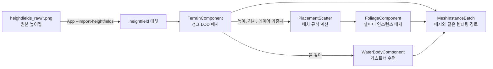

# Environment — 지형, 식생, 물

## 이것은 무엇이고 왜 있나

야외 맵에는 땅, 그 위의 풀과 나무, 호수와 강이 필요합니다. 이 폴더는 그 셋을 컴포넌트로 제공합니다.
언리얼의 Landscape, Foliage, Water 플러그인과 유니티의 Terrain에 해당합니다.

- `TerrainComponent` 는 높이맵 에셋으로 지형을 그리고, 높이와 노멀을 물어볼 수 있게 합니다.
- `FoliageComponent` 는 배치 규칙에 따라 풀과 나무를 지형 위에 흩뿌리고 GPU 인스턴싱으로 그립니다. `WindComponent` 가 바람을, `FoliageInfluencerComponent` 가 풀을 눕히는 구를 정합니다.
- `WaterBodyComponent` 는 호수와 강의 수면을 그리고, 수면 높이와 물속 여부를 물어볼 수 있게 합니다.

세 기능 모두 렌더러를 고치지 않고 만들었습니다. 그려지는 것은 전부 메시 컴포넌트와 같은 `MeshInstanceBatch` 로 등록되므로, GPU 씬 빌드와 GPU 컬링, 멀티 드로우를 메시와 같은 경로로 지납니다.
새로 생긴 것은 머티리얼 셰이더(`foliage.hlsl`, `gerstner.hlsli` 등)뿐입니다. 그래서 렌더러는 이 폴더를 모르고, 이 폴더는 씬(`Scene`) 대신 게임 오브젝트 매니저(`GameObjectManager`)만 봅니다.
엔진 계층으로는 7층(Scene, Sequencer와 같은 층)에 있습니다. 계층 표는 [Engine/README.md](../README.md)에 있습니다.

## 머릿속 그림



**배치 규칙.** 배치 규칙(`PlacementRule`)은 "어디에 무엇을 얼마나 놓을지"를 데이터로 적은 것입니다. 밀도, 최소 거리, 경사와 높이 범위, 레이어 필터가 들어갑니다.
`PlacementScatter::scatter` 가 규칙을 받아 실제 위치 목록을 계산합니다. 같은 코어를 식생, GameFramework의 `PropScatterComponent`(규칙 모드), 2D 타일 흩뿌리기(`PlacementTileSurface`)가 함께 씁니다.

**결정적 배치.** 같은 규칙과 같은 씨앗을 주면 언제나 비트까지 같은 결과가 나옵니다. 그래서 배치 결과를 에셋으로 저장하지 않고, 로드할 때마다 다시 계산합니다.

**청크 LOD.** 지형은 정사각형 청크로 나뉘고, 청크마다 카메라 거리에 따라 다른 해상도의 메시를 씁니다. 지오 밉맵(geo-mipmapping)이라고 부르는 방식입니다.

**CPU 질의.** 물리, 배치, 게임 로직은 그려진 모습과 같은 값을 CPU에서 물어봅니다. 지형 높이는 메시와 같은 삼각형 보간으로, 수면 높이는 셰이더와 같은 파도 식으로 계산합니다.

## 따라 해 보기 — 지형 하나 놓기

환경 쇼케이스 씬(`game/empty/maps/envshowcase.scene.xml`)이 실제로 쓰는 절차입니다. 256 m 계곡에 호수와 강, 풀과 나무가 있습니다.

1. **원본 높이맵을 만듭니다.** 원본은 `<domain>/heightfields_raw/<이름>.png`(16비트 회색조)이거나 `.r16`(리틀 엔디언 정사각형)입니다.
   구멍을 뚫으려면 옆에 `<이름>_holes.png` 를 두고, 값이 128 미만인 셀을 구멍으로 표시합니다. 쇼케이스는 `Scripts/dev/MakeTerrainShowcase.py` 가 이 파일들을 만듭니다.
2. **임포트합니다.** `App.exe --import-heightfields` 가 `heightfields/<이름>.heightfield` 를 만들고 `import.stamp` 를 남깁니다. 바꾸지 않고 검사만 하려면 `--check-heightfields` 를 씁니다.
   텍스처와 모델 임포트와 같은 절차이고, 임포터는 `Editor/Common/Asset/HeightfieldImporter` 입니다.
3. **씬에 `TerrainComponent` 를 붙입니다.** 높이맵 경로와 월드 크기, 높이 범위, 레이어를 적습니다.

<!-- snippet: envshowcase.scene.xml 의 TerrainComponent 항목 — 5b U7 에서 대조 -->
```xml
<TerrainComponent _componentName="TerrainComponent"
                  _heightfieldPath="game/empty/heightfields/valley.heightfield"
                  _materialPath="engine/materials/terrain.material"
                  _splatTexturePath="game/empty/textures/valley_splat.dds"
                  _detailTexturePath="engine/textures/terrain/terrain_detail.dds"
                  _size="256,256" _heightMin="0" _heightMax="40"
                  _chunkCells="32" _lodDistance="48">
    <_listLayer>
        <TerrainLayer _name="Grass" _color="0.2,0.36,0.1,1" _detailStrength="0.45" _bTriplanar="false" />
        <TerrainLayer _name="Rock" _color="0.4,0.39,0.37,1" _detailStrength="0.7" _bTriplanar="true" />
    </_listLayer>
</TerrainComponent>
```

4. **실행합니다.** `App.exe "-gv_firstScene=game/empty/maps/envshowcase.scene.xml"` 로 쇼케이스를 열면 지형과 식생, 물이 보입니다.

높이맵 에셋에는 높이의 상대값만 들어 있습니다. 월드 높이(`_heightMin`, `_heightMax`)와 넓이(`_size`)는 컴포넌트 값입니다. 파일 형식은 `HeightfieldData.h` 의 파일 머리 주석에 있습니다.

## 작동 원리

### 배치 규칙

`PlacementScatter::scatter` 는 평면 좌표 (u, v) 위에서 동작합니다. 3D에서는 (x, z)와 지형 높이를, 2D에서는 (x, y)와 타일 레이어를 표면으로 씁니다.
후보 수는 밀도와 면적의 곱이고, 각 후보의 난수는 (씨앗, 후보 번호, 셀)의 해시로 뽑습니다. 그래서 필터 하나를 바꿔도 살아남는 위치는 그대로입니다.

후보는 다음 순서로 걸러집니다.

1. 제외 영역(원기둥, 사각기둥)
2. 표면 검사(구멍, 맵 밖)
3. 경사, 높이, 레이어 필터
4. 밀도 레이어(가중치 확률로 버림)
5. 최소 거리. 격자 해시로 이미 놓인 것과 비교하고, 먼저 놓인 것이 남습니다(다트 던지기).
6. 항목 선택, 크기, 요 회전, 노멀 맞춤

쿠킹할 때 인스턴스를 저장하지 않습니다. 결정적이므로 로드할 때 다시 계산해도 같은 숲이 나옵니다.

### 지형

**레이어.** 스플랫 맵은 RGBA 네 채널이 레이어 0~3의 가중치인 텍스처입니다. `textures_raw/*_splat.png` 를 비압축 RGBA8 DDS로 임포트합니다(텍스처 규칙 `Terrain_Weights`).
CPU의 `computeLayerWeightsAt` 도 같은 DDS를 읽고, 셰이더와 같은 쌍선형 보간과 합 1 정규화를 합니다. 그래서 배치 필터가 보는 레이어와 화면에 보이는 레이어가 같습니다.
레이어의 무늬는 디테일 맵 한 장에서 옵니다. 채널마다 레이어 하나이고, 0.5가 중립입니다(텍스처 규칙 `Terrain_Detail`).
레이어마다 색, 디테일 세기, 3축 투영(절벽용) 여부를 `TerrainLayer` 로 적습니다. 머티리얼 텍스처 슬롯이 t5~t8 네 개뿐이라 레이어마다 텍스처를 따로 두지 않습니다.
가파른 면을 한 레이어로 덮는 절벽 덮기(`_cliffLayer`)는 렌더링에만 적용됩니다. 배치에서 절벽을 피하려면 경사 필터를 씁니다.

**LOD.** 청크 한 변은 2^k 셀입니다. 카메라 거리가 두 배가 될 때마다 LOD가 하나 내려가고, LOD 사이를 오가며 깜박이지 않도록 10%의 히스테리시스를 둡니다.
이웃 청크가 더 거친 LOD이면, 고운 쪽이 맞닿은 변의 정점을 거친 격자로 접습니다. 넓이가 0이 된 삼각형은 버립니다.
그러면 맞닿은 변의 정점 집합이 비트까지 같아져 틈이 생기지 않습니다. 이 조건은 셀 크기와 원점이 이진 소수로 정확히 표현될 때만 성립합니다(1 m, 0.5 m 셀).
LOD나 이웃 LOD가 바뀐 청크만 메시를 다시 만들어 `MeshInstanceBatch::setMesh` 로 교체합니다.

**질의.** `findHeightAt`, `findNormalAt`, `isHoleAt`, `computeLayerWeightsAt` 이 있고, 원시 샘플은 `getHeightfield().getHeightSamples()` 로 읽습니다.
높이 보간은 메시와 같은 삼각형 보간입니다. 셀을 (0,0)에서 (1,1)로 가는 대각선으로 나누므로, 질의 결과가 그려진 땅과 같습니다.

### 식생

`FoliageComponent` 는 `FoliageLayer` 여러 개를 가집니다. 레이어 하나는 배치 규칙과 메시 목록, 머티리얼, 그리기 값으로 이루어집니다.
메시는 `.mesh` 파일이거나 내장 도형 `GrassClump` 입니다. 머티리얼은 그림자를 드리우는 `foliage.material` 과 그림자가 없는 `grass.material` 이 있습니다.
그리기 값에는 거리 페이드, 바람 반응, 흔들림 높이, 밝기 흔들기가 있습니다.

인스턴스는 (레이어, 메시, 셀)마다 배치 하나로 묶입니다. 셀(`_cellSize`)은 CPU 거리 컬링의 단위입니다. 셀이 페이드 끝보다 멀면 배치 전체를 숨기고, 셀 안의 인스턴스는 GPU 컬링이 하나씩 거릅니다.

움직임은 정점 셰이더(`foliage.hlsl`)가 만듭니다. 바람은 방향, 세기, 돌풍으로 이루어지고, 위상은 인스턴스 위치의 정수 해시에서 뽑습니다.
풀을 눕히는 구는 카메라에 가까운 순서로 네 개까지 받습니다. 거리 페이드는 풀을 뿌리 쪽으로 줄여서 사라지게 합니다.
이 값들은 틱마다 레이어의 머티리얼 인스턴스에 넣습니다. 패스 상수 버퍼나 렌더러는 건드리지 않습니다.

### 물

`WaterBodyComponent` 는 호수(오너 중심의 사각형)와 강(점 목록을 연결한 띠, 점의 y가 수면 높이)을 그립니다.
파도는 월드 (x, z)에 대한 거스트너 파 네 개(`GerstnerWave`)의 합입니다. CPU(`WaterWaveMath`)와 정점 셰이더(`gerstner.hlsli`)가 같은 식을 같은 순서로 계산합니다.
`RenderPassGPUTest.WaterWaveShaderMatchesCpu` 가 컴퓨트 프로브로 네 백엔드의 값을 CPU와 비교합니다.

거스트너 파는 수면 위 점을 옆으로도 옮깁니다. 그래서 `computeSurfaceHeight` 는 그 위치로 옮겨 오는 원래 점을 고정점 반복으로 찾은 뒤 높이를 계산합니다. 부력 계산이 이 값을 씁니다.

반투명 패스에는 씬의 깊이와 색 입력이 없어서 굴절과 화면 공간 두께는 없습니다. 대신 메시를 만들 때 지형에서 물 깊이를 재어 정점 색 알파에 베이크합니다.
이 값으로 깊이에 따른 색과 불투명도, 물가 거품을 만듭니다. 프레넬과 반사광, 잔물결은 픽셀 셰이더가 계산합니다.
물속 안개 값은 `WaterBodyComponent::findUnderwaterFog` 가 계산하지만, 지금 렌더러에는 이 값을 쓰는 안개 패스가 없습니다.

### 비용

쇼케이스를 Release, 1280×720에서 측정한 값입니다. 식생 인스턴스 19,640개와 셀 배치 283개를 로드할 때 46 ms에 계산하고, 씬 인스턴스화는 71~87 ms 걸립니다.
DX12 프레임은 p50 2.6 ms, p99 3.4~8.4 ms이고 Vulkan은 p50 3.7 ms입니다. GPU가 병목이며, 가장 큰 패스는 그림자 패스(p50 1.4 ms)입니다.
그림자를 끈 풀도 정점 셰이더는 실행되기 때문입니다. 측정 방법은 [Profiling/README.md](../Profiling/README.md)에 있습니다.

## 확장하는 법 — 물리 엔진에 연결하기

지형 충돌과 부력은 아직 물리 엔진에 연결되어 있지 않습니다. 연결할 때 쓸 API는 다음과 같습니다.

1. **지형을 Jolt `HeightFieldShape` 로 넘깁니다.** `TerrainHeightfield::getHeightSamples()` 는 N² 개의 월드 높이를 행 우선(z가 바깥, x가 안쪽)으로 줍니다.
   `getResolution()`, `getCellSize()`, `getOrigin()` 으로 크기와 위치를 얻습니다. 원점은 샘플 (0, 0)의 위치입니다.
2. **구멍을 옮깁니다.** `getHoleCells()` 는 (N−1)² 개의 셀 단위 구멍입니다. Jolt는 샘플 단위로 `cNoCollisionValue` 를 받으므로, 구멍 셀의 네 샘플 중 하나를 그 값으로 바꿉니다.
3. **부력을 계산합니다.** `WaterBodyComponent::findWaterAt( manager, x, z )` 로 그 위치의 물을 찾고, `computeSurfaceHeight`, `computeSurfaceNormal`, `isUnderwater` 를 부릅니다.
   파도 시간은 물 컴포넌트의 `getWaveTime()` 이 기준입니다. 고정 스텝 물리도 같은 시간을 넘겨야 화면의 파도와 부력이 맞습니다.

## 함정과 주의

- **식생과 물 머티리얼은 구조 버퍼를 정점 셰이더에서만 읽습니다.** OpenGL(ARB_gl_spirv)은 구조 버퍼를 두 셰이더 단계에서 읽으면 프로그램 링크를 거절합니다.
  픽셀 셰이더에 필요한 값은 보간 변수로 넘기고, 머티리얼 스키마는 정점 단계에서 찾습니다(`Material::ensureShaderLayout`).
- **틱 안에서는 자기 배치와 자기 머티리얼 인스턴스만 씁니다.** 틱은 병렬로 실행됩니다. 배치를 레지스트리에 넣고 빼는 재생성, 예를 들어 오너가 움직였거나 시작할 때 지형을 다시 찾는 일은 `executeOrDeferPostTick` 으로 틱 뒤에 합니다.
- **그림자와 깊이 프리패스에서는 풀이 흔들리지 않습니다.** 두 패스는 `shadowdepth.hlsl` 로 그립니다. 풀은 `MATERIAL_SHADOW_CAST_OFF` 로 그림자를 끄고, 흔드는 머티리얼은 `MATERIAL_VERTEX_DEFORM` 으로 깊이 프리패스에서 빠집니다.
  그래서 그림자를 드리우는 식생(`foliage.material`)은 본체가 흔들려도 그림자는 제자리에 있습니다.
- **스크린샷을 비교할 때는 `-gv_environmentAnimate=0` 을 씁니다.** 그러면 바람과 파도 시간이 0에 멈춥니다. 실제 시간을 쓰면 같은 프레임 번호라도 실행마다 다른 이미지가 나옵니다.
  씬은 비동기로 로드되므로 `-gv_screenshotFrame` 은 로드가 끝난 뒤여야 합니다. Debug에서 쇼케이스는 1600 프레임이면 충분합니다.

## 더 볼 곳

| 파일 | 내용 |
|---|---|
| `Placement/PlacementRule.h` | 배치 규칙 데이터와 `PlacementScatter` |
| `Terrain/HeightfieldData.h` | `.heightfield` 파일 형식 |
| `Terrain/TerrainComponent.h` | 지형 속성과 질의 |
| `Foliage/FoliageComponent.h` | 식생 레이어와 셀 배치 |
| `Water/WaterBodyComponent.h` | 수면 모양과 질의 |
| `EnvironmentUtil.h` | 카메라 위치 찾기, 애니메이션 스위치, 머티리얼 인스턴스 도우미 |

- 테스트: `Test/EngineTest/Environment/`
- 셰이더 규칙: [Graphics/README.md](../Graphics/README.md)
