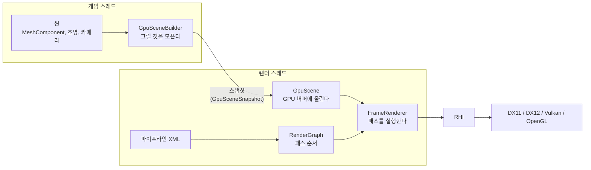

# Graphics — 렌더링

## 이것은 무엇이고 왜 있나

이 폴더는 씬을 화면에 그리는 코드 전부입니다. 메시와 머티리얼, 셰이더, 프레임 순서, 그리고 그래픽 API를 감싸는 층이 모두 여기에 있습니다.
게임 UI와 화면 글자도 같은 렌더러가 프레임의 마지막 패스에서 그립니다.

엔진은 DirectX 11, DirectX 12, Vulkan, OpenGL 네 가지 그래픽 API를 지원합니다. 네 API는 개념도 함수도 서로 달라서,
렌더러가 API를 직접 부르면 같은 기능을 네 번 써야 합니다. 그래서 렌더러와 API 사이에 **RHI**(Rendering Hardware Interface)라는 공통 인터페이스를 둡니다.
렌더러는 RHI만 부르고, API별 구현은 RHI 아래의 백엔드가 맡습니다. 언리얼의 RHI와 같은 구조입니다.

어떤 패스를 어떤 순서로 그릴지는 코드가 아니라 **파이프라인 XML** 파일에 적습니다. 그림자, 불투명, 반투명, 후처리 같은 패스를 XML에 나열하면
엔진이 패스 사이의 입출력 관계를 보고 실행 순서를 정합니다. 포워드 렌더링과 디퍼드 렌더링도 파이프라인 파일만 바꿔서 고릅니다.

이 문서는 렌더링을 처음 보는 분을 위한 안내입니다. 화면에 보이는 것을 바꿔 보고, 한 프레임이 어떻게 그려지는지 따라가고, 새 머티리얼이나 패스를 더하는 방법까지 다룹니다.
API별 구현이나 바인딩 규칙의 세부는 아래 "더 볼 곳"의 하위 문서에 있습니다.

## 머릿속 그림



기억할 개념은 네 가지입니다.

**게임 스레드와 렌더 스레드.** 게임 로직은 게임 스레드에서, GPU 명령 기록은 렌더 스레드에서 돕니다. 두 스레드가 동시에 돌기 때문에 렌더 스레드는 씬을 직접 읽지 않습니다.
게임 스레드가 프레임마다 "이번 프레임에 그릴 것"을 **스냅샷**으로 만들어 넘기고, 렌더 스레드는 그 스냅샷만 봅니다. 두 스레드가 공유하는 씬 데이터는 이 스냅샷 하나뿐입니다.

**파이프라인과 패스.** 파이프라인은 패스의 목록이고, 패스는 렌더 타깃 하나에 무언가를 그리는 단계입니다.
각 패스는 무엇을 읽고(입력) 무엇에 쓰는지(출력)를 선언합니다. `RenderGraph` 는 이 선언을 보고 순서를 정하고, 서로 기다릴 필요가 없는 패스는 여러 스레드에서 동시에 기록합니다.

**머티리얼과 셰이더.** 셰이더는 HLSL 파일이고, 머티리얼은 셰이더 하나와 그 셰이더에 넘길 값(색, 거칠기, 텍스처)을 묶은 에셋입니다.
머티리얼 인스턴스는 부모 머티리얼에서 일부 값만 바꾼 것입니다. 같은 머티리얼을 쓰는 메시는 드로우 콜 하나로 묶여 그려집니다.

**RHI와 백엔드.** RHI는 디바이스, 커맨드 리스트, 리소스(버퍼와 텍스처), 파이프라인 상태(PSO)를 다루는 인터페이스입니다.
네 백엔드는 같은 수준으로 구현되어 있고, 같은 장면을 그리면 같은 이미지가 나와야 합니다. 테스트가 이것을 픽셀 단위로 확인합니다.

## 따라 해 보기

[시작하기](../../../docs/01_GettingStarted.md)의 도는 큐브(`-gv_tutorialSpinner=1`)를 그대로 씁니다.

### 1. 큐브의 색 바꾸기

큐브는 씬의 기본 머티리얼(`engine/materials/defaultmaterial.material`)로 그려집니다. 이 머티리얼에는 `color` 라는 값이 있습니다.
머티리얼 인스턴스를 만들어 이 값만 바꿔 보겠습니다. `EmptyGame::ensureTutorialSpinner` 에서 `setMeshId` 다음에 아래 코드를 넣습니다.

<!-- snippet: 머티리얼 인스턴스로 큐브 색 바꾸기 — 5b U7 에서 RenderPassGpuTest 케이스 구간으로 대조 -->
```cpp
Scene*    pScene = game::getService<SceneManager>()->getActiveScene();
Material* pBase  = pScene->getMaterial(); // 씬 기본 머티리얼

shared_ptr<MaterialInstance> tint = MaterialInstance::create( pBase );
tint->setVectorParameter( hashed_string( "color" ), float4{ 1.0f, 0.3f, 0.2f, 1.0f } );

pMesh->setMaterial( pBase );
pMesh->setMaterialInstance( std::move( tint ) );
```

필요한 헤더는 `Engine/Graphics/Material/MaterialInstance.h`, `Engine/Scene/SceneManager.h`, `Engine/Scene/Scene.h`, `GameFramework/Base/Framework/GameService.h` 입니다.
빌드하고 실행하면 큐브가 주황색으로 바뀝니다.

`color` 는 셰이더 `forwardlit.hlsl` 안의 머티리얼 구조체 멤버 이름과 같아야 합니다. 엔진은 셰이더를 컴파일한 결과(리플렉션)에서 멤버 위치를 읽어 값을 채웁니다.
그래서 C++ 쪽에 셰이더 구조체를 똑같이 옮겨 적을 필요가 없습니다.

같은 색을 쓰는 오브젝트가 여럿이면 인스턴스 하나를 같이 쓰세요. GameFramework의 `MaterialTintCache` 가 색마다 인스턴스 하나를 만들어 나눠 줍니다.
머티리얼과 인스턴스의 구조는 [Material 문서](Material/README.md)에 있습니다.

### 2. 한 프레임의 패스 보기

```powershell
./build/Ninja-Debug/Bin/App.exe -gv_tutorialSpinner=1 -gv_dumpRenderGraph=1 -gv_profileFrames=3
```

`-gv_profileFrames=3` 은 3프레임을 측정하고 앱을 끝냅니다. `-gv_dumpRenderGraph=1` 을 주면 렌더 그래프를 만들 때마다 레벨과 패스, 각 패스가 읽고 쓰는 리소스가 로그에 찍힙니다.
이 스위치는 테스트용 전역 변수라 Shipping 빌드에서는 동작하지 않습니다.
`Shadow` 패스가 그림자 맵(`ShadowMap`)을 쓰고, `ForwardOpaque` 패스가 그것을 읽어 장면 색(`SceneColor`)을 쓰는 순서를 확인할 수 있습니다.
이 순서는 `Resource/engine/pipeline/forwardpipeline.xml` 에 적힌 입력과 출력에서 나온 것입니다.

### 3. 파이프라인 바꾸기

```powershell
./build/Ninja-Debug/Bin/App.exe -gv_tutorialSpinner=1 -gv_deferred=1
```

같은 장면이 디퍼드 파이프라인(`deferredpipeline.xml`)으로 그려집니다. 파일을 직접 고르려면 `-gv_renderPipeline=engine/pipeline/<파일>.xml` 을 씁니다.
들어 있는 파이프라인은 다음과 같습니다.

| 파일 | 용도 |
|---|---|
| `forwardpipeline.xml` | 기본값. 포워드 렌더링이고, 후처리를 Present 패스 하나로 합쳤습니다. |
| `forwardpipelinestaged.xml` | 후처리를 효과마다 다른 패스로 나눈 버전입니다. |
| `forwardprepasspipeline.xml` | 깊이 프리패스를 앞에 둔 포워드 렌더링입니다. |
| `deferredpipeline.xml` | 디퍼드 렌더링(G버퍼, 조명 패스, SSAO)입니다. |
| `forward2dpipeline.xml` | 2D 게임용. 그림자 맵과 톤 매핑이 없습니다. |
| `forwardtoonpipeline.xml` | 셀 셰이딩용. 톤 매핑과 블룸이 없습니다. |

`forwardpipelinestaged.xml` 은 합친 후처리가 나눈 후처리와 같은 결과를 내는지 테스트가 비교하는 기준입니다.

### 4. 백엔드를 바꿔 같은 이미지인지 보기

```powershell
./build/Ninja-Debug/Bin/App.exe -dx11 -gv_screenshot=dx11.ppm -gv_screenshotFrame=60
./build/Ninja-Debug/Bin/App.exe -vk   -gv_screenshot=vk.ppm   -gv_screenshotFrame=60
```

`-gv_screenshot` 은 화면에 나간 최종 이미지를 PPM 파일로 저장합니다. 두 파일을 열어 보면 같은 장면이어야 합니다.
큐브가 돌고 있으니 픽셀까지 같지는 않습니다. 정확히 비교하려면 움직이지 않는 장면을 씁니다([검증과 측정](../../../docs/08_Verification.md)의 벤치 스위치).

## 작동 원리

### 한 프레임이 그려지는 순서

1. **게임 스레드: 그릴 것 모으기.** 씬 틱이 끝나면 `GpuSceneBuilder` 가 보이는 메시와 조명, 카메라를 모아 스냅샷을 만듭니다.
   같은 메시와 머티리얼을 쓰는 인스턴스는 이때 배치 하나로 묶입니다.
2. **게임 스레드: GPU 리소스 미리 만들기.** 처음 그리는 메시나 텍스처가 있으면 `GpuUploadQueue` 가 워커 스레드에서 GPU 버퍼를 미리 만듭니다.
   렌더 스레드가 그리는 도중에 리소스를 만드느라 멈추지 않게 하려는 것입니다. OpenGL은 컨텍스트가 스레드 하나에 묶여 있어서 이 단계를 건너뛰고 렌더 스레드가 직접 만듭니다.
3. **렌더 스레드: 스냅샷 받기.** 스냅샷이 렌더 스레드로 넘어가면 `GpuScene` 이 인스턴스 데이터를 GPU 버퍼에 올립니다.
4. **렌더 스레드: 패스 실행.** `FrameRenderer` 가 렌더 그래프의 순서대로 패스를 실행합니다. 같은 레벨의 패스는 커맨드 리스트를 따로 만들어 여러 스레드에서 동시에 기록합니다.
5. **화면 2D 그리기.** 마지막 `Canvas` 패스가 톤 매핑이 끝난 화면 위에 UI와 화면 글자를 그립니다. 게임 스레드의 UI가 칠한 그리기 목록(`Canvas/`)을 렌더 스레드가 받아 그립니다.
6. **제출과 Present.** 기록한 커맨드 리스트를 순서대로 GPU에 제출하고 화면에 표시합니다.

게임 스레드는 렌더 스레드를 기다리지 않고 다음 프레임으로 넘어갑니다. 렌더 스레드가 밀리면 스냅샷을 넘기는 지점에서 게임 스레드가 기다립니다.

### 메시가 드로우 콜이 되기까지

메시 인스턴스마다 드로우 콜을 하나씩 부르면 오브젝트가 수천 개일 때 CPU가 병목이 됩니다. 그래서 엔진은 언리얼의 GPUScene과 같은 방식을 씁니다.

- 인스턴스마다의 데이터(월드 행렬, 머티리얼 번호)는 드로우 콜 인자가 아니라 GPU의 큰 버퍼 하나에 들어 있습니다. 셰이더가 인스턴스 번호로 자기 데이터를 찾아 읽습니다.
- 씬의 메시 정점은 정점 버퍼 하나에 이어 붙여 둡니다. 그래서 메시가 달라도 같은 PSO를 쓰는 배치는 간접 드로우(`drawIndirect`) 한 번으로 그릴 수 있습니다.
- 그리기 전에 컴퓨트 셰이더가 화면 밖 인스턴스를 걸러 냅니다(GPU 컬링). 반투명 인스턴스는 GPU에서 순서를 정렬합니다.

`-gv_drawMerge=0` 을 주면 배치마다 드로우 콜을 따로 부릅니다. 묶기 때문에 생긴 문제인지 가릴 때 씁니다. 자세한 드로우 경로는 [Renderer 문서](Renderer/README.md)에 있습니다.

### 셰이더가 값을 받는 방법

셰이더는 `binding.hlsli` 를 include해서 엔진이 넘기는 값을 씁니다. 카메라 행렬 같은 패스 상수, 인스턴스 버퍼, 머티리얼 버퍼, 텍스처를 읽는 함수가 모두 여기 있습니다.

```hlsl
#include "binding.hlsli"
```

어느 레지스터 슬롯에 무엇이 들어가는지는 `Resource/engine/shaders/bindingslots.hlsli` 한 파일에 정해져 있습니다. 이 파일은 C++ 코드도 그대로 include합니다.
슬롯 번호가 두 곳에 따로 적혀 있으면 한쪽만 고쳐져 어긋나기 때문입니다. 셰이더 안에서 API별로 `#if VULKAN` 같은 분기를 쓰지 않습니다. 그 차이는 `binding.hlsli` 가 흡수합니다.

텍스처를 넘기는 방식만은 백엔드마다 다릅니다. DirectX 12와 Vulkan은 큰 텍스처 배열에 인덱스로 접근하고(바인드리스), DirectX 11과 OpenGL은 드로우 직전에 정해진 슬롯에 바인딩합니다.
셰이더 코드는 같고, 이 차이도 `binding.hlsli` 안에서 처리됩니다.

자세한 슬롯 표와 백엔드별 바인딩 방식은 [Shader 문서](Shader/README.md)에 있습니다.

### 누가 GPU 리소스를 소유하나

렌더 스레드가 쓰는 동안 게임 스레드가 메시나 머티리얼을 해제하면 크래시가 납니다. 그래서 소유 규칙을 타입으로 강제합니다.

- 스냅샷은 메시와 머티리얼을 `shared_ptr` 로 함께 소유합니다. 게임 쪽에서 컴포넌트가 지워져도 렌더 스레드가 다 쓸 때까지 살아 있습니다.
- `Mesh`, `Material`, `MaterialInstance` 는 엔진의 `create()` 함수로만 만들 수 있습니다. `shared_ptr` 의 제어 블록이 게임 DLL 안에 만들어지면, 핫 리로드로 DLL이 언로드될 때 같이 사라지기 때문입니다.
  생성자가 `create()` 만 만들 수 있는 키를 요구하므로, 다른 방법으로 만들면 컴파일 오류가 납니다.
- GPU 리소스를 보관하는 클래스는 `RHIRenderResource` 를 상속합니다. 그래픽 API를 실행 중에 바꾸면 엔진이 이 클래스들에게 옛 디바이스의 리소스를 해제하고 새 디바이스에서 다시 만들라고 알립니다.
- GPU 버퍼 해제는 GPU가 그 버퍼를 다 쓸 때까지 미룹니다.

이 규칙의 전체와 이유는 [Renderer 문서](Renderer/README.md)의 "소유와 수명"에 있습니다.

## 확장하는 법

### 새 머티리얼 만들기

기존 머티리얼 파일을 복사해서 시작하세요. `engine/materials/defaultmaterial.material` 이 가장 단순한 예입니다.
`_properties` 에는 셰이더에 넘길 값을, `_permutations` 에는 셰이더 변형을 만들 define을 적습니다.

`_permutations` 를 빼먹으면 백엔드마다 다른 방식으로 그리기에 실패합니다. 렌더러 버그처럼 보이기 때문에 원인을 찾기가 어렵습니다.
머티리얼 파일을 처음부터 손으로 쓰지 말고 기존 파일을 복사하거나 에디터에서 저장하세요.

메시에 머티리얼을 저장되는 값으로 지정하려면 `MeshComponent::setMaterialPath( "game/<팩>/materials/<이름>.material" )` 을 씁니다.
`setMaterial` 은 실행 중에만 유효하고 씬에 저장되지 않습니다. 자세한 절차는 [Material 문서](Material/README.md)에 있습니다.

### 새 셰이더 만들기

1. `Resource/engine/shaders/` 나 게임 팩의 `shaders/` 에 HLSL 파일을 만들고 `binding.hlsli` 를 include합니다.
2. 정점을 받는 셰이더는 정점 입력으로 `common.hlsli` 의 `SwVertexInput` 만 씁니다. Vulkan과 OpenGL은 정점 속성을 이름이 아니라 선언 순서로 연결하기 때문에, 구조체를 따로 만들어 속성 하나를 빼면 그 뒤의 속성이 엉뚱한 값을 읽습니다.
3. 머티리얼 값은 픽셀 셰이더와 정점 셰이더 중 한 곳에서만 읽습니다. OpenGL은 두 단계가 같은 구조체 버퍼를 읽으면 셰이더 링크를 거부합니다.
4. `App.exe --cook-shaders` 로 네 백엔드용 바이너리를 만들고, 결과를 함께 커밋합니다.

`--cook-shaders` 를 다시 돌리지 않으면 테스트와 배포본은 예전 바이너리를 읽습니다. 개발 빌드의 앱은 쿠킹 결과가 지금 소스와 다르다는 것을 알아채고 실행 중에 셰이더 정보를 다시 얻기 때문에, 앱에서는 잘 보이는데 테스트만 실패하는 일이 생깁니다.

### 새 패스 만들기

1. `Renderer/Pipeline/RenderPassAsset.h` 의 `RenderPassType` 에 값을 하나 더합니다.
2. `Renderer/Pipeline/RenderPassTypeInfo.cpp` 의 테이블에 그 패스의 기본 셰이더, PSO 상태, 입력 계약을 한 줄로 적습니다.
3. 파이프라인 XML에 `_type` 을 그 이름으로 하는 패스를 넣습니다.

일반적인 풀스크린 후처리 패스는 이것으로 끝입니다. 패스가 고유한 실행 코드가 필요할 때만 `FrameRenderer::executePass` 에 분기를 더합니다.
파이프라인을 로드할 때 엔진이 XML의 입력 선언과 패스의 입력 계약을 비교합니다. 셰이더가 읽지 않는 입력을 선언하거나 필요한 입력을 빠뜨리면 로드 단계에서 오류가 납니다.

## 함정과 주의

**셰이더나 `.hlsli` 를 고쳤다면 `--cook-shaders` 를 다시 돌리세요.** 빌드는 셰이더를 다시 컴파일하지 않습니다. 성능을 측정할 때도 먼저 셰이더를 다시 쿠킹하세요.

**어떤 백엔드로 실행됐는지 로그로 확인하세요.** 명령줄에서 백엔드를 고르지 않으면 `EngineConfig` 의 `_defaultRHI` 가 쓰입니다. 원하는 백엔드로 테스트했다고 믿었는데 다른 백엔드였던 경우가 많습니다.
`-dx11`, `-dx12`, `-vk`, `-gl` 로 명시하고, 로그의 `Initializing RHI with backend:` 줄로 확인합니다.

**"실행이 됐다"를 "이미지가 맞다"로 읽지 마세요.** 로그에 오류가 없고 테스트가 통과해도 화면이 깨져 있을 수 있습니다. 렌더링을 바꿨다면 `-gv_screenshot` 으로 실제 이미지를 보세요.
백엔드가 같은 이미지를 내는지는 `RenderPassGpuTest.FrameRendererParityAllBackends` 처럼 픽셀을 읽어 비교하는 테스트만 증명합니다.

**성능은 Release 빌드에서, VSync를 끄고 측정하세요.** Debug 빌드는 컨테이너 검사 코드 때문에 측정값이 크게 부풀려집니다.
프레임 시간이 모니터 주사율과 같다면 VSync에 묶여 있는 것이므로, 그 측정값으로는 아무것도 판단할 수 없습니다. 측정 방법은 [검증과 측정](../../../docs/08_Verification.md)의 "측정 · 프로파일" 절에 있습니다.

**스왑체인이나 Present 코드를 고쳤다면 창 크기를 실제로 바꿔 보세요.** 창 크기를 바꿀 때만 실행되는 코드가 있어서, 크기를 바꾸지 않으면 결함이 드러나지 않습니다.

**RHI 인터페이스를 바꿨다면 Engine과 모든 백엔드 DLL을 함께 다시 빌드하세요.** 개발 빌드의 백엔드는 따로 로드되는 DLL입니다.
인터페이스가 바뀌었는데 옛 백엔드 DLL이 남아 있으면 함수 포인터가 어긋나 바로 크래시가 납니다. 인터페이스를 바꿀 때는 `RHIModuleAbi.h` 의 버전도 올립니다.

**상수 버퍼 하나를 여러 드로우가 나눠 쓰지 마세요.** GPU는 제출된 뒤에 버퍼를 읽기 때문에, 드로우 사이에 값을 바꿔도 모든 드로우가 마지막 값을 봅니다. 드로우마다 슬롯을 따로 받으세요(`PassConstantRing`).

**같은 기본 도형을 여러 컴포넌트가 쓰면 `MeshUtil::acquirePrimitive` 로 공유 메시를 받으세요.** `MeshUtil::createPrimitive` 는 부를 때마다 새 메시를 만듭니다.
컴포넌트마다 새 메시를 만들면 같은 도형이라도 배치와 정점 버퍼가 컴포넌트 수만큼 생깁니다. 벤치는 배치를 일부러 나누려고 `createPrimitive` 를 씁니다.

**텍스처는 DDS로만 읽습니다.** 원본 이미지는 `textures_raw/` 에 두고 `App --import-textures` 로 변환합니다. DDS 로더(`Engine/Resource/DdsLoader.cpp`)를 고칠 때는 다음을 지킵니다.

- 오래된 부동소수점 DDS는 `dwFourCC` 자리에 네 글자 코드가 아니라 D3DFMT 정수를 넣습니다. FourCC를 문자로만 해석하면 이 파일을 읽지 못합니다.
- 스플래시 화면은 32비트 비압축 이미지만 받습니다. `splash.dds` 를 BC 포맷으로 저장하지 마세요.
- `.hdr` 은 부동소수점으로 읽어 BC6H_UF16이나 RGBA16F로만 임포트합니다. 임포트 규칙의 포맷이 8비트면 실패합니다.
  Debug 빌드의 DirectXTex는 BC6H 압축이 BC7만큼 느리므로, 큰 원본은 Release App으로 임포트합니다.

## 더 볼 곳

| 문서 | 내용 |
|---|---|
| [RHI](RHI/README.md) | 디바이스, 커맨드 리스트, 스왑체인, 백엔드별 차이, 디바이스 종료 순서 |
| [Renderer](Renderer/README.md) | 파이프라인 XML, 렌더 그래프, GPUScene, 프레임 실행, 소유와 수명 규칙 |
| [Shader](Shader/README.md) | 셰이더 컴파일과 쿠킹, 리플렉션, 바인딩 슬롯 표 |
| [Material](Material/README.md) | 머티리얼, 머티리얼 인스턴스, 퍼뮤테이션, 툰 머티리얼 |
| [2D](2D/README.md) | 스프라이트 정렬 레이어, 9-슬라이스 |
| [UI](../UI/README.md), [Text](../Text/README.md) | 화면 2D 그리기 목록을 채우는 런타임 UI와 글자 |
| [RHI 프레임 계약](../../../docs/05_RHI_FrameContract.md) | 프레임과 렌더 타깃의 순서 규칙 |
| [검증과 측정](../../../docs/08_Verification.md) | 스크린샷 비교, 벤치, 프로파일 읽는 법 |

폴더 구성은 다음과 같습니다.

| 폴더 | 내용 |
|---|---|
| `RHI/` | 그래픽 API 공통 인터페이스와 네 백엔드 |
| `Renderer/` | 파이프라인, 렌더 그래프, GPUScene, 프레임 실행, 렌더 스레드 |
| `Shader/` | 셰이더 컴파일, 쿠킹, 리플렉션, 바인딩 슬롯 |
| `Material/` | 머티리얼, 머티리얼 인스턴스, 머티리얼 캐시 |
| `Mesh/` | 메시 에셋, 기본 도형, `.mesh` 파일 읽기 |
| `Texture/` | 텍스처 에셋과 캐시 |
| `Upload/` | GPU 리소스를 미리 만드는 업로드 큐 |
| `Canvas/` | 화면 2D 그리기 목록과 칠하기 도구 |
| `Debug/` | 디버그 선 그리기, 에디터가 읽는 렌더 타깃 목록 |
| `2D/` | 2D 정렬 레이어 설정, 9-슬라이스 메시 |
