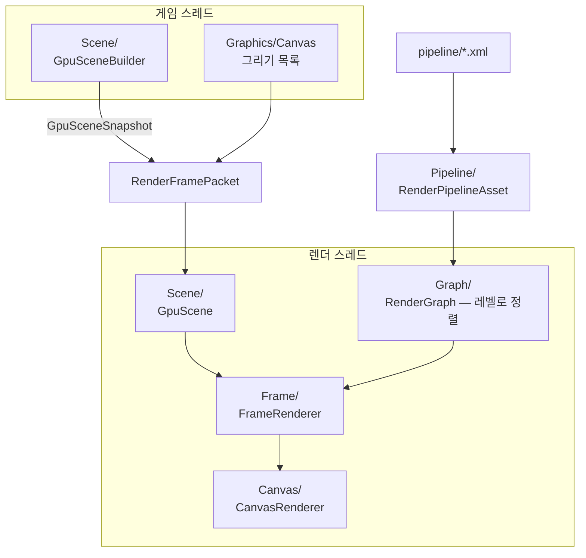

# Renderer — 한 프레임을 그리는 곳

## 이것은 무엇이고 왜 있나

[RHI](../RHI/README.md)가 그래픽 API를 감싸는 층이라면, Renderer는 그 위에서 무엇을 어떤 순서로 그릴지 정하고 실행하는 층입니다.
파이프라인 XML을 읽어 패스의 순서를 정하고, 씬을 GPU가 읽을 수 있는 데이터로 바꾸고, 렌더 스레드에서 패스마다 커맨드를 기록합니다.
언리얼의 렌더러 모듈(`FSceneRenderer`, RDG, GPUScene)에 해당합니다.

Renderer가 없으면 게임 코드가 드로우 콜을 직접 불러야 하고, 패스를 하나 더할 때마다 프레임 코드 전체를 고쳐야 합니다.
여기서는 패스 순서를 데이터(XML)로 두고, 씬과 렌더링 사이에 스냅샷이라는 경계를 둡니다. 그래서 게임 스레드와 렌더 스레드가 서로를 기다리지 않고 동시에 돕니다.

렌더링을 처음 본다면 [Graphics 문서](../README.md)를 먼저 읽으세요. 이 문서는 그다음 단계로, Renderer 코드를 읽거나 고치려는 분을 위한 것입니다.

## 머릿속 그림



기억할 개념은 네 가지입니다.

**파이프라인 정의.** `RenderPipelineAsset` 은 패스 목록입니다. 패스마다 종류(`_type`), 셰이더, 읽는 첨부(입력)와 쓰는 첨부(출력)를 선언합니다.
첨부는 패스가 그리는 렌더 타깃이고, 포맷과 클리어 값은 `RenderPassAsset` 이 정합니다. 둘 다 `Resource/engine/` 아래 XML 파일입니다.

**렌더 그래프와 레벨.** `RenderGraph` 는 패스의 입출력으로 의존 관계를 만들고 위상 정렬합니다. 서로 기다릴 필요가 없는 패스들을 같은 **레벨**로 묶습니다.
백엔드가 병렬 기록을 지원하면 한 레벨의 패스를 여러 스레드가 동시에 기록합니다.

**GPU 씬.** 씬은 게임 스레드의 것이고 렌더 스레드는 씬을 읽지 않습니다. 게임 스레드의 `GpuSceneBuilder` 가 그릴 것을 모아 `GpuSceneSnapshot` 을 만들고,
렌더 스레드의 `GpuScene` 이 스냅샷을 받아 GPU 버퍼로 올립니다. 두 클래스는 스냅샷 타입으로만 만납니다.

**프레임 실행.** `FrameRenderer` 가 한 프레임을 실행합니다. 렌더 그래프의 레벨 순서대로 패스를 기록하고, 마지막에 `Canvas` 패스로 화면 2D를 그립니다.

## 따라 해 보기 — 렌더 그래프 읽기

포워드와 디퍼드 파이프라인이 어떤 순서로 패스를 실행하는지 로그로 보겠습니다. 기본 씬에는 메시가 없으므로 벤치 큐브를 띄웁니다.

1. `Resource/engine/pipeline/forwardpipeline.xml` 을 엽니다. `Shadow` 패스는 `_listOutput` 에 `ShadowMap` 을 쓰고, `ForwardOpaque` 패스는 `_listInput` 에 `ShadowMap` 을 읽습니다.
2. 렌더 그래프를 로그로 찍습니다.

   ```powershell
   cd build/Ninja-Debug/Bin
   ./App.exe -gv_benchMeshes=8 -gv_benchAnimate=0 -gv_dumpRenderGraph=1 -gv_profileFrames=3
   ```

   로그의 `[gv_dumpRenderGraph]` 아래에 `render graph: N passes in M levels` 줄과, 레벨마다 `reads [...] writes [...]` 가 붙은 패스 이름이 나옵니다.
   포워드 파이프라인은 모든 패스가 앞 패스의 출력을 읽는 사슬이라 레벨마다 패스가 하나씩입니다.
3. 같은 명령에 `-gv_deferred=1` 을 더해 다시 실행합니다. 이번에는 `level 0` 에 `Shadow` 와 `GBuffer` 가 함께 나옵니다.
   두 패스는 서로의 출력을 읽지 않으므로 같은 레벨이고, DirectX 12와 Vulkan에서는 두 스레드가 동시에 기록합니다.
4. 아무도 읽지 않는 출력만 쓰는 패스가 있으면 `culled:` 줄에 나옵니다. "왜 이 패스가 안 도나"의 답이 여기 있습니다.
5. 패스 하나가 실제로 기록되는 코드는 `Frame/FrameRendererPassExecute.cpp` 의 `executePass` 이고, 드로우 한 번은 `Frame/FrameRendererDraw.cpp` 에 있습니다.

`-gv_dumpRenderGraph` 는 테스트용 전역 변수라 Shipping 빌드에서는 동작하지 않습니다.

## 작동 원리

### Pipeline/ — 패스를 정의하고 검증한다

- `RenderPassType`(`RenderPassAsset.h`)은 패스 종류의 열거형입니다. XML의 `_type` 이 이 열거형으로 해석되고, 해석되지 않으면 `RenderPipelineAsset::validate` 가 오류를 냅니다.
- `RenderPassTypeInfo.cpp` 는 패스 종류마다의 사실을 열거값 하나에 한 줄로 모은 테이블입니다. 기본 셰이더, PSO 기본 상태, 패스 define, 컬러 출력 수, 그리는 대상, 입력 계약이 들어 있습니다.
  엔진 PSO 등록(`ensurePassResources`), 셰이더 쿠킹 요청, `executePass` 의 분기, 파이프라인 검증이 모두 이 테이블을 읽습니다.
- 첨부마다 해상도 나눗수(`RenderPassAttachment::_resolutionDivisor`, 1, 2, 4)가 있고, 패스는 출력 첨부의 크기로 렌더 패스를 엽니다.

XML이 선언한 포맷과 코드가 만드는 것이 어긋나면 조용히 잘못 그리거나 GPU가 멈춥니다. 그래서 로드할 때 `validate()` 가 다음을 검사합니다.

- 모르는 패스 종류나 입력 역할
- 렌더 타깃이 될 수 없는 첨부 포맷(Unknown, BC 계열, R32G32B32_FLOAT)
- 한 패스 안에서 나눗수가 다른 출력
- 컬러 출력이 없는 지오메트리 패스, 컬러 출력이 2개가 아닌 GBuffer 패스

GPU 타임스탬프 슬롯(`FrameRendererUtil::kGpuTimedPassCapacity`)보다 패스가 많은 파이프라인은 로드할 때 경고하고, 넘치는 패스는 측정하지 않습니다.

### 패스 입력 역할 — XML의 선언이 곧 바인딩

풀스크린 패스(Lighting, SSAO, Bloom, Outline, TAA, Tonemap, Present)는 XML의 `_listInput` 을 모두 **역할** 이름으로 바인딩합니다(`FrameRenderer::registerDeclaredInputs`).
역할은 셰이더가 입력을 부르는 이름입니다. 첨부의 이름과 포맷으로 역할을 정하는 곳은 `resolveRenderPassInputRole` 하나입니다.

- 고정 역할 이름(GBufferAlbedo, GBufferNormal, ShadowMap, AOColor)은 그 역할이 됩니다.
- 그 밖의 깊이 첨부는 SceneDepth, 나머지 컬러 첨부는 SourceColor가 됩니다.
- 셰이더는 역할 이름으로 읽습니다(`g_SourceColorIndex`, `g_AmbientOcclusionIndex`).
- 패스의 타깃은 선언한 출력 중 처음으로 존재하는 첨부입니다.

`RenderPassInputSignature` 는 패스 종류마다 읽는 역할의 필수와 선택 목록이고, 목록은 `RenderPassTypeInfo` 테이블의 한 필드입니다.
검증과 실행이 같은 필드를 보므로 "선언은 했는데 바인딩되지 않는 입력"이 생기지 않습니다. `validate` 는 로드할 때 다음을 오류로 냅니다.

- 계약에 없는 역할을 선언한 입력. 선언만 있고 바인딩되지 않습니다.
- 빠진 필수 역할. 셰이더가 `kInvalidIndex` 를 읽게 됩니다.
- SourceColor가 둘인 패스

`FrameRenderer::setInputRoleEnabled( role, false )` 는 그 역할을 바인딩하지 않는 표시 플래그입니다. 테스트가 켠 결과와 끈 결과를 비교할 때 씁니다.

### Graph/ — 실행 순서와 레벨

`RenderGraph` 는 패스의 입출력 의존으로 위상 정렬하고 레벨로 나눕니다. 백엔드가 병렬 기록을 지원하면 한 레벨의 패스들을 여러 스레드가 동시에 기록합니다.

같은 레벨의 패스 콜백은 동시에 돕니다. 콜백이 만지는 `FrameRenderer` 의 공유 상태는 보호하거나 기록 전 준비 단계로 옮겨야 합니다. 잠금을 더하기 전에 나눌 필요가 없는 구조인지 먼저 봅니다.
기록 중에는 바인드리스 레지스트리를 바꾸거나 PSO를 만들지 않습니다(`IRHIDevice::setParallelRecording`).

배리어는 레벨 앞부분에서 한꺼번에 발행합니다(`RenderGraph::setLevelPrologue`). 그래프에서 스플릿 배리어를 뽑지 않으므로 세밀한 겹침은 포기했지만, 구조가 단순하고 병렬 기록에 안전합니다.

### Scene/ — 씬을 GPU 데이터로

세 타입이 한 줄로 이어지고, 두 스레드는 가운데 타입으로만 만납니다.

- `GpuSceneBuilder`(게임 스레드)는 `MeshComponent` 를 훑어 인스턴스 배열, 배치, 머티리얼 원소 테이블을 만듭니다. 다시 모을지 판단하는 캐시와 머티리얼 원소의 영속 ID가 여기 있습니다. GPU 핸들은 하나도 없습니다.
- `GpuSceneSnapshot` 은 게임 스레드에서 렌더 스레드로 옮겨지는 값의 전부입니다. 여기 없는 값은 옮겨질 수 없습니다.
- `GpuScene`(렌더 스레드)은 스냅샷을 받아 인스턴스 구조체 버퍼, 배치 테이블, 간접 인자, 머티리얼 버퍼로 올립니다. 씬을 볼 수 없습니다.

`FrameRenderer::execute( pScene )` 는 에디터와 테스트가 쓰는 직접 경로입니다. 이 경로도 자기 빌더로 스냅샷을 만들어 같은 경로로 올립니다.

GPU 풀은 렌더 스레드가 소유합니다.

- `GpuMeshVertexPool` 은 씬 메시의 정점을 정점 버퍼 하나에 이어 붙입니다. 메시 집합이 같으면 다시 만들지 않습니다.
- `GpuMeshMorphPool` 은 모프와 스키닝 결과를 담습니다. 결과 버퍼는 앞이 모프 메시, 뒤가 스킨 인스턴스인 두 구간입니다.
  스킨 데이터(레스트 포즈와 가중치)는 원본(`Mesh::getSkinDataId`)마다 한 번만 올라가고, 그리는 메시마다 인스턴스 테이블 한 줄이 결과와 원본을 연결합니다.
  컴퓨트 셰이더(`meshskin.hlsl`)는 디스패치 하나로 모든 정점을 처리하고, 정점마다 이분 탐색으로 자기 인스턴스를 찾습니다.
- `GpuVertexAnimationPool` 은 정점 애니메이션 텍스처(VAT)가 있는 메시(`Mesh::setVertexAnimation`)의 테이블을 버퍼 하나에 이어 붙입니다. 테이블은 베이크한 뒤 변하지 않으므로 집합이 바뀔 때만 올립니다.

스킨 팔레트는 본마다 행렬 하나이고, 게임 스레드의 `AnimationSystem` 이 만듭니다. `GpuSceneBuilder::collectSkinPalettes` 가 매 프레임 스냅샷으로 옮기고,
렌더 스레드의 `GpuMeshMorphPool::uploadSkinPalettes` 가 올립니다. 군중 배치와 팔레트를 나눠 쓰는 유닛은 건너뛰고 배치가 한 번 싣습니다.
스킨드 메시의 모프 타깃은 레스트 버퍼 뒤에 원본마다 한 번 두고, 컴퓨트가 스키닝 **앞에** 더합니다. 스킨이 없는 메시의 모프는 이 경로를 타지 않습니다.

### 드로우 경로 — 인스턴스, 배치, 멀티 드로우

메시 드로우는 인스턴스마다의 월드 행렬과 머티리얼 번호를 드로우 인자가 아니라 영속 구조체 버퍼에서 읽습니다. 언리얼의 GPUScene과 같은 방식입니다.
인스턴스 원소(`SwInstanceData`)의 정의는 `instancedata.hlsli` 하나이고, 그래픽스와 컴퓨트 셰이더가 같이 씁니다. C++의 `GpuInstance` 와 128바이트 레이아웃이 같습니다.

드로우 한 번은 이렇게 데이터를 찾습니다.

1. 입력 어셈블러가 **인스턴스 슬롯 스트림**(정점 슬롯 1, `SW_INSTANCESLOT`)에서 `startInstance + i` 를 줍니다. 간접 인자의 `startInstance` 가 배치의 시작입니다.
2. 정점 셰이더가 `swLoadInstance( input.instanceSlot )` 로 자기 인스턴스를 읽어 월드 행렬과 `materialIndex` 를 얻습니다. `inst.meshBatchIndex` 로 배치 테이블도 읽습니다.
3. 픽셀 셰이더가 `SW_MATERIAL( materialIndex )` 로 셰이더 종류별 머티리얼 버퍼(`g_SwMaterials`, t9)의 원소를 읽습니다.

`SV_InstanceID` 는 쓰지 않습니다. `startInstance` 를 포함하는지가 API마다 다르기 때문입니다.
`g_SwInstancesIndex` 가 `kInvalidIndex` 면 셰이더는 `g_World` 와 `g_MaterialIndex` 를 대신 씁니다. 풀스크린 패스와 테스트 픽스처 드로우가 이 경로입니다.

배치마다 다른 값은 드로우 호출이 아니라 버퍼가 줍니다.

- **정점 풀.** 간접 인자의 `startVertex` 가 풀 안의 오프셋입니다. 풀에 들어가지 못한 메시는 자기 정점 버퍼를 쓰고 멀티 드로우로 묶이지 않습니다.
- **배치 테이블**(`g_SwBatches`, t13, `GpuBatchInfo` 32바이트). 배치의 인스턴스 시작, 모프 풀 시작, 정점 풀 시작, VAT 테이블 시작이 들어 있습니다. 패스마다 한 번 바인딩하고, 컬링의 t1과 같은 버퍼입니다.
- **VAT 테이블**(`g_SwVertexAnimation`, t14). 메시마다 머리 원소(프레임 수, 프레임률, 정점 수, 반복)와 "프레임 × 정점" 개의 float4가 있습니다.
  정점 셰이더(`swLoadAnimatedVertex`)가 군중 시계(`g_SwVertexAnimationTime`)와 인스턴스의 `vertexAnimationPhase` 로 두 프레임을 골라 보간합니다.
  그래서 먼 군중은 CPU 포즈 계산과 GPU 스키닝 없이 인스턴스마다 다른 위상으로 한 번에 그려집니다.
- **루트 상수.** 그룹마다 하나(`g_SwMaterialCount`)를 `setGraphicsRootConstants` 로 넘깁니다. DirectX 12는 루트 상수, Vulkan은 푸시 상수, DirectX 11과 OpenGL은 b2 상수 버퍼로 흉내 냅니다.

같은 PSO와 머티리얼 상태(버퍼, 상수 버퍼, 텍스처, 원소 수)를 쓰는 연속 배치는 `drawIndirect( args, offset, count )` 한 번(멀티 드로우)으로 그립니다.
인스턴스 버퍼와 머티리얼 버퍼를 백엔드마다 어떻게 바인딩하는지는 [Shader 문서](../Shader/README.md)의 "백엔드별 바인딩"에 있습니다.

API 차이 하나는 남습니다. `SV_VertexID` 는 Vulkan과 OpenGL에서 `startVertex` 를 포함하고, Direct3D에서는 드로우 안의 0부터 시작하는 번호입니다.
`binding.hlsli` 의 `swComputeMorphElement` 가 이 차이를 흡수하고, `RHIDeviceTest.SceneDrawVertexIdStartsAtZeroOnlyOnD3D` 가 네 백엔드의 기대값을 확인합니다.

DirectX 12 커맨드 시그니처로 루트 상수를 주입하고 Vulkan과 OpenGL의 DrawIndex를 쓰는 설계는 버렸습니다. 이미지는 맞았지만 DirectX 12 ExecuteIndirect가 런타임 패치 때문에 호출당 두 배 느려졌습니다.
비용은 상태 변경이 아니라 호출 수에서 오므로 정렬 순서를 바꿔도 줄지 않았습니다.

문제를 좁힐 때는 `-gv_drawMerge=0`(배치마다 따로 호출)과 `-gv_vertexPool=0`(메시마다 자기 정점 버퍼)을 씁니다.

### Frame/ — 실제로 그린다

`FrameRenderer` 는 클래스 하나를 여러 `.cpp` 로 나누고, 파일 이름이 곧 주제입니다.

| 파일 | 주제 |
|---|---|
| `FrameRenderer` | 수명, 파이프라인 로드, 프레임 진입 |
| `FrameRendererResources` | 기록 전에 만들어야 하는 패스 리소스 |
| `FrameRendererTransients` | 첨부(렌더 타깃)의 수명과 조회 |
| `FrameRendererReadback` | 첨부를 CPU로 읽기(테스트, 스크린샷) |
| `FrameRendererCompute` | 그리기 전에 도는 컴퓨트 프리패스 |
| `FrameRendererConstants` | 프레임마다 한 번 채우는 상수 |
| `FrameRendererPassExecute` | 패스 종류별 실행 분기 |
| `FrameRendererDraw` | 드로우 루프 |
| `FrameRendererViews` | 추가 뷰의 준비와 그리기 |
| `FrameRendererPso` | 머티리얼 PSO와 뷰 모드 define |

- `FrameRendererReadback` 은 GPU를 기다리므로 프레임 경로에서 쓰지 않습니다.
- `FrameRendererCompute` 의 프리패스는 다섯 가지입니다. 인스턴스 애니메이션, 메시 모프, 메시 스킨, GPU 컬링, 인스턴스 정렬입니다. 그래프 패스가 아니라 그리기 전에 커맨드 리스트에 직접 기록합니다.
- 뷰 모드(`RenderViewMode`: Lit, Unlit, Wireframe)가 더하는 define은 `FrameRendererUtil::findViewModeDefine` 하나가 정하고, 셰이더 쿠킹 요청도 같은 함수를 부릅니다.
  쿠커가 쿠킹하지 않은 define은 Shipping에서 PSO를 만들 수 없기 때문입니다.

`FrameRenderer` 는 자기 뮤텍스와 수명을 가진 상태 세 개를 클래스로 분리해 소유합니다.

- `PassConstantRing` 은 드로우마다 패스 상수 버퍼 슬롯을 하나씩 나눠 주는 링입니다. 원자적 커서를 쓰고 프레임마다 되감습니다.
- `RenderPsoCache` 는 엔진 패스 PSO, 출력 패스(Present, Canvas)의 대상 포맷별 PSO, 머티리얼 퍼뮤테이션 변형과 바인딩 레이아웃을 소유합니다.
  만드는 일은 `FrameRendererPso` 가 하고, 해제 순서(변형, 패스, 출력 포맷별)는 캐시가 압니다.
- `TransientAttachmentPool` 은 이름으로 찾는 프레임 첨부 풀입니다. "이번 프레임에 이미 클리어했는가"도 여기서 기억합니다.

그 밖의 주요 타입은 다음과 같습니다. 각 타입의 자세한 설명은 헤더의 `@brief` 에 있습니다.

- `RenderView` 는 뷰 하나의 행렬, 절두체, 컬링 상수 버퍼, 정렬 상수 버퍼입니다. 메인 카메라, 그림자 라이트, 추가 뷰가 각자 하나씩 가집니다.
- `RenderViewCollector` 는 게임 스레드에서 씬의 카메라를 훑어 주 뷰 설정과 추가 뷰 요청을 만듭니다.
- `RenderViewScheduler` 는 추가 뷰 중 이번 프레임에 그릴 것을 갱신 주기, 보임 여부, 예산(`gv_renderViewBudget`)으로 고릅니다. 늦은 뷰가 먼저이고, 같으면 덜 그린 뷰가 먼저입니다.
- `ShaderParameterBinder` 는 리플렉션이 알려 준 슬롯에 실제 값을 바인딩하고, `FrameResourceRegistry` 는 패스 범위에서 이름으로 리소스를 찾습니다.
- `RenderFramePacket` 은 게임 스레드가 렌더 스레드로 넘기는 프레임 데이터입니다.

렌더링은 기본적으로 전용 렌더 스레드(`RenderThread`)에서 돕니다(`gv_useRenderThread`, 기본 true). 게임 스레드는 패킷을 넘기고 바로 다음 프레임으로 갑니다.

### 화면 2D — Canvas 패스와 CanvasRenderer

UI와 화면 글자는 파이프라인의 마지막 `Canvas` 패스가 그립니다. 게임 스레드의 UI가 `Graphics/Canvas` 의 그리기 목록을 채워 패킷에 싣고,
렌더 스레드의 `Canvas/CanvasRenderer` 가 그 목록만 읽어 그립니다. 언리얼의 `FSlateRHIRenderer` 에 해당합니다. 목록을 만드는 쪽은 [UI 문서](../../UI/README.md)와 [Text 문서](../../Text/README.md)에 있습니다.

- **준비와 기록을 나눕니다.** `CanvasRenderer::prepareFrame` 은 기록을 시작하기 전에 버퍼와 텍스처를 만들고 바인드리스에 등록합니다. 기록 중의 `drawList` 는 조회와 기록만 합니다.
- **글리프 아틀라스는 CPU 사본을 가집니다.** 아틀라스 페이지(R8)마다 CPU 사본을 두고, 바뀐 구간만 영역 업로드로 올립니다.
  디바이스를 다시 만들거나 백엔드를 바꿔도 게임 스레드에 묻지 않고 페이지를 다시 올릴 수 있습니다.
  업로드 비용은 바이트가 아니라 호출 수가 정하므로, 페이지 하나의 구간이 많으면 그 경계 상자 하나로 합칩니다(`mergeUploadRegions`).
- **배치마다 한 번 그립니다.** 사각형은 구조체 버퍼(t15)에 올리고, 배치마다 가위, 루트 상수(시작 위치, 텍스처 네 개, 대상 크기, 색각 보정), `drawInstanced( 6, n )` 을 기록합니다. 셰이더는 `canvas.hlsl` 입니다.
- **톤 매핑 뒤에 그립니다.** 주 출력(백버퍼, 게임 뷰 렌더 타깃, 스크린샷 캡처)은 `resolvePresentTarget` 하나가 고르고 Present와 Canvas가 같이 씁니다.
  Canvas는 Present 뒤에 같은 출력에 Load로 그립니다. UI는 톤 매핑을 거치지 않으므로 색각 보정(`gv_colorVisionMode`)을 캔버스 셰이더가 직접 적용합니다(`g_SwCanvasColorVision`, 함수는 `colorvision.hlsli`).

### 다중 뷰 — 카메라마다 출력 하나

카메라는 `CameraComponent::setRenderOutput` 으로 출력을 고릅니다. 화면 전체(주 카메라), 화면 사각형(분할 화면, PiP), 렌더 텍스처(CCTV 모니터, 백미러, 미니맵) 셋 중 하나입니다.
렌더 텍스처는 언리얼의 SceneCapture2D에 해당합니다. 이름은 `rendertarget/` 으로 시작하고(`TextureCache::isRenderTargetPath`), 머티리얼은 그 이름을 일반 텍스처처럼 적어 읽습니다.
카메라가 등록될 때 크기를 알리면(`declareRenderTarget`) 캐시가 렌더 타깃 텍스처로 만듭니다.

- 뷰 하나(`FrameRenderer::ViewTarget`)는 자기 트랜지언트 풀, 컬링 입력, TAA 기록, 커맨드 리스트, 출력 텍스처를 가집니다. 트랜지언트 풀의 크기에는 해상도 배율이 곱해집니다.
- `GpuScene` 의 컬링 슬롯은 0이 주 뷰, 1이 그림자, 2부터가 추가 뷰입니다(`kFirstExtraCullView`, 최대 `kMaxExtraRenderView`).
- 프레임 순서는 프리패스, 렌더 텍스처 뷰, 주 뷰, 화면 사각형 뷰입니다. 프리패스에서 이번에 그릴 모든 뷰의 컬링을 한 번에 합니다. 화면 사각형 뷰는 주 화면 위에 덮어 그립니다.
- 패스 상수는 주 뷰의 값에서 출발해 뷰-투영 행렬, 풀 크기, 플래그, 컬링 슬롯만 덮어씁니다. 라이트와 그림자 행렬은 프레임 공통입니다.
- 그림자 볼륨은 주 카메라에 맞춥니다(`DirectionalLightComponent::buildShadowProjectionForView`). 추가 뷰가 다른 곳을 보면 주 볼륨 밖의 그림자는 그 뷰에서 빠집니다.
- 그림자를 끈 뷰는 그림자 맵을 지우기만 하고, 후처리를 끈 뷰는 `SW_PASS_FLAG_SKIP_POST` 로 후처리 사슬이 원본을 고릅니다.
- **컷 프레임**(`RenderViewSettings::_bCut`, `CameraComponent::markCut`)에서는 TAA가 기록 대신 이번 원본을 바인딩해 지난 화면이 섞이지 않습니다. 모션 벡터와 자동 노출은 아직 없습니다.

### Capture/ — 초상화 베이크

`PortraitRenderer` 는 프리팹 하나를 격리된 스튜디오에서 그려 RGBA8로 읽어 옵니다. 명령은 `App --render-portraits=<prefab,..> [--portrait-size=N] [--portrait-dir=D]` 이고, 런타임 진입점은 `EngineLoop::renderPortraits` 입니다.
격리는 두 가지입니다. `SceneManager` 에 등록하지 않은 별도 `Scene` 이라 게임 씬의 빛과 안개, 오브젝트가 끼어들지 않고, 게임 틱과 저장, 에디터도 이 씬을 보지 않습니다.
또 별도 `FrameRenderer` 인스턴스라 주 렌더러의 TAA 기록, 풀, `GpuScene` 을 건드리지 않습니다. 직접 경로 `execute( pScene )` 에 출력 크기만 덮어씁니다.
같은 디바이스를 쓰므로 렌더 스레드를 멈추고(`RenderThread::waitIdle`) 그립니다. 메시 로컬 경계 상자를 감싸는 구로 프레이밍하고, 키 라이트 하나와 환경광만 비춥니다. 파일은 `Resource/ImageFileWriter` 로 PNG나 DDS로 씁니다.

### Cook/ — 무엇을 쿠킹할지

`Cook/ShaderCookDriver` 와 `ShaderCookRequest.cpp` 는 오프라인 셰이더 쿠킹의 정책입니다. 파이프라인 XML, 패스 종류 테이블과 뷰 모드, 머티리얼을 보고 쿠킹할 요청을 모읍니다.
패스 종류를 아는 렌더러의 지식이라 여기 있고, 셰이더 한 개를 쿠킹하는 방법은 `Shader/` 가 압니다. 자세한 규칙은 [Shader 문서](../Shader/README.md)에 있습니다.

### Debug/ 는 Renderer 밖에 있다

디버그 그리기 큐(`DebugDrawQueue`)와 렌더 타깃 목록(`RenderTargetRegistry`)은 `Source/Engine/Graphics/Debug/` 에 있습니다. Renderer보다 아래 층(티어 5)이라 게임 코드와 개발 명령이 렌더러를 몰라도 넣을 수 있습니다.
`DebugDrawQueue` 는 GPU에 바로 그리는 API가 아니라 CPU 큐입니다. 그 프레임에 넣은 선, 구, 상자, 화살표, 글자는 `endFrame` 에 확정되어 다음 에디터 프레임에 보이고, 에디터 Game View가 그립니다.
씬이 멈춘 프레임에는 표시 시간이 흐르지 않습니다.

### 소유와 수명 — 누가 만들고, 누가 놓고, 누가 빌리나

누가 소유하고 누가 빌리는지를 타입에 둡니다. 그렇지 않으면 렌더 스레드가 만든 값을 게임 스레드가 덮어쓰고, 스냅샷이 해제된 머티리얼을 읽고, 게임 모듈이 만든 객체를 엔진이 모듈이 언로드된 뒤에 해제하려 합니다.

| 객체 | 만드는 곳 | 렌더 스레드가 보는 방법 |
|---|---|---|
| `Mesh` | `Mesh::create*()` | 스냅샷이 `shared_ptr` 로 함께 소유 |
| `Material` | `Material::create()`, `MaterialCache` | 스냅샷이 `shared_ptr` 로 함께 소유 |
| `MaterialInstance` | `MaterialInstance::create()` | 스냅샷이 함께 소유, `updateRhi` 호출 |
| `Texture2D` | `TextureCache` | 직접 보지 않고 SRV 인덱스 값만 |
| GPU 핸들 | `IRHIResourceFactory` | 해제는 펜스 뒤로 미룸 |
| `GpuSceneSnapshot` | `GpuSceneBuilder::exportCpuSnapshot` | `GpuScene::adoptCpuSnapshot` 이 통째로 받음 |
| GPU 슬롯, 간접 개수 | `GpuScene::upload` | 스냅샷에 없어 옮겨지지 않음 |

규칙은 일곱 가지입니다.

1. **스레드를 넘어 역참조하는 것은 소유를 함께 싣습니다.** 스냅샷과 패킷의 멤버는 `shared_ptr` 이거나 값입니다.
   원시 포인터는 `GpuMaterialElementKey` 같은 식별 키에만 씁니다. 키는 비교만 하고 역참조하지 않습니다.
2. **한쪽만 만드는 값은 그쪽 타입에만 둡니다.** 옮겨지는 값은 `GpuSceneSnapshot` 하나에 모으고, `export` 와 `adopt` 는 그 타입을 통째로 옮깁니다. 필드를 골라 복사하는 함수를 다시 만들지 않습니다.
   만드는 쪽(`GpuSceneBuilder`)과 받는 쪽(`GpuScene`)이 다른 클래스라, 렌더 스레드가 씬을 읽거나 게임 스레드가 GPU 핸들을 만지는 코드는 컴파일되지 않습니다.
3. **모듈 경계를 넘어 소유될 수 있는 객체는 Engine의 `create()` 로만 만듭니다.** `shared_ptr` 의 제어 블록은 `make_shared` 를 부른 DLL에 있습니다.
   그래서 `Material`, `MaterialInstance`, `Mesh` 의 생성자는 `create()` 만 만들 수 있는 키(`CreateKey`)를 요구합니다. 모듈에서 `make_shared` 하거나 스택에 값으로 두면 컴파일되지 않습니다.
   덕분에 `shared_ptr` 로 소유되지 않은 머티리얼은 존재할 수 없고, 스냅샷은 언제나 `shared_from_this` 로 소유를 빌릴 수 있습니다.
   `Material*` 인자는 ADL로 `std::make_shared` 를 끌어오므로 Engine 안에서도 `sw::make_shared` 로 한정해 씁니다.
4. **소유는 디바이스보다 먼저 놓습니다.** 엔진 초기화 목록에서 FrameRenderer 단계가 RHI 단계 뒤에 있으므로, 역순 종료에서 스냅샷 소유를 먼저 놓고 디바이스를 종료합니다.
   소멸자에 맡기면 디바이스가 종료된 뒤에 GPU 리소스를 돌려주려 합니다.
5. **핸들 값은 디바이스 안에서만 식별자입니다.** 할당 순서가 결정적이라 새 디바이스의 첫 PSO, 버퍼, 디스크립터는 옛 디바이스와 같은 번호를 받습니다.
   핸들 값으로 "그대로인가"를 판단하는 캐시(`FramePassContext` 의 마지막 바인딩, `RenderGraphExecutionContext` 의 리소스 상태)는 디바이스를 종료할 때 함께 잊습니다(`resetBindingCache`, `reset`).
   GPU 버퍼를 보관하는 객체는 핸들만 두지 말고 `RHIResidentBuffer`(핸들과 디바이스)로 보관합니다. `isResident()` 가 올라가 있는지를, `getLiveDevice()` 가 해제해도 되는 디바이스를 알려 줍니다.
6. **GPU 리소스를 보관하는 객체는 예외 없이 `RHIRenderResource` 를 상속합니다.** 지금은 `Mesh`, `Material`, `MaterialInstance`, `Texture2D` 네 개입니다.
   디바이스 수명 이벤트가 레지스트리를 거쳐 이 객체들에 전해집니다(전달 순서는 [RHI 문서](../RHI/README.md)의 "GPU 리소스를 놓는 세 가지 방법").
   바깥에서 캐시를 훑어 한꺼번에 해제하거나 다시 만드는 함수를 만들지 않습니다. 목록에서 빠진 객체가 조용히 틀립니다.
7. **게임 모듈이 씬 오브젝트를 보관할 때는 핸들로 합니다.** 모듈 리로드나 RHI 교체로 상태를 복원하면 씬을 통째로 지우고 다시 만듭니다.
   원시 포인터는 해제된 주소가 되고 `ComponentHandle` 은 nullptr가 됩니다. 절차적으로 만든 오브젝트는 스냅샷에 싣지 말고
   `onBeforeStateSerialize` 에서 정리하고 `onAfterStateDeserialize` 에서 다시 만듭니다(`BenchScene` 이 그 예).

GPU 리소스는 그리기 전에 만듭니다. 게임 스레드가 이번 프레임에 그릴 것을 알고 있으므로, 스냅샷을 넘기기 전에 `GpuUploadQueue` 로 넘겨 워커가 병렬로 만듭니다.
워커에서 만들 수 있는지는 백엔드가 `_bThreadSafeResourceCreation` 으로 답합니다. OpenGL은 컨텍스트가 스레드에 묶여 있어 큐가 받지 않고, 렌더 스레드가 그 프레임에 만듭니다.
큐는 미리 만드는 장치일 뿐 유일한 경로가 아닙니다. 큐가 처리하지 못한 것은 렌더 스레드가 그 자리에서 만들고, `Mesh::initRhi` 는 여러 번 불러도 결과가 같습니다. `-gv_gpuUploadQueue=0` 으로 끌 수 있습니다.

옮겨지는 값의 집합은 `GpuSceneSnapshot` 타입이, 생성과 소유 방식은 `CreateKey` 생성자가 컴파일 시점에 지킵니다.
C++가 막지 못하는 것은 옮겨지는 구조체에 원시 포인터 필드를 더하는 일 하나이고, 이것은 `Scripts/lint/gate/CheckRenderOwnership.py` 가 막습니다.
예외는 그 줄에 `// SW_OWNERSHIP_RAW_OK( _pMember ): <이유>` 를 붙입니다(적은 멤버만 면제, 그 멤버가 사라지면 낡은 표식으로 실패).

회귀 테스트는 `RenderPassGpuTest.MaterialLifetimeFollowsPacket`(ASAN 프리셋에서 해제 후 사용을 잡는다)과 `RenderPassGpuTest.RendererSurvivesDeviceRecreate` 입니다.
앱에서 재현하려면 `-gv_rhiSwapAtFrame=30 -gv_rhiSwapTo=<0..3> -gv_screenshotFrame=100` 을 씁니다. 번호는 DX11이 0, DX12가 1, Vulkan이 2, OpenGL이 3입니다.

### 언리얼과 같은 것, 다른 것

남은 일은 [백로그](../../../../docs/06_Backlog.md)의 그래픽스 절에 있습니다. 여기에는 구조와 그 이유만 둡니다.

언리얼과 같은 것:

- **Present PSO는 대상 포맷마다 하나입니다.** PSO의 렌더 타깃 포맷은 바인딩된 타깃의 실제 포맷(`getTextureFormat( handle )`, `getBackBufferFormat()`)에서 가져옵니다.
  `buildPresentPsoVariants` 가 준비 단계에서 백버퍼와 오프스크린 포맷의 PSO를 미리 만들고, 기록 중의 `ensurePresentPso` 는 조회만 합니다.
  PSO 생성은 잠금 없는 핸들 테이블과 Vulkan 렌더 패스 캐시를 건드리므로 태스크 워커에서 만들면 안 됩니다.
- **패스 상수 버퍼는 드로우마다 슬롯을 받습니다**(`PassConstantRing`). 기록 전에 `PassConstantRing::ensureCapacity` 로 배치 수만큼 확보합니다.
  버퍼 하나를 드로우들이 나눠 쓰면 GPU는 제출 뒤에 읽으므로 모두 마지막 값을 봅니다. `RenderPassGpuTest.MultiBatchPassKeepsPerBatchConstants` 가 메시 두 개로 이것을 확인합니다.
- **머티리얼 원소는 영속 ID를 가집니다.** 처음 본 조합에만 슬롯을 주고, 쓰이지 않으면 나중에 회수하지만 슬롯을 옮기지 않습니다.
  옮기면 인스턴스에 적힌 `materialIndex` 가 엉뚱한 원소를 가리킵니다(`GpuSceneTest.MaterialElementIdsPersistAcrossBuildsAndAreFreed`).
- **머티리얼 폴백 버퍼는 stride마다 하나입니다**(`ensureMaterialFallbackBuffers`, stride는 `ShaderBindingSlot::_elementStride`). SRV의 구조체 stride는 셰이더 선언과 같아야 하기 때문입니다. 언리얼 RDG의 더미 버퍼와 같은 규칙입니다.
- **스프라이트의 프레임과 색은 인스턴스 필드입니다**(`GpuInstance::_sprite`, 16바이트 `GpuSpriteInstanceData`). 언리얼의 Custom Primitive Data에 해당합니다.
  배치 키를 건드리지 않으므로 같은 텍스처의 스프라이트는 한 번에 그려집니다(`RenderPassGpuTest.SpriteFramesAndTintsArePerInstance`). 스프라이트 메시는 양면 사각형(`MeshUtil::createSpriteQuad`)입니다.
- **값이 실제로 바뀔 때만 일합니다.** 상수 버퍼와 바인딩 상태는 내용이 달라질 때만 버전을 올리고 다시 만듭니다. 같은 값을 다시 넣는 호출이 흔하기 때문입니다.

일부러 다르게 둔 것:

- **트랜지언트 메모리 앨리어싱이 없습니다.** 트랜지언트 첨부마다 별도 텍스처를 프레임 내내 보관합니다. 정확성이 아니라 메모리 사용량의 차이입니다.
- **DirectX 12에는 PSO 디스크 캐시(`ID3D12PipelineLibrary`)가 없습니다.** Vulkan은 종료할 때 파이프라인 캐시를 저장합니다.
- **텍스처 배열의 용량은 고정이고,** 인덱스는 펜스 뒤에 재사용합니다. 스트리밍과 축출은 디스크립터가 아니라 텍스처 스트리밍이 할 일입니다.
- **DirectX 11과 OpenGL에서는 머티리얼 경계가 배치 경계입니다.** 텍스처를 슬롯에 바인딩하기 때문입니다. DirectX 12와 Vulkan은 셰이더 종류 단위로 배치를 합칩니다(`GpuSceneBuilder::setMergeBatchesAcrossMaterials`).

## 확장하는 법

### 새 패스 종류 더하기

1. `Pipeline/RenderPassAsset.h` 의 `RenderPassType` 에 값을 더합니다. 마지막 열거값을 바꾸면 `kRenderPassTypeCount` 도 직접 고칩니다. `RenderPassTest.TypeInfoTableCoversEveryEnumValue` 가 빠뜨린 것을 잡습니다.
2. `Pipeline/RenderPassTypeInfo.cpp` 에 case 하나를 더해 기본 셰이더, define, 포맷, 클리어, 입력 계약, 플래그를 적습니다.
3. 파이프라인 XML에 그 `_type` 의 패스를 선언합니다.
4. 패스가 고유한 실행 코드가 필요할 때만 `executePass` 의 switch에 case를 더합니다. 런타임 PSO와 쿠커는 같은 `selectRenderPassShader` 를 부릅니다.
5. `App.exe --cook-shaders` 로 셰이더를 다시 쿠킹하고, `-gv_dumpRenderGraph=1` 로 순서를 확인합니다.

### 새 입력 역할 더하기

1. 역할 열거형에 값과 이름을 더합니다.
2. `RenderPassTypeInfo` 테이블의 입력 계약 필드에 그 역할을 적습니다.
3. 패스 상수 버퍼(`binding.hlsli` 의 PassCB)에 `g_<Role>Index` 를 더합니다.
4. DirectX 11과 OpenGL의 슬롯 에뮬레이션 테이블(`swSampleIndex`, `commitBindlessTextureBindings`)에 그 역할을 더합니다.

### 머티리얼로 배치를 거르는 패스

씬 메시 패스는 그릴 머티리얼을 define으로 거를 수 있습니다(`_pRequiredMaterialDefine`). 메시 외곽선 패스(`MeshOutline`)는 `MATERIAL_OUTLINE` 이 있는 배치만 그립니다.
드로우(`FrameRenderer::drawsBatchInPass`), 머티리얼 PSO 변형(`ensureMaterialPsos`), 셰이더 쿠킹(`ShaderCookRequest`)이 모두 같은 판정 `FrameRendererUtil::drawsMaterialInPass` 를 씁니다.
언리얼의 메시 패스 프로세서가 머티리얼 속성으로 드로우를 거르는 것과 같습니다. 툰 머티리얼의 외곽선은 [Material 문서](../Material/README.md)에 있습니다.

## 함정과 주의

### 씬과 스냅샷

**렌더 스레드는 씬을 볼 수 없습니다.** 런타임 경로의 `_pScene` 은 늘 null이고, `GpuSceneSnapshot` 이 유일한 채널입니다. CPU 폴백을 다시 만들지 마세요.
스냅샷에는 게임 스레드가 만든 값만 싣습니다. 렌더 스레드가 파생하는 값(`_indirectCommandCount`)을 실으면 게임 스레드의 0이 덮어써서 "카메라를 움직일 때만 메시가 보인다"는 증상이 납니다.
패킷은 자기완결이어야 하고 소유(`shared_ptr`)를 함께 싣습니다.

**`FrameRenderer` 하나로 두 씬을 번갈아 그리면 예전 배치가 나옵니다.** 빌더의 수집 캐시(프리미티브 집합 세대)가 씬마다 따로가 아니라서, 다른 매니저의 같은 세대 번호를 "그대로"로 봅니다.
픽셀을 비교하는 테스트는 씬마다 렌더러를 따로 둡니다(`RenderPassGpuTest.SkinnedMeshFollowsPaletteLikeCpuSkinning`).

**`GpuSceneBuilder` 의 수집 규칙을 지키세요.** 전체 수집과 부분 수집은 같은 `fillCandidateFromPrimitive` 를 씁니다.
집합이나 퍼뮤테이션 세대가 바뀌거나 더티가 1/4을 넘으면 전체를 수집합니다. 부분 수집 프레임에는 회수 시계를 멈추지만 머티리얼 원소 회수는 계속합니다.
퍼뮤테이션 해시는 `SortKey` 에 직접 넣고, 멈춘 씬을 다시 수집하는 계기는 `MaterialUtil::getPermutationGeneration()` 입니다.
한 번 넘긴 인스턴스 배열은 다시 고치지 않습니다(`GpuInstanceRing` 은 `use_count()==1` 인 슬롯에만 씁니다). `rebuildTransparentTail` 은 앞부분 갱신과 같은 `runParallel` 의 블록 0입니다.
`DrawCandidate` 의 `shared_ptr` 을 원시 포인터로 바꾸지 마세요. 같은 주소에 새 메시가 만들어지면 ABA 문제가 생깁니다. `PrimitiveRegistry` 의 더티는 렌더 상태와 월드 행렬 두 가지뿐입니다.

**인스턴스 배치를 보관하는 컴포넌트는 `setOwnerComponent( this )` 를 부르고, 활성 상태가 바뀌면 `markAllEntriesDirty` 를 부릅니다.**
활성 변화는 `onOwnerActiveInHierarchyChanged` 와 `_bActive` 의 `onPropertyChanged` 로 옵니다. 빌더는 `MeshComponent` 와 같은 규칙(`Component::isActive`)으로 소유 컴포넌트가 꺼진 배치를 뺍니다.
더티를 표시하지 않으면 부분 수집이 지난 프레임의 후보를 그대로 씁니다.

**새 디바이스는 첫 PSO와 버퍼에 옛 디바이스와 같은 번호를 줍니다.** 디바이스보다 오래 사는 캐시는 `releasePassResources` 와 `shutdown` 에서 잊습니다.
머티리얼 레지스트리를 비울 때는 그룹 목록과 셰이더 경로 맵을 함께 비웁니다. 한쪽만 비우면 투명 물체가 알파 0으로 사라집니다.
다시 만들지 판단할 때는 바인드리스 인덱스가 아니라 세대 번호를 가진 핸들을 봅니다. DirectX 11과 OpenGL은 인덱스를 바로 재사용하기 때문입니다.

### 스키닝과 모프

**스킨 팔레트는 `AnimationSystem::getUnits()` 에서 모읍니다. 레벨에서 모으지 마세요.** `unregisterUnit` 은 레벨을 다음 평가까지 비웁니다.
레벨로 모으면 유닛 하나가 빠지는 프레임에 모든 스킨드 메시가 팔레트 없이 바인드 포즈(T 포즈)로 한 번 그려집니다(`GpuSceneTest.SkinPalettesSurviveAUnitLeavingTheFrame`).

**팔레트 행은 행벡터 4x4 행렬의 열 세 개입니다.** 행을 넣으면 회전이 전치됩니다.
모프 타깃은 같은 컴퓨트에서 스키닝 **앞에** 더합니다. 스키닝 뒤에 더하면 민 방향이 본과 함께 돌지 않습니다(`RenderPassGpuTest.MorphWeightsDeformBeforeSkinningLikeCpu`).

**GPU 모프는 구조체 버퍼 풀과 정점 셰이더의 인덱스 읽기로 합니다.** 정점 버퍼에 UAV를 붙일 수 없고, DirectX 12 정점 버퍼는 UPLOAD 힙이며, DirectX 11은 겸용이 안 되기 때문입니다.
`Mesh::setVertices` 는 매번 GPU 버퍼를 다시 만들므로 매 프레임 CPU에서 정점을 고치지 마세요.

### 패스와 그래프

**패스 입력은 선언이 곧 바인딩입니다.** 첨부 역할은 `_role` 선언, 기준 이름, 포맷 순서로 정해집니다.
`findTransient` 의 핸들 0은 백버퍼입니다. 없는 첨부를 열면 장면이 백버퍼로 그려집니다. `beginColorPass` 가 false를 반환하면 그리지도 닫지도 않습니다.

**그래프의 간선 규칙.** 읽은 뒤 쓰기(WAR) 간선은 "생산자 다음의 쓰기"에 겁니다. 같은 이름의 패스는 거절합니다.
`executeParallel` 은 모든 레벨의 리스트를 먼저 마련하고, 하나라도 못 하면 false를 반환합니다. 직렬로 폴백하면 앞 레벨을 두 번 그리기 때문입니다.

**깊이 첨부도 렌더 그래프의 쓰기입니다.** 그래프는 선언 순서상 앞선 쓰기를 생산자로 고르므로, 불투명 깊이를 읽을 패스(SSAO, 외곽선)는 투명 패스보다 **먼저** 선언합니다.
DirectX 11은 첨부 전이(`prepareTextureForRenderTarget`)에서 그 텍스처가 바인딩된 픽셀 셰이더 SRV 슬롯을 해제합니다(`D3D11RecordingState::_arrPixelSrvTexture`).

**첨부의 `_resolutionDivisor` 를 쓰면 패스는 출력 첨부 크기로 열립니다.** 한 패스의 출력은 나눗수가 같아야 하고 검증이 이를 확인합니다.
원본을 비켜 읽는 효과는 원본 입력의 실제 크기 `g_SourceTexel`(`registerPassTexture`)을, 깊이를 비켜 읽는 효과는 `g_OutlineParams.yz` 를 씁니다. 후자는 깊이를 나누지 않은 파이프라인 기준입니다.
Vulkan PSO는 셰이더가 읽는 정점 속성만 바인딩합니다.

**풀스크린 패스의 컬 모드는 `None` 고정입니다.** 후처리 효과는 패스가 아니라 함수입니다(`postchain.hlsl` 과 퍼뮤테이션). 기준은 `forwardpipelinestaged.xml` 이고 `FusedPostChainMatchesStaged` 가 비교합니다.
깊이 프리패스는 `SW_PASS_DEPTH_PREPASS` 와 LessEqual을 쓰고, DirectX 11에서는 정점 셰이더만 씁니다.

**패스가 머티리얼로 배치를 거르면 세 곳이 같은 판정을 봐야 합니다.** 드로우, 머티리얼 PSO 변형, 쿠커 중 하나라도 `drawsMaterialInPass` 를 빠뜨리면 문제가 생깁니다.
쿠킹되지 않은 변형을 런타임이 찾거나(Shipping 매니페스트 누락), 외곽선을 모르는 셰이더가 앞면 컬링으로 그려집니다.
툰 구 테스트는 정점 색을 흰색으로 둡니다. 생성기의 검증 색이 계단 위에 그라데이션을 더하기 때문입니다.

**거울 변환(월드 3x3 행렬식이 음수)은 컬을 뒤집은 PSO 변형으로 그립니다.** 배치 키, 정렬 키, 투명 병합에 `_bReverseCulling` 이 들어 있고 PSO 변형 키의 한 축입니다(언리얼 `bReverseCulling`).
트랜스폼만 바뀐 프레임에도 부호를 다시 구합니다.

**프레임 앞 컴퓨트 순서는 인스턴스 애니메이션(`instanceanim.hlsl`) 다음에 컬링(`gpucull.hlsl`)입니다.** 순서가 뒤집히면 컬링이 회전하기 전의 바운드로 판정합니다. 컴퓨트가 쓰기 전에 대상 버퍼를 UAV 상태로 전이합니다.

**배리어 추론(`RenderGraphBarrier`)이 프레임마다 리소스 상태를 잊는 것은 의도입니다.** 전이는 그래프 밖에서도 일어납니다(선언하지 않은 `registerPassTexture`, 리드백).
지난 프레임의 상태를 이어 쓰면 필요한 배리어를 건너뛰므로, 줄이는 것은 한 프레임 안의 중복뿐입니다.

**리플렉션 매니페스트는 키 순서로 씁니다.** 그래야 쿠킹 결과가 결정적입니다. `RHIDispatchIndirectCommand` 와 `RHIDrawIndexedIndirectCommand` 는 C++ 참조가 없어도 지우지 않습니다. 인자 버퍼 레이아웃의 기준입니다.

### 상수 버퍼와 드로우 생성

**상수 버퍼를 드로우나 디스패치가 나눠 쓰면 안 됩니다.** 같은 함정이 패스 상수 버퍼와 컬링 상수 버퍼에서 두 번 나왔습니다.
값이 바뀔 때만 쓰는 상수 버퍼는 `RHIConstantBufferMirror` 로 링의 모든 슬롯에 채웁니다. 그러지 않으면 DirectX 12와 Vulkan이 세 프레임 중 두 프레임을 0으로 그립니다.
`updateConstantBuffer` 의 크기는 만든 크기를 넘으면 안 되는데, 이것은 OpenGL만 막습니다. 셰이더를 다시 쿠킹하면 머티리얼 상수 버퍼가 커질 수 있어 `MaterialInstance` 가 `_constantByteSize` 로 다시 만듭니다.
상수 버퍼 필드 크기는 리플렉션에서, 쓰는 크기는 XML의 `shaderType` 에서 옵니다. 둘이 어긋나면 옆 프로퍼티의 색이 오염됩니다(`writeBoundedValue`).

**드로우 커맨드는 GPU가 만듭니다.** 컬링이 보이는 인스턴스 ID를 압축하고 그것으로 커맨드를 만듭니다. 개수만 세면 보이는 쪽이 사라집니다.
투명 배치는 정렬된 순서에서 연속한 같은 키를 묶으므로 배치 순서가 곧 깊이 순서입니다. 병합 키의 `_materialCb` 는 레이아웃에 MaterialCB 슬롯이 있을 때만 넣습니다.

### 투명 순서

**투명 순서의 기준은 CPU의 `GpuSceneBuilder::sortTransparent` 하나입니다**(정렬 레이어 키, 깊이, 후보 번호 순). GPU의 `instancesort.hlsl` 은 압축된 목록을 인스턴스 번호 오름차순으로 되돌릴 뿐입니다.
배치 안의 인스턴스가 CPU 순서로 놓이기 때문입니다. GPU에서 깊이를 다시 측정하면 정렬 레이어와 직교 카메라의 시선 축을 모르므로, 같은 깊이를 불안정하게 나눠 CPU와 다른 순서가 나옵니다.
깊이는 직교 카메라에서 시선 축 위의 위치, 원근 카메라에서 거리입니다(`Render2DSettings::computeTransparentSortAxis`, [2D 문서](../2D/README.md)).

추가 뷰는 `buildViewTransparentOrders` 가 투명 부분을 그 뷰의 눈으로 다시 정렬합니다. 결과는 정렬 디스패치의 t2 순번, 배치 순서, DirectX 11의 뷰 슬롯 스트림으로 실립니다.
배치끼리 깊이가 엇갈리는 경우와 512개를 넘는 투명 배치(Preserve)는 추가 뷰에서도 주 뷰의 순서를 씁니다.
머티리얼을 넘어 배치를 합치는 백엔드(DirectX 12, Vulkan)는 색만 다른 투명 머티리얼이 한 배치라 순서가 GPU 정렬 하나로 정해집니다. 나머지 백엔드는 배치 순서가 정합니다.
`RenderPassGpuTest.ExtraViewSortsTransparencyFromItsOwnEye` 가 두 경우를 모두 봅니다.

### 다중 뷰

**디스패치마다 쓰는 상수 버퍼(컬링, 정렬)는 뷰마다 따로 둡니다.** 정렬 상수 버퍼 하나를 주 뷰와 추가 뷰가 나눠 쓰면 마지막 기록만 남습니다(`RenderView::_sortCb`).

**직렬 경로의 패스는 `_frameCtx._pCmd` 리스트에 기록합니다.** 프리패스 리스트는 이미 닫혀 있으므로 뷰마다 그 자리를 뷰의 리스트로 바꿔 둡니다. 바꾸지 않으면 Vulkan은 크래시가 나고 나머지는 0을 그립니다.

**D3D의 `CopyResource` 는 포맷과 크기가 같은 리소스끼리만 복사합니다.** 그래서 컷 프레임은 원본을 기록에 복사하지 않고 기록 자리에 원본을 바인딩합니다. 캡처를 백버퍼로 옮기는 것도 출력이 백버퍼 크기일 때만 합니다.
OpenGL 기본 프레임버퍼는 원점이 아래라 `setViewport` 가 y를 뒤집습니다. 오프스크린 FBO는 그대로입니다.
창에 나간 이미지는 `blitTexture( 0, 텍스처 )` 로 읽습니다. 원본 0이 백버퍼이고, Present 전에 프레임 스트림에서 읽습니다(`RenderPassGpuTest.PresentedBackBufferMatchesTheCapture`, `ScreenRectViewLandsInItsCornerOfTheBackBuffer`).

**추가 뷰의 메모리는 "뷰 픽셀 × 첨부 바이트"입니다.** 포워드는 픽셀당 12바이트(512² 뷰에 3MB), 디퍼드는 TAA 기록을 포함해 64바이트(512² 뷰에 17MB, 1080p 주 뷰에 133MB)입니다.
뷰 한도 8개를 모두 512² 디퍼드로 써도 주 뷰 하나 수준이라 풀을 공유하지 않았습니다. 4인 분할 화면도 합이 주 화면과 같습니다.
추가 뷰는 그림자 패스를 포함한 그래프 전체를 자기 풀로 돌리므로 그림자 맵도 뷰마다 하나입니다. 크기는 뷰와 무관한 그림자 품질로 정해지고, 2048² D24S8이면 뷰마다 16MB입니다.
공유는 비용으로는 이득이 작았습니다([결정 기록](../../../../docs/09_Decisions.md) 3절). 화질이 문제가 되면 주 뷰 그림자를 먼저 그려 나눠 읽게 합니다.

**초상화 베이크(`PortraitRenderer`)는 동기입니다.** 부르는 곳이 `App --render-portraits` 하나뿐이라 렌더 스레드를 멈추는 편이 맞습니다. 런타임이나 에디터 썸네일이 쓰게 되면 그때 큐로 바꿉니다.

**트랜지언트 크기를 따르는 리소스(TAA 히스토리, Present 캡처)는 `releaseTransientResources` 만 해제합니다.** 패스 리소스만 다시 만드는 셰이더 리로드는 이것을 다시 만들지 않습니다.
여기서 해제하면 리사이즈 전까지 히스토리가 0이 됩니다. 컴퓨트 상수 버퍼는 `collectComputeConstantBuffers` 목록 하나로 만들고 해제합니다.

### 화면 2D와 파이프라인 선택

**UI는 Present(톤 매핑) 뒤의 Canvas 패스가 같은 출력에 Load로 그립니다.** 스크린샷 캡처를 백버퍼로 복사하는 일은 Swapchain을 쓰는 마지막 패스 끝에서 합니다.
그 전에 복사하면 UI가 캡처에 없습니다(`RenderPassGpuTest.CanvasDrawsOnEveryBackend` 가 백버퍼 사본과 캡처를 비교합니다). 검증이 Canvas가 Swapchain을 쓰는 마지막 패스인지 확인합니다.

**기본 포워드 파이프라인의 톤 매핑(Reinhard, `c/(c+1)`)은 흰색을 0.5로 누릅니다.** 2D 화면은 회색으로 죽으므로 2D 게임은 `forward2dpipeline.xml` 을 씁니다(`-gv_renderPipeline`).

**`forwardpipeline` 은 완전한 사슬이라 레벨마다 패스가 하나입니다.** 병렬 기록을 실제로 돌려 보려면 `deferredpipeline` 을 씁니다.

**기본 씬에는 메시가 없습니다.** Empty 게임의 시작 씬은 기하가 없으므로 앱을 그냥 띄우면 드로우 경로가 거의 돌지 않습니다.
드로우 경로는 `-gv_benchMeshes=N` 으로 띄우거나 `EngineTest --test_filter=GpuSceneTest.*,RenderPassTest.*,RenderPassGpuTest.*` 로 확인합니다.

### 그림자와 측정

**그림자 직교 투영의 깊이 범위는 눈 기준 `[거리-반경, 거리+반경]` 입니다.** 아니면 그림자 항이 늘 1이 됩니다. 셰이더의 샘플 함수는 `swSampleShadowAtWorld` 입니다.
회귀는 행렬로 확인하고(`ShadowMatrixDepthRangeContainsScene`), 픽셀로 보려면 바닥을 깝니다(`-gv_benchGround=1`). 그림자 테스트는 그림자 깊이 쓰기를 끈 결과와 **달라야** 합니다.
렌더 결과가 같은 프로세스 안에서는 같고 프로세스마다 다르면 배치 순서를 의심합니다.

**그림자 바이어스는 텍셀 단위로 환산합니다**(`DirectionalShadowProjection::computeShaderParams`, 깊이 1텍셀, 노멀 오프셋 2텍셀). NDC 상수로 두면 볼륨에 비례해 커집니다.
360m 볼륨에서 0.02는 7.2m라, 작은 물체의 그림자가 사라지고 발밑에서 그림자가 떨어집니다.
그림자 맵 크기는 화면과 무관하게 `gv_shadowQuality` 로 1024에서 4096 사이입니다. 볼륨은 절두체와 그림자를 받는 높이 띠의 교집합에 텍셀 스냅을 더한 것입니다.
필터는 3x3 PCF이고, 에뮬레이션 백엔드(DirectX 11, OpenGL)는 GatherRed 쌍선형 비교라 네 백엔드의 이미지가 같습니다.

**GPU 타임스탬프 슬롯은 패스 인덱스로 고정합니다.** 흐르는 카운터를 쓰면 병렬 기록에서 경쟁합니다. 기다리지 않고, 링 슬롯이 펜스를 지난 뒤에만 읽고, 기록하지 않은 슬롯은 음수입니다.
계측은 `SW_PROFILE_COMPILED` 로 감싸며 Shipping에서는 통째로 빠집니다. 로그에만 쓰는 값은 `[[maybe_unused]]` 로 둡니다.

**`GpuUploadQueue` 는 게임 스레드가 `buildFromScene` 뒤, 스냅샷 전에 동기로 비웁니다.** OpenGL에서 게임 스레드가 GL 리소스를 만들면 렌더 스레드가 잡은 컨텍스트를 기다리다 시간을 넘깁니다.

**디퍼드의 고정 비용은 채움률입니다.** 1280×720에서 2503µs, 640×360에서 864µs였고, 라이트 256개의 비용은 약 600µs였습니다. 그래서 타일이나 클러스터 컬링은 측정이 가리키는 곳이 아닙니다.
GBuffer 패스는 같은 머티리얼 셰이더에 `SW_PASS_GBUFFER` 를 더해 그리고, 출력은 양쪽 다 구조체입니다.

## 더 볼 곳

- [Graphics](../README.md): 렌더링 입문과 따라 해 보기
- [RHI](../RHI/README.md): 디바이스, 커맨드 리스트, 백엔드별 차이, 리소스 해제
- [Shader](../Shader/README.md): 바인딩 슬롯 계약, 쿠킹 규칙
- [Material](../Material/README.md): 머티리얼, 퍼뮤테이션, 툰 머티리얼과 외곽선
- [2D](../2D/README.md): 정렬 레이어와 투명 정렬 축
- [UI](../../UI/README.md), [Text](../../Text/README.md): Canvas 패스가 그리는 목록을 만드는 쪽
- [검증과 측정](../../../../docs/08_Verification.md): 스크린샷과 프로파일 읽는 법

처음 읽을 파일은 다음 순서를 권합니다.

| 파일 | 읽을 것 |
|---|---|
| `Resource/engine/pipeline/forwardpipeline.xml` | 패스를 적는 방법 |
| `Pipeline/RenderPipelineAsset.h` | 그 XML을 읽는 타입 |
| `Graph/RenderGraph.h` | 순서를 정하는 방법 |
| `Frame/FrameRenderer.h` | 프레임 실행의 중심 |
| `Frame/FrameRendererPassExecute.cpp` | 패스 하나의 실행 |
| `Frame/FrameRendererDraw.cpp` | 드로우 한 번 |
