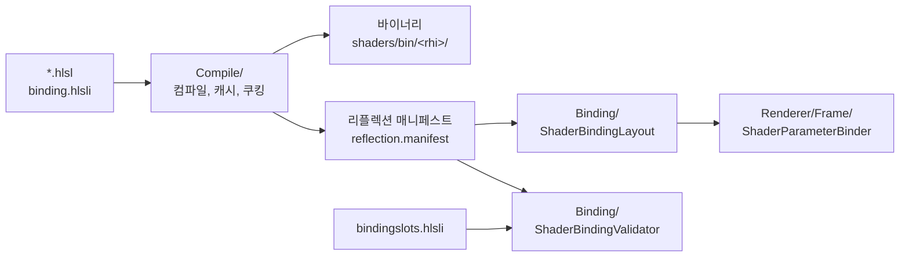

# Shader — HLSL 파일 하나가 GPU에 바인딩되기까지

## 이것은 무엇이고 왜 있나

이 폴더는 HLSL 셰이더를 네 백엔드가 쓸 수 있는 형태로 바꾸고, 셰이더가 읽는 값이 어느 슬롯에 바인딩되는지 정합니다. 하는 일은 세 가지입니다.
셰이더를 **컴파일**해 바이트코드를 만들고, 바이트코드에서 **리플렉션**으로 무엇이 어느 레지스터에 있는지 읽고, 그 결과가 엔진이 정한 **바인딩 계약**과 맞는지 확인합니다.

셰이더 하나는 DirectX 12용 DXIL, DirectX 11용 DXBC, Vulkan과 OpenGL용 SPIR-V로 각각 컴파일됩니다. 그런데 셰이더 소스는 네 백엔드가 같습니다.
백엔드마다 다른 부분은 엔진이 흡수하고, 셰이더는 `register(b#/t#/u#)` 하나로 선언합니다. 그래서 셰이더 작성자는 API별 분기를 쓰지 않습니다.

C++ 쪽에 셰이더 구조체를 똑같이 옮겨 적지도 않습니다. 엔진은 리플렉션으로 상수 버퍼 멤버의 이름과 오프셋을 읽어 값을 채웁니다.
셰이더만 고치면 되고, 두 곳이 어긋날 일이 없습니다. 언리얼의 셰이더 파라미터 구조체 대신 리플렉션을 믿는 방식입니다.

## 머릿속 그림



기억할 개념은 네 가지입니다.

**쿠킹.** 쿠킹은 실행 전에 모든 셰이더 변형을 미리 컴파일해 파일로 저장하는 일입니다(`App.exe --cook-shaders`). 결과는 `<도메인>/shaders/bin/<rhi>/` 에 저장되고 저장소에 커밋합니다.
배포 빌드에는 셰이더 컴파일러가 없으므로 쿠킹된 바이너리만 씁니다.

**리플렉션 매니페스트.** 쿠킹할 때 바이너리마다 리플렉션 결과(상수 버퍼 멤버, 텍스처 이름, 레지스터 번호, 정점 입력)를 뽑아 `reflection.manifest` 에 저장합니다.
런타임은 바이트코드를 다시 분석하지 않고 이 매니페스트를 읽습니다.

**바인딩 계약.** 어떤 리소스가 어느 레지스터 슬롯에 들어가는지는 `Resource/engine/shaders/bindingslots.hlsli` 한 파일이 정합니다.
HLSL과 C++가 이 파일을 같이 include하므로 슬롯 번호를 두 곳에 적지 않습니다. `ShaderBindingValidator` 가 쿠킹된 바이너리가 이 계약을 지키는지 확인합니다.

**퍼뮤테이션.** 같은 셰이더 파일도 define 조합에 따라 다른 바이너리가 됩니다. 이 조합 하나를 퍼뮤테이션이라 부릅니다.
머티리얼의 정적 스위치, 패스 define, 뷰 모드 define이 조합을 만들고, 쿠킹된 파일 이름에 퍼뮤테이션 해시가 들어갑니다.

## 따라 해 보기 — 바인딩 계약 확인하기

1. `Resource/engine/shaders/bindingslots.hlsli` 를 엽니다. `SW_SLOT_MATERIAL_BUFFER` 가 9입니다. 머티리얼 데이터 구조체 버퍼가 t9에 바인딩된다는 뜻입니다.
   파일 머리의 표에 같은 논리 리소스가 DirectX 12, Vulkan, OpenGL에서 각각 어디에 바인딩되는지가 있습니다.
2. `Resource/engine/shaders/forwardlit.hlsl` 을 엽니다. 머티리얼 구조체를 선언하고 `SW_MATERIAL( materialIndex )` 로 읽습니다. 셰이더 안에 레지스터 번호나 `#if VULKAN` 이 없습니다.
3. 셰이더를 쿠킹합니다. 네 백엔드의 바이너리와 매니페스트가 다시 만들어집니다.

   ```powershell
   cd build/Ninja-Debug/Bin
   ./App.exe --cook-shaders
   ```

4. 계약 테스트를 돌립니다. GPU가 필요 없는 테스트라 CI에서도 돕니다.

   ```powershell
   ./EngineTest.exe --test_filter=ShaderBindingValidatorTest.*
   ```

   `ShaderBindingValidatorTest.AllCookedShadersMatchContract` 가 쿠킹된 모든 바이너리의 리플렉션을 계약과 비교합니다.
   셰이더 선언, 헤더, 백엔드 상수 중 어느 쪽이 어긋나도 이름과 숫자를 담은 메시지로 실패합니다.

## 작동 원리

### Compile/ — 소스에서 바이트코드로

- `ShaderCompiler` 는 DXC와 D3DCompiler로 HLSL을 DXIL, SPIR-V, DXBC로 컴파일합니다.
  Vulkan용 SPIR-V 타깃은 `RHI/Vulkan/VulkanRHIApiVersion.h` 가 정합니다(1.3, SPIR-V 1.6). 디바이스 최소 버전과 같은 값입니다. OpenGL용 SPIR-V는 `vulkan1.1` 타깃입니다.
- OpenGL용 SPIR-V는 쿠킹할 때 `InstanceIndex` 와 `VertexIndex` 를 `InstanceId` 와 `VertexId` 로 바꿉니다. ARB_gl_spirv는 앞의 둘을 지원하지 않아, 바꾸지 않으면 인스턴스 번호가 0으로 읽힙니다.
- `ShaderCache` 는 "경로, define, 타깃"을 키로 컴파일 결과를 찾습니다. 결과를 얻는 경로는 쿠킹된 바이너리, 로컬 캐시(`Saved/ShaderCache/`), 실시간 컴파일 세 가지이고 모두 같은 항목을 만듭니다.
  `AssetManager` 의 에셋 캐시와 다릅니다. 셰이더 바이트코드는 RHI와 컴파일러의 수명을 따릅니다. `shutdown` 은 리플렉션 매니페스트 캐시도 비웁니다.
- `ShaderRecompiler` 는 `ShaderCache` 에 있는 셰이더를 요청할 때만 다시 컴파일합니다. `ReloadShaders`(Ctrl+F8)가 `triggerReloadAll` 과 `update` 를 부릅니다. 파일을 감시해 자동으로 다시 컴파일하지는 않습니다.

오프라인 쿠킹은 세 부분으로 나뉘고, 입력이 각자 다릅니다.

- **무엇을 쿠킹할지**는 `Renderer/Cook/ShaderCookRequest.cpp` 가 정합니다. 패스 종류와 파이프라인 XML을 알아야 하는 렌더러의 정책이라 Renderer에 있고, 그래서 `Shader/` 는 `Renderer/` 를 include하지 않습니다.
  요청은 네 단계로 모읍니다. 파이프라인 XML의 패스, 패스 종류 테이블(`RenderPassTypeInfo`)의 **모든** 엔진 셰이더, 머티리얼 에셋, 그리고 "씬 메시 패스 × 머티리얼 유무 × `RenderViewMode`" 입니다.
  런타임은 로드한 파이프라인과 상관없이 테이블 전체로 엔진 PSO를 만들기 때문에 테이블 전체를 쿠킹합니다.
- **이미 최신인지**는 `ShaderCookStamp` 가 판단합니다. 기준은 파일 시간이 아니라 내용 해시(`cook.stamp`)입니다.
- **쿠킹과 파일 이름 정하기**는 `ShaderCooker` 가 합니다. 요청 하나를 컴파일하고, 쿠킹된 파일 이름(스템, 스테이지, 퍼뮤테이션 해시)을 정합니다. 바이너리와 함께 리플렉션 매니페스트도 씁니다.

런타임이 만드는 퍼뮤테이션과 쿠킹한 퍼뮤테이션이 어긋나면 Shipping이 매니페스트에서 셰이더를 찾지 못합니다. 그래서 쿠커는 define 합치기, 패스 기본 셰이더, 뷰 모드 define을 런타임과 같은 함수에서 읽습니다.
`ShaderCookRequestTest.EveryViewModeVariantOfEveryMeshPassTypeIsRequested` 와 `ShaderCookRequestTest.CookedManifestHoldsEveryRequest` 가 이것을 확인합니다.

### Reflection/ — 바이트코드에서 바인딩 정보로

- `ShaderReflection` 이 진입점이고, 포맷에 따라 `ShaderReflectionDx` 나 `ShaderReflectionSpirv` 로 보냅니다.
- `ShaderReflectionLibrary` 는 쿠킹할 때 뽑아 둔 매니페스트를 읽습니다. 파일은 RHI 폴더마다 하나(`<domain>/shaders/bin/<rhi>/reflection.manifest`)입니다.

리플렉션을 런타임이 아니라 쿠킹할 때 하는 이유가 있습니다. DXIL 리플렉션에는 `dxcompiler.dll` 이 필요해서, 런타임에 하면 배포물에 셰이더 컴파일러를 넣어야 합니다.
컴파일러 없이 리플렉션이 비면 바인딩이 조용히 어긋나 DEVICE_HUNG이 납니다. 개발 빌드는 매니페스트가 지금 소스에서 나온 것이 아니면(`cook.stamp`) 런타임 리플렉션으로 폴백하고, 배포본에는 폴백이 없습니다.

### Binding/ — 리플렉션이 계약과 맞는지

- `ShaderBindingSlots.h` 는 `bindingslots.hlsli` 를 그대로 include해 같은 값을 C++ 상수(`shaderslot::`)로 내놓습니다. 슬롯 번호의 원본은 이 헤더가 아니라 hlsli 파일입니다.
- `ShaderBindingLayout` 은 여러 스테이지의 리플렉션을 합쳐, 이름이나 레지스터로 조회할 수 있게 만듭니다. C++ 구조체 없이 리플렉션만 믿는 구조의 중심입니다.
- `ShaderBindingLayoutCache` 는 "경로, define, 백엔드"를 키로 레이아웃을 캐시합니다. PSO를 만들 때 여기서 레이아웃을 얻고, 핫 리로드 때 `invalidateByShaderPath` 로 무효화합니다.
- `ShaderBindingValidator` 는 쿠킹된 바이너리의 리플렉션이 계약과 맞는지 검사합니다. PSO 레이아웃을 만들 때, 쿠킹할 때, 테스트에서 돕니다.
- `GpuLight.h` 와 `GpuSpriteInstanceData.h` 는 셰이더가 읽는 레이아웃 그대로의 값입니다(라이트 64바이트, 스프라이트 인스턴스 16바이트).
  컴포넌트(Object 층)가 직접 채우므로 Object가 include할 수 있는 층에 있어야 합니다. `Renderer` 는 Object보다 위 층이라 그곳에 둘 수 없고, 셰이더 계약을 두는 이 폴더가 가장 가까운 아래 층입니다.

### 바인딩 모델 — 드로우마다 바뀌는 것은 버퍼의 원소

엔진은 언리얼 GPUScene과 같은 모델을 씁니다. 셰이더는 네 백엔드에서 똑같이 `register(b#/t#/u#)` 로 선언하고, 드로우마다 바뀌는 데이터는 슬롯이 아니라 큰 버퍼의 원소입니다.
인스턴스는 `g_SwInstances`(t4)를 인스턴스 번호로, 머티리얼은 `g_SwMaterials`(t9)를 인스턴스의 `materialIndex` 로 읽습니다.
그래서 바인딩은 패스나 배치 단위로만 바뀌고, 드로우 사이에는 바뀌지 않습니다. SM 6.6의 `ResourceDescriptorHeap` 은 쓰지 않습니다.

주요 슬롯은 다음과 같습니다. 값의 원본은 `bindingslots.hlsli` 입니다.

| 슬롯 | 내용 |
|---|---|
| b0 | 패스 상수 버퍼(PassCB), 컴퓨트 상수 버퍼 |
| b1 | 머티리얼 상수 버퍼(인스턴스 버퍼 없는 드로우만) |
| b2 | DX11과 GL의 루트 상수 에뮬레이션 |
| t0..t3 | 엔진 텍스처 슬롯(DX11, GL) |
| t4 | 인스턴스 구조체 버퍼 |
| t5..t8 | 머티리얼 텍스처 슬롯(DX11, GL) |
| t9 | 머티리얼 데이터 구조체 버퍼 |
| t10..t14 | 가시 인스턴스, 모프 정점, 라이트, 배치, VAT |
| t15 | 캔버스 사각형 |
| u0..u3 | 컴퓨트 쓰기 버퍼 |

t 슬롯은 16개(t0..t15)이고 DirectX 12 t 테이블의 크기이자 Vulkan set 0의 t 대역 폭입니다. 더 늘리려면 Vulkan 대역부터 넓혀야 합니다.

### 백엔드별 바인딩

텍스처만 백엔드가 나뉩니다. DirectX 12와 Vulkan은 크기 제한 없는 배열 `g_SwBindlessTex2D[]` 에서 인덱스로 고릅니다.
배열은 DirectX 12에서 t0 space1, Vulkan에서 set 1입니다. DirectX 11과 OpenGL은 t0..t8 슬롯에 드로우 직전에 바인딩합니다. 구조체 버퍼(t4, t9)는 네 백엔드가 같은 슬롯을 쓰고, 바인딩하는 방법만 다릅니다.

- **DirectX 12.** 루트 시그니처는 하나입니다. b0..b2 루트 CBV, t0..t15 슬롯 테이블, u0..u3 슬롯 테이블, 텍스처 배열 테이블, 루트 상수 16 dword, 정적 샘플러 s0..s7로 25/64 dword를 씁니다(`shaderslot::dx12`).
  등록할 때 오프라인(CPU) 힙에 뷰를 만들고, 드로우나 디스패치 직전에 `flushSlotTables` 가 바뀐 테이블만 온라인 힙 블록에 복사해 바인딩합니다.
  언리얼의 `FD3D12DescriptorCache` 와 같은 방식이고, `ShaderBindingValidatorTest.Dx12RootSignatureFitsBudget` 가 계약에서 예산을 계산해 확인합니다.
- **Vulkan.** set 0이 슬롯 세트입니다. binding 번호는 레지스터 종류별 시프트에 번호를 더한 값입니다(b는 0..15, t는 16..31, u는 32..47, DXC `-fvk-*-shift`).
  바인딩이 바뀐 드로우 직전에 커맨드 버퍼가 가진 풀 세트(`VulkanDescriptorPoolSet`)에서 세트 하나를 할당합니다(`flushSlotSet`). 언리얼의 `FVulkanDescriptorPoolSetContainer` 에 해당합니다.
  커맨드 버퍼가 GPU 펜스를 지나 돌아오면 `beginCommandList` 가 풀을 통째로 리셋하므로 할당 경로에 잠금이 없습니다. set 1은 텍스처 배열과 immutable sampler입니다.
- **DirectX 11.** 구조체 버퍼는 `createStructuredBuffer` 가 만든 SRV를 `VSSetShaderResources` 와 `PSSetShaderResources` 로 바인딩합니다.
- **OpenGL.** 구조체 버퍼는 SSBO를 `glBindBufferBase(GL_SHADER_STORAGE_BUFFER, 슬롯)` 으로 바인딩합니다. 디스크립터 세트는 무시하고 binding 번호만 봅니다.

상수 버퍼는 `draw()` 인자가 아니라 `bindConstantBuffer( index, shaderslot::k*ConstantBuffer )` 로만 바인딩합니다.
렌더 타깃 포맷은 PSO의 일부입니다. 백버퍼에 그리는 PSO는 디바이스가 실제로 채택한 포맷(`getBackBufferFormat`, Vulkan은 서피스와 협상)으로, 오프스크린 PSO는 `getTextureFormat` 으로 만듭니다.

### 드로우 직전에 일어나는 일

PSO 설명을 받으면 `ShaderBindingLayoutCache::getOrBuild( desc, backend )` 가 컴파일, 리플렉션, 레이아웃을 거쳐 캐시합니다.
`FrameRenderer` 는 패스마다 `FrameResourceRegistry` 에 "ShadowMap", "SceneColor" 같은 이름으로 리소스를 등록하고, `PassConstantValues` 에 `g_ViewProj` 같은 값을 채웁니다.
드로우 직전에 `ShaderParameterBinder::bindGraphics` 가 다음을 바인딩합니다.

- **패스 상수 버퍼(b0).** 리플렉션이 알려 준 멤버 오프셋에 값을 쓰고 엔진의 상수 버퍼 슬롯에 올립니다. 패스마다 한 번입니다.
- **머티리얼 버퍼(t9).** 셰이더 종류마다 `StructuredBuffer<SwMaterialData>` 하나입니다. `GpuScene` 이 리플렉션의 stride로 버퍼를 채워 배치 전에 바인딩합니다.
  머티리얼이 없는 배치에는 0으로 채운 폴백 원소를 바인딩합니다. DirectX 12의 루트 SRV가 빈 채로 나가지 않게 하기 위해서입니다.
- **텍스처.** `g_<Name>Index` 멤버는 레지스트리에서 자동으로 채웁니다(DirectX 12, Vulkan). DirectX 11과 OpenGL은 `bindShaderResource( srv, 리플렉션의 t 번호 )` 로 바인딩합니다.
- **머티리얼 상수 버퍼(b1).** 인스턴스 버퍼가 없는 픽스처 드로우(`fullscreentriangle`)에서만 머티리얼 버퍼를 상수 버퍼로 바인딩합니다.
- **샘플러.** 정적 세트 s0..s7(`SW_SAMPLER_*`, `swSampleIndexWith`)입니다. DirectX 12는 정적 샘플러, Vulkan은 immutable sampler, DirectX 11은 s9..s15 샘플러 상태를 씁니다.
  OpenGL은 결합 샘플러라 sampler id를 무시합니다. 엔진 텍스처 슬롯(t0..t3)은 네 백엔드가 계약 샘플러 `SW_ENGINE_TEXTURE_SAMPLER`(선형, 클램프) 하나로 읽습니다.
- **RW 텍스처.** 컴퓨트 셰이더만 `swStoreRwTexture2D( index, texelPosition, value )` 로 씁니다. DirectX 12와 Vulkan은 배열 인덱스(`registerBindlessTextureUav`), DirectX 11과 OpenGL은 u4..u7 슬롯의 서수입니다.
- **루트 상수.** `SW_ROOT_CONSTANTS_BEGIN … SW_ROOT_CONSTANTS_END` 와 `SW_ROOT( field )` 로 선언하고 `setComputeRootConstants` 로 16 dword까지 넘깁니다.

바인드리스 인덱스는 GPU 펜스 뒤에 다시 씁니다. 실행 중인 프레임이 새 리소스를 읽지 않게 하기 위해서입니다.
상수 버퍼와 바인딩 상태(DirectX 12 슬롯 테이블, Vulkan 슬롯 세트)는 내용이 달라질 때만 버전을 올리고 다시 만듭니다.

### 머티리얼 원소와 인스턴스 원소의 레이아웃

머티리얼 원소 레이아웃의 원본은 셰이더입니다. `Material::ensureShaderLayout` 이 디바이스 백엔드의 리플렉션으로 stride와 오프셋을 맞춥니다.
SPIR-V는 `-fvk-use-dx-layout` 으로 DirectX와 같은 패킹을 씁니다. 인스턴스마다 자기 머티리얼 원소를 가지므로 DirectX 12와 Vulkan은 배치를 셰이더 종류 단위로 합칩니다.

인스턴스 원소 레이아웃은 테스트가 확인합니다. `ShaderBindingValidatorTest.InstanceElementLayoutMatchesCpuStruct`(nogpu)가 쿠킹된 바이너리의 stride와 필드 오프셋을 C++ `GpuInstance` 와 비교합니다.
컴퓨트 쪽 이름(`g_Instances`, `g_InstancesRW`)도 같은 표로 확인합니다.

## 확장하는 법

### 새 셰이더 쓰기

1. `#include "binding.hlsli"` 로 시작합니다. 그러면 `g_ViewProj` 같은 PassCB 필드와 텍스처 샘플 함수를 바로 쓸 수 있습니다. `#if VULKAN` 이나 `#if OPENGL` 분기를 쓰지 않습니다. 그 차이는 `binding.hlsli` 가 처리합니다.
2. 정점을 받는 셰이더는 `common.hlsli` 의 `SwVertexInput` 하나만 씁니다. DirectX는 시맨틱 이름으로 정점 속성을 연결하지만 Vulkan과 OpenGL은 선언 순서로 location을 매깁니다.
   `struct VSInput { pos; col }` 처럼 중간 속성을 빼면 col이 노멀을 읽습니다. 리플렉션이 정점 입력을 읽고 `ShaderBindingValidator` 가 `constant::arrVertexAttribute` 와 비교하므로, 어긋난 바이너리는 nogpu 테스트에서 실패합니다.
3. 머티리얼은 한 스테이지에서만 읽습니다. OpenGL(ARB_gl_spirv)은 구조체 버퍼(`g_SwMaterials`)를 정점과 픽셀 두 단계에서 읽으면 링크를 거부합니다.
   보통은 픽셀 셰이더가 읽고, 정점을 움직이는 셰이더(식생 `foliage.hlsl`, 물 `water.hlsl`)는 정점 셰이더가 읽어 픽셀이 쓸 값을 보간 필드로 넘깁니다.
   머티리얼 스키마는 픽셀 단계에서 찾지 못하면 정점 단계에서 찾습니다(`Material::ensureShaderLayout`, `RenderPassGpuTest.VertexStageMaterialSchemaIsUsed`).
4. 머티리얼이 쓰는 새 셰이더는 `ShaderCookRequest.cpp` 의 엔진 셰이더 목록에도 넣습니다. 이유는 아래 함정 절에 있습니다.
5. `App.exe --cook-shaders` 로 쿠킹하고, 바이너리와 매니페스트를 함께 커밋합니다.

그림자와 깊이 프리패스는 머티리얼 셰이더가 아니라 `shadowdepth.hlsl` 이 그리므로 정점 변형을 모릅니다.
그래서 머티리얼 define `MATERIAL_SHADOW_CAST_OFF` 는 그림자에서, `MATERIAL_VERTEX_DEFORM` 은 깊이 프리패스에서 그 드로우를 뺍니다. 정점을 클립 공간 밖 한 점으로 모읍니다.

### 새 엔진 텍스처 입력 더하기

1. `binding.hlsli` 의 PassCB에 `uint g_<Name>Index;` 를 더합니다.
2. 엔진이 `FrameResourceRegistry` 에 `"<Name>"` 으로 그 텍스처를 등록합니다.
3. 패스 입력이라면 [Renderer 문서](../../Renderer/README.md)의 "새 입력 역할 더하기"를 따릅니다.

### 새 슬롯 더하기

1. `bindingslots.hlsli` 에 `#define` 을 더합니다. 이 파일에는 정수 `#define` 과 주석만 둡니다. C++ 컴파일러가 그대로 읽기 때문입니다.
2. 백엔드 코드는 `shaderslot::` 상수만 씁니다. 바인딩 번호를 숫자 리터럴로 적지 않습니다.
3. 쿠킹하고 `ShaderBindingValidatorTest.*` 를 돌립니다. DirectX 12 루트 시그니처 예산과 Vulkan 대역 폭을 넘지 않는지 테스트가 확인합니다.

## 함정과 주의

- **보기 모드 define 은 조명을 하는 모든 셰이더가 읽는다.** Unlit 을 toon 만 읽어 기본 파이프라인에서 Lit 과 픽셀이 하나도 다르지 않았다.
  셰이더를 더하면 `binding.hlsli` 의 `SW_VIEWMODE_SKIPS_LIGHTING` 으로 조명을 가르고, 디퍼드는 G버퍼 알베도 알파(셰이딩 모델 `SW_GBUFFER_SHADING`)로 조명 패스에 넘긴다(조명 패스에는 뷰 모드 변형이 없다). `RenderPassGpuTest.UnlitViewModeChangesThePicture` 가 포워드와 디퍼드를 본다.
### 쿠킹과 산출물

**`.hlsl` 이나 `.hlsli` 를 고쳤으면 `App.exe --cook-shaders` 를 다시 돌리세요.** 빌드는 HLSL을 쿠킹하지 않습니다. 개발 빌드는 낡은 매니페스트를 버리고 런타임 리플렉션으로 폴백하지만, 테스트와 배포본은 쿠킹된 바이너리를 봅니다.
낡은 산출물은 세 겹입니다. 쿠킹된 바이너리, 리플렉션 매니페스트, `ShaderCompiler` 의 디스크 캐시입니다.

**셰이더를 고쳤는데 화면이 그대로면 실제로 로드된 바이트부터 확인하세요.** 거의 항상 위 세 가지 중 하나가 예전 것입니다.

**낡았는지는 내용 해시 하나로 판단합니다**(`ShaderCooker::computeEffectiveSourceHash`). 파일 시간으로 판단하지 마세요. 쿠킹된 바이너리를 커밋하는 저장소라 `git pull` 이 mtime을 임의 순서로 덮어씁니다.
스탬프 헤더는 `SWCOOK 3` 이고, `cook.stamp` 는 CR을 뗀 바이트로 계산합니다.
매니페스트가 바이너리보다 낡으면 바인더가 빈 레이아웃으로 그려 DirectX 12가 DEVICE_HUNG에 빠집니다. 배포 패킹은 `Scripts/generate/CookAssets.py --verify-shaders` 로 이것을 막습니다.

**컴파일러 동작(옵션, DXC 버전)을 바꿔 실험할 때는 `ShaderCompiler` 디스크 캐시와 `cook.stamp` 를 지웁니다.** 소스가 그대로면 내용 해시도 그대로라 아무것도 다시 쿠킹하지 않습니다.

**쿠킹된 파일 이름은 `ShaderCooker::computeBinaryFileName` 하나가 정합니다.** 이름에는 퍼뮤테이션 해시가 들어갑니다. 해시가 빠지면 define이 GPU에 전달되지 않는데도 리플렉션은 맞아 보입니다.

**런타임과 쿠커는 같은 함수를 부릅니다.** 패스 define의 원본은 `FrameRendererUtil::getPassDefine` 입니다. 둘이 다르면 Shipping에서만 그 드로우가 사라집니다.
"컬러 출력이 없는 패스에는 픽셀 스테이지가 없다"는 판단은 `hasPixelStage` 하나입니다.
실시간 컴파일 요청은 `ShaderCache::makeLiveCompileDesc` 가 만들고(경로 `Saved/ShaderCache/<rhi>/<해시>-<opt|dbg>/`), 쿠커는 늘 최적화 빌드입니다.
셰이더 리로드 대상은 `ShaderCache::collectCompiledDescs` 가 정하고, 바이트코드가 같으면 로컬 캐시에 쓰지 않습니다.

**쿠킹은 패스 종류 테이블 전체를 곱합니다.** "패스 종류 × 머티리얼 유무 × `RenderViewMode`" 입니다. 파이프라인 XML에 나오는 패스만 곱하면 런타임(`ensurePassResources`)이 만드는 변형이 빠집니다.
뷰 모드 define의 원본은 `FrameRendererUtil::findViewModeDefine` 입니다.

**머티리얼이 쓰는 새 셰이더는 `ShaderCookRequest.cpp` 의 엔진 셰이더 목록에도 넣으세요.** 머티리얼 쿠킹은 퍼뮤테이션 해시가 붙은 변형만 쿠킹하는데, 머티리얼은 define 없는 변형의 리플렉션을 묻습니다.
Debug 빌드는 런타임 리플렉션으로 넘어가 문제를 숨기고, Shipping hostgpu 테스트만 "매니페스트에 없다"로 실패합니다. `sprite2dlit` 에서 실제로 이렇게 실패했습니다.

**런타임에 바꾸는 정적 스위치는 `bShaderFeature="0"` 이어야 Shipping에 바이너리가 있습니다.** 쿠커는 에셋에 저장된 상태와, `bShaderFeature="0"` 스위치의 켬과 끔 조합만 쿠킹합니다.
유니티의 shader_feature와 multi_compile에 해당하고, 런타임 스위치는 네 개까지입니다. 코드가 `setStaticSwitch` 로 바꾸는 변형은 개발 빌드의 실시간 컴파일이 가려서 Shipping hostgpu에서만 실패합니다.
`ShaderCookRequestTest.EveryRuntimeStaticSwitchCombinationIsRequested` 가 패스마다 조합을 비교합니다. 멀티 컴파일(`_multiCompiles`)은 아직 선택된 값만 쿠킹합니다.

**정적 스위치의 `keywordOff`(꺼졌을 때 내는 define)를 쓰는 에셋은 지금 없습니다.** `MaterialTest.StaticSwitchOffKeywordWhenDisabled` 만 이 기능을 지킵니다.
스위치를 지우거나 켜고 끄면 퍼뮤테이션 해시가 바뀌므로 `--cook-shaders` 를 다시 돌립니다.

### 바인딩 계약

**바인딩 번호를 숫자 리터럴로 쓰지 마세요.** 계약의 원본은 `bindingslots.hlsli` 하나이고 백엔드는 `shaderslot::` 상수만 씁니다. `draw()` 에는 상수 버퍼 인자가 없습니다.
백엔드끼리 공유하는 상수는 `RHITypes.h` 의 `constant` 블록 하나에 둡니다. 지금 값이 같아도 바뀔 수 있으면 공유하고, 별칭을 만들지 않습니다.

**`ShaderBindingLayoutCache::getOrBuild` 에는 반드시 실제 디바이스의 `backend` 를 넘기세요.** 전역 `gv_rhiBackend` 를 쓰지 않습니다.
한 프로세스에 `IRHIDevice` 가 여럿 있으면(백엔드 패리티 테스트처럼) 전역값이 실제 디바이스와 달라 엉뚱한 셰이더 변형을 리플렉션합니다.

**백엔드 하나만 예외를 두지 마세요.** 리플렉션이 기준이면 네 백엔드가 같은 규칙을 따릅니다. 예외 하나를 주석으로 남기면 그 주석이 다음 사람의 함정이 됩니다.

**셰이더 이름 규칙은 C++와 같습니다**(AGENTS.md의 HLSL 절, `CheckShaderConventions` 게이트). 함수는 camelCase이고 공유 헤더의 함수는 `sw` 로 시작합니다.
타입은 PascalCase이고 공유 헤더의 타입은 `Sw` 로 시작하며 `_t` 를 붙이지 않습니다. 필드는 C++ 멤버 이름에서 `_` 를 뺀 것입니다.
`g_*`, cbuffer, 시맨틱, 진입점(`VSMain`, `PSMain`, `CSMain`)은 C++가 문자열로 찾으므로 바꾸면 같은 커밋에서 C++도 바꿉니다.
셰이더 쪽 이름 변경은 계약 검사를 조용히 끌 수 있습니다. `validate` 는 테이블에 없는 이름을 건너뛰기 때문입니다. `ShaderBindingValidatorTest.EveryBoundNameIsInCookedReflection` 이 C++가 아는 이름이 매니페스트에 있는지 봅니다.

**정점 입력의 원본은 `constant::arrVertexAttribute` 입니다**(POSITION, NORMAL, TEXCOORD, COLOR, 48바이트). 인스턴스 번호는 정점 슬롯 1(`SW_INSTANCESLOT`)로 넘기므로 `SV_InstanceID` 를 쓰지 않습니다.
`SV_VertexID` 는 Vulkan과 OpenGL에서 `startVertex` 를 포함하고 Direct3D에서는 0부터 셉니다. `GpuInstance` 원소의 정의는 `instancedata.hlsli` 하나입니다.

**OpenGL 타깃의 SPIR-V는 구조체 버퍼를 `Uniform` 저장 클래스와 `BufferBlock` 데코레이션으로 냅니다.** 리플렉션이 StorageBuffer 클래스만 보면 구조체 버퍼를 상수 버퍼로 잘못 분류합니다. 그래서 `ShaderReflectionSpirv` 가 `BufferBlock` 을 따로 확인합니다.

**구조체 버퍼 원소는 `float4` 단위로 짭니다.** float3을 섞으면 std430 규칙 때문에 OpenGL만 레이아웃이 어긋납니다.

**텍스처 샘플러의 원본은 `bindingslots.hlsli` 입니다.** 엔진 텍스처 슬롯(t0..t3)은 `SW_ENGINE_TEXTURE_SAMPLER`(선형, 클램프), 머티리얼 텍스처 슬롯(t5..t8)은 `SW_MATERIAL_TEXTURE_SAMPLER`(선형, 랩, C++에서는 `shaderslot::kMaterialTextureSampler`)입니다.
OpenGL은 유닛마다 샘플러 객체를 `glBindSampler` 로 바인딩하고, DirectX 11은 정적 세트를 씁니다. 그래서 네 백엔드의 벤치 프레임이 바이트까지 같습니다.
OpenGL은 결합 샘플러만 쓸 수 있어(ARB_gl_spirv는 분리 샘플러 불가) 슬롯의 샘플러를 엔진이 정합니다.

**머티리얼 텍스처는 t5..t8 고정 슬롯입니다.** OpenGL은 SPIR-V라 ARB_bindless_texture를 쓸 수 없고, DirectX 11은 SM 5.0이라 버퍼로 텍스처를 넘길 수 없습니다.

### 진단

**백엔드 하나만 다른 이미지를 내면 순서대로 의심하세요.** 먼저 셰이더 산출물, 다음으로 엔진 바깥(입력 데이터, 상태)입니다. 둘 다 맞으면 셰이더 **코드의 모양**을 의심합니다.
OpenGL 드라이버가 DXC의 early-return을 잘못 컴파일한 적이 있습니다. 셰이더 값을 확인하는 프로브는 `nointerpolation` 필드에 정수를 실어 읽고, 모프 진단은 `-gv_morphDiag=1|2|3` 을 씁니다.

## 더 볼 곳

- [Graphics](../README.md): 셰이더가 값을 받는 방법의 개요
- [Renderer](../../Renderer/README.md): 드로우 경로, 패스 입력 역할, 쿠킹 요청을 모으는 쪽
- [Material](../Material/README.md): 머티리얼 프로퍼티와 퍼뮤테이션
- [RHI](../RHI/README.md): 백엔드 디바이스와 커맨드 리스트

| 파일 | 내용 |
|---|---|
| `Resource/engine/shaders/bindingslots.hlsli` | 슬롯 번호의 원본 |
| `Resource/engine/shaders/binding.hlsli` | 셰이더가 include하는 바인딩 선언과 함수 |
| `Resource/engine/shaders/common.hlsli` | `SwVertexInput` |
| `Resource/engine/shaders/instancedata.hlsli` | 인스턴스 원소 정의 |
| `Binding/ShaderBindingValidator.h` | 계약 검사 규칙 |
| `Renderer/Frame/ShaderParameterBinder.h` | 드로우 직전 바인딩 |
