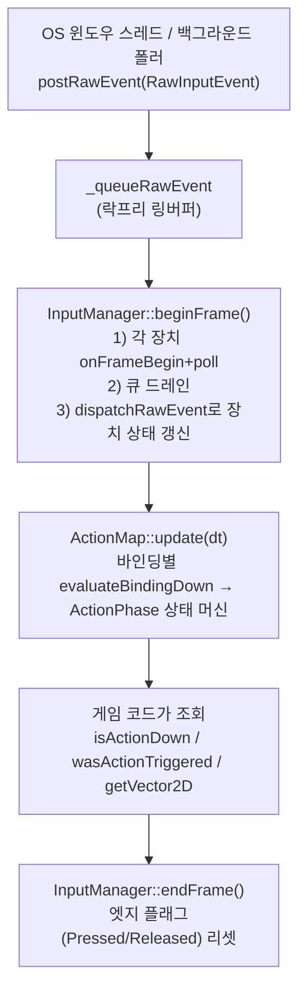

# Input (입력 · 액션맵)

키보드/마우스/게임패드 원시 입력을 받아서, 게임 코드가 실제로 쓰는 **"Jump가 눌렸는가?"** 같은
의미 있는 질문에 답해주는 레이어입니다. 게임 로직에서 입력을 처음 다룰 때 가장 자주 만지는 곳입니다.

관련 상위 문서: [엔진 개요](../README.md) · [아키텍처 / Gotchas](../../../ARCHITECTURE.md)

---

## 한 줄로 이해하기

| 개념 | 역할 |
|------|------|
| **InputManager** | 장치 레지스트리 + 락프리 원시 이벤트 큐. 모든 입력의 진입점(App/Editor 공용 서비스). |
| **IInputDevice** | 키보드/마우스/게임패드가 공통으로 구현하는 인터페이스 (`isControlDown` 등). |
| **ActionMap** | "Jump" 같은 이름 있는 액션에 키/버튼을 매핑하고, 매 프레임 상태를 평가합니다. 실제 게임 코드는 대부분 이걸 통해서만 입력을 봅니다. |
| **InputSlot** | 장치 종류 + 장치 인덱스 + 컨트롤 인덱스로 "어떤 버튼인지"를 하나로 표현하는 값. |
| **ActionBinding** | 액션 하나에 달린 바인딩 한 개(단일 키, 조합키, 스틱, 가상 조이스틱 등). |
| **InputReplay / InputSnapshot** | 입력을 프레임 단위로 기록·재생하는 QA/디버그 도구 및 롤백 넷코드용 링버퍼. |

```text
InputManager
 ├─ IInputDevice 목록 (_listDevice)
 │   ├─ KeyboardDevice
 │   ├─ MouseDevice
 │   └─ GamepadDevice (Windows: GamepadXInput, 최대 4개)
 └─ ActionMap  ← 게임 코드는 보통 여기까지만 봅니다
     └─ ActionEntry "Jump"
         └─ ActionBinding (Key::Space, GamepadButton::A, ...)
```

---

## 폴더 구조

```text
Input/
├─ InputManager.*          # 장치 레지스트리 + 원시 이벤트 큐 + 프레임 동기화
├─ IInputDevice.h          # 장치 공통 인터페이스 + InputSlot
├─ KeyCodes.*, GamepadButtons.h, InputKeyMap.h   # 키/버튼 enum과 이름<->enum 변환, 플랫폼 VK 매핑
├─ ActionMap.h             # ActionMap의 선언 전부 (구현은 아래 5개 .cpp에 나뉨)
├─ ActionMap.cpp           #   핵심: 생성자, bind*() 등록, 레이어 스택, 리바인드, is/wasActionXxx() 조회
├─ ActionMapEvaluate.cpp   #   매 프레임 상태 머신: update() / evaluateBindingDown() / evaluateTrigger()
├─ ActionMapSerialization.cpp # InputMap XML 로드 + 유저 키 리매핑 저장/로드
├─ ActionMapCombo.cpp      #   선입력 버퍼링 + 격투 게임식 커맨드 시퀀스/패턴 판정
├─ ActionMapGlyph.cpp      #   액션 -> UI 프롬프트 문자열("[ E ]" 등) 변환
├─ InputSnapshot.*         # 롤백 넷코드/리플레이용 프레임 스냅샷 링버퍼
├─ InputReplay.*           # 입력 녹화/재생 (에디터 QA 툴이 사용)
├─ Devices/                # KeyboardDevice, MouseDevice, GamepadDevice 구현체
├─ Events/RawInputEvent.h  # OS 이벤트를 표현하는 값 타입 (postRawEvent로 큐에 들어감)
├─ Utils/VirtualJoystick.h # 마우스 드래그/터치 좌표 -> 2D 축 벡터 계산기 (ActionMap의 VirtualJoystick2D 바인딩이 사용)
├─ Windows/                # Win32/XInput 구현 (InputManagerWin32.cpp, GamepadXInput.*, InputKeyMapWin32.cpp)
├─ Linux/                  # X11/커널 조이스틱 구현 (InputManagerX11.cpp, GamepadJoystick.*, InputKeyMapX11.cpp)
└─ (Editor 연동은 Source/Editor/Panels/InputMapEditorPanel.cpp)
```

### 플랫폼 추상화 규칙

`InputManager.cpp`(공용)는 플랫폼 분기(`#ifdef`)를 갖지 않습니다. 플랫폼별 동작은 `InputManager.h`에
선언된 아래 훅을 통해서만 연결되고, 실제 구현은 `Windows/InputManagerWin32.cpp` / `Linux/InputManagerX11.cpp`에
있습니다 — 새 플랫폼을 추가하거나 기존 플랫폼 동작을 바꿀 때 **공용 파일을 건드릴 필요가 없어야 합니다.**

| 훅 | Windows 구현 | Linux 구현 |
|----|--------------|------------|
| `registerPlatformGamepads()` | XInput, 4패드 | 커널 조이스틱 API(`/dev/input/jsN`), 4패드 |
| `applyMouseLockMode()` / `releaseMouseLockMode()` | `ClipCursor` | `XGrabPointer` / `XUngrabPointer` |
| `setCursorVisiblePlatform()` | `ShowCursor` | 투명 픽스맵 커서 (`XDefineCursor`) |
| `disable/restoreWindowsAccessibilityShortcuts()` | 고정키/토글키/필터키 SPI | XKB AccessX (StickyKeys 등) |
| `pollPlatform()` | `GetAsyncKeyState` 폴백 | `XQueryPointer` 마우스 폴백 (키보드는 이벤트로 충분) |
| `processNativeEvent()` / `onNativeWindowEvent()` | Win32 메시지 처리 | X11 이벤트 처리 |

**Linux 쪽 알려진 한계** (실기 미검증 — 리눅스 환경에서 빌드/실행 검증이 필요합니다):
- 게임패드 버튼/축 배치는 Xbox 호환(`xpad` 드라이버) 기준 추정치입니다. SDL 같은 기기별 매핑 DB는 없어
  다른 컨트롤러는 `GamepadJoystick.cpp`의 `kAxisXxx`/버튼 인덱스 조정이 필요할 수 있습니다.
- 럼블(force feedback)은 대응하는 evdev 노드를 찾아 `EV_FF`로 시도하고, 실패하면 조용히 무시합니다.
- 텍스트 입력은 XIM의 커밋 문자열만 받고, CJK 입력기의 조합(preedit) 후보 창 렌더링은 구현하지 않았습니다.
- 마우스 잠금은 창 전체 confine만 지원하고, 서브 사각형(`setMouseClipSubRect`) 클리핑은 아직 구현하지 않았습니다.
- 고정밀 원시 마우스 델타(Windows의 `WM_INPUT`에 대응하는 XInput2 raw motion)는 구현하지 않아,
  `MotionNotify`의 절대좌표 차이만 사용합니다.

`ActionMap`은 클래스 하나지만, 책임(등록/평가/직렬화/콤보/글리프)별로 구현 파일을 나눴습니다.
**"무엇이 궁금한지"에 따라 파일을 고르세요** — 전부 `ActionMap.h` 하나를 같이 include합니다.

---

## 프레임 한 번의 흐름 (Frame Flow)



- **`postRawEvent`는 언제든(다른 스레드에서도) 호출 가능**하지만, 실제로 장치 상태에 반영되는 건 다음
  `beginFrame()`이 큐를 드레인할 때입니다.
- 같은 `beginFrame()` 안에서 Down 이벤트와 Up 이벤트가 함께 드레인되면(예: 초고속 탭, 매크로 주입),
  그 프레임엔 "눌렸었다"로 인정됩니다 — `evaluateBindingDown()`의 SingleSlot 케이스가
  `isControlDown() || wasControlPressed()`를 함께 보기 때문입니다.
- `ActionMap::update()`를 프레임마다 부르지 않으면 `isActionDown`/`wasActionTriggered`/커맨드 콤보/버퍼
  만료가 전부 멈춥니다 — 직접 `ActionMap`을 만들어 쓰는 도구(에디터 패널 등)라면 반드시 매 프레임 호출하세요.

---

## 기본 사용법

### 1) 액션 바인딩하고 조회하기

```cpp
sw::ActionMap& actionMap = inputManager.getActionMap();

actionMap.bind( "Jump", sw::Key::Space );
actionMap.bind( "Jump", sw::GamepadButton::A );
actionMap.bindVector2D( "Move", sw::Key::W, sw::Key::S, sw::Key::A, sw::Key::D );

// 매 프레임 (게임 루프에서 InputManager::beginFrame() 다음, 게임 로직보다 먼저)
actionMap.update( deltaSeconds );

if ( actionMap.wasActionTriggered( "Jump" ) )
    player->jump();

const sw::float2 move = actionMap.getVector2D( "Move" );
```

### 2) `ActionHandle`로 매 프레임 해시 조회 피하기

이름(`string_view`)으로 매번 찾으면 해시맵 조회가 들지만, `ActionHandle`을 한 번 캐싱해두면
이후 조회는 인덱스 접근 한 번입니다 (액션을 계속 새로 `bind`해도 유효 — 세대(generation) 검증으로 보호됩니다).

```cpp
sw::ActionHandle jumpHandle = actionMap.getActionHandle( "Jump" ); // 초기화 시 한 번
// ... 매 프레임 ...
if ( actionMap.wasActionTriggered( jumpHandle ) )
    player->jump();
```

### 3) 레이어로 입력 우선순위 나누기

```cpp
actionMap.registerLayer( "UI", /*priority*/ 100 );
actionMap.pushLayer( "UI", /*blockLower*/ true ); // 열리면 Gameplay 레이어 입력 차단
// ... 메뉴 닫을 때 ...
actionMap.popLayer();
```

### 4) 온스크린(모바일 스타일) 가상 조이스틱

```cpp
// 마우스 왼쪽 버튼을 누른 지점이 앵커가 되고, 거기서 드래그한 만큼 2D 벡터가 나옵니다.
actionMap.bindVirtualJoystick2D( "Move", sw::MouseButton::Left, /*radius*/ 100.0f, /*deadzone*/ 0.1f );
```

---

## 자주 헷갈리는 것 / 주의사항

| 상황 | 설명 |
|------|------|
| `ActionMap`을 직접 만들어 쓸 때 | `update(dt)`를 매 프레임 호출하지 않으면 조회 함수들이 전부 "안 눌림"으로 고정됩니다. |
| `GamepadDevice::_triggerDeadzone` | 디지털 "눌림" 판정 임계값(0.5, 고정)과는 별개입니다 — 트리거 아날로그 값 자체의 노이즈만 걸러냅니다. |
| `ActionBinding::_scale` | 바인딩 종류에 따라 뜻이 다릅니다: `MouseDelta2D`는 감도 배율, `VirtualJoystick2D`는 드래그 반경(px). |
| PlayStation/Switch 글리프 | 실제 하드웨어 자동 감지는 없습니다 — `getGlyphForAction(action, previewDevice)`로 원하는 플랫폼을 강제 지정해야 그 표기가 나옵니다. |
| `InputReplay::seek()` | 인덱스만 옮길 뿐 실제 장치 상태를 재현하지 않습니다. 상태까지 되돌리려면 `stepBackward()`/`stepForward()`를 쓰세요. |
| 병렬 tick 중 입력 조회 | `ActionMap`/`InputManager` 자체는 스레드 세이프하지 않습니다. 게임 오브젝트 틱(병렬 구간)에서 직접 읽지 말고, 메인 스레드에서 한 번 평가한 결과를 넘겨주는 방식을 권장합니다. |

---

## 더 볼 곳

- `InputManager.h` — 편의 API(`isKeyDown`, `getMouseDelta` 등) 전체 목록
- `ActionMap.h` — `BindingKind`/`ActionTrigger`/`ActionPhase` 등 스키마 enum 주석
- `Events/RawInputEvent.h` — `RawInputEvent::makeXxx()` 팩토리 함수 목록
- `Test/EngineTest/TestInput.cpp` — 각 기능의 실제 사용 예시(테스트 코드가 곧 예제입니다)
- `Source/Editor/Panels/InputMapEditorPanel.cpp` — 액션 바인딩을 시각적으로 편집/테스트하는 에디터 패널
