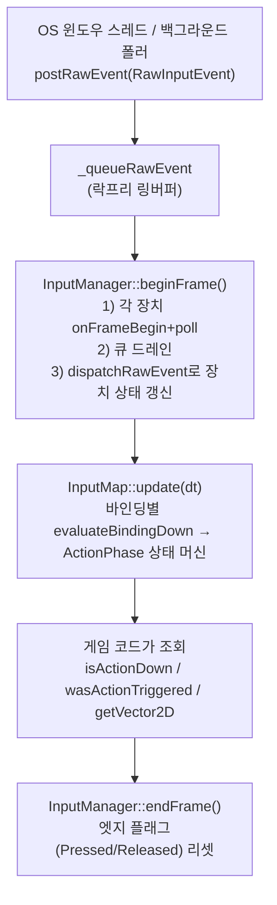

# Input (입력 · 액션맵)

키보드/마우스/게임패드 원시 입력을 받아서, 게임 코드가 실제로 쓰는 **"Jump가 눌렸는가?"** 같은
의미 있는 질문에 답해주는 레이어입니다. 게임 로직에서 입력을 처음 다룰 때 가장 자주 만지는 곳입니다.

관련 상위 문서: [엔진 개요](../README.md) · [아키텍처 / Gotchas](../../../ARCHITECTURE.md)

입력 층은 장치만 안다 — 액션 → 의도(`ControlIntent`)는 GameFramework `Base/Control` 의 플레이어 조종자가 만들고, 폰은 의도만 읽는다(`CheckControlBoundary`).

---

## 한 줄로 이해하기

| 개념 | 역할 |
|------|------|
| **InputManager** | 장치 레지스트리 + 락프리 원시 이벤트 큐. 모든 입력의 진입점(App/Editor 공용 서비스). |
| **IInputDevice** | 키보드/마우스/게임패드가 공통으로 구현하는 인터페이스 (`isControlDown` 등). |
| **InputMap** | "Jump" 같은 이름 있는 액션에 키/버튼을 매핑하고, 매 프레임 상태를 평가합니다. 실제 게임 코드는 대부분 이걸 통해서만 입력을 봅니다. |
| **InputSlot** | 장치 종류 + 장치 인덱스 + 컨트롤 인덱스로 "어떤 버튼인지"를 하나로 표현하는 값. |
| **ActionBinding** | 액션 하나에 달린 바인딩 한 개(단일 키, 조합키, 스틱, 가상 조이스틱 등). |
| **InputReplay** | 입력 층 QA 녹화 — 프레임마다 장치에 적용된 원시 사건을 적고, 가상 입력 원천으로 붙여 프레임 번호 그대로 재생합니다. 게임플레이 리플레이 · 네트워크가 싣는 것은 행동(의도)이지 이것이 아닙니다. |
| **IVirtualInputSource** | 가상 입력 원천 — 프레임 번호마다 장치 사건을 냅니다(시험 · 자동화 시나리오 · 리플레이). `InputManager::attachVirtualInput` 이 붙입니다. |

```text
InputManager
 ├─ IInputDevice 목록 (_listDevice)
 │   ├─ KeyboardDevice
 │   ├─ MouseDevice
 │   └─ GamepadDevice (Windows: XInputGamepadDevice, 최대 4개)
 └─ InputMap  ← 게임 코드는 보통 여기까지만 봅니다
     └─ ActionEntry "Jump"
         └─ ActionBinding (Key::Space, GamepadButton::A, ...)
```

---

## 폴더 구조

```text
Input/
├─ InputManager.*          # 장치 레지스트리 + 원시 이벤트 큐 + 프레임 동기화
├─ IInputDevice.h          # 장치 공통 인터페이스 + InputSlot
├─ KeyCodeUtil.*, GamepadButtonUtil.h, InputKeyMap.h   # 키/버튼 enum과 이름<->enum 변환, 플랫폼 VK 매핑
├─ InputSlotUtil.*         # InputSlot <-> 글(`Key.Space` · `Mouse.Left` · `Gamepad1.A`) — 사용자 설정 파일의 키 바인딩 값
├─ InputMap.h             # InputMap의 선언 전부 (구현은 아래 5개 .cpp에 나뉨)
├─ InputMap.cpp           #   핵심: 생성자, bind*() 등록, 레이어 스택, 리바인드, is/wasActionXxx() 조회
├─ InputMapEvaluate.cpp   #   매 프레임 상태 머신: update() / evaluateBindingDown() / evaluateTrigger()
├─ InputMapSerialization.cpp # `<InputMap>` 정의 로드 · 저장(에디터 InputMap 패널의 저장 = `saveToResource`) + 유저 바인딩 XML
├─ InputMapCombo.cpp      #   선입력 버퍼링 + 격투 게임식 커맨드 시퀀스/패턴 판정
├─ InputMapGlyph.cpp      #   액션 -> UI 프롬프트 문자열("[ E ]" 등) 변환
├─ InputReplay.*           # 입력 층 녹화 · 재생(가상 입력 원천, 에디터 InputMap 패널이 사용)
├─ Devices/                # KeyboardDevice, MouseDevice, GamepadDevice 구현체
├─ RawInputEvent.h         # OS 이벤트를 표현하는 값 타입 (postRawEvent로 큐에 들어감)
├─ IVirtualInputSource.h   # 가상 입력 원천 계약 + 모드(배타 · 혼합)
├─ VirtualInputScript.*    # 프레임 번호에 묶은 사건 목록 — 시험 · 시나리오가 손으로 적는 가장 흔한 원천
├─ VirtualJoystick.h       # 마우스 드래그/터치 좌표 -> 2D 축 벡터 계산기 (InputMap의 VirtualJoystick2D 바인딩이 사용)
├─ Windows/                # Win32/XInput 구현 (InputManagerWin32.cpp, XInputGamepadDevice.*, InputKeyMapWin32.cpp)
├─ Linux/                  # X11/커널 조이스틱 구현 (InputManagerX11.cpp, LinuxJoystickGamepadDevice.*, InputKeyMapX11.cpp)
└─ (Editor 연동은 Source/Editor/Panels/InputMapPanel.cpp)
```

### 플랫폼 추상화 규칙

`InputManager.cpp`(공용)는 플랫폼 분기(`#ifdef`)를 갖지 않습니다. 플랫폼별 동작은 `InputManager.h`에
선언된 아래 훅을 통해서만 연결되고, 실제 구현은 `Windows/InputManagerWin32.cpp` / `Linux/InputManagerX11.cpp`에
있습니다 — 새 플랫폼을 추가하거나 기존 플랫폼 동작을 바꿀 때 **공용 파일을 건드릴 필요가 없어야 합니다.**

| 훅 | Windows 구현 | Linux 구현 |
|----|--------------|------------|
| `registerPlatformGamepads()` | XInput, 4패드 | 커널 조이스틱 API(`/dev/input/jsN`), 4패드 |
| `applyMouseLockMode()` / `releaseMouseLockMode()` — `syncMouseLock()` 만 부른다(조건은 공용 `isMouseLockActive()`) | `ClipCursor`(전경 창일 때만) | `XGrabPointer`(포커스 있을 때만) / `XUngrabPointer` |
| `isWindowFocusedPlatform()` | `GetForegroundWindow` | `FocusIn`/`FocusOut` 추적 값 |
| `setCursorVisiblePlatform()` | `ShowCursor` | 투명 픽스맵 커서 (`XDefineCursor`) |
| `disable/restoreWindowsAccessibilityShortcuts()` | 고정키/토글키/필터키 SPI | XKB AccessX (StickyKeys 등) |
| `pollPlatform()` | `GetAsyncKeyState` 폴백 | `XQueryPointer` 마우스 폴백 (키보드는 이벤트로 충분) |
| `processNativeEvent()` / `onNativeWindowEvent()` | Win32 메시지 처리 | X11 이벤트 처리 |

**Linux 쪽 알려진 한계** (실기 미검증 — 리눅스 환경에서 빌드/실행 검증이 필요합니다):
- 게임패드 버튼/축 배치는 Xbox 호환(`xpad` 드라이버) 기준 추정치입니다. SDL 같은 기기별 매핑 DB는 없어
  다른 컨트롤러는 `LinuxJoystickGamepadDevice.cpp`의 `kAxisXxx`/버튼 인덱스 조정이 필요할 수 있습니다.
- 럼블(force feedback)은 대응하는 evdev 노드를 찾아 `EV_FF`로 시도하고, 실패하면 조용히 무시합니다.
- 텍스트 입력은 XIM의 커밋 문자열만 받고, CJK 입력기의 조합(preedit) 후보 창 렌더링은 구현하지 않았습니다.
- 마우스 잠금은 창 전체 confine만 지원하고, 서브 사각형(`setMouseClipSubRect`) 클리핑은 아직 구현하지 않았습니다.
- 고정밀 원시 마우스 델타(Windows의 `WM_INPUT`에 대응하는 XInput2 raw motion)는 구현하지 않아,
  `MotionNotify`의 절대좌표 차이만 사용합니다.

`InputMap`은 클래스 하나지만, 책임(등록/평가/직렬화/콤보/글리프)별로 구현 파일을 나눴습니다.
**"무엇이 궁금한지"에 따라 파일을 고르세요** — 전부 `InputMap.h` 하나를 같이 include합니다.

---

## 프레임 한 번의 흐름 (Frame Flow)


```mermaid
flowchart TD
  A["OS 윈도우 스레드 / 백그라운드 폴러<br/>postRawEvent(RawInputEvent)"] --> B["_queueRawEvent<br/>(락프리 링버퍼)"]
  B --> C["InputManager::beginFrame()<br/>1) 각 장치 onFrameBegin+poll<br/>2) 큐 드레인<br/>3) dispatchRawEvent로 장치 상태 갱신"]
  C --> D["InputMap::update(dt)<br/>바인딩별 evaluateBindingDown → ActionPhase 상태 머신"]
  D --> E["게임 코드가 조회<br/>isActionDown / wasActionTriggered / getVector2D"]
  E --> F["InputManager::endFrame()<br/>엣지 플래그(Pressed/Released) 리셋"]
```

- **`postRawEvent`는 언제든(다른 스레드에서도) 호출 가능**하지만, 실제로 장치 상태에 반영되는 건 다음
  `beginFrame()`이 큐를 드레인할 때입니다.
- 같은 `beginFrame()` 안에서 Down 이벤트와 Up 이벤트가 함께 드레인되면(예: 초고속 탭, 매크로 주입),
  그 프레임엔 "눌렸었다"로 인정됩니다 — `evaluateBindingDown()`이 단일 키 · 합성(axis1d · vector2d) 모두
  슬롯마다 `isControlDown() || wasControlPressed()`를 함께 보기 때문입니다(`InputMapTest.CompositeBindingCountsATapWithinOneFrame`).
- `InputMap::update()`를 프레임마다 부르지 않으면 `isActionDown`/`wasActionTriggered`/커맨드 콤보/버퍼
  만료가 전부 멈춥니다. **통합 맵(`InputManager::getInputMap()`)은 `beginFrame()`이 끝에서 갱신합니다** — 따로 부르면
  한 프레임에 두 번 흐릅니다. 직접 `InputMap`을 만들어 쓰는 도구(에디터 패널 · 셸 맵 등)는 만든 쪽이 매 프레임 호출하세요.
  주의: 통합 맵을 아무도 갱신하지 않으면 게임플레이 액션이 하나도 발동하지 않습니다(`beginFrame` 이 그 자리입니다).

---

## 기본 사용법

### 1) 액션 바인딩하고 조회하기

```cpp
sw::InputMap& inputMap = inputManager.getInputMap();

inputMap.bind( "Jump", sw::Key::Space );
inputMap.bind( "Jump", sw::GamepadButton::A );
inputMap.bindVector2D( "Move", sw::Key::W, sw::Key::S, sw::Key::A, sw::Key::D );

// 통합 맵은 InputManager::beginFrame() 이 매 프레임 갱신한다 — 여기서 update 를 다시 부르지 않는다.
// 직접 만든 InputMap 이라면 beginFrame() 다음, 게임 로직보다 먼저 update( deltaSeconds ) 를 부른다.

if ( inputMap.wasActionTriggered( "Jump" ) )
    player->jump();

const sw::float2 move = inputMap.getVector2D( "Move" );
```

리소스 XML(`*.input.xml`, 게임은 팩의 `gamesettings.xml` `<inputMap>`)에서는 액션 아래에 `<bind source="key|mouse|gamepad" code=…/>` ·
`<vector2d up down left right/>` · `<axis1d negative positive [trigger]/>` · `<stick stick="Left|Right"/>` · `<chord modifier trigger/>` · `<mouseDelta scale="1"/>` · `<mouseWheel scale="1"/>`
를 씁니다(예: `Resource/game/shooter3d/data/shooter.input.xml`). **마우스 이동량(`MouseDelta2D`)은 픽셀 단위 상대값이라 액션 값이 [-1, 1] 로 묶이지 않습니다** —
축 · 버튼 · 스틱 몫만 반전 뒤 묶이고(또는 원으로), 이동량은 그 위에 더해집니다. 축 반전은 이동량에 한 번만 걸립니다.
**마우스 휠(`MouseWheel1D`)은 1D 축**입니다 — 굴린 프레임에만 한 칸 × `scale`(위가 +)이고 다음 프레임은 0 입니다(핫바 넘기기 — 언리얼 Mouse Wheel Axis).
휠도 이동량이라 묶이지 않고(한 프레임 세 칸은 3) 시점 반전(`setInvertX`)이 확대 · 핫바 방향을 뒤집지 않습니다(`BindingKinds::isRelative`).
`<axis1d source="gamepad" negative="DPadDown" positive="DPadUp" [pad]/>` 는 게임패드 버튼 둘을 한 축으로 묶습니다 — 휠과 같은 액션(`Camera.Zoom`)을
패드로도 냅니다(언리얼 Enhanced Input 의 Axis1D 액션 + 한쪽 Negate 버튼). `source` 를 적지 않으면 키 이름입니다.
액션의 `trigger` 는 `<bind>` · `<chord>` · `<axis1d>` 에 갑니다 — `<axis1d>` 는 적지 않으면 `Down`(축을 매 프레임 읽는 쓰임)이고 `Pressed` 면 누를 때마다
한 번 발화합니다(무기 교체). 축 값(`getAxis1D`)은 trigger 와 관계없이 누르는 동안 읽힙니다. 연속 값(`vector2d` · `stick` · `mouseDelta`)은 `Down` 고정이라 다른 trigger 는 로드 경고입니다.

### 2) `ActionHandle`로 매 프레임 해시 조회 피하기

이름(`string_view`)으로 매번 찾으면 해시맵 조회가 들지만, `ActionHandle`을 한 번 캐싱해두면
이후 조회는 인덱스 접근 한 번입니다 (액션을 계속 새로 `bind`해도 유효 — 세대(generation) 검증으로 보호됩니다).

```cpp
sw::ActionHandle jumpHandle = inputMap.getActionHandle( "Jump" ); // 초기화 시 한 번
// ... 매 프레임 ...
if ( inputMap.wasActionTriggered( jumpHandle ) )
    player->jump();
```

### 3) 레이어로 입력 우선순위 나누기

```cpp
inputMap.registerLayer( "UI", /*priority*/ 100 );
inputMap.pushLayer( "UI", /*blockLower*/ true ); // 열리면 Gameplay 레이어 입력 차단
// ... 메뉴 닫을 때 ...
inputMap.popLayer();
```

### 4) 온스크린(모바일 스타일) 가상 조이스틱

```cpp
// 마우스 왼쪽 버튼을 누른 지점이 앵커가 되고, 거기서 드래그한 만큼 2D 벡터가 나옵니다.
inputMap.bindVirtualJoystick2D( "Move", sw::MouseButton::Left, /*radius*/ 100.0f, /*deadzone*/ 0.1f );
```

---

## 자주 헷갈리는 것 / 주의사항

| 상황 | 설명 |
|------|------|
| `InputMap`을 직접 만들어 쓸 때 | `update(dt)`를 매 프레임 호출하지 않으면 조회 함수들이 전부 "안 눌림"으로 고정됩니다. |
| 마우스 스무딩 | `MouseDevice::getSmoothDelta()` 는 가속 · 스무딩(EMA)을 프레임당 한 번, 흐른 시간 기준으로 적용한 값입니다(`setSmoothing`). 원시 이동량과 섞어 쓰지 마세요. |
| `GamepadDevice::_triggerDeadzone` | 디지털 "눌림" 판정 임계값(0.5, 고정)과는 별개입니다 — 트리거 아날로그 값 자체의 노이즈만 걸러냅니다. |
| `ActionBinding::_scale` | 바인딩 종류에 따라 뜻이 다릅니다: `MouseDelta2D`는 감도 배율, `VirtualJoystick2D`는 드래그 반경(px). |
| 바인딩 종류를 하나 더할 때 | `bind*` 는 `beginBinding`(레이어 · 액션 등록 · 레이어 인덱스 캐시)으로 시작해 종류별 필드만 채우고 `commitBinding`(현재 · 기본값 · 상태 세 목록에 함께)으로 끝냅니다. 세 목록은 같은 인덱스로 짝지어지므로 직접 `push_back` 하지 마세요. |
| PlayStation/Switch 글리프 | 실제 하드웨어 자동 감지는 없습니다 — `getGlyphForAction(action, previewDevice)`로 원하는 플랫폼을 강제 지정해야 그 표기가 나옵니다. |
| 플레이어 설정(감도 · 축 반전 · 스틱 데드존 · 토글 · 키 바인딩) | `UserSettingsManager`(Engine/UserSettings)가 넣습니다. 감도 · 반전 · `setStickDeadzoneOverride` 는 `clear` · 맵 다시 읽기를 넘어 남지만, 키 바인딩 · 토글은 맵을 다시 세우면 사라지므로 맵을 세운 쪽이 `UserSettingsManager::reapplyAll` 을 부릅니다(`GameInstanceBase::initialize` 가 `onInitialize` 뒤에 부릅니다). |
| 키보드 포커스(`setKeyboardFocus`) | `Game`(기본) · `DevConsole` · `Ui`(런타임 UI 의 글 입력 칸 — `UiSystem` 이 잡고 놓는다). `Game` 이 아니면 게임 쪽 키 조회(`isKeyDown` · `wasKeyPressed` · `wasKeyReleased` · `wasAnyInputPressed` 의 키보드 몫)와 InputMap 의 키보드 바인딩이 "안 눌림" 입니다 — 게임 코드가 `isKeyDown` 을 직접 불러도 막힙니다. 장치 상태(`getKeyboard()`)는 그대로 갱신됩니다. 포커스를 넘긴 동안 눌린 키는 돌아온 뒤에도 **뗄 때까지** 가립니다(콘솔을 닫은 Esc 가 게임의 일시정지로 새지 않게) — 넘기기 전부터 눌려 있던 키는 다시 보입니다. 포커스와 상관없이 읽어야 하는 맵(셸 맵)만 `InputMap::setKeyboardFocusIgnored( true )` 입니다. 패드 · 마우스는 포커스 밖입니다. |
| 글자 입력(`setTextInputCallback( 콜백, 주인 )`) | 키보드 포커스를 가진 쪽의 콜백에만 갑니다(주인마다 하나 — 다시 걸면 덮어씁니다). 콜백은 UTF-8 한 글자씩 받습니다. Win32 는 BMP 밖 글자(이모지 · 확장 한자)를 서로게이트 `WM_CHAR` 두 개로 보내므로 `InputManager` 가 앞 반쪽을 들고 있다가 합칩니다(`_pendingHighSurrogate`). 짝 없는 반쪽은 U+FFFD 입니다. X11 은 `Xutf8LookupString` 이 UTF-8 을 바로 줍니다. |
| `InputReplay` 재생 · 탐색 | 재생은 `attachVirtualInput( &replay )` 입니다 — 벽시계가 아니라 붙인 뒤 프레임 번호로 냅니다. `seekTo( input, n )` 은 상태를 지우고 [0, n) 을 다시 재생해 n 직전 상태를 만듭니다(목표 프레임만 다시 넣으면 누름 · 뗌 전이가 틀린다). 거기서 이어 재생하려면 상태를 지우지 않고 붙입니다(`attachVirtualInput( &replay, mode, false )`). 녹화는 `recordFrame( dt, input.getLastFrameEvents() )` — 실제로 적용된 사건입니다. |
| 가상 입력(`attachVirtualInput`) | 붙인 원천의 사건은 `beginFrame` 이 OS 사건을 재생하는 **그 자리**에서 OS 사건 뒤에 재생됩니다(`_bSynthetic`). 프레임 번호는 붙인 뒤 `beginFrame` 횟수라 벽시계 · 창 포커스와 무관합니다. 배타 모드(기본)는 OS 키 · 마우스 · 패드 사건, 패드 폴링, 창 포커스 사건, 커서 가두기를 무시하고 패드 연결은 가상 연결 사건이 정합니다 — 사람이 같은 기계를 써도 시험이 흔들리지 않습니다. 엔진 키보드 포커스(개발 콘솔)는 가상 키에도 걸립니다. 혼합 모드는 OS 입력을 함께 받습니다(진짜 창 상태를 보는 시나리오용). |
| 병렬 tick 중 입력 조회 | `InputMap`/`InputManager` 자체는 스레드 세이프하지 않습니다. 게임 오브젝트 틱(병렬 구간)에서 직접 읽지 말고, 메인 스레드에서 한 번 평가한 결과를 넘겨주는 방식을 권장합니다. |

---

## 함정 · 계약

- **입력 · 매핑 · 행동 세 층** — 입력 층(Engine/Input)은 장치 사건만, 매핑(InputMap)은 플레이어 조종자 · 플레이어 뷰 · 명령형 디렉터만, 폰은 `ControlIntent` 만
  읽는다(`CheckControlBoundary` 허용 표). 네트워크 · 게임플레이 리플레이는 의도를 싣는다. **탑승 = 빙의를 탈것으로 옮기는 것**, 탑승자는 좌석 소켓에 붙어(이동 멈춤 ·
  자세 파라미터) 피격은 그대로 받는다. 탈것 의도의 연결은 운전석 조종자를 따른다. 명령형 장르(RTS · SRPG · 경영)는 폰이 없다.
  허용 표의 파일도 장치(키 · 버튼 · 휠 · 이동량 · 패드)를 묻지 않는다 — 클릭 · 시점 · 확대도 입력 맵 액션이고, 남는 장치 조회는 커서 위치
  `getMousePositionNormalized` 하나다(같은 게이트). 확대처럼 "한 칸씩" 인 축은 `wasActionTriggered` 프레임에만 쓴다 — 패드 버튼 축은 누르는 동안 매 프레임 ±1 이다.
- **가상 입력은 `IVirtualInputSource` 하나로 넣는다** — `InputManager::attachVirtualInput` 이 붙이면 `beginFrame` 이 OS 사건과 같은 자리에서 그 프레임 사건을
  재생한다. 배타 모드(기본)는 OS 키 · 마우스 · 패드 사건, 패드 폴링, 창 포커스 사건, 커서 가두기를 무시한다 — 사람이 같은 기계를 써도 시험이 흔들리지 않는다.
  엔진 키보드 포커스(개발 콘솔)는 따른다. 바깥 스크립트로 OS 입력(`SendInput`)을 넣지 말 것 — OS 는 사건을 포그라운드 창에만 준다.
- 셸 InputMap 을 못 읽으면
  오류를 알리고 빈 맵이다(손 바인딩으로 바꿔 끼우지 않는다). 입력 리플레이 파일은 `RawInputEvent` 를 통째로 적으므로 배치가 바뀌면 `kReplayVersion` 을 올린다(지금 4).
  `InputReplay` 는 **입력 층 녹화**다(프레임마다 원시 사건 — 키 바인딩 · 포커스까지 재현하는 QA 용, 재생은 가상 입력 원천). 게임플레이 리플레이 · 네트워크가 싣는 것은 행동(의도)이다.
  의도 기록(`.swintent`)은 시작 상태를 싣지 않는다 — 같은 씬 · 같은 고정 프레임 시간에서만 같은 궤적이고, 로컬 의도도 `quantize` 를 거쳐야 기록 · 원격과 비트까지 같다
  (`ControlTest.RecordedIntentsReplayTheSameTrajectory`). 조종자가 `produceIntent` 안에서 빙의를 옮기면 등록 순서에 따라 같은 틱에 두 조종자가 몬다 — `ControlSystem::queuePossess`.
  **자동 플레이 = AI 조종자의 빙의** — 몸 안에 자동 플레이 분기를 두지 않고, 스위치가 바뀌면 디렉터가 틱 뒤 플러시에서 플레이어 폰을 게임의 AI 조종자 ↔ 플레이어 0 의
  조종자로 옮긴다(Shooter3D `syncAutoPlayPossession`, 시나리오 `autoplay.scenario.xml`). 자동 빙의 `Ai` 가 세운 조종자는 폰과 함께 지워진다(`isSpawnedForPawn`) —
  아니면 스폰 · 걷기를 되풀이하는 적마다 조종자 오브젝트가 쌓인다.
- **통합 `InputMap` 은 `InputManager::beginFrame` 이 갱신한다** — 게임 코드가 `update()` 를 다시 부르면 한 프레임에 두 번 흐른다(Input README 예제가 그랬다).
- **마우스 `getSmoothDelta` 는 프레임당 한 번 `IInputDevice::onEventsDispatched( dt )` 에서 정해진다** — `setSmoothing(f)` 는 1/60 초 동안 남기는 비율
  (τ = -(1/60)/ln f, 60 Hz 에서 옛 계수와 같다). 이벤트 처리기 안에서 스무딩을 다시 돌리면 폴링 레이트마다 감각이 달라진다. 프레임 이동은 `getMovementDelta()` 하나.
- **입력** — 창 메시지는 큐에만 넣고 장치 상태를 바꾸는 길은 `beginFrame` 의 재생 하나다(포커스 · 포인터 진입도 큐 순서 안). `RawInputEventType` 은 뒤에만 덧붙인다(리플레이 파일이 번호를
  담는다). 입력 시험은 메시지 → `beginFrame` → 조회 → `endFrame`. XInput 트리거도 `setAxis( 4 · 5 )` 로 넣어야 데드존이 먹는다. 리바인딩은 바인딩 종류를 지킨다(`getRebindSlotIndex`),
  바인딩 종류는 `kArrBindingKindInfo` 표 하나(+ `static_assert`, 저장소는 `-Wswitch-default`). 통합 InputMap 은 `InputManager::beginFrame` 이 갱신한다.
  입력 XML 의 액션 `trigger` 는 단일 키 · 조합 · 축 합성(`<axis1d>`, 적지 않으면 `Down`)에 간다 — 연속 값(`vector2d` · `stick` · `mouseDelta`)은 `Down` 고정이라
  다른 값은 로드 경고. 유저 바인딩 저장도 `trigger` 를 싣는다(빼면 다시 읽을 때 종류의 기본값으로 돌아가 Shooter3D 무기가 누르는 동안 매 프레임 바뀌었다).
- **마우스 잠금은 게임의 요청과 OS 적용을 나눈다** — `InputManager::isMouseLockActive` = 잠금 요청 ∧ 포커스 ∧ 포커스를 잃은 뒤 클라이언트 클릭 ∧ Alt 안 누름 ∧
  키보드 포커스 `Game`. 활성화(`WM_ACTIVATE` · `FocusIn`)로 다시 잠그면 제목 표시줄 · X 를 눌러 활성화한 사용자의 커서가 클라이언트 안으로 끌려가 창을 못 끈다.
  잠금을 다시 건 클릭(과 그 뗌)은 게임에 넘기지 않는다(언리얼 뷰포트 캡처 클릭과 같다). `ShowCursor` 는 카운터라 `syncMouseLock` 이 전이에서만 부른다.
  "잠긴 동안만" 할 일(마우스 시점)은 `isMouseLockActive` 로 가린다.

## 더 볼 곳

- `InputManager.h` — 편의 API(`isKeyDown`, `getMouseDelta` 등) 전체 목록
- `InputMap.h` — `BindingKind`/`ActionTrigger`/`ActionPhase` 등 스키마 enum 주석
- `RawInputEvent.h` — `RawInputEvent::makeXxx()` 팩토리 함수 목록
- `Test/EngineTest/Input/TestInput.cpp` — 각 기능의 실제 사용 예시(테스트 코드가 곧 예제입니다)
- `Source/Editor/Panels/InputMapPanel.cpp` — 액션 바인딩을 시각적으로 편집/테스트하는 에디터 패널
