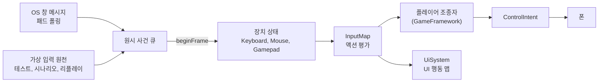

# Input — 입력 장치와 액션 맵

## 이것은 무엇이고 왜 있나

이 폴더는 키보드, 마우스, 게임패드에서 들어온 신호를 받아서 "Jump가 눌렸는가?" 같은 질문에 답하는 계층입니다.
게임 코드가 `Space` 키를 직접 묻기 시작하면 키 바꾸기, 게임패드 지원, 자동화 테스트가 모두 어려워집니다.
그래서 게임 코드는 키가 아니라 **액션**(`Jump`, `Move`)을 묻고, 어떤 키와 버튼이 그 액션을 내는지는 데이터 파일이 정합니다.
언리얼의 Enhanced Input, 유니티의 Input System, Godot의 Input Map과 같은 구조입니다.

입력은 세 층으로 나뉩니다. 이 폴더는 앞의 두 층을 맡습니다.

1. **입력 층**은 장치에서 온 사건만 다룹니다. 키가 눌렸다, 마우스가 움직였다, 패드 스틱이 기울었다 같은 사건입니다.
2. **매핑 층**(`InputMap`)은 그 사건을 이름 있는 액션으로 바꿉니다.
3. **행동 층**은 GameFramework의 조종 시스템입니다. 플레이어 조종자가 액션을 읽어 폰의 **의도**(`ControlIntent`)를 만들고, 폰은 의도만 읽습니다.

이렇게 나누면 플레이어, AI, 네트워크, 리플레이가 모두 같은 의도로 캐릭터를 움직일 수 있습니다. 행동 층은 [GameFramework](../../GameFramework/README.md)의 "조종" 절에서 설명합니다.

## 머릿속 그림


```mermaid
flowchart LR
  OS["OS 창 메시지<br/>패드 폴링"] --> Queue["원시 사건 큐"]
  Virtual["가상 입력 원천<br/>테스트, 시나리오, 리플레이"] --> Queue
  Queue -- "beginFrame" --> Devices["장치 상태<br/>Keyboard, Mouse, Gamepad"]
  Devices --> Map["InputMap<br/>액션 평가"]
  Map --> Player["플레이어 조종자<br/>(GameFramework)"]
  Player --> Intent["ControlIntent"] --> Pawn["폰"]
  Map --> UI["UiSystem<br/>UI 행동 맵"]
```

이 그림에서 기억할 개념은 네 가지입니다.

**입력 매니저.** `InputManager` 는 엔진 서비스 하나이고, 모든 입력의 진입점입니다.
장치 목록과 원시 사건 큐를 가지고 있고, 매 프레임 `beginFrame` 에서 큐에 쌓인 사건을 장치 상태에 적용합니다.
OS 창 메시지는 언제든 큐에 넣을 수 있지만 장치 상태는 `beginFrame` 에서만 바뀝니다. 그래서 한 프레임 안에서는 입력이 바뀌지 않습니다.

**액션과 바인딩.** 액션은 `Jump` 나 `Move` 같은 이름이고, 바인딩은 그 액션을 내는 키나 버튼 하나입니다. 한 액션에 바인딩을 여러 개 둘 수 있습니다.
바인딩에는 종류(`BindingKind`)가 있습니다. 키 하나, 키 넷으로 만든 2D 벡터, 패드 스틱, 마우스 이동량, 마우스 휠, 조합 키 같은 종류입니다.
액션의 **트리거**(`ActionTrigger`)는 언제 발동하는지를 정합니다. 누른 순간(`Pressed`), 누르는 동안(`Down`), 길게 누름(`HoldThreshold`), 반복(`Repeat`) 같은 값이 있습니다.

**통합 맵.** `InputManager::getInputMap()` 이 돌려주는 맵이 게임플레이 액션을 담는 통합 맵입니다.
게임은 팩의 `gamesettings.xml` 에 `<inputMap>` 경로를 적고, `GameInstanceBase` 가 그 파일을 통합 맵에 읽어 넣습니다.

**가상 입력.** 테스트, 자동화 시나리오, 입력 리플레이는 OS를 거치지 않고 가상 입력 원천(`IVirtualInputSource`)으로 사건을 넣습니다.
가상 사건은 OS 사건과 같은 위치에서 적용되므로, 게임 코드는 진짜 키와 가상 키를 구별하지 못합니다.

## 따라 해 보기 — 액션 하나를 만들고 가상 입력으로 확인하기

Shooter3D의 무기 교체처럼 Q와 E로 앞뒤를 고르는 액션을 만들고, 사람이 키를 누르지 않아도 동작을 확인하는 테스트를 써 보겠습니다.

### 1단계 — 입력 맵 파일에 액션 적기

게임의 입력 맵 파일(예: `Resource/game/shooter3d/data/shooter.input.xml`)에 액션을 적습니다.

```xml
<action name="SwitchWeapon" layer="Gameplay" trigger="Pressed">
    <axis1d negative="Q" positive="E"/>
</action>
```

`<axis1d>` 는 두 입력을 -1과 +1의 1D 축으로 묶습니다. `trigger="Pressed"` 이므로 누를 때마다 한 번 발동하고, 축 값으로 방향을 읽습니다.
`source` 를 적지 않으면 키 이름이고, `source="gamepad"` 로 적으면 패드 버튼 둘을 묶습니다(`negative="DPadDown" positive="DPadUp"`).
파일에 쓸 수 있는 바인딩 원소는 `<bind>`, `<vector2d>`, `<axis1d>`, `<stick>`, `<chord>`, `<mouseDelta>`, `<mouseWheel>` 입니다.

### 2단계 — 액션 읽기

같은 바인딩을 코드로 만들고 읽으면 다음과 같습니다.

```cpp
sw::InputMap& inputMap = inputManager.getInputMap();
inputMap.bindAxis1DComposite( "SwitchWeapon", sw::Key::Q, sw::Key::E, {}, sw::ActionTrigger::Pressed );

// 매 프레임
if ( inputMap.wasActionTriggered( "SwitchWeapon" ) )
    cycleWeapon( inputMap.getAxis1D( "SwitchWeapon" ) > 0.0f ? +1 : -1 );
```

통합 맵은 `InputManager::beginFrame` 이 끝에서 갱신합니다. 그러므로 게임 코드는 `update()` 를 부르지 않습니다.
이름 조회가 매 프레임 부담되면 `getActionHandle( "SwitchWeapon" )` 으로 핸들을 한 번 받아 두고 핸들로 묻습니다. 핸들은 세대 번호로 검증하므로 액션을 더 등록해도 유효합니다.

GameFramework와 게임 코드에서는 이 코드를 아무 곳에나 쓰지 않습니다. 입력 맵을 읽어도 되는 파일은 정해져 있고, `CheckControlBoundary.py` 게이트가 확인합니다.
폰이 이 액션을 쓰게 하려면 폰의 버튼 목록(`PawnComponent` 의 Buttons)에 같은 이름을 넣습니다. 그러면 플레이어 조종자가 이 액션을 읽어 의도의 버튼 비트로 넘깁니다.

### 3단계 — 가상 입력으로 확인하기

사람이 키를 누르지 않고 "3번째 프레임에 E를 눌렀다가 7번째 프레임에 뗀다"를 재현합니다.

<!-- snippet: TestVirtualInput.cpp 의 ScriptedTapTriggersOnItsFrameOnly — 5b U7 에서 대조 -->
```cpp
sw::VirtualInputScript script;
SW_ASSERT_TRUE( script.addTap( 3, sw::InputSlot::fromKey( sw::Key::E ), 4 ) ); // 3 에 누르고 7 에 뗀다
input.attachVirtualInput( &script );

for ( uint32 frame = 0; frame < 10; ++frame )
{
    input.beginFrame( kFrameSeconds );
    if ( inputMap.wasActionTriggered( "SwitchWeapon" ) )
        SW_EXPECT_EQUAL( 3u, frame );
    input.endFrame();
}
input.detachVirtualInput();
```

`wasActionTriggered` 는 3번째 프레임에 한 번만 참이 되고, `isActionDown` 은 3번째부터 6번째 프레임까지 참입니다.
가상 입력의 프레임 번호는 붙인 뒤 `beginFrame` 을 부른 횟수입니다. 벽시계나 창 포커스와 관계가 없으므로 결과가 매번 같습니다.

이 테스트는 다음 명령으로 실행합니다.

```powershell
py -3 -m Scripts test VirtualInputTest.*
```

## 작동 원리

### 한 프레임의 순서

1. OS 창 스레드나 백그라운드 폴러가 `postRawEvent` 로 원시 사건을 락프리 큐에 넣습니다. 어느 스레드에서 불러도 됩니다.
2. `InputManager::beginFrame` 이 장치마다 `onFrameBegin` 과 `poll` 을 부르고, 큐를 비우며 사건을 장치 상태에 적용합니다.
   가상 입력이 붙어 있으면 그 프레임의 가상 사건을 OS 사건 뒤에 적용합니다.
3. 같은 `beginFrame` 의 끝에서 통합 맵의 `InputMap::update` 가 바인딩마다 눌림을 평가하고 액션 상태(`ActionPhase`)를 갱신합니다.
4. 게임 코드가 `isActionDown`, `wasActionTriggered`, `getVector2D`, `getAxis1D` 로 액션을 조회합니다.
5. `endFrame` 이 이번 프레임의 눌림과 뗌 표시를 지웁니다.

한 `beginFrame` 안에서 누름과 뗌이 함께 들어오면 그 프레임에는 눌린 것으로 봅니다. 아주 빠른 탭이나 매크로 입력을 놓치지 않기 위해서입니다.
그래서 바인딩 평가는 슬롯마다 `isControlDown() || wasControlPressed()` 를 함께 봅니다(`InputMapTest.CompositeBindingCountsATapWithinOneFrame`).

통합 맵이 아닌 `InputMap` 을 직접 만들어 쓰는 도구(에디터 패널 등)는 만든 쪽이 `beginFrame` 다음에 `update( deltaSeconds )` 를 매 프레임 부릅니다.
부르지 않으면 조회 함수가 모두 "안 눌림"으로 멈춥니다.

### 상대값 바인딩: 마우스 이동량과 휠

마우스 이동량(`MouseDelta2D`)은 픽셀 단위 상대값이라서 액션 값이 [-1, 1] 범위로 잘리지 않습니다.
키, 버튼, 스틱에서 온 값만 반전 뒤에 범위로 자르고(2D는 원으로), 이동량은 그 위에 더합니다. 마우스 이동량의 반전은 그 바인딩을 평가할 때 한 번만 적용합니다.

마우스 휠(`MouseWheel1D`)은 1D 축입니다. 휠을 굴린 프레임에만 눈금 수에 `scale` 을 곱한 값이 나오고(위가 +), 다음 프레임은 0입니다. 언리얼의 Mouse Wheel Axis와 같습니다.
휠도 상대값이라 범위로 자르지 않으므로, 한 프레임에 세 눈금을 굴리면 3이 나옵니다.
액션 값 단계의 전역 축 반전(`setInvertX`, `setInvertY`)도 상대값 종류(`BindingKinds::isRelative`)에는 적용하지 않습니다. 그래서 시점 반전을 켜도 확대나 핫바 방향은 뒤집히지 않습니다.

휠과 패드 버튼 축을 같은 액션(예: `Camera.Zoom`)에 둘 수 있습니다. 이때 주의할 차이가 있습니다.
휠은 굴린 프레임에만 값이 나오지만, 패드 버튼 축은 누르고 있는 동안 매 프레임 ±1이 나옵니다. "한 단계씩" 움직여야 하는 축은 `wasActionTriggered` 가 참인 프레임에만 값을 씁니다.

액션의 `trigger` 는 `<bind>`, `<chord>`, `<axis1d>` 에 적용됩니다. `<axis1d>` 는 적지 않으면 `Down` 이고, `getAxis1D` 는 트리거와 관계없이 누르는 동안 값을 돌려줍니다.
연속 값을 내는 `vector2d`, `stick`, `mouseDelta` 는 `Down` 으로 고정이라 다른 트리거를 적으면 로드할 때 경고합니다.

### 레이어

액션은 레이어에 속합니다. 메뉴가 열리면 메뉴 레이어를 올려 아래 레이어의 입력을 막을 수 있습니다.

```cpp
inputMap.registerLayer( "UI", /*priority*/ 100 );
inputMap.pushLayer( "UI", /*blockLower*/ true ); // 열려 있는 동안 Gameplay 레이어 입력을 막는다
inputMap.popLayer();
```

플레이어 조종자는 폰에 빙의할 때 그 폰의 입력 레이어(`PawnComponent` 의 Input Layer, 예: `OnFoot`, `Horse`, `Car`)를 올리고, 빙의를 풀 때 내립니다.

### UI와 입력 소비

런타임 UI는 게임 맵과 별도로 UI 행동 맵(`engine/input/ui.input.xml`)을 씁니다. UI도 키를 직접 보지 않고 `UI.Accept`, `UI.Back` 같은 액션을 받습니다.
UI가 어떤 액션에 쓴 물리 입력은 뗄 때까지 **소비된** 입력이 됩니다. 플레이어 조종자는 소비된 입력을 의도에 넣지 않으므로, 메뉴에서 누른 패드 A가 점프가 되지 않습니다.
`InputMap` 자체에는 소비 기능이 없고, 소비 여부는 `UiSystem::isActionConsumed` 로 묻습니다. 자세한 내용은 [UI](../UI/README.md)의 입력 절에 있습니다.

### 키보드 포커스

`InputManager::setKeyboardFocus` 는 키보드를 누가 받는지 정합니다. 값은 `Game`(기본값), `DevConsole`, `Ui` 세 가지입니다. `Ui` 는 런타임 UI의 글 입력 필드가 잡습니다.
포커스가 `Game` 이 아니면 게임 쪽 키 조회와 `InputMap` 의 키보드 바인딩이 모두 "안 눌림"이 됩니다. 장치 상태(`getKeyboard()`)는 그대로 갱신됩니다.

포커스를 넘긴 동안 눌린 키는 포커스가 돌아온 뒤에도 **뗄 때까지** 가립니다. 개발 콘솔을 닫은 Esc가 게임의 일시정지로 새지 않게 하기 위해서입니다.
포커스를 넘기기 전부터 눌려 있던 키는 다시 보입니다. 포커스와 상관없이 읽어야 하는 맵(셸 맵)만 `InputMap::setKeyboardFocusIgnored( true )` 를 씁니다. 패드와 마우스는 포커스와 관계가 없습니다.

글자 입력(`setTextInputCallback( 콜백, 주인 )`)은 키보드 포커스를 가진 쪽의 콜백에만 갑니다. 콜백은 UTF-8 글자를 하나씩 받습니다.
Win32는 BMP 밖의 글자(이모지, 확장 한자)를 서로게이트 `WM_CHAR` 두 개로 보내므로, `InputManager` 가 앞 절반을 보관했다가 합칩니다(`_pendingHighSurrogate`). 짝이 없는 절반은 U+FFFD가 됩니다.

### 마우스 잠금

마우스 잠금은 게임의 요청과 OS 적용을 나눕니다. `InputManager::isMouseLockActive` 는 다음 조건이 모두 맞을 때만 참입니다.

- 게임이 잠금을 요청했습니다.
- 창에 포커스가 있습니다.
- 포커스를 잃었다가 돌아왔다면 클라이언트 영역을 한 번 클릭했습니다.
- Alt를 누르고 있지 않습니다.
- 키보드 포커스가 `Game` 입니다.

창이 활성화될 때마다 다시 잠그면, 제목 표시줄이나 닫기 버튼을 눌러 창을 활성화한 사용자의 커서가 클라이언트 안으로 끌려가 창을 닫을 수 없게 됩니다.
그래서 클릭을 기다립니다. 잠금을 다시 건 클릭과 그 뗌은 게임에 넘기지 않습니다. 언리얼 뷰포트의 캡처 클릭과 같습니다.
`ShowCursor` 는 내부 카운터를 쓰므로 `syncMouseLock` 이 상태가 바뀔 때만 부릅니다. 마우스 시점처럼 잠긴 동안만 할 일은 `isMouseLockActive` 로 확인합니다.

마우스의 부드러운 이동량(`MouseDevice::getSmoothDelta`)은 프레임당 한 번 `IInputDevice::onEventsDispatched( dt )` 에서 정해집니다.
`setSmoothing( f )` 는 1/60초 동안 남기는 비율이고, 실제 시간 상수는 τ = -(1/60)/ln f 입니다. 그래서 60Hz에서는 예전 프레임당 계수와 같은 감각입니다.
이벤트 처리기 안에서 스무딩을 다시 돌리면 마우스 폴링 레이트마다 감각이 달라집니다. 프레임 이동량은 `getMovementDelta()` 하나로 읽습니다.

### 가상 입력과 입력 리플레이

가상 입력은 `IVirtualInputSource` 하나로 넣습니다. `InputManager::attachVirtualInput` 으로 붙이면 `beginFrame` 이 OS 사건을 적용하는 바로 그 위치에서, OS 사건 뒤에 그 프레임의 가상 사건을 적용합니다.
모드는 두 가지입니다(`VirtualInputMode`).

- **배타 모드**(`Exclusive`, 기본값)는 OS 키, 마우스, 패드 사건과 패드 폴링, 창 포커스 사건, 커서 가두기를 무시합니다. 패드 연결도 가상 연결 사건이 정합니다.
  사람이 같은 기계를 쓰고 있어도 테스트 결과가 흔들리지 않습니다. 엔진 키보드 포커스(개발 콘솔)는 가상 키에도 적용됩니다.
- **혼합 모드**(`Mixed`)는 OS 입력을 함께 받습니다. 사람이 보는 데모나 진짜 창 상태를 확인하는 시나리오에 씁니다. 결과는 결정적이지 않습니다.

가장 흔한 원천은 프레임 번호에 사건을 적어 두는 `VirtualInputScript` 입니다. 자동화 시나리오(`AutomationRunner`)도 이것을 씁니다.

`InputReplay` 는 **입력 층 녹화**입니다. 프레임마다 실제로 장치에 적용된 원시 사건(`input.getLastFrameEvents()`)을 `recordFrame` 으로 적습니다.
키 바인딩과 포커스까지 재현해야 하는 QA용입니다. 게임플레이 리플레이와 네트워크가 싣는 것은 원시 사건이 아니라 의도(`ControlIntent`)입니다.

- 재생은 `attachVirtualInput( &replay )` 입니다. 벽시계가 아니라 붙인 뒤의 프레임 번호로 사건을 냅니다.
- `seekTo( input, n )` 은 상태를 지우고 0부터 n-1 프레임까지 다시 재생해 n 직전 상태를 만듭니다. 목표 프레임만 다시 넣으면 누름과 뗌의 전이가 틀립니다.
- 탐색한 위치에서 이어 재생하려면 상태를 지우지 않고 붙입니다(`attachVirtualInput( &replay, mode, false )`).

의도 기록(`.swintent`)은 행동 층의 리플레이입니다. 시작 상태를 저장하지 않으므로 같은 씬과 같은 고정 프레임 시간에서만 같은 궤적이 나옵니다.
조종 시스템은 로컬 플레이어의 의도도 `ControlIntent::quantize` 를 거쳐 폰에 넣습니다. 그래야 기록이나 원격에서 받은 의도와 비트까지 같아집니다(`ControlTest.RecordedIntentsReplayTheSameTrajectory`).
탑승과 자동 플레이도 행동 층에서 처리합니다. 탈것에 타면 빙의가 탈것으로 옮겨 가고, 자동 플레이는 디렉터가 플레이어 폰을 AI 조종자에게 넘기는 방식입니다.
몸 안에 자동 플레이 분기를 두지 않습니다. 자세한 규칙은 [GameFramework](../../GameFramework/README.md)에 있습니다.

### 플랫폼 구현

`InputManager.cpp` 는 플랫폼 분기(`#ifdef`)를 갖지 않습니다. 플랫폼별 동작은 `InputManager.h` 에 선언된 훅으로만 연결하고, 구현은 플랫폼 폴더에 있습니다.
그래서 새 플랫폼을 추가하거나 기존 플랫폼의 동작을 바꿀 때 공용 파일을 고칠 필요가 없습니다.

| 훅 | Windows | Linux |
|---|---|---|
| `registerPlatformGamepads()` | XInput, 패드 4개 | 커널 조이스틱(`/dev/input/jsN`), 패드 4개 |
| `applyMouseLockMode()` | `ClipCursor`, 전경 창일 때만 | `XGrabPointer`, 포커스 있을 때만 |
| `isWindowFocusedPlatform()` | `GetForegroundWindow` | `FocusIn`, `FocusOut` 추적 값 |
| `setCursorVisiblePlatform()` | `ShowCursor` | 투명 픽스맵 커서 |
| `disableWindowsAccessibilityShortcuts()` | 고정 키, 토글 키, 필터 키 | XKB AccessX |
| `pollPlatform()` | `GetAsyncKeyState` 폴백 | `XQueryPointer` 마우스 폴백 |
| `processNativeEvent()` | Win32 메시지 | X11 이벤트 |

잠금 훅은 `syncMouseLock()` 만 부르고, 잠글지는 공용 `isMouseLockActive()` 가 정합니다. 창이 없는 리눅스 전용 서버 빌드는 `Headless/InputManagerHeadless.cpp` 의 빈 훅을 씁니다.

리눅스 구현은 실제 기기로 검증하지 않았습니다. 알려진 한계는 다음과 같습니다.

- 게임패드 버튼과 축 배치는 Xbox 호환(`xpad` 드라이버)을 기준으로 추정한 값입니다. 다른 컨트롤러는 `LinuxJoystickGamepadDevice.cpp` 의 `kAxis*` 와 버튼 인덱스를 조정해야 할 수 있습니다.
- 진동은 대응하는 evdev 노드를 찾아 `EV_FF` 로 시도하고, 실패하면 무시합니다.
- 텍스트 입력은 XIM의 확정 문자열만 받습니다. 한중일 입력기의 조합 중 후보 창은 그리지 않습니다.
- 마우스 잠금은 창 전체 가두기만 지원하고, 부분 사각형(`setMouseClipSubRect`)은 지원하지 않습니다.
- 고정밀 원시 마우스 이동량(XInput2 raw motion)은 쓰지 않고 `MotionNotify` 의 좌표 차이를 씁니다.

## 확장하는 법

### 바인딩 종류 하나 더하기

1. `InputMap.h` 의 `BindingKind` 에 값을 더하고, `kArrBindingKindInfo` 테이블에 한 줄을 더합니다. 테이블 크기는 `static_assert` 가 확인합니다.
2. `bind*` 함수는 `beginBinding` 으로 시작해 종류별 필드만 채우고 `commitBinding` 으로 끝냅니다.
   바인딩은 현재 값, 기본값, 상태 세 목록에 같은 인덱스로 들어가므로 목록에 직접 `push_back` 하지 않습니다.
3. 평가(`InputMapEvaluate.cpp`)와 저장, 로드(`InputMapSerialization.cpp`)의 `switch` 에 경우를 더합니다. 모든 열거자를 다룬 `switch` 에는 `default:` 를 두지 않으므로(`-Werror=switch`), 경우를 빠뜨리면 빌드가 실패합니다.
4. 상대값이면 `BindingKinds::isRelative` 가 참을 돌려주게 합니다.

`InputMap` 은 클래스 하나지만 구현 파일을 책임별로 나눴습니다. 등록과 레이어는 `InputMap.cpp`, 매 프레임 평가는 `InputMapEvaluate.cpp`,
파일 읽기와 쓰기는 `InputMapSerialization.cpp`, 선입력과 커맨드 입력은 `InputMapCombo.cpp`, UI 프롬프트 문자열은 `InputMapGlyph.cpp` 입니다.

### 원시 사건 종류 하나 더하기

`RawInputEventType` 에는 값을 뒤에만 더합니다. 입력 리플레이 파일이 이 번호를 저장하기 때문입니다.
`RawInputEvent` 의 메모리 배치가 바뀌면 `InputReplay.cpp` 의 `kReplayVersion`(지금 4)을 올립니다. 리플레이 파일이 `RawInputEvent` 를 통째로 저장하기 때문입니다.

## 함정과 주의

**GameFramework와 게임 코드에서 장치를 직접 묻지 마세요.** 입력 맵을 읽어도 되는 파일은 플레이어 조종자, 플레이어 뷰 카메라, 폰이 없는 명령형 게임의 디렉터뿐입니다.
허용된 파일도 `isKeyDown`, `getMouseDelta`, `getMouseWheel`, `getGamepad()` 같은 장치 조회는 쓰지 않습니다. 클릭, 시점, 확대도 입력 맵 액션(`Camera.Look`, `Camera.Zoom`)으로 읽습니다.
남은 장치 조회는 커서 화면 위치 `getMousePositionNormalized()` 하나입니다. 커서 아래의 땅을 고르는 데 씁니다.
폰 쪽 파일(이동, 탈것, `Pawn*`)은 허용 목록에 넣을 수도 없습니다. `CheckControlBoundary.py` 가 이 규칙을 확인하고, 허용 목록과 이유가 그 파일에 있습니다.

**통합 맵의 `update()` 를 게임 코드에서 다시 부르지 마세요.** `InputManager::beginFrame` 이 이미 부르므로 한 프레임에 두 번 흐릅니다.
반대로 통합 맵을 아무도 갱신하지 않으면 게임플레이 액션이 하나도 발동하지 않습니다.

**입력 테스트는 메시지, `beginFrame`, 조회, `endFrame` 순서로 씁니다.** 창 메시지는 큐에만 들어가고, 장치 상태를 바꾸는 경로는 `beginFrame` 의 적용 하나뿐입니다.
포커스 변화와 포인터 진입도 큐 순서 안에서 처리됩니다. XInput 트리거 값도 `setAxis( 4 )` 와 `setAxis( 5 )` 로 넣어야 데드존이 적용됩니다.

**외부 스크립트로 OS 입력(`SendInput`)을 넣지 마세요.** OS는 입력 사건을 포그라운드 창에만 줍니다. 자동화와 테스트는 가상 입력 원천을 씁니다.

**리바인딩은 바인딩 종류를 지킵니다.** 리바인딩할 슬롯은 `getRebindSlotIndex` 가 고릅니다.
사용자 바인딩을 저장할 때는 `trigger` 도 함께 저장합니다. 빠뜨리면 다시 읽을 때 종류의 기본 트리거로 돌아가, Shooter3D 무기가 누르는 동안 매 프레임 바뀌었습니다.

**키 바인딩과 토글 설정은 맵을 다시 만들면 사라집니다.** 플레이어 설정(감도, 축 반전, 스틱 데드존, 토글, 키 바인딩)은 `UserSettingsManager` 가 넣습니다.
감도, 반전, `setStickDeadzoneOverride` 는 맵을 지우고 다시 읽어도 남지만, 키 바인딩과 토글은 사라집니다.
그래서 맵을 다시 만든 쪽이 `UserSettingsManager::reapplyAll` 을 부릅니다. `GameInstanceBase::initialize` 는 `onInitialize` 뒤에 부릅니다.

**셸 입력 맵을 읽지 못하면 오류를 남기고 빈 맵으로 둡니다.** 코드에 적은 바인딩으로 대신하지 않습니다. 대신하면 파일이 깨진 것을 아무도 알아채지 못합니다.

**`InputMap` 과 `InputManager` 는 스레드 세이프하지 않습니다.** 병렬로 도는 게임 오브젝트 틱에서 직접 읽지 마세요.
조종 시스템처럼 게임 스레드에서 한 번 평가한 결과를 넘겨받아 씁니다.

**`GamepadDevice::_triggerDeadzone` 은 디지털 눌림 판정과 다릅니다.** 트리거의 아날로그 잡음만 걸러 내고, 버튼처럼 눌렸는지는 0.5 고정 임계값으로 판정합니다.

**`ActionBinding::_scale` 의 뜻은 바인딩 종류마다 다릅니다.** `MouseDelta2D` 에서는 감도 배율이고, `VirtualJoystick2D` 에서는 드래그 반경(픽셀)입니다.

**PlayStation과 Switch 버튼 표기는 자동으로 고르지 않습니다.** 실제 하드웨어를 감지하지 않으므로, `getGlyphForAction( action, previewDevice )` 로 표기 방식을 지정해야 그 표기가 나옵니다.

## 더 볼 곳

- [UI](../UI/README.md) — UI 행동 맵과 입력 소비
- [GameFramework](../../GameFramework/README.md) — 폰, 조종자, 의도
- [UserSettings](../UserSettings/README.md) — 감도, 반전, 키 바인딩 저장
- [Automation](../Automation/README.md) — 가상 입력을 쓰는 자동화 시나리오

| 파일 | 내용 |
|---|---|
| `InputManager.h` | 장치, 큐, 가상 입력, 키보드 포커스, 마우스 잠금 |
| `InputMap.h` | 바인딩 종류, 트리거, 액션 상태, 레이어 |
| `RawInputEvent.h` | 원시 사건과 `make*()` 팩토리 함수 |
| `VirtualInputScript.h` | 프레임 번호에 적은 가상 사건 |
| `InputReplay.h` | 입력 층 녹화와 재생 |
| `Test/EngineTest/Input/` | 기능별 사용 예(테스트) |
| `Source/Editor/Panels/InputMapPanel.cpp` | 액션 바인딩을 편집하고 시험하는 에디터 패널 |
