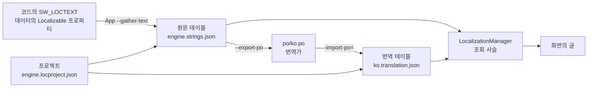

# Localization — 문자열 테이블, 문화권, 메시지 포맷

## 이것은 무엇이고 왜 있나

게임 화면의 글을 코드에 그대로 쓰면 다른 언어로 낼 수 없습니다. 이 모듈은 화면에 보이는 글을 키로 찾아 지금 언어의 글로 바꾸고, 숫자나 이름 같은 인자를 언어 규칙에 맞게 끼워 넣습니다.
언리얼의 Localization Dashboard와 유니티 Localization 패키지에 해당합니다.
String Table, 문화권 폴백, ICU 메시지 포맷, 의사 로컬라이제이션(Pseudo-Locale)처럼 두 엔진에 있는 기능을 같은 이름으로 제공합니다.

번역 작업에 필요한 도구도 함께 있습니다. 코드와 데이터에서 번역할 글을 모으고(수집), 번역가에게 gettext PO 파일로 넘기고 돌려받습니다(교환).
수집과 교환 명령의 본문은 소스 트리 · 대화 에셋 · 게임 설정까지 읽는 개발 도구라 이 폴더가 아니라 에디터 모듈(`Source/Editor/Common/Localization/LocalizationTools.h`)에 있습니다.
App 이 헤드리스로 에디터 모듈을 올려 부르므로(`EditorModuleHost::runLocalizationWithEditorModule`) Dev 빌드에서만 됩니다.

## 머릿속 그림



**프로젝트.** 로컬라이제이션 프로젝트(`*.locproject.json`)는 원문 테이블과 문화권 목록, 수집할 코드와 데이터 위치를 적은 파일입니다. 엔진 프로젝트 하나와 게임마다 프로젝트 하나가 있습니다.
테이블 파일은 프로젝트가 이름으로 부르고 폴더를 훑지 않으므로, 팩 안에서도 똑같이 동작합니다.

**원문 테이블과 번역 테이블.** 원문 테이블(`*.strings.json`)이 원본이고, 번역 테이블(`<문화권>.translation.json`)은 문화권마다 하나씩 있습니다.
번역 테이블의 각 항목은 번역할 때의 원문 해시(`sourceHash`)를 기록합니다. 원문이 바뀌어 해시가 달라진 번역은 **낡은**(stale) 번역이 되어 화면에 나오지 않습니다.

**문화권과 조회 사슬.** 문화권(culture)은 언어와 지역 형식을 묶은 단위입니다(`ko`, `ko_kr`, `en`). 키를 찾을 때는 지금 문화권, 그 부모, 폴백 문화권, 그 부모, 원문 문화권 순서로 찾습니다.
이 순서를 조회 사슬이라고 부르고 `getLookupChain()` 으로 볼 수 있습니다.

**메시지 포맷.** 인자가 들어가는 글은 ICU MessageFormat의 부분 집합으로 씁니다. `{count, plural, one {# item} other {# items}}` 처럼 복수형과 선택을 언어 규칙에 맞게 고릅니다.

## 따라 해 보기 — 코드의 메시지 하나를 한국어로

엔진 코드의 메시지 하나를 한국어로 번역해 화면에 띄우는 과정입니다. 수집 명령은 에디터 모듈이 필요하므로 Dev 빌드와 소스 트리에서 돌립니다.

**1단계 — 코드에 글을 씁니다.** 사용자에게 보이는 글은 `SW_LOCTEXT` 로, 인자가 있으면 `SW_LOCFORMAT` 으로 씁니다. 세 인자는 이름공간, 키, 영어 원문입니다.

<!-- snippet: TestLocalizationManager.cpp 의 SW_LOCTEXT · SW_LOCFORMAT 사용 — 5b U7 에서 대조 -->
```cpp
const utf8* pStart = SW_LOCTEXT( "Menu", "Start", "Start" );
const string count = SW_LOCFORMAT( "Menu", "Count", "{n} items", TextArgumentList().addInteger( "n", 3 ) );
```

실제 키는 `Menu.Start` 입니다. 테이블에 키가 없으면 원문을 그대로 돌려주고, 빠진 키로 한 번 경고합니다.
세 인자는 문자열 리터럴이어야 합니다. 수집기가 소스를 읽어 원문을 모으기 때문입니다.

**2단계 — 원문을 수집합니다.**

```powershell
cd build/Ninja-Debug/Bin
./App.exe --gather-text
```

엔진 프로젝트의 `codeRoots`(`Source/Engine`, `Source/GameFramework`)를 훑어 `Menu.Start` 를 `Resource/engine/localization/engine.strings.json` 에 넣습니다.
활성 게임의 프로젝트도 함께 수집합니다.

**3단계 — 번역을 넣습니다.** `ko.translation.json` 의 `entries` 에 항목을 더합니다. 직접 쓸 때는 `sourceHash` 를 비워 둡니다.

```json
"Menu.Start": { "text": "시작" }
```

번역가에게 맡긴다면 `--export-po` 로 `po/ko.po` 를 만들어 넘기고, 돌려받은 파일을 `-import-po=<파일>` 로 가져옵니다.

**4단계 — 한 번 더 수집합니다.** `--gather-text` 를 다시 돌리면 해시가 없는 번역에 지금 원문의 해시를 기록합니다. 이제 원문이 바뀌면 이 번역은 낡은 번역이 됩니다.

**5단계 — 한국어로 실행합니다.** `App.exe -lang=ko` 로 실행하면 "시작"이 보입니다. `-lang=qps-ploc` 으로 실행하면 모든 글이 악센트가 붙고 길어진 의사 로컬라이제이션 글로 보입니다.

**6단계 — 함께 커밋합니다.** 원문 테이블, 번역 테이블, 번역 메모리(`tm/`)를 코드와 같은 커밋에 넣습니다.
`TextGathererTest.RepositoryProjectsAreUpToDate` 가 저장소의 프로젝트가 최신인지 확인하므로, 수집 결과를 빠뜨리면 테스트가 실패합니다.

## 작동 원리

### 파일 형식

엔진 데이터는 `Resource/engine/localization/` 에 있고, 게임 프로젝트는 `<팩>/data/localization/<게임>.locproject.json` 입니다(`GameSettings::_localizationProject`).

| 파일 | 내용 |
|---|---|
| `engine.cultures.json` | 문화권 테이블(`EngineDefaultAssets::_cultureTable`) |
| `engine.locproject.json` | 엔진 프로젝트(`EngineDefaultAssets::_localizationProject`). 설정 메뉴와 엔진 UI의 글 |
| `engine.strings.json` | 원문 테이블 |
| `ko.translation.json` | 한국어 번역 테이블 |
| `po/`, `tm/` | PO 교환 파일과 번역 메모리 |

**프로젝트**에는 `name`, `sourceCulture`, `cultures`, `stringTables`, `codeRoots`, `assetRoots`, `assetRules` 가 들어갑니다. 테이블 이름은 프로젝트 파일 기준 상대 경로입니다.

**원문 테이블**의 항목에는 `source`(원문), `context`, `comment`, `maxLength`, `origins` 가 있습니다. `origins` 는 그 글을 수집한 위치입니다.
`origins` 가 비어 있는 항목은 사람이 직접 넣은 것으로 보고, 수집기가 지우지 않습니다.

**번역 테이블**의 항목에는 `text`, `sourceHash`, `review`, `translatorComment` 가 있습니다. `sourceHash` 가 지금 원문 해시와 다르거나 `review` 가 켜져 있으면 화면에 내지 않고 사슬의 다음 문화권으로 넘어갑니다.
해시가 없는 항목은 검사하지 않습니다.

**문화권 테이블**의 항목은 `parent` 에서 적지 않은 값을 물려받습니다. 복수형 규칙(`pluralRule`), 숫자 기호(`digits`), 날짜 패턴, 월 이름, 쓰기 방향, 글꼴 대체 목록, 의사 로컬라이제이션 방식(`pseudo`)이 들어갑니다.
허용 값은 `CultureInfo.h` 에 있습니다. 모르는 필드, 없는 부모, 순환, 정규화되지 않은 코드(`ko-KR`)는 로드 오류입니다.

### 수집

`--gather-text` 는 세 곳에서 글을 모읍니다.

- **코드.** `codeRoots` 의 `.h`, `.cpp`, `.inl` 에서 `SW_LOCTEXT` 와 `SW_LOCFORMAT` 을 찾습니다. 인자가 리터럴이 아니면 `파일:줄` 오류를 냅니다.
  리터럴 이어 붙이기, 이스케이프, raw 문자열은 읽을 수 있고, 주석과 문자열, `#define` 줄 안에 있는 것은 건너뜁니다. 같은 키에 원문이 두 개면 오류입니다.
- **리플렉션 데이터.** `PROPERTY( Meta = "Localizable" )` 가 붙은 문자열 프로퍼티의 값을 모읍니다. 최대 길이는 `Meta = "Localizable, MaxLength=24"` 로 정합니다.
  값은 키이거나 글 그 자체입니다. 어느 테이블에 같은 키가 있으면 참조로, 없으면 글이 곧 키가 됩니다. gettext와 같은 방식입니다.
  그래서 글을 고치면 새 키가 되고, 이전 번역은 번역 메모리가 비슷한 원문으로 찾아 넘겨줍니다.
  표시가 없는 문자열 프로퍼티에 낱말이 두 개 이상인 문장이 있으면 하드코딩 의심 경고를 냅니다. 사람이 읽는 글이 아니면 `Meta = "NotLocalizable"` 을 붙입니다.
- **직접 읽는 XML.** 아이템 카탈로그나 설정 스키마처럼 리플렉션이 아닌 XML은 프로젝트의 `assetRules` 로 읽습니다.
  `{ "files": "items.xml", "elements": [ "Item" ], "attribute": "name", "kind": "text" }` 처럼 씁니다. `kind: "key"` 는 키 참조라서, 어느 테이블에도 없으면 오류입니다.
  대화 파일(`.dialogue.json`)의 화자, 대사, 선택지는 규칙 없이 항상 모읍니다.

모은 글은 첫 원문 테이블(`stringTables[0]`)과 비교해 추가, 변경, 삭제를 적용합니다. 지우는 것은 수집기가 넣었던 항목(`origins` 가 있는 항목)뿐입니다.

번역 테이블은 다음과 같이 갱신합니다.

1. 해시가 없는 번역에 지금 원문 해시를 기록합니다. 직접 쓴 번역을 받아들이는 단계입니다.
2. 지금 번역을 번역 메모리(`tm/<문화권>.tm.json`)에 쌓습니다.
3. 원문이 사라진 키의 번역을 지웁니다.
4. 번역이 없는 키는 메모리에서 같은 원문을 찾아 그대로 채우고, 비슷한 원문(정규화 후 편집 거리 근사)이면 검토 표시를 붙여 채웁니다. 낡은 번역은 같은 원문일 때만 채웁니다.
5. 자리표시자 이름 차이, 최대 길이 초과, 포맷 구문 오류, 리치 텍스트 태그 차이를 보고합니다.

`--check-text` 는 파일을 쓰지 않고 테이블이 최신인지만 종료 코드로 알립니다. `-loc-project=<경로>` 로 프로젝트 하나를, `-loc-project=all` 로 엔진과 모든 게임 팩을 고릅니다.
CI 는 App 을 띄우지 않습니다. 같은 확인을 `EditorTest` 의 `LocalizationGatherTest.RepositoryProjectsAreUpToDate` 가 합니다(에디터 모듈이 지어지는 구성의 `nogpu` 시험).

**PO 교환.** `--export-po` 는 문화권마다 `<프로젝트 폴더>/po/<문화권>.po` 를 씁니다. 키는 `msgctxt` 에 들어갑니다.
`-import-po=<파일>` 은 파일 머리의 `X-Localization-Project` 로 프로젝트를 고릅니다. 가져온 번역의 해시는 번역가가 본 원문(`msgid`)의 해시이므로, 그 사이 원문이 바뀌었으면 낡은 번역으로 남습니다.
`#, fuzzy` 는 검토 표시가 되고, `# ` 로 시작하는 번역가 메모는 왕복해도 유지됩니다.

### 실행 중 조회

**초기화.** 엔진 초기화의 `EngineDefaultAssets` 단계가 문화권 테이블과 엔진 프로젝트를 로드하고 `-lang=` 인자를 적용합니다.
게임은 `GameInstanceBase` 가 `GameStrings::initialize` 를 거쳐 `LocalizationManager::initialize` 로 자기 프로젝트를 로드합니다. 이전 게임의 프로젝트는 언로드합니다.
그 뒤 플레이어 설정 `language.text` 가 다시 적용됩니다.

**찾기.** `getString( key )` 는 조회 사슬 어디에도 키가 없으면 빠진 키로 한 번 경고하고 기록합니다(`getMissingKeys`).
`getStringByText` 는 키가 아닐 수도 있는 글(대사 원문 같은 것)에 쓰고, 빠진 키로 기록하지 않습니다. `Meta = "Localizable"` 값은 `getStringByText( value, value )` 로 찾습니다.

**포맷.** `formatText( pattern, TextArgumentList().addText( "name", n ).addInteger( "count", c ) )`, `getFormattedString( key, args )`, `SW_LOCFORMAT` 이 있습니다.
`TextFormatter` 가 지원하는 것은 `{name}`, `plural`, `select`, `number`, `date`, `time` 입니다. 포맷 오류는 경고로 알리고 글은 그래도 돌려줍니다.

**글 버전.** 언어를 바꾸거나 파일을 다시 읽거나 프로젝트를 로드할 때마다 글 버전(revision) 번호가 오릅니다. 언리얼의 TextRevision과 같습니다.
런타임 UI는 이 번호를 보고 바뀌면 글을 다시 찾고 레이아웃을 다시 계산합니다. 글 위젯의 `_text` 는 키나 글 그대로이고 `getStringByText( 키, 키 )` 로 찾습니다.
자세한 내용은 [UI README](../UI/README.md)의 "현지화 글" 절에 있습니다.

**다시 읽기.** `reloadChangedFile( path )` 는 그 파일이 속한 프로젝트를 다시 읽습니다. 실패하면 이전 글을 유지합니다. 성공하면 글 버전을 올리고 언어 변경 콜백을 같은 언어로 부릅니다.
에디터 핫 리로드는 `.strings.json`, `.translation.json`, `.locproject.json` 변경을 에셋 캐시 "StringTable"(`LocalizationReloadCache`)로 보내 이 함수를 부릅니다.
에디터 Data Table 패널의 Localization 탭은 원문과 문화권 번역을 한 테이블로 고치고, 저장하면 같은 경로로 다시 읽습니다.

**글꼴.** `getFontFallback( culture )` 는 문화권(없으면 부모와 폴백)의 글꼴 패밀리 목록을 돌려줍니다. 이 목록으로 글꼴 대체 순서를 만드는 것은 `Engine/Text/FontSystem` 입니다.
패밀리 이름은 `engine/fonts/fontcatalog.xml` 에 있어야 쓰입니다.

**리치 텍스트.** `[b]` 나 `[color=…]` 같은 태그(`Core/String/MarkupTagScanner`)는 번역 검사가 원문과 번역의 태그 순서를 비교하고, 다르면 보고합니다. 의사 로컬라이저는 태그를 바꾸지 않습니다.

**의사 로컬라이제이션.** 의사 문화권 `qps-ploc` 은 글자에 악센트를 붙이고 40% 늘리고 괄호로 감쌉니다. `qps-plocm` 은 오른쪽에서 왼쪽으로 쓰는 언어를 흉내 냅니다(RLO 문자).
포맷 구문은 지키고 글자 부분만 바꿉니다. Dev 빌드에서만 고를 수 있는 언어 목록에 들어 있습니다.

## 확장하는 법

**새 언어를 더하려면**

1. `engine.cultures.json` 에 그 문화권이 없으면 항목을 더합니다. 부모가 있으면 `parent` 를 적고 다른 값만 씁니다.
2. 프로젝트의 `cultures` 에 문화권 코드를 더합니다. 코드는 정규화된 철자(소문자, `_` 구분)로 씁니다.
3. 프로젝트 폴더에 `<문화권>.translation.json` 을 만들고 `culture` 를 같은 철자로 적습니다.
4. `--gather-text` 를 돌려 번역 메모리로 채울 수 있는 것을 채우고, 나머지는 PO로 번역가에게 넘깁니다.

**새 게임에 로컬라이제이션을 붙이려면** 게임 팩의 `data/localization/` 에 프로젝트를 만들고, 게임 설정의 `_localizationProject` 에 경로를 적습니다. `codeRoots` 에는 그 게임의 소스 폴더를 넣습니다.

## 함정과 주의

- **키를 대소문자만 다르게 두 개 만들지 마세요.** 파일에는 대소문자를 구분해 저장하지만, 실행 중 조회는 `hashed_string` 해시라서 대소문자를 무시합니다.
- **번역 테이블의 `culture` 는 프로젝트 `cultures` 의 철자와 같아야 합니다.** 정규화한 뒤에도 다르면 그 테이블은 로드되지 않습니다.
- **게임 데이터를 낱개 테이블(`setString`, `loadLanguageJSON`)로 넣지 마세요.** 낱개 테이블은 원문 해시 확인 없이 프로젝트 위에 덮입니다. 테스트와 도구용입니다.
- **UI에는 미리 찾은 글이 아니라 키를 넣으세요.** `SW_LOCTEXT` 로 찾은 글을 위젯에 넣으면 언어를 바꿔도 그 글이 그대로 남습니다.
- **코드나 데이터의 글을 고치면 수집 결과를 같은 커밋에 넣으세요.** 원문이 바뀌면 기존 번역은 낡은 번역이 되어 화면에서 사라지고, `LocalizationGatherTest.RepositoryProjectsAreUpToDate`(EditorTest)가 실패합니다.
- **`selectordinal`, 화폐, 시간대, 서수는 지원하지 않습니다.** 날짜는 받은 값을 그대로 쓰고 시간대 변환을 하지 않습니다.

## 더 볼 곳

| 파일 | 내용 |
|---|---|
| `LocalizationManager.h` | 엔진 서비스(`engine::getLocalizationManager()`). 로드, 조회, 포맷, 글 버전 |
| `LocalizationDocuments.h` | `SourceStringTable`, `TranslationTable`, `LocalizationProject` 파일 형식 |
| `CultureInfo.h` | 문화권 데이터와 복수형 규칙 |
| `TextFormatter.h` | 메시지 포맷 문법 |
| `LocText.h` | `SW_LOCTEXT`, `SW_LOCFORMAT` |
| `TextGatherer.h`, `TranslationMemory.h`, `PortableObjectFile.h` | 수집, 번역 메모리, PO |
| `Source/Editor/Common/Localization/LocalizationTools.h` | `--gather-text` 같은 명령의 본문(에디터 모듈) |

- 테스트: `Test/EngineTest/Localization/`, 도구 명령은 `Test/EditorTest/Common/Localization/`
- 명령줄 인자 전체: [CommandLine 문서](../../../docs/Config/CommandLine.md)
