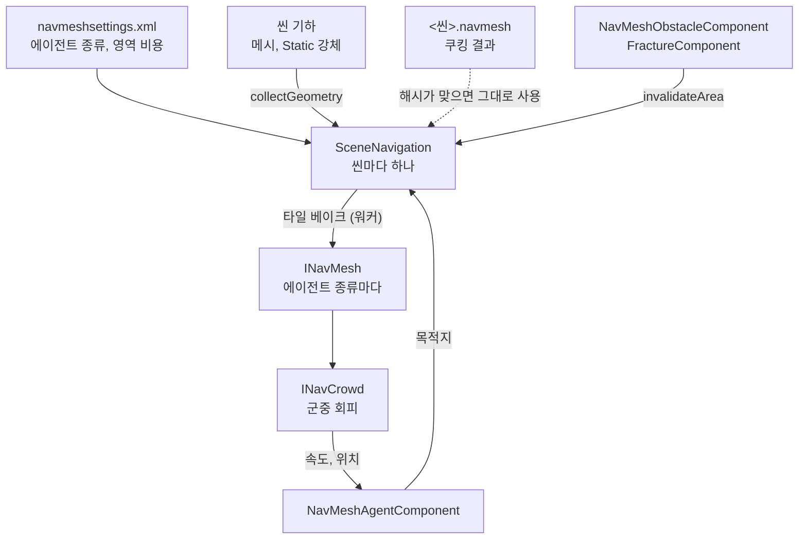

# Navigation — 3D 내비메시, 경로 찾기, 군중

## 이것은 무엇이고 왜 있나

AI 캐릭터가 벽을 돌아 목적지까지 걸어가려면 "어디를 걸을 수 있는가"를 미리 알아야 합니다.
이 모듈은 레벨 기하에서 걸을 수 있는 면을 폴리곤 메시로 미리 계산하고(베이크), 그 위에서 경로를 찾고, 여러 에이전트가 서로 비켜 걷게 합니다.
걸을 수 있는 면을 나타낸 폴리곤 메시를 **내비메시**(navigation mesh)라고 부릅니다.

언리얼의 `ARecastNavMesh`, `UNavigationSystemV1`, `UCrowdManager` 와 유니티의 `NavMeshSurface`, `NavMeshAgent`, `NavMeshObstacle` 에 해당합니다.
두 엔진 모두 오픈 소스 Recast & Detour 라이브러리를 쓰고, 이 엔진도 같은 라이브러리를 엔진 인터페이스 뒤에 감쌌습니다.
Recast가 베이크를, Detour가 경로 질의를, DetourCrowd가 군중 이동을 맡습니다.

격자 기반 내비게이션(RTS, 도시 건설)은 이 모듈이 아니라 `GameFramework/Base/Actor/Navigation` 의 `NavGrid` 와 `NavAgent` 에 있습니다.
두 방식은 공통 이동 인터페이스 `INavMover` 를 함께 구현하므로, 행동 트리 같은 상위 코드는 어느 쪽인지 몰라도 됩니다.

엔진 계층으로는 4층(Resource, Spatial과 같은 층)입니다. 물리의 충돌 모양 서술과 `AABB` 를 읽어 베이크하고, 씬 쪽 코드(`Object/GameObject/SceneNavigation` 과 `Object/Component/Navigation`, 6층)가 이 모듈을 씁니다.

## 머릿속 그림



**에이전트 종류.** 반지름과 키, 오를 수 있는 단 높이가 다르면 걸을 수 있는 면도 다릅니다. 그래서 에이전트 종류(`Humanoid`, `Large` 등)마다 내비메시를 따로 베이크합니다.
언리얼의 `SupportedAgents`, 유니티의 Agent Type과 같습니다. 종류는 `Resource/engine/navigation/navmeshsettings.xml` 에 적습니다.

**타일.** 내비메시는 XZ 평면의 타일 격자(`NavTileGrid`)로 나뉩니다. 타일 하나가 베이크, 교체, 쿠킹의 단위입니다.
레벨 일부가 바뀌면 그 부분에 닿는 타일만 다시 베이크합니다.

**영역.** 영역(area)은 진흙이나 물처럼 걷는 비용이 다른 면입니다. 영역마다 비용 배율이 있고, 경로 찾기는 비용이 낮은 쪽을 고릅니다.

**씬의 내비게이션.** `SceneNavigation` 은 씬마다 하나 있고 `GameObjectManager` 가 소유합니다. 에이전트 종류마다 내비메시와 군중을 보관하고, 매 프레임 한 번 군중을 진행합니다.
컴포넌트는 직접 Detour를 부르지 않고 이 객체를 거칩니다.

## 따라 해 보기 — 상자를 돌아 걷는 에이전트

바닥 위에 상자 벽을 놓고, 에이전트가 벽을 돌아 반대편으로 걸어가게 합니다. `NavMeshAgentTest.AgentWalksAroundCratesToTheDestination` 이 이 과정을 그대로 테스트합니다.

**1단계 — 베이크할 표면을 정합니다.** `NavMeshSurfaceComponent` 를 가진 오브젝트를 하나 둡니다.
이 컴포넌트는 어느 에이전트 종류를, 어떤 기하로, 어느 범위까지 베이크할지 정합니다. 언리얼의 NavMeshBoundsVolume과 유니티의 `NavMeshSurface` 에 해당합니다.

<!-- snippet: NavMeshTestUtil.h 의 spawnSurface — 5b U7 에서 대조 -->
```cpp
GameObject*              pObject  = manager.createGameObject( hashed_string( "NavSurface" ) );
NavMeshSurfaceComponent* pSurface = pObject->addComponent<NavMeshSurfaceComponent>();
pSurface->setAgentTypes( { hashed_string( "Humanoid" ) } );
pSurface->setGeometrySource( NavGeometrySource::RenderMeshes ); // PhysicsColliders, Both 도 있다
```

`RenderMeshes` 는 보이는 메시를, `PhysicsColliders` 는 Static 강체의 충돌 모양을 기하로 씁니다. 범위는 `setBoundsHalfExtents` 로 정합니다.

**2단계 — 에이전트를 붙이고 목적지를 줍니다.**

<!-- snippet: TestNavMeshAgent.cpp AgentWalksAroundCratesToTheDestination 의 에이전트 부분 — 5b U7 에서 대조 -->
```cpp
GameObject*     pWalker = manager.createGameObject( hashed_string( "Walker" ) );
SceneComponent* pRoot   = pWalker->addComponent<SceneComponent>();
pRoot->setLocalPosition( float3{ -6.0f, 0.0f, 0.0f } );
NavMeshAgentComponent* pAgent = pWalker->addComponent<NavMeshAgentComponent>();
pAgent->setMaxSpeed( 4.0f );

manager.beginPlay();
// ... 몇 프레임 뒤
pAgent->setDestination( float3{ 6.0f, 0.0f, 0.0f } );
```

플레이가 시작되고 첫 내비게이션 갱신에서 표면의 내비메시가 준비됩니다. 쿠킹 결과가 있으면 그것을 쓰고, 없으면 그 자리에서 베이크합니다.
`setDestination` 은 오브젝트의 틱 안에서 불러도 됩니다. 요청은 기록해 두었다가 다음 내비게이션 갱신에서 군중에 넣습니다.

**3단계 — 도착을 확인합니다.** 매 프레임 `getMoveStatus()` 를 보면 `Moving` 에서 `Arrived` 로 바뀝니다. 목적지에서 `_stoppingDistance` 안에 들어오면 도착입니다.
`-gv_navDebugDraw=3` 으로 실행하면 내비메시 폴리곤 테두리와 에이전트 경로가 선으로 보입니다.

## 작동 원리

### 라이브러리 감싸기

Recast와 Detour의 헤더는 `Recast/` 폴더에서만 include하고, 라이브러리는 `Source/Engine/CMakeLists.txt` 에서만 링크합니다. `Scripts/lint/gate/CheckThirdPartyIsolation.py` 가 이 규칙을 검사합니다.
테스트, 게임, 키트는 `INavMesh` 와 `INavCrowd` 인터페이스만 씁니다.

| 파일 | 내용 |
|---|---|
| `NavigationTypes.h` | 폴리곤 참조, 영역, 질의 필터, 경로, 군중 에이전트 값 같은 공용 타입 |
| `INavMesh.h` | `INavMesh`, `INavCrowd` 인터페이스와 백엔드 선택(`NavMeshBackend`) |
| `NavMeshGeometry` | 베이크 입력. 월드 삼각형, 볼록 부피, XZ 셀 인덱스, 입력 해시 |
| `NavMeshSettings` | `navmeshsettings.xml` 을 읽은 값 |
| `NavMeshAsset` | 쿠킹 결과 `.navmesh` 읽기와 쓰기, 모든 타일을 워커로 베이크하는 `NavMeshBakeUtil` |
| `Recast/RecastNavMesh`, `Recast/DetourNavCrowd` | 라이브러리를 쓰는 구현 |

백엔드를 바꾸려면 두 인터페이스를 구현하는 클래스 두 개와 `NavMeshBackend` 의 함수 세 개(생성, 이름, 버전)를 바꿉니다.
쿠킹 결과에는 백엔드 이름과 버전이 적혀 있어서, 다른 백엔드가 만든 파일은 읽지 않습니다.

Recast와 Detour의 메모리 할당은 `rcAllocSetCustom` 과 `dtAllocSetCustom` 으로 엔진 할당기에 연결되어 있습니다. 메모리 태그는 `Navigation` 이고, 예산은 `Config/Engine/MemoryBudget.json` 에 있습니다.

### 타일 베이크

`INavMesh::bakeTile` 은 입력만 읽는 순수 함수입니다. 그래서 여러 워커가 동시에 서로 다른 타일을 베이크할 수 있고, `NavMeshBakeUtil::bakeAllTiles` 가 `engine::runParallel` 로 타일을 나눕니다.
같은 입력이면 바이트까지 같은 타일이 나오므로, 쿠킹한 타일과 런타임에 베이크한 타일이 같습니다.
베이크한 타일을 내비메시에 넣는 `replaceTile` 은 질의와 겹치면 안 되므로 게임 스레드에서 질의가 없는 구간에만 합니다.

`RecastNavMesh::bakeTile` 은 다음 순서로 동작합니다.

1. 타일과 테두리에 닿는 삼각형을 셀 인덱스로 모아 복셀로 바꿉니다. 테두리 폭은 에이전트 반지름에 3셀을 더한 값입니다. 경사가 `_maxSlope` 를 넘는 삼각형은 걸을 수 없는 면이지만 길은 막습니다.
2. 낮은 장애물과 떨어지는 가장자리, 낮은 천장(`_height` 미만)을 걸러 냅니다. `_maxClimb` 이하의 단은 오를 수 있습니다.
3. 압축 높이맵을 만들고 걸을 수 있는 면을 에이전트 반지름만큼 깎습니다. 그래서 에이전트가 벽에서 떨어져 걷습니다.
4. 볼록 부피를 칠합니다. 장애물 부피(`kNotWalkableArea`)는 깎은 뒤에 칠하므로 반지름만큼 넓혀서 칠합니다. 결과는 유니티의 Carve와 같습니다.
5. 워터셰드 방식으로 영역을 나눕니다. `_minRegionSize` 보다 작은 섬은 버립니다. 이어서 외곽선(`_maxEdgeError`, `_maxEdgeLength`)을 따고, 꼭짓점 6개까지의 폴리곤과 높이 디테일을 만듭니다.
6. Detour 타일 바이트를 만듭니다(`dtCreateNavMeshData`).

영역 표의 i번째 영역은 Recast 영역 i + 1이 되고(0은 걸을 수 없음), 폴리곤 플래그 비트 `1 << i` 가 됩니다. 질의 필터의 영역 비트가 곧 폴리곤 플래그 비트이므로 영역은 16개까지입니다(`NavigationConstant::kMaxAreaCount`).

### 경로 질의

| 함수 | 하는 일 |
|---|---|
| `findNearestPoint` | 주어진 상자 안에서 가장 가까운 내비메시 위의 점을 폴리곤 참조와 함께 찾습니다 |
| `findPath` | A*로 폴리곤 경로를 찾고, 모퉁이만 남긴 직선 경로로 다듬습니다 |
| `raycast` | 걸을 수 있는 면을 따라 직선으로 가다가 경계에 막히면 그 위치와 법선을 돌려줍니다 |

`findPath` 의 결과는 `NavPathStatus` 입니다. 끝까지 가면 `Complete`, 끝에 닿지 못하면 끝에 가장 가까운 점까지 가는 `Partial`, 시작이나 끝이 내비메시 밖이면 `Failed` 입니다.

질의 함수는 `const` 이고 아무 스레드에서나 불러도 됩니다. 스레드마다 자기 Detour 질의 객체를 쓰기 때문입니다.
질의 객체는 스크래치 슬롯마다 하나씩 처음 쓸 때 만들고, 슬롯이 없는 스레드는 잠금 아래에서 하나를 공유합니다.

질의 필터(`NavQueryFilter`)는 영역마다의 비용 배율과 지나지 않을 영역 비트를 가집니다. 기본 필터는 설정 파일의 영역 비용으로 만듭니다(`NavMeshSettings::makeDefaultFilter`).

### 군중

`INavCrowd` 는 DetourCrowd를 감싼 것입니다. `update` 한 번에 모든 에이전트의 경로 따라가기, 모퉁이 미리 돌기, 회피를 처리합니다.
회피는 RVO 계열의 샘플링 방식이고, 품질은 `NavAvoidanceQuality` 의 네 단계(`Low`, `Medium`, `Good`, `High`)입니다. 단계가 높을수록 샘플을 많이 뽑습니다.
군중은 게임 스레드 하나에서만 다룹니다.

캐릭터 컨트롤러처럼 다른 것이 에이전트를 옮겼다면 `syncAgentPosition` 으로 군중 안의 위치를 맞춥니다. 이때 위치는 벽을 넘지 않는 범위에서만 옮겨집니다.
멀리 옮겼다면 `teleportAgent` 를 씁니다. 목적지를 내비메시에서 찾지 못한 요청은 `Failed` 상태로 남습니다.

### 씬에서의 갱신 순서

`GameObjectManager` 는 매 프레임 컴포넌트 틱(PrePhysics, DuringPhysics)과 구조 변경 적용이 끝난 뒤, 애니메이션과 물리 전에 내비게이션을 갱신합니다.
프로파일 구간 이름은 `GT.Scene.tick.navigation` 입니다. 갱신은 게임 스레드에서 다음 순서로 진행합니다.

1. 지난 프레임에 끝난 타일 재베이크 결과를 `replaceTile` 로 넣습니다. 컴포넌트 틱이 질의하지 않는 구간이라 안전합니다.
2. 에이전트의 요청(목적지, 멈춤, 순간이동)과 현재 위치를 군중에 넣습니다. 바깥 코드가 에이전트를 0.5 m 넘게 옮겼다면 순간이동으로 봅니다.
3. 에이전트 종류마다 군중 `update` 를 부릅니다.
4. 결과를 에이전트에 씁니다.

결과를 어떻게 쓰는지는 에이전트의 `_driveMode`(`NavAgentDriveMode`)가 정합니다.

| 값 | 움직이는 쪽 |
|---|---|
| `Transform` | 에이전트가 오브젝트 위치와 진행 방향 회전을 직접 씁니다 |
| `CharacterController` | 같은 오브젝트의 캐릭터 컨트롤러에 원하는 속도를 넘깁니다(`setMoveVelocity`). 벽과 경사는 물리가 처리합니다 |
| `SteerOnly` | 아무것도 옮기지 않고 속도만 계산합니다 |

`SteerOnly` 는 플레이어와 NPC가 같은 이동 컴포넌트로 걷게 할 때 씁니다. AI 컨트롤러(`GameFramework/Base/Actor/Control/Controller/AIControllerComponent`)가 그 속도를 이동 의도로 바꾸고, 폰의 이동 컴포넌트가 실제로 옮깁니다.
다음 갱신은 옮겨진 위치를 받아 군중에 넣습니다.

### 베이크 기하 모으기

`SceneNavigation::collectGeometry` 가 베이크 입력을 모읍니다. 런타임 베이크와 쿠킹이 같은 함수를 씁니다.
켜진 오브젝트의 보이는 `MeshComponent`(스킨드 메시 제외)와 Static `RigidBodyComponent` 의 충돌 모양을 물리와 같은 크기와 자세로 모읍니다.

움직이는 것이 들어 있는 계층은 통째로 뺍니다. 에이전트, 캐릭터 컨트롤러, 스킨드 메시, Static이 아닌 강체가 있는 계층입니다.
이렇게 하지 않으면 베이크하는 순간 그 자리에 서 있던 캐릭터나 손에 든 무기가 바닥에 구멍을 냅니다.
`NavMeshModifierComponent` 로 특정 오브젝트와 자식을 빼거나(`_bIgnoreFromBuild`) 영역을 지정할 수 있습니다(`_areaName`). 여러 조상에 붙어 있으면 가장 가까운 조상의 설정이 이깁니다.

메시나 강체로 모양을 알 수 없는 오브젝트는 `INavGeometrySource` 를 등록해 기하를 직접 내놓습니다. 파괴된 벽이 그 예입니다(아래 "동적 변경").

### 처음 쓸 때와 쿠킹

플레이 중 첫 갱신에서 표면이 맡은 에이전트 종류의 내비메시를 준비합니다.
쿠킹 결과(`<씬>.navmesh`)가 있고 베이크 값 해시와 입력 해시가 모두 맞으면 그 타일을 그대로 넣습니다. 아니면 모든 타일을 워커로 베이크합니다.
쇼케이스 씬(16 타일)에서 쿠킹 결과를 넣는 데 0.03 ms, Debug에서 전부 베이크하는 데 8 ms가 걸립니다.
에이전트가 처음 등록될 때 그 종류가 없으면 그때 준비하고, 테스트나 도구는 `ensureNavMesh` 로 지금 바로 준비합니다.

`App --cook-scenes` 는 `NavMeshSurfaceComponent` 가 있는 씬마다 플레이를 시작하지 않은 채 씬을 만들고, `makeCookedEntry` 로 베이크해 `<cooked-dir>/<씬 경로>.navmesh` 를 씁니다(`SceneNavigationCooker`).
파일 이름은 씬 이름에서 나옵니다(`NavMeshAsset::makeCookedPath`, `maps/arena.scene.xml` 은 `maps/arena.navmesh`). 팩 쿠커가 스테이징 폴더째 팩에 넣습니다.
장애물과 플레이 중에 스폰된 오브젝트는 쿠킹 결과에 들어가지 않습니다.

`.navmesh` 는 리틀 엔디언 바이너리입니다. 매직 `SWNV`, 형식 버전, 백엔드 이름과 버전 뒤에 에이전트 종류마다 항목이 하나씩 옵니다.
항목에는 종류 이름, 베이크 값 해시(`computeAgentTypeHash`), 입력 해시(`NavMeshGeometry::computeHash`), 경계 상자, 타일 목록이 들어 있습니다.
설정 파일의 베이크 값이나 레벨 기하가 바뀌면 해시가 달라져 쿠킹 결과를 버리고 다시 베이크합니다.

### 동적 변경 — 장애물과 파괴

움직이는 장애물이나 부서진 벽이 생기면 닿은 타일만 처음부터 다시 베이크합니다. 언리얼의 동적 내비메시(타일 재생성)와 같은 방식입니다.
타일 하나(48셀)는 몇 ms가 걸리므로 워커에 넘기면 게임 스레드가 멈추지 않습니다.

1. **알림.** `NavMeshObstacleComponent` 는 갱신마다 자세를 확인합니다. 생기거나 사라졌을 때, 임계값(`_obstacleMoveThreshold`, 기본 0.25 m)보다 많이 움직였을 때, 0.1 rad 넘게 돌았을 때 이전 영역과 새 영역을 알립니다.
   `FractureComponent` 는 붙어 있는 조각이 바뀔 때(`onAnchoredShapeChanged`) 자기 경계를 알립니다. 수정자 속성을 바꿔도 알립니다.
   알리는 함수 `invalidateArea` 는 아무 스레드에서나 불러도 됩니다. 스핀 잠금 아래에서 쌓입니다.
2. **입력 사본.** 정적 기하가 바뀌었으면 기하를 다시 모아 새 사본을 만들고, 장애물만 바뀌었으면 장애물 부피 목록만 새로 만듭니다.
   둘 다 `shared_ptr<const>` 이므로 베이크 중인 작업은 이전 사본을 끝까지 읽습니다.
3. **대기열과 워커.** 알린 상자(베이크 테두리만큼 넓힘)에 닿는 타일을 대기열에 넣고, 갱신마다 `_maxConcurrentTileBakeCount` 개까지 태스크로 넘깁니다.
   같은 타일은 한 번에 하나만 베이크합니다. 베이크 중에 또 바뀐 타일은 대기열에 남았다가 끝난 뒤 새 입력으로 다시 베이크합니다.
4. **교체.** 다음 갱신이 시작할 때 끝난 결과를 `replaceTile` 로 넣습니다. 군중은 다음 `update` 에서 경로가 지나는 폴리곤이 사라졌는지 보고 경로를 다시 구합니다.
   그 사이에 에이전트는 이전 타일 위를 걷습니다.

부서진 벽은 `FractureNavGeometrySource` 가 기하를 냅니다. 온전한 동안에는 일반 규칙(메시, 강체)으로 모으게 두고, 부서진 뒤에는 아직 붙어 있는 조각의 삼각형만 냅니다.
떨어진 덩어리와 파편은 움직이는 것이라 넣지 않습니다. 테스트나 도구는 `flushTileBakes` 로 대기열을 지금 비웁니다.

### 디버그 그리기

`-gv_navDebugDraw=<비트>` 로 켭니다. 비트를 더해서 여러 개를 함께 켤 수 있고, 31이면 전부 켭니다.

| 비트 | 그리는 것 |
|---|---|
| 1 | 폴리곤 테두리. 바깥 경계는 진하게, 안쪽 경계는 옅게 |
| 2 | 에이전트 경로(모퉁이) |
| 4 | 에이전트 실제 속도(초록)와 원한 속도(파랑) |
| 8 | 장애물 영역 |
| 16 | 걸을 수 있는 면(영역 색)과 경로 띠 |

1~8은 선이라 `DebugDrawQueue` 로 보내고 에디터 뷰포트가 그립니다. 물리 디버그와 같은 어댑터(`EngineLoop`)를 씁니다.
16은 면을 메시 하나로 만들어 씬의 `NavMeshDebugView` 오브젝트에 붙입니다. 그래서 에디터 없는 게임 화면과 `-gv_screenshot` 에도 보입니다. 이 오브젝트는 베이크 기하에서 빠집니다.

## 확장하는 법

**새 에이전트 종류나 영역을 더하려면**

1. `Resource/engine/navigation/navmeshsettings.xml` 의 `_listAgentType` 이나 `_listArea` 에 한 줄을 더합니다.
2. 영역 비용은 1 이상으로 둡니다. 이유는 "함정과 주의"에 있습니다.
3. `NavMeshSurfaceComponent` 의 에이전트 종류 목록에 새 이름을 넣고, 에이전트에는 `setAgentType` 으로 같은 이름을 줍니다. 코드는 종류와 영역을 이름으로만 고릅니다.
4. 베이크 값이 바뀌었으므로 쿠킹 결과는 해시가 달라져 버려집니다. 배포 전에 `App --cook-scenes` 를 다시 돌립니다.

**메시나 강체가 아닌 것을 베이크에 넣으려면** `INavGeometrySource` 를 구현해 `SceneNavigation::registerGeometrySource` 로 등록합니다. `FractureNavGeometrySource` 가 참고할 구현입니다.
기하가 바뀌면 `invalidateArea` 로 그 영역을 알립니다.

아직 없는 기능(오프 메시 링크, 지형과 식생 베이크, TileCache, 에디터 내비메시 보기)은 [백로그](../../../docs/06_Backlog.md)에 있습니다.

## 함정과 주의

- **영역 비용을 1보다 작게 두지 마세요.** A*의 거리 추정은 비용이 1이라고 가정합니다. 1보다 싼 영역이 있으면 추정이 실제보다 커져 최단 경로를 놓칩니다.
  설정 파일을 읽을 때 범위 밖 값, 모르는 키, 겹친 이름, 없는 기본 종류는 오류이고, `ResourceDataSchemaTest` 가 저장소의 설정 파일을 읽어 확인합니다.
- **타일이 16,384개를 넘는 격자는 거절됩니다.** vcpkg의 Detour는 32비트 폴리곤 참조(`DT_POLYREF64` 없음)로 빌드되어, 타일 번호에 14비트까지만 쓸 수 있습니다. 레벨이 크면 `_tileSize` 를 키웁니다.
- **`replaceTile` 을 컴포넌트 틱 안에서 부르지 마세요.** 질의는 아무 스레드에서나 불리므로, 타일 교체가 겹치면 질의가 사라진 타일을 읽습니다. 씬의 내비게이션은 교체를 내비게이션 갱신 첫머리에서만 합니다.
- **목적지를 준 틱 안에서 상태가 바뀌기를 기대하지 마세요.** 틱에서 넣은 목적지는 모든 틱이 끝난 뒤의 내비게이션 갱신에서 군중에 들어갑니다. 상태와 속도는 그 갱신이 쓴 값이므로, 같은 틱 안에서는 이전 값을 읽습니다.
- **벤치마크는 Release로 봅니다.** `NavMeshBenchTest`(베이크, 질의 1000회, 군중 100명과 500명)는 Debug에서는 수치가 크게 부풀려집니다.

## 더 볼 곳

| 파일 | 내용 |
|---|---|
| `INavMesh.h` | 베이크, 교체, 질의, 군중 인터페이스 |
| `INavMover.h` | 격자와 내비메시 공통 이동 인터페이스 |
| `Object/GameObject/SceneNavigation.h` | 씬의 내비게이션, 쿠킹 항목 |
| `Object/Component/Navigation/` | 표면, 수정자, 에이전트, 장애물 컴포넌트 |
| `Resource/engine/navigation/navmeshsettings.xml` | 에이전트 종류, 영역, 재베이크 예산 |

- 테스트: `Test/EngineTest/Navigation/` 의 `NavMeshBakeTest`, `NavMeshQueryTest`, `NavMeshCrowdTest`, `NavMeshAgentTest`, `NavMeshCookTest`, `NavMeshDynamicTest`, `NavMeshBenchTest`
- 격자 내비게이션: `GameFramework/Base/Actor/Navigation` (`NavigationTest.GridMoverSpeaksTheCommonMoverInterface` 가 공통 인터페이스를 확인합니다)
- 상위 문서: [Engine/README.md](../README.md)
