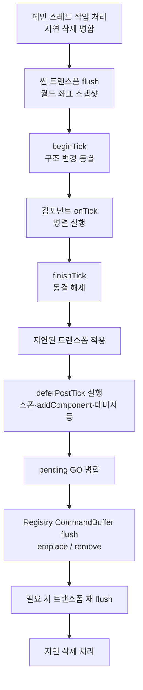
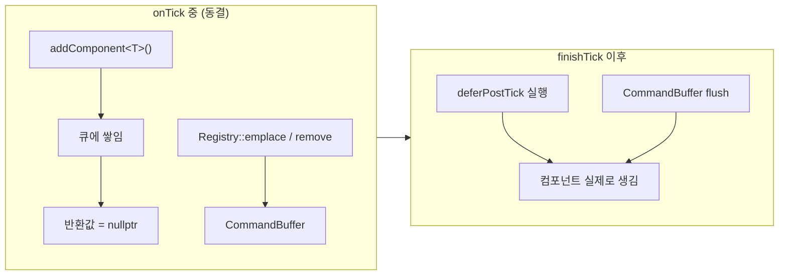
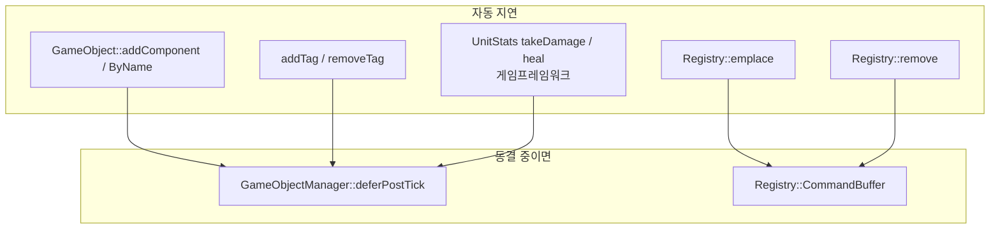

# Object (게임 오브젝트 · 컴포넌트)

씬에 올라가는 **배우(GameObject)** 와 그에 붙는 **기능 조각(Component)** 을 다루는 레이어입니다.  
게임 로직을 처음 짤 때 가장 자주 만지는 곳이기도 합니다.

관련 상위 문서: [엔진 개요](../README.md) · [Reflection](../Reflection/README.md) · [아키텍처 / Gotchas](../../../ARCHITECTURE.md)

---

## 한 줄로 이해하기

| 개념 | 역할 |
|------|------|
| **GameObject** | 이름·태그·수명을 가진 “상자”. 로직은 거의 없고 컴포넌트를 붙입니다. |
| **Component** | `onBeginPlay` / `onTick` / `onEndPlay` 로 동작하는 실제 기능. |
| **GameObjectManager** | 한 씬 안의 GO 생성·검색·틱·지연 삭제. |
| **Registry (ECS)** | 컴포넌트 데이터를 타입별 풀에 보관. Manager가 내부적으로 사용. |
| **Tag** | `"Player"`, `"Bullet"` 같은 표식. 검색·필터에 사용. |

```text
Scene
 └─ GameObjectManager
     ├─ GameObject "Player"
     │    ├─ SceneComponent   (위치·계층)
     │    ├─ PlayerComponent  (입력·이동)
     │    └─ UnitStatsData    (HP 등 ECS 데이터)
     └─ GameObject "Slime"
          ├─ SceneComponent
          └─ MonsterComponent
```

---

## 폴더 구조

```text
Object/
├─ GameObject/          # GO, Manager, Soft 포인터, 직렬화
│  ├─ GameObject.h
│  ├─ GameObjectManager.h
│  ├─ GameObjectPtr.h
│  └─ ObjectStateSerializer.*
├─ Component/           # 기반 Component + 엔진 기본 컴포넌트
│  ├─ Component.h
│  ├─ SceneComponent.*  # 트랜스폼·부모/자식
│  ├─ TagSystem.*       # TagID / TagContainer
│  ├─ 2D/ · 3D/         # Sprite, Mesh, Collider 등
│  └─ EcsDataUtil.h     # HP 같은 순수 데이터 구조 부착 헬퍼
└─ Resource/Prefab/     # 프리팹 로드·스폰
```

게임 코드(`Source/Games`)는 **Registry를 직접 만지지 않습니다.**  
항상 `GameObject` / `GameObjectManager` API를 쓰세요. (`GameObjectManagerInternal.h`는 Games에서 include 금지)

---

## 프레임 한 번의 흐름 (Tick)

매 프레임 `GameObjectManager::tick` 이 대략 아래 순서로 돕니다.



### 초심자가 꼭 기억할 것

1. **`onTick` 안에서는 여러 오브젝트가 동시에 돌아갑니다.**  
2. 그 구간을 **구조 동결(structural freeze)** 이라고 부릅니다.  
3. 동결 중에는 **새 컴포넌트를 “지금 당장” 붙이거나 떼면 위험**해서, 엔진이 **자동으로 뒤로 미룹니다.**



---

## 기본 사용법

### 1) 오브젝트 만들고 컴포넌트 붙이기 (초기화 · 비틱 구간)

맵 로드, `onBeginPlay`, 버튼 콜백처럼 **틱이 아닌 때**는 바로 써도 됩니다.

```cpp
GameObjectManager* mgr = scene->getObjectManager();

GameObject* go = mgr->createGameObject( hashed_string( "Enemy" ) );
SceneComponent* root = go->addComponent<SceneComponent>();
root->setLocalPosition( float3{ 10.0f, 0.0f, 0.0f } );

MonsterComponent* ai = go->addComponent<MonsterComponent>();
ai->monsterId = "slime";
go->addTag( "Monster"_tag );
```

### 2) `onTick` 안에서 스폰해야 할 때 (중요)

틱 중 `addComponent`는 **지연되고 `nullptr`을 반환**합니다.  
그래서 “만들고 → 바로 필드 설정”은 **한 블록으로 묶어야** 합니다.

```cpp
void MonsterComponent::fireProjectile()
{
    GameObjectManager* mgr = /* 활성 씬의 매니저 */;
    const float3 spawnPos = /* ... */;

    // 동결 중이면 프레임 끝으로 미루고, 아니면 즉시 실행
    mgr->executeOrDeferPostTick( [mgr, spawnPos]()
    {
        GameObject* bullet = mgr->createGameObject( hashed_string( "Bullet" ) );
        SceneComponent* sc = bullet->addComponent<SceneComponent>();
        sc->setLocalPosition( spawnPos );

        ProjectileComponent* proj = bullet->addComponent<ProjectileComponent>();
        // 여기에서는 포인터가 유효합니다 (동결이 풀린 뒤)
        proj->ensureProjectileData()->damage = 10;
        bullet->addTag( "Bullet"_tag );
    } );
}
```

| API | 언제 쓰나 |
|-----|-----------|
| `executeOrDeferPostTick(fn)` | 스폰+초기화를 **한 덩어리**로. 초심자 기본 추천. |
| `deferPostTick(fn)` | 무조건 다음 post-tick 큐에만 넣고 싶을 때. |
| `isStructuralMutationFrozen()` | “지금 구조 바꿔도 되나?” 검사. |

### 3) 컴포넌트 수명

```cpp
class MyComponent : public Component
{
public:
    REFLECT_BODY();

    void onBeginPlay() override
    {
        setTickGroup( TickGroup::DuringPhysics ); // tick 받을 그룹
        getOwner()->addTag( "MyTag"_tag );
    }

    void onTick( float32 deltaTime ) override
    {
        // 매 프레임 로직
        // 부모/자식 attach·detach 금지 (병렬 구간)
        // 다른 GO를 많이 만들면 executeOrDeferPostTick 사용
    }

    void onEndPlay() override
    {
        // 정리
    }
};
```

`TickGroup` 순서(대략): `PrePhysics` → `DuringPhysics`(기본) → `PostPhysics` → `PostUpdate`.

### 4) 찾기

```cpp
GameObject* player = mgr->findGameObjectByTag( "Player"_tag );
GameObject* byName = mgr->findGameObjectByName( hashed_string( "Boss" ) );

vector<GameObject*> monsters;
mgr->findGameObjectsByTag( "Monster"_tag, monsters );

auto stats = player->getComponent<UnitStatsComponent>(); // Soft 핸들
if ( UnitStatsComponent* p = stats.get() )
    p->takeDamage( 10 );
```

### 5) 태그

```cpp
go->addTag( "Player"_tag );           // 리터럴 → 컴파일 타임 해시
go->addTag( requestTag( "custom" ) ); // 런타임 문자열
bool hit = go->hasTag( "Bullet"_tag );
```

틱 중 `addTag`도 엔진이 post-tick으로 미룹니다.  
태그만 붙이는 경우는 신경 쓰지 않아도 되고, **태그 붙인 직후 같은 틱에서 검색**에 의존하지 마세요.

### 6) 프리팹 스폰 (게임 모듈)

Games / GameFramework 에서는 `EngineServices` 대신 **`GameService`** 를 씁니다.

```cpp
#include "RuntimeAPI/Service/GameService.h"
#include "Engine/Object/Prefab/PrefabAsset.h"

GameObject* go = game::getResourceManager().getPrefabManager().spawn(
    mgr,
    "game/demo/prefabs/BansheeBullet.prefab.json",
    "Projectile" );
```

---

## Soft 포인터 (파괴 후에도 안전하게)

날것 `GameObject*` / `Component*` 를 오래 들고 있으면, 상대가 죽은 뒤 댕글링이 됩니다.

| 타입 | 용도 |
|------|------|
| `GameObjectPtr` | GO를 약하게 참조. 파괴되면 `get()` → `nullptr`. |
| `ComponentPtr` / `TComponentHandle<T>` | 컴포넌트 약참조. |

핫리로드 후에는 엔진이 활성 Soft 포인터를 다시 붙입니다 (`rebindAllActivePointers`).

---

## 트랜스폼 · 계층

- 위치/회전/스케일은 보통 `SceneComponent` 에 둡니다.
- 틱(병렬) 중 `setLocalPosition` 등은 **지연 적용**됩니다 (`deferTransformUpdate`).
- **절대 하지 말 것 (병렬 tick 중):** `attachToParent` / `detach` 로 부모·자식 바꾸기.  
  → 크래시·깨진 계층의 원인이 됩니다. ([ARCHITECTURE.md](../../../ARCHITECTURE.md) CAUTION)

---

## 삭제

```cpp
mgr->destroyObjectDeferred( go );      // 즉시 free 하지 않음
mgr->destroyComponentDeferred( comp );
// 실제 해제는 tick 끝 processDeferredDestruction
```

틱 도중 컨테이너를 흔들지 않으려고 **항상 지연 삭제**입니다.

---

## 자주 하는 실수

| 실수 | 결과 | 올바른 방법 |
|------|------|-------------|
| `onTick`에서 `addComponent` 후 바로 `->` | `nullptr` 역참조 | `executeOrDeferPostTick` 안에 생성+초기화 |
| tick 중 `attachToParent` | 레이스 / 크래시 | 틱 밖 또는 지연 큐 (계층 API는 동결 중 거부) |
| Games에서 `engine::getResourceManager` | 레이어 위반 | `game::getResourceManager()` |
| Registry / Internal 헤더를 게임에서 include | lint 실패 | `GameObject` API만 사용 |
| 태그 추가 직후 같은 프레임에 `findByTag` | 아직 안 보일 수 있음 | post-tick 이후, 또는 같은 deferred 블록 안에서 처리 |

---

## 엔진이 자동으로 미루는 것 (요약)



- **GO + 컴포넌트 + 초기화**가 한 세트면 → 직접 `executeOrDeferPostTick` 으로 감싸는 것이 가장 읽기 쉽습니다.  
- 단발 `addComponent` / `addTag` 만이면 → 엔진 자동 지연에 맡겨도 됩니다 (반환 포인터는 쓰지 말 것).

---

## 더 볼 곳

- `GameObject.h` / `GameObjectManager.h` — API 주석
- `Component.h` — `TickGroup`, 수명 콜백
- `TagSystem.h` — `TagID`, `"Name"_tag`
- `Prefab/PrefabAsset.h` — 프리팹 스폰
- 루트 [ARCHITECTURE.md](../../../ARCHITECTURE.md) — 병렬 tick Gotcha
