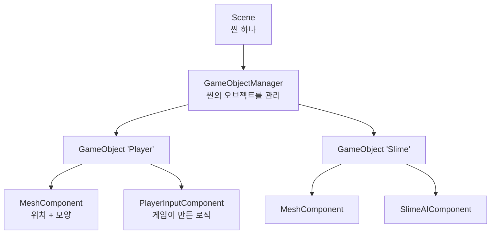
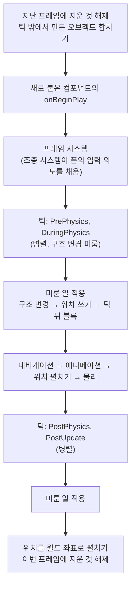

# Object — 게임 오브젝트와 컴포넌트

## 이것은 무엇이고 왜 있나

게임 화면에 보이는 것과 보이지 않는 것을 가리지 않고, 씬 안의 모든 물체는 **게임 오브젝트**(`GameObject`)입니다.
플레이어 캐릭터, 총알, 카메라, 조명이 모두 게임 오브젝트입니다. 게임 오브젝트 자체에는 이름, 태그, 켜짐 여부, 부모와 자식 관계만 있습니다.

물체가 실제로 무엇을 하는지는 게임 오브젝트에 붙이는 **컴포넌트**(`Component`)가 정합니다.
메시를 그리는 컴포넌트, 위치를 갖는 컴포넌트, 매 프레임 적을 쫓아가는 컴포넌트를 조합해 물체 하나를 만듭니다.
언리얼의 액터와 액터 컴포넌트, 유니티의 GameObject와 MonoBehaviour와 같은 구조입니다.

게임 로직을 짤 때 가장 자주 만지는 곳이 이 폴더입니다. 처음이라면 [시작하기](../../../docs/01_GettingStarted.md)의 "첫 게임 오브젝트"를 먼저 따라 해 보세요.
이 문서는 그다음 단계입니다. 실행 중에 오브젝트를 만들고 찾고 지우는 방법, 그리고 엔진이 왜 그런 규칙을 두는지를 설명합니다.

## 머릿속 그림


```mermaid
flowchart TD
  Scene["Scene<br/>씬 하나"] --> Manager["GameObjectManager<br/>씬의 오브젝트를 관리"]
  Manager --> Player["GameObject 'Player'"]
  Manager --> Enemy["GameObject 'Slime'"]
  Player --> P1["MeshComponent<br/>위치 + 모양"]
  Player --> P2["PlayerInputComponent<br/>게임이 만든 로직"]
  Enemy --> E1["MeshComponent"]
  Enemy --> E2["SlimeAIComponent"]
```

이 그림에서 기억할 개념은 네 가지입니다.

**게임 오브젝트 매니저.** 씬 하나에는 매니저(`GameObjectManager`)가 하나 있습니다.
오브젝트를 만들고, 찾고, 지우는 일은 모두 매니저를 거칩니다. 매 프레임 컴포넌트의 `onTick` 을 부르는 것도 매니저입니다.

**씬 컴포넌트.** 위치, 회전, 크기를 갖는 컴포넌트는 `SceneComponent` 와 그 파생 클래스뿐입니다. `MeshComponent`, `CameraComponent`, 조명 컴포넌트가 여기에 속합니다.
로직만 있는 컴포넌트는 위치가 없습니다. 오브젝트를 움직이려면 `getOwner()->getPrimarySceneComponent()` 로 대표 씬 컴포넌트를 찾아서 값을 씁니다.

**병렬 틱.** 엔진은 여러 오브젝트의 `onTick` 을 여러 스레드에서 동시에 실행합니다.
그래서 틱이 도는 동안에는 오브젝트를 만들거나 컴포넌트를 붙이는 것 같은 **구조 변경**을 바로 하지 않고, 틱이 끝난 뒤로 미룹니다.
이 문서의 규칙은 대부분 여기서 나옵니다.

**포인터와 핸들.** 오브젝트를 가리키는 방법은 두 가지입니다. 지금 함수 안에서 잠깐 쓸 때는 포인터(`GameObject*`)를 쓰고,
다음 프레임까지 보관해야 할 때는 핸들(`GameObjectHandle`)을 씁니다. 포인터는 대상이 지워지면 댕글링 포인터가 되지만, 핸들로 찾으면 `nullptr` 가 나옵니다.

## 따라 해 보기 — 적이 총알을 쏘게 만들기

시작하기의 도는 큐브를 조금 확장해 보겠습니다. 적 오브젝트가 1초마다 앞으로 날아가는 총알을 하나씩 쏘고, 총알은 3초 뒤에 사라지게 만듭니다.
이 과정에서 오브젝트 만들기, 틱 안에서 스폰하기, 핸들로 보관하기, 지우기를 모두 거칩니다.

### 1단계 — 총알 컴포넌트

총알은 매 프레임 앞으로 움직이고, 정해진 시간이 지나면 자기 오브젝트를 지웁니다.

<!-- snippet: BulletComponent 선언과 onTick — 5b U7 에서 Test/EngineTest/Object/TestObjectDocExamples.cpp 로 대조 -->
```cpp
REFLECT()
class BulletComponent : public Component
{
public:
    REFLECT_BODY();

    BulletComponent();
    virtual ~BulletComponent() override = default;

    void onTick( float32 deltaTime ) override;

private:
    PROPERTY()
    float32 _speed;    /**< 초당 이동 거리(m) */
    PROPERTY()
    float32 _lifeTime; /**< 남은 수명(초) */
};

BulletComponent::BulletComponent()
    : _speed{ 8.0f }
    , _lifeTime{ 3.0f }
{
}

void BulletComponent::onTick( float32 deltaTime )
{
    Component::onTick( deltaTime );

    GameObject* pOwner = getOwner();
    if ( pOwner == nullptr )
        return;

    _lifeTime -= deltaTime;
    if ( _lifeTime <= 0.0f )
    {
        pOwner->getManager()->destroyObject( pOwner ); // 바로 지우지 않고 이번 프레임 끝에 지운다
        return;
    }

    SceneComponent* pScene = pOwner->getPrimarySceneComponent();
    if ( pScene == nullptr )
        return;
    const float3 position = pScene->getLocalPosition();
    pScene->setLocalPosition( float3{ position._x, position._y, position._z + _speed * deltaTime } );
}
```

`onTick` 에서 자기 위치를 바꾸는 것은 언제나 안전합니다. 다만 바꾼 값은 이번 틱이 모두 끝난 뒤에 적용됩니다.
같은 틱 안에서 다른 오브젝트가 이 총알의 위치를 읽으면 틱이 시작될 때의 위치를 봅니다. 이유는 "작동 원리"에서 설명합니다.

`destroyObject` 도 틱 안에서 불러도 됩니다. 오브젝트는 바로 지워지지 않고 프레임 끝에 지워집니다.

### 2단계 — 틱 안에서 총알 만들기

적 컴포넌트는 1초마다 총알을 만듭니다. 여기가 처음 쓰는 사람이 가장 많이 실수하는 곳입니다.

<!-- snippet: ShooterComponent::onTick 의 executeOrDeferPostTick — 5b U7 에서 문서 예시 테스트로 대조 -->
```cpp
void ShooterComponent::onTick( float32 deltaTime )
{
    Component::onTick( deltaTime );

    _cooldown -= deltaTime;
    if ( _cooldown > 0.0f )
        return;
    _cooldown = 1.0f;

    GameObject*        pOwner   = getOwner();
    GameObjectManager* pManager = pOwner->getManager();
    const float3       muzzle   = pOwner->getPrimarySceneComponent()->getWorldPosition();

    // 틱 안이라 지금은 구조를 바꿀 수 없다. 만들고 설정하는 일을 한 블록으로 묶어 틱 뒤에 실행한다.
    pManager->executeOrDeferPostTick( [pManager, muzzle]()
    {
        GameObject* pBullet = pManager->createGameObject( hashed_string( "Bullet" ) );
        if ( pBullet == nullptr )
            return;
        MeshComponent* pMesh = pBullet->addComponent<MeshComponent>();
        if ( pMesh != nullptr )
        {
            pMesh->setMeshId( "Sphere" );
            pMesh->setLocalPosition( muzzle );
            pMesh->setLocalScale( float3{ 0.2f, 0.2f, 0.2f } );
        }
        pBullet->addComponent<BulletComponent>();
    } );
}
```

`executeOrDeferPostTick` 은 지금이 틱 중이면 블록을 틱이 끝난 뒤로 미루고, 틱 밖이면 바로 실행합니다.
블록 안에서는 구조 변경이 허용되므로 `addComponent` 가 만든 컴포넌트를 바로 돌려줍니다.

블록으로 묶지 않고 `onTick` 안에서 `addComponent` 를 직접 부르면 어떻게 될까요?
엔진은 그 호출을 틱 뒤로 미루고 `nullptr` 를 돌려줍니다. 그래서 다음처럼 쓰면 `nullptr` 를 역참조해서 크래시가 납니다.

```cpp
// 잘못된 예 — 틱 안에서는 pMesh 가 nullptr 이다
MeshComponent* pMesh = pBullet->addComponent<MeshComponent>();
pMesh->setMeshId( "Sphere" );
```

람다가 `pOwner` 같은 포인터 대신 `muzzle` 값을 복사해 가져간 점도 눈여겨보세요. 블록이 실행되는 시점에는 쏜 오브젝트가 이미 지워졌을 수도 있습니다.
쏜 오브젝트가 꼭 필요하면 포인터 대신 핸들(`getHandle()`)을 넘기고, 블록 안에서 `pManager->resolveGameObject( handle )` 로 다시 찾습니다.

### 3단계 — 핸들로 보관하기

적이 마지막으로 쏜 총알을 기억하고 싶다고 해 보겠습니다. 멤버에는 포인터가 아니라 핸들을 둡니다.

```cpp
// 멤버: GameObjectHandle _lastBullet;
_lastBullet = pBullet->getHandle();                              // 보관

GameObject* pLast = pManager->resolveGameObject( _lastBullet );  // 쓸 때마다 다시 찾는다
if ( pLast != nullptr )
{
    // 아직 살아 있다
}
```

총알은 3초 뒤에 스스로 지워집니다. 그 뒤에 포인터를 보관하고 있었다면 이미 해제된 메모리를 가리키게 됩니다.
핸들은 오브젝트 id로 찾기 때문에 대상이 사라지면 `nullptr` 가 나옵니다. 지워진 오브젝트의 id는 다시 쓰이지 않으므로, 엉뚱한 새 오브젝트를 찾을 일도 없습니다.

### 4단계 — 찾기

```cpp
GameObject* pBoss = pManager->findGameObjectByName( hashed_string( "Boss" ) );
GameObject* pHero = pManager->findGameObjectByTag( "Player"_tag );

pManager->forEachComponentOfType<BulletComponent>( []( BulletComponent* pBullet )
{
    // 씬의 모든 총알
} );
```

`forEachComponentOfType` 은 모든 오브젝트를 훑기 때문에 매 프레임 부르기에는 느립니다. 디버그 명령이나 가끔 하는 검사에만 쓰세요.
자주 찾아야 하는 대상은 처음 한 번 찾아서 핸들로 보관하거나, 아래 "등록이 필요한 컴포넌트"처럼 레지스트리에 등록받습니다.

## 작동 원리

### 한 프레임의 순서

매 프레임 매니저의 `tick` 이 아래 단계를 차례로 실행합니다. 이 순서는 `GameObject/SceneFrameStepList.xxx` 한 파일에 정의되어 있고, 줄 순서가 곧 실행 순서입니다.


```mermaid
flowchart TD
  A["지난 프레임에 지운 것 해제<br/>틱 밖에서 만든 오브젝트 합치기"] --> B["새로 붙은 컴포넌트의 onBeginPlay"]
  B --> S["프레임 시스템<br/>(조종 시스템이 폰의 입력 의도를 채움)"]
  S --> C["틱: PrePhysics, DuringPhysics<br/>(병렬, 구조 변경 미룸)"]
  C --> D["미룬 일 적용<br/>구조 변경 → 위치 쓰기 → 틱 뒤 블록"]
  D --> E["내비게이션 → 애니메이션 → 위치 펼치기 → 물리"]
  E --> F["틱: PostPhysics, PostUpdate<br/>(병렬)"]
  F --> G["미룬 일 적용"]
  G --> H["위치를 월드 좌표로 펼치기<br/>이번 프레임에 지운 것 해제"]
```

컴포넌트의 틱 그룹(`TickGroup`)은 물리 앞의 두 그룹과 물리 뒤의 두 그룹으로 나뉩니다. 이 차이가 중요합니다.

| 틱 그룹 | 물리 결과 | 이런 일에 쓴다 |
|---|---|---|
| `PrePhysics` | 지난 프레임 결과를 본다 | 입력 처리, 이번 프레임에 물리가 쓸 값 넣기 |
| `DuringPhysics` (기본값) | 지난 프레임 결과를 본다 | 일반 게임 로직 |
| `PostPhysics` | 이번 프레임 결과를 본다 | 충돌 결과에 반응하기 |
| `PostUpdate` | 이번 프레임 결과를 본다 | 카메라, 다른 오브젝트를 따라가는 UI처럼 마지막에 둘 것 |

틱 그룹은 보통 `onBeginPlay` 에서 `setTickGroup( TickGroup::PostUpdate )` 처럼 정합니다.
애니메이션과 물리는 두 틱 단계 사이에서 돕니다. 그래서 앞의 두 그룹에서 쓴 애니메이터 파라미터와 위치는 같은 프레임의 포즈와 물리에 반영되고,
`PostPhysics` 이후에 쓴 값은 다음 프레임에 반영됩니다(`PhysicsComponentTest.PostPhysicsTickSeesThisFramesBodyPose`).

프레임 시스템(`ISceneFrameSystem`)은 컴포넌트가 아니라 씬 전체를 한 번에 처리하는 객체입니다. `GameObjectManager::addFrameSystem` 으로 붙이고, 붙인 순서대로 게임 스레드에서 돕니다.
GameFramework의 `ControlSystem` 이 이 단계에서 모든 폰의 이번 프레임 입력 의도를 채웁니다.

### 틱 중에 구조 변경을 미루는 이유

같은 틱 그룹의 `onTick` 들은 여러 워커 스레드에서 동시에 돕니다. 이때 한 스레드가 오브젝트 목록에 새 오브젝트를 넣으면,
목록을 순회하던 다른 스레드가 해제된 메모리를 읽을 수 있습니다. 잠금을 걸면 안전하지만 모든 틱이 그 잠금을 기다리느라 병렬로 도는 의미가 없어집니다.

그래서 엔진은 틱이 도는 동안 구조를 **동결**합니다. 동결 중에 들어온 구조 변경은 큐에 쌓였다가 틱이 끝난 직후 부른 순서대로 실행됩니다.
언리얼에는 이런 제한이 없고, 유니티 DOTS의 EntityCommandBuffer가 같은 방식입니다.

| 틱 안에서 부르면 | 결과 |
|---|---|
| `createGameObject`, `addComponent` | 틱 뒤로 미루고 `nullptr` 를 돌려줍니다. |
| `attachToParent`, `detachFromParent` | 틱 뒤로 미룹니다. 같은 틱 안에서는 아직 붙어 있지 않습니다. |
| `addTag`, `removeTag` | 틱 뒤로 미룹니다. 같은 틱 안의 태그 검색에는 아직 보이지 않습니다. |
| `destroyObject`, `removeComponent` | 지울 목록에 넣고 프레임 끝에 해제합니다. |
| `setLocalPosition` 같은 위치 세터 | 값을 모아 두었다가 틱이 끝나면 적용합니다. |
| `ObjectStateSerializer` 의 상태 읽기 | 거절하고 오류를 남깁니다. |

상태 읽기는 컴포넌트를 모두 다시 만드는 일이라 미룰 수도 없습니다. 틱 뒤 블록 안에서 부릅니다.
지금 동결 중인지는 `pManager->isStructuralMutationFrozen()` 로 확인할 수 있습니다.

틱이 끝난 뒤 미룬 일을 적용하는 순서는 `StructuralChangeBuffer::drain` 한 함수가 정합니다.
동결을 풀고, 구조 변경을 부른 순서대로 실행하고, 틱 중의 위치 쓰기를 적용하고, 틱 뒤 블록(`deferPostTick`, `executeOrDeferPostTick`)을 실행합니다.
그다음 틱 밖에서 만든 오브젝트를 합치고(`mergePendingAdds`) 새로 붙은 컴포넌트를 시작합니다. 지울 목록은 그 뒤에 처리합니다.

### 위치 쓰기가 틱 뒤에 보이는 이유

위치 값은 컴포넌트 안이 아니라 씬 전체가 함께 쓰는 연속 배열(`SceneTransformStorage`)에 들어 있습니다.
컴포넌트는 그 배열의 슬롯 번호만 보관합니다. 틱이 끝난 뒤 이 배열을 한 번에 읽어 월드 행렬을 계산해야 캐시 효율이 좋기 때문입니다.

틱 중에 자기 오브젝트의 위치를 쓰면 대기 영역에 적어 두고, 다른 오브젝트의 위치를 쓰면 쓰기 큐에 넣습니다(`SceneComponent::queueTickWrite`).
틱이 끝나면 한꺼번에 적용합니다. 쓰기 큐는 대상, 쓴 오브젝트 id, 순번으로 정렬해서 적용하므로 결과가 스레드 배정에 따라 달라지지 않습니다.
그래서 같은 틱 안에서 **다른 오브젝트가** 읽는 위치는 틱이 시작될 때의 값입니다.
이 규칙 덕분에 잠금 없이 병렬로 돌 수 있습니다.

어떤 오브젝트가 다른 오브젝트의 **이번 프레임** 위치를 꼭 봐야 한다면(예: 움직이는 차에 탄 사람), 서브틱 선행 조건을 등록합니다.

```cpp
// 탄 사람의 서브틱이 차의 틱이 끝난 뒤에 돌도록 한다
const SubTickHandle rideTick = registerSubTick( TickGroup::DuringPhysics, kRideSubTick );
addSubTickPrerequisite( kRideSubTick, pVehicleComponent->getTickHandle() );
```

선행 조건이 등록된 서브틱은 대상의 틱이 끝나고 그 위치가 적용된 뒤에 실행됩니다(`SceneTickScheduler::applyStageTransforms`).
선행 조건은 그 사슬에만 순서를 만들고, 나머지 오브젝트는 그대로 병렬로 돕니다. 언리얼의 `AddTickPrerequisiteComponent` 와 같은 기능입니다.

### 컴포넌트 수명

| 콜백 | 언제 불리나 | 여기서 할 일 |
|---|---|---|
| `onPostLoad` | 씬이나 프리팹에서 값을 읽은 직후 | 저장된 값을 실제 자원으로 바꾸기 |
| `onBeginPlay` | 플레이 시작 때 한 번 | 틱 그룹 정하기, 실행 중에만 필요한 상태 만들기 |
| `onTick` | 켜져 있는 동안 매 프레임 | 게임 로직 |
| `onEndPlay` | 플레이가 끝나거나 컴포넌트가 지워질 때 한 번 | 정리 |

`onPostLoad` 는 에디터에서 편집 중일 때도 불립니다. 플레이 중에 붙은 컴포넌트의 `onBeginPlay` 는 다음 프레임의 틱 전에 불립니다.
`onEndPlay` 는 `onBeginPlay` 가 불린 컴포넌트에만 불립니다. 컴포넌트마다 "시작됨" 비트가 있어서 시작과 끝을 한 번씩 짝지어 부릅니다.
에디터 없이 실행하면 App이 처음부터 월드를 플레이 상태로 켭니다(`SceneManager::setWorldPlaying`). 에디터에서는 Play를 눌러야 플레이가 시작됩니다.

`onTick` 을 오버라이드하지 않은 컴포넌트는 틱 목록에 들어가지 않습니다(`HasOnTickOverride_v`). 틱이 필요 없는 컴포넌트가 프레임 비용을 쓰지 않게 하기 위해서입니다.

핫 리로드나 되돌리기로 컴포넌트가 다시 만들어지면 그것은 새 인스턴스이므로 `onBeginPlay` 가 다시 불립니다.
메시 로드처럼 편집 중에도 필요한 일을 `onBeginPlay` 에 두면, 에디터에서 되돌리기를 했을 때 메시가 사라집니다. 그런 일은 `onPostLoad` 에 둡니다.

## 확장하는 법

### 새 컴포넌트 만들기

1. `Component` 나 `SceneComponent` 를 상속하고 `REFLECT()` 와 `REFLECT_BODY()` 를 붙입니다. 저장할 멤버에는 `PROPERTY()` 를 붙입니다.
   `REFLECT_BODY()` 는 멤버가 없는 파생 클래스에도 꼭 필요합니다. 없으면 컴파일 오류가 납니다.
2. 그 헤더에 처음으로 `REFLECT` 를 넣었다면 `cmake --preset <프리셋>` 을 다시 실행합니다. 리플렉션 대상 헤더 목록은 CMake 구성 단계에서 만들기 때문입니다.
3. 위치가 필요하면 `SceneComponent` 를 상속하고, 아니면 `Component` 를 상속한 뒤 같은 오브젝트의 씬 컴포넌트를 씁니다.

이제 씬 파일에서 이름으로 이 컴포넌트를 만들 수 있고, 핫 리로드 때 `PROPERTY` 값이 보존됩니다.
이름으로 컴포넌트를 만드는 경로는 `TypeInfo::_addComponent` 하나뿐입니다. 별도의 팩토리 테이블은 없고, 코드 생성기가 구체 컴포넌트마다 이 필드를 채웁니다.
언리얼의 `UClass` 와 같은 방식입니다. 테스트에서 손으로 만든 `TypeInfo` 도 이 필드를 채워야 `addComponentByName` 과 씬 로드가 그 타입을 만들 수 있습니다.

### 등록이 필요한 컴포넌트

조명이나 카메라처럼 엔진이 따로 목록을 관리해야 하는 컴포넌트는 `onRegister` 에서 스스로 레지스트리에 등록하고 `onUnregister` 에서 해제합니다.
게임 오브젝트가 타입을 보고 대신 등록해 주지 않습니다.

"이 타입의 컴포넌트를 모두" 가 필요한 기능은 `GameObjectManager::getComponentRegistry()` 의 `add<T>` 와 `getAll<T>` 를 씁니다.
매 프레임 씬을 훑어 찾는 대신 컴포넌트가 붙을 때 등록받으므로, 비용이 씬의 오브젝트 수가 아니라 그 타입의 수에 비례합니다.
언리얼에서 `TObjectIterator` 대신 서브시스템이 등록받은 목록을 쓰는 것과 같습니다. 측정값과 규약은 `GameObject/ComponentRegistry.h` 의 파일 주석에 있습니다.
카메라는 `CameraRegistry`, 그릴 수 있는 것은 `PrimitiveRegistry` 에 따로 등록합니다.

### 프레임에 새 단계 넣기

씬 전체를 한 번에 처리하는 시스템(애니메이션, 물리 동기화 같은)을 프레임 순서에 끼우려면 다음 순서로 합니다.

1. 상태를 가진 시스템 타입을 하나 만들고, 매니저가 소유하게 합니다.
2. 병렬로 처리할 부분은 `engine::runParallel( 개수, 최소 배치 크기, 본문 )` 한 줄로 씁니다(`Engine/Common/EngineParallel.h`).
   작업 중에 임시 버퍼가 필요하면 `engine::getParallelScratchSlot()` 으로 스레드마다 하나씩 받아 씁니다. 작업마다 새로 할당하면 프레임마다 힙 할당이 쌓입니다.
3. `SceneFrameStepList.xxx` 에 단계 한 줄을 넣고, 매니저에 `runFrameStep<단계 이름>` 함수를 만듭니다. 함수가 없으면 컴파일 오류가 납니다.

씬의 위치 갱신(`SceneTransformHierarchy`)이 이 구조의 첫 예입니다.
엔진 바깥의 모듈이 단계를 더하려면 `ISceneFrameSystem` 을 구현해 `addFrameSystem` 으로 붙입니다. 이 경우 실행 위치는 "프레임 시스템" 단계로 정해져 있습니다.

## 함정과 주의

### 틱과 구조 변경

**틱 안에서 `addComponent` 의 반환값을 바로 쓰지 마세요.** 틱 중에는 `nullptr` 가 돌아옵니다. 만들고 설정하는 일은 `executeOrDeferPostTick` 블록으로 묶습니다.
테스트에서 미뤄졌는지 확인하려면 틱 **안에서** 본 값을 목 훅으로 기록합니다. 틱이 끝난 뒤의 `getComponentCount` 로는 미룬 것과 해제된 것을 구별할 수 없습니다.

**틱 안에서 `attachToParent` 한 결과를 같은 틱에서 기대하지 마세요.** 붙이는 일은 틱 뒤로 미뤄집니다.
같은 틱에서 위치를 쓰고 부모를 바꿨다면, 부모 변경이 먼저 적용되고 위치 쓰기가 나중에 적용됩니다. 순서가 중요하면 둘 다 틱 뒤 블록에서 하세요.
서브틱 선행 조건의 경계에서도 같습니다. 그 단계에 미룬 부착(`deferHierarchyChange`)이 있으면 위치 쓰기를 앞당겨 적용하지 않습니다.
앞당기면 먼저 적용된 쓰기를 `KeepWorld` 부착이 덮어씁니다.

**이름, 틱 설정, 서브틱, 태그를 바꾸는 세터도 틱 중에는 미뤄집니다.** 모두 `Component::deferIfStructureFrozen` 을 거쳐 구조 변경 큐로 갑니다.
게임 쪽 `deferPostTick` 블록은 이 큐보다 뒤에 실행됩니다.

**미룬 일을 큐마다 따로 비우게 나누지 마세요.** 적용 순서는 `StructuralChangeBuffer::drain` 한 곳이 정합니다. 큐가 제각각 비우면 구조 변경과 위치 쓰기의 순서가 프레임마다 달라집니다.

**`forEachGameObject` 콜백 안에서 오브젝트를 만들거나 지우거나 이름을 바꾸지 마세요.** 순회는 `shared_mutex` 를 잡고 있고, 이 잠금은 재진입하지 않아 교착이 납니다.
Debug 빌드에서는 `WalkScope` 가 단언으로 잡습니다. 그런 일이 필요하면 `getAllGameObjects( out )` 로 목록을 복사해서 돕니다.
컴포넌트 목록을 범위 for로 도는 중에 컴포넌트를 붙여도 반복자가 무효가 됩니다. 이때는 인덱스로 돕니다.
콜백이 형제 오브젝트를 지울 수 있다면 핸들로 모은 다음 매번 다시 찾습니다.

**`tick()` 에서 `TaskManager::waitAll()` 을 부르지 마세요.** 렌더 기록, 스트리밍, 오디오 작업까지 기다리게 됩니다. 자기가 띄운 작업은 `waitStage` 로 기다립니다.

**소멸자에서 미루는 경로를 타지 마세요.** 소멸자가 끝나면 큐에 넣은 일이 해제된 객체를 가리킵니다. `~SceneComponent` 는 그래서 `detachFromParentImmediate()` 를 부릅니다.

### 위치와 부착

**월드 행렬을 계산하는 경로를 새로 만들지 마세요.** 월드 합성은 `updateWorldTransformFromParent` 한 곳이고, 렌더 쪽 더티 표시는 `onWorldTransformUpdated` 한 곳에서만 합니다.
다른 경로로 월드 값을 바꾸면 렌더러가 변화를 모르고 메시가 화면에서 멈춰 보입니다.

**한 오브젝트의 두 번째 씬 컴포넌트는 첫 씬 컴포넌트 아래에 붙습니다.** 오브젝트의 루트 씬 컴포넌트는 하나이고, 저장하면 `_attachComponent="CameraComponent#0"` 처럼 남습니다.
카메라와 같은 오브젝트에 있는 뷰 모델이나 조준선은 카메라 기준 로컬 좌표로 다룹니다. 월드 좌표를 `setLocalPosition` 에 넣으면 카메라 위치만큼 두 번 밀립니다(`FirstPersonCameraComponent`).

**부착할 수 있는지는 미루기 전에 묻습니다.** `canAttachTo` 는 다른 매니저의 부모, 소켓을 거친 순환, 파괴 대기 중인 부모를 거절합니다.
틱 뒤로 미룬 다음에 실패하면 부른 쪽이 결과를 알 수 없기 때문입니다. 부착 규칙은 `AttachRule::KeepRelative` 와 `KeepWorld` 두 가지입니다.

**`transformVector` 를 법선에 쓰지 마세요.** 이 함수는 방향 벡터(w=0)를 변환합니다. 비균등 스케일이 있으면 법선이 기울어집니다.
법선은 `invert().transpose()` 행렬로 변환하고, 셰이더에서는 `swComputeWorldNormal` 을 씁니다.

**"바뀌었나" 검사는 제곱 거리를 `MathUtil::kEpsilonSquared` 와 비교합니다.** 거리 자체를 `kEpsilon` 과 비교하면 프레임당 1e-3보다 작은 움직임이 계속 무시됩니다.
예외는 `GpuSceneBuilder` 의 카메라 비교(`bCamSame`)입니다. 이 비교는 제곱 거리를 일부러 `kEpsilon` 과 비교해서, 아주 작은 카메라 움직임에는 드로우 목록을 다시 만들지 않습니다.
`float4x4::invert` 는 행렬식이 정확히 0이거나 NaN일 때만 단위 행렬을 돌려줍니다. 절대 임계값을 두면 아주 작은 부모나 큰 직교 카메라의 행렬이 깨집니다.

### 수명과 활성

**오브젝트 `setActive` 가 컴포넌트의 활성 비트를 복사하게 만들지 마세요.** `Component::isActive` 는 소유자의 계층 활성을 이미 포함합니다.
활성 변화는 `onOwnerActiveInHierarchyChanged` 로 알립니다. 계층 활성 재계산은 값이 그대로면 멈추므로, 부모가 바뀌는 모든 곳에서 그 자리에서 다시 맞춥니다.
`TickRegistry` 의 목록에 들어 있는지가 곧 활성 여부입니다.

**플레이 중 다시 읽는 진행 상태는 저장하세요.** 플레이 중에 상태를 다시 읽으면 `onBeginPlay` 가 다시 불립니다.
흐른 시간이나 이미 적용한 오프셋 같은 진행 상태를 저장하지 않으면 `onBeginPlay` 가 그 값을 처음으로 되돌립니다.
`SceneManager::markPersistent` 로 씬 전환 너머로 가져간 오브젝트도 같은 id로 **다시 만든** 것이라 `onBeginPlay` 를 다시 받습니다.

**경로 프로퍼티로 에셋을 여는 컴포넌트는 `onBeginPlay` 에만 의존하지 마세요.** 상태 읽기는 `onPostLoad` 만 부르고, 플레이 전이면 `onBeginPlay` 가 오지 않습니다.
`onPostLoad` 와 그 경로의 `onPropertyChanged` 양쪽에서 엽니다(`SequencePlayerComponent`, `DialogueRunnerComponent`).
`onPostLoad` 는 `ObjectStateBatch::finish` 가 이름, 부착, 핸들을 모두 찾은 뒤에 부릅니다. 언리얼의 PostLoad와 같은 순서입니다.
비동기 씬 로드에서는 `onPostLoad` 가 워커 스레드에서 불리므로, 거기서 쓰는 API는 잠금이 필요합니다.

**기본값은 만들 때 한 번만 적용합니다.** 언리얼의 CDO와 같은 역할을 `DefaultPatch` 가 합니다. 모듈 등록이나 리로드에서 살아 있는 컴포넌트에 기본값을 다시 쓰면 편집한 값이 사라집니다.
`ComponentDefaults` 의 기본값 파일은 없어도 됩니다. 한 번 열기를 시도했는지만 기억합니다.

**`markPendingDestroy()` 만으로는 오브젝트가 지워지지 않습니다.** 이 함수는 표시만 하고, 파괴 목록에 넣는 것은 `destroyObject` 입니다.
여러 스레드가 동시에 지우려 하면 `tryMarkPendingDestroy()` 가 true를 돌려준 스레드 하나만 진행합니다. 이름은 살아 있는 오브젝트만 차지합니다(`isNameTakenUnlocked`).

**컴포넌트를 없애는 경로를 새로 만들지 마세요.** 해체는 `destroyComponentInstance` 한 곳이고, `removeComponent` 는 나머지 순서를 지킵니다.
마지막 원소와 바꿔 지우면 안 됩니다. 첫 번째로 일치하는 컴포넌트, 대표 씬 컴포넌트, 안정 키가 모두 순서에 의존하기 때문입니다.

**컴포넌트 이름(`_componentName`)을 조회 키로 쓰지 마세요.** 이름은 런타임 레이블일 뿐입니다. 컴포넌트는 자기가 나온 풀(`_pPool`)과 타입(`_pTypeInfo`)을 보관하고, 풀의 키는 정규 이름(FQN)입니다.
이름을 키로 쓰면 Shipping에서만 힙이 깨지는 문제가 생깁니다. 컴포넌트는 풀 안에서 제자리에 생성되므로 이동 연산을 만들지 않습니다.

### 참조와 저장

**프레임을 넘겨 보관하는 것은 핸들로 보관하세요.** 지금 호출과 이번 프레임 안에서는 포인터를 빌려 씁니다.
그보다 오래 보관할 때는 `GameObjectHandle` 이나 `ComponentHandle` 을 두고 쓸 때마다 `resolve*` 로 찾습니다.
핫 리로드나 그래픽 API 교체가 일어나면 엔진은 씬을 통째로 지우고 저장한 상태로 다시 만듭니다. 이때 포인터는 모두 해제된 주소가 됩니다.
핸들은 다시 만든 오브젝트에 같은 id가 복원되므로 그대로 이어집니다. 게임 모듈이 컴포넌트를 생포인터로 보관하면 안 되는 이유입니다.
핸들은 그 핸들을 만든 씬의 매니저에서만 대상을 찾을 수 있습니다.

**오브젝트 id가 연속이라고 가정하지 마세요.** 오브젝트 id는 프로세스 전체에서 하나로 셉니다. 테스트에서 "다음 id는 +1"을 가정하면 다른 테스트 순서에서 깨집니다.
id를 보존하며 다시 만들 때는 `createGameObjectWithId` 를 쓰고, 컴포넌트 id는 `onRegister` **전에** `ComponentIdRestoreScope` 로 지정합니다. 다른 프로세스에서 저장한 id는 버립니다.

**이름으로 다른 오브젝트를 가리키는 값을 저장하지 마세요.** 매니저는 같은 이름이 생기면 `Rig_2` 처럼 이름을 바꿉니다.
그래서 이름으로 찾으면 복제한 오브젝트가 원본을 가리키는 식의 오류가 생깁니다. 다른 오브젝트를 가리키는 `PROPERTY` 는 `GameObjectHandle` 로 두면 파일 id로 저장되고, 로드한 뒤에도 이어집니다.
씬 파일의 파일 id와 부모 참조를 저장하는 방식은 [Scene](../Scene/README.md)의 "저장과 로드"에 있습니다.

**상태를 읽는 새 경로를 만들면 `ObjectStateBatch` 를 거치게 하세요.** 씬 로드, 쿠커, 되돌리기, 핫 리로드, 세이브 같은 상태 읽기는 모두 이 배치를 지납니다.
`ObjectLoadContext` 에 배치와 저장된 id를 주고, 다 읽은 뒤 `finish()` 를 부릅니다. 빠뜨리면 Debug 빌드에서 단언이 납니다.
`finish()` 가 이름 찾기와 부착을 한 번에 하므로 자식이 부모보다 먼저 읽혀도 됩니다.

**핸들 `PROPERTY` 의 직렬화 처리기를 텍스트용만 바꾸지 마세요.** `GameObjectHandle` 은 내장 타입이라 기본 바이너리 처리기가 있습니다.
텍스트 처리기만 바꾸면 XML에는 파일 id가 맞게 들어가지만, 쿠킹한 씬과 세이브 같은 바이너리에는 런타임 id가 들어갑니다.
`ObjectStateSerializer` 가 두 처리기를 함께 교체합니다(`ActionCombatTest.ObjectReferencesSurviveBinaryFileState`).

**값을 직렬화기로 직접 썼다면 컴포넌트에 알려 주세요.** 직렬화기와 `SerializerUtil` 은 값만 쓰고 후속 처리를 하지 않습니다.
그래서 위치는 갱신되지 않고 메시도 다시 로드되지 않습니다. 상태 전체를 썼다면 `notifyStateWritten()`, 프로퍼티 하나를 썼다면 `onPropertyChanged( 이름 )` 을 부릅니다.
값 하나를 복사하고 비교하는 일은 `SerializerUtil` 의 함수를 씁니다. 따로 바이트 단위로 비교하면 비트필드의 이웃 플래그까지 바뀐 것으로 보입니다.

**자원을 다시 만들지는 "무엇으로 만들었는지" 와 비교해서 정하세요.** `MeshComponent` 는 `_resolvedMeshId` 와 `_acquiredMaterialPath` 를 보관합니다.
"이미 있으면 그대로" 로 판단하면 id를 바꿔도 예전 메시가 남습니다.

### 찾기와 레지스트리

**프레임 경로에서 `forEachComponentOfType` 이나 `getAllGameObjects()` 값 반환을 쓰지 마세요.** 둘 다 모든 오브젝트를 훑습니다.
상호작용 대상 찾기가 이 방식이었을 때 Release 오브젝트 10,000개 씬에서 틱이 약 200µs 늘었고, 레지스트리로 바꾸자 2~6µs가 되었습니다(`InteractionBenchTest`).
"그 타입 모두" 는 `ComponentRegistry` 에서 찾습니다. 레지스트리에는 파괴 예약된 컴포넌트도 플러시 전까지 남아 있으므로 찾는 쪽이 `isPendingDestroy` 를 건너뜁니다.
`getAllGameObjects()` 값 반환은 에디터 명령처럼 이벤트로 한 번 도는 곳에서만 쓰고, 그 밖에는 `getAllGameObjects( out )` 이나 `forEachGameObject` 를 씁니다.

**광원과 카메라는 찾지 말고 레지스트리에서 받으세요.** 매 프레임 씬을 훑던 주 광원 조회가 게임 스레드 시간의 38%를 차지한 적이 있습니다.
광원은 `ComponentRegistry` 에 종류별 채널로 등록하고, 그림자를 드리우는 광원은 `Scene::findShadowCastingDirectionalLight` 로 얻습니다.
카메라는 `CameraRegistry::selectCamera` 가 역할과 우선순위로 고르고, 동률이면 컴포넌트 id로 정합니다. 등록 순서로 정하면 되돌리기를 할 때마다 선택이 뒤집힙니다.
`PrimitiveRegistry` 에는 그릴 수 있는 것만 넣습니다.

**같은 역할과 우선순위의 카메라를 둘 두지 마세요.** 씬에 카메라가 없으면 엔진이 기본 `GameCamera` 오브젝트를 만듭니다(`Scene::ensureDefaultCameras`).
자기 카메라를 가진 씬(1인칭 플레이어 등)을 `createEmptyActiveScene` 으로 만들어 저장할 때는 이 오브젝트를 먼저 지웁니다.
둘이 남으면 어느 쪽이 활성일지가 등록 순서에 달립니다.

**태그 컨테이너를 `const_cast` 로 고치지 마세요.** 태그가 없는 오브젝트의 `getTags()` 는 공용 빈 상수를 돌려줍니다. 이것을 고치면 모든 오브젝트가 그 태그를 갖게 됩니다.
태그 id는 리터럴(`"Player"_tag`)과 런타임 문자열(`TagID::request`) 모두 `TagID::computeId` 로 만듭니다. `Faction` 과 `Faction.Player` 같은 계층 비교에는 문자열도 필요합니다.

### 틱 선언과 순서

**서브틱 선행 조건은 등록이 돌려준 핸들로 등록하세요.** 소유 오브젝트 id가 없는 손수 만든 핸들은 거절됩니다.
다른 그룹의 선행 조건이 있으면 뒤따르는 쪽을 그 그룹으로 옮깁니다. 우선순위는 `kMaxTickPriority`(63)까지입니다. `TickPhase` 는 한 오브젝트 안의 순서만 정합니다.

선행 조건이 있는 서브틱만 별도 스테이지로 갑니다. 나머지 틱은 씬에 선행 조건이 있어도 그대로 병렬로 돕니다.
선행 조건 하나 때문에 모든 틱을 스테이지로 나누면 무버 8,000개 씬에서 틱이 몇 배 느려졌기 때문입니다.

### 그 밖

**게임 코드에서는 `engine::` 서비스 대신 `game::getService<T>()` 를 쓰세요.** 게임 모듈이 엔진 서비스 헤더를 include하면 계층 검사(`CheckEngineLayers.py`)가 막습니다.

```cpp
#include "GameFramework/Base/Foundation/Framework/GameService.h"

GameObject* pBullet = game::getService<AssetManager>()->getPrefabCache().spawn(
    pManager, "game/<팩>/prefabs/bullet.prefab.json", "Bullet" );
```

틱 중에 `spawn` 하면 오브젝트는 바로 돌아오지만 프리팹 상태는 틱 뒤에 채워집니다. 바로 초기화해야 하면 `executeOrDeferPostTick` 으로 감쌉니다.

**프리팹 오버라이드는 키(`이름#n`)로 프리팹 컴포넌트를 가리킵니다.** 인스턴스에 더한 컴포넌트는 `<Add after>` 로 위치를 기억합니다.
프리팹에서 사라진 컴포넌트의 오버라이드는 오브젝트 이름과 함께 경고하고 버립니다. 언리얼과 같고, 유니티는 남겨 둡니다.
물려받은 컴포넌트의 이름을 바꾸면 제거와 추가로 기록되어 이후 프리팹 수정이 닿지 않습니다. 그래서 에디터에는 이름 편집 UI가 없습니다(`_componentName` 은 `HideInInspector`).
프리팹 원형 상태는 별도의 `GameObjectManager` 에서 만듭니다. 테스트에서 한 매니저에만 `registerComponentType` 한 목 타입은 원형에서 `MissingComponent` 가 되므로 실제 타입을 씁니다.
원형은 `forEachGameObject` 안에서 만들 수 없으므로 순회 전에 만듭니다.

**`MeshInstanceBatch` 는 항목 수, 메시, 머티리얼이 고정입니다.** 언리얼의 ISM과 같습니다.
항목 수를 늘리려면 다시 만들고, 항목마다 다른 머티리얼이나 투명 정렬이 필요하면 `MeshComponent` 를 씁니다.

**시퀀서의 "지나갔는가" 판정은 `previousFrame < start <= frame` 입니다.** 이전 프레임이 없다는 값은 `kNoPreviousFrame`(INT32_MIN)입니다. -1을 쓰면 시작 프레임 0과 겹칩니다.
프레임 번호는 배정밀도로 곱하고 천분의 일을 더해 자릅니다. 반복 재생 시간은 한 바퀴 안으로 되감습니다. float32는 10^6초 근처에서 0.016을 더해도 값이 바뀌지 않기 때문입니다.

## 더 볼 곳

- [시작하기](../../../docs/01_GettingStarted.md) — 도는 큐브 예제
- [Scene](../Scene/README.md) — 씬 파일, 씬 로드, 씬 전환
- [Reflection](../Reflection/README.md) — `REFLECT`, `PROPERTY` 가 하는 일
- [Games](../../Games/README.md) — 게임 하나를 씬, 프리팹, 디렉터 컴포넌트로 나누는 방법
- [Component/2D](Component/2D/README.md) — 2D 스프라이트와 콜라이더

자주 여는 파일은 다음과 같습니다. 각 함수의 자세한 규칙은 헤더 주석에 있습니다.

| 파일 | 내용 |
|---|---|
| `GameObject/GameObjectManager.h` | 만들기, 찾기, 지우기, 틱 뒤 블록 |
| `GameObject/GameObject.h` | 컴포넌트 붙이기와 찾기, 태그, 부모와 자식 |
| `Component/Component.h` | 수명 콜백, 틱 그룹, 서브틱 |
| `Component/SceneComponent.h` | 위치, 회전, 크기, 부착 |
| `GameObject/SceneFrameStepList.xxx` | 한 프레임의 단계 순서 |
| `GameObject/ComponentRegistry.h` | 타입별 컴포넌트 레지스트리 |
| `Prefab/PrefabAsset.h` | 프리팹 저장과 스폰 |
