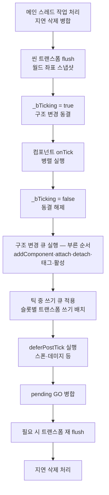
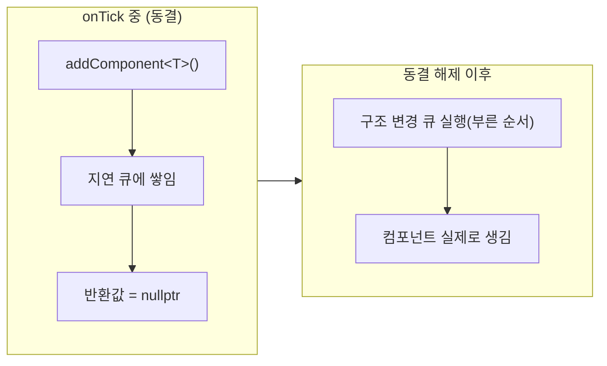
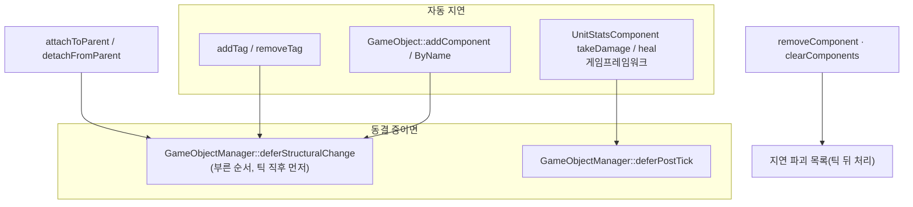

# Object (게임 오브젝트 · 컴포넌트)

씬에 올라가는 **배우(GameObject)** 와 그에 붙는 **기능 조각(Component)** 을 다루는 레이어입니다.  
게임 로직을 처음 짤 때 가장 자주 만지는 곳이기도 합니다.

관련 상위 문서: [엔진 개요](../README.md) · [Reflection](../Reflection/README.md) · [아키텍처 / Gotchas](../../../ARCHITECTURE.md)

---

## 한 줄로 이해하기

| 개념 | 역할 |
|------|------|
| **GameObject** | 이름·태그·수명을 가진 “상자”. 로직은 거의 없고 컴포넌트를 붙입니다. |
| **Component** | `onBeginPlay` / `onTick` / `onEndPlay` 로 동작하는 실제 기능. |
| **GameObjectManager** | 한 씬 안의 GO 생성·검색·틱·지연 삭제. |
| **Tag** | `"Player"`, `"Bullet"` 같은 표식. 검색·필터에 사용. |

```text
Scene
 └─ GameObjectManager
     ├─ GameObject "Player"
     │    ├─ SceneComponent      (위치·계층)
     │    ├─ (게임의 컴포넌트)   (입력·이동 — 게임 모듈이 정의)
     │    └─ UnitStatsComponent  (HP 등 스탯 데이터 — GameFramework ActionCombat 킷)
     └─ GameObject "Slime"
          ├─ SceneComponent
          └─ (게임의 AI 컴포넌트)
```

---

## 폴더 구조

```text
Object/
├─ GameObject/          # GO, Manager, 직렬화 (참조 핸들 타입은 Core/Container 의 GameObjectHandle · ComponentHandle)
│  ├─ GameObject.*              # 액터 — 컴포넌트 목록 · 태그 · 활성 · 계층. 매니저 헤더를 포함하지 **않는다**
│  ├─ GameObjectManager.h
│  ├─ GameObjectManager.cpp     # 수명: 생성 · 이름 · id 표 · 조회 · 파괴 · 이름으로 컴포넌트 만들기(TypeInfo 의 생성 함수)
│  ├─ GameObjectManagerTick.cpp # 프레임: tick 의 단계 · 병렬 틱 디스패치 · 트랜스폼 배치/큐 · 지연 큐
│  ├─ TickRegistry.*            # 틱 등록부 — 오브젝트별 항목 · 그룹 목록 · 선행 종속성 스테이지
│  ├─ DeferredDelegateQueue.*   # 틱이 미룬 일(계층 변경 · 틱 뒤 작업)의 큐 — 넣기는 아무 스레드, 비우기는 게임 스레드
│  ├─ PrimitiveRegistry.* · LightRegistry.*  # 빛 등록부는 종류(방향광 · 점광 · 스포트)마다 칸 하나
│  ├─ CameraRegistry.*          # 카메라 등록부 + 역할 · 우선순위 선택 규칙 하나(게임 · 에디터 카메라가 같이 쓴다)
│  ├─ MeshInstanceBatch.* · SpriteInstanceBatch.*  # 컴포넌트 없이 인스턴스 N 개를 드는 렌더 프리미티브(PrimitiveRegistry 에 등록)
│  ├─ ObjectStateSerializer.*
│  └─ ObjectValidation.*        # 컴포넌트의 리플렉션 검증 함수(`Validate = fn`)를 돌려 ValidationIssueLog 에 둔다 — 로드(묶음 끝) · 글 저장 · 인스펙터 편집
├─ Component/           # 기반 Component + 엔진 기본 컴포넌트
│  ├─ Component.h
│  ├─ SceneComponent.*  # 트랜스폼·부모/자식 (값은 아래 저장소의 칸에 있다)
│  ├─ SceneTransformStorage.*  # 전역 트랜스폼 칸 — 로컬 TRS · 월드 행렬 · LWC 가 값마다 연속 배열(페이지 256 칸)
│  ├─ SceneTransformHierarchy.*  # 씬마다: 더티 루트 · 플러시 · 틱 중 쓰기(대기 칸 목록 · 쓰기 큐)
│  ├─ ComponentStableKey.*  # `이름(없으면 타입)#n` 키 — 씬 파일의 부착 대상과 에디터 선택 복원이 같은 키
│  ├─ TagSystem.*       # TagContainer · TagQuery (`TagID` 자체는 Core/String/TagID.h)
│  └─ 2D/ · 3D/         # Sprite, Mesh, Collider, 빛(`LightComponent` 기반 — 색 · 세기 · 방향 규약 · 등록) 등
└─ Prefab/             # PrefabAsset(로드 · 저장 · 스폰) · PrefabCache(프리팹 에셋 캐시, `PrefabAsset.h`) · PrefabOverrides(인스턴스 차이 뽑기 · 다시 얹기)
```

게임 코드(`Source/Games`)는 항상 **`GameObject` / `GameObjectManager` API**를 통해 컴포넌트를 부착하고 수명을 관리합니다.

**`GameObject.h` 는 `GameObjectManager.h` 를 포함하지 않는다.** `addComponent<T>` 는 `T` 만 다루고, 매니저가 필요한 걸음
(동결 확인 · 저장소 · 붙이기 · 미루기)은 템플릿이 아닌 `GameObject` 의 멤버다. 매니저 API 가 필요한 파일은 매니저 헤더를
직접 포함한다 — 그래야 GameObject 를 아는 모든 TU 가 물리 월드 · 등록부까지 알게 되지 않는다.

---

## 프레임 한 번의 흐름 (Tick)

매 프레임 `GameObjectManager::tick` 이 대략 아래 순서로 돕니다.


```mermaid
flowchart TD
  A[메인 스레드 작업 처리<br/>지연 삭제 병합] --> B[씬 트랜스폼 flush<br/>월드 좌표 스냅샷]
  B --> C[_bTicking = true<br/>구조 변경 동결]
  C --> D[컴포넌트 onTick<br/>병렬 실행]
  D --> E[_bTicking = false<br/>동결 해제]
  E --> E2[구조 변경 큐 실행 — 부른 순서<br/>addComponent·attach·detach·태그·활성]
  E2 --> F[틱 중 쓰기 큐 적용<br/>슬롯별 트랜스폼 쓰기 배치]
  F --> G[deferPostTick 실행<br/>스폰·데미지 등]
  G --> H[pending GO 병합]
  H --> I[필요 시 트랜스폼 재 flush]
  I --> J[지연 삭제 처리]
```

### 병렬 시스템의 모양 — 트랜스폼 flush 가 첫 예

B·I 의 "씬 트랜스폼 flush" 는 매니저의 알고리즘이 아니라 **`SceneTransformHierarchy`**(`Component/`)의 것이다.
루트 목록·더티 세대·DFS 스택·"루트가 2048 개 이상이면 루트 서브트리 단위로 잡에 나눈다" 가 전부 그 타입 안에
있고, 매니저는 `PhysicsWorld`·`PrimitiveRegistry` 처럼 **소유하고 `tick` 의 단계만 정한다**
(`flushSceneTransforms()` 는 `getTransformHierarchy().flush()` 로 전달한다).

병렬로 도는 시스템을 하나 더하려면(애니메이션 포즈, 물리 동기화 …) 같은 모양 세 단계다:

1. 상태를 가진 시스템 타입 하나 — 등록부·더티 세대·`update()`.
2. 그 안에서 `engine::runParallel( count, 문턱, body )` 한 줄(`Engine/Common/EngineParallel.h`). 워커는 컨테이너를
   만지지 않고 포인터만 받고, 스크래치가 필요하면 `engine::getParallelScratchSlot()` 로 **스레드 슬롯별** 하나를 쓴다
   — 잡마다 만들면 프레임당 청크 수만큼 힙 할당이다.
3. 매니저 `tick` 의 단계에 한 줄.

스테이지를 만들고 병렬 블록을 넣고 기다리는 열 줄을 시스템마다 다시 쓰지 말 것. 시스템이
둘을 넘어 서로의 결과에 기대기 시작하면 그때 읽기/쓰기 집합을 선언하는 등록부로 순서를 자동화한다.

**스레드 슬롯은 워커만의 것이 아니다.** `waitStage` · `waitAll` · `runParallel` 이 기다리는 동안 **기다리는 스레드가 남의
잡을 대신 실행한다** — 메인뿐 아니라 렌더 스레드(패스 기록 대기) · 로더 스레드도. 그래서 슬롯 수는 워커 수 + 도우미 몫
(`TaskManager::kMaxHelperThreadCount`)이고, 워커가 아닌 스레드는 처음 물을 때 고유한 칸을 받는다. 주의: 슬롯을 "워커 수" 로만
잡으면 메인과 렌더 스레드가 같은 칸을 나눠 써 같은 벡터에 동시에 push 한다.

### 틱 등록부 (D) 와 틱 중 트랜스폼 쓰기 (F)

- **D — `TickRegistry`** (`GameObject/TickRegistry.h`, 언리얼 `FTickTaskManager` 의 자리). 오브젝트가 자기 틱 항목(주 틱 ·
  서브틱, (그룹, 순서 키) 순)을 들고, 등록부는 그룹마다 **칸 목록**(`TickObjectEntry` — 오브젝트 · 첫 항목 · 나머지 항목의 자리)을
  든다. 컴포넌트가 틱을 켜고 끄면 소유 오브젝트만 표시되어 다음 틱 전에 자기 항목과 칸을 다시 짓는다 — 씬 전체를 훑어 스테이지를
  다시 만들지 않는다. 디스패치는 그룹마다 칸 목록을 **한 번의** 포크-조인으로 나누고, 한 칸(한 오브젝트)은 한
  워커가 순서대로 돈다(같은 오브젝트의 컴포넌트 둘이 동시에 돌지 않는다). 서브틱에 선행 종속성이 하나라도 있으면 DAG 스테이지 경로로 간다.
  **목록 소속이 곧 활성이다.** 언리얼 `FTickTaskManager` · 유니티 `BehaviourManager` 처럼 계층에서 꺼진 오브젝트는 칸이 없고, 디스패치는
  게임 오브젝트를 읽지 않고 컴포넌트의 삭제 대기 · 자기 활성만 본다(틱 중 `setActive` 는 틱 뒤로 미뤄지고, 파괴는 컴포넌트마다 표시를
  세운다). 켜고 끌 때 틱 항목이 있는 오브젝트만 등록부에 알린다(`GameObject::refreshActiveInHierarchy`).
- **F — 틱 중의 세터는 틱이 끝나야 보인다.** 트랜스폼 값은 컴포넌트가 아니라 `SceneTransformStorage` 의 칸에 있다(아래
  "트랜스폼 · 계층"). `onTick` 안의 `setLocalPosition` 은 **자기 오브젝트를 틱하는 스레드면** 칸의 대기 자리에 바로 쓰고(한
  오브젝트의 항목은 한 워커가 도므로 잠금이 없다), 칸이 처음 대기에 들 때 번호 하나를 그 스레드의 목록에 올린다. **다른
  오브젝트의** 컴포넌트에 쓰는 것은 두 스레드가 한 칸에 쓸 수 있어 `SceneTransformWrite` 를 스레드 슬롯 큐에 넣는다.
  틱이 끝나면 계층이 대기 칸 목록 → 쓰기 큐 순으로 슬롯 단위로 나눠 적용한다(`SceneTransformHierarchy::applyTickWrites` — 매니저는 그 한 줄을 부를 뿐이다). 잎 루트(부모도 자식도 없다)는 컴포넌트를
  거치지 않고 칸에서 바로 합성하고, 메시는 칸에 적힌 프리미티브 번호로 렌더 더티를 찍는다. 틱 중에 다른 오브젝트가 읽는
  로컬 · 월드 값은 틱 전 값이다. 같은 스레드가 같은 컴포넌트에 잇따라 쓴 값은 마지막이 이기고, 다른 스레드가 같은
  컴포넌트를 쓴 경우는 순서가 없다.

### 초심자가 꼭 기억할 것

1. **`onTick` 안에서는 여러 오브젝트가 동시에 돌아갑니다.**  
2. 그 구간을 **구조 동결(structural freeze)** 이라고 부릅니다.  
3. 동결 중에는 **새 컴포넌트를 “지금 당장” 붙이거나 떼면 위험**해서, 엔진이 **자동으로 뒤로 미룹니다.**


```mermaid
flowchart LR
  subgraph during ["onTick 중 (동결)"]
    A1["addComponent&lt;T&gt;()"] --> A2["지연 큐에 쌓임"]
    A2 --> A3["반환값 = nullptr"]
  end
  subgraph after ["동결 해제 이후"]
    C1["구조 변경 큐 실행(부른 순서)"]
    C1 --> C3["컴포넌트 실제로 생김"]
  end
  during --> after
```

---

## 기본 사용법

### 1) 오브젝트 만들고 컴포넌트 붙이기 (초기화 · 비틱 구간)

맵 로드, `onBeginPlay`, 버튼 콜백처럼 **틱이 아닌 때**는 바로 써도 됩니다.

```cpp
GameObjectManager* mgr = scene->getObjectManager();

GameObject* go = mgr->createGameObject( hashed_string( "Enemy" ) );
SceneComponent* root = go->addComponent<SceneComponent>();
root->setLocalPosition( float3{ 10.0f, 0.0f, 0.0f } );

// EnemyAiComponent 는 게임 모듈이 정의한 컴포넌트라고 하자(예시).
EnemyAiComponent* ai = go->addComponent<EnemyAiComponent>();
ai->setArchetype( "slime" );
go->addTag( "Monster"_tag );
```

### 2) `onTick` 안에서 스폰해야 할 때 (중요)

틱 중 `addComponent`는 **지연되고 `nullptr`을 반환**합니다.  
그래서 “만들고 → 바로 필드 설정”은 **한 블록으로 묶어야** 합니다.

```cpp
void EnemyAiComponent::fireProjectile()
{
    GameObjectManager* mgr = /* 활성 씬의 매니저 */;
    const float3 spawnPos = /* ... */;
    // 쏜 쪽은 핸들로 넘긴다 — 총알이 날아가는 동안 쏜 쪽이 사라질 수 있다.
    const GameObjectHandle shooter = getOwner()->getHandle();

    // 동결 중이면 프레임 끝으로 미루고, 아니면 즉시 실행
    mgr->executeOrDeferPostTick( [mgr, spawnPos, shooter]()
    {
        GameObject* bullet = mgr->createGameObject( hashed_string( "Bullet" ) );
        // 맞음 판정은 콜라이더 겹침이다. 투사체가 시작할 때 연속 충돌로 켜 얇은 적도 건너뛰지 않는다.
        BoxCollider2DComponent* box = bullet->addComponent<BoxCollider2DComponent>();
        box->setOffsetScale( float2{ 0.2f, 0.2f } );
        box->setLocalPosition( spawnPos );

        ProjectileComponent* proj = bullet->addComponent<ProjectileComponent>();
        // 여기에서는 포인터가 유효합니다 (동결이 풀린 뒤)
        proj->setDamage( 10 );
        proj->setVelocity( float2{ 12.0f, 0.0f } );
        proj->setInstigator( shooter ); // 쏜 쪽은 맞지 않고, 피해 이벤트(`DamageAppliedEvent`)의 instigator 가 된다
    } );
}
```

닿은 유닛은 `UnitStatsComponent::takeDamage` 로 피해를 받고(방어력 · 무적 · 이벤트는 거기서), 총알은 그 틱 끝에 사라집니다.
엔진 · 킷 컴포넌트는 태그를 스스로 붙이지 않습니다 — 총알은 타입으로 찾습니다(`forEachComponentOfType<ProjectileComponent>`, 아래 "찾기").

| API | 언제 쓰나 |
|-----|-----------|
| `executeOrDeferPostTick(fn)` | 스폰+초기화를 **한 덩어리**로. 초심자 기본 추천. |
| `deferPostTick(fn)` | 무조건 다음 post-tick 큐에만 넣고 싶을 때. |
| `isStructuralMutationFrozen()` | “지금 구조 바꿔도 되나?” 검사. |

### 3) 컴포넌트 수명

```cpp
class MyComponent : public Component
{
public:
    REFLECT_BODY();

    void onBeginPlay() override
    {
        setTickGroup( TickGroup::DuringPhysics ); // tick 받을 그룹
    }

    void onTick( float32 deltaTime ) override
    {
        // 매 프레임 로직
        // 부모/자식 attach·detach 금지 (병렬 구간)
        // 다른 GO를 많이 만들면 executeOrDeferPostTick 사용
    }

    void onEndPlay() override
    {
        // 정리
    }
};
```

`TickGroup` 순서(대략): `PrePhysics` → `DuringPhysics`(기본) → `PostPhysics` → `PostUpdate`.

**언제 불리나.** 월드가 플레이 중일 때(`SceneManager::setWorldPlaying` — 에디터 없는 App · Shipping 은 처음부터, 에디터는 Play · Stop 이
켜고 끈다) 활성 씬의 컴포넌트마다 `onBeginPlay` 가 **한 번**, 플레이 중에 붙은 컴포넌트는 **다음 틱 단계**(틱 전 · 틱 뒤 병합 뒤)에서 한 번
불린다 — 붙인 직후 세팅한 필드와 상태 로드가 채운 값을 본다. `onEndPlay` 는 시작한 컴포넌트에만, 플레이가 끝날 때나 컴포넌트가 해체될 때
(떼기 · 오브젝트 파괴 · 씬 내리기) 한 번 불린다. 활성 여부와 무관하다. 되돌리기 · 핫 리로드로 다시 만든 인스턴스는 새 인스턴스라 다시
불린다 — `onBeginPlay` 는 런타임에만 있는 상태를 짓는 곳이다.

### 4) 찾기

```cpp
GameObject* player = mgr->findGameObjectByTag( "Player"_tag );
GameObject* byName = mgr->findGameObjectByName( hashed_string( "Boss" ) );

vector<GameObject*> monsters;
mgr->findGameObjectsByTag( "Monster"_tag, monsters );

UnitStatsComponent* pStats = player->getComponent<UnitStatsComponent>(); // 빌린 포인터 — 이번 호출 안에서만
if ( pStats != nullptr )
    pStats->takeDamage( 10 );

// 종류로 찾기(언리얼 `GetAllActorsOfClass` · 유니티 `FindObjectsOfType`) — 태그가 필요 없다
mgr->forEachComponentOfType<ProjectileComponent>( []( ProjectileComponent* pProjectile ) { /* ... */ } );
```

태그는 게임이 뜻을 붙일 때(`"Player"`, `"Monster"`)만 씁니다. 엔진 · 킷 컴포넌트는 소유자에 태그를 붙이지 않습니다 — 스폰마다 태그 컴포넌트가
하나씩 더 생기기 때문입니다.

### 5) 태그

```cpp
go->addTag( "Player"_tag );           // 리터럴 → 컴파일 타임 해시
go->addTag( TagID::request( "custom" ) ); // 런타임 문자열
bool isPlayer = go->hasTag( "Player"_tag );
```

틱 중 `addTag`도 엔진이 post-tick으로 미룹니다.  
태그만 붙이는 경우는 신경 쓰지 않아도 되고, **태그 붙인 직후 같은 틱에서 검색**에 의존하지 마세요.

### 6) 프리팹 스폰 (게임 모듈)

Games / GameFramework 에서는 `EngineServices` 대신 **`GameService`** 를 씁니다.

```cpp
#include "GameFramework/Framework/GameService.h"
#include "Engine/Object/Prefab/PrefabAsset.h"

GameObject* go = game::getService<AssetManager>()->getPrefabCache().spawn(
    mgr,
    "game/<pack>/prefabs/bullet.prefab.json",
    "Projectile" );
```

---

## 오브젝트 · 컴포넌트를 가리키는 방법 — 빌리기는 포인터, 보관은 핸들

방법은 두 가지뿐입니다.

| 타입 | 언제 | 대상이 사라지면 |
|------|------|------|
| `GameObject*` / `Component*` | **빌리기.** 지금 부른 함수 안에서, 길어야 이번 프레임 안에서만 씁니다. | 댕글링 — 들고 있으면 안 됩니다. |
| `GameObjectHandle` / `ComponentHandle` | **보관.** 프레임을 넘겨 들고 있을 때(멤버 · 선택 목록 · 되돌리기 기록). | 풀면 `nullptr`. |

```cpp
_target = pEnemy->getHandle();                                 // 보관
...
GameObject* pTarget = pManager->resolveGameObject( _target );  // 쓸 때마다 풀기 (락 없음)
if ( pTarget != nullptr ) { ... }
```

- 핸들은 id 로 찾습니다(`objectId`, 컴포넌트는 `objectId + componentId`). id 는 다시 쓰지 않으므로 파괴된 대상의 핸들이
  다른 오브젝트로 풀리지 않고, **이름을 바꿔도 끊기지 않습니다.**
- 에디터 되돌리기 · 플레이 세션 복원 · 핫 리로드는 오브젝트를 다시 만들 때 **같은 id 를 되살립니다**
  (`GameObjectManager::createGameObjectWithId`, `ObjectStateSerializer` 의 `ObjectIdentity`). 그래서 그 너머로도 핸들이 이어집니다.
- objectId 는 프로세스 전체에서 하나로 셉니다(영속 이월이 같은 id 로 옮겨 심는다). 핸들은 자기를 만든 매니저(씬)에게 풉니다.
- 저장한 상태를 읽는 묶음(`ObjectStateBatch`)은 `GameObjectHandle` 을 **어디에 들었든** 이 실행의 오브젝트로 옮깁니다 — 단일 값 · 시퀀스 원소(제자리) ·
  set 원소 · 맵 키(빼고 다시 넣는다) · 맵 값 · 중첩 컨테이너(`remapContainerHandles`). 묶음에 없는 대상을 가리키던 핸들은 없음이 됩니다. `ComponentHandle` 은
  옮길 표가 없어 파일 상태면 비우고 경고합니다(컨테이너를 원소로 든 set 도 같다).
- 씬 파일의 엔티티는 **파일 id**(`<entity id="…">`, 유니티의 fileID 자리)를 듭니다. 런타임 objectId 와 다른 공간이고, 씬이
  런타임 id ↔ 파일 id 표를 들고 저장할 때마다 같은 값을 다시 씁니다. 프리팹 파일은 오브젝트 하나라 id 가 없습니다.

### 부모 참조는 id 로, 복원은 묶음으로 (`ObjectStateBatch`)

씬 컴포넌트의 부모는 상태 안의 부착 필드로 저장됩니다: `_attachOwner`(사람이 읽는 이름) · `_attachOwnerId`(다른 오브젝트의 id) ·
`_attachComponent`(부모 컴포넌트의 안정 키 `타입#n`).

| 경우 | 소유자 칸 | 찾는 법 |
|------|-----------|---------|
| 같은 오브젝트 안(소켓) | 비어 있음(`None`) | 자기 |
| 다른 오브젝트 | 이름 + id | 같은 묶음의 저장된 id → (같은 실행의 상태일 때만) 매니저의 런타임 id |
| id 없음(0 — 찾지 못한 참조를 다른 id 공간으로 옮겨 적은 상태) | 이름만(자기 이름이어도 다른 오브젝트) | **같은 묶음의 저장된 이름**에서만 |

- **상태를 읽는 길은 모두 묶음을 지납니다** — 씬 로드 · 쿠커 · 플레이 종료 복원 · 핫 리로드 · 세이브 · 영속 이월 · 복제 · 되돌리기.
  모두 만들고 → 모두 읽고 → `finish()` 가 한 번에 잇습니다. 상태 하나만 읽는 로드도 한 개짜리 묶음입니다. 그래서 자식이 부모보다
  먼저 읽혀도 됩니다.
- **매니저에서 이름으로 부모를 찾지 않습니다.** 매니저는 이름을 유일하게 바꾸므로(`Rig` → `Rig_2`) 이름으로 찾으면 복제본 · 두 번 놓은
  프리팹 · 되돌린 오브젝트가 같은 이름의 **다른** 오브젝트(원본 · 엔진이 만든 "GameCamera")에 붙습니다.
- **찾지 못한 참조는 지우지 않습니다**(`SceneComponent::keepUnresolvedAttach`). 다음 저장이 그대로 다시 쓰고, 부모가 돌아오면 다음 로드가
  붙입니다. 붙이거나 떼면 잊습니다.
- **프리팹은 다른 오브젝트로의 부착을 싣지도 읽지도 않습니다** — 프리팹 루트에는 부모가 없습니다. 그런 부착이 실린 프리팹 파일은
  붙이지 않고 경고합니다.
- 새로 상태를 읽는 길을 만들면 `ObjectLoadContext` 에 묶음과 저장된 id 를 주고, 다 읽은 뒤 `finish()` 를 부르십시오(빠뜨리면 Debug 단언).

이름으로 대상을 찾아 드는 참조 타입은 두지 않습니다 — 이름은 바뀌고, 옛 이름으로 새 오브젝트가 생기면 조용히 그쪽을 가리키며,
같은 타입 컴포넌트가 둘이면 어느 쪽인지 정할 수 없습니다.

### 반사 값을 직접 쓰면 알린다

직렬화기 · `SerializerUtil` 은 **값만** 씁니다. 트랜스폼 칸은 더티가 되지 않고, 메시 · 머티리얼은 다시 풀리지 않습니다. 그래서 값을 쓴 쪽이
컴포넌트에 알립니다.

| 쓴 것 | 부를 것 |
|-------|---------|
| 상태 전체(붙여넣기 · 프리셋) | `Component::notifyStateWritten()` — 프로퍼티마다 `onPropertyChanged`, 그다음 `onPostLoad` |
| 프로퍼티 하나(오버라이드 되돌리기 · 기본값 · 인스펙터) | `onPropertyChanged( 이름 )` |
| 새로 만든 컴포넌트(에디터의 "컴포넌트 추가") | `onPostLoad()` — 기본값이 그 상태다 |
| 묶음 · 제자리 로드 | 아무것도 — `ObjectStateBatch::finish` 가 부착 · 핸들 PROPERTY 를 푼 **뒤에** `onPostLoad` 를 부른다 |

- 값 하나를 옮기고 · 견주고 · 글로 쓰고 · 읽는 규칙은 `SerializerUtil::copyPropertyValue` · `arePropertyValuesEqual` · `formatPropertyText` ·
  `applyPropertyText` **한 벌**입니다. 비트필드는 그 비트만, 컨테이너는 원소째 다룹니다. 오버라이드 도구 · 인스펙터가 따로 비교 · 복사를 들면
  비트필드를 바이트째 다뤄 같은 바이트의 다른 플래그가 "바뀜" 으로 보이고 되돌리면 지워집니다.
- 컴포넌트는 값에서 자원을 다시 만들지 판단할 때 **무엇으로 만들었는지**를 들고 견줍니다(`MeshComponent::_resolvedMeshId` ·
  `_acquiredMaterialPath`). "이미 있으면 그대로" 로 판단하면 id 를 바꿔도 옛 것이 남습니다.

---

## 트랜스폼 · 계층

- 위치/회전/스케일은 보통 `SceneComponent` 에 둡니다. **값 자체는 컴포넌트 안에 없고** 전역 `SceneTransformStorage` 의
  칸에 있습니다(유니티 `TransformHierarchy` 의 자리). 컴포넌트는 칸 번호와 페이지만 듭니다. 틱 뒤 적용 ·
  플러시가 값만 연달아 읽게 하려는 것입니다. 리플렉션 이름(`_localPosition` …)은 값 접근자(참조를 돌려주는
  메서드에 붙인 `PROPERTY( Name = … )`)가 들고 칸을 찾으므로, 씬 파일 · 인스펙터 · 직렬화는 필드와 같은 키로 읽고 씁니다.
- 칸은 컴포넌트를 만들 때 받고 소멸할 때 놓습니다. 씬에 붙지 않은 컴포넌트도 칸이 있어 등록 여부로 값의 자리가 바뀌지 않습니다.
- 틱(병렬) 중 `setLocalPosition` 등은 **틱이 끝난 뒤 적용**됩니다(위 F).
- 틱(병렬) 중 `attachToParent` / `detach` 는 **미뤄집니다** — 틱 직후 구조 변경 큐가 부른 순서대로 적용하므로, 같은 틱 안에서 바뀐 계층을
  기대하면 안 됩니다(아래 실수 표). 만들고 바로 붙여 초기화까지 해야 하면 `GameObjectManager::executeOrDeferPostTick` 블록 안에서.

---

## 삭제

```cpp
mgr->destroyObject( go );       // 지연 삭제 큐에 넣는다 — 즉시 free 하지 않음(자식도 함께, bDestroyChildren 기본 true)
mgr->destroyComponent( comp );  // 처리 때 핸들로 다시 찾으므로 그 사이 다른 경로가 먼저 해제해도 안전
// 실제 해제는 tick 끝 processDeferredDestruction
```

틱 도중 컨테이너를 흔들지 않으려고 **항상 지연 삭제**입니다.

---

## 자주 하는 실수

| 실수 | 결과 | 올바른 방법 |
|------|------|-------------|
| `onTick`에서 `addComponent` 후 바로 `->` | `nullptr` 역참조 | `executeOrDeferPostTick` 안에 생성+초기화 |
| tick 중 `attachToParent` 의 결과를 바로 기대 | 아직 안 붙어 있다 | 동결 중에는 **미뤄진다** — 틱 직후 구조 변경 큐가 부른 순서대로 붙인다(같은 틱에 붙인 씬 컴포넌트 뒤에) |
| tick 중 상태 읽기(`ObjectStateSerializer::load*` 제자리) | 거절(false + 오류) | 컴포넌트를 모두 다시 만드는 일이라 틱 중에는 못 한다 — `executeOrDeferPostTick` 으로 감쌀 것 |
| Games에서 `engine::getAssetManager` | 레이어 위반(`CheckEngineLayers` 가 `EngineServices.h` include 를 막는다) | `game::getService<AssetManager>()` |
| 태그 추가 직후 같은 프레임에 `findGameObjectsByTag` | 아직 안 보일 수 있음 | post-tick 이후, 또는 같은 deferred 블록 안에서 처리 |

---

## 엔진이 자동으로 미루는 것 (요약)


```mermaid
flowchart TB
  subgraph auto ["자동 지연"]
    AC["GameObject::addComponent / ByName"]
    TG["addTag / removeTag"]
    DM["UnitStatsComponent takeDamage / heal<br/>게임프레임워크"]
  end
  subgraph when ["동결 중이면"]
    SC["GameObjectManager::deferStructuralChange<br/>(부른 순서, 틱 직후 먼저)"]
    PT["GameObjectManager::deferPostTick"]
  end
  AC --> SC
  TG --> SC
  AT["attachToParent / detachFromParent"] --> SC
  RM["removeComponent · clearComponents"] --> DD["지연 파괴 목록(틱 뒤 처리)"]
  DM --> PT
```

- **GO + 컴포넌트 + 초기화**가 한 세트면 → 직접 `executeOrDeferPostTick` 으로 감싸는 것이 가장 읽기 쉽습니다.  
- 단발 `addComponent` / `addTag` 만이면 → 엔진 자동 지연에 맡겨도 됩니다 (반환 포인터는 쓰지 말 것).

---

## 더 볼 곳

- `GameObject.h` / `GameObjectManager.h` — API 주석
- `Component.h` — `TickGroup`, 수명 콜백
- `TagSystem.h` — `TagID`, `"Name"_tag`
- `Prefab/PrefabAsset.h` — 프리팹 스폰
- 루트 [ARCHITECTURE.md](../../../ARCHITECTURE.md) — 병렬 tick Gotcha
