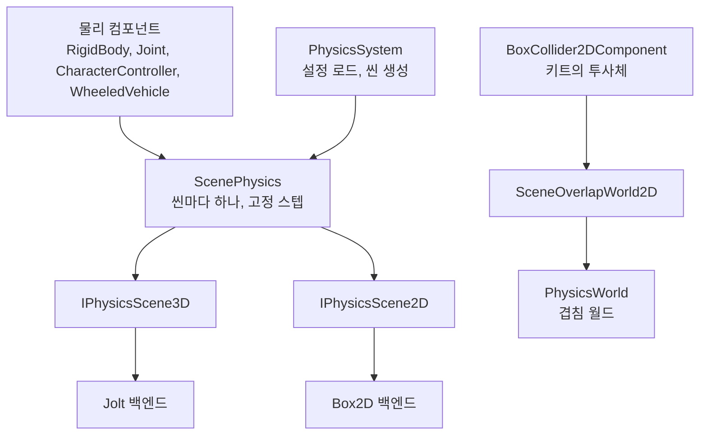

# Physics — 강체 물리와 겹침 월드

> **[🏠 위키 홈으로 돌아가기](../../../README.md)** | **[📖 문서 지도](../../../docs/02_DocumentMap.md)**

## 이것은 무엇이고 왜 있나

상자가 바닥에 떨어져 구르고, 캐릭터가 계단을 오르고, 총알이 벽에 맞는 일은 모두 물리가 계산합니다. 이 폴더에는 물리가 두 가지 있습니다.

- **강체 물리.** 바디, 셰이프, 관절, 캐릭터 컨트롤러, 질의, 고정 스텝, 접촉 이벤트를 다룹니다. 3D 는 Jolt, 2D 는 Box2D v3 가 계산합니다.
  엔진 코드는 두 라이브러리를 직접 부르지 않고 엔진 인터페이스(`IPhysicsScene3D`, `IPhysicsScene2D`)만 부릅니다. 언리얼의 Chaos, 유니티의 PhysX 와 Box2D 통합에 해당합니다.
- **겹침 월드**(`PhysicsWorld`). AABB 겹침, 연속 스윕, 겹침 이벤트만 계산하는 가벼운 월드입니다. 힘이나 속도를 적분하지 않습니다.
  `BoxCollider2DComponent` 와 GameFramework 키트의 투사체, 근접 공격 판정이 씁니다. 강체 씬과 따로 돌지만 같은 레이어 충돌 테이블(`CollisionLayers`)을 씁니다.

라이브러리를 인터페이스 뒤에 감싸 두면 라이브러리를 바꿀 때 백엔드 폴더 하나만 바뀝니다. 또 Jolt 와 Box2D 의 헤더가 엔진 전체로 퍼지지 않아 빌드가 가벼워집니다.

## 머릿속 그림



**씬의 물리.** 씬마다 `GameObjectManager` 가 `ScenePhysics` 를 하나 가지고 있습니다. 3D 씬과 2D 씬은 처음 쓸 때 만듭니다.
`PhysicsSystem`(`engine::getPhysicsSystem`)은 엔진 기동 단계 `Physics` 에서 설정을 읽고 백엔드를 초기화하는 서비스입니다.

**고정 스텝.** 물리는 프레임 길이와 관계없이 같은 길이의 스텝으로 진행합니다. `ScenePhysics` 가 누적기(`FixedStepAccumulator`)로 프레임 시간을 스텝 수로 바꿉니다.
스텝 길이와 프레임당 최대 스텝 수는 `EngineConfig::_fixedDeltaTime` 과 `_maxFixedStepPerFrame` 하나로 정하고, 상한을 넘는 시간은 버립니다. 그래서 프레임이 너무 느리면 게임이 느려지지만 물리가 폭주하지는 않습니다.
같은 입력을 같은 순서로 넣으면 같은 결과가 나옵니다(`StepIsDeterministic`).

**핸들.** 바디, 관절, 캐릭터는 슬롯 번호와 세대로 된 핸들로 가리킵니다. 지운 뒤 같은 슬롯을 다시 써도 옛 핸들은 무효이고, 무효 핸들을 받은 함수는 아무것도 하지 않습니다.

**레이어와 재질.** 둘 다 `Resource/engine/physics/physicssettings.xml` 에 이름으로 적습니다(`PhysicsSettings`). 코드는 이름으로만 고르고, 모르는 이름은 읽을 때 오류입니다.

## 따라 해 보기 — 바닥에 떨어지는 상자

정적 바닥과 동적 상자를 만들고, 상자가 바닥에 부딪힐 때 이벤트를 받아 보겠습니다.

### 1단계 — 정적 바닥

<!-- snippet: Source/Games/Empty/BenchCombatComponent.cpp 의 바닥 구간 — 5b U7 에서 doc 구간 표시로 대조 -->
```cpp
RigidBodyComponent* pFloorBody = pFloor->addComponent<RigidBodyComponent>();
PhysicsShapeDesc3D  floorBox;
floorBox._halfExtents   = float3{ 10.0f, 0.5f, 10.0f };
floorBox._localPosition = float3{ 0.0f, -0.5f, 0.0f };
pFloorBody->setShape( floorBox );
pFloorBody->setBodyType( PhysicsBodyType::Static );
pFloorBody->setLayer( hashed_string( "Static" ) );
pFloorBody->setMaterial( hashed_string( "Stone" ) );
```

`Static` 바디는 움직이지 않습니다. 셰이프의 `_halfExtents` 는 상자의 반 크기이고, 단위는 미터입니다. 레이어와 재질은 설정 파일에 있는 이름이어야 합니다.

### 2단계 — 동적 상자와 충돌 이벤트

<!-- snippet: 떨어지는 상자와 onCollisionBegin — 5b U7 에서 문서 예시 테스트로 대조 -->
```cpp
RigidBodyComponent* pBoxBody = pBox->addComponent<RigidBodyComponent>();
PhysicsShapeDesc3D  box;
box._halfExtents = float3{ 0.5f, 0.5f, 0.5f };
pBoxBody->setShape( box );
pBoxBody->setBodyType( PhysicsBodyType::Dynamic );

// 상자 오브젝트에 붙인 게임 컴포넌트
void CrateComponent::onCollisionBegin( const CollisionInfo& collision )
{
    if ( collision._impulse > 5.0f )
    {
        // 세게 부딪혔다 — 소리, 파편
    }
}
```

`Dynamic` 바디는 물리가 움직이고, 보간한 자세를 트랜스폼에 씁니다. 상자가 바닥에 닿으면 상자와 바닥 오브젝트의 켜진 컴포넌트가 모두 `onCollisionBegin` 을 받습니다.
`_impulse` 는 충격량 크기(뉴턴초)이므로 소리 크기나 피해량에 바로 쓸 수 있습니다. 바디 모양을 눈으로 보려면 `-gv_physicsDebugDraw=1` 로 실행합니다.

### 3단계 — 힘 주기

```cpp
pBoxBody->addImpulse( float3{ 0.0f, 5.0f, 0.0f } );
```

힘, 충격량, 속도 설정은 어느 틱에서 불러도 됩니다. 명령으로 쌓였다가 다음 물리 프레임에 적용됩니다(`PhysicsBodyCommand`).

## 작동 원리

### 한 프레임 안의 위치

매니저는 프레임 단계 `Physics` 에서 겹침 월드를 먼저 진행하고 그다음 강체 물리를 진행합니다(`SceneFrameStepList.xxx`).
이 단계는 `DuringPhysics` 틱과 애니메이션이 끝난 뒤, `PostPhysics` 틱 전입니다. 그래서 키네마틱 히트박스는 이번 프레임의 애니메이션 포즈를 따르고, `PostPhysics` 틱은 이번 물리 결과를 봅니다.

강체 물리는 고정 스텝을 진행하고, 보간한 자세를 트랜스폼에 쓰고, 접촉 이벤트를 보냅니다.
물리 컴포넌트는 틱하지 않습니다. 물리 프레임의 단계(바디, 관절, 캐릭터 순서)마다 불립니다([물리 컴포넌트](../Object/Component/Physics/README.md)).

### 라이브러리 감싸기

| 파일 | 내용 |
|---|---|
| `PhysicsTypes.h` | 핸들, 바디 종류, 관절 종류, 모터, 접촉 단계 |
| `PhysicsShape.h` | 셰이프 서술자 |
| `PhysicsDesc.h` | 바디, 관절, 캐릭터 서술자 |
| `PhysicsQuery.h` | 질의 필터, 레이 캐스트와 셰이프 캐스트 결과 |
| `PhysicsContact.h` | 접촉과 트리거 이벤트 |
| `IPhysicsScene.h` | 씬 인터페이스 |

3D 셰이프는 상자, 구, 캡슐, 볼록 껍질, 삼각 메시이고 2D 셰이프는 상자, 원, 캡슐, 다각형, 사슬입니다.
바디와 관절 서술자는 차원 하나(`PhysicsDimension3D`, `PhysicsDimension2D`)로 갈리는 템플릿이라 3D 와 2D 가 같은 코드를 씁니다.

라이브러리 헤더(`<Jolt/...>`, `<box2d/...>`)는 그 백엔드 폴더에서만 include 하고, 라이브러리는 `Source/Engine/CMakeLists.txt` 에서만 링크합니다. `CheckThirdPartyIsolation.py` 가 이 규칙을 지킵니다.
백엔드를 바꾸면 `IPhysicsScene` 을 구현하는 씬 하나와 `PhysicsSystem` 의 생성 코드 한 줄이 바뀝니다.

**잡 시스템.** Jolt 는 스텝을 의존 관계가 있는 잡으로 나눕니다. 기다리는 스레드가 장벽에서 남은 잡을 직접 실행하므로 잡끼리 바쁘게 기다리지 않습니다.
그래서 엔진 태스크(`TaskManager` 의 High 레인)로 실행해도 안전합니다(`JoltJobSystem`).
Box2D 는 한 스레드로 돕니다. Box2D 의 솔버 워커들은 서로를 바쁘게 기다리는 구조라, 공유 작업 풀에 넘기면 교착 상태가 될 수 있기 때문입니다.

### 규칙

**단위.** 미터, 킬로그램, 초, 라디안을 씁니다. 3D 는 +Y 가 위이고, 2D 는 XY 평면과 Z축 둘레의 각을 씁니다.

**스레드.** 씬 하나는 게임 스레드 하나가 다룹니다. 컴포넌트의 힘, 충격량, 속도 설정은 명령으로 쌓였다가 물리 프레임에 적용되므로 병렬 틱에서도 부를 수 있습니다.

**재질.** 재질은 셰이프마다 있습니다. 두 셰이프의 마찰은 기하 평균, 반발은 큰 쪽을 씁니다. 두 백엔드가 같습니다. 질량은 밀도로 정하거나 `_mass` 로 직접 줍니다.

**레이어.** 설정 파일의 레이어 순서가 번호입니다(최대 32개). 충돌 목록은 대칭으로 읽으므로 한쪽에만 적어도 두 레이어가 부딪힙니다. 질의는 레이어 마스크로 거릅니다.

- 쏘는 오브젝트의 바디를 모두 빼려면 `PhysicsQueryFilter::_ignoreUserData` 에 그 오브젝트 id 를 넣습니다. 자기 래그돌 본이나 들고 있는 무기를 맞히지 않게 할 때 씁니다.
- 레이 캐스트 결과의 `_material` 은 맞은 셰이프의 재질 이름입니다. 발소리나 탄흔 종류를 고를 때 씁니다.
- 두 바디만 예외로 충돌을 끄려면 `setPairCollision` 을 씁니다. 관절로 이은 두 바디는 관절의 `_bDisableCollision` 으로 끕니다.

**접촉 이벤트.** 바디 쌍마다 시작, 유지, 끝이 한 번씩 납니다. 셰이프가 여러 개여도 바디 쌍당 한 번입니다.
한 스텝 안에 닿았다가 떨어진 쌍은 시작과 끝을 둘 다 냅니다. 바디를 지우거나 끄면 그 접촉은 다음 이벤트 배치에서 끝납니다.
시작의 충격량은 부딪힌 충격으로, `다가온 속도 × 유효 질량 × (1 + 반발)` 입니다. 유지의 충격량은 그 스텝의 접촉 충격량입니다. 바닥에 쉬는 상자는 무게 × 스텝 길이가 됩니다.

이벤트는 두 오브젝트의 켜진 컴포넌트에 갑니다. 막는 접촉은 `onCollisionBegin`, `onCollisionStay`, `onCollisionEnd`(`CollisionInfo`)로, 트리거는 `onOverlapBegin`, `onOverlapStay`, `onOverlapEnd`(`OverlapInfo`)로 받습니다.
`_selfBody` 와 `_otherBody` 로 어느 바디였는지 알 수 있어, 래그돌 본이나 히트 존을 구별할 수 있습니다.
바디의 사용자 값이 오브젝트 id 이므로, 컴포넌트가 아닌 코드(래그돌 빌더)가 만든 바디도 사용자 값에 오브젝트 id 를 넣으면 그 오브젝트가 이벤트를 받습니다.

**대량 생성과 파괴.** 바디를 많이 만들거나 지울 때는 `createBodies` 와 `destroyBodies` 를 한 번 부릅니다. Jolt 는 그러면 넓은 단계(broad phase)를 한 번만 고칩니다.
파편이나 탄피처럼 같은 모양은 `createShape` 로 미리 만들어 나눠 씁니다. 풀에 넣어 다시 쓸 바디는 지우지 않고 `setBodyEnabled( false )` 로 끕니다.
만들어 둔 셰이프 여러 개는 `createCompoundShape` 로 묶습니다. Jolt 의 볼록 껍질 하나를 만드는 데 수십 µs 가 들어, 파괴 조각마다 다시 만들면 깨지는 프레임이 10ms 를 넘기 때문입니다.

### 컴포넌트

| 컴포넌트 | 하는 일 |
|---|---|
| `RigidBodyComponent`, `RigidBody2DComponent` | 바디 하나. 셰이프가 둘 이상이면 컴파운드입니다 |
| `JointComponent`, `Joint2DComponent` | 이 오브젝트의 강체를 부모 쪽의 가장 가까운 강체(없으면 월드)에 연결합니다 |
| `CharacterControllerComponent`, `CharacterController2DComponent` | 캡슐 무버. 위치는 발입니다 |
| `WheeledVehicleComponent` | 바퀴 네 개의 물리 차. 3D 만 있습니다 |

**강체**는 종류, 셰이프, 레이어, 재질, 질량, 트리거, 연속 충돌 여부를 프로퍼티로 가지고 있습니다. 무기 판정의 히트 존(`_hitZone`)도 여기 있습니다.
`Dynamic` 은 보간한 자세를 트랜스폼에 씁니다. `Kinematic` 은 트랜스폼을 따라 스텝마다 나눠 움직입니다. 코드가 트랜스폼을 옮기면(`teleportTo` 포함) 순간이동입니다.
3D 강체는 소켓 부착이 물리로 떼어 낼 때 쓰는 인터페이스(`getSocketPhysicsBody`)도 제공합니다.

**캐릭터 컨트롤러**는 `setMoveVelocity` 와 `jump` 로 움직이고, 중력은 컴포넌트가 쌓습니다.
3D 컨트롤러는 애니메이션 루트 모션도 받습니다(`addRootMotionDisplacement`). 한 프레임의 이동을 그 프레임의 스텝들이 나눠 움직이므로 벽에 막히고 턱을 오릅니다.

**바퀴 차**(`WheeledVehicleComponent`)는 같은 오브젝트의 동적 강체를 차체로 쓰고, 바퀴 네 개와 서스펜션, 엔진, 자동 변속, 디퍼렌셜을 붙입니다.
Jolt 의 `VehicleConstraint` 와 `WheeledVehicleController` 를 스텝 리스너로 씁니다. 언리얼의 Chaos Vehicle, 유니티의 WheelCollider 에 해당합니다.

- 굴림 방식은 `WheelDrive`(앞, 뒤, 네 바퀴)로 고릅니다. 앞바퀴만 조향하고 핸드브레이크는 뒷바퀴에 겁니다.
- `setDriverInput( 앞, 오른쪽, 브레이크, 핸드브레이크 )` 는 어느 틱에서든 부를 수 있고, 상태(`getVehicleState`)는 물리 프레임이 끝날 때 갱신됩니다.
- 씬 인터페이스는 `IPhysicsScene3D::createWheeledVehicle`, `setVehicleInput`, `getVehicleState` 입니다. 2D 에는 없습니다.
- 엔진과 Jolt 는 좌표계의 손(왼손, 오른손)이 달라서 오른쪽(+X)의 뜻이 다르므로, 백엔드가 조향 부호를 바꿉니다.
- 같은 실행에서 같은 입력이면 같은 궤적이 나옵니다. 기계가 다르면 보장하지 않습니다.
- 바퀴 메시를 바퀴 자세로 옮기는 기능은 아직 없습니다.

`-gv_physicsDebugDraw=1` 이면 활성 씬의 바디와 캐릭터를 디버그 선으로 그립니다.

### 물리 에셋과 래그돌

물리 에셋(`PhysicsAsset`, `*.physics.xml`)은 본마다 바디, 관절 한계, 히트 존, 충돌을 끌 바디 쌍을 적은 파일입니다. 견본은 `Resource/engine/physics/samples/chain.physics.xml` 입니다.
`PhysicsRagdollBuilder::create` 는 에셋과 본 배열(`PhysicsSkeletonView`)로 바디와 관절을 만듭니다. 애니메이션 타입이 아니라 본 이름, 부모 번호, 모델 공간 행렬 세 배열만 받습니다.

- 셰이프와 관절 축은 본 로컬 좌표입니다.
- 관절은 그 본의 바디와, 부모 쪽으로 가장 가까운 바디가 있는 본을 원뿔(Cone, 스윙 원뿔과 비틀림)이나 경첩(Hinge)으로 연결합니다.
- 관절로 이은 바디끼리, 그리고 `_listDisabledPair` 의 쌍은 부딪히지 않습니다.
- 바디가 없는 본(손가락, 모자)은 포즈를 읽을 때 입력 포즈의 부모 상대 변환으로 따라갑니다.
- 에셋의 본이 스켈레톤에 없으면 오류이고, 아무것도 만들지 않습니다.

히트박스로 쓰려면 키네마틱으로 만들고 스텝마다 `driveToPose` 로 애니메이션을 따르게 합니다. 래그돌로 넘길 때는 `setBodyType( Dynamic )`, 포즈를 받을 때는 `readBoneTransforms` 를 씁니다.
보통은 이 과정을 감싼 `RagdollComponent` 를 씁니다([Character](../Character/README.md) 의 "래그돌과 히트박스" 절).

### 겹침 월드와 연속 충돌

**터널링.** 겹침을 스텝 끝 위치에서만 검사하면, 한 프레임에 얇은 적보다 멀리 가는 총알은 겹친 적 없이 지나갑니다.

```text
[끝 위치만 검사]  총알 ●  ............ |벽| ............ ● 다음 위치    → 겹침 없음
[이동 경로 검사]  총알 ● ═════════════>|벽|                             → t = 0.47 에서 충돌
```

`ContinuousCollision::sweepAabb` 는 이동하는 AABB 의 반 크기만큼 대상 AABB 를 늘린(민코프스키 합) 뒤, 이동 중심에서 이동 벡터 방향으로 슬랩 광선을 쏩니다.
진입 시각 `t` 가 0 과 1 사이에 있으면 충돌이고, 그 시각과 접촉점, 접촉 법선을 `SweepHit` 에 담아 돌려줍니다. 구를 쓸 때는 `sweepSphere` 를 씁니다.
`PhysicsWorld::sweepTest` 는 월드의 바디 가운데 이동 경로의 경계에 걸치는 것을 공간 그리드로 먼저 고르고, 가장 먼저 닿는 바디를 찾습니다.

**겹침 이벤트.** `PhysicsWorld::step` 은 적분하지 않고 **겹침만 다시 계산합니다.** 지난 step 과 비교해 새로 겹친 쌍은 시작, 떨어졌거나 바디가 사라진 쌍은 끝으로 `getOverlapEvents()` 에 냅니다.
계속 겹친 쌍은 다시 내지 않습니다. 유니티의 `OnTriggerEnter2D`, 언리얼의 `BeginOverlap` 에 해당합니다.

`SceneOverlapWorld2D` 가 매 프레임 게임 스레드에서 한 번 다음 순서로 실행합니다.

1. 등록된 콜라이더(`BoxCollider2DComponent`)의 바디를 그 프레임의 월드 위치, 레이어, 판정 방식(연속, 트리거)으로 한 번에 맞춥니다(`updateBody`). 시작 전이거나 꺼진 콜라이더는 빠집니다.
2. `step` 을 실행해 이벤트를 받습니다.
3. 이벤트마다 두 오브젝트의 켜진 컴포넌트에 `onOverlapBegin` 이나 `onOverlapEnd` 를 부릅니다. `OverlapInfo` 에는 상대 오브젝트(끝에서 사라졌으면 nullptr), 양쪽이 트리거인지, 닿은 시각이 들어 있습니다.

콜라이더는 틱하지 않습니다. 병렬 틱에서 콜라이더가 자기 바디를 고치면, 같은 그룹에서 겹침을 묻는 쪽이 실행 순서에 따라 옛 위치나 새 위치를 보게 되기 때문입니다.
그래서 틱 안의 질의(`queryAabb`, `sweepTest`)는 지난 step 의 위치를 봅니다. 유니티의 물리 질의와 같습니다.

**트리거.** 콜라이더를 트리거로 두면(`setTrigger`) 겹침은 똑같이 나지만, 받는 쪽은 `OverlapInfo::_bOtherTrigger` 로 상대가 몸이 아니라 감지 범위였다는 것을 압니다.
투사체와 공격 판정은 상대의 트리거에 막히지도 않고 피해를 주지도 않습니다. 한 오브젝트에 몸과 감지 범위가 함께 있으면 같은 상대에게서 이벤트가 둘 옵니다. `OverlapInfo` 로 그 둘을 구별합니다.

**연속 바디.** 콜라이더를 연속으로 두면(`BoxCollider2DComponent::setContinuous`) `step` 이 그 바디를 지난 step 의 위치(`PhysicsBody::_stepAabb`)에서 지금 위치까지 쓸어 봅니다.
그 사이에 처음 닿은 바디도 이번 step 의 겹침으로 셉니다. 투사체는 시작할 때 스스로 연속을 켭니다. 유니티의 `CollisionDetectionMode2D.Continuous` 에 해당합니다.

- 지나간 쌍은 이번 step 에 시작하고, 이미 떨어졌으면 다음 step 에 끝납니다.
- 이벤트 목록은 **닿은 시각(`PhysicsOverlapEvent::_time`) 순서**입니다. 총알이 한 step 에 적 둘을 지나가면 앞의 적이 먼저 오고, 총알은 거기서 사라지므로 뒤의 적은 맞지 않습니다. 끝 이벤트와 제자리 겹침은 `_time = 1` 입니다.
- 출발점에서 이미 겹쳐 있던 쌍(닿은 시각 0)은 쓸어서 더하지 않습니다. 그 겹침은 지난 step 이 이미 계산했고, 더하면 떠난 쌍의 끝이 한 step 늦어집니다.
- **상대도 움직였으면 상대 운동으로 계산합니다.** 두 바디 모두 지난 step 의 위치에서 출발하고, 연속 바디의 이동에서 상대의 이동을 뺀 만큼 씁니다.
  그래서 프레임 사이에 총알 경로를 가로질러 건너간 적도 맞습니다. Box2D 의 총알 TOI, 유니티의 Continuous Dynamic 과 같습니다.
  그 적의 지금 위치는 쓸린 범위 밖일 수 있으므로, 후보는 쓸린 범위를 이번 step 에 가장 많이 움직인 바디의 거리만큼 넓혀 모읍니다.
- **순간이동은 쓸지 않습니다.** `SceneComponent::teleportTo` 는 그 컴포넌트와 그 아래에 붙은 모든 것에 순간이동 표시를 남깁니다.
  콜라이더는 바디를 `BodyMoveType::Teleport` 로 맞추고, 새 위치를 다음 스윕의 출발점으로 삼습니다. `setWorldPosition` 으로 옮기면 그 경로를 쓸어 봅니다.

**2D 콜라이더의 판정 함수.** `overlapsBounds` 는 레이어를 보지 않는 순수 기하 판정이고, `isTouching` 은 레이어 충돌 테이블을 반영합니다.
둘 다 바디가 등록되어 있는지와 관계없이 같은 답을 냅니다. 유니티의 `Bounds.Intersects`, `IsTouching` 에 해당합니다.

## 확장하는 법

### 새 레이어나 재질

`Resource/engine/physics/physicssettings.xml` 에 이름을 추가합니다. 레이어는 `_listCollidesWith` 에 부딪힐 레이어를 적습니다. 코드는 이름으로 고르므로 코드를 고칠 필요가 없습니다.
레이어 번호는 순서로 정해지므로 중간에 끼워 넣으면 그 뒤 레이어의 번호가 바뀝니다.

### 새 물리 백엔드

1. `IPhysicsScene3D` 나 `IPhysicsScene2D` 를 구현하는 씬을 새 폴더에 만듭니다. 라이브러리 헤더는 그 폴더에서만 include 합니다.
2. `PhysicsSystem` 의 씬 생성 코드 한 줄을 바꿉니다.
3. `CheckThirdPartyIsolation.py` 의 `LibraryRule` 에 새 라이브러리의 헤더 접두어, 백엔드 폴더, 링크 타깃 이름을 추가합니다.

`Test/EngineTest/Physics/` 의 테스트는 인터페이스만 쓰므로 그대로 새 백엔드를 검증합니다.

## 함정과 주의

**`RigidBodyComponent` 는 오브젝트의 루트에 두세요.** 바디의 자세가 오브젝트를 옮기려면 루트여야 합니다. 메시가 루트면 파괴나 기믹 테스트에서 바디는 움직여도 오브젝트는 움직이지 않고, 경고도 없습니다.

**컴포넌트가 쓴 자세와 다른 트랜스폼은 순간이동으로 처리됩니다.** 물리 결과와 다른 위치는 코드가 옮긴 것으로 봅니다. 연속 바디를 경로 검사 없이 옮기려면 `teleportTo` 를 씁니다.

**바디의 각속도를 새 바디에 그대로 넘기지 마세요.** Jolt 의 각속도 상한(기본 초당 15바퀴)에 붙어 돌던 바디에서 읽은 값은 반올림으로 상한을 1 ulp 넘을 수 있고, 그러면 Jolt 가 assert 합니다.
파괴 조각이 갈라질 때 이런 일이 생깁니다. `createBody` 가 시작 각속도를 상한 조금 안쪽으로 줄입니다(`StartingAngularVelocityIsClampedToBodyLimit`).

**Box2D 의 `totalNormalImpulse` 를 충격량으로 쓰지 마세요.** 이완 반복까지 더한 값이라 약 두 배입니다. 백엔드는 마지막 서브 스텝의 `normalImpulse` 에 서브 스텝 수를 곱해 씁니다.

**vcpkg 의 Jolt 는 헤더와 라이브러리의 설정이 다릅니다.** 설치된 `Core.h` 는 `JPH_FLOATING_POINT_EXCEPTIONS_ENABLED` 를 켜지만 라이브러리는 그것 없이 빌드되었습니다.
`JPH::RegisterTypes()` 는 버전 ID 가 다르면 abort 하므로, 백엔드는 라이브러리가 받는 ID 를 찾아 `RegisterTypesInternal` 을 직접 부릅니다. 그 비트 하나만 다를 때만 받아들입니다.
같은 이유로 헤더 안의 `Vec3::CheckW` assert 는 잘못된 경보라 assert 처리기가 무시합니다.

**Jolt 의 AVX2 옵션은 Jolt 백엔드 소스에만 붙이세요.** 엔진 전체가 AVX2 로 컴파일되면 AVX2 가 없는 CPU 에서 실행되지 않습니다.
그래서 Jolt 임포트 타깃의 `-mavx2` 는 `$<LINK_ONLY:>` 와 소스 속성으로 백엔드 소스에만 붙고, 그 소스는 PCH 를 쓰지 않습니다.

**2D 콜라이더 바디에는 깊이가 없습니다.** 바디는 Z = 0 의 한 점 두께입니다. 3D 광선이나 상자 질의를 `PhysicsWorld` 에 그대로 던지면, Z 가 0 이 아닌 2D 씬에서는 아무것도 맞지 않습니다.
`PhysicsWorldQuery` 는 깊이 없는 바디를 Z 와 관계없이 맞힙니다.

**연속 바디의 후보 범위를 먼 이동 바디로 넓히지 마세요.** 후보 범위는 셀 하나 이내로 움직인 바디만으로 넓히고, 멀리 움직인 바디(`isFarMover`)는 하나씩 따로 계산합니다.
하나가 멀리 끌려가면 모든 연속 바디가 월드 전체를 훑게 되기 때문입니다.

**셀 순회 변수는 `int64` 로 두세요.** 셀 범위는 `CellRange` 하나로 계산합니다. `int32` 순회 변수가 `MathUtil::kMaxInt32` 에서 넘치면 루프가 끝나지 않습니다.
`toCellCoord` 는 `float64` 로 나눈 뒤 정수로 바꿉니다. 공간 색인 규약은 [Spatial](../Spatial/README.md)에 있습니다.

**`onOverlapBegin` 안에서는 스폰과 파괴를 해도 됩니다.** 겹침 이벤트는 틱이 끝난 뒤 게임 스레드에서 실행되기 때문입니다.

## 더 볼 곳

- [Jolt 백엔드](Jolt/README.md), [Box2D 백엔드](Box2D/README.md) — 백엔드별 사정
- [물리 컴포넌트](../Object/Component/Physics/README.md) — 컴포넌트의 물리 프레임 단계
- [Character](../Character/README.md) — 래그돌, 맞힘 판정, 소켓 부착의 물리
- [Spatial](../Spatial/README.md) — 겹침 월드가 쓰는 공간 그리드

자주 여는 파일은 다음과 같습니다.

| 파일 | 내용 |
|---|---|
| `IPhysicsScene.h` | 씬 인터페이스 |
| `PhysicsSettings.h` | 레이어, 재질, 중력, 서브 스텝 |
| `PhysicsRagdoll.h` | 래그돌과 히트박스 빌더 |
| `PhysicsWorld.h` | 겹침 월드 |
| `ContinuousCollision.h` | AABB 와 구의 스윕 |
| `Object/GameObject/ScenePhysics.h` | 씬의 물리, 고정 스텝 |
