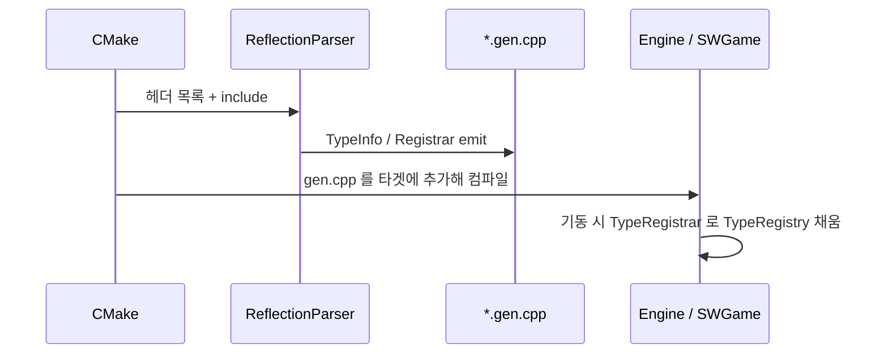

# Reflection (리플렉션 런타임 코어)

> **[🏠 위키 홈으로 돌아가기](../../../../README.md)** | **[📖 서브시스템 목록](../../../../docs/02_EngineSubsystems.md)**

C++ 타입의 **이름 · 필드 · 함수 · enum** 정보를 런타임에 조회하고,  
직렬화·에디터·핫리로드·ECS 팩토리가 그걸 쓰게 하는 레이어입니다.

경로: `Source/Engine/Reflection/`  
코드 생성기: [Tools/ReflectionParser/README.md](../../../Tools/ReflectionParser/README.md)

---

## 한 줄로 이해하기

| 개념 | 역할 |
|------|------|
| **매크로** (`REFLECT`, `PROPERTY` …) | 헤더에 “이 타입/필드를 노출한다”고 표시. |
| **ReflectionParser** | 헤더를 읽어 `*.gen.cpp` 메타데이터를 생성. |
| **TypeInfo / EnumInfo** | 런타임에 필드 목록·오프셋·이름 등을 담은 설명서. |
| **TypeRegistry** | 이름으로 TypeInfo를 찾아주는 전역 사전. |
| **Builtins** | `int32`, `string`, `vector` 등 표준/엔진 기초 타입 등록. |


일반 C++ 빌드에서는 매크로가 **빈 정의**라 런타임 오버헤드가 거의 없고,  
파서가 `__REFLECT_PARSER__` 로 컴파일할 때만 annotate 속성이 붙습니다.

---

## 폴더 · 헤더

| 파일 | 내용 |
|------|------|
| `ReflectionMacros.h` | `REFLECT`, `PROPERTY`, `FUNCTION`, `ENUM`, `REFLECT_BODY`, `REFLECT_SCRIPT` |
| `ReflectionCore.h` | 위 + Cast/Containers/Types/Registry **우산 헤더** |
| `ReflectionTypes.h` | `TypeInfo`, `PropertyInfo`, `FunctionInfo` 등 |
| `TypeRegistry.h` | 등록·조회·별칭·enum 문자열 변환 |
| `ReflectionCast.h` | 리플렉션 기반 캐스트 헬퍼 |
| `ReflectionContainers.h` | Sequence/Map 래퍼 |
| `ReflectBuiltins.h` | int/string/vector 등 빌트인 목록 |
| `ReflectGenerated.h` | `*.gen.cpp` preamble |
| `ReflectAny.*` | 타입 소거 값 상자 |
| `Rpc/` | RPC용 리플렉션 보조 |

보통은 `#include "Engine/Reflection/ReflectionCore.h"` 또는 컴포넌트 헤더가 끌어오는 매크로만 쓰면 됩니다.

---

## 초심자용 작성법

### 1) 일반 구조체 / 데이터

```cpp
REFLECT()
struct UnitStatsData
{
    REFLECT_BODY();

    PROPERTY()
    int32 hp{ 0 };

    PROPERTY( Min = 0 )
    int32 maxHp{ 0 };
};
```

- `REFLECT()` — 타입을 파서 대상에 올림  
- `REFLECT_BODY()` — `StaticType()` 선언 (정의는 `.gen.cpp`)  
- `PROPERTY()` — 직렬화·에디터에 노출할 멤버

### 2) 스크립트 컴포넌트 (게임에 붙는 Component)

```cpp
REFLECT_SCRIPT()
class MonsterComponent : public Component
{
public:
    REFLECT_BODY();

    PROPERTY()
    string monsterId;

    PROPERTY()
    float32 attackRange{ 0.0f };
};
```

`Component` 를 상속하고 `REFLECT_BODY()` 가 있으면 **컴포넌트 팩토리**도 생성되어  
이름으로 `GameObjectManager::addComponentByName` / 씬 로드가 가능합니다.

### 3) Enum

```cpp
ENUM()
enum class MonsterAiState : uint8
{
    Patrol = 0,
    Chase,
    Attack
};

// 비트 플래그
ENUM( Flags )
enum class CollisionMask : uint32 { None = 0, World = 1, Pawn = 2 };
```

`ENUM(Flags)` 비트 연산자는 `FlagOps.gen.h`로 생성되어 해당 타겟에 강제 include 됩니다.

### 4) 별칭 (옛 이름 호환)

```cpp
REFLECT( Alias = "OldMonster" )
class MonsterComponent : public Component { /* ... */ };

PROPERTY( Alias = "hp, HitPoints" )
int32 health{ 0 };
```

직렬화된 예전 이름도 TypeRegistry 별칭으로 찾을 수 있습니다.

---

## 런타임에서 쓰기

```cpp
#include "Engine/Reflection/ReflectionCore.h"

const TypeInfo* type = MonsterComponent::StaticType();
// 또는
const TypeInfo* byName = engine::getTypeRegistry().findType( hashed_string( "MonsterComponent" ) );

// enum
string s = engine::getTypeRegistry().enumToString( MonsterAiState::Chase );
```

게임 모듈에서는 `game::getTypeRegistry()` 를 쓰세요 (`EngineServices` 직접 접근 지양).

---

## 빌드 파이프라인에서의 위치



CMake 헬퍼: `cmake/Engine/ReflectionCodeGen.cmake` (`sw_addReflectionStep`)

1. ReflectionParser 실행 파일 빌드  
2. REFLECT 헤더 스캔 → `OutputDir/Foo.gen.cpp`  
3. 해당 라이브러리/게임이 gen.cpp 를 링크  
4. 런타임에 registrar가 타입 등록

---

## 매크로 치트시트

| 매크로 | 용도 |
|--------|------|
| `REFLECT(...)` | 타입 노출. `Abstract`, `Alias=…` |
| `REFLECT_SCRIPT(...)` | 게임/스크립트 컴포넌트 |
| `REFLECT_BODY()` | `StaticType()` + gen 정의 요청 |
| `PROPERTY(...)` | 필드. `ReadOnly`, `Min`/`Max`, `Alias`, `Category` … |
| `FUNCTION(...)` | 함수. RPC용 `Server`/`Client`/`Multicast` 등 |
| `ENUM(...)` | 열거형. `Flags`, `Invalid=`, `Count=` |
| `REFLECT_CONTAINER(...)` | 커스텀 컨테이너를 Sequence/Map으로 |

어노테이션 별칭 표는 `Source/Core/Predefined/AnnotationMeta.txt`  
(예: `Alias` = `PreviousName` 등).

---

## 자주 하는 실수

| 실수 | 결과 | 올바른 방법 |
|------|------|-------------|
| `REFLECT` 만 하고 `REFLECT_BODY` 없음 | StaticType/팩토리 없음 | 멤버 있는 타입은 BODY 필수에 가깝다 |
| `REFLECT_BODY()` 매크로 안에 주석 | 매크로 줄바꿈 깨짐 | BODY 안에는 주석 금지 (헤더 주석 참고) |
| PROPERTY 없는 필드만 직렬화 기대 | 저장 안 됨 | 노출할 멤버에 `PROPERTY()` |
| gen.cpp 를 손으로 수정 | 다음 파서 실행에 덮어씀 | 헤더/매크로만 수정 |
| Games에서 EngineServices로 Registry | 레이어 위반 | `game::getTypeRegistry()` |

---

## 더 볼 곳

- [ReflectionParser README](../../../Tools/ReflectionParser/README.md) — 파서 CLI · 템플릿 · 생성물  
- [Object README](../Object/README.md) — 컴포넌트 수명  
- `ReflectionMacros.h` — 상세 주석  
- 루트 [ARCHITECTURE.md](../../../ARCHITECTURE.md) — 리플렉션·직렬화 개요
