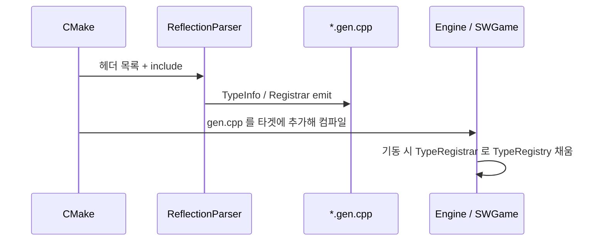

# Reflection (리플렉션 런타임 코어)

> **[🏠 위키 홈으로 돌아가기](../../../README.md)** | **[📖 서브시스템 목록](../../../docs/02_EngineSubsystems.md)**

C++ 타입의 **이름 · 필드 · 함수 · enum** 정보를 런타임에 조회하고,  
직렬화·에디터·핫리로드·컴포넌트 생성(`TypeInfo::_addComponent`)이 그걸 쓰게 하는 레이어입니다.

경로: `Source/Engine/Reflection/`  
코드 생성기: [Tools/ReflectionParser/README.md](../../../Tools/ReflectionParser/README.md)

---

## 한 줄로 이해하기

| 개념 | 역할 |
|------|------|
| **매크로** (`REFLECT`, `PROPERTY` …) | 헤더에 “이 타입/필드를 노출한다”고 표시. |
| **ReflectionParser** | 헤더를 읽어 `*.gen.cpp` 메타데이터를 생성. |
| **TypeInfo / EnumInfo** | 런타임에 필드 목록·오프셋·이름 등을 담은 설명서. |
| **TypeRegistry** | 이름으로 TypeInfo를 찾아주는 전역 사전. |
| **Builtins** | `int32`, `string`, `vector` 등 표준/엔진 기초 타입 등록. |


```mermaid
flowchart LR
  H["헤더에 REFLECT / PROPERTY"] --> P[ReflectionParser]
  P --> G["Foo.gen.cpp"]
  G --> R[TypeRegistry 등록]
  R --> S[직렬화 / 에디터 / 컴포넌트 생성]
```

일반 C++ 빌드에서는 매크로가 **빈 정의**라 런타임 오버헤드가 거의 없고,  
파서가 `__REFLECT_PARSER__` 로 컴파일할 때만 annotate 속성이 붙습니다.

---

## 폴더 · 헤더

| 파일 | 내용 |
|------|------|
| `ReflectionMacros.h` | `REFLECT`, `PROPERTY`, `FUNCTION`, `ENUM`, `REFLECT_BODY` |
| `ReflectionCore.h` | 위 + Cast/Containers/Types/Registry **우산 헤더** |
| `ReflectionTypes.h` | `TypeInfo`(컴포넌트 생성 칸 `_addComponent` 포함), `PropertyInfo`, `FunctionInfo` 등 |
| `TypeRegistry.h` | 등록·조회·별칭·enum 문자열 변환 |
| `ReflectionCast.h` | 리플렉션 기반 캐스트 헬퍼 |
| `ReflectionContainers.h` | Sequence/Map 래퍼 |
| `ReflectBuiltins.xxx` | int/string/vector 등 빌트인 타입의 단일 등록표(X-매크로 — 엔진이 include 하고 ReflectionParser 가 읽는다) |
| `ReflectionConstants.h` | 리플렉션 상수 · 데이터 표 |
| `ReflectionEnumNames.h` | `ContainerKind` · `FunctionNetRole` ↔ 식별자 문자열(정본은 `Core/Predefined/*.xxx`) |
| `ReflectGenerated.h` | `*.gen.cpp` preamble |
| `ReflectAny.*` | 타입 소거 값 상자 |
| `ReflectValue.*` | 타입 이름이 붙은 값(`ReflectValue`)과 인자 타입마다의 변환 표(`ReflectTypeOpsOf<T>`) |
| `ReflectionInvoke.*` | 이름으로 부르기 · 이벤트 묶기/부르기(`ReflectionInvoke`) — 콘솔 · 비주얼 스크립팅 · 기믹 배선 · 에디터가 쓴다 |
| `PropertyEditCondition.*` | `EditCondition` 식을 풀고 판정(인스펙터가 막거나 숨긴다) — ImGui 를 모른다 |
| `ReflectUnits.h` | `Units = …` 단위 표와 단위 사이 변환(헤더 전용 — 파서도 같은 표로 철자를 본다) |
| `ReflectionDocWriter.*` | 등록된 타입 · 열거형 → Markdown API 문서(`App --write-reflection-docs=<폴더>`, 빌드 산출물 — 커밋하지 않는다) |
| `ReflectionValidation.*` | 검증 함수(`Validate = fn`)를 돌리고(`ReflectionValidation`) 결과를 모은다(`ValidationContext` · `ValidationIssueLog`) |
| `PropertyRoleUtil.*` | 역할 플래그(`Replicated` · `RepNotify` · `SaveGame` · `Interp` · `Config`)를 읽는 쪽의 도우미 — 모으기 · RepNotify 부르기 · 값 섞기 · 설정 묶음 |
| `ReflectionRpc.h` | RPC용 리플렉션 보조 |

보통은 `#include "Engine/Reflection/ReflectionCore.h"` 또는 컴포넌트 헤더가 끌어오는 매크로만 쓰면 됩니다.

---

## 초심자용 작성법

아래 예의 타입 이름(`UnitStatsData` · `MonsterComponent` · `MonsterAiState` · `CollisionMask`)은 설명용입니다 — 트리에 있는 타입이 아닙니다.

### 1) 일반 구조체 / 데이터

```cpp
REFLECT()
struct UnitStatsData
{
    REFLECT_BODY();

    PROPERTY()
    int32 hp{ 0 };

    PROPERTY( Min = 0 )
    int32 maxHp{ 0 };
};
```

- `REFLECT()` — 타입을 파서 대상에 올림  
- `REFLECT_BODY()` — `StaticType()` 선언 (정의는 `.gen.cpp`)  
- `PROPERTY()` — 직렬화·에디터에 노출할 멤버

### 2) 컴포넌트 (게임/엔진 Component)

```cpp
REFLECT()
class MonsterComponent : public Component
{
public:
    REFLECT_BODY();

    PROPERTY()
    string monsterId;

    PROPERTY()
    float32 attackRange{ 0.0f };
};
```

`Component` 를 상속하고 `REFLECT_BODY()` 가 있으면(추상이 아니면) 코드젠이 `TypeInfo::_addComponent` 에 **생성 함수**
(`GameObject::addComponentTo<T>`)를 싣습니다. 이름으로 만드는 길(`GameObjectManager::addComponentByName` · 씬 · 프리팹 로드 · 에디터 "Add Component")은
이 칸 하나를 봅니다 — 따로 든 팩토리 표는 없습니다(언리얼 `UClass` 가 리플렉션과 생성을 함께 드는 것과 같은 자리). 모듈이 내려가면 타입과 함께 걷힙니다.

### 3) Enum

```cpp
ENUM()
enum class MonsterAiState : uint8
{
    Patrol = 0,
    Chase,
    Attack
};

// 비트 플래그
ENUM( Flags )
enum class CollisionMask : uint32 { None = 0, World = 1, Pawn = 2 };
```

`ENUM(Flags)` 비트 연산자는 `FlagOps.gen.h`로 생성되어 해당 타겟에 강제 include 됩니다.

### 4) 별칭 (실제 게임 데이터가 생긴 뒤의 이름 변경 창구)

**이름은 하나만 씁니다.** 실제 게임 데이터가 없는 지금은 타입 · 프로퍼티 · 열거자 이름을 바꾸면 Resource 데이터 · 시험 · 스크립트를 새 이름으로
다시 쓰고 옛 이름은 어디에도 남기지 않습니다 — 엔진 · 게임프레임워크 · 게임 코드에 `Alias` · `ValueAlias` 는 0 개입니다.
`ResourceDataSchemaTest.EveryResourceDataFileLoadsWithoutUnknownNames` 가 Resource/ 의 모든 데이터가 모르는 키 · 타입 · 열거자 경고 없이 읽히는지 봅니다.
아래 별칭은 다시 쓸 수 없는 데이터 — 배포한 게임의 세이브 · 사용자가 만든 콘텐츠 — 가 생긴 뒤 이름을 바꿀 때만 쓰는 창구입니다
(언리얼 CoreRedirects 와 같은 자리).

```cpp
REFLECT( Alias = "OldMonster" )
class MonsterComponent : public Component { /* ... */ };

PROPERTY( Alias = "hp, HitPoints" )
int32 health{ 0 };
```

등록하면 직렬화기가 이전 이름을 TypeRegistry 별칭(`registerTypeAlias` · `registerEnumAlias`)으로 찾습니다. 열거자는 `ENUM( ValueAlias = "Old:New" )` 입니다.

### 5) 값이 객체 밖에 있는 프로퍼티 (접근자 프로퍼티)

```cpp
PROPERTY( Name = "_localPosition", Category = "Transform", DisplayName = "Position" )
float3& getLocalPositionRef() { return _pTransformPage->_arrLocalPosition[getPageIndex()]; }
```

`PROPERTY()` 를 필드가 아니라 **값 참조(`T&`)를 돌려주는 인자 없는 메서드**에 붙이면, 값은 그 메서드가 돌려주는 자리에 있는 것으로
등록됩니다. 코드젠은 오프셋 대신 그 메서드를 부르는 `PropertyInfo::_pValueAccessor` 를 내고, `getRawPtr` · `getValue` · `setValue` ·
직렬화기 · 인스펙터가 모두 그 자리를 읽고 씁니다. `Name` 은 리플렉션 이름(직렬화 키)입니다 — 필드였던 값을 옮길 때 옛 이름을 이어 쓰면
씬 · 프리팹 파일을 고치지 않아도 됩니다. 씬 컴포넌트의 로컬 TRS 가 첫 예입니다(값은 트랜스폼 저장소의 칸에 있습니다).

- 값으로 돌려주거나(쓸 자리가 없다) 인자가 있거나 정적이면 코드젠이 멈춥니다. 컨테이너 · 비트필드는 받지 않습니다.
- 이런 프로퍼티가 하나라도 있는 타입은 객체 통째 복사(`TypeInfo::usesPodCopyFastPath`)를 쓰지 않습니다.

### 6) 함수 인자 · 이벤트 · 이름으로 부르기

```cpp
REFLECT()
struct DoorComponent : public Component
{
    REFLECT_BODY();

    PROPERTY( Category = "Events" )                        // 멀티캐스트 델리게이트 PROPERTY = 이벤트
    MulticastDelegate<void( int32 openCount, const string& reason )> _onOpened;

    FUNCTION()
    void open( float32 speed = 1.5f, DoorMode mode = DoorMode::Swing );
};
```

- `FUNCTION` 의 인자는 `FunctionInfo::_listParameter` 에 **이름 · 정규 타입 · 기본 인자(C++ 식 그대로)** 로 남고, 반환 타입은 `_pReturnType` 입니다.
- `PROPERTY()` 를 붙인 `MulticastDelegate<void( ... )>` 필드는 프로퍼티가 아니라 **이벤트**(`TypeInfo::_listEvent`)입니다 — 직렬화 · 인스펙터 값
  편집에 들지 않고, 표시 메타(`Category` · `DisplayName` · `Tooltip` · `Meta` · `HideInInspector` · `Name`)만 받습니다(그 밖의 토큰 · void 가 아닌 반환은 파서 오류).
- 타입을 모르는 쪽은 `ReflectionInvoke` 로 부릅니다. 인자는 `ReflectValue`(타입 이름이 붙은 값) 목록이고, 자리마다 그 타입으로 바꿉니다 —
  같은 타입은 그대로, 숫자끼리(범위 밖 · 소수→정수는 거절), 글 → 값(`"35"` · `"1, 2, 3"` · 열거자 이름), 빠진 뒤쪽 인자는 기본 인자.

```cpp
ReflectValue result;
ReflectionInvoke::callWithText( *pType->findMethodInHierarchy( "open" ), pDoor, { "2" }, &result );      // 콘솔
const EventInfo* pEvent = pType->findEventInHierarchy( "_onOpened" );
DelegateHandle   handle = ReflectionInvoke::bindEvent( *pEvent, pDoor, ReflectEventHandler::create( onOpened ) ); // 받는 쪽은 vector<ReflectValue>
ReflectionInvoke::bindEventToFunction( *pEvent, pDoor, *pLampType, "turnOn", pLamp );                    // 기믹 배선: 이벤트 → 함수
```

`_invoker` 를 직접 부르면 인자를 **그 C++ 타입 그대로** 넣어야 합니다(`TaskValue` 는 타입을 모른다). 결과 코드는 `ReflectCallResult` 입니다.

### 7) 역할 플래그 — 네트워크 · 세이브 · 시퀀서 · 설정

```cpp
PROPERTY( RepNotify = onHealthReplicated )        // Replicated 이기도 하다. void fn() 또는 void fn( const T& oldValue ) — 파서가 모양을 본다
int32 _health = 100;
PROPERTY( SaveGame )                              // 타입에 하나라도 있으면 세이브는 이것만 쓴다(옵트인)
int32 _gold = 0;
PROPERTY( Interp )                                // 시퀀서 값 트랙이 섞는다 — 숫자 · float2/3/4 · quaternion 만(그 밖은 파서 오류)
float32 _opacity = 1.0f;
```

| 쓰는 쪽 | 부를 것 |
|---------|---------|
| 네트워크 | `PropertyRoleUtil::collectReplicatedProperties( type, out )` 로 복제할 칸을 모으고, 받은 값을 쓴 **뒤** `callRepNotify( prop, pInstance, &oldValue )` |
| 세이브 | `SerializeContext::setSaveGameOnly( true )` 로 직렬화(`SaveGameSerializer::makeSaveContext`). 옵트인 타입(`TypeInfo::hasSaveGameProperty`)은 `SaveGame` 만 쓰고 읽으며, 읽을 때 나머지는 지금 값 그대로(기본값으로도 되돌리지 않는다). 지금은 태그 바이너리(`Archive::serializeObject`) 길이 이것을 본다 |
| 시퀀서 | `collectInterpProperties` · `isInterpolatable` · `applyInterpolated( prop, pInstance, &from, &to, alpha )`(정수 반올림 · quaternion slerp) |

### 8) 표시 메타 — 인스펙터

```cpp
PROPERTY()
bool _bEnabled = false;
PROPERTY( EditCondition = "_bEnabled" )                 // 거짓이면 막는다. "!name" · "mode == Orbit" · "mode != Off" 도 된다
float32 _speed = 1.0f;
PROPERTY( EditCondition = "!_bEnabled", EditConditionHides ) // 막지 않고 숨긴다
int32 _fallback = 0;
PROPERTY( Units = cm, Min = 0, Max = 1000, UiMin = 50, UiMax = 250 ) // 단위 · 허용 범위 · 슬라이더 범위(따로)
float32 _height = 180.0f;
PROPERTY( ColorHdr )                                    // HDR 색 선택기
float3 _emissive{};
PROPERTY( Multiline )                                   // 여러 줄 글
string _notes;
PROPERTY( AssetPath, FileFilter = "*.png;*.dds" )        // 끌어다 놓는 경로를 거른다
string _texture;
PROPERTY()
int32 _arrSlot[3] = { 1, 2, 3 };                        // C 고정 배열 = std::array 와 같은 고정 시퀀스(인스펙터는 더하기 · 비우기를 그리지 않는다)
```

- `Units` 는 **저장된 값의 단위**이고 `ReflectUnits.h` 의 표에 있어야 합니다(없으면 파서 오류). 커스텀 메타 `Units` 로 실리므로 인스펙터의 표시
  규칙(`rad` → 도, `ratio` → 백분율)은 그대로이고, 다른 단위로 적힌 글은 `ReflectUnitUtil::parseValueInUnit( "150 cm", "m", out )` 으로 바꿉니다.
  게임 고유의 글자(`HP` · `dB`)처럼 표에 없는 표시만 `Meta = "Units=HP"` 로 적습니다 — 표에 있는 단위를 `Meta` 로 적으면 철자 검사를 건너뛰므로
  파서가 거절합니다.
- `EditCondition` 이 가리키는 이름은 기반 클래스의 것일 수 있어 파서는 꼴만 봅니다. 이름 · 열거자는 `PropertyEditCondition::parse` 가 풀고,
  `ReflectionDisplayMetaTest.EveryEditConditionResolves` 가 등록된 모든 타입을 대조합니다.
- 위젯은 `UiMin` · `UiMax`(없으면 `Min` · `Max`) 안에서 움직이고, 값은 늘 `Min` · `Max` 로 막습니다(`InspectorPropertyLayout::getNumericRange`).

### 9) 검증 함수

```cpp
REFLECT( Validate = validateRange )                 // 타입 검증
struct SpawnerComponent : public Component
{
    REFLECT_BODY();
    PROPERTY( Validate = validatePrefab )            // 프로퍼티 검증
    string _prefab;
    PROPERTY() int32 _min = 0;
    PROPERTY() int32 _max = 10;
    void validatePrefab( ValidationContext& context ) const { if ( _prefab.empty() ) context.addWarning( "no prefab" ); }
    void validateRange( ValidationContext& context ) const { if ( _max < _min ) context.addError( "min > max" ); }
};
```

- 모양은 같은 타입의 `void fn( ValidationContext& context ) [const]` 하나입니다. 없거나 모양이 다르면 파서 오류입니다(`RepNotify` 와 같은 대조).
- `ReflectionValidation::validateObject( type, pInstance, context )` 가 프로퍼티 검증(상속분), 값으로 든 반사 구조체 · 그 시퀀스의 원소, 타입 검증(기반부터)을
  돕니다. 검증 함수가 없는 타입은 `hasValidator` 가 false 라 돌지 않습니다(등록 배치 끝에 한 번 구해 둔다).
- 오브젝트는 `ObjectValidation::reportGameObject` 가 컴포넌트마다 돌려 `ValidationIssueLog`(출처 = 오브젝트 id)에서 바꿉니다. 로드(`ObjectStateBatch::finish` —
  값을 다 읽고 `onPostLoad` 뒤) · 글 저장(`ObjectStateSerializer::saveToText` — 씬 · 프리팹 저작) · 인스펙터 편집 뒤에 불립니다. 바이너리 상태(플레이 · 되돌리기
  스냅숏)는 보지 않습니다. 검증은 결과만 적고 값을 고치거나 로드 · 저장을 멈추지 않습니다. 맵 검사 패널이 `ValidationIssueLog::collectIssues` 를 읽습니다.

### 10) API 문서 만들기

```bash
cd build/Ninja-Debug/Bin && ./App.exe --write-reflection-docs=../Docs/Reflection
```

헤드리스로 돌아 모든 타입 공급자(엔진 · GameFramework · 킷 · 게임 모듈)가 등록을 끝낸 뒤(`ModuleTypes`) `index.md` 와 모듈마다 한 장을 씁니다 — 타입(부모 ·
컴포넌트 여부 · 분류 · 설명), 프로퍼티 표(타입 · 기본값 · 범위 · 역할 플래그 · 단위 · EditCondition · 설명), 함수(인자 이름 · 기본 인자 · 넷 역할), 이벤트,
열거형 값. 타입은 이름 순이라 같은 등록이면 같은 바이트입니다. 에디터 메타(분류 · 설명 · 단위)는 Shipping 빌드에 없어 Dev 빌드에서 만듭니다.

---

## 런타임에서 쓰기

```cpp
#include "Engine/Reflection/ReflectionCore.h"

const TypeInfo* type = MonsterComponent::StaticType();
// 또는
const TypeInfo* byName = engine::getTypeRegistry().findType( hashed_string( "MonsterComponent" ) );

// enum
string s = engine::getTypeRegistry().enumToString( MonsterAiState::Chase );
```

게임 모듈에서는 `game::getService<TypeRegistry>()` 를 쓰세요 — `Games/` · `GameFramework/` 는 `EngineServices.h` 를 include 할 수 없습니다(`CheckEngineLayers`).

---

## 빌드 파이프라인에서의 위치


```mermaid
sequenceDiagram
  participant CMake
  participant Parser as ReflectionParser
  participant Gen as *.gen.cpp
  participant Eng as Engine / SWGame

  CMake->>Parser: 헤더 목록 + include
  Parser->>Gen: TypeInfo / Registrar emit
  CMake->>Eng: gen.cpp 를 타겟에 추가해 컴파일
  Eng->>Eng: 기동 시 TypeRegistrar 로 TypeRegistry 채움
```

CMake 헬퍼: `cmake/Engine/ReflectionCodeGen.cmake` (`sw_addReflectionStep`)

1. ReflectionParser 실행 파일 빌드  
2. REFLECT 헤더 스캔 → `OutputDir/Foo.gen.cpp`  
3. 해당 라이브러리/게임이 gen.cpp 를 링크  
4. 런타임에 registrar가 타입 등록

---

## 매크로 치트시트

| 매크로 | 용도 |
|--------|------|
| `REFLECT(...)` | 타입 노출. `Abstract`, `Alias=…`(4절 — 지금은 쓰지 않는다) |
| `REFLECT_BODY()` | `StaticType()` + gen 정의 요청 |
| `PROPERTY(...)` | 필드. `ReadOnly`, `Min`/`Max`, `Category`, `Name`(접근자 프로퍼티), `Alias`(4절) … |
| `FUNCTION(...)` | 함수. RPC용 `Server`/`Client`/`Multicast` 등. 인자 이름 · 기본 인자는 선언에서 읽는다 |
| `PROPERTY()` + `MulticastDelegate<void(…)>` | 이벤트(6절) |
| `PROPERTY( Replicated · RepNotify · SaveGame · Interp · Config … )` | 역할 플래그(7절) |
| `PROPERTY( EditCondition · Units · UiMin/UiMax · ColorHdr · Multiline · FileFilter )` | 표시 메타(8절) |
| `PROPERTY( Validate = fn )` · `REFLECT( Validate = fn )` | 검증 함수(9절) |
| `ENUM(...)` | 열거형. `Flags`, `Invalid=`, `Count=` |
| `REFLECT_CONTAINER(...)` | 커스텀 컨테이너를 Sequence/Map으로 |

어노테이션 키 표(키 · 값 형식 · 같은 뜻의 키 이름)는 `Source/Core/Predefined/AnnotationMeta.txt` 입니다.
파서는 모르는 어노테이션 토큰을 오류로 멈춥니다.

---

## 자주 하는 실수

| 실수 | 결과 | 올바른 방법 |
|------|------|-------------|
| `REFLECT` 만 하고 `REFLECT_BODY` 없음 | `StaticType` · 생성 칸(`_addComponent`) 없음 | 멤버 있는 타입은 BODY 필수에 가깝다 |
| 헤더에 처음 `REFLECT` · `ENUM` 을 넣고 configure 없이 빌드 | `X::StaticType()` 미정의 링크 오류 | 반사 헤더 목록은 configure 때 훑는다 — `cmake --preset <preset>` 을 다시 |
| 반사된 부모를 등록하지 않음(추상이라서) | 자식의 부모 사슬이 끊김 | 인스턴스를 못 만드는 부모도 `REFLECT( Abstract )` 로 등록(`ReflectionTypeInfoTest.EveryReflectedParentIsRegistered`) |
| `REFLECT_BODY()` 매크로 안에 주석 | 매크로 줄바꿈 깨짐 | BODY 안에는 주석 금지 (헤더 주석 참고) |
| PROPERTY 없는 필드만 직렬화 기대 | 저장 안 됨 | 노출할 멤버에 `PROPERTY()` |
| gen.cpp 를 손으로 수정 | 다음 파서 실행에 덮어씀 | 헤더/매크로만 수정 |
| Games에서 EngineServices로 Registry | 레이어 위반 | `game::getService<TypeRegistry>()` |

---

## 더 볼 곳

- [ReflectionParser README](../../../Tools/ReflectionParser/README.md) — 파서 CLI · 템플릿 · 생성물  
- [Object README](../Object/README.md) — 컴포넌트 수명  
- `ReflectionMacros.h` — 상세 주석  
- 루트 [ARCHITECTURE.md](../../../ARCHITECTURE.md) — 리플렉션·직렬화 개요
