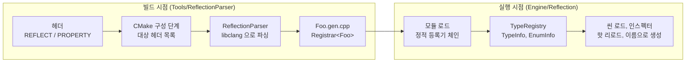

# Reflection — 런타임 타입 정보

> **[🏠 위키 홈으로 돌아가기](../../../README.md)** | **[📖 문서 지도](../../../docs/02_DocumentMap.md)**

## 이것은 무엇이고 왜 있나

C++ 는 실행 중에 "이 클래스에는 어떤 멤버가 있나"를 알려 주지 않습니다. 그런데 엔진에는 그 정보가 필요합니다.
씬 파일을 읽을 때는 `"CameraComponent"` 라는 글자로 컴포넌트를 만들어야 하고, 인스펙터는 멤버 목록을 보고 편집 필드를 그려야 합니다.
핫 리로드는 DLL 을 바꾸기 전에 멤버 값을 이름으로 저장했다가 새 DLL 의 객체에 다시 써 넣습니다.

리플렉션은 이 정보를 실행 중에 조회할 수 있게 만드는 계층입니다. 헤더에 `REFLECT`, `PROPERTY` 같은 표시를 달면,
빌드할 때 코드 생성기가 그 표시를 읽어 타입 설명(`TypeInfo`)을 만드는 C++ 소스를 생성합니다. 실행할 때는 그 설명이 레지스트리(`TypeRegistry`)에 등록됩니다.
언리얼의 `UCLASS`, `UPROPERTY` 와 UnrealHeaderTool 이 같은 구조입니다.

이 폴더는 실행 시점의 절반입니다. 타입 설명의 구조, 레지스트리, 그리고 설명을 읽어 일을 하는 도우미(이름으로 함수 부르기, 검증, API 문서 쓰기)가 있습니다.
빌드 시점의 절반인 코드 생성기는 [ReflectionParser](../../../Tools/ReflectionParser/README.md)입니다.

## 머릿속 그림

리플렉션은 빌드 시점과 실행 시점에 걸쳐 있습니다. 두 시점의 경계는 생성된 `.gen.cpp` 파일입니다.


```mermaid
flowchart LR
  subgraph Build["빌드 시점 (Tools/ReflectionParser)"]
    H["헤더<br/>REFLECT / PROPERTY"] --> Scan["CMake 구성 단계<br/>대상 헤더 목록"]
    Scan --> P["ReflectionParser<br/>libclang 으로 파싱"]
    P --> G["Foo.gen.cpp<br/>Registrar&lt;Foo&gt;"]
  end
  subgraph Run["실행 시점 (Engine/Reflection)"]
    G --> L["모듈 로드<br/>정적 등록기 체인"]
    L --> R["TypeRegistry<br/>TypeInfo, EnumInfo"]
    R --> U["씬 로드, 인스펙터<br/>핫 리로드, 이름으로 생성"]
  end
```

**어노테이션.** `REFLECT()`, `PROPERTY()`, `FUNCTION()`, `ENUM()` 은 일반 컴파일에서는 빈 매크로입니다(`ReflectionMacros.h`).
그래서 엔진 실행 파일에는 아무것도 붙지 않습니다. 코드 생성기가 `__REFLECT_PARSER__` 를 정의하고 헤더를 읽을 때만 clang 의 `annotate` 속성이 되어, 생성기가 그 표시를 찾을 수 있습니다.

**TypeInfo.** 타입 하나의 설명입니다. 이름, 부모 타입, 프로퍼티 목록, 함수 목록, 이벤트 목록을 가지고 있습니다.
프로퍼티마다 이름, 타입, 메모리 위치, 범위 같은 메타데이터가 있습니다. 컴포넌트 타입이면 그 컴포넌트를 만드는 함수(`_addComponent`)도 가지고 있습니다.
열거형은 `EnumInfo` 가 같은 역할을 합니다.

**TypeRegistry.** 이름으로 `TypeInfo` 를 찾는 전역 레지스트리입니다. 각 모듈의 생성 코드는 정적 등록기(`TypeRegistrar`)를 체인으로 매달아 둡니다.
모듈이 로드되면 엔진이 그 체인을 한 번에 등록합니다(`TypeRegistry::registerPendingTypes`).

**빌트인 타입.** `int32`, `string`, `vector` 처럼 헤더에 `REFLECT` 를 달 수 없는 타입은 `ReflectBuiltins.xxx` 한 파일에 적습니다.
생성기가 이 파일로 `ReflectBuiltins.gen.cpp` 를 만들고, 프로퍼티 타입을 해석할 때도 같은 파일을 읽습니다.

## 따라 해 보기 — 컴포넌트 하나를 리플렉션에 올리기

문을 여닫는 컴포넌트를 만들어, 씬 파일에서 이름으로 만들고 인스펙터에서 값을 고칠 수 있게 해 보겠습니다.
아래 `DoorComponent` 와 `DoorMode` 는 설명용 타입이고 저장소에는 없습니다.

### 1단계 — 헤더에 표시 달기

<!-- snippet: DoorComponent 선언(REFLECT, PROPERTY, FUNCTION, ENUM, 이벤트) — 5b U7 에서 문서 예시 테스트로 대조 -->
```cpp
#include "Engine/Object/Component/Component.h"

ENUM()
enum class DoorMode : uint8
{
    Swing = 0,
    Slide,
};

REFLECT()
class DoorComponent : public Component
{
public:
    REFLECT_BODY();

    FUNCTION()
    void open( float32 speed = 1.5f, DoorMode mode = DoorMode::Swing );

private:
    PROPERTY( Units = m, Min = 0, Max = 10 )
    float32 _width = 1.0f; /**< 문 폭 */

    PROPERTY()
    DoorMode _mode = DoorMode::Swing;

    PROPERTY( Category = "Events" )
    MulticastDelegate<void( int32 openCount, const string& reason )> _onOpened;
};
```

- `REFLECT()` 는 이 타입을 생성기의 대상으로 표시합니다.
- `REFLECT_BODY()` 는 `StaticType()` 을 선언합니다. 정의는 생성된 `.gen.cpp` 에 들어갑니다.
  생성 코드가 `private` 멤버의 위치를 `offsetof` 로 재야 하므로 `friend` 선언도 이 매크로에 들어 있습니다.
- `PROPERTY()` 를 단 멤버만 저장되고 인스펙터에 나옵니다. 괄호 안의 토큰(`Units`, `Min`)이 메타데이터입니다.
- `MulticastDelegate` 멤버에 `PROPERTY()` 를 달면 값이 아니라 **이벤트**로 등록됩니다. 저장되지 않고, 다른 오브젝트의 함수를 이름으로 연결하는 데 씁니다.

### 2단계 — 처음이면 CMake 구성을 다시 실행

이 헤더에 처음으로 `REFLECT` 나 `ENUM` 을 넣었다면 `cmake --preset <프리셋>` 을 다시 실행합니다.
생성기에 넘길 헤더 목록은 CMake 구성 단계에서 `REFLECT(` 줄이 있는 헤더를 찾아 만들기 때문입니다(`sw_addReflectionStep`).
다시 실행하지 않고 빌드하면 `DoorComponent::StaticType()` 이 정의되지 않았다는 링크 오류가 납니다.

### 3단계 — 빌드하고 확인

빌드하면 생성 폴더(`build/<프리셋>/generated/`)에 `DoorComponent.gen.cpp` 가 생깁니다.
`Component` 를 상속하고 `REFLECT_BODY()` 가 있는 추상이 아닌 타입이면, 생성 코드가 `TypeInfo::_addComponent` 에 `GameObject::addComponentTo<DoorComponent>` 를 넣습니다.
이제 씬 파일, 프리팹, 에디터의 "Add Component", `GameObjectManager::addComponentByName` 이 모두 이 컴포넌트를 이름으로 만들 수 있습니다.
따로 등록할 팩토리 테이블은 없습니다. 모듈이 언로드되면 생성 함수도 타입과 함께 정리됩니다.

생성기가 헤더에서 무엇을 읽었는지 보려면 [ReflectionParser 의 `--dump`](../../../Tools/ReflectionParser/README.md#생성기가-무엇을-읽었는지-보기)를 씁니다.
실행 중에 등록된 내용을 보려면 App 을 `-gv_dumpReflection=DoorComponent,DoorMode` 와 함께 실행합니다. 첫 프레임에 그 타입의 등록 내용이 로그에 남습니다(`TypeRegistry::describeType`).

### 4단계 — 실행 중에 조회하기

```cpp
#include "Engine/Reflection/ReflectionCore.h"

const TypeInfo* pType   = DoorComponent::StaticType();
const TypeInfo* pByName = engine::getTypeRegistry().findType( hashed_string( "DoorComponent" ) );
const utf8*     pText   = engine::getTypeRegistry().enumToString( DoorMode::Slide ); // "Slide"
```

게임 모듈과 GameFramework 는 `EngineServices.h` 를 include 할 수 없으므로 `game::getService<TypeRegistry>()` 로 레지스트리를 얻습니다. 어기면 `CheckEngineLayers.py` 가 막습니다.

## 작동 원리

### 등록 순서와 TypeInfo 의 수명

생성된 `.gen.cpp` 마다 타입별 `Registrar<T>` 가 있고, 그 정적 객체가 생성될 때 `TypeRegistrar` 를 모듈의 체인 앞에 매답니다.
이 시점에는 아직 레지스트리에 아무것도 들어가지 않습니다. 정적 초기화 순서는 모듈마다 다르고, 레지스트리가 먼저 만들어졌다는 보장이 없기 때문입니다.

모듈을 로드한 뒤 엔진이 `engine::registerModuleTypes( 모듈 이름 )` 을 부르면, 체인을 따라 등록 함수를 차례로 실행합니다.
한 모듈의 등록이 끝나면 조회 캐시를 한 번에 만듭니다(`buildLookupCaches`). 타입마다 캐시를 고치면 부모가 자식보다 늦게 등록되는 경우를 따로 처리해야 하기 때문입니다.

엔진 기동 단계 `ModuleTypes` 가 모든 타입 공급자(엔진, GameFramework, 키트, 게임 모듈)의 등록을 끝낸 뒤에야 씬을 읽습니다.
그 전에 씬을 읽으면 아직 로드되지 않은 모듈의 컴포넌트가 `MissingComponent` 로 만들어집니다.

`TypeInfo` 의 주소는 프로세스가 끝날 때까지 바뀌지 않습니다. 레지스트리는 `TypeInfo` 를 `unique_ptr` 로 보관하고, 핫 리로드로 모듈을 언로드할 때도 객체를 지우지 않습니다.
대신 내용을 비우고(`clearContent`) 정리되었다는 표시(`_bAlive`)만 남깁니다. 새 DLL 이 같은 이름의 타입을 다시 등록하면 같은 객체를 복원합니다.
그래서 `TypeInfo*` 를 오래 보관해도 댕글링 포인터가 되지 않습니다.

### 메모리 위치를 찾는 방법

보통 프로퍼티는 생성 코드가 `offsetof` 로 위치를 적습니다. 예외는 두 가지입니다.

**비트필드.** `offsetof` 를 쓸 수 없고, 생성기는 Debug 와 Release 의 레이아웃 차이를 모릅니다.
그래서 실행 중에 `PropertyInfo::resolveBitField` 가 그 빌드의 실제 레이아웃에서 비트 위치를 찾습니다.

**접근자 프로퍼티.** `PROPERTY()` 를 필드가 아니라 **값의 참조(`T&`)를 돌려주는 인자 없는 메서드**에 달면, 값은 그 메서드가 돌려주는 위치에 있는 것으로 등록됩니다.
생성 코드는 오프셋 대신 그 메서드를 부르는 `_pValueAccessor` 를 적고, 직렬화기와 인스펙터는 모두 그 위치를 읽고 씁니다.
씬 컴포넌트의 로컬 위치, 회전, 크기가 첫 예입니다. 값은 컴포넌트 안이 아니라 씬이 함께 쓰는 트랜스폼 저장소에 있습니다.

```cpp
PROPERTY( Name = "_localPosition", Category = "Transform", DisplayName = "Position" )
float3& getLocalPositionRef();
```

`Name` 은 저장 파일에 쓰는 키입니다. 필드였던 값을 메서드로 옮길 때 옛 필드 이름을 그대로 쓰면 씬과 프리팹 파일을 고치지 않아도 됩니다.
메서드가 값으로 돌려주거나, 인자가 있거나, 정적이면 생성기가 멈춥니다. 컨테이너와 비트필드에는 쓸 수 없습니다.
접근자 프로퍼티가 하나라도 있는 타입은 객체를 통째로 복사하는 빠른 경로(`TypeInfo::usesPodCopyFastPath`)를 쓰지 않습니다.

### 이름으로 함수 부르기와 이벤트

`FUNCTION()` 을 단 함수는 인자의 이름, 타입, 기본 인자를 `FunctionInfo::_listParameter` 에 남기고 반환 타입을 `_pReturnType` 에 남깁니다.
기본 인자는 C++ 식의 글자 그대로 저장되고, 부를 때 인자 타입으로 변환됩니다.

콘솔, 비주얼 스크립팅, 기믹 연결, 에디터처럼 타입을 모르는 쪽은 `ReflectionInvoke` 로 부릅니다.
인자는 타입 이름이 붙은 값(`ReflectValue`)의 목록이고, 각 인자는 받는 타입으로 변환됩니다.
같은 타입은 그대로 넘기고, 숫자끼리는 범위 안일 때만 변환하며, 소수를 정수로 바꾸는 변환은 거절합니다.
글자는 `"35"`, `"1, 2, 3"`, 열거자 이름 같은 형태로 읽고, 뒤쪽에 빠진 인자는 기본 인자로 채웁니다.

<!-- snippet: ReflectionInvoke 로 부르기와 이벤트 연결 — 5b U7 에서 문서 예시 테스트로 대조 -->
```cpp
ReflectValue result;
ReflectionInvoke::callWithText( *pType->findMethodInHierarchy( "open" ), pDoor, { "2" }, &result ); // 콘솔에서 open( 2 )

const EventInfo* pEvent = pType->findEventInHierarchy( "_onOpened" );
ReflectionInvoke::bindEventToFunction( *pEvent, pDoor, *pLampType, "turnOn", pLamp ); // 문이 열리면 램프를 켠다
```

이벤트를 직접 받으려면 `ReflectionInvoke::bindEvent` 에 `ReflectEventHandler::create( 함수 )` 를 넘깁니다. 받는 함수는 인자를 `vector<ReflectValue>` 로 받습니다.
`FunctionInfo::_invoker` 를 직접 부를 때는 인자를 그 C++ 타입 그대로 넣어야 합니다. `TaskValue` 는 타입 변환을 하지 않기 때문입니다. 결과 코드는 `ReflectCallResult` 입니다.

이벤트에는 표시용 메타데이터(`Category`, `DisplayName`, `Tooltip`, `Meta`, `HideInInspector`, `Name`)만 붙일 수 있습니다.
그 밖의 토큰을 붙이거나 델리게이트의 반환 타입이 `void` 가 아니면 생성기가 오류를 냅니다.

### 역할 플래그 — 네트워크, 세이브, 시퀀서

프로퍼티에 역할을 표시하면 그 역할을 맡은 시스템이 표시된 프로퍼티만 골라 씁니다. 읽는 쪽의 도우미는 `PropertyRoleUtil` 에 있습니다.

```cpp
PROPERTY( RepNotify = onHealthReplicated ) // Replicated 도 켠다
int32 _health = 100;
PROPERTY( SaveGame )
int32 _gold = 0;
PROPERTY( Interp )
float32 _opacity = 1.0f;
```

| 플래그 | 읽는 시스템 | 부르는 함수 |
|---|---|---|
| `Replicated`, `RepNotify` | 네트워크 복제 | `collectReplicatedProperties`, `callRepNotify` |
| `SaveGame` | 세이브 | `SerializeContext::setSaveGameOnly` |
| `Interp` | 시퀀서 값 트랙 | `collectInterpProperties`, `applyInterpolated` |

`RepNotify` 함수는 `void fn()` 이나 `void fn( const T& oldValue )` 여야 하고, 생성기가 이 형태를 검사합니다. 네트워크 쪽은 받은 값을 쓴 **뒤에** `callRepNotify` 를 부릅니다.

`SaveGame` 은 옵트인입니다. 타입과 그 부모에 `SaveGame` 프로퍼티가 하나라도 있으면(`TypeInfo::hasSaveGameProperty`) 세이브는 그 프로퍼티만 읽고 씁니다.
읽을 때 나머지 프로퍼티는 지금 값을 그대로 두고 기본값으로도 되돌리지 않습니다. 지금은 태그 바이너리 형식(`Archive::serializeObject`)만 이 플래그를 봅니다.

`Interp` 는 숫자, `float2`, `float3`, `float4`, `quaternion` 에만 붙일 수 있고, 다른 타입이면 생성기가 오류를 냅니다.
섞을 때 정수는 반올림하고 쿼터니언은 slerp 로 보간합니다.

### 인스펙터 표시 메타데이터

```cpp
PROPERTY()
bool _bEnabled = false;
PROPERTY( EditCondition = "_bEnabled" ) // 거짓이면 편집을 막는다
float32 _speed = 1.0f;
PROPERTY( EditCondition = "!_bEnabled", EditConditionHides ) // 막지 않고 숨긴다
int32 _fallback = 0;
PROPERTY( Units = cm, Min = 0, Max = 1000, UiMin = 50, UiMax = 250 )
float32 _height = 180.0f;
```

**편집 조건.** `EditCondition` 은 `"name"`, `"!name"`, `"mode == Orbit"`, `"mode != Off"` 형태를 받습니다.
가리키는 이름이 부모 클래스의 멤버일 수 있어 생성기는 형태만 검사하고, 이름은 실행 중에 `PropertyEditCondition::parse` 가 찾습니다.
`ReflectionDisplayMetaTest.EveryEditConditionResolves` 가 등록된 모든 타입의 조건이 실제로 찾아지는지 확인합니다.

**범위.** 슬라이더는 `UiMin` 과 `UiMax` 안에서 움직이고, 둘이 없으면 `Min` 과 `Max` 를 씁니다. 값은 언제나 `Min` 과 `Max` 로 제한합니다(`InspectorPropertyLayout::getNumericRange`).

**단위.** `Units` 는 저장된 값의 단위입니다. `ReflectUnits.h` 의 단위 목록에 있어야 하고, 없으면 생성기가 오류를 냅니다.
인스펙터는 `rad` 를 도로, `ratio` 를 백분율로 바꿔 보여 줍니다. 다른 단위로 적힌 글자는 `ReflectUnitUtil::parseValueInUnit( "150 cm", "m", out )` 으로 변환합니다.

그 밖에 `ColorHdr`(HDR 색 선택기), `Multiline`(여러 줄 글), `AssetPath` 와 `FileFilter = "*.png;*.dds"`(끌어다 놓는 경로 거르기)가 있습니다.
C 고정 배열(`int32 _arrSlot[3]`)은 `std::array` 와 같은 고정 길이 시퀀스로 등록되고, 인스펙터는 원소 추가와 비우기 버튼을 그리지 않습니다.

모든 토큰과, 같은 뜻으로 받아 주는 다른 철자는 `Source/Core/Predefined/AnnotationMeta.txt` 에 있습니다. 생성기는 이 파일에 없는 토큰을 만나면 오류로 멈춥니다.

### 검증 함수

<!-- snippet: Validate 타입 검증과 프로퍼티 검증 함수 — 5b U7 에서 문서 예시 테스트로 대조 -->
```cpp
REFLECT( Validate = validateRange )
struct SpawnerComponent : public Component
{
    REFLECT_BODY();

    PROPERTY( Validate = validatePrefab )
    string _prefab;
    PROPERTY()
    int32 _min = 0;
    PROPERTY()
    int32 _max = 10;

    void validatePrefab( ValidationContext& context ) const { if ( _prefab.empty() ) context.addWarning( "no prefab" ); }
    void validateRange( ValidationContext& context ) const { if ( _max < _min ) context.addError( "min > max" ); }
};
```

검증 함수는 같은 타입의 `void fn( ValidationContext& context )` 이고, `const` 는 붙여도 되고 안 붙여도 됩니다. 함수가 없거나 형태가 다르면 생성기가 오류를 냅니다.

`ReflectionValidation::validateObject` 는 상속한 프로퍼티의 검증 함수, 값으로 가진 리플렉션 구조체와 그 시퀀스 원소, 타입 검증 함수를 차례로 실행합니다. 타입 검증은 부모부터 실행합니다.
검증 함수가 하나도 없는 타입은 `hasValidator` 가 false 라 건너뜁니다. 이 값은 등록이 끝날 때 한 번 계산합니다.

게임 오브젝트는 `ObjectValidation::reportGameObject` 가 컴포넌트마다 검증하고, 결과를 `ValidationIssueLog` 에 오브젝트 id 별로 기록합니다. 검증은 세 시점에 실행됩니다.

1. 로드가 끝나 `onPostLoad` 까지 불린 뒤(`ObjectStateBatch::finish`)
2. 씬이나 프리팹을 글자 형식으로 저장할 때(`ObjectStateSerializer::saveToText`)
3. 인스펙터에서 값을 고친 뒤

플레이나 되돌리기용 바이너리 스냅숏은 검증하지 않습니다. 검증은 결과를 기록만 하고, 값을 고치거나 로드와 저장을 멈추지 않습니다.
에디터의 맵 검사 패널이 `ValidationIssueLog::collectIssues` 로 결과를 보여 줍니다.

### API 문서 만들기

```bash
cd build/Ninja-Debug/Bin && ./App.exe --write-reflection-docs=../Docs/Reflection
```

App 이 창 없이 실행되고, 모든 모듈의 타입 등록(`ModuleTypes` 단계)이 끝난 뒤 `index.md` 와 모듈마다 문서 한 장을 씁니다(`ReflectionDocWriter`).
각 장에는 타입의 부모와 분류, 프로퍼티 표, 함수, 이벤트, 열거형 값이 들어갑니다. 프로퍼티 표에는 타입, 기본값, 범위, 역할 플래그, 단위, 편집 조건, 설명이 있습니다.
타입을 이름 순으로 쓰므로 등록 내용이 같으면 결과도 바이트 단위로 같습니다. 이 문서는 빌드 산출물이라 커밋하지 않습니다.
분류, 설명, 단위 같은 에디터 메타데이터는 Shipping 빌드에 없으므로 Dev 빌드에서 만듭니다.

## 확장하는 법

### 새 어노테이션 토큰

토큰 하나는 생성기의 필드 목록 한 줄과 철자 목록 한 줄로 정해집니다. 절차는 [ReflectionParser 의 새 어노테이션 필드](../../../Tools/ReflectionParser/README.md#새-어노테이션-필드-추가하기)에 있습니다.
실행 중에도 그 값을 읽어야 하면 `ReflectionTypes.h` 의 `PropertyInfo` 나 `TypeInfo` 에 같은 이름의 멤버를 추가합니다.

### 새 빌트인 타입

`REFLECT` 를 달 수 없는 타입(표준 라이브러리 타입, 수학 타입)은 `ReflectBuiltins.xxx` 에 한 줄을 추가합니다.
엔진은 이 파일을 include 해서 타입을 등록하고, 생성기는 같은 파일을 읽어 프로퍼티 타입 이름을 해석합니다. 두 쪽이 같은 파일을 읽으므로 따로 맞출 곳이 없습니다.

### 직접 만든 컨테이너

컨테이너 타입 선언에 `REFLECT_CONTAINER( Sequence )`, `REFLECT_CONTAINER( Sequence, List )`, `REFLECT_CONTAINER( Map )` 중 하나를 한 번 답니다.
그 컨테이너를 쓰는 필드에는 `PROPERTY()` 만 달면 됩니다.

### 이름 바꾸기와 별칭

실제 게임 데이터가 없는 지금은 타입, 프로퍼티, 열거자 이름을 바꾸면 `Resource/` 의 데이터, 테스트, 스크립트를 모두 새 이름으로 고쳐 씁니다.
옛 이름은 어디에도 남기지 않으며, 엔진과 게임 코드에는 별칭이 하나도 없습니다.
`ResourceDataSchemaTest.EveryResourceDataFileLoadsWithoutUnknownNames` 가 `Resource/` 의 모든 데이터를 모르는 키, 타입, 열거자 경고 없이 읽을 수 있는지 확인합니다.

별칭은 고쳐 쓸 수 없는 데이터가 생긴 뒤에만 씁니다. 배포한 게임의 세이브나 사용자가 만든 콘텐츠가 그런 데이터입니다. 언리얼의 CoreRedirects 에 해당합니다.

```cpp
REFLECT( Alias = "OldDoor" )          // 타입
PROPERTY( Alias = "hp, HitPoints" )   // 프로퍼티. 여러 개면 따옴표로 묶는다
ENUM( ValueAlias = "OldSwing:Swing" ) // 열거자
```

등록하면 직렬화기가 옛 이름을 레지스트리의 별칭(`registerTypeAlias`, `registerEnumAlias`)으로 찾습니다.

## 함정과 주의

**헤더에 처음 `REFLECT` 나 `ENUM` 을 넣었으면 CMake 구성을 다시 실행하세요.** 대상 헤더 목록은 구성 단계에서 만듭니다. 증상은 `X::StaticType()` 미정의 링크 오류입니다.

**인스턴스를 만들 수 없는 부모도 등록하세요.** 리플렉션된 클래스의 부모가 등록되지 않으면 자식의 부모 체인이 끊깁니다.
추상 클래스는 `REFLECT( Abstract )` 로 등록합니다(`ReflectionTypeInfoTest.EveryReflectedParentIsRegistered`).

**`REFLECT_BODY()` 를 쓰는 줄 안에 주석을 넣지 마세요.** 매크로 본문의 주석 줄에 줄 이음(`\`)이 빠지면 매크로가 거기서 끊기고 나머지 줄이 네임스페이스 범위로 새어 나갑니다.

**`.gen.cpp` 를 손으로 고치지 마세요.** 다음 빌드에서 생성기가 덮어씁니다. 헤더의 표시나 생성기의 템플릿을 고칩니다.

**직렬화할 때는 부모의 프로퍼티까지 도세요.** `TypeInfo::forEachProperty` 의 기본값은 `bIncludeBase=false` 입니다.
직렬화기는 `true` 를 넘겨야 부모에 있는 프로퍼티(트랜스폼)가 저장됩니다. 기본값 적용(`applyTypeDefaults`)은 루트 타입에서 파생 타입 순서로 진행합니다.

**벡터 기본값과 JSON 의 `float4` 글자는 쉼표로 구분하세요.** 공백으로 구분하면 파싱이 경고 없이 실패합니다.

**enum 값은 `readValueFromMemory` 와 `writeValueToMemory` 로만 읽고 쓰세요.** `getValuePtr<int32>` 로 쓰면 `uint8` enum 뒤의 3바이트를 덮어씁니다.
열거자 값은 생성 코드에서 컴파일러가 계산하므로, 식으로 적은 값도 정확합니다.

**비트 플래그는 `ENUM( Flags )` 로만 표시하세요.** 값의 모양을 보고 플래그인지 추측하지 않습니다.
비트 연산자(`|`, `&`, `^`, `~`)는 `Core/Common/EnumUtil.h` 의 제네릭 연산자이고, 생성기는 그 연산자를 켜는 `IsBitFlagEnum` 특수화만 만듭니다.
특수화는 타깃마다 하나인 `FlagOps.gen.h` 로 모여 그 타깃의 모든 소스에 강제 include 됩니다. 이 헤더는 열거형을 전방 선언만 하고 원본 헤더를 include 하지 않습니다.
그래서 클래스 안에 중첩된 `ENUM( Flags )` 는 `FlagOps.gen.h` 가 전방 선언할 수 없으므로 생성기가 일부러 실패합니다.

**에셋의 enum 글자는 `EnumInfo::tryParseText` 로 읽으세요.** 머티리얼 같은 에셋이 모르는 이름이나 `Count` 같은 센티널 값을 적었으면 경고하고 값을 쓰지 않습니다.
에셋에서 읽은 enum 타입 이름은 `findInterned` 로 찾습니다. 코드가 넘긴 이름(전역 변수의 `#enumType`)은 `hashed_string` 생성자로 찾습니다.
기동 초기에는 아직 아무도 그 이름을 인턴하지 않아서 `findInterned` 가 빈 해시를 돌려주기 때문입니다. 테스트 프로세스에서는 다른 테스트가 먼저 인턴해 두어 이 문제가 가려집니다.

**타입 비교에 포인터 동일성만 쓰지 마세요.** `castTo` 는 부모 포인터(`_pParentType`)와 세대 검사를 하는 캐시(`TypeLookupCache`)를 씁니다.
포인터가 다르면 전체 이름(FQN)을 한 번 더 비교합니다. 테스트용 목 타입의 `StaticType()` 은 레지스트리 밖의 사본이라 포인터가 다르기 때문입니다.

**부모 체인이 순환할 수 있다고 가정하세요.** `registerClass` 는 공개 API 라 넘겨받은 부모 이름을 검사하지 않습니다. 체인을 따라가는 코드는 걸음 수로 깊이를 제한해 멈춥니다.
상속 캐시를 비울 때는 `clearInheritedProperties` 를 씁니다.

**단위에 `/` 가 들어가면 따옴표로 감싸세요.** `Units = "m/s"` 로 씁니다. clang-format 이 `m/s` 를 `m / s` 로 띄우고, 따옴표 없는 값은 첫 공백에서 끝나 `m` 이 됩니다.
가속도는 `m/s^2` 가 아니라 `m/s2` 로 씁니다. 단위 목록에 없는 표시(`HP`, `dB`, `px`, `BPM`)만 `Meta = "Units=HP"` 로 적습니다.
목록에 있는 단위를 `Meta` 로 적으면 철자 검사를 건너뛰게 되므로 생성기가 거절합니다(`ReflectionParserTest.DisplayMetadataIsValidated`).

## 더 볼 곳

- [ReflectionParser](../../../Tools/ReflectionParser/README.md) — 코드 생성기의 구조, 명령줄 인자, `--dump`
- [Object](../Object/README.md) — 컴포넌트의 수명과 틱
- [Serialization](../Serialization/README.md) — 리플렉션 정보를 읽어 저장하는 쪽
- [ARCHITECTURE.md](../../../ARCHITECTURE.md) — 타깃 그래프와 리플렉션 코드 생성의 위치

자주 여는 파일은 다음과 같습니다. 함수별 규칙은 헤더 주석에 있습니다.

| 파일 | 내용 |
|---|---|
| `ReflectionMacros.h` | `REFLECT`, `PROPERTY`, `FUNCTION`, `ENUM`, `REFLECT_BODY` |
| `ReflectionTypes.h` | `TypeInfo`, `PropertyInfo`, `FunctionInfo`, `EventInfo` |
| `TypeRegistry.h` | 등록, 조회, 별칭, enum 글자 변환 |
| `ReflectionInvoke.h` | 이름으로 부르기, 이벤트 연결 |
| `PropertyRoleUtil.h` | 역할 플래그를 읽는 도우미 |
| `ReflectionValidation.h` | 검증 함수 실행과 결과 기록 |
| `ReflectBuiltins.xxx` | 빌트인 타입 목록 |
| `Source/Core/Predefined/AnnotationMeta.txt` | 어노테이션 토큰과 철자 |
