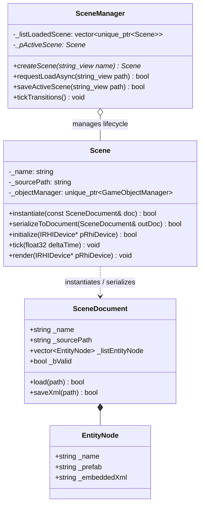

# 씬 서브시스템 가이드 (Scene Subsystem Guide)

이 문서는 SW Engine의 **씬 서브시스템(Scene Subsystem)**의 아키텍처, 씬 문서(`SceneDocument`), 비동기 로딩 파이프라인, 그리고 씬 인스턴스화/직렬화 구조를 설명합니다.

---

## 1. 아키텍처 개요 (Architecture Overview)

씬 시스템은 게임 월드(Level/Map)의 구성 요소와 생명주기를 캡슐화하여 관리합니다.



### 핵심 클래스 역할
1. **`Scene`**: 단일 게임 월드 인스턴스. 고유의 `GameObjectManager`, 활성 **게임** 카메라(`ActiveGameCamera`), 머티리얼 캐시 참조를 소유합니다. 에디터 뷰포트 카메라는 Editor 모듈이 소유하며 씬 직렬화에서 제외됩니다.
2. **`SceneDocument`**: 씬 파일(`.scene.xml`, `.scene.bin`)의 데이터 모델. 씬 메타데이터와 엔티티 노드(`SceneDocument::EntityNode`) 목록을 담으며, XML 및 바이너리(SCN1) 포맷 직렬화/역직렬화를 담당합니다.
3. **`SceneManager`**: 로드된 씬들의 수명주기, 활성 씬(`ActiveScene`) 추적 및 멀티스레드 비동기 씬 로딩/트랜지션을 제어하는 중앙 관리자입니다.

---

## 2. 씬 문서 포맷 (Scene Document Formats)

### 2.1 XML 포맷 (`.scene.xml`)
개발 및 저작(Editor) 단계에서 사용되는 기본 텍스트 포맷입니다:
```xml
<?xml version="1.0" encoding="utf-8"?>
<Scene formatVersion="0" name="Town01">
    <entities>
        <entity name="PlayerSpawn" prefab="game/demo/prefabs/Hero.prefab.json"/>
        <entity name="ShopKeeper" prefab="game/demo/prefabs/NPC.prefab.json"/>
        <entity name="CustomLight">
            <GameObject _schemaVersion="0" _name="CustomLight" _bActive="true">
                <vector _name="_listComponent">
                    <MeshComponent _schemaVersion="0" _meshId="Sphere" _localPosition="0,2,0"/>
                </vector>
            </GameObject>
        </entity>
    </entities>
</Scene>
```

### 2.2 바이너리 포맷 (`.scene.bin` — SCN1)
배포(Shipping) 빌드 및 고속 스트리밍을 위한 바이너리 쿠킹 포맷입니다:
- **Magic**: `0x53434E31` (`SCN1`)
- **Version**: `0`
- **Name**: `u32 length` + `UTF-8 bytes`
- **Entities**: `u32 count` + 각 엔티티(`name`, `prefabPath`, `embeddedXml`)

---

## 3. 비동기 씬 스트리밍 파이프라인 (Async Scene Streaming)

1. `SceneManager::requestLoadAsync(path)`:
   - `TaskManager` 워커 스레드에 비동기 태스크(`SceneLoadAsync`)를 디스패치합니다.
2. 백그라운드 워커:
   - `doc.load(path)`로 XML 또는 SCN1 바이너리를 파싱합니다.
   - 새 `Scene` 객체를 생성하고 `Scene::instantiate(doc)`를 통해 엔티티와 프리팹을 스폰하고 부모-자식 계층(`rebindSceneHierarchy`)을 구성합니다.
3. 메인 스레드 (`SceneManager::tickTransitions()`):
   - 비동기 로드가 완료되면 안전한 프레임 경계에서 기존 활성 씬을 언로드하고 새 씬으로 스왑(Swap)합니다.

---

## 4. C++ 사용 예제

### 4.1 씬 생성 및 오브젝트 추가
```cpp
#include "Engine/Scene/Scene.h"
#include "Engine/Scene/SceneManager.h"

// 매니저를 통한 씬 생성
sw::Scene* pScene = sceneManager.createScene("MainLevel");
sw::GameObject* pPlayer = pScene->getObjectManager()->createGameObject(sw::hashed_string("Player"));
```

### 4.2 씬 문서 저장 및 로드
```cpp
#include "Engine/Scene/SceneDocument.h"

// 활성 씬을 XML 씬 문서로 저장
sw::SceneDocument doc{};
pScene->serializeToDocument(doc);
doc.saveXml("Resource/game/demo/maps/Level01.scene.xml");

// 독립 씬 문서 로드 및 인스턴스화
sw::SceneDocument loadedDoc{};
if (loadedDoc.load("Resource/game/demo/maps/Level01.scene.xml"))
{
    sw::Scene newScene("Level01");
    newScene.instantiate(loadedDoc);
}
```
