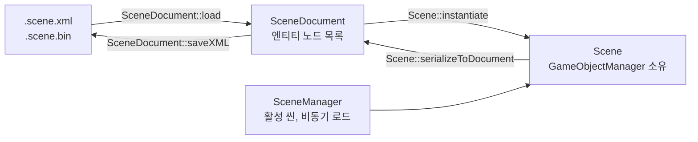

# Scene — 씬 파일, 씬 로드, 씬 전환

## 이것은 무엇이고 왜 있나

**씬**(`Scene`)은 게임 오브젝트를 담는 월드 하나입니다. 타이틀 화면, 마을, 던전처럼 한 번에 하나씩 열리는 단위가 씬입니다.
언리얼의 레벨(맵), 유니티의 Scene에 해당합니다. 씬 하나는 [Object](../Object/README.md)의 `GameObjectManager` 를 하나 소유하고, 그 매니저가 씬 안의 오브젝트를 관리합니다.

이 폴더는 씬을 파일로 저장하고, 파일에서 다시 만들고, 실행 중에 다른 씬으로 바꾸는 일을 맡습니다.
씬 파일을 읽는 일은 워커 스레드에서 하므로 게임이 멈추지 않고, 다 읽은 씬은 프레임 경계에서 기존 씬과 교체됩니다.
배포 빌드에서는 XML 씬 파일을 미리 바이너리로 쿠킹해 두고 그것을 읽습니다.

씬을 직접 다루는 일은 많지 않습니다. 게임은 보통 시작 씬을 정해 두고(`gamesettings` 의 `startMap`), 에디터에서 씬을 편집해 저장합니다.
이 문서는 코드에서 씬을 저장하고 열고 바꾸는 방법과, 그때 엔진이 지키는 규칙을 설명합니다.

## 머릿속 그림


```mermaid
flowchart LR
  File[".scene.xml<br/>.scene.bin"] -- "SceneDocument::load" --> Doc["SceneDocument<br/>엔티티 노드 목록"]
  Doc -- "Scene::instantiate" --> Scene["Scene<br/>GameObjectManager 소유"]
  Scene -- "Scene::serializeToDocument" --> Doc
  Doc -- "SceneDocument::saveXML" --> File
  Manager["SceneManager<br/>활성 씬, 비동기 로드"] --> Scene
```

이 그림에서 기억할 개념은 네 가지입니다.

**씬 문서.** `SceneDocument` 는 씬 파일을 메모리에 읽어 둔 데이터입니다. 씬 이름과 엔티티 노드(`SceneObjectNode`) 목록을 가지고 있습니다.
엔티티 노드 하나가 게임 오브젝트 하나가 됩니다. 문서는 아직 오브젝트가 아니므로, 오브젝트로 만드는 일은 `Scene::instantiate` 가 합니다.

**씬 매니저와 활성 씬.** `SceneManager` 는 엔진 서비스 하나이고, 로드된 씬과 그중 **활성 씬**을 관리합니다.
활성 씬은 매 프레임 틱되고 화면에 그려지는 씬입니다. 다른 씬을 열면 매니저가 워커에서 읽고, 다 읽으면 활성 씬을 교체합니다.

**파일 id.** 씬 파일의 엔티티마다 `id` 속성이 있습니다. 이 값은 실행 중의 오브젝트 id와 다른 번호이고, 저장할 때마다 같은 값을 다시 씁니다.
엔티티 사이의 부모 관계와 다른 오브젝트를 가리키는 핸들은 이 파일 id로 저장됩니다. 유니티의 fileID와 같은 역할입니다.

**프리팹 엔티티.** 프리팹에서 만든 엔티티는 프리팹 경로와, 프리팹과 다른 값(오버라이드)만 저장합니다.
그래서 프리팹을 고치면 씬에 놓인 인스턴스에도 퍼지고, 인스턴스에서 바꾼 값은 남습니다. 언리얼과 유니티의 프리팹 인스턴스와 같습니다.

## 따라 해 보기 — 씬을 저장하고, 다시 열고, 오브젝트를 가지고 넘어가기

Empty 게임에서 지금 씬을 새 파일로 저장하고, 그 파일을 다시 열어 보겠습니다. 마지막으로 플레이어 오브젝트가 씬을 바꿔도 사라지지 않게 만듭니다.
게임 코드는 엔진 서비스 헤더를 직접 include하지 않으므로, 씬 매니저는 `game::getService<SceneManager>()` 로 얻습니다.

### 1단계 — 지금 씬 저장하기

<!-- snippet: 활성 씬을 새 경로로 저장 — 5b U7 에서 문서 예시 테스트로 대조 -->
```cpp
#include "Engine/Scene/SceneManager.h"
#include "GameFramework/Base/Foundation/Framework/GameService.h"

SceneManager* pSceneManager = game::getService<SceneManager>();
if ( pSceneManager->saveActiveScene( "game/empty/maps/mylevel.scene.xml" ) == false )
{
    // 저장이 막혔거나(모듈 리로드 중) 활성 씬이 없다. 이유는 로그에 있다.
}
```

`saveActiveScene` 은 활성 씬의 오브젝트를 XML 씬 파일로 씁니다. 경로는 `Resource/` 기준의 리소스 경로입니다.
경로를 비우면 씬을 읽어 온 파일에 덮어씁니다. 쿠커가 처리하지 않는 확장자를 주면 `.scene.xml` 로 바꿔 저장하고 경고를 남깁니다.

저장한 파일을 열어 보면 엔티티마다 `id` 와 `name` 속성이 있고, 오브젝트 상태가 `<GameObject>` 아래에 들어 있습니다.
씬 파일은 이렇게 엔진 직렬화기로 씁니다. 손으로 쓴 XML은 형식이 조금만 틀려도 읽히지 않습니다.

### 2단계 — 다른 씬 열기

<!-- snippet: requestLoadFuture 로 씬 열기 — 5b U7 에서 문서 예시 테스트로 대조 -->
```cpp
TaskFuture<Scene*> future = pSceneManager->requestLoadFuture( "game/empty/maps/mylevel.scene.xml" );
```

이 호출은 바로 돌아옵니다. 씬 파일은 워커 스레드에서 읽고, 다 읽으면 다음 프레임의 `SceneManager::tickTransitions` 가 활성 씬을 교체합니다.
`tickTransitions` 는 App의 메인 루프가 매 프레임 부르므로 게임 코드에서 부를 필요가 없습니다.
로그에는 `[SceneLoad] 'game/empty/maps/mylevel.scene.xml' 엔티티 N개` 와 `Active scene swapped to '…'` 가 차례로 나옵니다.

`future` 는 로드가 끝나면 새 활성 씬을, 실패하거나 다른 요청에 밀려나면 `nullptr` 를 줍니다. 결과가 필요 없으면 버려도 됩니다.
게임의 첫 씬은 `GameInstanceBase::requestFirstScene` 으로 엽니다. 이 함수는 같은 일을 하면서 로딩 화면과 `SceneLoadRequestedEvent`, `SceneLoadCompletedEvent` 도 처리합니다.
`SceneManager` 를 직접 부른 로드에는 이 이벤트가 나오지 않습니다.

코드를 고치지 않고 저장한 씬을 시작 씬으로 띄워 보려면 App 인자를 씁니다.

```powershell
cd build/Ninja-Debug/Bin
./App.exe "-gv_firstScene=game/empty/maps/mylevel.scene.xml"
```

### 3단계 — 오브젝트를 가지고 다음 씬으로 넘어가기

씬이 바뀌면 이전 씬의 오브젝트는 모두 지워집니다. 플레이어처럼 다음 씬에도 있어야 하는 오브젝트는 표시해 둡니다.

<!-- snippet: markPersistent 로 루트 오브젝트 가져가기 — 5b U7 에서 문서 예시 테스트로 대조 -->
```cpp
pSceneManager->markPersistent( pPlayer );   // pPlayer 는 루트 오브젝트여야 한다
```

GameFramework의 `DontDestroyOnLoadComponent` 를 오브젝트에 붙여도 같습니다. 이 컴포넌트가 `onBeginPlay` 에서 `markPersistent` 를 부릅니다.
유니티의 `Object.DontDestroyOnLoad` 에 해당합니다.

표시한 오브젝트는 다음 씬으로 옮겨지는 것이 아니라, 같은 오브젝트 id와 컴포넌트 id로 새 씬에 **다시 만들어집니다**.
그래서 핸들은 그대로 이어지지만 포인터와 리플렉션되지 않은 런타임 상태는 새것이 되고, `onBeginPlay` 가 다시 불립니다.
루트 오브젝트가 아니거나 월드가 플레이 중이 아니면 경고만 남기고 무시합니다. 플레이를 멈추면 표시도 사라집니다.

## 작동 원리

### 씬 로드 순서

씬은 모든 모듈이 타입 등록을 끝낸 뒤에만 읽습니다. 기동 단계 `ModuleTypes`([Engine](../README.md)의 "기동과 종료")에서 호스트가 GameFramework, 키트, 게임 모듈을 로드해 타입을 등록하고,
마지막에 `TypeRegistry::markAllModuleTypesRegistered` 를 부릅니다. 그 전에 씬을 읽으면 아직 등록되지 않은 컴포넌트가 `MissingComponent` 가 되기 때문입니다.
그래서 그 전에 온 `requestLoadFuture` 와 `SceneCooker::cookAllScenes` 는 오류를 남기고 거절합니다(`SceneTest.SceneIsNotReadBeforeEveryModuleRegisteredItsTypes`).

로드는 다음 순서로 진행합니다.

1. `requestLoadFuture` 가 워커 작업 하나를 띄웁니다. 이미 로드가 진행 중이면 이 요청은 대기열로 갑니다.
2. 워커가 `SceneDocument::load` 로 XML이나 바이너리 파일을 읽고, 새 `Scene` 을 만들어 `instantiate` 로 엔티티와 프리팹을 오브젝트로 만듭니다.
3. 메인 스레드의 `tickTransitions` 가 끝난 로드를 발견하면, 프레임 경계에서 이전 활성 씬을 언로드하고 새 씬을 활성으로 바꿉니다.

대기열은 요청 하나만 보관합니다. 새 요청이 오면 대기 중이던 요청은 밀려나고, 그 `future` 는 `nullptr` 로 끝납니다.
게임 인스턴스는 에디터보다 먼저 시작하므로, 게임의 첫 씬 요청 뒤에 온 에디터의 시작 씬(`-gv_editorStartupScene`)이 마지막 요청으로 남아 열립니다.
로드하는 동안 리플렉션 타입이 바뀌면(모듈 핫 리로드) 매니저는 `TypeRegistry::getGeneration` 이 달라진 것을 보고 그 씬을 다시 읽습니다.

### 저장과 로드에서 오브젝트를 잇는 방법

`instantiate` 는 모든 엔티티를 하나의 상태 로드 배치(`ObjectStateBatch`)로 읽습니다. 오브젝트를 모두 만들고, 상태를 모두 읽은 다음, 마지막에 `finish()` 가 부모 관계와 핸들을 한 번에 연결합니다.
그래서 파일에서 자식이 부모보다 앞에 있어도 됩니다.

씬 컴포넌트의 부모는 세 필드로 저장됩니다. 부모 오브젝트의 이름(`_attachOwner`), 부모 오브젝트의 파일 id(`_attachOwnerID`), 부모 컴포넌트의 안정 키(`_attachComponent`)입니다.
안정 키는 `CameraComponent#0` 처럼 "컴포넌트 이름#같은 이름 중 순번" 형식이고, `ComponentStableKey` 가 만듭니다.

- 같은 오브젝트 안의 소켓에 붙었으면 소유자 필드가 비어 있습니다.
- 다른 오브젝트에 붙었으면 이름과 파일 id가 함께 저장됩니다. 로드할 때는 같은 배치에서 그 파일 id를 찾습니다.
- 찾지 못한 부모를 다른 id 공간으로 저장한 경우에는 id가 0이고 이름만 남습니다. 이때는 같은 배치에 저장된 이름에서만 찾습니다.

매니저 전체에서 이름으로 부모를 찾지 않는 이유가 있습니다. 매니저는 이름이 겹치면 `Rig` 를 `Rig_2` 로 바꾸므로, 이름으로 찾으면 복제본이 원본에 붙는 식으로 엉뚱한 오브젝트에 붙습니다.
찾지 못한 부모 참조는 지우지 않고 보관했다가(`SceneComponent::keepUnresolvedAttach`) 다음 저장에서 그대로 다시 씁니다. 부모가 돌아오면 다음 로드에서 붙습니다.
프리팹 파일은 오브젝트 하나만 담으므로 파일 id가 없고, 다른 오브젝트로의 부착도 싣지 않습니다.

다른 오브젝트를 가리키는 `GameObjectHandle` 프로퍼티도 같은 방식으로 저장됩니다. 저장할 때 런타임 id를 파일 id로 바꾸고(`ObjectSaveOptions::getSavedObjectID`), 읽을 때 배치가 이번 실행의 오브젝트로 되돌립니다.
`Scene` 은 런타임 id와 파일 id의 대응을 보관하다가(`collectSavedIDMap`) 저장할 때 같은 파일 id를 다시 씁니다. 지운 오브젝트의 파일 id는 다시 쓰지 않습니다.

### 씬 파일 형식

에디터와 개발 빌드는 XML(`.scene.xml`)을 씁니다. 아래는 엔티티 세 종류를 담은 예입니다.

```xml
<?xml version="1.0" encoding="utf-8"?>
<Scene formatVersion="1" name="Town01">
    <entities>
        <entity id="1" name="PlayerSpawn" prefab="game/<pack>/prefabs/hero.prefab.json"/>
        <entity id="2" name="ShopKeeper" prefab="game/<pack>/prefabs/npc.prefab.json">
            <PrefabOverrides>
                <Override key="SceneComponent#0">
                    <SceneComponent _localPosition="4,0,2"/>
                </Override>
                <Remove key="BoxCollider2DComponent#0"/>
            </PrefabOverrides>
        </entity>
        <entity id="3" name="CustomLight">
            <GameObject _schemaVersion="0" _name="CustomLight" _bActive="true">
                <_listComponent>
                    <MeshComponent _componentName="MeshComponent" _meshID="Sphere" _localPosition="0,2,0"/>
                </_listComponent>
            </GameObject>
        </entity>
    </entities>
</Scene>
```

첫 엔티티는 프리팹을 그대로 놓은 것이고, 두 번째는 프리팹에서 위치를 바꾸고 콜라이더를 뺀 것입니다. 세 번째는 프리팹 없이 상태 전체를 저장한 엔티티입니다.
오버라이드의 `key` 는 프리팹 쪽 컴포넌트의 안정 키입니다. 엔티티와 씬의 값은 속성으로만 읽고, 자식 원소로 적은 값은 읽지 않습니다.

`formatVersion` 이 지금 버전(`AssetFormatVersions::kScene` = 1)과 다른 문서는 읽지 않습니다. 형식을 바꿔야 하면 버전을 올리고 `AssetFormatRegistry::registerXMLMigrator` 로 N에서 N+1로 가는 변환을 등록합니다.
지금은 등록된 변환이 없습니다.

배포 빌드는 쿠킹한 바이너리(`.scene.bin`)를 읽습니다. 파일 앞 네 바이트가 `SCN1` 이고, 그 뒤에 버전(지금 3), 씬 이름, 엔티티 목록이 옵니다.
쿠킹된 엔티티는 오브젝트 상태를 XML 대신 리플렉션 바이너리로 담습니다. 바이너리는 지금 버전만 읽습니다. 쿠킹 결과는 빌드할 때마다 다시 만들기 때문입니다.

### 씬 쿠킹

`App.exe --cook-scenes --cooked-dir=<폴더>` 가 헤드리스로 `SceneCooker::cookAllScenes` 를 부릅니다.
같은 실행에서 프리팹은 `PrefabCache::cookAllPrefabs` 가, 내비게이션 표면이 있는 씬의 내비메시는 `SceneNavigationCooker::cookAll` 이 쿠킹합니다([Navigation](../Navigation/README.md)).

쿠커는 팩 파일이 아니라 소스 트리의 XML과 JSON을 읽습니다(`ContentSource::SourceTree`). 지난 빌드의 팩을 입력으로 삼으면 낡은 데이터가 다시 들어가기 때문입니다.
엔티티 상태를 바이너리로 쿠킹한 뒤에는 바로 다시 읽어 같은지 확인하고, 같을 때만 XML을 버립니다. 확인에 실패한 엔티티는 XML로 남기고 경고합니다.
산출물은 `<cookedDir>/<상대 경로>/<이름>.scene.bin` 이고 소스 옆에 두지 않습니다. 낡은 `.bin` 이 소스 옆에 남으면 Dev 런타임이 그 파일을 읽어 실패를 가리기 때문입니다.

## 확장하는 법

### 새 에셋 종류를 쿠킹 대상에 넣기

1. `Engine/Resource/AssetFormat.h` 의 `AssetCookPath` 에 소스 확장자와 쿠킹 확장자의 대응을 더합니다.
2. 로더, 쿠커, 에디터, `saveActiveScene` 은 모두 `AssetCookPath::toSourcePath` 와 `isCookableSource` 로 판단하므로 따로 고칠 곳이 없습니다.
3. 쿠킹 자체는 엔진이 합니다. 파이썬 `CookAssets.py` 는 결과를 스테이징만 합니다.

### 상태를 읽는 새 경로 만들기

씬 로드가 아닌 곳에서 오브젝트 상태를 읽어야 한다면, `ObjectLoadContext` 에 배치와 저장된 id를 주고 다 읽은 뒤 `finish()` 를 부릅니다.
빠뜨리면 Debug 빌드에서 단언이 납니다. 규칙은 `Engine/Object/GameObject/ObjectStateSerializer.h` 주석에 있습니다.

## 함정과 주의

**씬 엔티티에는 0이 아닌 `id` 가 꼭 있어야 합니다.** `SceneDocument::loadXML`, `saveXML`, 쿠커가 모두 id가 없거나 0인 엔티티가 있는 문서를 거절합니다.
코드로 씬 XML이나 `SceneObjectNode` 를 만들 때 `_fileID` 를 빠뜨리지 마세요.
id가 0이고 이름만 있는 부착은 찾지 못한 부모 참조를 저장한 현재 형식입니다(`SceneComponent::syncAttachSerializeFields`). 낡은 데이터로 보고 지우면 안 됩니다.

**씬과 프리팹 XML을 손으로 쓰지 마세요.** 엔티티 안의 오브젝트 XML은 리플렉션이 만든 결과입니다.
에디터로 쓰거나, 코드로 오브젝트를 만들어 `SceneManager::saveActiveScene` 이나 `PrefabAsset::saveToXMLFile` 로 씁니다.
손으로 쓴 머티리얼 XML에서 `_permutations` 를 빠뜨리면 네 백엔드가 서로 다르게 깨져서 렌더러 버그로 착각하기 쉽습니다.

**씬 로드 대기열에서 밀려난 요청도 `future` 를 끝내야 합니다.** 대기열은 요청 하나만 보관합니다.
밀려난 요청, `shutdown`, 취소된 로드가 모두 `nullptr` 를 채워야 `future.get()` 이 영원히 멈추지 않습니다. `SceneManager::shutdown` 은 씬을 언로드하기 **전에** 활성 씬을 비웁니다.

**프리팹을 읽지 못한 채 저장한 프리팹 엔티티는 상태 전체를 담습니다.** 이때는 그 상태가 기준이고, 프리팹이 있을 때 다시 저장하면 오버라이드만 씁니다.
상태 전체를 담은 엔티티는 프리팹 원형을 만들지 않습니다. 만들면 버려질 원형 때문에 컴포넌트가 한 벌 더 생기기 때문입니다.
프리팹을 아예 찾지 못한 엔티티는 버리지 않고 문서 그대로 보관했다가 저장 때 다시 씁니다(`Scene::getUnresolvedEntityCount`, 유니티의 "Missing Prefab").

**씬 쿠킹은 활성 게임의 팩에만 엄격합니다.** 다른 게임 팩(`game/<다른 게임>/`)의 씬이 이 빌드에 없는 게임 모듈의 컴포넌트를 쓰면 정보 로그만 남기고 건너뜁니다.
실패로 세면 다른 게임을 고른 빌드의 쿠킹이 모두 멈추기 때문입니다. 엔진과 공용 타입만 쓰는 다른 팩의 씬은 쿠킹합니다(`AppCookTest` 가 `game/empty` 를 확인합니다).
활성 팩에서 모르는 타입이 나오면 실패입니다(`SceneTest.SceneCookFailsOnAComponentOfUnknownType`).
`MissingComponent` 는 원래 XML을 보관해서 왕복 확인을 통과하므로, 쿠커가 따로 세어 실패로 만듭니다. 실패는 App 종료 코드를 거쳐 `CookAssets.py` 와 Shipping 빌드를 멈춥니다.

**코드로 그릴 씬을 만들 때는 `createEmptyActiveScene` 을 쓰세요.** `SceneManager::createScene` 은 `Scene::initialize` 를 부르지 않으므로 기본 머티리얼과 카메라가 없어 메시가 그려지지 않습니다.

**씬은 렌더링을 모릅니다.** `Scene` 에는 `render()` 가 없습니다. 게임 스레드가 씬에서 스냅샷을 뽑아 렌더러에 넘기고, 렌더 스레드는 그 스냅샷만 봅니다.
에디터 뷰포트 카메라도 씬이 아니라 Editor 모듈이 소유하므로 씬 파일에 저장되지 않습니다.

## 더 볼 곳

- [Object](../Object/README.md) — 게임 오브젝트, 컴포넌트, 핸들
- [Engine](../README.md) — 기동 단계 `ModuleTypes` 와 계층 규칙
- [Games](../../Games/README.md) — 게임의 시작 씬과 `gamesettings`
- [Navigation](../Navigation/README.md) — 씬과 함께 쿠킹되는 내비메시

| 파일 | 내용 |
|---|---|
| `SceneManager.h` | 활성 씬, 비동기 로드, 저장, 씬 전환 너머로 가져가기 |
| `Scene.h` | 씬 하나, `instantiate` 와 `serializeToDocument` |
| `SceneDocument.h` | 씬 파일의 데이터 모델과 XML, 바이너리 읽기와 쓰기 |
| `SceneCooker.h` | XML 씬을 바이너리로 쿠킹 |
| `ObjectUndoUtil.h` | 오브젝트 편집을 상태로 기록하는 되돌리기 명령 |
