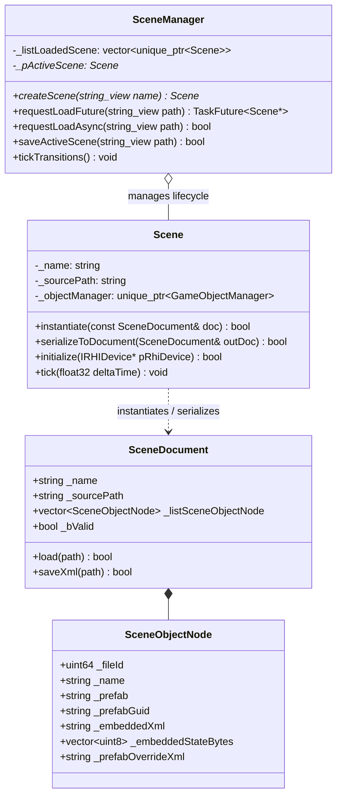

# 씬 서브시스템 가이드 (Scene Subsystem Guide)

이 문서는 SW Engine의 **씬 서브시스템(Scene Subsystem)**의 아키텍처, 씬 문서(`SceneDocument`), 로드 순서와 비동기 로딩 파이프라인, 씬 인스턴스화/직렬화, 쿠킹(`SceneCooker`)을 설명합니다.

---

## 1. 아키텍처 개요 (Architecture Overview)

씬 시스템은 게임 월드(Level/Map)의 구성 요소와 생명주기를 캡슐화하여 관리합니다.


```mermaid
classDiagram
    class SceneDocument {
        +string _name
        +string _sourcePath
        +vector~SceneObjectNode~ _listSceneObjectNode
        +bool _bValid
        +load(path) bool
        +saveXml(path) bool
    }

    class SceneObjectNode {
        +uint64 _fileId
        +string _name
        +string _prefab
        +string _prefabGuid
        +string _embeddedXml
        +vector~uint8~ _embeddedStateBytes
        +string _prefabOverrideXml
    }

    class Scene {
        -_name: string
        -_sourcePath: string
        -_objectManager: unique_ptr~GameObjectManager~
        +instantiate(const SceneDocument& doc) bool
        +serializeToDocument(SceneDocument& outDoc) bool
        +initialize(IRHIDevice* pRhiDevice) bool
        +tick(float32 deltaTime) void
    }

    class SceneManager {
        -_listLoadedScene: vector~unique_ptr~Scene~~
        -_pActiveScene: Scene*
        +createScene(string_view name) Scene*
        +requestLoadFuture(string_view path) TaskFuture~Scene*~
        +requestLoadAsync(string_view path) bool
        +saveActiveScene(string_view path) bool
        +tickTransitions() void
    }

    SceneDocument *-- SceneObjectNode
    Scene ..> SceneDocument : instantiates / serializes
    SceneManager o-- Scene : manages lifecycle
```

### 핵심 클래스 역할
1. **`Scene`**: 단일 게임 월드 인스턴스. 고유의 `GameObjectManager`, 활성 **게임** 카메라(`setActiveGameCamera` · `getActiveGameCamera`), 머티리얼 캐시 참조를 소유합니다. 에디터 뷰포트 카메라는 Editor 모듈이 소유하며 씬 직렬화에서 제외됩니다.
   씬은 그리는 쪽을 모릅니다 — `render()` 는 없고, 게임 스레드가 씬에서 스냅샷을 뽑아 렌더러에 넘깁니다(Graphics/README "소유와 수명").
2. **`SceneDocument`**: 씬 파일(`.scene.xml`, `.scene.bin`)의 데이터 모델. 씬 메타데이터와 엔티티 노드(`SceneDocument::SceneObjectNode`) 목록을 담으며, XML 및 바이너리(SCN1) 포맷 직렬화/역직렬화를 담당합니다.
3. **`SceneManager`**: 로드된 씬들의 수명주기, 활성 씬(`ActiveScene`) 추적 및 멀티스레드 비동기 씬 로딩/트랜지션을 제어하는 중앙 관리자입니다.
4. **`SceneCooker`**: 씬 XML 을 SCN1 바이너리로 쿠킹하는 오프라인 단계(아래 4절).
5. **`ObjectUndoUtil`**: 오브젝트 상태 스냅샷을 되돌리는 Undo 명령(`CommandStack` 의 명령)입니다. 되돌릴 때 씬과 그 매니저를 찾아야 하므로
   (`Scene.h` · `SceneManager.h`) `Utility/CommandStack` 옆(티어 1)이 아니라 씬(티어 7)에 둡니다.

---

## 2. 씬 문서 포맷 (Scene Document Formats)

### 2.1 XML 포맷 (`.scene.xml`)
개발 및 저작(Editor) 단계에서 사용되는 기본 텍스트 포맷입니다:
```xml
<?xml version="1.0" encoding="utf-8"?>
<Scene formatVersion="1" name="Town01">
    <entities>
        <entity id="1" name="PlayerSpawn" prefab="game/<pack>/prefabs/hero.prefab.json"/>
        <entity id="2" name="ShopKeeper" prefab="game/<pack>/prefabs/npc.prefab.json">
            <PrefabOverrides>
                <Override key="SceneComponent#0">
                    <SceneComponent _localPosition="4,0,2"/>
                </Override>
                <Remove key="BoxCollider2DComponent#0"/>
            </PrefabOverrides>
        </entity>
        <entity id="3" name="CustomLight">
            <GameObject _schemaVersion="0" _name="CustomLight" _bActive="true">
                <_listComponent>
                    <MeshComponent _componentName="MeshComponent" _meshId="Sphere" _localPosition="0,2,0"/>
                </_listComponent>
            </GameObject>
        </entity>
    </entities>
</Scene>
```

- **프리팹 엔티티는 프리팹 경로와 덮어쓴 것만 싣습니다**(`<PrefabOverrides>` — `PrefabOverrides`). 로드는 프리팹의 원형 상태에 그것을 얹어 짓습니다 —
  프리팹을 고치면 놓인 인스턴스에 퍼지고, 덮어쓴 값은 남습니다(언리얼 · 유니티의 프리팹 인스턴스와 같다). 키는 프리팹 쪽 컴포넌트 키(`이름표#n`)입니다.
- 프리팹을 읽지 못한 채 저장한 프리팹 엔티티는 `<GameObject>` 전체 상태를 싣습니다. 그 상태가 그대로 기준이고, 프리팹이 있을 때 다시 저장하면 덮어쓴 것만 씁니다.
  프리팹을 찾지 못한 엔티티는 버리지 않고 문서 그대로 들고 있다가 저장 때 다시 씁니다(유니티의 "Missing Prefab" 자리).
- 엔티티 사이의 부착은 이름이 아니라 **파일 id**(`id` 속성 = `SceneObjectNode::_fileId`)로 가리킵니다. 런타임 오브젝트 id 와 다른 공간이고, 저장할 때마다 같은 값을 다시 씁니다.
  엔티티마다 0 이 아닌 `id` 가 있어야 합니다 — 없거나 0 인 엔티티가 있는 문서는 읽지도(`loadXml`) 쓰지도(`saveXml`) 쿠킹하지도 않습니다.
- 씬 · 엔티티의 값은 **속성에만** 있습니다(`saveXml` 이 쓰는 모양). 자식 원소(`<name>` 등)로 적은 값은 읽지 않습니다.
- `formatVersion` 이 지금 판(`AssetFormatVersions::kScene` = 1)이 아닌 문서는 읽지 않습니다(없으면 0). 이관 단계는 하나도 없습니다 — 판을 올리면
  `AssetFormatRegistry::registerXmlMigrator` 로 N → N+1 단계를 등록합니다.
- 컴포넌트 이름표(`_componentName`)는 상태와 함께 저장됩니다. 이름표가 없는 상태는 타입 이름으로 읽힙니다.

### 2.2 바이너리 포맷 (`.scene.bin` — SCN1)
배포(Shipping) 빌드 및 고속 스트리밍을 위한 바이너리 쿠킹 포맷입니다:
- **Magic**: `0x53434E31` (`SCN1`)
- **Version**: `3` (읽기도 이 판만 — 쿠킹본은 매번 다시 쿠킹한다)
- **Name**: `u32 length` + `UTF-8 bytes`
- **Entities**: `u32 count` + 각 엔티티(`name`, `prefabPath`, `prefabGuid`, `embeddedXml`, `embeddedStateBytes`, `fileId`, `prefabOverrideXml`)
- 쿠킹된 엔티티는 `embeddedStateBytes`(리플렉션 바이너리 상태)만 싣고 XML 을 비웁니다 — 둘이 함께 실리는 일은 없습니다.

---

## 3. 로드 순서와 비동기 씬 스트리밍 (Load Order · Async Scene Streaming)

**씬은 모든 타입 공급자가 등록을 끝낸 뒤에만 읽습니다.** 기동 단계 `ModuleTypes`(Engine/README "기동 · 종료")에서 호스트가 GameFramework ·
키트 · 게임 모듈 이미지를 올려 타입을 등록하고 `TypeRegistry::markAllModuleTypesRegistered` 를 적습니다. 그 전에 `SceneManager::requestLoadFuture` ·
`SceneCooker::cookAllScenes` 를 부르면 오류를 남기고 거절합니다 — 등록 전에 읽은 컴포넌트는 `MissingComponent` 가 됩니다
(`SceneTest.SceneIsNotReadBeforeEveryModuleRegisteredItsTypes`). 게임 인스턴스는 에디터보다 먼저 서므로, 게임의 첫 씬 요청 뒤에 온 에디터의
시작 씬(`-gv_editorStartupScene`)이 마지막 요청으로 남아 열립니다(`SceneManager` 는 마지막 요청을 남긴다).

1. `SceneManager::requestLoadFuture(path)`(`requestLoadAsync` 는 그 bool 판):
   - `TaskManager` 워커 스레드에 비동기 태스크(`SceneLoadAsync`)를 디스패치합니다. 로드가 진행 중이면 마지막 요청 하나만 대기열에 남깁니다.
2. 백그라운드 워커:
   - `doc.load(path)`로 XML 또는 SCN1 바이너리를 파싱합니다.
   - 새 `Scene` 객체를 생성하고 `Scene::instantiate(doc)`로 엔티티와 프리팹을 스폰합니다. 엔티티를 모두 지은 뒤 끝에서 파일 id 로 부착(부모-자식)을 잇습니다.
3. 메인 스레드 (`SceneManager::tickTransitions()`):
   - 비동기 로드가 완료되면 안전한 프레임 경계에서 기존 활성 씬을 언로드하고 새 씬으로 스왑(Swap)합니다.

---

## 4. 씬 쿠킹 (`SceneCooker`)

`App.exe --cook-scenes [--cooked-dir <dir>]` 가 헤드리스 단계에서 `SceneCooker::cookAllScenes` 를 부릅니다(프리팹은 같은 실행에서 `PrefabCache::cookAllPrefabs`,
내비 표면이 놓인 씬의 내비메시는 `SceneNavigationCooker::cookAll` — `Source/Engine/Navigation/README.md` 7 절).

- **입력은 소스 트리입니다.** 쿠킹이면 Resource 단계가 `AssetManager::mountContent( …, ContentSource::SourceTree )` 로 섭니다 — 팩을 마운트하지 않고
  느슨한 파일을 읽으며, 배포 구성(Shipping)에서도 소스 프리팹(XML · JSON)을 읽습니다. 지난 빌드의 팩을 입력으로 삼지 않습니다
  (`ResourceTest.SourceTreeContentMountsNoPackAndReadsLooseFiles`, `AppCookTest.SceneCookReadsTheSourceTreeCleanly`).
- **왕복 검증 뒤에만 바이너리로 바꿉니다.** 엔티티 상태를 쿠킹한 바이트를 즉시 되읽어 같은지 본 뒤 XML 을 버립니다.
- **모르는 타입의 컴포넌트(`MissingComponent`)가 든 씬은 쓰지 않고 실패로 셉니다.** `MissingComponent` 는 원문을 들고 있어 왕복 검증을 통과하므로
  따로 셉니다(`SceneTest.SceneCookFailsOnAComponentOfUnknownType`). 실패는 App 종료 코드 → `CookAssets.py` 로 이어져 Shipping 빌드를 세웁니다.
- **다른 게임 팩의 씬은 그 게임 모듈의 컴포넌트를 쓰면 건너뜁니다**(`game/<활성 게임이 아닌 팩>/` — 그 모듈은 이 빌드에 없다). 엔진 · 공용 타입만 쓰는 씬은 쿠킹합니다.
- 산출물은 `<cookedDir>/<상대경로>/<이름>.scene.bin` 이고 소스 옆에 두지 않습니다 — 낡은 `.bin` 이 남아 Dev 런타임이 그것으로 물러나 실패를 가리지 않게.

---

## 5. C++ 사용 예제

### 4.1 씬 생성 및 오브젝트 추가
```cpp
#include "Engine/Scene/Scene.h"
#include "Engine/Scene/SceneManager.h"

// 매니저를 통한 씬 생성
sw::Scene* pScene = sceneManager.createScene("MainLevel");
sw::GameObject* pPlayer = pScene->getObjectManager()->createGameObject(sw::hashed_string("Player"));
```

### 4.2 씬 문서 저장 및 로드
```cpp
#include "Engine/Scene/SceneDocument.h"

// 활성 씬을 XML 씬 문서로 저장
sw::SceneDocument doc{};
pScene->serializeToDocument(doc);
doc.saveXml("Resource/game/<pack>/maps/level01.scene.xml");

// 독립 씬 문서 로드 및 인스턴스화
sw::SceneDocument loadedDoc{};
if (loadedDoc.load("Resource/game/<pack>/maps/level01.scene.xml"))
{
    sw::Scene newScene("Level01");
    newScene.instantiate(loadedDoc);
}
```
