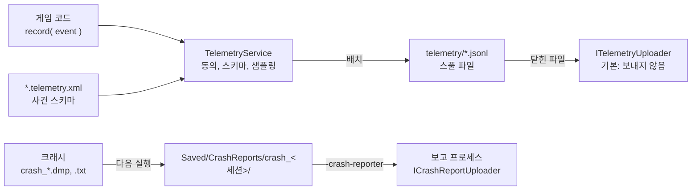

# Telemetry — 텔레메트리와 크래시 보고

## 이것은 무엇이고 왜 있나

게임을 출시하면 플레이어가 어디서 막히는지, 어느 장면에서 프레임이 떨어지는지, 어디서 크래시가 나는지를 알아야 합니다.
이 모듈은 두 가지를 제공합니다.

- **텔레메트리.** 게임 진행, 성능, 세션 정보를 사건(event)으로 기록하고 디스크에 모아 두었다가 보냅니다. 언리얼의 `FAnalytics` 와 `IAnalyticsProvider`, Unity Analytics에 해당합니다.
- **크래시 보고.** 크래시가 나면 미니덤프와 로그를 남기고, 다음 실행에서 크래시 번들(bundle) 폴더 하나로 모아 플레이어 동의에 따라 보냅니다. 언리얼 CrashReportClient, Sentry, Backtrace와 같은 구조입니다.

두 기능 모두 **플레이어가 동의했을 때만** 데이터를 보냅니다. 기본값은 아무것도 보내지 않는 것입니다.
그리고 이 저장소에는 실제 네트워크 전송 코드가 없습니다. 보내는 부분은 인터페이스(`IHttpClient`)로만 있고, 게임이 자기 HTTP 클라이언트와 엔드포인트를 넣어야 실제로 전송됩니다.

엔진 계층으로는 8층입니다. 동의 여부를 사용자 설정(7층)에서 읽습니다.

## 머릿속 그림



**사건과 스키마.** 사건은 id와 타입이 붙은 필드 값으로 이루어집니다(`TelemetryEvent`). 어떤 사건이 어떤 필드를 가지는지는 스키마 파일(`*.telemetry.xml`)에 미리 적습니다.
스키마에 없는 사건이나 타입이 틀린 필드는 기록하지 않습니다. 받는 쪽 데이터베이스 테이블과 어긋난 데이터가 쌓이지 않게 하기 위해서입니다.

**스풀.** 스풀(spool)은 보내기 전에 사건을 쌓아 두는 디스크 파일입니다. 한 줄에 사건 하나인 JSON lines 형식입니다. 네트워크가 없어도 사건은 스풀에 남고, 다음 실행이 이어서 보냅니다.

**동의.** 텔레메트리 동의는 사용자 설정 `telemetry.enabled`, 크래시 보고 동의는 `telemetry.crashReports` 입니다. 둘 다 `engine.settings.xml` 의 `privacy` 카테고리에 있습니다.

**빵부스러기.** 빵부스러기(breadcrumb)는 크래시 직전에 무슨 일이 있었는지 보려고 메모리에 남겨 두는 최근 사건 목록입니다. 크래시가 나면 덤프 옆에 파일로 적힙니다.

## 따라 해 보기 — 게임 진행 사건 하나 기록하기

Shooter3D가 새 웨이브에 들어설 때 남기는 `progression.waveReached` 사건을 그대로 따라 합니다.

**1단계 — 스키마를 씁니다.** 게임 팩에 `data/<게임>.telemetry.xml` 을 만들고 사건과 필드를 적습니다.

<!-- snippet: Resource/game/shooter3d/data/shooter3d.telemetry.xml 의 waveReached — 5b U7 에서 대조 -->
```xml
<TelemetrySchema version="1">
	<Event id="progression.waveReached" category="progression">
		<Field name="wave" type="int" required="true"/>
		<Field name="kills" type="int" required="true"/>
		<Field name="seconds" type="float"/>
	</Event>
</TelemetrySchema>
```

필드 타입은 `bool`, `int`, `float`, `string` 입니다. `float` 필드는 정수 값도 받습니다. `type`, `event`, `seq`, `t`, `sample`, `session` 은 예약된 이름이라 필드 이름으로 쓸 수 없습니다.

**2단계 — 게임 프리셋에 스키마를 적습니다.** `Config/Game/<게임>.json` 의 `_telemetrySchema` 에 팩 기준 경로를 씁니다(Shooter3D는 `"data/shooter3d.telemetry.xml"`).
게임 스키마는 엔진 스키마(`Resource/engine/telemetry/engine.telemetry.xml`) 위에 더해집니다. `CheckGamePresets` 가 파일이 있는지 확인합니다.

**3단계 — 코드에서 기록합니다.**

<!-- snippet: ShooterDirectorComponent.cpp 의 waveReached 기록 — 5b U7 에서 대조 -->
```cpp
TelemetryService* pTelemetry = game::getService<TelemetryService>();
if ( pTelemetry != nullptr )
{
    TelemetryEvent waveReached( "progression.waveReached" );
    waveReached.setInt( "wave", getWave() ).setInt( "kills", _killCount ).setFloat( "seconds", static_cast<float64>( _director.getTime() ) );
    (void)pTelemetry->record( waveReached );
}
```

`record` 의 결과는 `Recorded`, `NoConsent`, `SampledOut`, `UnknownEvent`, `InvalidField` 중 하나입니다. 동의가 없으면 `NoConsent` 로 버려지므로 게임 코드는 동의를 따로 확인하지 않아도 됩니다.
`record` 는 컴포넌트 틱 워커를 포함해 아무 스레드에서나 불러도 됩니다. 내부에서 잠금 하나로 보호합니다.

**4단계 — 동의를 켜고 확인합니다.** 설정 메뉴에서 텔레메트리를 켜거나 사용자 설정 파일에서 `telemetry.enabled` 를 `true` 로 바꿉니다.
게임을 플레이하면 사용자 데이터 폴더(`%LOCALAPPDATA%/SWEngine/<팩>/telemetry/`)에 `telemetry_<세션>_0000.jsonl` 이 생깁니다. 자동화 테스트에서는 `-gv_telemetryFolder=<경로>` 로 폴더를 바꿉니다.

```text
{"type":"context","schema":1,"session":"9c1f...","build":"Debug","platform":"Windows","buildId":"6B1E...1","game":"shooter3d","file":0}
{"type":"event","event":"progression.waveReached","seq":3,"t":61.233,"sample":1,"fields":{"wave":2,"kills":14,"seconds":61.2}}
```

위의 값은 예시입니다. 첫 줄은 세션 문맥이고 그 뒤가 사건입니다. `t` 는 세션 시작 후 초(게임 스레드 시계), `seq` 는 세션 안의 순번, `sample` 은 그 사건의 샘플링 비율입니다.
받는 쪽은 `1 / sample` 을 가중치로 씁니다.

## 작동 원리

### 동의

- 동의는 사용자 설정 `telemetry.enabled` 의 **확정된 값**입니다. 기본값은 `false` 입니다. `bindConsentSetting` 이 설정을 적용하거나 되돌리거나 로드할 때마다 다시 읽습니다.
  설정 메뉴에서 아직 적용하지 않은 값은 동의로 보지 않습니다.
- 동의가 없으면 `record` 는 사건을 버리고, 프레임 시간도 모으지 않고, 파일을 쓰거나 보내지도 않습니다.
- 동의를 철회하면 쓰지 않은 배치와 스풀 파일을 **지웁니다**. 동의 없이 시작할 때마다 지난 실행이 남긴 파일까지 지웁니다.
- 동의해도 기본 업로더(`NullTelemetryUploader`)는 보내지 않고 `Kept` 를 돌려줍니다. 파일은 용량 상한 안에서 남습니다.
- 빵부스러기(최근 사건 `breadcrumbs` 개)는 동의와 상관없이 **메모리에만** 둡니다. 그것을 담은 크래시 보고를 보낼지는 크래시 보고 동의가 정합니다.

### 스풀과 업로드

스키마의 `<Pipeline>` 요소가 스풀 동작을 정합니다. 기본값은 엔진 스키마에 있습니다.

<!-- snippet: Resource/engine/telemetry/engine.telemetry.xml 의 Pipeline — 5b U7 에서 대조 -->
```xml
<Pipeline batchEvents="32" flushSeconds="30" maxFileBytes="262144" maxFiles="16" maxTotalBytes="2097152" sessionSample="1" breadcrumbs="32"/>
```

1. **배치.** 사건이 `batchEvents` 개 모이거나 `flushSeconds` 가 지나면 지금 파일 끝에 붙입니다.
2. **회전.** 줄을 더해서 `maxFileBytes` 를 넘게 되면 지금 파일을 닫고 다음 번호의 파일을 엽니다.
3. **상한.** 스풀 전체가 `maxFiles` 나 `maxTotalBytes` 를 넘으면 가장 오래된 닫힌 파일을 보내지 못한 채 지웁니다(`_droppedFiles` 로 셉니다).
4. **업로드.** 닫힌 파일을 오래된 순서로 업로더에 넘기고, `Sent` 를 받으면 지웁니다. 실패하면 순서를 지켜 다음 flush에 다시 보냅니다.
5. **종료.** 종료할 때 지금 파일도 닫아서 보냅니다. 지난 실행이 남긴 파일은 다음 실행이 이어서 보냅니다.

업로드는 flush를 부른 스레드에서 끝날 때까지 기다립니다. 실제 HTTP 클라이언트를 넣을 때는 작업을 다른 스레드에 넘기고 바로 돌아오는 비동기 방식으로 구현해야 프레임이 멈추지 않습니다.

**샘플링은 결정적입니다.** 세션은 세션 id 해시로(`sessionSample`), 사건은 (세션, 사건 id, 그 사건의 순번) 해시로 고릅니다. 같은 세션은 언제나 같은 사건을 고릅니다.

**장면별 프레임 시간.** `EngineLoop::tick` 이 매 프레임 `recordFrame( 장면 경로, dt )` 를 부릅니다. 장면이 바뀌거나 세션이 끝나면 `perf.sceneSummary` 사건으로 프레임 수, 시간, 평균, p50, p99, 최대를 남깁니다.
히스토그램은 0.1 ms 간격 2,500칸이고, 250 ms를 넘는 프레임은 넘침 칸에 들어갑니다. 백분위는 칸의 가운데 값이라 오차가 0.05 ms 안입니다.
엔진 스키마에는 이 사건 외에 `session.start` 와 `session.end` 가 있습니다.

### 크래시 보고

**크래시 순간에는 아무것도 보내지 않습니다.** 죽어 가는 프로세스는 메모리 할당 없이 파일만 씁니다(`Core/Diagnostics/CrashHandler`).
로그 폴더 `Saved/Logs` 에 `crash_<세션>.dmp`, `.txt`(문맥), `.stack.txt`, `.breadcrumbs.txt` 가 생깁니다.

**다음 실행이 번들을 만듭니다.** 엔진 초기화의 `Telemetry` 단계가 `CrashReportService::collectNewCrashes` 로 지금 세션이 아닌 크래시 파일을 `Saved/CrashReports/crash_<세션>/` 로 모읍니다.

| 파일 | 내용 |
|---|---|
| `crash.dmp` | 미니덤프(Windows). 원래 파일을 옮깁니다 |
| `crash.txt` | 사유, 주소, 프로세스와 스레드, 빌드, 플랫폼, RHI, GPU, `BuildId`, `EngineBuildId` |
| `crash.stack.txt` | 심볼을 찾은 콜 스택 |
| `crash.breadcrumbs.txt` | 최근 사건 32줄 |
| `last.log` | 그 세션의 로그 파일을 이어 붙인 마지막 512 KB |
| `manifest.json` | 세션, 상태, 시도 수, 빌드 id, 시스템 정보, 파일 목록 |

`EngineBuildId` 는 Dev 빌드에서 Engine.dll의 빌드 id입니다. Dev는 모듈마다 PDB가 따로 있기 때문에 따로 적습니다.
번들은 10개까지 보관하고, 넘으면 오래된 것부터 지웁니다.

**동의 모드.** `telemetry.crashReports` 의 값은 세 가지이고 기본값은 `local` 입니다.

| 값 | 동작 |
|---|---|
| `local` | 번들만 만들고 보내지 않습니다 |
| `ask` | `AwaitingDecision` 상태로 둡니다. 게임 UI가 `collectReports` 로 목록을 읽어 묻고, `decide( 세션, 보낼지 )` 로 답합니다 |
| `send` | 바로 보낼 대기열(`Queued`)에 넣습니다 |

`local` 로 바꾸면 아직 보내지 않은 번들이 `local` 로 돌아옵니다. 반대로 `send` 로 바꿔도 이미 `local` 로 모인 번들을 거슬러 보내지는 않습니다.

**보고 프로세스.** 보낼 번들이 있으면 `App.exe -crash-reporter="<번들 폴더>"` 를 기다리지 않고 띄웁니다(`Process::launchDetached`).
이 인자는 명령줄 표의 `CRASH_REPORTER` 입니다. 엔진 부트스트랩은 명령줄까지만 세우고 크래시 핸들러와 리소스 루트는 세우지 않습니다(이 프로세스가 죽어도 보고 프로세스를 또 띄우지 않게).
`EngineLoop` 는 서비스와 기동 단계 없이 헤드리스로 끝나고, App 의 헤드리스 분기가 `runReporter` 만 실행합니다. 크래시를 낸 게임 코드를 다시 로드하지 않기 위해서입니다.
언리얼은 CrashReportClient라는 별도 exe를 쓰지만, 여기서는 같은 exe의 다른 모드로 구현했습니다.
업로드 결과가 `Sent` 면 상태를 `sent` 로 바꾸고 덤프를 지웁니다. 실패하면 시도 수를 늘리고, 3번 실패하면 더 띄우지 않습니다.
띄울 실행 파일은 `setReporterExecutable` 로 정한 것뿐이고, `EngineLoop` 가 App 경로를 넣습니다. 그래서 테스트 실행 파일은 자기 자신을 다시 띄우지 않습니다.

**업로더.** `HttpCrashReportUploader` 는 `multipart/form-data` 로 `manifest`(JSON)와 파일마다 한 부분을 보냅니다. 덤프의 부분 이름은 `upload_file_minidump` 입니다.
Breakpad, Crashpad, Sentry의 미니덤프 엔드포인트가 받는 이름입니다. 이 저장소의 보고 프로세스는 `NullCrashReportUploader` 를 씁니다.

### 심볼과 빌드 id

미니덤프만으로는 함수 이름을 알 수 없고, 빌드할 때 만든 PDB가 있어야 합니다. 덤프의 모듈 목록에는 모듈마다 빌드 id가 들어 있고, 심볼 서버는 이 id로 PDB를 찾습니다.

- **Windows.** 빌드 id는 PE CodeView `RSDS` 레코드의 GUID와 age, PDB 이름입니다. 심볼 서버(`symstore`) 배치는 `<pdb 이름>/<GUID 32자리><age 16진>/<pdb 이름>` 입니다.
  `ModuleBuildId::find` 가 같은 키를 만들어 문맥의 `BuildId` 에 적으므로, 덤프를 열지 않고도 어느 빌드의 PDB가 필요한지 알 수 있습니다.
- **모든 구성이 PDB를 만듭니다.** Release와 Shipping도 `/DEBUG:FULL` 과 `/PDBALTPATH:%_PDB%` 로 링크합니다. 두 번째 옵션은 PDB 이름만 남겨 빌드 기계의 경로가 새지 않게 합니다.
  디버그 정보의 양은 `SW_RELEASE_DEBUG_INFO` 로 정합니다(기본 `lines` 는 함수와 줄 정보만, 그 외 `full`, `none`).
  Shipping의 PDB는 배포 폴더 밖의 `build/<프리셋>/Symbols/` 에 놓입니다. 테스트 실행 파일의 PDB는 `TestBin` 에 있습니다.
- **Linux.** 빌드 id는 ELF `NT_GNU_BUILD_ID` 노트이고, 링크할 때 항상 `--build-id=sha1` 을 줍니다.
  Shipping `App` 은 링크 뒤 `objcopy --only-keep-debug` 로 디버그 정보를 `Symbols/App.debug` 로 떼어 내고 `.gnu_debuglink` 만 남깁니다(`sw_splitShippingDebugInfo`).

## 확장하는 법

**실제로 데이터를 보내려면**

1. `IHttpClient` 를 구현합니다. 이 저장소에는 `NullHttpClient`(보내지 않고 거절)만 있습니다. 프레임이 멈추지 않도록 요청을 작업 스레드에 넘기는 비동기 구현이어야 합니다.
2. 텔레메트리는 `TelemetryService::setUploader` 에 그 클라이언트와 엔드포인트, 키를 가진 `HttpTelemetryUploader` 를 넣습니다.
3. 크래시 보고는 App 의 헤드리스 분기(`App::initialize`)가 `runReporter` 에 넘기는 업로더를 `HttpCrashReportUploader` 로 바꿉니다.

**배포 빌드의 심볼을 올리려면** 빌드마다 아래 명령으로 PDB와 `.debug` 를 심볼 서버 배치로 복사하거나, Sentry `sentry-cli debug-files upload` 를 씁니다. 배포물에는 PDB를 넣지 않습니다.

```powershell
py -3 -m Scripts symbols --preset Ninja-Shipping --store <심볼 저장소 폴더>   # --dry-run 이면 배치만 출력
```

Linux `.debug` 는 `.build-id/<앞 2자리>/<나머지>.debug` 배치로 복사되고, gdb와 Sentry가 이 배치를 읽습니다.

## 함정과 주의

- **크래시 핸들러 안에서 메모리를 할당하거나 무언가를 보내지 마세요.** 힙이 깨진 상태일 수 있습니다. 크래시 순간에는 파일만 쓰고, 나머지는 다음 실행이 합니다.
- **동기 HTTP 클라이언트를 업로더에 그대로 넣지 마세요.** 업로드는 flush를 부른 스레드에서 끝날 때까지 기다리므로 게임 스레드가 멈춥니다.
- **스키마를 거치지 않는 자유 형식 속성은 없습니다.** 언리얼 Analytics는 속성이 자유 형식이지만, 여기서는 스키마에 없는 필드를 거절합니다. 새 필드를 쓰려면 스키마부터 고칩니다.
  `ResourceDataSchemaTest` 가 `Resource/` 아래 모든 `*.telemetry.xml` 을 읽고, 모르는 이름이 있으면 파일 전체를 거절합니다.
- **개인 식별자를 사건에 넣지 마세요.** 사건에는 세션 id만 있고 사용자 id는 일부러 없습니다.
- 아직 없는 기능은 gzip 압축 업로드, 재시도 백오프, 데이터 삭제 요청 API(GDPR, 서버 쪽 일), 서버 쪽 심볼 변환과 같은 크래시 그룹으로 모아 보기, 크래시 중 스크린샷입니다.
  전용 서버의 크래시 보고는 [백로그](../../../docs/06_Backlog.md)에 있습니다.

## 더 볼 곳

| 파일 | 내용 |
|---|---|
| `TelemetrySchema.h` | 스키마 형식과 파이프라인 설정 |
| `TelemetryService.h` | 엔진 서비스. 동의, 배치, 스풀, 장면 요약 |
| `TelemetryUploader.h`, `HttpClient.h` | 업로더와 HTTP 인터페이스 |
| `CrashReportService.h` | 크래시 번들 만들기, 동의, 보고 프로세스 |
| `CrashReportUploader.h` | 크래시 업로더 |
| `Core/Diagnostics/CrashHandler.h` | 크래시 순간에 파일을 쓰는 쪽 |

- 테스트: `Test/EngineTest/Telemetry/TestTelemetry.cpp`, `TestCrashBundle.cpp`
- 상위 문서: [Engine/README.md](../README.md)
