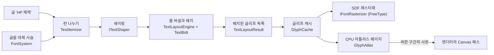

# Text — 런타임 글자

## 이것은 무엇이고 왜 있나

게임 화면의 메뉴, HUD, 자막, 월드에 뜨는 데미지 숫자는 모두 글자를 그립니다. 이 폴더는 그 글자를 준비하는 계층입니다.
글꼴 파일을 열고, 글자마다 쓸 글꼴을 고르고, 글자 모양을 이미지로 만들고, 글을 줄로 나눠 화면 위치를 정합니다.
이 폴더가 없으면 UI 위젯마다 글꼴을 직접 다뤄야 하고, 한글이나 아랍어처럼 기본 글꼴에 없는 글자는 빈 상자로 나옵니다.

상용 엔진도 같은 순서로 나눕니다. 글자 모양을 만드는 래스터화는 외부 라이브러리(FreeType)가 하고, 만든 모양을 큰 텍스처에 모으는 아틀라스와
줄 바꿈은 엔진이 합니다. 언리얼의 Slate 폰트 캐시와 `FTextLayout`, 유니티의 TextCore, Godot의 `TextServer` 에 해당합니다.

| 이 엔진 | 언리얼 | 유니티 | Godot |
|---|---|---|---|
| `IFontRasterizer`(FreeType) | `FFreeTypeFace` | TextCore `FontEngine` | `FontFile` |
| `FontSystem` 대체 사슬 | `FCompositeFont` | Font Asset 폴백 목록 | `Font.fallbacks` |
| `ITextShaper` | `FShapedGlyphSequence`(HarfBuzz) | TextCore | `TextServer`(HarfBuzz) |
| `TextLayoutEngine` | `FTextLayout`, `FSlateFontMeasure` | TextCore 생성기 | `TextParagraph` |
| `TextBidi` | `TextBiDi`(ICU) | TextCore 일부 | `TextServer`(ICU) |

이 폴더는 [Engine 레이어 구성](../README.md)의 티어 5에 있습니다. 글꼴 파일은 Resource에서 읽지만 GPU는 모릅니다.
아틀라스 텍스처를 GPU에 업로드하는 일은 렌더러의 Canvas 패스가 하고, 글자를 위젯에 넣는 일은 [UI](../UI/README.md)가 합니다.

## 머릿속 그림



이 그림에서 기억할 개념은 네 가지입니다.

**글꼴 대체 사슬.** 글꼴 하나에 모든 글자가 들어 있지는 않습니다. 저장소에 있는 라틴 글꼴에는 한글이 없습니다.
그래서 글꼴은 가족 이름 하나가 아니라 여러 면(face)을 순서대로 늘어놓은 사슬로 고릅니다. 면은 글꼴 파일 안에 있는 글꼴 하나입니다.
사슬은 고른 가족, 지금 문화권이 정한 대체 가족들, 카탈로그의 기본 가족 순서입니다. 글자마다 앞에서부터 그 글자가 있는 면을 씁니다.

**SDF 글리프와 아틀라스.** 글리프는 글자 하나의 모양입니다. 이 엔진은 글리프를 SDF(signed distance field)로 만듭니다.
SDF는 픽셀마다 윤곽선까지의 거리를 담은 이미지라서, 한 번 만든 글리프를 크게 그려도 가장자리가 흐려지지 않습니다.
만든 글리프는 큰 페이지 몇 장에 모아 두는데, 이것이 아틀라스입니다. 같은 글자는 다시 만들지 않고 아틀라스에서 꺼내 씁니다.

**셰이핑과 런.** 셰이핑은 코드 포인트를 글리프 번호와 간격으로 바꾸는 일입니다. 셰이퍼는 글꼴과 방향이 같은 구간을 하나씩만 받습니다.
이 구간을 런(run)이라고 하고, 글을 런으로 끊는 일을 런 나누기라고 합니다.

**측정과 배치.** UI가 글에게 묻는 질문은 두 가지입니다. "이 너비에서 이 글은 얼마나 큰가"는 측정(`measure`)이고,
"글리프를 어디에 그리나"는 배치(`layout`)입니다. 두 질문에 같은 입력을 주면 언제나 같은 답이 나옵니다.

## 따라 해 보기 — 글 하나를 재고 줄을 바꿔 배치하기

UI 위젯을 거치지 않고 글자 계층만 써서 문장 하나를 정해진 너비에 배치해 봅니다.
게임 코드에서 글 크기를 미리 알아야 할 때, 예를 들어 말풍선 크기를 글에 맞출 때 이렇게 씁니다.

### 1단계 — 글꼴 서비스와 배치기

엔진이 켜지면 기동 단계 `Fonts` 가 글꼴 서비스를 엽니다. 서비스는 `engine::getFontSystem()` 으로 얻고, 배치기 `TextLayoutEngine` 은 그 서비스를 받아 만듭니다.
UI는 이미 배치기를 하나 가지고 있으므로(`UISystem::getTextLayout`), UI 코드 안에서는 그것을 씁니다.

### 2단계 — 스타일을 정하고 배치하기

<!-- snippet: 글꼴 서비스 + TextLayoutEngine 으로 문장 하나를 너비 300 에 배치 — 5b U7 에서 문서 예시 테스트로 대조 -->
```cpp
FontSystem*      pFonts = engine::getFontSystem();
TextLayoutEngine layout{ *pFonts };

TextLayoutStyle style{};
style._font._family = "Kenney Future"; // 비우면 카탈로그의 기본 가족
style._fontSize     = 24.0f;           // UI 단위, em 하나의 크기
style._overflow     = TextOverflow::Ellipsis;
style._maxLines     = 2;

TextLayoutResult result{};
layout.layout( "The quick brown fox jumps over the lazy dog", style, 300.0f, result );

const float2 size = layout.measure( "The quick brown fox jumps over the lazy dog", style, 300.0f ); // result._size 와 같다
```

`result._listLine` 에는 줄마다 너비와 기준선 위치가 들어 있고, `result._listGlyph` 에는 글리프마다 펜 위치와 면이 들어 있습니다.
두 줄로 모자라면 `result._bTruncated` 가 켜지고 둘째 줄 끝에 "…"이 붙습니다.

### 3단계 — 결과 확인하기

글자 계층의 동작은 테스트로 확인합니다. 테스트는 글리프 크기가 정해진 가짜 래스터라이저를 써서 GPU와 글꼴 파일 없이 돌아갑니다.

```powershell
cd build/Ninja-Debug/Bin
./EngineTest.exe --test_filter=TextLayoutTest.*
```

실제 글꼴로 그린 결과는 `App -gv_uiDemo=1` 로 띄우는 UI 견본 화면에서 봅니다. 견본에는 오른쪽에서 왼쪽으로 쓰는 글도 들어 있습니다.

## 작동 원리

### 래스터라이저

`IFontRasterizer` 가 글꼴 파일을 열고 글리프를 SDF로 래스터화합니다. 기본 구현은 `Text/FreeType/` 의 FreeType 래스터라이저이고,
밖에서는 `IFontRasterizer::createDefault()` 로만 만듭니다. 테스트는 결정적인 가짜 구현(`Test/EngineTest/Text/FakeFontRasterizer.h`)을 씁니다.

- 면은 글꼴 파일 바이트로 엽니다(`loadFace`). 래스터라이저가 그 바이트를 면이 살아 있는 동안 보관합니다. 면 번호는 1부터이고, 0은 `kInvalidFontFaceID` 입니다.
- 길이 단위가 둘입니다. 면과 글리프의 메트릭(`FontFaceMetrics`, `GlyphMetrics`, 커닝)은 em에 대한 비율입니다.
  래스터 결과(`SdfGlyphBitmap`)는 래스터 픽셀 단위이고, 크기는 `SdfRasterParams::_pixelSize`(기본 48 px/em)가 정합니다.
  둘을 섞지 않습니다. 화면 크기는 em 비율에 글꼴 크기를 곱한 값이고, 래스터 크기와 상관없습니다.
- SDF는 단일 채널입니다. FreeType 2.11부터 들어 있는 `sdf` 렌더러가 윤곽에서 정확한 거리를 계산합니다.
  값 128이 윤곽선이고, 큰 값이 안쪽입니다. 거리 폭은 `_spreadPx`(기본 6 px)입니다. 굵게, 외곽선, 그림자는 셰이더가 임계값을 옮겨서 그립니다.
  여러 채널을 쓰는 MSDF는 아직 쓰지 않습니다([결정 기록 5-7](../../../docs/09_Decisions.md#5-7-런타임-ui-와-글자)).
- 래스터라이저는 게임 스레드에서만 부릅니다. FreeType 라이브러리 객체가 스레드에 안전하지 않기 때문입니다.

### 글꼴 카탈로그와 대체 사슬

글꼴 서비스 `FontSystem` 이 카탈로그를 읽고 사슬을 만듭니다. 카탈로그 경로는 `EngineDefaultAssets::_fontCatalog` 이고, 엔진 기본값은 `engine/fonts/fontcatalog.xml` 입니다.

카탈로그(`FontCatalogDesc`)에는 두 종류의 가족이 있습니다. 저장소 가족에는 이름, 면 파일, 굵기, 기울기를 적습니다.
시스템 가족에는 이름과 Windows 파일 이름, 리눅스 파일 이름을 적고, 실행할 때 OS 글꼴 폴더에서 찾습니다.
OS 글꼴 폴더는 `SystemFontLocator` 가 찾습니다. 에디터의 ImGui 글꼴도 같은 클래스를 쓰고, 리눅스에서는 하위 폴더까지 한 번 훑어 결과를 캐시합니다.

사슬은 다음 순서로 만듭니다.

1. 스타일이 고른 가족(`FontSpec::_family`)의 면입니다. 비어 있으면 카탈로그 기본 가족입니다.
2. 지금 문화권의 대체 가족들입니다. 문화권 테이블(`engine.cultures.json`)의 `fonts` 목록이고, `LocalizationManager::getFontFallback` 이 돌려줍니다.
3. 카탈로그 기본 가족입니다.

글자마다 이 순서로 그 글자가 있는 면을 찾습니다(`findFaceForCodepoint`). 어느 면에도 없으면 첫 면의 글리프 0, 이른바 두부(□)를 그리고 코드 포인트마다 경고를 한 번 남깁니다.
사슬은 (가족, 굵기, 기울기, 문화권)마다 한 번 만들어 캐시합니다. 문화권이 바뀌면 `invalidateFaceChains` 로 캐시를 비웁니다.
사슬은 값으로 주고받습니다. 캐시 테이블이 커지면 원소 위치가 옮겨지기 때문입니다.

굵기와 기울기는 이렇게 고릅니다. 먼저 기울기가 같은 면을 고르고, 그중에서 굵기 차이가 가장 작은 면을 씁니다. 차이가 같으면 더 굵은 면입니다.
CSS 글꼴 매칭 규칙을 단순하게 줄인 것입니다. SemiBold 이상을 원했는데 고른 면이 Medium 이하이면 `_bFauxBold` 가 켜지고, 셰이더가 SDF 임계값을 옮겨 굵게 그립니다.
기운 면이 없으면 `_bFauxItalic` 이 켜지고, 배치한 글리프를 기울여 그립니다.

시스템 글꼴이 없는 기계도 있습니다. 리눅스 CI나 전용 서버가 그렇습니다. 저장소 기본 가족은 언제나 열리므로 글자는 그려지고,
찾지 못한 시스템 가족은 처음 한 번 경고한 뒤 사슬에서 빠집니다. 기본 가족을 열지 못하면 기동이 실패합니다.

기동 단계 `Fonts` 는 Client 대상에서만 실행합니다. 전용 서버와 쿠킹(Headless) 실행은 글꼴을 열지 않습니다.
테스트 하네스도 이 단계를 실행하지 않으므로, 글꼴 테스트는 가짜 래스터라이저로 자기 `FontSystem` 을 만듭니다.
게임이나 테스트는 파일 대신 메모리에 있는 글꼴 바이트를 `registerMemoryFontFile` 로 같은 경로에 등록할 수 있습니다.

### 글리프 캐시와 아틀라스

`GlyphCache` 는 `FontSystem` 이 시작할 때 만들고, `getGlyphCache()` 로 얻습니다. (면, 글리프 번호)로 글리프를 찾고, 없으면 래스터화해 아틀라스에 넣습니다.
래스터 크기는 `SdfRasterParams` 하나로 모든 글자가 같습니다. 화면에서 크게 그리는 것은 SDF가 맡습니다.
돌려준 `CachedGlyph*` 는 다음 `findOrAddGlyph` 호출 전까지만 유효합니다. 내부가 밀집 해시 테이블이라 원소가 옮겨질 수 있기 때문입니다.
래스터화한 글리프 수는 프로파일 카운터 `Text.GlyphsRasterized` 에 보입니다.

`GlyphAtlas` 는 CPU 메모리의 바이트 페이지입니다. 페이지는 R8 형식에 한 변 1024 텍셀(`kPageSize`)이고, 최대 8장(`kMaxPageCount`)입니다.
아틀라스는 GPU를 모릅니다. 렌더러가 프레임마다 `takeUploads` 를 불러 이번에 쓴 구간의 바이트 사본을 받고, 자기 텍스처에 업로드합니다.
렌더 스레드는 이 사본만 보므로 게임 스레드가 아틀라스를 계속 고쳐도 경쟁이 없습니다. 새 페이지나 비운 페이지는 페이지 전체를 한 건으로 보내고(`_bWholePage`),
그 밖에는 새로 쓴 글리프 사각형마다 한 건입니다.

페이지 안의 빈 공간은 스카이라인 방식으로 찾습니다. 윗변이 가장 낮은 위치를 고르고, 같으면 더 좁은 구간을 고릅니다.
같은 순서로 넣으면 같은 위치에 들어가는 결정적 방식이고, 글리프 사이에는 1 텍셀 여백을 둡니다.

페이지가 모두 차면 이번 프레임에 쓰지 않은 페이지 중 가장 오래된 하나를 비웁니다. 언리얼의 폰트 캐시 플러시를 페이지 단위로 하는 것과 같습니다.
비우면 아틀라스 세대(`getGeneration`)가 오르고, `GlyphCache` 는 그 페이지의 글리프를 테이블에서 지워 다음 조회 때 다시 래스터화합니다.
한 프레임에 쓰는 글리프가 페이지를 모두 채우면 넘친 글자는 그 프레임에 보이지 않고 경고가 남습니다.

### 런 나누기와 셰이핑

`TextItemizer` 가 글을 (면, 방향)이 같은 런으로 끊습니다. 면은 사슬에서 코드 포인트마다 정하고, 방향은 히브리 문자나 아랍 문자 같은 강한 RTL 문자에서 바뀝니다.
공백, 숫자, 구두점 같은 중립 문자는 앞 런에 붙습니다. 그 면에 글리프가 있으면 면도 바꾸지 않습니다. 그래서 한글 문장 사이의 공백이 라틴 면으로 튀지 않습니다.
런 나누기는 방향을 기록만 합니다. 눈에 보이는 순서로 뒤집는 것은 배치가 할 일입니다.

셰이퍼(`ITextShaper`)는 런 하나를 받아 논리 순서의 글리프 열을 냅니다. 글리프마다 em 비율의 전진 거리, 오프셋, 글리프 번호, 클러스터, 코드 포인트가 들어 있습니다.
클러스터는 그 글리프가 나온 원문의 바이트 위치입니다. 커닝 쌍은 눈에 보이는 (왼쪽, 오른쪽) 순서입니다.
그래서 LTR 런은 앞 글리프의 전진 거리에 커닝을 더하고, RTL 런은 (지금, 앞) 쌍의 커닝을 지금 글리프에 더합니다. 배치가 RTL 런을 뒤집으면 지금 글리프가 왼쪽에 오기 때문입니다.

기본 셰이퍼 `SimpleTextShaper` 는 라틴 문자, 한글 완성형, 한자, 가나를 바르게 처리합니다. 합자, GPOS 위치 테이블, 아랍어 연결형, 인도계 문자 재배열은 하지 않습니다.
결합 분음 기호(U+0300..U+036F)와 폭 없는 제어 문자는 글리프를 만들지 않고 버립니다. 폭 없는 제어 문자에는 ZWJ, ZWNJ, 방향 제어 문자, 변이 선택자가 있습니다.
앞 글자 위에 잘못 겹쳐 그리는 것보다 빼는 쪽이 읽기 쉽기 때문입니다. 이 한계를 넘으려면 HarfBuzz가 필요합니다("확장하는 법" 참고).

### 줄 바꿈과 배치

`TextLayoutEngine` 은 게임 스레드에서 실행합니다. 길이는 UI 단위(글꼴 크기 × em)이고, 원점은 글 상자의 왼쪽 위이며 y는 아래가 +입니다.
글리프 원점은 기준선 위의 펜 위치입니다. 측정 결과는 (글, 스타일, 너비, 지금 면 사슬)로 캐시하므로, 문화권이 바뀌어 사슬이 달라지면 캐시도 따로 쌓입니다.

**줄을 끊어도 되는 곳**은 UAX #14를 단순하게 줄인 규칙으로 정합니다.

- 공백과 하이픈 뒤에서 끊을 수 있습니다. `\n` 에서는 반드시 끊습니다.
- 한자, 가나, 한글 사이는 `TextWordBreak::Normal` 일 때만 끊습니다. 기본값 `KeepAll` 은 한국어 조판처럼 공백에서만 끊습니다.
- 닫는 부호(`) ] } , . ! ? : ;`, `、 。 」 』` 등) 앞과 여는 부호 뒤에서는 끊지 않습니다.

**줄 채우기**는 욕심 방식(greedy)입니다. 줄이 넘치면 마지막으로 끊을 수 있던 곳에서 끊습니다. 끊을 곳이 없으면, 즉 한 낱말이 줄보다 길면 그 위치에서 강제로 끊습니다.
이때 닫는 부호가 다음 줄 맨 앞에 오지 않도록 한 글자 앞에서 끊습니다. 줄 끝 공백은 줄 너비에서 빼지만 글리프는 남겨 둡니다. 커서와 선택 영역이 그 글리프를 씁니다.
줄 바꿈 문자는 그리지 않습니다.

**줄 높이**는 (상승 − 하강 + 줄 간격) × 크기 × `_lineHeight` 입니다. 메트릭은 그 줄에 쓰인 면과 사슬 첫 면 중 가장 큰 값을 씁니다.
대체 면이 섞인 줄이 위아래 줄과 겹치지 않게 하기 위해서입니다. 남는 높이는 위아래로 나눕니다.

**넘침**은 `_maxLines` 를 넘었거나, 줄 바꿈을 끈 줄이 너비를 넘었을 때입니다. 이때 `_bTruncated` 가 켜집니다.
`_overflow` 가 `Ellipsis` 이면 마지막 줄 끝에 "…"이 들어갈 만큼 글리프를 뺍니다. 사슬에 "…" 글리프가 없으면 "..."을 씁니다.

**정렬**은 상자 너비를 기준으로 합니다. `maxWidth` 가 0 이하이면 너비 제한이 없고, 가장 넓은 줄이 상자 너비입니다.
`Start` 와 `End` 는 문단 방향(`TextLayoutStyle::_paragraphDirection`)을 따릅니다. RTL 문단이면 `Start` 가 오른쪽입니다. `Left` 와 `Right` 는 방향과 상관없습니다.

줄 안의 글리프(`_listGlyph`)는 눈에 보이는 순서, 즉 왼쪽에서 오른쪽 순서입니다. 커서와 선택은 클러스터로 원문의 논리 위치를 찾습니다.

### 양방향 글

`TextBidi` 는 UAX #9을 단순하게 줄인 구현입니다. 문단 방향은 위젯이 정합니다(`Widget::isRightToLeft`). 루트 위젯은 문화권(`LocalizationManager::isRightToLeft`)을 따릅니다.

코드 포인트마다 수준(level)을 매깁니다. 수준이 홀수이면 오른쪽에서 왼쪽으로 놓입니다.

- 강한 문자는 L(라틴, 한글 등)과 R(히브리, 아랍 범위)입니다.
- 숫자는 앞의 강한 문자가 L이면 L입니다(규칙 W7). 아니면 수준 2를 받아 RTL 문단 안에서도 왼쪽에서 오른쪽으로 읽힙니다.
- 공백과 구두점 같은 중립 문자는 양쪽 강한 방향이 같으면 그 방향, 다르면 문단 방향을 따릅니다. 이때 숫자는 R로 봅니다(규칙 N1, N2).
- 결과 수준은 LTR 문단에서 L 0, R 1, 숫자 2이고, RTL 문단에서 R 1, L 2, 숫자 2입니다.

뒤집기는 줄을 나눈 **뒤에** 줄마다 합니다(규칙 L2). 줄 끝 공백과 줄 바꿈은 문단 수준으로 되돌리고(L1), 가장 높은 수준부터 가장 낮은 홀수 수준까지 그 수준 이상인 구간을 뒤집습니다.
RTL 문단의 줄 끝 공백은 왼쪽 끝으로 가므로 상자 밖(음의 x)에 놓습니다. 줄임표는 줄 끝에 문단 수준으로 붙어 함께 뒤집힙니다.
RTL 수준의 괄호(`( ) [ ] { } < > « » ‹ ›`)는 짝 글리프로 바꿔 그립니다(규칙 L4). 면에 짝 글리프가 없으면 그대로 둡니다.

수준은 원문의 코드 포인트로 정합니다. 그래서 셰이퍼가 버린 폭 없는 방향 제어 문자도 수준을 바꿉니다.
방향 덮어쓰기는 한 겹만 읽습니다. RLO나 LRO에서 PDF까지의 글자는 모두 강한 R이나 L이 됩니다. 의사 문화권 `qps-plocm` 의 글이 실제로 거꾸로 표시되는 것이 이 덕분입니다.
LTR 문단에 RTL 문자와 RLO가 없으면 재배열을 통째로 건너뜁니다. 라틴 글과 한글 글은 양방향 처리 비용이 없습니다.

지원하지 않는 것도 있습니다. 포개진 방향 제어(LRE, RLE, LRI, RLI, FSI, PDI, 두 겹 이상의 덮어쓰기)는 읽지 않습니다.
숫자 앞뒤 기호의 세부 규칙(W2부터 W6)이 없어 아랍 숫자와 유럽 숫자를 구분하지 않습니다. 아랍어 연결형은 셰이퍼가 할 일이라 지금은 없습니다.
그래서 양방향 테스트는 연결형이 없는 히브리어로 합니다.

### 리치 텍스트

`RichTextParser` 는 Godot의 `RichTextLabel` 과 같은 BBCode 형식을 읽습니다. XML 속성 안에 써도 이스케이프가 필요 없어서 번역가가 다루기 쉽습니다.

| 표기 | 뜻 |
|---|---|
| `[b]…[/b]`, `[i]…[/i]` | 굵게, 기울임 |
| `[color=#rrggbb]`, `[color=#rrggbbaa]` | 색 |
| `[color=이름]` | 스타일 변수의 색 |
| `[size=배]` | 글자 크기 배율(0 초과 16 이하) |
| `[[` | 글자 `[` |

태그는 바르게 포개져야 합니다. 모르는 태그, 짝이 없는 태그, 값이 틀린 태그는 글자 그대로 남기고 경고합니다(`_problemCount`). 번역 실수가 화면에서 바로 보이게 하기 위해서입니다.
태그 형태가 아닌 `[`(예: `[1]`, `[ `)는 경고 없이 그냥 글자입니다. `[color=이름]` 의 이름은 `_listColorName` 에 모이고, 구간의 `_colorToken` 은 그 번호에 1을 더한 값입니다.

파싱 결과는 표기를 뺀 평문과, 서로 겹치지 않는 스타일 구간(`RichTextSpan`)입니다. 기본 스타일인 곳에는 구간이 없습니다.
배치(`layout` 과 `measure` 의 `pListSpan` 인자)는 구간 경계에서도 런을 끊습니다. 굵게와 기울임은 그 굵기와 기울기의 사슬을 쓰고, 굵은 면이 없으면 가짜 굵게로 그립니다.
크기 배율은 글리프 크기를 바꾸고, 줄 높이는 그 줄에서 가장 큰 글자를 따릅니다. 색은 `LaidOutGlyph::_colorRgba`(0xRRGGBBAA)로 전달됩니다.

행동 태그 `[action=이름]` 은 배치 전에 `RichTextParser::expandActionTags` 가 지금 입력 장치의 글리프 글(예: `[ E ]`)로 바꿉니다.
글자 계층은 입력을 모르므로, 행동 이름을 글리프 글로 바꾸는 함수는 UI가 넘깁니다.

태그 토큰을 읽는 코드는 `Core/String/MarkupTagScanner` 하나입니다. 번역 검사(`LocalizationTools`)와 의사 로컬라이저(`PseudoLocalizer`)도 같은 규칙으로 읽습니다.
번역 검사는 번역 글의 태그 열(이름과 순서)이 원문과 다르면 보고합니다. 의사 로컬라이저는 태그를 바꾸지 않고, 표기로 시작하는 글은 바깥 `[` 뒤에 폭 없는 공백을 넣어 `[[` 로 읽히지 않게 합니다.

## 확장하는 법

### 저장소 글꼴 가족 추가하기

1. 글꼴 파일을 `Resource/engine/fonts/`(또는 게임 팩)에 넣습니다. 라이선스는 CC0급이어야 합니다([결정 기록 5-7](../../../docs/09_Decisions.md#5-7-런타임-ui-와-글자)).
2. 출처를 `Resource/engine/credits.md` 에 적습니다.
3. `fontcatalog.xml` 의 `_listFamily` 에 `FontFamilyDesc` 를 추가하고, 굵기와 기울기마다 `FontFaceDesc` 를 적습니다.
4. 스타일의 `_font._family` 에 그 이름을 씁니다. 카탈로그는 모르는 키, 겹친 이름, 면이 없는 가족, 저장소에 없는 기본 가족을 읽기 오류로 처리합니다.

### 문화권의 대체 글꼴 바꾸기

1. OS 글꼴이면 `fontcatalog.xml` 의 `_listSystemFamily` 에 `SystemFontFamilyDesc` 로 Windows와 리눅스 파일 이름을 적습니다.
2. 문화권 테이블 `Resource/engine/localization/engine.cultures.json` 에서 그 문화권의 `fonts` 목록에 가족 이름을 순서대로 적습니다.
3. 카탈로그에 없는 이름이거나 그 기계에 설치되지 않은 글꼴이면 처음 한 번 경고하고 건너뜁니다.

### 셰이퍼를 HarfBuzz로 바꾸기

`ITextShaper` 가 교체 위치입니다. 런 하나를 받는 계약은 그대로 두고, 같은 글꼴 바이트(`IFontRasterizer::findFaceBytes`)로 HarfBuzz 면을 만들면 됩니다.
양방향은 SheenBidi가 `TextBidi` 를 대신합니다. 둘 다 [백로그](../../../docs/06_Backlog.md) 1-12의 서드파티 후보이고, 들일 때는 다른 서드파티처럼 엔진 인터페이스 뒤에 두고 격리 게이트를 적용합니다.

## 함정과 주의

**FreeType 헤더를 `Text/FreeType/` 밖에서 include 하지 않습니다.** FreeType는 `vcpkg.json` 의 엔진 직접 의존이고, 링크는 `Source/Engine/CMakeLists.txt` 만 합니다.
`CheckThirdPartyIsolation.py` 가 이 경계를 검사합니다. imgui[freetype]과 같은 포트이고 임포트 타깃 이름이 `freetype` 그대로이므로, 래퍼 INTERFACE 타깃을 만들지 않고 전역 타깃으로 둡니다.

**저장소에 한글이나 CJK 글꼴을 넣지 않습니다.** 저장소에는 CC0 라틴 글꼴만 두고, 나머지 문자는 OS 시스템 글꼴로 대체합니다([결정 기록 5-7](../../../docs/09_Decisions.md#5-7-런타임-ui-와-글자)).
그래서 시스템 글꼴을 쓰는 테스트는 글리프가 있는지와 사슬 순서만 확인하고, 그 글꼴이 없는 기계에서는 건너뜁니다(`FontSystemTest.SystemFallbackCoversHangulWhenInstalled`).

**`CachedGlyph*` 를 다음 조회 뒤까지 보관하지 않습니다.** 글리프 캐시는 밀집 해시 테이블이라 새 글리프를 넣으면 원소가 옮겨집니다.

**화면 크기를 래스터 픽셀로 계산하지 않습니다.** 메트릭은 em 비율이고 화면 크기는 em 비율 × 글꼴 크기입니다. 래스터 크기(48 px/em)는 아틀라스 품질만 정합니다.

**양방향 뒤집기를 줄 나누기 전에 하지 않습니다.** 줄을 먼저 나눈 뒤 줄마다 뒤집어야 RTL 글의 줄 순서가 맞습니다. 수준은 셰이퍼가 버린 방향 제어 문자까지 포함한 원문으로 정합니다.

**리치 텍스트 표기 오류를 조용히 고치지 않습니다.** 틀린 태그는 글자로 남기고 경고하는 것이 규칙입니다. 번역 검사(`App --check-text`)가 원문과 번역의 태그 열을 비교합니다.

## 더 볼 곳

- [UI](../UI/README.md): 글 위젯이 측정과 배치를 부르는 방법, 글자 배율, 현지화 글
- [Localization](../Localization/README.md): 문화권 테이블, 의사 문화권, 번역 검사
- [결정 기록 5-7](../../../docs/09_Decisions.md#5-7-런타임-ui-와-글자): CC0 글꼴만 두는 이유, 단일 채널 SDF를 고른 이유

| 파일 | 여는 때 |
|---|---|
| `FontSystem.h` | 사슬 만들기, 메모리 글꼴 등록 |
| `TextLayout.h` | 배치 스타일과 결과 구조 |
| `GlyphAtlas.h` | 페이지 크기, 업로드 형식 |
| `Resource/engine/fonts/fontcatalog.xml` | 글꼴 가족 목록 |
