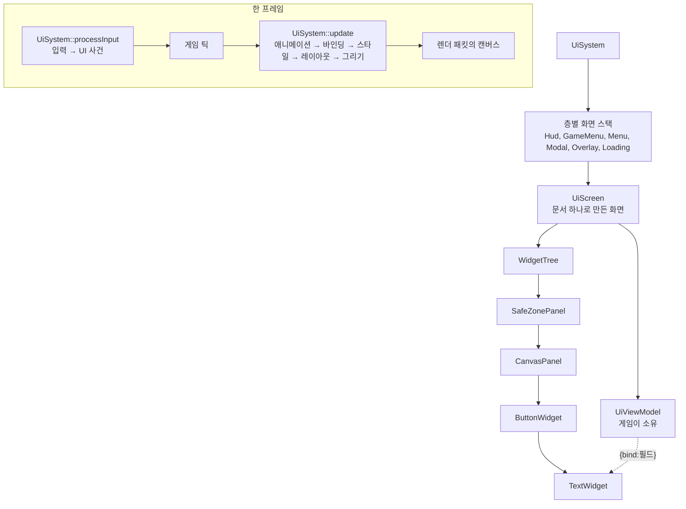

# UI — 런타임(게임) UI

## 이것은 무엇이고 왜 있나

게임 화면에 뜨는 메뉴, HUD, 알림, 자막, 머리 위 체력 바는 모두 이 폴더의 위젯으로 만듭니다.
에디터 창은 ImGui로 그리지만, ImGui는 즉시 모드(immediate mode)라서 매 프레임 화면 전체를 코드로 다시 만듭니다.
게임 UI에는 그 방식이 맞지 않습니다. 디자이너가 데이터로 화면을 만들고, 패드로 포커스를 옮기고, 애니메이션과 스타일을 입히고, 바뀐 곳만 다시 그려야 하기 때문입니다.

그래서 이 폴더는 **유지형(retained) 위젯 트리**를 둡니다. 위젯은 프레임이 지나도 남아 있고, 값이 바뀌면 무엇이 바뀌었는지를 이유별로 알립니다.
언리얼의 Slate와 UMG, CommonUI, 유니티의 UI Toolkit, Godot의 `Control` 에 해당합니다.

| 이 엔진 | 언리얼 | 유니티 UI Toolkit | Godot |
|---|---|---|---|
| `Widget`, `PanelWidget`, `WidgetTree` | `SWidget`, `SPanel`, UMG `UWidget` | `VisualElement` | `Control`, `Container` |
| 무효화 이유(`WidgetDirty`) | `EInvalidateWidgetReason` | `VersionChangeType` | `queue_redraw` |
| `UiSystem` | `FSlateApplication` + CommonUI 액션 라우터 | `EventSystem`, `PanelSettings` | `Viewport` GUI 입력 |
| `UiScreen`, `UiLayer` | `UCommonActivatableWidget`, 레이어 스택 | (직접 구현) | `CanvasLayer` |
| `*.ui.xml`, `*.uistyle.xml` | 위젯 블루프린트, 스타일 에셋 | UXML, USS | `.tscn`, `Theme` |
| `UiViewModel` | UMG MVVM ViewModel | 런타임 데이터 바인딩 | 시그널 |

이 폴더는 [Engine 레이어 구성](../README.md)의 티어 8에 있습니다. 입력(티어 6), 글자(티어 5), 사용자 설정(티어 7)을 쓰고, 렌더러와는 서로 include 하지 않습니다.
둘 사이에 오가는 값은 그리기 목록(`CanvasDrawList`) 하나뿐입니다. 언리얼에서 Slate와 SlateRHIRenderer가 나뉜 것과 같습니다.

## 머릿속 그림



이 그림에서 기억할 개념은 네 가지입니다.

**위젯 트리.** 화면 하나는 위젯 트리 하나를 소유합니다. 패널(`PanelWidget`)은 자식 위젯을 소유하고 배치하는 위젯입니다.
트리 밖에서 위젯을 오래 가리킬 때는 포인터 대신 `WidgetId` 를 보관합니다. 오브젝트 핸들과 같은 규칙입니다.

**무효화 이유.** 위젯 값이 바뀌면 위젯은 "레이아웃이 바뀌었다", "그리기만 바뀌었다"처럼 이유를 나눠 알립니다.
레이아웃 이유만 부모 쪽으로 번지고, 나머지는 그 위젯에서 멈춥니다. 위젯이 1만 개 있어도 글 하나가 바뀌면 그 주변만 다시 계산합니다.

**화면과 층.** 화면(`UiScreen`)은 층(`UiLayer`)마다 쌓입니다. 맨 위에 있으면서 포커스를 받는 화면을 **활성 화면**이라고 하고, 활성 화면만 포커스와 UI 행동 입력을 받습니다.
HUD는 포커스를 받지 않으므로 HUD만 떠 있을 때는 패드 입력이 모두 게임으로 갑니다.

**데이터로 만드는 화면.** 화면의 구조는 문서(`*.ui.xml`), 겉모습은 스타일 시트(`*.uistyle.xml`), 보이는 값은 뷰모델(`UiViewModel`)이 정합니다.
게임 코드는 위젯을 찾지 않고 뷰모델 필드에 값을 넣습니다. 문서의 바인딩 식 `{bind:필드}` 가 그 값을 위젯 필드에 연결합니다. 형식과 규칙은 하위 문서 [UI 문서와 데이터 바인딩](Document/README.md)에 있습니다.

## 따라 해 보기 — 문서 하나로 화면을 띄우고 뷰모델로 값 넣기

점수와 남은 시간을 보여 주고, 버튼을 누르면 게임이 반응하는 작은 화면을 만들어 봅니다.
문서 작성, 뷰모델 정의, 화면 열기, 값 넣기, 명령 받기, 화면 닫기를 모두 거칩니다.
저장소에 같은 구조로 동작하는 예가 있습니다. Shooter3D의 HUD(`Resource/game/shooter3d/ui/hud.ui.xml`)와 GameFramework의 `HudViewModel`, `HudControllerComponent` 입니다.

### 1단계 — 문서 쓰기

게임 팩에 `ui/score.ui.xml` 을 만듭니다. 원소 이름은 위젯 타입이고, 속성 이름은 그 타입의 PROPERTY 이름입니다.

<!-- snippet: 점수 화면 문서(UiScreenDesc + SafeZonePanel 루트 + 바인딩 둘 + 버튼 명령) — 5b U7 에서 문서 예시 테스트로 대조 -->
```xml
<UiDocument _schemaVersion="1">
	<UiScreenDesc _layer="GameMenu" _defaultFocus="Again" />
	<SafeZonePanel>
		<CanvasPanel>
			<BoxPanel _orientation="Vertical" _spacing="12">
				<_slot _anchorMin="0.5,0.5" _anchorMax="0.5,0.5" _bAutoSize="true" _growHorizontal="Both" _growVertical="Both" />
				<TextWidget _name="Score" _text="{bind:_score}" _bLocalized="false" />
				<TextWidget _name="TimeLeft" _text="{bind:_secondsLeft, converter=Seconds}" _bLocalized="false" />
				<ButtonWidget _name="Again" _command="PlayAgain">
					<TextWidget _text="Play Again" />
				</ButtonWidget>
			</BoxPanel>
		</CanvasPanel>
	</SafeZonePanel>
</UiDocument>
```

`UiScreenDesc` 는 화면의 성질입니다. 층, 모달 여부, 기본 포커스 위젯 같은 값을 적고, 적지 않은 값은 기본값입니다.
`{` 로 시작하는 속성 값은 값이 아니라 바인딩 식입니다. `converter=Seconds` 는 초를 `m:ss` 글로 바꾸는 엔진 기본 변환기입니다.
버튼의 `_command` 는 버튼을 누르면 화면에 전달되는 명령 이름입니다.

### 2단계 — 뷰모델 정의하기

뷰모델 필드는 리플렉션 PROPERTY 입니다. 세터는 `setField` 로 쓰면 값이 같을 때 알림을 보내지 않습니다.

<!-- snippet: ScoreViewModel(REFLECT, getTypeInfo 재정의, setField 세터 둘) — 5b U7 에서 실제 소스(HudViewModel)나 문서 예시 테스트로 대조 -->
```cpp
REFLECT()
class ScoreViewModel : public UiViewModel
{
public:
    REFLECT_BODY();

    ScoreViewModel();
    ~ScoreViewModel() override;

    const TypeInfo* getTypeInfo() const override { return StaticType(); }

    void setScore( int32 score ) { (void)setField( _score, score, "_score" ); }
    void setSecondsLeft( float32 seconds ) { (void)setField( _secondsLeft, seconds, "_secondsLeft" ); }

private:
    PROPERTY()
    int32 _score;
    PROPERTY()
    float32 _secondsLeft;
};
```

`getTypeInfo()` 재정의를 빠뜨리면 안 됩니다. 엔진은 RTTI를 쓰지 않으므로, 이 함수가 바인딩이 필드를 찾는 유일한 경로입니다.

### 3단계 — 화면을 열고 뷰모델과 명령 연결하기

게임 컴포넌트가 플레이를 시작할 때 화면을 엽니다. 화면은 `UiSystem` 이 소유하므로 핸들(`UiScreenHandle`)만 보관합니다.

<!-- snippet: onBeginPlay 에서 화면 열기와 뷰모델, 명령 연결 — 5b U7 에서 HudControllerComponent::openScreen 과 대조 -->
```cpp
void ScoreBoardComponent::onBeginPlay()
{
    Component::onBeginPlay();

    UiSystem* pUi = game::getService<UiSystem>();
    if ( pUi == nullptr || pUi->isInitialized() == false )
        return; // 전용 서버와 헤드리스 테스트에는 UI 시스템이 없다

    _screen           = pUi->openScreen( "game/empty/ui/score.ui.xml" );
    UiScreen* pScreen = pUi->findScreen( _screen );
    if ( pScreen == nullptr )
        return; // 문서를 읽지 못했다. 원인은 로그에 파일과 줄 번호로 남는다

    pScreen->setViewModel( &_viewModel );
    pScreen->registerCommand( "PlayAgain", SW_DELEGATE_LAMBDA( UiCommandDelegate, [this]( const hashed_string&, Widget& )
    {
        restartRound();
    } ) );
}
```

### 4단계 — 매 프레임 값 넣기

`onTick` 에서 뷰모델 세터를 부릅니다. 같은 값이면 알림이 없으므로 매 프레임 불러도 됩니다.

```cpp
_viewModel.setScore( _score );
_viewModel.setSecondsLeft( _roundTimer );
```

그 프레임의 `UiSystem::update` 바인딩 단계가 알림이 온 필드에 연결된 위젯 필드만 씁니다. 글이 바뀐 `TextWidget` 은 레이아웃을, 색만 바뀐 위젯은 그리기만 다시 합니다.

### 5단계 — 화면 닫기

플레이가 끝나면 뷰모델을 먼저 분리하고 화면을 닫습니다. 닫기는 지연되므로, 닫기 애니메이션이 도는 동안 뷰모델이 먼저 사라질 수 있기 때문입니다.

```cpp
UiScreen* pScreen = pUi->findScreen( _screen );
if ( pScreen != nullptr )
    pScreen->setViewModel( nullptr );
pUi->closeScreen( _screen );
_screen = kInvalidUiScreenHandle;
```

### 결과 확인하기

게임을 실행하면 화면 가운데에 점수와 시간, 버튼이 보이고, 패드나 방향키로 버튼에 포커스 테두리가 보입니다.
에디터(`-EnableEditor`)로 실행 중이라면 `score.ui.xml` 이나 스타일 시트를 고쳐 저장하는 즉시 화면이 다시 만들어집니다. 포커스와 스크롤 위치는 위젯 이름으로 유지됩니다.
문서에 오타가 있으면 화면이 열리지 않고 `<경로>:<줄>: <이유>` 형식의 오류가 로그에 남습니다.

## 작동 원리

### 프레임 순서

UI 서비스는 `engine::getUiSystem()`, 게임 모듈에서는 `game::getService<UiSystem>()` 으로 얻습니다. 기동 단계 `Ui` 가 Client 대상에서만 초기화하므로 전용 서버에는 없습니다.
UI는 모두 게임 스레드에서 실행하고, 한 프레임에 두 번 실행합니다.

- **`processInput`** 은 `EngineLoop::beginFrame` 의 입력 갱신 직후, 게임 틱 **앞**에 실행합니다. UI가 먼저 입력을 처리해야 UI가 쓴 입력을 게임의 폰이 보지 않습니다.
- **`update`** 는 게임 틱 뒤, 렌더 패킷을 만들기 전에 실행합니다. 이번 프레임의 게임 상태로 애니메이션, 바인딩, 스타일, 레이아웃, 그리기를 이 순서로 처리합니다.
  레이아웃은 화면 트리마다 `UiLayoutPass::update` 로 하고, 화면마다 뷰포트 전체가 루트 사각형입니다.
  작은 창은 루트 슬롯의 여백과 크기 덮어쓰기, 또는 루트 패널 안의 위치로 만듭니다.

포인터 위치는 창 픽셀을 지난 `update` 의 뷰포트 배율로 나눈 UI 단위입니다. 입력이 레이아웃보다 먼저 처리되므로, 포인터는 지난 프레임에 그린 화면을 기준으로 맞춥니다.

### 위젯 트리

- **수명.** 부모 패널이 자식을 `unique_ptr` 로 소유하고, 루트는 `WidgetTree::setRoot` 가 소유합니다.
  트리 밖에서는 `WidgetId` 를 보관하고 `WidgetTree::findWidgetById` 로 위젯을 찾습니다. 찾은 포인터는 그 함수 호출 안에서만 씁니다. 위젯 번호는 프로세스 안에서 다시 쓰지 않습니다.
- **이름.** `findWidget<T>( "name" )` 으로 이름과 타입으로 찾습니다. 한 트리에 같은 이름이 둘이면 먼저 붙은 위젯이 찾히고, 붙일 때 경고가 남습니다.
- **보임.** `WidgetVisibility` 는 언리얼의 `ESlateVisibility` 와 같은 다섯 가지입니다.

| 값 | 공간 | 클릭 |
|---|---|---|
| `Visible` | 차지함 | 받음 |
| `Collapsed` | 차지하지 않음 | 받지 않음 |
| `Hidden` | 차지함 | 받지 않음 |
| `HitTestInvisible` | 차지함 | 자기와 자식 모두 받지 않음 |
| `SelfHitTestInvisible` | 차지함 | 자기만 받지 않음 |

- **리플렉션.** 위젯은 리플렉션 타입입니다. 문서 읽기, 에디터 인스펙터, 핫 리로드가 모두 리플렉션 정보를 씁니다.
  파생 위젯은 `getTypeInfo()` 를 자기 `StaticType()` 으로 재정의합니다. RTTI가 없으므로 `castTo` 가 동적 타입을 아는 방법이 이것뿐입니다.

### 무효화

세터는 값이 같으면 아무것도 하지 않고, 다르면 `invalidate( 이유 )` 를 부릅니다.

| 이유 | 뜻 | 영향 범위 |
|---|---|---|
| `kLayout` | 원하는 크기가 바뀔 수 있음 | 레이아웃 경계까지 부모 쪽으로 |
| `kArrange` | 크기는 같고 자식 위치만 바뀜 | 자기 |
| `kPaint` | 그리기만 바뀜 | 자기 |
| `kTransform` | 렌더 변환이나 불투명도만 바뀜 | 자기와 자손의 그리기 캐시 |
| `kStyle` | 상태나 클래스가 바뀌어 스타일을 다시 계산 | 자기 |
| `kVisibility` | 보임이 바뀜 | 레이아웃과 그리기 모두 |

`kLayout` 은 부모 쪽으로 `kChildLayout` 을 올리다가 **레이아웃 경계**나 루트에서 멈추고, 그 위젯을 "다시 계산할 루트"로 기록합니다.
레이아웃 경계는 크기가 자식에 좌우되지 않는 위젯입니다(`isLayoutBoundary`). 기본 규칙은 슬롯에 두 축의 크기 덮어쓰기가 모두 있는 위젯입니다(`WidgetLayoutSlot::hasFixedSize`).
유지형 UI가 빠른 이유가 이것입니다. 레이아웃 이유만 위로 번지고 경계에서 멈추므로, 큰 트리에서도 바뀐 곳 주변만 다시 계산합니다.

### 입력 사건의 경로

**히트 테스트**는 그리기의 역순으로 내려가며, 점을 포함하는 가장 깊은 위젯까지의 경로(루트에서 잎까지)를 찾습니다.
뒤에 붙인 자식이 위에 그려지므로 먼저 검사합니다. z 순서를 쓰는 패널은 `PanelWidget::collectPaintOrder` 의 역순입니다.
보임 다섯 가지를 따르고, 렌더 변환은 역변환으로 계산합니다. 그래서 회전한 사각형의 모서리 바깥은 맞지 않습니다. 자르는 패널(`setClipChildren`) 밖의 점은 그 자식도 받지 않습니다.

사건은 그 **경로**를 따라 두 번 전달됩니다. 먼저 루트에서 잎으로 터널링(미리 보기)하고, 다음에 잎에서 루트로 버블링합니다. `UiReply::makeHandled()` 를 돌려주면 거기서 멈춥니다.
언리얼의 `FReply`, 유니티의 TrickleDown과 BubbleUp과 같습니다. 경로는 위젯 번호로 기록하므로 사건 처리 중에 분리된 위젯은 건너뜁니다.
꺼진 위젯도 히트 테스트에는 맞습니다. 아래 위젯으로 클릭이 새지 않게 하기 위해서이고, 사건은 받지 않습니다.

- **포인터 캡처.** 포인터를 누를 때 `capturePointer()` 를 부른 위젯은 포인터가 밖으로 나가도 `releasePointer()` 할 때까지 사건을 받습니다. 슬라이더 끌기가 이것을 씁니다.
- **호버.** 호버는 경로를 따라 전달되지 않는 알림입니다. 이전 경로와 새 경로를 비교해 빠진 위젯은 잎부터 Leave를, 새로 들어간 위젯은 루트부터 Enter를 받습니다(`onHoverChanged`). 상태 스타일 때문에 `kStyle` 이 됩니다.

### 포커스와 방향 탐색

포커스는 사용자(로컬 플레이어)마다 하나이고, 지금은 사용자 0만 있습니다. 포커스 위젯 번호는 그 트리에 기록되어, 위젯이 분리되면 트리가 해제합니다.
포커스를 받을 수 있는 위젯은 `supportsFocus` 가 참이고, 자기와 모든 조상이 켜져 있고 보이는 위젯입니다.

방향 탐색은 언리얼의 `EUINavigationRule`, Godot의 `focus_neighbor` 와 같은 규칙을 씁니다(`UiNavigationSolver`).

1. 포커스 위젯에서 조상 쪽으로 올라가며 그 방향의 규칙(`WidgetNavigation`)을 봅니다.
2. 처음 만난 `Explicit` 은 지정한 이름의 위젯으로 갑니다. 그 위젯이 포커스를 받을 수 없으면 다음 규칙을 봅니다.
3. 처음 만난 `Stop` 이나 `Wrap` 위젯이 후보를 찾을 범위입니다. 모두 `Escape` 이면 화면 루트가 범위입니다.
4. 범위 안에서 **주축 거리 + 2 × 수직축 틈** 점수가 가장 낮은 위젯을 고릅니다. 같은 줄과 같은 열이 먼저 뽑히는 점수입니다.
   점수가 같으면 중심 거리, 그다음 문서 순서로 고르므로 결과가 결정적입니다.
5. 후보가 없고 `Wrap` 이면 반대쪽 끝으로 갑니다. `Next` 와 `Previous` 는 문서 순서로 돕니다.

자르는 패널 밖으로 완전히 나간 위젯은 후보가 아닙니다. 다만 스크롤 패널(`canScrollIntoView`)이 자른 위젯은 후보이고, 포커스가 가면 그 패널이 위젯이 보이게 스크롤합니다.

### UI 행동 입력과 먹은 입력

UI는 키와 버튼을 직접 보지 않고 **행동(action)**을 받습니다. 키 바인딩, 패드, 자동화의 가상 입력이 모두 같은 경로로 들어옵니다.

| 이 엔진 | 언리얼 | 유니티 | Godot |
|---|---|---|---|
| UI 행동 맵 `engine/input/ui.input.xml` | CommonUI 입력 액션 | `InputSystemUIInputModule` | `ui_*` 액션 |
| `UiSystem::isActionConsumed` | Enhanced Input 입력 소비 | `IsPointerOverGameObject` | `set_input_as_handled()` |

**UI 행동 맵**은 `UiSystem` 이 소유합니다(`EngineDefaultAssets::_uiInputMap`). Shipping에도 들어 있습니다. 셸 입력 맵은 개발 도구라서 쓰지 않습니다.
맵의 레이어 `UI` 는 활성 화면이 있을 때만 켭니다. HUD만 떠 있으면 패드 A는 게임의 입력입니다.
탐색 행동은 `trigger="Repeat"` 이라 누를 때 한 번, 지연 뒤에는 일정 간격마다 반복합니다. 스틱은 크게 기운 축 방향으로 한 번 움직인 뒤 같은 간격으로 반복합니다.

`processInput` 의 순서는 다음과 같습니다.

1. 뗀 입력의 소비 상태를 풉니다.
2. UI 맵을 갱신하고, 이번 프레임 마지막으로 쓴 장치로 입력 방식(포인터 또는 탐색)을 정합니다(`InputManager::getLastFrameEvents`).
3. 포인터 사건을 처리합니다.
4. 행동을 포커스 경로로 보냅니다. 아무도 처리하지 않으면 포커스를 옮기고, `UI.Back` 은 화면의 `onBack` 으로 보냅니다.
5. 닫기 요청을 적용하고, 글 입력 포커스를 갱신합니다.

**먹은 입력.** UI가 쓴 행동의 물리 입력은 **뗄 때까지** 먹은 입력이 됩니다. 키, 패드 버튼, 조합 키의 트리거 키, 기운 스틱이 모두 해당하고, 위젯이 처리한 마우스 버튼도 그렇습니다.
게임 쪽에서 이것을 확인하는 곳은 플레이어 조종자(`PlayerControllerComponent`) 하나입니다. 먹은 행동은 의도에 넣지 않고, 모달이나 로딩 화면이 있으면 의도를 0으로 둡니다.
활성 화면이 커서를 원하면(`wantsCursor`) 마우스 잠금도 쉽니다. 입력 맵이 UI 맵과 게임 맵 둘이어도 물리 슬롯으로 비교하므로, 메뉴에서 누른 패드 A가 점프가 되지 않습니다.

**글 입력.** 글 입력 위젯(`supportsTextInput`)이 포커스를 가지면 키보드 포커스 `Ui` 를 잡습니다. 그동안 게임은 키를 보지 못합니다.
입력 위젯에 있는 동안 누른 키는 뗄 때까지 게임에 가지 않고, 글자와 IME 조합은 그 위젯의 `onTextEvent` 로 갑니다.
이때 UI 행동은 `UI.Back`, `UI.FocusNext`, `UI.FocusPrevious` 만 받습니다. 스페이스가 확인 버튼으로 동작하지 않게 하기 위해서입니다. 개발 콘솔이 열려 있으면 UI는 행동을 받지 않습니다.

### 화면 스택

층(`UiLayer`)은 `Hud`, `GameMenu`, `Menu`, `Modal`, `Overlay`, `Loading` 여섯이고, 층마다 스택이 있습니다.
그리기 순서는 층 순서, 그 안에서는 쌓인 순서입니다. 입력은 그 역순입니다.

- **활성 화면**은 맨 위의 포커스 받는 화면입니다. HUD와 오버레이 층은 포커스를 받지 않습니다. 막는 화면이 있으면 그 아래로는 내려가지 않습니다.
- **모달과 로딩 화면**은 아래 화면의 클릭과 게임 입력을 막습니다(`isGameInputBlocked`). 플레이어 조종자가 의도를 만들 때 이 값을 봅니다. 오버레이 층(알림)은 포인터를 받지 않습니다.
- 다른 화면에 덮이면 그때의 포커스를 기억했다가, 다시 활성이 되면 돌려줍니다. 탐색 입력 방식이면 처음 열 때 `_defaultFocus` 에 포커스를 줍니다. 없으면 문서 순서의 첫 위젯입니다.
- **닫기는 지연됩니다.** 사건 처리 중에 자기 화면을 닫아도 이번 경로는 끝까지 돌고, `processInput` 끝과 `update` 앞에서 지웁니다.
- `_bPausesGame` 인 화면이 하나라도 있으면 `GameTimeScale::addPauseRequest` 로 정지 요청 하나를 등록합니다. `gv_timeScale` 은 바꾸지 않습니다.
- 게임이 마우스를 잠근 동안(1인칭)은 포인터 사건을 만들지 않습니다.

C++ 화면 클래스(`UiSystem::openScreen<내 화면>( 경로 )`)는 다음 함수를 재정의할 수 있습니다.

| 함수 | 부르는 때 |
|---|---|
| `onCommand` | 버튼이 명령을 냈을 때 |
| `onBack` | `UI.Back` 을 아무도 처리하지 않았을 때 |
| `onUnhandledAction` | 위젯이 처리하지 않은 `UI.TabNext`, `UI.TabPrevious` |
| `onTick` | `update` 마다 바인딩 전에 |
| `wantsUiActions` | false이면 활성인 동안 UI 행동을 끈다 |
| `onTreeRebuilt` | 핫 리로드로 트리를 다시 만든 뒤 |

`onTick` 은 카운트다운이나 키 입력 대기에 씁니다. 틱 안에서 화면을 열거나 닫아도 됩니다. `wantsUiActions` 는 원시 입력을 받는 창(키 바인딩 창)이 씁니다.
`onTreeRebuilt` 는 코드로 붙인 위젯을 다시 만드는 곳입니다.

**모듈 핫 리로드.** 언로드하는 모듈에 vtable이 있는 화면이나, 그런 위젯이 들어 있는 화면은 그 자리에서 닫습니다. 로그에 "closed for module reload" 경고가 남습니다.
그래서 위젯 타입의 정적 상태를 모듈에 두지 않습니다. 화면 클래스가 그 모듈 것이 아닌 문서 화면은 다음 `update` 가 같은 문서로 다시 엽니다. 이때 위젯은 새 모듈 이미지의 타입으로 만들어집니다.

### 레이아웃

어느 엔진이나 레이아웃은 두 번의 순회입니다. 아래에서 위로 "얼마나 크고 싶은가"를 묻는 measure(Slate `ComputeDesiredSize`, WPF `Measure`)와,
위에서 아래로 "이 위치에 이 크기로 놓아라"를 정하는 arrange(Slate `OnArrangeChildren`, Godot `fit_child_in_rect`)입니다. `UiLayoutPass::update( tree, context )` 가 두 순회를 실행합니다.

- **measure는 가용 크기를 받습니다**(`computeDesiredSize( context, availableSize )`). WPF, Yoga와 같고 Slate와 다릅니다.
  그래서 줄 바꿈 글이 Fill 슬롯에 들어가면 그 슬롯 너비로 높이를 정해 **같은 프레임에** 맞습니다. 축이 `kUiUnbounded` 이면 그 축은 원하는 만큼이고, 비교는 `UiLayoutPass::isUnbounded` 로 합니다.
- **캐시.** 위젯은 마지막 가용 크기와 결과를 보관합니다. `kLayout` 이나 `kChildLayout` 이 없고 가용 크기가 같으면 다시 계산하지 않습니다.
  한 번의 순회 안에서 같은 위젯을 같은 가용 크기로 두 번 계산하지 않도록 순회 번호를 씁니다.
- **루트만 다시.** 트리에 기록된 "다시 계산할 루트"(레이아웃 경계, 트리 루트, `kArrange` 위젯)만 지난 가용 크기와 지난 슬롯 위치로 다시 계산하고 배치합니다.
  `kArrange`(스크롤 오프셋)는 위로 번지지 않고 그 위젯만 다시 배치합니다. measure는 0번입니다.
- **접힌 위젯**(`Collapsed`)은 계산도 배치도 하지 않습니다. 순회가 끝날 때 그 아래로 내려가지 않고 `kChildLayout` 을 남겨, 다시 보이면 그 아래를 다시 계산합니다.
- 배율이나 글자 배율이 지난 순회와 다르면 트리 전체를 다시 계산합니다(`invalidateAllLayout`).
- **픽셀 맞춤.** 부모 축이 회전과 기울임이 없는 단위 축이면 사각형 변을 `round( v × uiScale ) / uiScale` 로 맞춥니다. 1 px 테두리가 번지지 않게 하는 Slate의 픽셀 스냅과 같습니다.
- 기하가 바뀐 위젯만 그리기 무효화가 됩니다(`setArrangedGeometry`).

**슬롯**(`WidgetLayoutSlot`)은 모든 패널의 배치 필드를 위젯 하나에 모은 것이고, 부모는 자기에게 필요한 필드만 읽습니다. Godot와 같은 방식입니다.
UMG는 부모 종류마다 슬롯 객체(`UCanvasPanelSlot`, `UHorizontalBoxSlot`)를 두지만, 이 엔진은 리플렉션 타입이 하나라서 문서와 인스펙터, 핫 리로드가 단순합니다.
공통 필드는 여백, 정렬(Fill, Start, Center, End), 크기 덮어쓰기, 최소와 최대 크기입니다.

| 패널 | 배치 규칙 | 언리얼 대응 |
|---|---|---|
| `BoxPanel` | 주축 방향으로 Auto, 남는 공간은 Fill 비율로 | HorizontalBox, VerticalBox |
| `OverlayPanel` | 모든 자식이 패널 전체를 슬롯으로 씀 | Overlay |
| `CanvasPanel` | 앵커 × 패널 크기 + 오프셋 | Canvas Panel |
| `GridPanel` | 열과 행 트랙(Auto, Fixed, Fill) | GridPanel |
| `WrapPanel` | 줄이 차면 다음 줄 | WrapBox |
| `ScrollPanel` | 내용 하나를 스크롤 축으로 무한 측정 | ScrollBox |
| `SafeZonePanel` | 안전 영역만큼 자식을 안으로 | SafeZone |

`BoxPanel` 의 교차축은 슬롯 정렬을 따르고, 자식 사이에 간격을 둡니다. `CanvasPanel` 의 자동 크기는 커지는 방향을 정할 수 있고, z 순서를 씁니다(`collectPaintOrder`).
`GridPanel` 은 CSS Grid를 단순하게 줄인 것입니다(`UiGridTrack`). 트랙 둘 이상에 걸친 자식은 모자란 만큼을 덮은 Auto 트랙에 고르게 나눕니다. 열을 먼저 정하고, 그 너비로 다시 계산해 행을 정합니다.
`WrapPanel` 의 줄 높이는 그 줄에서 가장 큰 자식입니다. `ScrollPanel` 은 내용을 `-오프셋` 위치에 놓고 자릅니다.
오프셋은 `[0, 내용 − 보이는 크기]` 범위이고, 바뀌면 `kArrange` 만 됩니다. `scrollIntoView` 는 필요한 만큼만 옮깁니다.

스크롤 입력은 `ScrollPanel` 이 사건으로 받습니다. UMG ScrollBox, Godot ScrollContainer와 같은 네 가지입니다.

- **휠**(버블링)은 한 번에 `_wheelStep` 만큼 옮깁니다. 끝에 닿아 더 옮기지 못하면 처리하지 않으므로 바깥 스크롤 패널이 받습니다.
- **스크롤 막대 끌기**는 터널링으로 받습니다. 막대가 내용 위에 겹쳐 그려지므로 버튼보다 먼저 받아야 합니다.
  엄지를 누르면 포인터를 캡처하고, 끈 거리 × 최대 오프셋 / (트랙 − 엄지)만큼 옮깁니다. 트랙을 누르면 한 화면씩 옮깁니다. 막대 사각형은 `computeScrollBar( 축 )` 으로 구하고, 그리기도 같은 값을 씁니다.
- **패드 오른쪽 스틱**(`UI.Scroll` 행동)은 포커스 경로로 가고, 포커스가 없으면 포인터가 올라간 경로로 갑니다. `_stickSpeed` × 프레임 시간만큼 옮기고, 쓴 스틱은 먹은 입력입니다.
- **포커스 탐색**은 `UiFocusManager::navigate` 가 포커스를 옮긴 뒤 조상 패널마다 `scrollIntoView` 를 부릅니다.

레이아웃 결과는 `UiLayoutDump::makeDump( tree )` 로 글로 뽑을 수 있습니다. 줄마다 `<깊이만큼 들여쓰기><이름> x y w h` 형식이고 소수 둘째 자리까지 씁니다.

#### 오른쪽에서 왼쪽 배치

위젯마다 흐름 방향 `_flowDirection` 이 있습니다. 값은 `Inherit`, `LeftToRight`, `RightToLeft` 이고, UMG의 FlowDirection, Godot의 `layout_direction` 과 같습니다.
`Inherit` 는 부모를 따르고, 루트는 문화권을 따릅니다(`UiLayoutContext::_bRightToLeft` = `UiLayoutPass::isCultureRightToLeft()`). 의사 문화권 `qps-plocm` 도 RTL입니다.
숫자 입력 위젯과 시계처럼 방향이 바뀌면 안 되는 위젯은 `LeftToRight` 로 고정합니다.
arrange가 결과 방향을 위젯에 기록하고(`isRightToLeft`), 글 위젯은 그 값을 문단 방향(`TextLayoutStyle::_paragraphDirection`)으로 넘깁니다.

**거울 배치는 두 곳에서만 합니다.** 패널은 언제나 왼쪽에서 오른쪽으로 계산합니다.

- `PanelWidget::arrangeChild` 가 RTL 패널이면 자식 사각형을 패널 너비 기준으로 뒤집습니다(x → 너비 − x − 폭). 상자의 가로 순서, 캔버스의 앵커와 오프셋, 격자 열, 흐름 줄이 한 번에 뒤집힙니다.
- `UiLayoutPass::arrange` 가 자기 슬롯을 **부모의** 방향으로 읽어, RTL이면 여백의 왼쪽과 오른쪽, 가로 정렬의 Start와 End를 바꿉니다.

스크롤 패널은 내용 위치를 뒤집지 않습니다(`mirrorsChildrenInRightToLeft` 가 false). 내용 안의 패널이 자기 방향으로 뒤집습니다.
방향을 바꾸면 크기는 그대로이므로 `kArrange` 만 됩니다. 문화권이 바뀌어 루트 방향이 달라지면 다음 순회가 트리 전체를 다시 배치합니다.
포커스 탐색의 Left와 Right는 화면 기준 그대로입니다. 결과 사각형으로 후보를 고르므로 거울 배치에 저절로 맞고, 히트 테스트도 기하를 보므로 따로 할 일이 없습니다.

### 그리기

| 이 엔진 | 언리얼 | 유니티 UI Toolkit | Godot |
|---|---|---|---|
| `TextWidget`, `ImageWidget` | `STextBlock`, `SImage` | Label, Image | Label, TextureRect |
| `BorderPanel`, `UiBrush` | `SBorder`, `FSlateBrush` | VisualElement 배경 | PanelContainer, StyleBox |
| `ButtonWidget`, `CheckBoxWidget` | Button, CheckBox | Button, Toggle | Button, CheckBox |
| `SliderWidget`, `ProgressBarWidget` | Slider, ProgressBar | Slider, ProgressBar | HSlider, ProgressBar |
| `ComboBoxWidget`, `TextInputWidget` | ComboBox, EditableTextBox | DropdownField, TextField | OptionButton, LineEdit |
| `ListViewWidget` | ListView | ListView | ItemList |
| `UiPaintPass` 와 위젯별 그리기 캐시 | Slate 요소 캐시 | 더러운 요소 다시 그리기 | CanvasItem 명령 캐시 |

위젯은 `paint( painter, context )` 에서 **자기 로컬 좌표 (0, 0)부터 크기까지**를 그립니다. 그리기 도구(`CanvasPainter`)의 변환이 위젯의 기하입니다.
결과는 위젯의 **그리기 캐시**에 남습니다. 캐시는 물리 픽셀 사각형이고, 조상의 자르기와 불투명도가 이미 반영되어 있습니다.
그리기 패스(`UiPaintPass`)는 트리를 그리기 순서로 돌며 캐시를 프레임 목록에 **이어 붙입니다**(`CanvasDrawList::appendDrawList`). 가위 사각형과 텍스처가 같으면 배치를 합칩니다.

다시 그리는 위젯은 다음과 같습니다.

- `kPaint`, `kStyle`, `kVisibility` 가 있는 위젯과 처음 그리는 위젯입니다. `kStyle` 이 포함되는 이유는 스타일 패스 전에는 상태별 겉모습이 위젯 필드에 있기 때문입니다.
- **조상에 `kTransform` 이 있는** 위젯입니다. 불투명도와 렌더 변환이 자손 캐시에 반영되어 있기 때문입니다.
- UI 배율이 바뀌면 모든 위젯, 글리프 아틀라스 세대가 바뀌면 글 위젯입니다. 비운 아틀라스 페이지의 사각형이 다른 글자를 가리키게 되기 때문입니다.
- 흐름 방향이 바뀌면 레이아웃이 `kPaint` 를 겁니다.

자르는 패널은 자기 사각형을 가위 사각형으로 쌓습니다. 자식 위에 그리는 것(스크롤 막대)은 `paintOverChildren` 에서 그리고, 자르기 밖입니다.

`UiSystem::update` 가 화면을 그리기 순서로 그립니다. 탐색 입력 방식이면 포커스 위젯 둘레에 테두리를 그 화면 위에 그리고, 포인터 방식이면 숨깁니다. CommonUI와 같습니다.
목록 내용이 지난 프레임과 같으면 내용 번호(`getCanvasRevision`)를 올리지 않으므로, 렌더러가 사각형을 다시 업로드하지 않습니다.
`EngineLoop` 가 목록을 렌더 패킷의 주 출력 캔버스에 넣습니다. `-gv_canvasTestPattern` 은 그 위에 그립니다. 게임 창의 뷰포트 0은 백버퍼 크기입니다.

위젯별로 알아 둘 점은 다음과 같습니다.

- **글 위젯**(`TextWidget`)의 원하는 크기는 측정 결과입니다. 글자 배율을 곱한 크기이고, 줄 바꿈이면 가용 너비 안에서 잽니다. 그릴 때는 위젯 너비로 배치하고 결과를 캐시합니다.
  글과 스타일이 바뀌면 `kLayout`, 색만 바뀌면 `kPaint` 입니다. 문단 방향은 위젯의 흐름 방향이고, `_bRichText` 이면 `RichTextParser` 표기를 읽습니다.
- **이미지 위젯**(`ImageWidget`)은 브러시(색, 둥근 모서리, 9-슬라이스)와 이미지를 곱해 그립니다. 이미지가 없으면 단색 상자입니다. `_bMirrorInRtl` 이면 RTL일 때 좌우를 뒤집습니다.
  이미지는 텍스처 객체(`setImage`)나 **경로**(`_imagePath`, `setImagePath`)로 지정합니다. 경로 이미지는 아래 "함정과 주의"의 이유로 그리기 목록에 경로 그대로 넣습니다.
  게임 스레드는 경로 이미지의 크기를 모르므로, 원하는 크기는 `_imageSize` 나 슬롯의 크기 덮어쓰기로 정합니다.
- **버튼**(`ButtonWidget`)은 같은 버튼 위에서 누르고 뗄 때, 또는 포커스 상태에서 `UI.Accept` 를 받을 때 클릭됩니다. 누른 동안 포인터를 캡처하므로 밖에서 떼면 취소됩니다.
  누르면 포커스가 버튼으로 옵니다. 상태(보통, 호버, 누름, 꺼짐)별 배경은 위젯 필드에 있고, 스타일 시트가 덮어씁니다.
- **슬라이더**는 포커스 상태에서 `UI.NavigateLeft` 와 `UI.NavigateRight` 를 처리해 값을 한 단계 옮깁니다. 그래서 포커스는 위아래로만 떠납니다. RTL이면 최솟값이 오른쪽입니다.
- **콤보 상자**는 자기가 든 화면의 `UiSystem` 에 팝업 화면을 엽니다. 팝업은 Modal 층이지만 막지 않고, 항목 버튼이 상자 아래에 놓입니다. 밖을 클릭하거나 `UI.Back` 이면 닫힙니다.
  팝업은 상자를 (화면 핸들, 위젯 번호)로 다시 찾습니다(`WidgetTree::getScreen`).
- **글 입력 위젯**은 글자 사건을 끝에 붙입니다. IME 조합 중인 글은 확정 전까지 따로 보이고, Enter는 확정 알림입니다. 커서는 글 끝에 있습니다.
  `UI.TextBackspace` 는 입력 위젯이 키보드를 가진 동안에만 `UiSystem` 이 보내고, 끝 코드 포인트 하나를 지웁니다.
- **가상 목록**(`ListViewWidget`)은 보이는 줄 수 + 1개만 줄 위젯을 만듭니다(`setRowFactory`). 항목 k는 언제나 줄 k % 줄 수에 연결합니다(`setRowBinder`).
  그래서 한 줄 스크롤하면 위젯 하나만 다시 연결되고, 보이는 동안 항목과 위젯의 짝이 바뀌지 않아 포커스가 항목을 따라갑니다. 줄 위젯은 레이아웃 도중에 만들어지고 바로 배치됩니다.

개발용 견본 화면 `-gv_uiDemo=1`(`Debug/UiDemoScreen`)에 글, 리치 텍스트, 버튼 다섯 개, 슬라이더, 체크 상자, 진행 막대, 콤보 상자, 입력 위젯이 한 패널에 있습니다.
네 백엔드의 스크린샷을 이 화면으로 비교합니다. 입력 방식은 커서가 실제로 움직일 때만 포인터로 바뀝니다. 창이 뜰 때 OS가 보내는 같은 위치의 이동은 세지 않습니다.

### 배율과 안전 영역

레이아웃은 **UI 단위**로 합니다. UI 단위는 기준 해상도 1920×1080의 픽셀이고, 화면에 그릴 때 배율을 곱합니다.
뷰포트(`UiViewport`)에는 UI 단위 크기(`_size`), 물리 크기(`_physicalSize`), 배율(`_uiScale`), 안전 영역(`_safeInsets`)이 있습니다.

- 배율은 해상도 규칙으로 구한 값을 최소와 최대 사이로 자른 뒤 `gv_uiScale` 을 곱한 값입니다.
  해상도 규칙은 `UiScaleSettings` 이고, `engine/ui/uiscale.xml` 을 게임 프리셋의 `_uiScaleSettings` 가 덮어씁니다.
  규칙은 `ShortestSide`(짧은 변 ÷ 기준 짧은 변, 기본값), `Width`, `Height`, `Fixed` 입니다. `ShortestSide` 는 가로 화면과 세로 화면 모두에 맞습니다. UMG의 DPI 곡선에 해당합니다.
- 창의 OS 배율(`IWindow::getContentScale`)은 `_bApplyContentScale` 일 때만 곱합니다. 데스크톱 앱 같은 UI에 쓰는 설정입니다.
  게임 창은 해상도 규칙이 이미 창 크기를 따르므로, 둘 다 곱하면 두 번 곱하게 됩니다. UMG의 기본 동작도 같습니다.
- `gv_uiTextScale` 은 글 측정에만 곱합니다(`UiLayoutContext::_textScale`). 글이 커지면 그 상자도 커집니다.
- `SafeZonePanel` 은 뷰포트 안전 영역과 겹치는 만큼 자식을 안으로 밉니다. PC의 안전 영역은 0이고, `gv_uiDebugSafeZone`(0..0.1, 각 변의 비율)으로 흉내 냅니다.
  언리얼의 `r.DebugSafeZone.TitleRatio` 와 같습니다. 화면 문서의 기본 루트는 `SafeZonePanel > CanvasPanel` 입니다.
- `UiSystem::computeViewport( 물리 크기, 창 배율 )` 이 뷰포트를 만들고, `makeLayoutContext()` 가 레이아웃 문맥을 만듭니다. `EngineLoop` 가 프레임마다 뷰포트를 `update` 에 넘깁니다.

### 데이터로 만드는 화면과 엔진 기본 화면

문서, 스타일 시트, 핫 리로드, 데이터 바인딩, 애니메이션, 오프스크린 화면은 [UI 문서와 데이터 바인딩](Document/README.md)에 있습니다.
옵션 메뉴, 일시정지 메뉴, 알림, 자막, HUD와 로딩 화면, 접근성 기능은 [엔진 기본 화면과 접근성](Screens/README.md)에 있습니다.

### 월드에 붙는 UI

| 이 엔진 | 언리얼 | 유니티 | Godot |
|---|---|---|---|
| `WidgetComponent` Screen, World | `UWidgetComponent` Screen, World | World Space Canvas | SubViewport → 3D 메시 |

`WidgetComponent` 는 게임 오브젝트에 위젯을 붙이는 컴포넌트이고, 두 방식이 있습니다.

**Screen 방식**은 위젯을 `UiSystem` 의 Hud 층에 있는 **마커 화면**에 자식으로 붙입니다. 마커 화면은 캔버스 패널이 루트이고 클릭을 막지 않으며, 처음 붙일 때 만들고 마지막 위젯을 분리할 때 닫습니다.
`UiSystem::update` 가 레이아웃 전에, 등록된 컴포넌트마다 오브젝트의 월드 위치를 게임 카메라로 투영해 슬롯을 옮깁니다(`computeMarkerPlacement`, 순수 함수).
게임 틱과 트랜스폼 적용이 끝난 뒤이므로 병렬 틱과 겹치지 않습니다. 2D(직교)와 3D가 같은 코드입니다.

- `_drawSize` 가 있으면 그 크기로 고정해 레이아웃 경계가 되고, 없으면 원하는 크기에 피벗을 맞춥니다.
- 기준점은 오브젝트 위치 + `_worldOffset`(월드 축)입니다. 머리 위 체력 바가 이것을 씁니다.
- 카메라 뒤와 화면 밖은 숨깁니다. `_bClampToScreenEdge` 이면 화면 가장자리(여백 24)에 붙입니다.
  카메라 뒤의 방향은 나누기 전의 클립 공간 방향으로 판단하므로, 오른쪽 뒤에 있으면 오른쪽 변에 붙습니다.
- `_maxDistance` 밖은 숨깁니다. `_bScaleWithDistance` 는 기준 거리 ÷ 거리(0.25부터 2까지)를 피벗 둘레의 렌더 변환으로 적용합니다.
- 코드에서 보이기를 정할 때는 `setHidden` 을 씁니다. 저장하지 않는 값이라 "맞으면 보이는 체력 바"에 맞습니다.
- 가장자리에 붙으면 `_edgeAngle`(화면 위 = 0, 시계 방향)이 채워집니다. 파생 클래스는 `onMarkerPlaced` 에서 방향 화살표를 돌리고 거리 글을 씁니다(GameFramework의 `ObjectiveMarkerComponent`).
- 사용처는 GameFramework의 `HealthBarComponent` 와 `DamageNumberComponent` 입니다. 같은 오브젝트의 마커에 위젯을 넣습니다. 마커 화면은 트리 하나라서 위젯 이름을 쓰지 않습니다.

**World 방식**은 위젯을 컴포넌트 자기 트리에 놓습니다. 화면 스택 밖이라 포커스와 입력이 없습니다.
`UiSystem::update` 가 렌더 텍스처 크기(`_drawSize`, 배율 1)로 배치하고 그리며, 내용이 바뀔 때만 번호를 올립니다.
`EngineLoop` 가 목록(`rendertarget/widget_<컴포넌트 id>`)을 렌더 패킷 캔버스의 대상 목록에 넣고, 렌더러는 장면 뷰보다 먼저(프리패스 리스트) 그 텍스처를 지우고 그립니다.
번호와 텍스처가 그대로면 건너뜁니다. 텍스처가 이전 결과를 유지하기 때문입니다.
컴포넌트는 시작할 때 오브젝트 아래에 사각형 자식을 만들고 끝날 때 지웁니다. 사각형은 스프라이트 사각형 메시에 sprite2d 머티리얼 인스턴스를 쓰고, albedoMap이 그 렌더 텍스처이며 크기는 `_worldSize` m입니다.
머티리얼의 `premultipliedTexture` 로 프리멀티플라이 알파를 곧은 알파로 되돌립니다. 렌더 텍스처 크기는 먼저 선언합니다(`declareRenderTarget`). 먼저 빌리는 쪽이 크기를 정하기 때문입니다.

공통으로, 컴포넌트는 시작할 때 엔진의 UI 시스템에 연결하고(`bindUiSystem`) 끝날 때 해제합니다. 서버처럼 UI 시스템이 없으면 아무것도 하지 않습니다. UI 시스템이 먼저 종료되면 `forgetUiSystem` 이 불립니다.
렌더 변환(`setRenderTransform`)은 기하 위에 적용되는 값이라 그 위젯을 배치 루트로 기록합니다(`kArrange`). 다시 측정하지 않고 다시 배치만 합니다. 불투명도는 그리기만 다시 합니다.

### 테스트와 결정성

| 이 엔진 | 언리얼 | 유니티 |
|---|---|---|
| `UiDeterminismTest` 골든 비교 | Automation 스크린샷 비교 | 레이아웃 단언 |

- **덤프 두 가지.** `UiLayoutDump` 는 위젯 사각형을 물리 픽셀로 곱해 씁니다. `UiCanvasDump` 는 배치, 사각형 종류, 사각형, 색, 텍스처 이름을 씁니다.
  글리프 UV는 쓰지 않습니다. 래스터화 순서가 아니라 배치를 비교하기 위해서입니다.
  둘 다 소수 둘째 자리이고 `-0.00` 은 `0.00` 으로 씁니다. 부호가 누적 순서에 따라 달라지지 않게 하기 위해서입니다.
- **골든.** 견본은 네 개입니다. 일시정지 `pause.ui.xml`, 테스트 스키마의 옵션 메뉴, 테스트 안의 HUD 문서, 알림입니다.
  이 견본을 해상도 세 가지(1280×720, 1920×1080, 3840×2160)와 UI 배율 두 가지(1, 1.5)로 덤프합니다.
  결과를 `Test/EngineTest/UI/Golden/` 의 `<견본>.layout.txt`, `<견본>.canvas.txt` 와 비교합니다. 조건마다 새 UI 시스템을 만들고, 여는 애니메이션이 끝난 뒤 덤프합니다.
  가짜 래스터라이저를 쓰므로 글꼴이나 FreeType 버전이 바뀌어도 결과가 같습니다.
  레이아웃이나 그리기 규칙을 바꿨으면 `SW_UPDATE_GOLDEN=1` 로 이 스위트를 실행해 골든을 다시 쓰고, diff를 확인해 같은 커밋에 넣습니다.
- **순서 독립.** 같은 견본을 새 시스템 둘로 만들면 바이트까지 같습니다. 위젯을 만드는 순서를 섞어 번호가 달라져도, 트리 순서가 같으면 결과가 같습니다.
- **탐색 시나리오**(`UiNavigationScriptTest`)는 자동화 시나리오 형식(`<At frame><Tap slot="Gamepad.DPadDown"/></At>` 과 `<ExpectUi focus screen screens/>`)을 가상 입력(`VirtualInputScript`)으로 재생해 포커스를 확인합니다.
  닫으면 연 버튼으로 돌아오는지, 모달이 네 방향 어디로도 아래 화면에 새지 않는지를 봅니다.
  `ExpectUi` 는 실기동 시나리오 단계와 같은 판정 함수(`Automation/UiAutomationSteps::isExpectUiMet`)를 쓰고, `engine/automation/uinavigation.scenario.xml` 이 같은 단계로 App을 네 백엔드에서 실행합니다.
- **패드 도달성.** `engine/ui` 의 모든 `.ui.xml` 을 열어, 시작 위젯(기본 포커스, 없으면 첫 위젯)에서 네 방향 BFS로 포커스 가능한 위젯 전부에 닿는지 확인합니다.
  조각 폴더는 빼고, 새 문서는 자동으로 포함됩니다. 옵션 문서는 `OptionsMenuScreen` 으로 열어 탭마다 확인합니다. 닿지 않는 위젯은 문서와 위젯 이름으로 실패를 보고합니다.
- **네 백엔드 실기동 픽셀**(`AppUiTest`, 호스트 전용). 시나리오 `engine/automation/uidemo.scenario.xml` 이 `-gv_uiDemo` 견본을 띄우고 스크린샷과 `UiLayoutDump` 덤프를 남깁니다.
  가상 입력을 exclusive로 쓰므로 사람의 마우스가 호버를 바꾸지 않습니다. 테스트가 덤프의 위젯 이름으로 사각형을 찾아 알려진 영역의 색을 확인합니다.
  주 버튼 가운데는 강조색, 둥근 모서리 바깥은 패널 바탕, 자르기 상자 밖은 잘린 빨강이 아니어야 합니다.
  영역마다 평균 색(차이 0.02 이하)과 가장자리 수(차이 2% 이하)를 첫 백엔드와 비교합니다.
  견본 위젯의 이름(`DemoPanel`, `Start`, `RoundBox`, `ClipBox`, `NineSlice`, `RtlSample`)을 바꾸면 이 테스트도 바꿉니다.
  시나리오가 배포 실행 파일을 실행하므로 `gv_uiDemo` 와 `gv_uiOptionsMenu` 는 Shipping에도 등록됩니다. hostgpu 테스트는 Shipping에서 실행합니다.

### 성능

벤치는 `App -gv_benchUiWidgets=10000 -gv_benchUiChurn=10 -gv_profileFrames=600` 입니다. Release로, VSync를 끄고 잽니다. 먼저 1/RT.Frame 이 모니터 주사율과 같지 않은지 확인합니다.
`Debug/UiBenchScreen` 이 스크롤 패널 안에 줄 바꿈 격자를 만듭니다. 각 항목은 테두리, 아이콘, 글이고 크기가 고정이라 레이아웃 경계입니다. 프레임마다 앞쪽 항목 M개의 글을 바꿉니다.
Empty 게임의 `-gv_benchUiMarkers=K` 는 벤치 큐브에 화면 마커를 붙입니다. 대조군은 같은 바이너리의 `-gv_benchUiChurn=0` 입니다. 측정값은 [검증과 측정](../../../docs/08_Verification.md) 2절에 있습니다.

- **자르기 밖 자식은 순회하지 않습니다**(`UiPaintPass::paintChild`). Slate의 자식 컬링과 같습니다. 자르는 조상(스크롤, `_bClipChildren`)의 자르기 영역 밖에 위젯 사각형이 통째로 있으면 그 가지를 돌지 않습니다.
  무효화 비트는 위젯에 남고, 그동안 배율이나 아틀라스가 바뀌었으면 비트 하나를 남겨 다시 보일 때 새로 그립니다.
  위젯 사각형 기준이라 그림자나 넘친 자손은 보지 않습니다. 그런 것이 자르기 영역 안으로 들어오는 부분은 잘립니다.
- **바뀌지 않은 트리는 순회하지 않습니다.** 트리는 지난 그리기 결과(`WidgetTree::_paintOutput`)를 보관합니다.
  그 뒤 무효화가 하나도 없고 배율, 아틀라스, 대상 크기가 그대로면 그 목록을 이어 붙이기만 합니다. 무효화는 무엇이든 결과를 낡게 만듭니다(`notifyDirty`). 자식을 분리해 레이아웃만 무효화된 경우도 마찬가지입니다.
  그래서 멈춰 있는 HUD와 메뉴의 비용은 위젯 수와 상관없습니다.
- **바뀐 프레임 목록은 복사하지 않고 맞바꿉니다**(`UiSystem::paintScreens`). 칠하기 목록(`_canvasScratch`)이 지난 목록과 다르면 둘을 바꾸고, 다음 프레임은 지난 목록을 비워 칠합니다.
  위젯 1 만 칸 벤치에서 사각형 3000 개(430 KB) 복사 55~65 us 가 없어졌습니다. 빈 위젯 캐시(`_over` 는 대개 비었다)는 이어 붙이지 않고, 패널 판정은 `castTo` 대신 `Widget::asPanel` 입니다.
- **하위 출력을 캐시하려면 합치지 않은 일괄 그대로 들어야 합니다.** `CanvasDrawList::appendDrawList` 는 원본 일괄을 하나씩 앞 일괄에 합칠지(가위 · 텍스처 넷) 정하므로,
  위젯 캐시를 차례로 붙인 결과와 미리 합친 하위 목록을 붙인 결과는 텍스처 번호 · 일괄 경계가 다를 수 있습니다(`UiDeterminismTest` 골든이 바뀐다).
- 구간은 `GT.Ui.Animate`, `GT.Ui.Bind`, `GT.Ui.Style`, `GT.Ui.Layout`, `GT.Ui.Paint` 이고, 카운터는 `Ui.StyleWidgets`, `Ui.LayoutWidgets`, `Ui.PaintWidgets`, `Ui.CanvasQuads` 입니다.

## 확장하는 법

### 새 위젯 타입 만들기

1. `Widget`(자식을 가지면 `PanelWidget`)을 상속하고 `REFLECT()` 를 답니다. 다른 클래스를 함께 상속하지 않습니다. 문서가 리플렉션 기본 생성자로 만들기 때문입니다.
2. `getTypeInfo()` 를 자기 `StaticType()` 으로 재정의합니다.
3. 문서에 쓸 필드는 `PROPERTY` 로 선언하고, 세터에서 값이 다를 때만 알맞은 이유로 `invalidate` 합니다. 크기에 영향을 주면 `kLayout`, 아니면 `kPaint` 입니다.
4. 바인딩이나 애니메이션이 리플렉션으로 필드를 쓰는 경우를 위해 `onBoundPropertyChanged` 에서 세터와 같은 무효화를 합니다.
5. `computeDesiredSize` 와 `paint` 를 구현합니다. `paint` 는 로컬 좌표 (0, 0)부터 위젯 크기까지 그립니다.
6. 입력을 받으면 `supportsFocus`, `onPointerEvent`, `onActionEvent` 를 구현하고, 상태 스타일이 필요하면 `computeStyleStates` 를 재정의합니다.
7. 첫 `REFLECT` 가 생긴 헤더이면 다시 configure 합니다. 위젯 타입의 정적 상태는 모듈 핫 리로드에서 사라지므로 두지 않습니다.

### 새 패널 만들기

1. `PanelWidget` 을 상속하고 `arrangeChildren` 에서 자식마다 `arrangeChild` 를 부릅니다.
2. **방향 분기를 넣지 않습니다.** 언제나 왼쪽에서 오른쪽으로 계산하면 `arrangeChild` 가 RTL 거울 배치를 합니다. 거울 배치가 맞지 않는 패널(스크롤)만 `mirrorsChildrenInRightToLeft` 를 false로 둡니다.
3. 크기가 자식에 좌우되지 않는 패널이면 `isLayoutBoundary` 를 재정의합니다.
4. 패널 전용 배치 값이 필요하면 `WidgetLayoutSlot` 에 필드를 추가합니다. 슬롯 객체를 따로 만들지 않습니다.

### C++ 화면 클래스 만들기

`UiScreen` 을 상속하고 생성자를 `( const UiScreenDesc&, unique_ptr<Widget> )` 로 둔 뒤, `UiSystem::openScreen<내 화면>( 경로 )` 로 엽니다. 재정의할 수 있는 함수는 "화면 스택" 절의 테이블에 있습니다.

## 함정과 주의

**위젯 포인터를 호출 밖에서 보관하지 않습니다.** `WidgetId` 를 보관하고 쓸 때마다 찾습니다. 화면은 모듈 언로드나 문서 핫 리로드 때 다시 만들어질 수 있고, 그때 포인터는 댕글링이 됩니다.

**파생 위젯과 뷰모델에서 `getTypeInfo()` 재정의를 빠뜨리지 않습니다.** RTTI가 없어서, 빠뜨리면 `castTo` 와 바인딩이 부모 타입으로 보고 필드를 찾지 못합니다.

**새 패널에 RTL 분기를 넣지 않습니다.** 거울 배치는 `PanelWidget::arrangeChild` 와 `UiLayoutPass::arrange` 두 곳에서만 합니다. 패널이 따로 뒤집으면 두 번 뒤집혀 원래대로 돌아갑니다.
글의 양방향은 이와 별개로, 글자 계층이 줄을 나눈 뒤 줄마다 뒤집습니다([Text](../Text/README.md)).

**캔버스의 자동 크기 자식은 패널보다 커지지 않습니다.** 원하는 크기가 패널보다 크면 패널 크기로 줄이고 패널 안으로 밀어 넣습니다(작은 해상도 × 큰 UI 배율).
그래서 큰 창은 고정 오프셋 대신 자동 크기 + 최소 · 최대 크기로 두고, 넘칠 수 있는 내용은 `ScrollPanel`(`_sizeRule="Fill"`)에 넣습니다(`engine/ui/options.ui.xml`).

**세로 상자 · 가로 흐름의 자식 64 개 이상은 보이는 범위만 걷습니다.** 그리기가 슬롯 위 변으로 이분 탐색하므로 자식의 렌더 변환은 보지 않습니다.
그런 패널에서 렌더 변환으로 자식을 슬롯 밖 멀리 옮기면, 슬롯이 자르기 밖일 때 그 자식은 그려지지 않습니다.

**게임 스레드에서 텍스처를 빌리지 않습니다.** 위젯은 디바이스가 없어 `TextureCache::acquire` 를 부를 수 없습니다.
경로 이미지는 그리기 목록에 경로(`CanvasTextureRef::_texturePath`)로 넣고, 렌더 스레드의 `CanvasRenderer::prepareFrame` 이 기록 전에 빌립니다.
머티리얼 텍스처와 같은 캐시라서 백엔드 교체도 같은 경로를 탑니다.

## 더 볼 곳

- [UI 문서와 데이터 바인딩](Document/README.md): 문서, 스타일, 바인딩, 애니메이션, 핫 리로드
- [엔진 기본 화면과 접근성](Screens/README.md): 옵션, 일시정지, 알림, 자막, 접근성
- [Text](../Text/README.md): 글꼴 대체 사슬, 줄 바꿈, 양방향, 리치 텍스트
- [Input](../Input/README.md): 입력 맵과 행동, 플레이어 조종자
- [UserSettings](../UserSettings/README.md): 설정 스키마, 보류 값, 확인 대기
- [Automation](../Automation/README.md): 시나리오 형식과 `ExpectUi` 단계
- [결정 기록 5-7](../../../docs/09_Decisions.md#5-7-런타임-ui-와-글자): 뷰모델, 엔진 XML, 기본 메뉴, 접근성 기준을 고른 이유
- [검증과 측정](../../../docs/08_Verification.md): UI 벤치 측정값

| 파일 | 여는 때 |
|---|---|
| `UiSystem.h` | 서비스 API, 화면 열기와 닫기 |
| `Core/Widget.h` | 위젯 가상 함수와 무효화 |
| `Screen/UiScreen.h` | 화면 성질, 명령, 뷰모델 연결 |
| `Binding/UiViewModel.h` | 뷰모델 필드와 알림 |
| `Resource/engine/ui/` | 엔진 기본 문서와 스타일 |
| `Test/EngineTest/UI/` | 기능별 테스트와 골든 |
