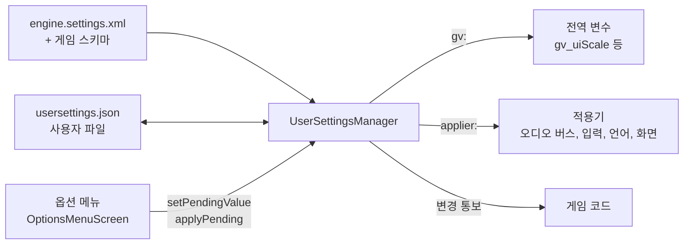

# UserSettings — 플레이어 옵션 메뉴의 백엔드

## 이것은 무엇이고 왜 있나

게임의 옵션 메뉴에는 화면 모드, 그래픽 품질, 볼륨, 키 바인딩, 언어 같은 설정이 들어갑니다. 이 모듈은 메뉴의 뒤에서 그 설정 값을 관리합니다.
어떤 설정이 있는지는 데이터 파일(스키마)에 적고, 값을 바꾸면 보류했다가 적용하거나 되돌리며, 적용한 값을 사용자 파일에 저장합니다.
화면 그리기는 하지 않습니다. 메뉴 화면은 런타임 UI가 이 모듈의 API를 불러 만듭니다.

언리얼의 `UGameUserSettings` 와 Scalability 설정, 그리고 Lyra 샘플의 설정 레지스트리에 해당합니다. 2D와 3D 게임에서 똑같이 씁니다.

엔진 계층으로는 7층입니다. 오디오, 입력, 언어, 창 값을 넣는 모듈이라 그 모듈들보다 위에 있습니다.

## 머릿속 그림



**스키마.** 스키마(`*.settings.xml`)는 설정 하나하나의 id, 타입, 기본값, 범위, 선택지, 값을 넣을 대상을 적은 데이터입니다. 엔진 스키마에 게임 스키마를 더해 씁니다.

**대상.** 설정 값을 실제로 반영하는 곳입니다. `gv:<전역 변수>` 는 그 전역 변수에 값을 넣고, `applier:<이름>` 은 등록된 적용기 함수를 부릅니다.
대상이 없는 설정은 게임이 `getValue` 나 변경 통보로 직접 읽습니다.

**보류와 적용.** 메뉴에서 값을 바꾸면 먼저 보류 값이 됩니다. "적용"을 눌러야 대상에 반영되고 저장됩니다. "취소"는 보류 값을 버립니다.
설정마다 `apply` 속성으로 이 동작을 고릅니다.

**확인 카운트다운.** 해상도나 창 모드처럼 잘못 고르면 화면이 안 보일 수 있는 설정은 `confirmSeconds` 를 둡니다. 적용 뒤 정해진 시간 안에 "유지"를 누르지 않으면 원래 값으로 돌아갑니다.

## 따라 해 보기 — 게임에 설정 하나 더하기

Shooter3D의 난이도 설정처럼 게임 전용 설정을 하나 더하고, 게임 코드에서 그 값을 읽습니다.

**1단계 — 게임 스키마를 씁니다.** 게임 팩의 `data/<게임>.settings.xml` 에 설정을 적습니다. 형식은 엔진 스키마 `Resource/engine/settings/engine.settings.xml` 과 같습니다.

<!-- snippet: Resource/game/shooter3d/data/shooter3d.settings.xml 의 난이도 설정 — 5b U7 에서 대조 -->
```xml
<UserSettingsSchema version="1">
  <Setting id="gameplay.difficulty" category="gameplay" type="enum" default="normal" text="settings.gameplay.difficulty">
    <Option value="easy" text="settings.gameplay.difficulty.easy"/>
    <Option value="normal" text="settings.gameplay.difficulty.normal"/>
    <Option value="hard" text="settings.gameplay.difficulty.hard"/>
  </Setting>
</UserSettingsSchema>
```

`text` 는 로컬라이제이션 키입니다. 대상이 없으므로 게임이 값을 직접 읽습니다.

**2단계 — 게임 프리셋에 스키마를 적습니다.** `Config/Game/<게임>.json` 의 `_userSettingsSchema` 에 팩 기준 경로를 씁니다.
엔진 설정의 기본값을 게임에 맞게 바꾸려면 `_mapUserSettingDefault` 를 씁니다. 예를 들어 `"_mapUserSettingDefault": { "gameplay.fieldOfView": "80" }` 입니다.

**3단계 — 게임 코드에서 읽습니다.**

```cpp
UserSettingsManager* pSettings = game::getService<UserSettingsManager>();
const string_view difficulty = pSettings->getValue( "gameplay.difficulty" ); // 보류 값이 있으면 보류 값
```

값이 바뀔 때 반응하려면 `registerEventListener` 로 리스너를 등록합니다. 모듈이 언로드되면 리스너는 자동으로 해제됩니다.

**4단계 — 확인합니다.** 게임을 실행하고 옵션 메뉴의 게임플레이 탭을 열면 난이도 줄이 보입니다. 값을 바꾸고 적용하면 사용자 파일에 저장됩니다.
`ResourceDataSchemaTest` 가 저장소의 모든 `*.settings.xml` 을 읽어 검사하므로, 스키마에 오타가 있으면 테스트가 실패합니다.

## 작동 원리

### 스키마 형식

<!-- snippet: engine.settings.xml 의 대표 설정 몇 줄 — 5b U7 에서 대조 -->
```xml
<UserSettingsSchema version="1">
  <Category id="display" text="settings.category.display"/>
  <Setting id="display.windowMode" category="display" type="enum" default="windowed" confirmSeconds="15" target="applier:display.windowMode">
    <Option value="windowed"/><Option value="borderless"/>
  </Setting>
  <Setting id="graphics.renderScale" category="graphics" type="float" default="1" min="0.5" max="1" step="0.05"
           target="gv:gv_renderScale" enabledWhen="graphics.upscaler=off"/>
  <Setting id="audio.voiceVolume" category="audio" type="float" default="1" min="0" max="1" apply="immediate"
           target="applier:audio.busVolume" param="voice"/>
  <Setting id="controls.jump" category="controls" type="keyBinding" action="Jump" bindIndex="0" default=""/>
  <Scalability setting="graphics.quality" custom="custom" autoDetectFallback="medium">
    <Preset name="low"><Value setting="graphics.renderScale" value="0.75"/></Preset>
    <AutoDetect preset="high" minCores="8" minMemoryMb="15000"/>
  </Scalability>
  <Upgrade version="1" op="rename" key="audio.master" to="audio.masterVolume"/>
</UserSettingsSchema>
```

| 속성 | 값 |
|---|---|
| `type` | `bool`, `int`, `float`, `enum`, `keyBinding`, `string` |
| `apply` | `immediate`(보류 즉시 미리 적용), `confirm`(기본, 적용 버튼), `restart`(다음 실행) |
| `target` | `gv:<전역 변수>`, `applier:<이름>`, 없음 |
| `enabledWhen` | `a=b;c!=d` 처럼 다른 설정 값에 따라 회색 처리 |
| `platforms` | `windows linux` 처럼 보일 플랫폼 |
| `optionsFrom` | 선택지를 코드에서 받습니다(`localization.languages` 등) |

키 바인딩 설정은 대상을 적지 않습니다. 언제나 `input.keyBinding` 적용기로 입력 맵에 들어갑니다.

**품질 그룹.** `<Scalability>` 는 언리얼의 Scalability Group처럼 설정 하나(`graphics.quality`)로 여러 설정을 한 번에 바꿉니다. 묶인 설정을 따로 바꾸면 품질 값이 `custom` 이 됩니다.
기본 프리셋의 값이 묶인 설정의 기본값입니다. 두 곳에 따로 적은 기본값이 어긋나 첫 화면부터 `custom` 으로 보이는 일을 막기 위해서입니다.

**로드 검사.** 모르는 요소, 속성, 타입, 적용기, 전역 변수, `enabledWhen` 대상, 범위 밖의 기본값은 모두 로드 오류입니다.
창 모드 이름이나 해상도 형식처럼 적용기가 받는 값을 아는 경우에는 선택지도 로드할 때 확인합니다(`UserSettingValueFilterDelegate`).

### 사용자 파일

사용자 파일은 Windows에서 `%LOCALAPPDATA%/SWEngine/<팩>/usersettings.json`, Linux에서 `$XDG_CONFIG_HOME/swengine/<팩>/`(없으면 `~/.config/swengine/<팩>/`)에 있습니다. 세이브 게임과는 별개입니다.
자동화 테스트는 `-gv_userSettingsFile=<경로>` 로 사용자 폴더를 건드리지 않고 다른 파일을 씁니다.

```json
{ "version": 1, "values": { "display.resolution": "1600x900", "display.vsync": true, "graphics.renderScale": 0.75 } }
```

- **기본값과 다른 값만 씁니다.** 다음 버전에서 기본값이 바뀌면, 그 설정을 바꾸지 않은 플레이어는 새 기본값을 따라갑니다.
- 읽을 때 모르는 키는 경고하고 버리고, 범위 밖 값은 범위 안으로 맞추고(경고), 형식이 틀린 값은 기본값으로 둡니다.
- 파일이 없으면 첫 실행으로 봅니다. `HardwareProbe` 가 CPU 논리 코어 수와 시스템 메모리를 읽고, 스키마의 `<AutoDetect>` 조건으로 품질 프리셋을 고릅니다. 파일은 플레이어가 적용할 때 저장합니다.
- 확인 대기 중에는 파일에 이전 값을 씁니다. 확인 전에 게임이 꺼지면 다음 실행은 확인된 화면 설정으로 뜹니다.

### 시작과 적용 순서

1. 엔진 초기화의 `UserSettings` 단계(Audio, Headless, Input, Resource 다음)가 적용기를 등록하고, 엔진과 게임 스키마, 게임 기본값, 사용자 파일을 읽은 뒤 `reapplyAll` 을 부릅니다.
   명령줄로 준 전역 변수(`-gv_*`)는 이 시작 적용이 덮어쓰지 않습니다. 메뉴에서 적용한 값은 덮어씁니다.
2. `RHI` 단계가 화면 요청을 읽어 창 크기, 창 모드, VSync를 정합니다. 우선순위는 EngineConfig, 플레이어가 고른 값(기본값이 아닌 것), 명령줄 순서로 뒤의 것이 이깁니다.
3. `GameInstanceBase::initialize` 가 `onInitialize` 뒤에 `reapplyAll` 을 다시 부릅니다. 언어 팩과 입력 맵(키 바인딩, 토글)이 그때 생기기 때문입니다.
   액션을 더 늦게 만드는 게임은 그 뒤에 `reapplyAll` 을 직접 부릅니다. `restart` 설정은 첫 `reapplyAll` 에서만 바뀝니다.
4. 실행 중에는 메뉴가 `setPendingValue` 와 `applyPending` 을 부릅니다.
5. `confirmSeconds` 가 있는 값을 바꾸면 확인 대기에 들어갑니다. `UserSettingsHost` 가 매 프레임 `update( dt )` 를 부르고, 시간 안에 `confirmChanges` 가 없으면 되돌려 적용하고 저장합니다.

**화면 변경.** 화면 적용기는 요청만 쌓습니다. App이 프레임 맨 앞, OS 리사이즈를 처리하는 위치에서 렌더 스레드를 기다린 뒤 `IRHIDevice::setVSync` 와 `IWindow::setDisplayMode` 를 부릅니다.
창 크기 변경 통보는 `App::onResize` 한 경로로만 스왑체인에 전달됩니다. 렌더 스레드가 그리는 도중에 스왑체인을 바꾸면 크래시가 나기 때문입니다.
호스트 쪽 코드는 `Source/App/UserSettingsHost` 에 있고, `-gv_userSettingsApply` 로 명령줄에서 설정을 적용해 볼 수 있습니다.

### 메뉴가 쓰는 API

런타임 UI 문서는 이 API를 직접 부르지 않고 설정 바인딩 `{setting:id}` 로 연결합니다([UI README](../UI/README.md)의 "사용자 설정" 절).
엔진 기본 옵션 메뉴(`Engine/UI/Screens/OptionsMenuScreen`)가 스키마에서 탭과 줄을 만들고, 확인 카운트다운과 키 바인딩 창을 연결합니다.
코드로 직접 메뉴를 만든다면 다음 함수를 씁니다. 게임에서는 `game::getService<UserSettingsManager>()`, 엔진과 에디터에서는 `engine::getUserSettingsManager()` 로 얻습니다.

| 함수 | 하는 일 |
|---|---|
| `getCategories`, `collectSettings` | 탭과 줄 목록. 이름은 `_textKey` 로 로컬라이즈합니다 |
| `getValue`, `getBoolValue`, `getIntValue`, `getFloatValue` | 보일 값. 보류 값이 있으면 그것 |
| `collectOptions` | 열거형 선택지 |
| `isSettingEnabled` | 회색 처리 여부(`enabledWhen`, 플랫폼) |
| `setPendingValue` | 보류 값을 넣습니다. 결과는 `UserSettingSetResult` |
| `findBindingConflict`, `setPendingBinding` | 키 바인딩 겹침 검사와 처리(`UserSettingBindingPolicy::Swap` 등) |
| `getBindingGlyph` | 바인딩의 표시 글리프(`InputGlyphStyle::GamepadXbox` 등) |
| `applyPending` | 적용. 결과의 `_bAwaitingConfirm` 이면 "유지할까요?" 창을, `_bNeedsRestart` 면 "다시 시작 필요"를 띄웁니다 |
| `revertPending`, `resetCategoryToDefaults` | 취소와 기본값 복원 |
| `isAwaitingConfirm`, `getConfirmSecondsLeft`, `confirmChanges` | 확인 카운트다운 |
| `registerEventListener` | 변경 통보. 모듈이 언로드되면 자동으로 해제됩니다 |

`setPendingValue` 의 결과는 `Accepted`, `Clamped`, `Unchanged`, `Rejected`, `Disabled`, `Conflict` 중 하나입니다.

## 확장하는 법

**새 적용기를 만들려면**

1. 값을 받아 반영하는 함수를 만들고 `UserSettingsRegistry::registerApplier` 로 이름을 붙여 등록합니다. 엔진 적용기는 `UserSettingsEngineAppliers.cpp` 에 있습니다.
2. 받는 값의 형식을 안다면 같은 호출에 값 필터(`UserSettingValueFilterDelegate`)도 넘깁니다. 그러면 스키마 로드 때 선택지를 검사합니다.
3. 스키마에서 `target="applier:<이름>"` 으로 고릅니다. `param` 속성으로 같은 적용기에 다른 인자를 넘길 수 있습니다(`audio.busVolume` 의 `voice` 처럼).

**새 전역 변수 대상을 만들려면** `UserSettingsVariables.cpp` 에 `SW_GLOBAL_VARIABLE` 을 더하고, 그 값을 읽는 코드를 씁니다. 스키마에서 `target="gv:<이름>"` 으로 고릅니다.

## 함정과 주의

- **설정 id나 선택지 이름을 바꿀 때는 스키마 `version` 을 올리고 `<Upgrade>` 를 더하세요.** 사용자 파일은 이미 배포된 플레이어 데이터라서 다시 쓸 수 없습니다.
  `<Upgrade>` 의 `op` 는 `rename`, `remove`, `mapValue`, `scale` 입니다. 이 저장소는 이름을 바꿀 때 데이터를 다시 쓰고 별칭을 두지 않는 규칙이 있는데, 사용자 파일은 그 규칙의 예외입니다.
- **게임이나 키트 모듈에서 설정 전역 변수를 `extern` 으로 읽지 마세요.** 전역 변수는 Engine.dll 안에 있고, DLL 경계를 넘는 `extern` 은 링크되지 않습니다.
  Engine 안의 코드는 `extern` 으로, 게임과 키트, 테스트는 `engine::getGlobalVariableManager().findVariable( "gv_cameraShakeScale" )` 로 읽습니다.
- **값만 있고 아직 읽는 곳이 없는 대상이 있습니다.** `gv_renderScale` 을 읽는 업스케일 패스가 없고, 시야 거리, 후처리, 텍스처와 이펙트 품질, 모션 블러, 카메라 시야각과 흔들림도 아직 읽는 곳이 없습니다.
  `gv_colorVisionMode` 는 UI 캔버스만 읽고 톤맵은 아직 읽지 않습니다. 남은 일은 [백로그](../../../docs/06_Backlog.md)에 있습니다.
- **오디오 버스 `voice`, `ambient`, `ui` 는 값만 저장됩니다.** `IAudioSystem::setBusVolume` 에 값이 들어가지만, 재생 API가 아직 버스를 받지 않습니다.
- **해상도 선택지는 데이터의 고정 목록입니다.** 모니터 모드를 열거하지 않습니다. 전용 전체 화면도 없고, `borderless`(모니터를 덮는 창)를 씁니다.
- **키 바인딩의 빈 값은 "입력 맵의 기본 바인딩"입니다.** 그래서 카테고리를 기본값으로 되돌리면 이전 리바인딩이 남지 않습니다.
- **개인 정보 설정은 대상이 없습니다.** `telemetry.enabled`(기본 false)와 `telemetry.crashReports`(기본 `local`)는 `TelemetryService` 와 `CrashReportService` 의 `bindConsentSetting` 이 확정된 값을 직접 읽습니다([Telemetry README](../Telemetry/README.md)).

## 더 볼 곳

| 파일 | 내용 |
|---|---|
| `UserSettingsSchema.h` | 스키마 형식, 검사, 값 정규화 |
| `UserSettingsManager.h` | 엔진 서비스와 메뉴 API |
| `UserSettingsRegistry.h` | 적용기와 선택지 공급자 레지스트리 |
| `UserSettingsEngineAppliers.h` | 엔진 적용기와 화면 요청(`DisplaySettingsRequest`) |
| `UserSettingsVariables.h` | 설정이 값을 넣는 전역 변수 |
| `Source/App/UserSettingsHost.h` | 카운트다운 진행과 화면 변경 적용 |

- 에디터 패널: `Source/Editor/Panels/UserSettingsPanel`
- 설정 전체 목록: [생성 문서 UserSettings](../../../docs/Config/UserSettings.md)
