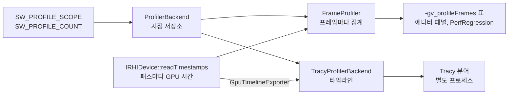

# Profiling — 프레임 프로파일러와 Tracy

## 이것은 무엇이고 왜 있나

"이 변경으로 프레임이 빨라졌나", "어느 구간이 프레임의 몇 %를 쓰나"에 답하려면 코드 구간마다 걸린 시간을 재야 합니다.
이 모듈은 코드에 `SW_PROFILE_SCOPE( "GT.Scene.tick" )` 처럼 한 줄을 두면, 그 구간의 시간을 두 곳으로 보냅니다.

- **`FrameProfiler`** 는 프로세스 안에서 구간을 프레임마다 모아 평균, p50, p99, 최대를 계산합니다. `-gv_profileFrames` 표, 성능 회귀 스크립트, 에디터 프로파일러 패널, Shipping 오버레이가 이 값을 씁니다.
  언리얼의 `stat` 명령에 해당합니다.
- **Tracy** 는 같은 구간을 시간축으로 외부 뷰어에 보냅니다. 스레드별 타임라인, GPU 큐, 프레임, 그래프, 메모리를 봅니다. 언리얼 Insights와 유니티 Profiler의 타임라인에 해당합니다.

계측 지점은 하나이고 출력만 둘입니다. 그래서 같은 이름의 구간을 표와 타임라인에서 똑같이 볼 수 있습니다.

## 머릿속 그림



**구간과 카운터.** 구간(scope)은 시작과 끝이 있는 시간 측정이고, `SW_PROFILE_SCOPE` 로 만듭니다. 카운터는 프레임마다 더해지는 수(드로우 수, 메모리 KB)이고 `SW_PROFILE_COUNT` 로 만듭니다.

**구간 이름의 접두어.** `GT.` 는 게임 스레드, `RT.` 는 렌더 스레드, `GPU.` 는 GPU 패스 시간입니다. `GT.Frame` 과 `RT.Frame` 은 각 스레드의 프레임 전체를 감쌉니다.
그래서 어떤 구간이 프레임의 몇 %인지 바로 계산할 수 있습니다.

**출력 하나의 계약.** `IProfilerBackend` 는 출력 하나가 지켜야 할 인터페이스입니다. CPU 구간, 프레임 표시, 그래프, 할당, GPU 컨텍스트와 구간을 받습니다. 라이브러리 타입은 들어가지 않습니다.

## 따라 해 보기 — 프레임 시간 재기

메시 2,000개를 그리는 벤치 장면으로 게임 스레드와 렌더 스레드의 프레임 시간을 재고, 표를 읽습니다.

**1단계 — Release 빌드에서, VSync를 끄고 실행합니다.**

```powershell
build/Ninja-Release/Bin/App.exe -gv_benchMeshes=2000 -gv_benchMeshVariants=200 -gv_profileFrames=200 -dx12
```

`-gv_profileFrames=200` 은 처음 몇 프레임을 버린 뒤 200 프레임을 재고, 표를 로그에 남기고 App을 끝냅니다(`FrameProfileSession`).
VSync는 기본이 꺼짐이지만, 사용자 파일에 켜 둔 값이 있으면 켜집니다. 확실히 하려면 `-vsync=0` 을 더하거나 `-gv_userSettingsFile=<빈 테스트용 경로>` 로 사용자 파일을 빼고 실행합니다.

**2단계 — 표를 읽습니다.** 로그에 `[Profile]` 로 시작하는 표가 나옵니다. 열은 `avg_us`, `p50_us`, `p99_us`, `min_us`, `max_us`, `per_frame` 입니다.
시간 구간은 앞의 다섯 열을 보고, 카운터는 `per_frame` 열에 값이 있습니다. 카운터 줄의 시간 열이 0이라고 해서 그 코드가 돌지 않은 것은 아닙니다.

**3단계 — 두 번 뺄셈합니다.**

| 구간 | 뜻 |
|---|---|
| `GT.Frame` | 게임 스레드 프레임 전체(`EngineLoop::tick`) |
| `GT.Packet.submit` | 게임 스레드가 렌더 스레드를 **기다린** 시간. 크면 렌더 스레드가 밀린 것입니다 |
| `RT.Frame` | 렌더 스레드 프레임 전체 |
| `RT.Present` | 제출과 화면 표시 대기 |

`GT.Frame - GT.Packet.submit` 이 게임 스레드가 실제로 일한 시간이고, `RT.Frame - RT.Present` 가 렌더 스레드가 커맨드를 기록한 시간입니다.
렌더 패킷 링이 꽉 차면 submit이 막히므로, `GT.Packet.submit` 이 크면 병목은 렌더 쪽입니다.

**4단계 — 의심되면 주사율과 비교합니다.** `1 / RT.Frame` 이 모니터 주사율과 같다면 VSync에 묶여 있는 것입니다. 그 측정값으로는 아무것도 판단할 수 없습니다.

**5단계 — 타임라인이 필요하면 Tracy로 봅니다.** 표는 평균과 백분위만 보여 줍니다. 어느 프레임에 왜 히치가 났는지 보려면 아래 "Tracy 뷰어 연결하기"를 따라 합니다.

## 작동 원리

### 파일 구성

| 파일 | 역할 |
|---|---|
| `FrameProfiler` | 프로세스 안의 구간 집계와 카운터 |
| `FrameProfileSession` | `-gv_profileFrames=N` 한 번의 측정 |
| `MemoryBudgetMonitor` | 메모리 태그 예산(`Config/Engine/MemoryBudget.json`), 프레임 끝 예산 검사, `-gv_memoryReport` 표 |
| `IProfilerBackend.h` | 출력 하나의 인터페이스 |
| `ProfilerBackend` | 활성 출력 선택, 계측 지점 저장소, `-gv_tracy` 와 `-gv_tracyMemory` 해석, Core 할당 관찰자 연결 |
| `Tracy/TracyProfilerBackend` | Tracy C API를 부르는 유일한 파일 |

`Tracy/TracyProfilerBackend` 는 저장소에서 Tracy 헤더를 include하는 유일한 곳입니다. `Scripts/lint/gate/CheckThirdPartyIsolation.py` 가 이 규칙을 검사합니다.
Tracy 클라이언트는 프로세스에 하나입니다. Engine.dll만 Tracy를 링크하고, 게임, 에디터, GameFramework 키트, RHI 백엔드 모듈은 Engine이 내보낸 함수를 거쳐 들어오므로 Tracy를 모릅니다.

**빌드 구성별 차이.**

- `SW_ENABLE_TRACY=OFF` 면 Tracy를 링크하지 않고 `TracyProfilerBackend` 는 빈 함수가 됩니다. Linux는 기본이 OFF입니다.
- Shipping에서는 `SW_PROFILER_BACKEND_COMPILED` 가 0입니다. 매크로가 지점을 등록하지도 출력을 찾지도 않고, Tracy를 링크하지 않습니다. 배포물에 TracyClient.dll도 없습니다.

### Tracy를 켜는 방식

```powershell
build/Ninja-Release/Bin/App.exe -gv_tracy=1                    # 시작부터 Tracy로 보낸다
build/Ninja-Release/Bin/App.exe -gv_tracy=1 -gv_tracyMemory=1  # 할당과 해제까지 보낸다. 느리다
```

Tracy는 기본으로 꺼져 있고, 인자로 켜면 시작부터 기록합니다. 뷰어가 붙을 때만 수집하는 on-demand 방식을 쓰지 않는 이유는 셋입니다.

1. Windows는 TracyClient.dll을 지연 로드합니다. 끈 상태로는 DLL이 로드되지 않으므로 수집 스레드도, 리슨 소켓도, 방화벽 확인 창도 없습니다. 테스트, 쿠킹, 스모크 같은 모든 개발 실행이 비용을 내지 않습니다.
   on-demand는 DLL을 항상 로드하고 스레드를 띄운 채 기다리므로 이 이득이 없습니다.
2. vcpkg 포트는 on-demand 기능을 끈 채 빌드되어 있습니다. on-demand는 클라이언트 라이브러리의 컴파일 정의라서, 바꾸려면 포트를 다시 빌드해야 합니다.
3. 시작부터 기록해야 시작 시점의 히치를 볼 수 있습니다. 뷰어가 나중에 붙어도 처음부터 받습니다. 대신 뷰어 없이 오래 돌리면 Tracy가 메모리에 데이터를 쌓습니다.

한 번 켜면 프로세스가 끝날 때까지 켜져 있습니다. 중간에 끄면 뷰어의 타임라인이 깨집니다.
Tracy를 켜면 `FrameProfiler` 도 함께 켜집니다. 카운터의 프레임 합을 Tracy 그래프로 보내는 경로가 `FrameProfiler` 이기 때문입니다.

### Tracy로 나가는 것

| Tracy | 엔진 쪽 |
|---|---|
| CPU 구간 | 모든 `SW_PROFILE_SCOPE`. 이름, 함수, `Source/` 부터의 파일 경로, 줄 |
| 스레드 이름 | OS 스레드 이름(`GameThread`, `RenderThread`, `Worker N`, `IO`, `IO.Iocp`, `Logger`, `Net`) |
| 프레임 | 주 프레임은 게임 스레드(`EngineLoop::endFrame`), 보조 프레임 `Render` 는 렌더 스레드의 Present 뒤 |
| 그래프 | `SW_PROFILE_COUNT` 의 프레임 합(드로우 수, `Mem.LiveKB`, 에셋 바이트 등) |
| GPU 타임라인 | 네 백엔드 모두. `GPU Frame` 안에 `Compute prepass` 와 패스 이름 |
| 메모리 | `-gv_tracyMemory=1` 일 때 `Memory::allocate` 와 `free` 를 메모리 태그 이름의 풀로 |

Tracy를 켜기 전에 할당된 블록의 해제는 보내지 않습니다. 짝이 없는 해제를 받으면 뷰어가 기록을 멈추기 때문입니다.

### GPU 구간

엔진은 네 백엔드에서 패스마다 GPU 타임스탬프를 기록하고, 몇 프레임 뒤에 읽습니다(`IRHIDevice::readTimestamps`). 이 값이 표의 `GPU.<패스>` 와 `GPU.Frame` 줄이 됩니다.
`Graphics/Renderer/Frame/GpuTimelineExporter` 는 **같은 값**을 Tracy의 수동 GPU 컨텍스트(C API `___tracy_emit_gpu_*`)로 넘깁니다.
TracyD3D12나 TracyVulkan 같은 API별 헤더는 쓰지 않습니다. 그 헤더를 쓰면 쿼리를 한 벌 더 만들어 서로의 시간을 재게 되고, RHI 백엔드 DLL마다 Tracy 클라이언트를 링크해야 합니다.

**언제 보내나.** 렌더 스레드가 끝난 프레임의 타임스탬프를 읽는 시점에, 열고 닫는 짝을 맞춰 한 번에 보냅니다.
병렬 기록 워커는 구간을 보내지 않으므로 워커마다 컨텍스트를 나눌 필요가 없고, 읽기를 놓친 프레임의 구간이 뷰어에 열린 채 남지 않습니다.
그래서 뷰어에서 GPU 구간의 "CPU 쪽 발행 시각"은 기록 시각이 아니라 읽은 시각입니다. GPU 타임라인 위의 위치와 길이는 정확합니다.

**시계 맞추기.** 컨텍스트를 열 때 `IRHIDevice::readGpuClockNanos` 로 지금 GPU 시계를 읽어, Tracy가 찍는 CPU 시각과 짝짓습니다.

| 백엔드 | 읽는 법 | 다시 맞추기 |
|---|---|---|
| DX12 | `ID3D12CommandQueue::GetClockCalibration`(기다리지 않음) | 240 프레임마다 |
| GL | `glGetInteger64v( GL_TIMESTAMP )`(기다리지 않음) | 240 프레임마다 |
| DX11 | 타임스탬프 쿼리를 내고 `GetData` 로 끝까지 기다림 | 열 때 한 번 |
| Vulkan | 일회성 버퍼에 `vkCmdWriteTimestamp` 후 큐 대기 | 열 때 한 번 |

DX11과 Vulkan은 열 때 한 번만 맞추므로, 오래 실행하면 GPU와 CPU 시계가 서로 흐르는 만큼(드라이버와 기계에 따라 분당 수 µs) GPU 줄이 조금씩 밀립니다.
Vulkan의 보정 확장 `VK_EXT_calibrated_timestamps` 는 아직 쓰지 않습니다.

백엔드를 교체하면 새 컨텍스트를 엽니다. Tracy의 컨텍스트 번호는 1바이트라서 교체 255번까지 지원합니다.
타임스탬프 슬롯 배치(패스 14개와 컴퓨트, 프레임 슬롯)는 `FrameRendererUtil` 을 따릅니다. 슬롯을 넘는 패스는 엔진 표와 Tracy 모두에 나오지 않습니다.

### 측정 비용

Release, 16 스레드에서 `-gv_benchMeshes=8 -gv_benchAnimate=0 -gv_profileFrames=600` 으로 Tracy를 켜고 끈 상태를 번갈아 3번씩 측정했습니다. 뷰어는 붙이지 않았습니다(Tracy가 메모리에 쌓는 상태).
프레임마다 CPU 구간 약 53개와 GPU 구간 7개가 나갑니다.

| 백엔드 | 끔: GT.Frame p50 / 평균 / 벽시계 | 켬: GT.Frame p50 / 평균 / 벽시계 |
|---|---|---|
| DX12 | 294 / 480 / 491 µs | 294 / 347 / 359 µs |
| Vulkan | 589 / 778 / 795 µs | 589 / 679 / 697 µs |

p50은 같은 히스토그램 버킷(±9%) 안에 있습니다. 구간 하나의 비용(큐 기록 수십 ns)은 프레임에서 보이지 않습니다. RT.Frame p50은 DX12에서 한 버킷 위였습니다(294에서 327 µs).
평균과 벽시계는 측정마다 1~5 ms 히치로 흔들리므로, 켜고 끈 차이로 읽지 않습니다. Tracy는 타이머 해상도를 바꾸지 않고, 끈 상태에서는 DLL조차 로드하지 않으므로 원래 바이너리와 같습니다.

### Tracy 뷰어 연결하기

뷰어 바이너리는 저장소에 넣지 않습니다. 클라이언트(vcpkg `tracy` 포트)와 **같은 버전 0.14.1** 의 Windows 릴리스를 받아 씁니다. 버전이 다르면 프로토콜이 맞지 않아 연결되지 않습니다.

1. <https://github.com/wolfpld/tracy/releases/tag/v0.14.1> 에서 `windows-0.14.1.zip` 을 받아 풀고, `tracy-profiler.exe` 를 `Tools/Tracy/` 에 둡니다(git이 무시하는 위치). 다른 곳에 두면 `-gv_tracyViewerPath=<경로>` 로 알려 줍니다.
2. App을 `-gv_tracy=1` 로 실행합니다. 로그에 `Tracy profiler started (data port 8086 …)` 가 나옵니다.
3. 뷰어에서 `Connect`(주소 `127.0.0.1`)를 누르거나, `tracy-profiler.exe -a 127.0.0.1` 로 실행합니다.

포트는 8086입니다. 다른 프로세스가 쓰고 있으면 Tracy가 다음 번호를 고릅니다(최대 20개). App을 둘 띄웠다면 뷰어의 발견 목록(같은 네트워크 브로드캐스트)에서 고릅니다. `TRACY_PORT` 환경 변수로 포트를 고정할 수 있습니다.

### 에디터에서

- **프로파일러 패널**(`Source/Editor/Panels/ProfilerPanel`)은 `FrameProfiler` 값만 읽어 CPU 구간, GPU 패스, 카운터를 최근 N 프레임(기본 240)의 마지막, 평균, p50, p99, 최대로 보여 줍니다.
  머리줄로 정렬하고 검색할 수 있고, GT.Frame, RT.Frame, GPU.Frame 그래프를 그립니다. 집계는 ImGui 없는 `ProfilerScopeHistory` 가 하고 EditorTest가 테스트합니다. Tracy가 없는 빌드에서도 같습니다.
- **"Open Tracy" 버튼**은 Tracy 출력을 켜고(`ProfilerBackend::startTracy`), 뷰어를 `-a 127.0.0.1 -p <포트>` 로 띄웁니다(`EditorTracyLauncher`). 뷰어는 `-gv_tracyViewerPath`, `Tools/Tracy/tracy-profiler.exe` 순서로 찾습니다.

Tracy 뷰어를 에디터 도킹 창으로 넣지 않고 별도 프로세스로 띄웁니다. 언리얼 에디터가 Insights를 따로 띄우는 것과 같은 방식입니다.
뷰어 소스(0.14.1 기준 약 23만 줄)는 vcpkg 포트가 라이브러리로 설치하지 않고, 빌드에 열 개 남짓의 의존 라이브러리와 **Tracy가 버전을 고정하고 패치한 ImGui** 를 씁니다.
한 프로세스에 ImGui 두 벌은 둘 수 없으므로, 넣으려면 뷰어 소스를 저장소에 가져와 우리 ImGui(vcpkg 1.92 docking)에 맞게 손으로 고쳐야 합니다.

## 확장하는 법

**구간과 카운터를 더하려면** 재고 싶은 블록 첫 줄에 `SW_PROFILE_SCOPE( "GT.MySystem.update" );` 를 둡니다. 이름에 스레드 접두어를 붙여야 표에서 어느 프레임의 일부인지 읽을 수 있습니다.
수를 세려면 `SW_PROFILE_COUNT( "MySystem.Items", count );` 를 씁니다. 표의 `per_frame` 열과 Tracy 그래프에 나옵니다.

**다른 뷰어를 붙이려면**

1. `IProfilerBackend` 를 구현하는 클래스를 하나 만듭니다. 라이브러리 헤더는 그 구현 파일에서만 include합니다.
2. `ProfilerBackend` 가 인자에 따라 그 출력을 고르게 합니다.
3. 호출부(`SW_PROFILE_SCOPE`)는 바꾸지 않습니다.

## 함정과 주의

- **성능은 Release에서 재세요.** Debug는 컨테이너의 레이스 검출 코드 때문에 컨테이너를 많이 쓰는 코드가 실제보다 크게 부풀려집니다.
- **VSync에 묶인 측정값으로 판단하지 마세요.** 모든 프레임이 모니터 주사율에 붙어 있으면 CPU 시간 차이가 보이지 않습니다. 먼저 `1 / RT.Frame` 을 주사율과 비교합니다.
- **평균 대신 p50과 p99를 보세요.** 평균은 드문 히치에 크게 흔들립니다. 일부 프레임만 느린 구간은 평균이 아니라 p99와 최대에 나타납니다.
- **카운터 값은 `per_frame` 열에 있습니다.** 카운터 줄의 시간 열이 0이라고 해서 그 경로가 돌지 않은 것이 아닙니다.
- **구간 이름에 사라질 수 있는 문자열을 넘기지 마세요.** Tracy는 소스 위치를 포인터로 보내고, 문자열은 뷰어가 요청할 때 읽습니다.
  핫 리로드로 사라지는 모듈 상수나 엔진 종료 때 해제되는 이름 풀(`HashedStringPool`)을 가리키면 해제된 메모리를 읽게 됩니다.
  그래서 `ProfilerBackend::registerZoneSite` 와 `internName` 이 정적 저장소에 복사합니다. 저장소는 지점 1,024개(`kMaxZoneSite`)와 64 KB(`kNameArenaBytes`)이고, 넘치면 그 지점만 Tracy에 나가지 않습니다.
- **구간은 연 출력으로 닫힙니다.** 프레임 도중에 출력이 켜져도 짝이 어긋나지 않습니다. `ScopedFrameProfile` 이 구간을 연 출력을 보관하기 때문입니다.
- Tracy를 처음 켜면 Windows 방화벽이 리슨 소켓 허용을 묻습니다. 거절해도 같은 PC의 뷰어는 localhost로 연결됩니다.

## 더 볼 곳

- 측정할 때 지킬 것과 지난 측정에서 얻은 교훈: [검증과 측정](../../../../docs/08_Verification.md)의 "측정 · 프로파일" 절
- VSync가 정해지는 순서와 백엔드별로 끄는 법: [RHI README](../../Graphics/RHI/README.md)의 "VSync" 절
- 성능 회귀 검사: `py -3 -m Scripts perf --app <App 경로>` (`Scripts/qa/PerfRegression.py`). 게임마다 Release 프레임 p50과 p99를 이 기계의 기준과 비교합니다.
- 메모리 예산: `Config/Engine/MemoryBudget.json`, `-gv_memoryReport`
- GPU 타임스탬프: `Graphics/Renderer/Frame/GpuTimelineExporter`, `IRHIDevice::readTimestamps`
- 상위 문서: [Engine/README.md](../../README.md)
