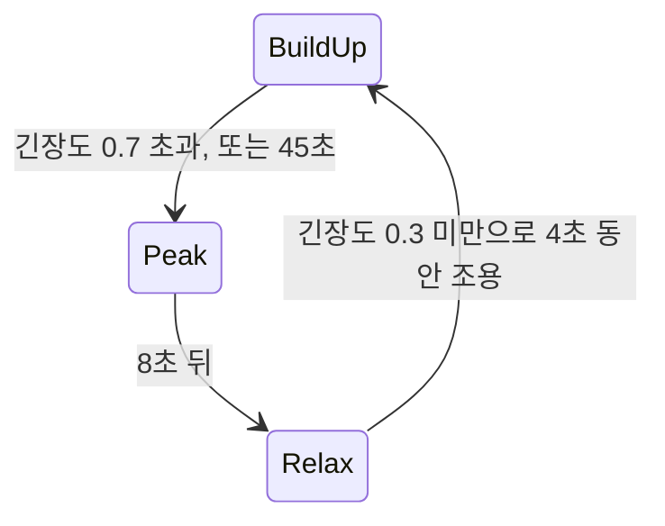

# AI/Director — 페이싱 감독

## 이것은 무엇이고 왜 있나

적을 일정한 간격으로만 내면 게임이 단조롭습니다. 플레이어가 힘들어하면 쉬게 하고, 여유가 생기면 다시 몰아붙여야 긴장과 이완의 리듬이 생깁니다.
페이싱 감독(`AiDirector`)은 플레이어의 긴장도를 읽어 **언제, 얼마나, 무엇을** 낼지 정합니다. 장르를 가리지 않으므로 기반에 있습니다.

레프트 4 데드의 AI 디렉터는 긴장도가 오르면 절정을 유지하다 쉼으로 넘어갑니다. RDR2 의 무작위 조우는 가중 풀과 쿨다운과 조건으로 고릅니다.
로그라이크의 방 감독은 보상 밀도를 예산으로 맞춥니다. 이 감독은 셋이 공통으로 가진 부분을 데이터로 적습니다.

감독은 그 위의 페이싱 층입니다. 실제 스폰 예산과 상한은 `AI/SpawnDirector` 가, 조우 조건은 NPC 일정의 `ScheduleCondition` 이, 난수는 `GameRandom` 이, 하루의 때는 `WorldClock` 이 맡습니다.
조우 id 가 무엇을 몇 마리 내는지, 어떤 보상인지는 게임이 정합니다.

## 머릿속 그림



**긴장도.** 게임이 신호(맞은 피해, 가까운 적 수, 탄 부족)를 넣으면 긴장도 모델이 0 에서 상한 사이의 값을 냅니다. 싸우는 동안은 식지 않고, 싸움이 끝나고 조금 지나야 식습니다.

**단계.** 쌓기, 절정, 쉼 같은 상태입니다. 단계의 이름과 수는 데이터가 정하고, 나가는 조건(`<Exit>`)도 데이터입니다. 시작 단계로 돌아올 때마다 순환 수(`getCycle`)가 오릅니다.

**풀.** 조우와 보상 후보의 가중 목록입니다. 단계에 들어설 때, 일정 간격마다, 또는 예산이 쌓였을 때 하나를 고릅니다.

## 따라 해 보기 — Shooter3D 의 웨이브

`Shooter3D` 는 스켈레톤 웨이브를 감독이 냅니다. 프로필은 `Resource/game/shooter3d/data/arena.director.xml`, 스폰 테이블은 `arena.spawns.xml` 입니다.

1. 디렉터 컴포넌트가 프로필과 스폰 테이블을 읽고 감독을 초기화합니다.
2. 매 틱 신호를 넣습니다. 맞은 피해와 쓰러뜨린 적은 한 번씩(`addSignal`), 가까운 적 수와 탄 부족은 지금 값으로 넣습니다.
3. `update( dt )` 뒤 `drainEvents` 로 낼 것을 받아 스켈레톤을 스폰합니다. 절정에 들어서면 무리와 정예가, 쉼에 들어서면 탄약이, 예산이 쌓이면 수리가 나옵니다.
4. 스켈레톤이 사라지면 `notifyDespawned` 로 알립니다.

<!-- snippet: 감독 호출 순서 — 5b U7 에서 ShooterDirectorComponent 구간이나 문서 예시 테스트로 대조 -->
```cpp
AiDirector director;
director.initialize( &profile, &spawnTable, seed );                // 테이블은 없어도 된다(조우만 고르는 감독)
director.getBuiltinIntensityModel().addSignal( "damageTaken", 12 ); // 또는 setIntensityModel 로 게임의 모델
director.setContext( context );                                     // 지역 태그, 시계(fillFromClock), 플래그, 플레이어 태그, 날씨
director.update( dt );
director.drainEvents( listEvent );                                  // PhaseChanged, Spawned, Despawned, Encounter, Reward
director.notifyDespawned( spawnId );
```

자동 플레이(`-gv_shooterAutoPlay=1`)는 씨앗이 고정이라, 고정 프레임 시간으로 돌리면 같은 페이싱이 나옵니다.
`-gv_aiDirectorTrace=1` 을 주면 감독이 낸 일마다 로그가 한 줄씩 남습니다(테스트 빌드 전용 전역 변수).

## 작동 원리

### 프로필 데이터

```xml
<AiDirector startPhase="BuildUp">
  <Calendar weathers="sunny,rain"/>                                    <!-- 조건 이름 검사(선택, 일정과 같은 원소) -->
  <Intensity max="1" decayPerSecond="0.06" decayDelay="4">
    <Signal id="damageTaken" kind="impulse" scale="0.012" combat="true"/>   <!-- addSignal(양) 한 번에 양 × scale -->
    <Signal id="enemiesNear" kind="rate" scale="0.01" max="0.08" combat="true"/> <!-- setSignal(값) 동안 초마다 값 × scale -->
    <Signal id="lowAmmo" kind="level" scale="0.25"/>                       <!-- 긴장도의 바닥 -->
  </Intensity>
  <Phase id="BuildUp" spawnScale="1" spawnTags="Drone">
    <Curve time="0" scale="0.6"/><Curve time="30" scale="1.5"/>            <!-- 단계 안 시간 → 스폰 배율 -->
    <Exit to="Peak" intensityAbove="0.7" minTime="8"/>                     <!-- 적은 절이 모두 참이면 나간다 -->
    <Exit to="Peak" minTime="45"/>                                         <!-- 시간으로 나가는 길(언젠가는 절정) -->
  </Phase>
  <Phase id="Peak" spawnScale="1.5"><Exit to="Relax" minTime="8"/></Phase>
  <Phase id="Relax" spawnScale="0" rewardScale="2">
    <Exit to="BuildUp" intensityBelow="0.3" calmFor="4" minTime="6"/>
  </Phase>
  <Pool id="surge" trigger="phaseEnter" phase="Peak">
    <Encounter id="swarm" weight="3" count="4"/>
    <Encounter id="elite" weight="1" count="2" scale="2.5" minCycle="1" cooldown="60"/>
  </Pool>
  <Pool id="ambient" trigger="interval" interval="20" chance="0.5" cooldown="30" pacing="BuildUp,Relax">
    <Encounter id="ambush" areas="Forest,Road" phases="Night" tags="Player.Mounted" notTags="Player.Wanted" weathers="rain"/>
  </Pool>
  <Pool id="field" kind="reward" trigger="budget" perMinute="1" maxBudget="2" need="lowAmmo" needScale="2">
    <Encounter id="repair" cost="1" maxIntensity="0.6"/>
  </Pool>
</AiDirector>
```

**신호의 종류**는 셋입니다. `impulse` 는 한 번 더하는 값이고 `max` 로 상한을 둡니다. `rate` 는 값이 있는 동안 초마다 더하고, `level` 은 긴장도의 바닥입니다.
`combat="true"` 신호가 들어오면 "싸움 뒤 지난 시간"이 0 이 되고, `decayDelay` 초가 지나야 `decayPerSecond` 로 식기 시작합니다.
긴장도는 쌓인 스트레스와 바닥 합 중 큰 쪽이고, 상한은 `max` 입니다.

**단계의 스폰 배율**은 `spawnScale` 에 `<Curve>`(단계 안 시간에 따른 배율)를 곱한 값입니다. 배율이 0 이면 예산을 쌓지도 쓰지도 않습니다.
그래서 쉬는 동안 모아 둔 예산이 쉼이 끝나자마자 한꺼번에 나오지 않습니다. `spawnTags` 는 그 단계에서 낼 스폰 항목의 태그입니다.

**나가는 길**(`<Exit>`)의 절은 `minTime`(단계에 머문 시간), `intensityAbove`, `intensityBelow`, `calmFor`(마지막 싸움 뒤 시간)입니다. 적은 순서대로 보고, 절이 모두 참인 첫 길로 나갑니다.

**풀의 트리거**는 셋입니다. `phaseEnter` 는 단계에 들어설 때 `picks` 번 고르고, `interval` 은 `interval` 초마다 `chance` 확률로 고릅니다.
`budget` 은 예산을 분당 `perMinute` 만큼 쌓습니다. 이 값에 단계 배율과 필요 신호 보정(`1 + needScale × 필요 신호`)을 곱합니다. 미리 골라 둔 항목의 `cost` 에 닿으면 냅니다.
미리 골라 두는 것은 싼 항목만 계속 나오지 않게 하기 위해서입니다. 단계 배율은 `kind="reward"` 면 `rewardScale`, 아니면 `spawnScale` 입니다.
풀의 `cooldown` 은 두 번 고르는 사이의 최소 시간이고, `pacing` 을 주면 그 단계에서만 시계와 예산이 흐릅니다.

**항목의 조건**은 `weight`, `cooldown`, `maxCount`(한 게임에서), `minCycle`, `minTime`, 긴장도 범위, 지역 태그(`areas`), `pacing` 입니다.
여기에 일정 조건의 속성(요일, 계절, 날씨, 하루의 때, 플래그 식, 태그, 확률)을 모두 쓸 수 있습니다. 게임에 넘기는 값은 `count` 와 `scale` 입니다.

### 한 프레임의 순서와 결정성

한 프레임은 긴장도 모델, 시간, 단계 넘기기(한 프레임 최대 4번), 스폰, 풀(interval 과 budget) 순서로 돕니다. `phaseEnter` 풀은 단계에 들어선 그 자리에서 고릅니다.

씨앗이 같고 같은 dt 와 신호와 문맥으로 부르면 같은 사건을 같은 때에 냅니다. 스폰 감독의 씨앗은 감독 씨앗에서 나오고, 조건의 확률 절은 씨앗과 풀과 항목과 고른 횟수의 해시로 굴립니다.
`computeStateHash` 로 같은지 확인합니다.

### 추적

`dumpTrace` 는 최근 사건 256개를 글로 돌려줍니다(`[12.30s] I=0.82 PhaseChanged 'Peak' from 'BuildUp' exit 0 cycle 1`).
`explain` 은 지금 단계와 긴장도, 나가는 길마다 막고 있는 절, 풀마다 항목이 나올 수 있는지와 막은 까닭(`[cooldown]`, `[area]`, `[condition]` 등)을 씁니다.
같은 판정을 비트로 받으려면 `computeBlockMask` 를 씁니다.

### 다른 게임의 감독과 비교

- 레프트 4 데드 AI 디렉터와 같은 틀입니다. 다만 내비 경로를 읽어 플레이어 앞뒤에 스폰 위치를 고르는 "활동 영역"과, 플레이어 여럿의 긴장도를 합치는 일은 없습니다. 스폰 위치는 게임이 정합니다.
- RDR2 무작위 조우의 가중 풀, 쿨다운, 조건, 한 번만 나오는 조우(`maxCount="1"`)는 데이터로 됩니다. 조우 스크립트와 배치는 게임이 맡습니다.
- 로그라이크 방 감독의 예산 풀, 보상 밀도, 순환에 따른 해금(`minCycle`)도 됩니다. 방 생성 그래프는 없습니다.

## 확장하는 법

- **긴장도 계산을 바꾸려면** `IAiDirectorIntensityModel` 을 구현해 `setIntensityModel` 로 끼웁니다. 게임 모델의 상태는 게임이 저장합니다.
- **새 단계나 풀**은 데이터에 더합니다. 코드를 고치지 않습니다.

## 함정과 주의

- **모르는 원소와 속성, 신호 종류, 풀 종류와 트리거, 단계 이름, 필요 신호, 겹친 id, 단계 없음은 모두 로드 오류입니다.** 경고를 남기고 false 를 돌려줍니다.
  `ResourceDataSchemaTest` 가 `Resource/` 아래 모든 `*.director.xml` 과 `*.spawns.xml` 을 읽습니다.
- **감독의 상태는 `writeState` 와 `readState` 로 넘깁니다**(태그 `AIDR`). 핫 리로드와 세이브가 웨이브를 이어 가는 방법입니다.
  프로필 구조(단계, 풀, 항목, 신호 수)가 다르면 읽기를 거절하고 처음부터 돕니다. 게임 긴장도 모델과 추적, 쌓인 사건은 싣지 않습니다.
- **스폰 감독의 살아 있는 개체는 상태에 실립니다.** 모습을 정리했다가 다시 만드는 게임은 `collectAliveSpawnIds` 로 같은 스폰 id 의 개체를 다시 스폰해야 예산과 상한이 맞습니다.
- **태그 거르기는 상태에 싣지 않고 단계에서 다시 거는데, 읽기 전에 겁니다.** 읽은 뒤에 걸면 상한에 걸려 있던 미리 고른 항목을 비워서 원래 상태와 갈라집니다.

## 더 볼 곳

- [AI/Schedule](../Schedule/README.md) — 조우 조건이 쓰는 `ScheduleCondition`
- [Shooter3D](../../../../Games/Shooter3D/README.md) — 감독을 쓰는 테스트 게임

| 파일 | 내용 |
|------|------|
| `AiDirectorProfile.h` | `*.director.xml` 읽기 |
| `AiDirectorIntensity.h` | 긴장도 모델 인터페이스와 기본 모델 |
| `AiDirector.h` | 런타임, 추적, 상태 저장 |
