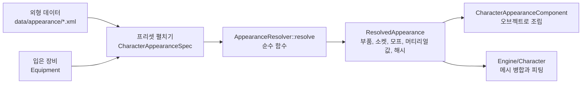

# Appearance — 캐릭터 외형 데이터와 해석

## 이것은 무엇이고 왜 있나

캐릭터가 무엇을 입고 들었는지에서 "실제로 무엇을 그릴지"를 정하는 일은 생각보다 복잡합니다. 투구를 쓰면 머리카락을 숨겨야 하고,
배낭을 메면 총을 거는 소켓이 옮겨 가고, 세트를 다 갖추면 망토가 바뀌고, 맞아서 부서진 부품은 떨어져 나가야 합니다.
이 폴더는 그 규칙을 모두 **데이터**로 적고, 코드는 그 데이터를 정해진 순서로 한 번 푸는 해석기 하나만 둡니다.
언리얼의 모듈식 캐릭터와 MetaHuman 꾸미기, 유니티 UMA 같은 캐릭터 커스터마이징 시스템에 해당합니다.

결과(`ResolvedAppearance`)는 두 곳이 씁니다. 엔진의 캐릭터 형상 쪽(`Engine/Character` — 소켓, 체형, 피팅, 메시 병합)과,
이 폴더의 외형 컴포넌트(`CharacterAppearanceComponent`)입니다. 2D 종이 인형(스프라이트)과 3D 메시가 같은 경로를 쓰고, 부품 종류만 다릅니다.

## 머릿속 그림



**슬롯.** 머리, 몸통, 주무기처럼 장비가 들어가는 위치입니다. 슬롯 테이블의 순서가 해석 순서입니다.
양손 무기처럼 슬롯 여럿을 차지하는 것은 점유(`Occupancy`)로 적습니다.

**외형과 부품.** 아이템 하나의 외형(`ItemVisual`)은 부품 여럿으로 이루어집니다. 부품은 스킨드 메시, 소켓에 붙는 프리팹, 몸에 거는 모프와 머티리얼 값, 2D 스프라이트 중 하나입니다.

**프리셋.** 캐릭터 하나의 외형(`CharacterAppearance`)입니다. 부모 프리셋을 상속하고, 값을 범위나 목록으로 적으면 씨앗으로 뽑습니다.

**규칙.** "이 태그를 쓰면 저것을 숨긴다"처럼 조건과 동작의 짝입니다. 우선순위가 높은 규칙이 이깁니다.

## 따라 해 보기 — 프리셋으로 캐릭터를 입히기

`Shooter3D` 의 플레이어와 스켈레톤이 이 방식입니다.

### 1단계 — 데이터 읽기

게임 인스턴스가 아이템 카탈로그와 외형 데이터베이스를 읽고 게임 서비스로 등록합니다.

<!-- snippet: Source/Games/Shooter3D/Shooter3DGame.cpp 의 외형 데이터 읽기 구간 — 5b U7 에서 대조 -->
```cpp
if ( _itemCatalog.loadFromResource( "game/shooter3d/data/items.xml" ) == false ||
     _appearanceDatabase.loadFromFolder( "game/shooter3d/data/appearance", &_itemCatalog ) == false )
    SW_LOG_ERROR( "[Shooter] appearance data could not be loaded - %#", _appearanceDatabase.getReport().joined().c_str() );
else
    game::bindLocalService<AppearanceDatabase>( &_appearanceDatabase );
```

모르는 속성이나 이름이 있으면 로드가 실패하고, 보고(`AppearanceLoadReport`)에 무엇이 틀렸는지 나옵니다.

### 2단계 — 오브젝트에 외형 컴포넌트 붙이기

스킨드 메시(`SkeletalMeshComponent`)가 있는 오브젝트에 `CharacterAppearanceComponent` 를 붙이고 프리셋 id 와 씨앗을 줍니다.
씬이나 프리팹에 PROPERTY 로 적거나, 코드에서 `setPreset( presetID, seed )` 를 부릅니다. 플레이를 시작하면 몸 메시와 장비 부품이 조립됩니다.

### 3단계 — 무기 바꾸기

`setSlotItem( "MainHand", "rifle_gold" )` 을 부르면 그 슬롯만 덮어써서 다시 조립합니다. 같은 부품은 오브젝트를 그대로 두므로, 무기를 바꿔도 투구는 다시 만들지 않습니다.
총구 위치는 `findSocketWorldTransform( "MainHand.Muzzle" )` 로 얻습니다.

## 작동 원리

### 데이터 파일

게임 팩의 `data/appearance/` 폴더(예: `Resource/game/shooter3d/data/appearance/`)에 파일 여섯 개를 둡니다. `AppearanceDatabase::loadFromFolder` 가 읽고, `finishLoad` 가 파일 사이의 이름을 대조합니다.

| 파일 | 루트 원소 | 내용 |
|---|---|---|
| `slots.xml` | `SlotTable` | 슬롯 이름과 받는 종류, 슬롯 점유 |
| `sets.xml` | `EquipSetCatalog` | 세트의 슬롯별 조각, 몸 종류 변형, 세트 완성 표현 |
| `itemvisuals.xml` | `ItemVisualCatalog` | 아이템 외형의 부품, 상태별 배치, 피해 단계 |
| `customization.xml` | `CustomizationSchemaCatalog` | 꾸미기 스키마(캐릭터와 아이템 공용) |
| `rules.xml` | `AppearanceRuleTable` | 외형 규칙과 우선순위 |
| `presets.xml` | `CharacterAppearanceCatalog` | 캐릭터 외형 프리셋 |

아이템 자체는 `data/items.xml`(`ItemCatalog`)에 있습니다. 아이템의 `visual` 이 외형 id 이고, `<Requires>` 가 장착 조건, `breakPolicy` 가 조건이 깨졌을 때의 처리입니다.
각 원소의 형식은 아래 예와 같습니다.

```xml
<SlotTable><Slot name="Head"/><Slot name="MainHand" accept="Weapon"/><Slot name="OffHand" accept="Weapon"/>
  <Occupancy id="TwoHanded" slots="MainHand,OffHand"/></SlotTable>

<EquipSetCatalog><Set id="Recon"><Piece slot="Head" items="helmet_recon"/><Piece slot="Body" items="vest_recon"/>
  <Variant bodyType="Female"><Piece slot="Body" items="vest_recon_f"/></Variant>
  <Complete visual="recon_ghillie" slots="Body,Feet"/></Set></EquipSetCatalog>

<ItemVisual id="rifle_m4" occupancy="TwoHanded" customization="Rifle" tags="Weapon.Rifle" defaultState="Drawn">
  <Part name="Body" kind="SocketPrefab" prefab="…/rifle_m4.prefab.xml" sockets="…/rifle_m4.sockets.xml" socket="handslot.r">
    <Variant name="Cracked" prefab="…"/><MaterialVariant name="Desert" material="…"/></Part>
  <Part name="Press" kind="BodyModification"><Morph name="HeadSquash" weight="0.3"/><Material name="Dirt" value="1"/><HideRegion name="Scalp"/></Part>
  <Part name="Visor" kind="SocketPrefab" prefab="…" socket="head" breakable="true" breakStage="Shattered" impulse="0 1 2"/>
  <State name="Slung"><Place part="Body" socket="RifleSling,chest" offset="0 0 -0.25" rotation="0 0 35"/><HidePart part="Visor"/></State>
  <DamageStage name="Worn" threshold="0.5"><Variant part="Body" name="Cracked"/><Material part="Body" name="Wear" value="0.5"/></DamageStage>
</ItemVisual>

<Schema id="Rifle">
  <Slider name="Height" category="Body" symmetry="…" min="0" max="1" default="0.5"><Drive kind="BoneProportion" target="Height" from="0.92" to="1.08"/></Slider>
  <Color name="GripWrap" category="Dye" default="0.1 0.1 0.1 1"><Drive kind="DyeChannel" target="Grip" channel="0"/></Color>
  <Choice name="Finish" default="Standard"><Option name="Standard"/><Option name="Desert" materialVariant="Desert"/></Choice>
  <Attachment name="Optic" socket="Rail" default="IronSights"><Option name="IronSights"/><Option name="Scope4x" prefab="…" offset="0 0.01 0"/></Attachment>
  <Slider name="BeardLength"><Condition parameter="Beard" options="Stubble"/><Drive kind="Morph" target="BeardLength"/></Slider>
</Schema>

<Rule id="FullFaceHelmetHidesHair" priority="10"><When target="Head" tag="Helmet.FullFace"/><Hide target="Hair"/><Hide region="Scalp"/></Rule>
<Rule id="BackpackMovesRifleSling"><When occupied="Back"/><OverrideSocket name="RifleSling" parent="Back.Strap,chest" offset="0.1 0 -0.3"/></Rule>

<CharacterAppearance id="Soldier" parent="HumanBase" bodyShape="Average,Heavy" tags="Faction.Army">
  <Value name="Height" min="0.35" max="0.75"/><Value name="Hair" options="Short,Buzz"/><Value name="SkinTone" colors="0.86 0.67 0.53 1; 0.40 0.28 0.20 1"/>
  <Equip set="Recon"/><Equip slot="Head" item=""/>
  <Equip slot="MainHand" item="rifle_m4" state="Slung" visible="rifle_gold"><Value name="Optic" option="Scope4x"/></Equip>
  <SocketOverride name="RifleSling" parent="spine2" offset="0 0 -0.2"/></CharacterAppearance>
```

부품 종류는 네 가지입니다. `Skinned` 는 캐릭터 스켈레톤을 따르는 메시입니다. `deforms="false"` 면 본 하나를 따르는 단단한 조각이 되고, `skeleton` 을 비우면 뿌리 본 하나짜리 스켈레톤을 씁니다.
`SocketPrefab` 은 소켓에 붙는 프리팹이고, 몇 개든 서로 다른 소켓에 붙일 수 있습니다. `BodyModification` 은 몸에 거는 모프와 머티리얼 값, 숨길 몸 영역입니다.
`Sprite` 는 2D 부품이고 `layer` 가 그리는 순서입니다. 부품마다 자기 소켓 에셋(`sockets`)을 가질 수 있습니다.

**소켓 이름은 해석된 외형 전체에서 하나의 이름 공간입니다.** 몸 소켓(본 이름 포함)은 이름 그대로 쓰고, 부품의 소켓은 주인 슬롯 이름이 앞에 붙습니다(`MainHand.Muzzle`).
첫 마디가 슬롯 이름이나 꾸미기 매개변수 이름이면 부품 소켓입니다. `socket="Belt.Hook,hip.l"` 처럼 쉼표로 적으면 후보 목록이고, 앞에서부터 있는 것을 씁니다.

**프리셋 상속은 층으로 덮어씁니다.** 값은 매개변수별로, 장비는 슬롯별로, 소켓 덮어쓰기는 이름별로 아래 층(자식)이 덮습니다. 장비는 층마다 세트를 먼저 적용하고 슬롯을 적용합니다.
쉼표 목록, 범위, 색 목록은 씨앗으로 뽑습니다. 매개변수와 슬롯 이름마다 따로 섞기 때문에, 매개변수를 하나 더해도 다른 값의 뽑기 결과가 바뀌지 않습니다.

**규칙의 조건과 동작.** 조건(`When`)은 슬롯의 보이는 외형 태그(`target` 과 `tag`), 아무 외형의 태그(`tag`), 캐릭터 태그, 슬롯 점유, 체형, 몸 종류이고 `not="true"` 로 뒤집습니다.
동작은 숨기기(`Hide`), 변형 고르기, 메시나 머티리얼 바꾸기, 모프, 소켓 덮어쓰기입니다. 같은 대상을 다르게 바꾸는 두 규칙은 우선순위가 이깁니다.

**꾸미기 조건은 앞에 선언한 매개변수만 가리킬 수 있습니다.** 그래서 순환이 생기지 않습니다. 대칭 묶음은 `CustomizationUtil::applyValue` 가 함께 바꿉니다.

**장착 조건은 게임플레이입니다.** `<Requires>` 는 `Equipment::evaluateEquip` 과 `canEquip` 이 판정합니다. 조건이 깨질 때의 정책(`breakPolicy`)은 세 가지입니다.
`UnequipTogether`(기본)는 함께 벗겨 돌려주고, `KeepHidden` 은 낀 채 숨기며 능력치에서 뺍니다. `RefuseUnequip` 은 조건을 깨는 벗기와 바꿔 끼기를 거부합니다.
세트 정보는 `Equipment::setSetLookup( &database.getSets() )` 로 빌려 줍니다. 세트 효과의 수치는 어빌리티 데이터가 맡습니다.

### 해석 순서

입력은 펼친 프리셋(`CharacterAppearanceCatalog::expand` 의 결과 `CharacterAppearanceSpec`)입니다. 입은 장비는 `AppearanceInputUtil::applyEquipment` 가 슬롯에 덮습니다.
피해는 맞은 피해와 닳은 내구도 중 큰 쪽을 씁니다. 해석기는 다음 순서로 한 번만 돕니다.

1. 몸 외형과 캐릭터 꾸미기. 값은 스키마의 범위와 격자에 맞추고, 꺼진 매개변수는 건너뜁니다.
2. 슬롯마다 보이는 외형을 정합니다. 형상 변경(`_visibleVisual`)이 있으면 그것을 보이고, 장착 조건이 깨져 숨긴 장비는 뺍니다.
3. 슬롯 점유. 슬롯 테이블 순서로 보고, 먼저 보이는 장비의 점유가 이깁니다.
4. 세트 완성 표현과 몸 종류 변형 조각.
5. 규칙. 3단계와 4단계가 끝난 뒤, 규칙 동작이 적용되기 전의 목록만 보고 판정합니다. 그래서 규칙끼리 사슬이 생기지 않습니다. 진 규칙도 설명(`_listTrace`)에 남습니다.
6. 출력. 장비 꾸미기, 피해 단계, 떨어진 부품, 상태별 배치, 메시와 머티리얼 바꾸기, 모프, 소켓 덮어쓰기를 씁니다. 변형이 겹치면 규칙, 피해 단계, 꾸미기 순으로 이깁니다.

결과의 `_hash` 는 모든 출력의 해시이고 캐시 키로 씁니다. `_meshHash` 는 병합 메시에 들어가는 것만의 해시입니다. 그래서 총을 메고 뽑는 상태나 부착물만 바뀌면 `_meshHash` 는 그대로입니다.
해시는 이름의 내용 해시로 쌓으므로 프로세스나 기계가 달라도 같습니다.

**값은 전송 정밀도로 저장합니다.** 슬라이더는 범위를 65535 단계로, 색은 성분마다 255 단계로, 피해는 255 단계로 맞춥니다. 해석기는 맞춘 값만 쓰므로, 네트워크나 공유 코드로 오간 값이 비트까지 같고 해시도 같습니다.

`CharacterAppearanceState` 는 외형 컴포넌트의 상태입니다. `update( &equipment )` 는 장비의 리비전, 데이터의 리비전, 입력이 바뀔 때만 다시 해석합니다.
떨어져 나감 이벤트(`takeDetachEvents`)는 지난 해석에 붙어 있던 부품이 떨어질 때 한 번만 나옵니다. 처음부터 부서진 채 스폰된 NPC 는 이벤트가 없습니다.

### 선택, 공유 코드, 네트워크

`AppearanceSelection` 은 플레이어가 고른 외형입니다. 기준 프리셋과 씨앗, 몸 종류와 체형과 얼굴, 꾸미기 값, 슬롯마다의 아이템과 상태를 가집니다.
`_listCategory` 가 있으면 머리나 염색처럼 일부만 담은 부분 프리셋입니다.

`AppearanceSelectionUtil::applySelection` 은 선택을 지금 콘텐츠에 맞춰 펼칩니다. 지워진 매개변수와 항목은 버리고, 새 매개변수는 기본값을 쓰고,
지워졌거나 잠긴(`IAppearanceUnlockQuery`) 아이템은 슬롯의 기본으로 되돌립니다. 버리거나 되돌린 것은 보고(`AppearanceSelectionReport`)에 남고, 실패하지는 않습니다.
`previewSelection` 은 입혀 보기만 하고 바꾸지 않습니다.

`AppearanceSelectionCodec` 은 선택을 비트 형식으로 씁니다. 이름은 32비트 내용 해시이고, 값마다 종류 2비트를 붙여 모르는 매개변수도 건너뛸 수 있습니다.
받는 쪽이 모르는 해시는 `#xxxxxxxx` 이름이 되어 펼칠 때 "지워진 콘텐츠"로 보고됩니다. 네트워크 외형 동기화가 이 형식을 그대로 보내고,
받는 쪽은 `readSelection`, `applySelection`, `resolve` 를 거쳐 보낸 쪽과 같은 해시를 얻습니다.

`AppearanceShareCode` 는 버전 1바이트와 선택과 CRC32 를 base64url 로 묶은 공유 코드입니다. `UserAppearancePresetStore` 는 플레이어가 저장한 프리셋 목록이고, `SaveGame` 의 사용자 파일입니다.

### 오브젝트로 조립

`CharacterAppearanceComponent` 는 틱이 끝난 뒤 게임 스레드에서 조립합니다. 몸 부품(주인이 빈 첫 `Skinned` 부품)은 이 오브젝트의 스킨드 메시에 메시와 스켈레톤, 머티리얼로 들어갑니다.
다른 `Skinned` 부품은 몸을 리더로 따르는 자식 유닛이 되고, `SocketPrefab` 부품은 프리팹을 스폰해 `SocketBindingComponent` 로 소켓에 붙입니다.

소켓 이름 공간은 값 타입 `AppearanceSocketRig` 가 만듭니다. 유닛 0 이 몸이고, 소켓 에셋을 가진 부품마다 강체 유닛이 슬롯 이름을 앞에 달고 들어옵니다.
부품의 위치는 배치 오프셋과 소켓과 지금 본 포즈를 곱한 것입니다. 같은 이름은 다시 조립해도 같은 번호입니다. 씬 없이 테스트할 수 있습니다.

부품이 포즈를 따라가게 하려고, 몸 유닛에 애니메이션 단계 작업(`CharacterAppearanceSocketTask`)을 등록합니다. 몸의 포즈가 끝난 프레임(`finishAnimationFrame`)에 소켓에 붙은 부품 위치를 고칩니다.
이 작업은 할 일이 있다고 알리지 않으므로, 몸이 쉬면 비용이 들지 않습니다.

염색은 해석 결과의 머티리얼 값 중 매개변수(꾸미기 `MaterialColor`, `MaterialScalar`)를 부품마다 메시용 머티리얼 인스턴스에 겁니다.

`findSocketWorldTransform` 은 지난 프레임 포즈 기준의 월드 위치를 돌려주므로 틱 안에서 읽기만 합니다. `findBindSocketTransform( "Eyes" )` 는 바인드 포즈 기준이라 흔들리지 않는 눈높이에 씁니다.

## 확장하는 법

### 새 꾸미기 매개변수를 더할 때

1. `customization.xml` 의 스키마에 `<Slider>`, `<Color>`, `<Choice>`, `<Attachment>` 중 하나를 더합니다. 조건이 있으면 앞에 선언한 매개변수만 가리킵니다.
2. `<Drive kind>` 로 무엇을 움직일지 정합니다(본 비율, 모프, 염색 채널, 머티리얼 값).
3. 프리셋에서 `<Value>` 로 기본이나 범위를 적습니다. 저장된 선택은 새 매개변수를 기본값으로 펼치므로 따로 옮기지 않습니다.

### 새 외형 규칙을 더할 때

`rules.xml` 에 `<Rule>` 을 더합니다. 같은 대상을 다르게 바꾸는 다른 규칙이 있으면 우선순위를 다르게 줍니다. 해석 설명(`_listTrace`)에서 어느 규칙이 이겼는지 볼 수 있습니다.

## 함정과 주의

- **`None` 은 이름으로 쓸 수 없습니다.** `hashed_string( "None" )` 은 빈 이름입니다. 언리얼의 `FName` 과 같습니다. 빈 항목은 `Off` 나 `Bare` 처럼 이름을 짓습니다.
- **모르는 속성과 원소와 이름은 모두 로드 오류입니다.** 경고 로그도 남으므로 `ResourceDataSchemaTest` 가 잡습니다.
- **같은 우선순위의 두 규칙이 같은 대상을 다르게 바꾸면 로드 오류입니다.** 한쪽이 같은 조건을 `not` 으로 뒤집은 짝일 때만 허락합니다.
- **장착 조건끼리의 순환은 로드 오류입니다**(`findConditionCycle`).
- **플레이어 세이브는 옛 버전을 읽습니다.** `UserAppearancePresetStore` 는 이미 배포된 플레이어 데이터라서, 엔진 데이터의 "옛 형식 리더 없음" 규칙과 다릅니다.
  `formatVersion` 마다 다음 버전으로 올리는 단계가 있습니다.
- **스폰한 부품은 상태 저장 전에 `despawnParts` 로 정리합니다.** 부품은 외형의 모습일 뿐이라, 스냅샷에 넣으면 복원 뒤 다시 조립한 부품과 겹칩니다. 플레이가 끝날 때도 정리합니다.
- **아직 이어지지 않은 것이 있습니다.** 병합 메시(`MeshMerger`)와 피팅, 체형 모프와 본 비율의 GPU 적용이 그렇습니다.
  떨어져 나감 이벤트의 물리 분리, 데이터 핫 리로드 뒤 다시 조립, 같은 해시의 NPC 가 결과를 나눠 쓰는 것도 아직입니다. 염색 채널(`DyeChannel`)과 팔레트 교체(`PaletteSwap`)는 그것을 읽는 머티리얼이 생기면 겁니다.

## 더 볼 곳

- [Character](../../../../Engine/Character/README.md) — 소켓, 체형, 피팅, 메시 병합 쪽
- [GameFramework](../../../README.md) — 기반 폴더와 게임 서비스
- [Shooter3D](../../../../Games/Shooter3D/README.md) — 외형 데이터를 쓰는 테스트 게임

| 파일 | 내용 |
|------|------|
| `CharacterAppearance.h` | 프리셋과 프리셋 카탈로그 |
| `ItemVisual.h` | 아이템 외형과 부품 |
| `AppearanceResolver.h` | 해석기와 `ResolvedAppearance` |
| `AppearanceSelection.h` | 선택, 코덱, 공유 코드 |
| `CharacterAppearanceComponent.h` | 오브젝트 조립과 소켓 작업 |
