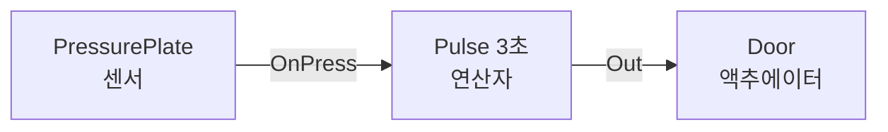

# Gimmick — 데이터로 배선하는 레벨 장치

## 이것은 무엇이고 왜 있나

"발판을 밟으면 3초 동안 문이 열린다", "레버 둘을 모두 당기면 엘리베이터가 온다" 같은 레벨 장치는 게임마다 수십 개가 필요합니다.
장치마다 컴포넌트를 짜면 레벨 디자이너가 코드를 기다려야 합니다. 이 폴더는 **센서**, **연산자**, **액추에이터**를 노드로 두고 데이터로 연결합니다.
소스 엔진의 엔티티 입출력, 포탈 2 퍼즐 메이커, 마리오 메이커의 배선과 같은 방식입니다.

장르를 가리지 않으므로 키트가 아니라 기반에 있습니다. 2D(XY 평면, 2D 콜라이더)와 3D 가 같은 코드입니다.
불이 풀로 번지는 것 같은 원소 상호작용 규칙과, 장르별로 자주 쓰는 장치 세트(`Genre/`)도 이 폴더에 있습니다.

## 머릿속 그림



**노드.** 회로를 이루는 단위입니다. 센서는 씬의 상태(겹침, 무게, 피해, 사용)를 읽어 출력을 내고, 연산자는 입력을 조합하고, 액추에이터는 입력에 따라 문이나 발판을 움직입니다.
포트 값은 모두 참과 거짓이고, 이름이 `On…` 인 출력은 한 걸음 동안만 켜지는 펄스입니다.

**회로.** 노드와 배선을 모은 것입니다(`GimmickCircuit`). 고정 스텝으로 평가하므로 같은 입력이면 같은 걸음에 같은 결과가 나옵니다.

**대상 오브젝트.** 노드는 대상 오브젝트에서 센서 값을 읽고 액추에이터를 겁니다. 대상을 비우면 회로를 가진 오브젝트입니다.

## 따라 해 보기 — 쇼케이스 씬과 회로 하나

### 1단계 — 쇼케이스 씬 열기

`Resource/game/empty/maps/gimmickshowcase.scene.xml` 에 움직이는 발판, 회전 발판, 횃불, 드럼통, 아이템 상자, 스프링이 있습니다.
레벨 회로가 시계와 토글로 문과 엘리베이터를 움직입니다. Empty 게임으로 실행합니다.

```powershell
cd build/Ninja-Debug/Bin
./App.exe -dx12 "-gv_firstScene=game/empty/maps/gimmickshowcase.scene.xml"
```

에디터로 열려면 `-EnableEditor "-gv_editorStartupScene=game/empty/maps/gimmickshowcase.scene.xml"` 을 줍니다.

### 2단계 — 회로 하나 적기

눌림판을 밟으면 문이 3초 동안 열리는 회로입니다. 테스트와 도구는 이 XML 형식을 씁니다.

```xml
<GimmickCircuit stepTime="0.0166667">
  <Node id="plate" kind="PressurePlate" threshold="50"/>
  <Node id="hold" kind="Pulse" seconds="3"/>
  <Node id="door" kind="Door" openTime="0.5" openOffset="0 3 0"/>
  <Wire from="plate.OnPress" to="hold.In"/>
  <Wire from="hold.Out" to="door.Open"/>
</GimmickCircuit>
```

### 3단계 — 씬에 놓기

씬과 프리팹에서는 같은 회로를 `GimmickCircuitComponent` 의 PROPERTY 로 저장합니다. 에디터에서 고치고 엔진 직렬화기가 씁니다.
노드는 `_listNode` 의 `GimmickNodeDesc{ _id, _kind, _params = "openTime=0.5; openOffset=0 3 0" }` 이고, 배선은 `_listWire` 의 `GimmickWireDesc{ _from, _to, _bInvert }` 입니다.
노드의 대상은 `_listNodeTarget` 에 노드 번호 순서로 `GameObjectHandle` 을 둡니다. 눌림판 오브젝트에는 `GimmickSensorComponent` 를, 무게를 주려면 `GimmickWeightComponent` 를 붙입니다.

## 작동 원리

### 내장 노드 종류

시간 매개변수(초)는 걸음 수로 바꿔(반올림) 셉니다. 실수를 누적하지 않으므로 같은 입력이면 같은 걸음에 바뀝니다.

| 분류 | 종류 | 입력 → 출력 | 매개변수 |
|------|------|-------------|----------|
| 센서 | `Volume` | → Occupied, Empty, OnEnter, OnExit | minCount |
| | `PressurePlate` | → Pressed, OnPress, OnRelease | threshold, latch |
| | `Laser` | → Blocked, Clear, OnBlock, OnClear | range, direction |
| | `Signal` | → Active, Inactive, OnActivate, OnDeactivate | |
| | `Proximity` | → Near, Far, OnApproach, OnLeave | radius, tag, planar |
| | `Timer` | Enable, Reset → OnTick, Running | interval, startEnabled, repeat |
| | `Damage` | Reset → OnDamaged, Broken | threshold, health |
| | `Interaction` | → OnUsed, Toggled | |
| | `Constant` | → Out | value |
| 연산자 | `And`, `Or`, `Xor` | A..D → Out | 연결 안 된 입력은 보지 않습니다 |
| | `Not` | In → Out | |
| | `Toggle` | In, Reset → Out | start |
| | `Latch` | Set, Reset → Out(Reset 우선) | start |
| | `Counter` | Count, Down, Reset → Reached, OnReached | target |
| | `Delay` | In → Out(오름과 내림을 N 걸음 뒤로) | seconds |
| | `Pulse` | In → Out(오르면 N 걸음 켜짐) | seconds |
| | `Sequence` | In0..In7, Reset → Done, OnFail, OnStep | count |
| 액추에이터 | `Door` | Open, Toggle, Lock → Opened, Closed, Moving, OnOpened, OnClosed | openTime, closeTime, startOpen, openOffset, openRotation |
| | `Mover` | Enable, Reverse, Restart → AtStart, AtEnd, Moving, OnArrive | speed, mode, curve, pause, autoStart, length, faceForward |
| | `Elevator` | Up, Down, Call0..3 → Moving, OnArrive, AtBottom, AtTop | floors, speed, startFloor, axis |
| | `Rotator` | Enable, Reverse → Rotating, AtTarget, AtRest | speed(도/초), targetAngle, autoStart, axis |
| | `Spawner` | Spawn, Reset → OnSpawn, Exhausted | maxCount, prefab, offset |
| | `Hazard` | Enable → Active, OnActivate, OnDamageTick | onTime, offTime, phase, startEnabled, damage, damageInterval |
| | `Light` | On, Toggle → Lit | startOn, intensity |
| | `Sound` | Play → OnPlay | sound |
| | `Enable` | Enable, Toggle → Enabled | startEnabled |

`Mover` 의 speed 는 호 길이 기준 m/s 이고, mode 는 `Once`, `Loop`, `PingPong` 중 하나입니다. curve 는 엔진 `BlendCurve` 의 이름입니다(`Engine/Animation/Graph/BlendCurve.h`).
`Door` 의 openRotation 과 `Rotator` 의 각도는 도 단위입니다. `Rotator` 의 targetAngle 이 0 이면 계속 돕니다. `Elevator` 의 floors 는 `"0 4 8"` 처럼 층 높이 목록입니다.

### 평가 순서와 상태

**평가 순서는 회로를 만들 때 한 번 정합니다.** `Delay` 노드가 먼저 지난 입력으로 출력을 내고, 나머지는 위상 순서(같으면 정의 순서)로 돕니다. 걸음 끝에 `Delay` 가 이번 입력을 받아 둡니다.
그래서 신호가 고리를 이루려면 반드시 `Delay` 를 지나야 합니다(진동기, 되먹임). `Delay` 없는 고리는 만들기 오류입니다.

**상태는 바이트 하나입니다**(`saveState`). 걸음 번호, 누적 시간, 노드 출력, 지난 입력, 센서 값, 노드 상태가 들어갑니다. 머리에 회로 모양의 해시가 있어서 다른 회로의 바이트는 거절합니다.
컴포넌트는 걸음을 낸 틱마다 PROPERTY `_stateBytes` 에 써 두므로 레벨 세이브와 핫 리로드, 플레이 복원이 이어집니다. 체크포인트는 `captureCheckpoint` 와 `restoreCheckpoint` 입니다.
네트워크 스냅샷과 롤백도 같은 바이트를 씁니다. 무버의 경로 길이는 배치에서 다시 계산하므로 저장하지 않습니다.

**쉬는 자세는 처음 플레이할 때 한 번 잡아 저장합니다**(`_listRestPose`). 그래야 핫 리로드나 세이브 로드가 움직이던 문의 위치를 쉬는 자세로 착각하지 않습니다.

**틱 시점.** 회로는 `PrePhysics` 그룹에서 틱합니다. 겹침은 물리 스텝 뒤에 오므로, 센서 변화는 다음 틱에 보입니다(한 프레임 늦음).
다른 오브젝트의 위치는 세터(틱 쓰기 큐)로 쓰고, 켜기와 빛과 스폰과 소리는 틱 뒤(`executeOrDeferPostTick`)에 겁니다.

광선과 시야(`Laser` 센서, 터렛)는 `WorldQuery` 로 묻습니다. 물리 서비스가 등록되어 있으면 그것을, 없으면 씬의 강체 물리나 `PhysicsWorld` AABB 를 씁니다.

### 원소 규칙표

"불은 풀로 번지고, 물은 불을 끄고, 바람이 불을 민다"를 데이터로 적습니다. 기본 테이블은 `Resource/common/data/elements/default.elements.xml` 이고,
`ElementGrid` 가 이 테이블을 따르는 결정적 셀 자동자입니다. 오브젝트 하나는 1 × 1 격자(`ElementStatusComponent`)입니다.

코드에는 규칙의 종류만 있습니다. 자극 줄(`<On>`)은 재질, 깃발, 상태 조건에 맞으면 재질을 바꾸거나 상태를 더하고 지웁니다.
걸음 규칙은 셋입니다. `Expire` 는 상태가 재질 수치만큼 오래되면 셀을 비우고, `Convert` 는 상태 셀의 네 이웃 재질을 바꾸고, `Spread` 는 상태를 `to` 깃발을 가진 이웃으로 옮깁니다.
퍼지는 모양은 `Neighbors4` 와 `Wind` 이고, 상태 종류는 올라가는 `Age` 와 내려가 사라지는 `Countdown` 입니다.

한 걸음은 상태 시간 흘리기, 걸음 규칙 모으기, 적용 순서입니다. 걸음 규칙은 같은 상태에서 규칙 순서와 행 우선으로 모으고, 같은 순서로 적용합니다.
적용할 때 조건을 다시 확인하므로(이미 녹은 얼음, 이미 붙은 불) 두 규칙이 같은 셀을 겨눠도 결과가 셀 순서에 달라지지 않습니다.
자극은 위에서부터 처음 맞는 한 줄만 적용합니다. 예를 들어 불은 얼음이면 녹이고, 아니면 탈 것에 붙습니다.

공유 테이블은 `ElementRuleTable::findShared` 가 캐시(`GameDataCache`)에서 줍니다. 파일을 고치면 `ElementStatusComponent` 가 다음 틱에 새 테이블로 다시 만듭니다.

### 장르 기믹 세트

`Genre/` 에는 회로와 센서를 다시 쓰는 작은 컴포넌트가 있고, `Resource/common/prefabs/gimmicks/<장르>/` 에 그것을 조립한 프리팹이 있습니다.
프리팹은 엔진 직렬화기로 쓴 것이라 손으로 고치지 않습니다.

| 장르 | 프리팹 | 핵심 컴포넌트 |
|------|--------|---------------|
| 플랫포머 | 움직이는 발판, 무너지는 발판, 한쪽 발판, 스프링, 컨베이어, 사다리, 밧줄 | `CrumblePlatformComponent`, `OneWayPlatformComponent`, `LaunchPadComponent`, `ConveyorComponent`, `ClimbZoneComponent` |
| 어드벤처 | 미는 블록, 바닥 스위치, 레버, 잠긴 문, 횃불 | `PushBlockComponent`, `ElementStatusComponent` |
| 슈터 | 폭발 드럼통, 점프대, 카드키 문, 터렛, 파괴 엄폐물 | `ExplosiveBarrelComponent`, `TurretComponent`, `DestructibleComponent` |
| 레이싱 | 부스트 패드, 아이템 상자 | `BoostPadComponent`, `ItemBoxComponent` |
| 공포 | 놀래기 트리거, 깜박이는 빛, 숨는 곳 | `ScareTriggerComponent`, `FlickerLightComponent`, `HidingSpotComponent` |
| 잠입 | 삐걱이는 바닥 | `NoiseEmitterComponent`, `LightExposure::computeExposure` |
| 메트로배니아 | 능력 문 | `AbilityGateComponent` |
| RPG | 채집 지점 | `GatheringNodeComponent` |
| 공용 | 위험 지대, 엘리베이터, 회전 발판, 드럼통 스포너 | `Hazard`, `Elevator`, `Rotator`, `Timer` 와 `Spawner` 노드 |

장르 컴포넌트의 시간은 60 Hz 걸음 수로 셉니다(`GenreGimmickUtil::makeClock`). 몸 숨기기(`setBodyActive`)와 상호작용 켜기는 틱 뒤로 미룹니다.
눌림판 무게는 `GimmickWeightComponent` 데이터, 강체 질량, 센서 기본 무게 순으로 정합니다. 발사대는 캐릭터 컨트롤러의 `launch` 를, 컨베이어는 `addSurfaceVelocity` 를 씁니다.
컨베이어는 트랜스폼을 직접 옮기지 않으므로 벽에 막힙니다.

장치가 보내는 이벤트는 "game" 채널의 `GimmickLaunchEvent`, `GimmickBoostEvent`, `GimmickItemEvent`, `GimmickCueEvent`, `GimmickNoiseEvent`, `GimmickDamageEvent` 입니다.
이벤트를 받아 몸을 띄우거나 아이템을 넣는 일은 게임과 키트가 합니다.

### 파괴와 연결

오브젝트에 파괴 컴포넌트(`FractureComponent`, 2D `Fracture2DComponent`)와 파쇄 데이터가 있으면, 장치는 몸을 끄는 대신 조각으로 부숩니다.
폭발 드럼통은 반경 안의 파괴 오브젝트(자기 포함)에 위치가 있는 폭발(`applyRadialDamageAtWorld`)을 줍니다. 세기는 `_fractureStrain`, 충격량은 `_blastImpulse` 입니다.
그래서 사슬 폭발이 근처 벽과 상자를 그 자리에서 깹니다. `_fuseTime` 이 있으면 플레이 시작부터 그만큼 지나 스스로 터집니다.
엄폐물(`DestructibleComponent`)은 단계마다 중심에 `_stageStrain` 을 단계 비율만큼 주어 조각을 깎고, 마지막 단계에 `_shatterStrain` 으로 부숩니다.
파괴 쪽 설명은 [Destruction](../../../../Engine/Destruction/README.md)에 있습니다.

## 확장하는 법

### 새 노드 종류

1. `GimmickNodeKind` 하나를 채웁니다. 입력과 출력 포트 이름(각각 32개까지), 매개변수 테이블, 상태 크기, 걸음 함수가 필요합니다.
   걸음 함수는 `GimmickNodeContext` 로 입력을 읽고 `setOutput` 으로 출력을 냅니다. 시간은 `toSteps` 로 걸음 수로 바꿉니다.
2. `GimmickNodeRegistry::getDefault()` 를 복사한 레지스트리에 `registerKind` 로 더하고, `GimmickCircuit::populate` 에 그 레지스트리를 넘깁니다.
3. 씬의 `GimmickCircuitComponent` 는 내장 레지스트리(`getDefault`)로 만듭니다. 씬 데이터에서 새 종류를 쓰려면 내장 종류(`registerBuiltinKinds`)에 더해야 합니다.

### 새 장르 장치

`Genre/` 에 컴포넌트를 더하고, 회로와 센서로 할 수 있는 부분은 회로로 둡니다. 프리팹은 에디터나 코드로 만든 오브젝트를 엔진 직렬화기로 저장하고,
`GimmickGenreTest` 가 모든 프리팹이 스폰되고 회로 검증을 통과하는지 봅니다.

## 함정과 주의

- **검증은 로드할 때 한 번에 모두 합니다.** 모르는 종류, 겹친 id, 모르는 매개변수, 숫자가 아닌 숫자, 모르는 노드와 포트, 틀린 모드와 곡선 이름, `Delay` 없는 고리가 모두 오류입니다.
  씬의 회로는 `onPostLoad` 에서 만들어 오류를 `[Error]` 로 내고 돌지 않습니다(`getErrors`). 센서나 `Hazard` 노드의 대상에 `GimmickSensorComponent` 가 없으면 시작할 때 오류입니다.
- **병렬 틱에서 다른 오브젝트의 상태를 바로 바꾸면 결과가 결정적이지 않습니다.** 받는 쪽이 이번 틱에 볼지가 스케줄에 달려서, 사슬 폭발이 한 프레임에 번지기도 하고 안 번지기도 합니다.
  기믹이 주는 피해(`GimmickDamageUtil`)는 틱 뒤에 대상 센서에 넣으므로 늘 다음 틱에 먹습니다.
- **원소 테이블에서 이름은 테이블 안에 선언한 것만 씁니다.** 모르는 이름, 규칙, 모양, 원소는 읽기 오류입니다(`ResourceDataSchemaTest` 가 `.elements.xml` 을 읽습니다).
- **액션 어드벤처 키트의 `AdventureElementGrid` 는 이 격자 위에 키트의 재질과 설정을 더한 것입니다.** 설정 값으로 기본 테이블과 같은 모양의 테이블을 코드로 만들고,
  `ElementRuleTest.AdventureGridMatchesDefaultTable` 이 걸음마다 결과가 같은지 봅니다.
- **프리팹의 콜라이더는 지금 `BoxCollider2DComponent` 입니다**(트리거 겹침 폴백). 3D 트리거와 강체 콜라이더로 바꾸는 일은 남아 있습니다.
- **Windows 헤더는 `near` 와 `far` 를 빈 매크로로 정의합니다.** 지역 변수 이름으로 쓰면 컴파일이 이상하게 깨집니다.

## 더 볼 곳

- [Interaction](../Interaction/README.md) — 상호작용(사용, 집기)과 센서 연결
- [Spline](../../World/Spline/README.md) — 무버가 따라가는 곡선
- [Destruction](../../../../Engine/Destruction/README.md) — 파괴와 조각

| 테스트 | 파일 |
|--------|------|
| `GimmickTest` | `Test/EngineTest/GameFramework/Gimmick/TestGimmick.cpp`(회로) |
| `GimmickSceneTest` | `TestGimmickScene.cpp`(씬) |
| `GimmickGenreTest` | `TestGimmickGenre.cpp`(장르 장치와 프리팹) |
| `GimmickFractureTest` | `TestGimmickFracture.cpp`(파괴 연결) |
