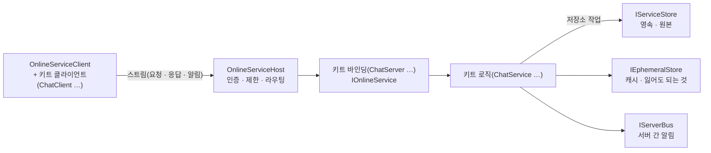

# Online — 온라인 서비스 기반

## 이것은 무엇이고 왜 있나

로그인, 채팅, 친구, 거래, 우편, 상점, 순위표처럼 게임 서버 밖에서 도는 기능을 **온라인 서비스**라고 부릅니다.
온라인 서비스는 게임 상태 복제와 성격이 다릅니다. 상태 복제(`Kits/Feature/Network/`)는 UDP 로 매 틱 위치를 보내지만,
온라인 서비스는 순서가 보장되는 신뢰 스트림 위에서 오래 연결을 유지하고, 요청 하나에 응답 하나를 돌려줍니다.
결과는 DB 에 남아야 하고, 돈이나 아이템이 움직이면 두 번 적용되면 안 됩니다.

이 폴더(`Base/Online/`)는 모든 온라인 서비스가 같이 쓰는 기반입니다. 서비스 호스트, 저장소 계약, 캐시, 서버 간 버스, 원장, 예약 작업, 원격 설정이 여기 있습니다.
서비스 하나하나(계정, 채팅 …)는 키트입니다(`Kits/Feature/Online/`). 키트끼리는 include 하지 못하므로, 여러 키트가 같이 쓰는 것은 모두 이 폴더로 내려옵니다.
언리얼 Online Services, PlayFab, Nakama 가 제공하는 기능과 같은 범위를 엔진 안에서 직접 구현한 것입니다.

이 폴더는 기반의 층 1 이라서 Core 만 봅니다. 엔진 오브젝트나 씬을 모르므로 전용 서버도, 테스트도, 부하 테스트 봇도 같은 코드를 씁니다.
클라이언트의 로컬 저장(`Local/`)과 HTTP 클라이언트(`Http/`)도 같은 이유로 이 폴더에 있습니다.

## 머릿속 그림



**서비스 호스트.** `OnlineServiceHost` 가 스트림 엔드포인트를 열고 요청을 받습니다. 연결의 첫 요청(Hello)에서 기반과 키트의 버전을 협상하고,
인증과 요청 제한(주소와 계정마다의 토큰 버킷, 본문 크기 상한)을 먼저 본 뒤 메서드 범위를 맡은 서비스(`IOnlineService`)에 넘깁니다.
키트마다 메서드 범위 256개를 가집니다(`OnlineProtocol.h`). 앞쪽 128개는 메서드이고 뒤쪽 128개는 서버가 보내는 알림입니다.

**저장소 작업.** 영속 저장소 계약은 `IServiceStore` 입니다. (테이블, 키)마다 바이트와 버전을 가지고, 조건부 쓰기를 묶은 트랜잭션과 키 범위 읽기를 지원합니다.
서비스는 저장소를 기다리지 않습니다. 저장 왕복을 작업(`IServiceStoreWork`) 하나로 맡기고, 결과는 `pollCompletions` 로 나중에 받습니다.
그래서 게임 스레드와 네트워크 스레드는 DB 응답 때문에 멈추지 않습니다.

**캐시와 버스.** `IEphemeralStore` 는 만료되는 키-값, 원자적 증감, 정렬 집합, 발행과 구독을 가진 휘발성 저장소입니다. 접속 상태나 순위처럼 잃어도 다시 만들 수 있는 것만 둡니다.
`IServerBus` 는 서버 여럿 사이의 주제 발행과 구독입니다. 다른 서버에 붙은 계정에게 알림을 보낼 때 씁니다.

**원장.** 돈과 아이템의 이동은 원장(`Ledger`)을 거칩니다. 계정, 맡김, 발행, 소각 사이의 복식 이동이고, 다리 전부가 적용되거나 아무것도 적용되지 않습니다.

## 따라 해 보기 — 채팅 키트를 테스트 하니스에서 돌려 보기

온라인 서비스는 루프백 스트림 위에서 서버와 클라이언트를 한 프로세스에 띄워 확인합니다. 채팅 키트의 끝단 테스트를 돌려 보며 요청 흐름을 따라가 봅니다.

```powershell
py -3 -m Scripts test ChatStreamTest.*
```

`ChatStreamTest.ChannelChatBetweenTwoClientsWithEchoAndErrors` 는 서버 하나에 클라이언트 둘을 붙입니다. 한 클라이언트가 채널에 들어가 말하면 다른 클라이언트가 알림으로 받습니다.
`WhisperHistoryAndMuteAcrossTwoServers` 는 서버 둘이 저장소, 캐시, 버스를 나눠 쓰고, 다른 서버에 붙은 계정에게 귓속말을 보냅니다.

하니스는 `Test/EngineTest/GameFramework/Online/OnlineHostTestUtil.h` 에 있습니다.
`OnlineTestServer` 가 메모리 저장소와 캐시, 버스, 호스트를 띄웁니다. 테스트는 키트의 로직과 바인딩을 `IOnlineTestKit` 하나로 묶어(`ChatOnServer`) `addKit` 으로 맡깁니다.
`OnlineTestClients` 는 엔드포인트 하나에 클라이언트 여럿을 붙이고, 테스트 로그인을 해 줍니다.
새 서비스 키트를 만들면 같은 하니스로 `<키트>StreamTest` 를 하나 둡니다.

<!-- snippet: Test/EngineTest/GameFramework/Kits/Online/TestChatStream.cpp 의 서버 조립 구간 — 5b U7 에서 대조 -->

## 작동 원리

### 요청 하나의 흐름

1. 클라이언트 키트(`ChatClient`)가 요청을 보내고 완료 델리게이트를 받아 둡니다. 요청 id 와 델리게이트의 짝은 `ServiceClientCallTable` 이 가집니다.
2. 호스트가 인증과 제한을 확인하고, 메서드 범위로 바인딩(`ChatServer`)을 찾습니다.
3. 바인딩은 요청을 로직에 넘기면서 꼬리표를 받고, 꼬리표와 응답 토큰의 짝을 `ServicePendingTable` 에 넣습니다.
4. 로직은 저장소 작업을 맡기고, 서비스 틱에서 완료를 받아 결과를 만듭니다.
5. 바인딩이 꼬리표로 응답 토큰을 찾아 응답합니다. 다른 계정에게 알릴 것이 있으면 `sendPush` 를 부르고, 그 계정이 다른 서버에 있으면 `IAccountPresence::sendRemotePush` 로 버스를 거칩니다.

업무 결과는 응답 본문의 첫 값입니다. 오류 코드는 공통 `OnlineError` 만 씁니다. gRPC 의 status 와 본문을 나누는 방식과 같습니다.

### 폴더마다 하는 일

| 폴더 | 하는 일 |
|------|---------|
| `Service` | 호스트, 클라이언트, 와이어 형식, 요청 테이블 |
| `Store` | 영속 저장소 계약, 멱등 기록, 키 도우미, 메모리 구현 |
| `Cache` | 휘발성 저장소 계약, 메모리 구현, 응답을 나눠 주는 라우터 |
| `Bus` | 서버 간 버스(캐시 위의 것, 프로세스 안의 것) |
| `Guard` | 토큰 버킷과 요청 상한 |
| `Audit` | 지울 수 없는 감사 줄 |
| `Schedule` | 일일, 주간, 기간 예약 작업 |
| `Config` | 원격 설정과 기능 플래그 |
| `Identity` | 계정 id 와 계정 키트가 구현하는 인터페이스 |
| `Directory` | 서버 등록과 서버 고르기 |
| `Ledger` | 원장 이동과 보존 검사 |
| `Mail` | 우편 넣기와 전체 우편 |
| `Sanction` | 계정 제재 레코드 |
| `Observability` | 서비스 표준 지표 |
| `Local` | 클라이언트 로컬 저장 슬롯 |
| `Http` | 최소 HTTP/1.1 클라이언트와 테스트 서버 |

메모리 구현(`MemoryServiceStore`, `MemoryEphemeralStore`)은 테스트와 개발 서버가 씁니다. 실제 드라이버는 저장 키트에 있습니다.
SQL 은 `GF_SQLStore`(SQLite)와 `GF_Server_SQLStore`(PostgreSQL), 캐시는 `GF_Server_CacheStore`(RESP) 입니다.

### 신원 인터페이스

다른 키트는 계정 키트를 include 하지 못합니다. 그래서 계정에 대해 알아야 하는 것은 `Identity/` 의 인터페이스로만 묻습니다.

- `IAccountDirectory` 는 이 프로세스에 붙어 있는 계정을 알려 줍니다.
- `IAccountPresence` 는 서버 여럿에 걸친 접속 상태입니다. 계정 id 나 표시 이름으로 붙은 서버를 찾고, 다른 서버의 계정에게 알림을 보냅니다.
- `IAccountNameIndex` 는 접속하지 않은 계정을 저장소에서 이름이나 id 로 찾습니다.
- `IAccountSessionControl` 은 세션을 끊습니다. GM 이 계정을 정지할 때 씁니다.

네 인터페이스 모두 계정 키트(`GF_Server_Account`)가 구현합니다.

### 로컬 저장

클라이언트의 저장 슬롯은 `ILocalStore` 입니다. 슬롯(`save/slot0`) 하나를 바이트로 원자적으로 쓰고, 맡긴 결과는 나중에 받습니다.
모든 백엔드는 같은 봉투(`LocalSlotEnvelope`)를 씁니다. 봉투에는 형식 버전과 코덱, 봉인 방식이 들어 있습니다. 봉인은 CRC32, AEAD 인증, AEAD 암호화 중 하나입니다.
바닥 저장소는 파일(`FileLocalSlotStorage`)과 메모리, SQLite 중 하나이고, 경로는 사용자 설정과 같은 `UserDataPath` 입니다.
파일 저장은 임시 파일에 쓴 뒤 이름을 바꾸므로 쓰는 도중에 꺼져도 슬롯이 깨지지 않습니다.
저장소 설정(`LocalStoreSettings`)은 아직 게임 설정 데이터와 연결되어 있지 않아서, `LocalStoreFactory` 를 부르는 쪽이 채웁니다.

### 온라인 서비스 키트

| 기능 | 공유 키트 | 서버 키트가 하는 일 |
|------|----------|-------------------|
| 계정 | `GF_Account` | 로그인, 게스트, 외부 로그인(OIDC), 세션 토큰, 재접속, 중복 로그인, 탈퇴, 게임 접속 표 |
| 서버 디렉터리 | `GF_ServerDirectory` | 점검 모드, 공지, 접속 서버 배정 |
| 채팅 | `GF_Chat` | 채널, 귓속말, 기록, 금칙어, 도배 막기 |
| 친구 | `GF_Social` | 친구, 차단, 접속 상태, 길드 |
| 매칭 | `GF_Matchmaking` | 파티, 로비, 매칭 대기열, 전용 서버 배정 |
| 순위표 | `GF_Leaderboard` | 점수, 통계, 업적, 시즌 정산 |
| 거래 | `GF_Trade` | 양쪽 제시, 잠금, 확정, 원장 정산 |
| 경제 | `GF_Economy` | 구매, 영수증 검증과 지급 |
| 우편함 | `GF_Mailbox` | 목록, 수령, 모두 받기, 만료 정리 |
| 라이브 운영 | `GF_LiveOps` | 기간 이벤트, 푸시 알림 |
| GM 도구 | `GF_Admin` | 권한 등급, 지급과 회수, 제재, 일괄 우편 |

서비스마다 폴더 하나(`Kits/Feature/Online/<기능>/`) 아래 공유 키트 `GF_<기능>` 은 `Shared/`, 서버 키트 `GF_Server_<기능>` 은 `Server/` 에 있습니다.
공유 키트에는 와이어 형식과 클라이언트가 있습니다.
GM 도구 키트는 운영 도구와 에디터만 의존하고, 플레이어용 게임은 의존하지 않습니다.
온라인 게임에서 소유의 원본은 서버 원장입니다. 클라이언트의 `Wallet` 과 `Inventory` 는 `EconomyMirror` 가 채우는 읽기 사본입니다. 오프라인 게임은 기반의 지갑과 상점을 그대로 씁니다.

서버 실행 파일에 서비스를 조립하는 일은 [Server](../../../Server/README.md)에 있습니다. 부하 테스트 봇은 `Tools/OnlineLoadBot` 이고, 키트 클라이언트를 그대로 써서 엔드포인트 하나에 연결 수천 개를 붙입니다.

## 확장하는 법

### 새 서비스 키트를 만들 때

1. 공유 키트 `Kits/Feature/Online/<기능>/Shared/` 에 와이어 형식(`<기능>Protocol.h`)과 클라이언트를 둡니다. 메서드 범위는 다른 키트와 겹치지 않게 정합니다.
2. 서버 키트 `Kits/Feature/Online/<기능>/Server/` 에 로직과 바인딩을 둡니다. 로직은 전송을 모르는 클래스로 두고, 바인딩이 `IOnlineService` 로 호스트에 등록합니다.
3. 여러 키트가 한 트랜잭션에 넣어야 하는 쓰기(원장 이동, 우편 넣기, 제재)는 이 폴더에 둡니다. 키트 안에 두면 다른 키트가 같은 트랜잭션을 만들 수 없습니다.
4. 저장소 작업마다 계약 테스트를 메모리 저장소로 돌리고, 끝단 테스트(`<기능>StreamTest`)를 하니스로 둡니다.
5. 지표가 필요하면 `ServiceMetrics` 로 표준 지표(`service_requests_total` 등)를 셉니다. 레지스트리는 전용 서버 실행 파일이 하나 가지고 넘깁니다.

키트 모듈을 만드는 일반 절차는 [Kits](../../Kits/README.md)의 "확장하는 법"을 따릅니다.

## 함정과 주의

- **캐시 응답과 서버 버스 메시지를 꺼내는 것은 호스트 하나입니다**(`getEphemeralRouter`, `subscribeServerBus`). `IEphemeralStore::pollReplies` 와 `IServerBus::pollMessages` 는 전체 것을 꺼냅니다.
  서비스 둘이 직접 부르면 서로의 응답을 가져가고, 가져간 쪽은 버리고 맡긴 쪽은 영원히 기다립니다.
- **메서드 범위가 겹치는 서비스는 `registerService` 가, 같은 메서드 번호는 `NetRequestServer::registerMethod` 가 거절합니다.** 덮어쓰면 한 키트의 요청이 다른 키트로 갑니다.
- **종료 순서는 키트(로직과 바인딩), 호스트, 저장소와 캐시 순입니다.** 실제 서버도 테스트 하니스(`OnlineTestServer::addKit`)도 같습니다.
  키트의 `shutdown` 은 빌려 준 것을 모두 회수합니다. 저장 작업, 라우터의 `cancel`, 접속 상태의 `IAccountPresence::cancel`, 버스 구독이 그것입니다.
  늦게 내려가는 서비스는 호스트 `shutdown` 이 `onHostShutdown` 으로 떼어 두므로, 사라진 호스트를 부르지 않습니다.
- **테스트 하니스의 키트는 `IOnlineTestKit` 으로 감싸 `OnlineTestServer::addKit` 으로 맡깁니다.** 서버 소멸자가 맨 먼저 키트를 올린 반대 순서로 `stop` 하고, 그 뒤에 저장소와 호스트를 내립니다.
  변수 선언 순서로 종료 순서를 맞추지 않습니다. 선언 순서에 기대면 서버가 먼저 사라진 뒤 바인딩이 호스트의 `unsubscribeServerBus` 를 부릅니다.
- **서비스 저장소의 버전은 저장소 전체에서 증가하는 수입니다.** 키마다 1 부터 세면, 지웠다 다시 만든 키가 예전 버전을 다시 받습니다.
  그러면 그 버전을 가지고 있던 늦은 쓰기가 새 레코드를 덮습니다(ABA 문제).
- **`Unavailable` 은 "적용됐는지 모른다"는 뜻입니다.** 돈이나 아이템이 움직이는 커밋은 멱등 기록(`ServiceIdempotency`)을 같은 트랜잭션에 넣습니다.
- **저장소 작업의 `run` 은 저장소 스레드에서 돕니다.** 서비스 멤버를 만지지 않고 `SW_EXPECT_*` 도 부르지 않습니다. 결과는 `complete` 에서 적용합니다.
- **멱등 재시도는 잔액과 한도 판정보다 먼저 지난 결과를 봅니다**(`EconomyStoreLogic::purchase`). 첫 구매로 잔액이 준 뒤의 재시도가 "모자람"을 받으면 클라이언트는 구매가 안 된 줄 압니다.
  재생은 저장된 분개의 다리로 합니다. 가상 화폐의 다리는 지금 잔액으로 짜므로, 다시 짜면 처음과 달라져 내용 해시가 어긋납니다.
- **환불 회수만 잔액을 음수(빚)로 만들 수 있습니다**(`_bAllowDebt`). 빚이 있는 동안 그 재화로는 살 수 없습니다.
- **캐시(RESP)는 Valkey 와 Garnet 이 함께 지원하는 명령만 씁니다.** Lua, `SELECT`, RESP3, Redis 6.2 이후 옵션을 쓰면 윈도우 서버의 Garnet 에서 동작이 갈립니다.
  비교 후 쓰기는 `WATCH`, `GET`, `MULTI/EXEC` 순서이고, 그 `GET` 응답을 받을 때까지 뒤 요청을 보내지 않습니다.
  계약 테스트 `EphemeralStoreRespTest` 를 두 서버에 같이 돌려 지키고, 서버가 없는 PC 는 가짜 RESP 서버(`FakeRespServer.h`)로 같은 계약을 돌립니다.
- **캐시 연결이 끊기면 기다리던 요청은 정확히 한 번 `Unavailable` 을 받고, 다음 요청이 다시 연결합니다.** 끊김을 알기 전에 맡긴 첫 요청도 `Unavailable` 입니다.
- **SQL 은 SQLite 3.35 이상과 PostgreSQL 이 같은 문법만 씁니다**(`ON CONFLICT`, `RETURNING`, `LIMIT ?`). 자리표시자는 늘 `?` 이고 드라이버가 바꿉니다. 갈라지는 곳은 방언 훅(`SQLDialect`)뿐입니다.
- **HTTP 클라이언트는 호스트 이름을 해석하지 못합니다.** IPv4 주소와 `localhost` 만 받고, 그 밖의 이름은 바로 실패합니다.
  외부 로그인 JWKS, 영수증 검증, 푸시처럼 바깥 HTTPS 를 부르는 기능은 이 한계를 먼저 풀어야 실제 서비스에 붙습니다.
- **루프백 스트림 전송은 한 스레드에서만 돌립니다.** 다른 스레드가 `pollIo` 를 돌리면 Debug 경합 검출기가 멈춥니다. 가짜 서버는 스레드 대신 클라이언트 전송을 감싸 같이 돕니다.
- **엔진 서비스 없이 도는 실행 파일은 이름 풀(`HashedStringPool::initialize`)부터 초기화합니다.** 빠뜨리면 첫 `hashed_string` 에서 접근 위반이 납니다. `EngineBootstrap` 앞부분과 같은 순서입니다.
- **서버 고르기 규칙은 `Directory/ServerSelection` 하나입니다.** 클라이언트 배정과 매칭의 전용 서버 배정이 같은 규칙(열림, 버전, 살아 있음, 자리, 같은 지역, 찬 비율, id 순)을 씁니다.
  스냅숏은 읽기 주기(2초)만큼 늦으므로, 고른 횟수를 다음 읽기까지 더해 두어 한 서버로 몰리지 않게 합니다.
- **점검과 공지는 영속 레코드, 주기적 다시 읽기, 버스 재촉 셋을 같이 씁니다**(`GF_Server_ServerDirectory`). 버스만 믿으면 그 순간 내려가 있던 서버는 영영 모릅니다.
  알림은 보이는 내용의 해시가 바뀔 때만 보냅니다. 기간의 시작과 끝은 다시 읽지 않아도 보이는 것을 바꾸기 때문입니다.
- **채팅은 계정이 붙은 서버가 주인입니다**(`GF_Server_Chat`). 채널은 이 서버에 회원이 있는 동안만 버스 주제를 구독하고, 귓속말은 접속 상태로 받는 서버를 찾아 그 서버 주제로 보냅니다.
  차단은 받는 쪽 서버가 보고 조용히 버리며, 보낸 사람에게는 Ok 를 돌려줍니다. 같은 서버든 다른 서버든 응답이 같아야 차단 여부가 새지 않습니다.
  채팅 금지 제재는 60초 동안 캐시하고, GM 의 `sanction.changed` 버스 메시지가 오면 캐시를 버립니다.
- **두 사람의 관계는 레코드 둘과 개수를 한 트랜잭션으로 씁니다**(`GF_Server_Social`). 따로 쓰면 동시 신청이나 상한 경합에서 한쪽만 바뀐 관계가 남습니다.
  바뀌지 않는 개수도 `requireVersion` 으로 확인합니다. 경합 테스트는 실패 주입이 아니라, 첫 커밋 직전에 상대 요청을 끼워 넣는 테스트 연결로 만듭니다(`SocialServiceTest`).
  길드 키트는 채팅을 모릅니다. 길드 사건 델리게이트를 게임 조립 코드가 채팅에 연결합니다.
- **순위는 캐시, 원본은 영속 저장소입니다**(`GF_Server_Leaderboard`). 캐시가 비면 영속에서 다시 채우는데, 그동안 온 읽기는 기다리게 하고 그동안 쓴 점수는 채운 뒤 한 번 더 씁니다.
  시즌 정산은 결과 레코드와 보상 우편을 한 트랜잭션으로 씁니다. 임대가 만료돼 다른 서버가 처음부터 다시 돌아도 보상을 두 번 주지 않습니다. 같은 점수의 순위는 계정 id 로 고정합니다.
- **매칭 권한은 모드마다 캐시 임대 하나입니다**(`GF_Server_Matchmaking`, 10초). 권한이 넘어가면 대기 중이던 표는 잃고, 표를 낸 서버의 시한이 Timeout 을 알립니다.
  비교 후 쓰기의 규칙 판정은 그 읽기 값으로 합니다. 쓰지 않으니 그사이의 다른 쓰기를 보지 못하므로, 테스트는 앞 요청을 한 걸음 돌린 뒤 판정할 요청을 냅니다.
- **라이브 이벤트가 열렸는지는 순수 함수가 판정합니다**(`LiveEventRules`). 출시 비율은 원격 설정과 같은 해시를 쓰되 이벤트 id 를 섞으므로, 같은 계정은 늘 같은 쪽이고 이벤트마다 대상 집합은 다릅니다.
  규칙 밖 요청은 저장소에 맡기기 전에 답하므로, 같은 걸음의 다른 요청보다 응답이 먼저 옵니다. 테스트가 응답 순서에 기대면 안 됩니다.
- **로컬 저장의 봉인 키는 그 PC 에 있습니다.** 실수나 가벼운 변조는 막지만 치트는 막지 못합니다. 경쟁 데이터의 원본은 서버에 둡니다.
  키 파일(`device.key`)을 다른 PC 로 옮기면 슬롯을 열지 못하고, 키가 바뀌면 봉인한 슬롯은 `WrongKey` 입니다.

## 더 볼 곳

- [Kits](../../Kits/README.md) — 키트 모듈의 규칙과 공유, 서버, 클라이언트 키트
- [GameFramework](../../README.md) — 기반 폴더의 층
- [Server](../../../Server/README.md) — 전용 서버 실행 파일과 서버 설정
- [Core](../../../Core/README.md) — 스트림 전송과 네트워크 보안(`Core/Network`)
- `Test/EngineTest/GameFramework/Online/` — 기반 테스트와 끝단 테스트 하니스
