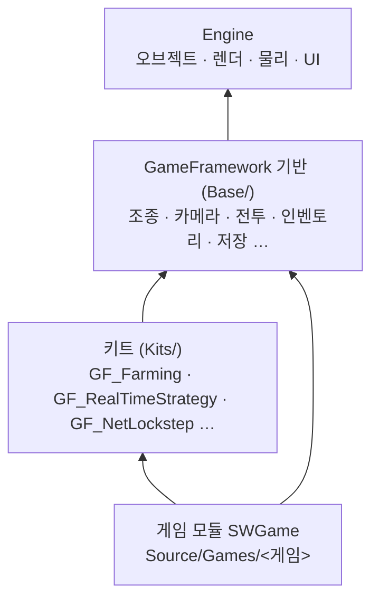

# GameFramework — 장르 공통 기반과 장르 키트

## 이것은 무엇이고 왜 있나

엔진(`Source/Engine`)은 오브젝트를 그리고 움직이고 소리를 내는 일까지만 합니다. 체력, 무기, 인벤토리, 퀘스트, 카메라 연출처럼
게임마다 다시 만들게 되는 게임플레이 코드는 엔진에 없습니다. GameFramework 는 그 코드를 모아 둔 곳입니다.
언리얼의 Gameplay Framework 와 Lyra 의 게임 기능 플러그인, 유니티의 Starter Assets 와 패키지를 합친 것에 해당합니다.

GameFramework 는 두 층으로 나뉩니다. **기반**(`Base/`)은 어느 장르든 쓰는 것이고, DLL 하나(`GameFramework`)로 빌드됩니다.
**키트**(`Kits/`)는 한 장르의 규칙이고, 키트마다 모듈(`GF_<키트>`) 하나입니다. 게임은 필요한 키트만 골라 링크합니다.
농장 게임은 `GF_Farming` 을, 실시간 전략 게임은 `GF_RealTimeStrategy` 를 링크하고, 둘 다 기반의 카메라와 인벤토리를 같이 씁니다.

App 은 GameFramework 를 링크하지 않습니다. 게임 모듈(`SWGame`)이 GameFramework 와 키트를 링크하고, App 은 게임 모듈을 불러올 뿐입니다.
그래서 엔진은 GameFramework 를 모르고(`CheckEngineLayers`), GameFramework 도 `Games/` 와 `Editor/` 를 모릅니다.

처음이라면 [시작하기](../../docs/01_GettingStarted.md)와 [Object](../Engine/Object/README.md)를 먼저 읽으세요.
이 문서는 그다음입니다. 게임 오브젝트와 컴포넌트를 안다고 보고, 그 위에 게임 규칙을 올리는 방법을 설명합니다.

## 머릿속 그림



화살표는 include 와 링크 방향입니다. 위에서 아래로만 의존하고, 키트끼리는 서로 모릅니다.

**기반.** 장르를 가리지 않는 타입입니다. 조종, 카메라, 체력과 피해, 인벤토리, 퀘스트, 월드 시계, 저장, HUD 가 여기 있습니다.
기반 안의 폴더도 층으로 나뉘어 있어서, 아래 층 폴더만 include 할 수 있습니다(작동 원리의 "기반 폴더의 층").

**키트.** 한 장르의 규칙입니다. 규칙은 대부분 컴포넌트가 아닌 보통 클래스로 둡니다(`FarmField`, `RtsWorld`).
그래서 테스트가 씬 없이 규칙만 돌려 볼 수 있습니다. 키트 목록과 키트를 만드는 규칙은 [Kits](Kits/README.md)에 있습니다.

**디렉터.** 게임마다 씬에 하나 두는 컴포넌트로, 키트의 규칙을 돌리고 필요한 오브젝트를 스폰합니다.
언리얼의 GameMode 와 GameState 를 합친 것에 해당합니다. 공통 골격은 기반의 `GameDirectorComponent` 에 있고, 게임은 이것을 상속합니다.

**폰과 조종자.** 움직이는 몸(폰)과 그 몸을 모는 쪽(조종자)을 나눕니다. 플레이어든 AI 든 네트워크 상대든, 몸은 같은 코드로 움직이고 조종자만 바뀝니다.
언리얼의 Pawn 과 Controller 에 해당합니다.

## 따라 해 보기 — 키트를 켜고 플레이어 폰을 움직이기

새 게임에 농장 키트를 연결하고, 플레이어가 WASD 로 움직이는 농부 하나를 만듭니다. 게임 폴더를 만드는 법은 [Games](../Games/README.md)를 보세요.

### 1단계 — 게임 매니페스트에 키트 적기

게임이 링크할 키트는 게임 폴더의 `SWGame.module.json` 에 적습니다. CMake 에는 다시 적지 않습니다.

<!-- snippet: Source/Games/HarvestValley/SWGame.module.json 의 의존 목록 — 5b U7 에서 대조 -->
```json
"_listDependency": [ { "_name": "GameFramework" }, { "_name": "GF_Farming" } ]
```

다시 configure 하면 `GF_Farming` 이 빌드되고 게임 모듈에 링크됩니다. 이제 게임 코드에서 `FarmField` 같은 키트 클래스를 include 할 수 있습니다.

### 2단계 — 농부 오브젝트에 폰 붙이기

농부 오브젝트에 `PawnComponent` 를 붙이고, 이동 액션과 버튼 이름을 정합니다. 보통은 에디터에서 씬에 저장하지만, 코드로 쓰면 이렇습니다.

<!-- snippet: 폰 설정 — 5b U7 에서 문서 예시 테스트로 대조 -->
```cpp
PawnComponent* pPawn = pFarmer->addComponent<PawnComponent>();
pPawn->setButtonNames( { hashed_string( "Farm.Use" ), hashed_string( "Farm.Sleep" ) } );
pPawn->setAutoPossess( PawnAutoPossess::Player0 );
```

`Player0` 은 "플레이를 시작했을 때 로컬 플레이어 0 이 이 폰을 잡는다"는 뜻입니다. 플레이어 조종자가 없으면 조종 시스템이 하나 만듭니다.
폰의 `_moveAction` 에 입력 맵 액션 이름(`Farm.Move`)을 적어 두면, 플레이어 조종자가 그 액션 값을 이동 축으로 옮깁니다.
버튼도 같은 이름의 입력 맵 액션이 누름을 정합니다. 키 배치는 게임 팩의 `data/<게임>.input.xml` 에 있습니다.

### 3단계 — 몸 컴포넌트가 의도를 읽기

몸을 움직이는 컴포넌트는 키보드를 보지 않고 폰의 의도(`ControlIntent`)만 읽습니다.

<!-- snippet: 의도를 읽는 몸 컴포넌트 — 5b U7 에서 문서 예시 테스트로 대조 -->
```cpp
void FarmerBodyComponent::onTick( float32 deltaTime )
{
    const PawnComponent* pPawn = getOwner()->getComponent<PawnComponent>();
    if ( pPawn == nullptr )
        return;
    const ControlIntent& intent = pPawn->getIntent();
    const float3         move   = intent.computeWorldMove();   // 조종 요 기준 이동 축 → 월드 방향
    // move 로 몸을 옮긴다. 버튼은 시작할 때 한 번 찾아 둔 번호로 묻는다.
    if ( pPawn->wasButtonTriggered( _useButton ) )
        requestUse();
}
```

실행하면 WASD 로 농부가 움직입니다. 같은 폰을 AI 조종자가 잡아도 이 코드는 그대로입니다.
`HarvestValley` 가 이 방식이고, 자동 플레이를 켜면 자동 농부 AI 가 같은 폰을 잡습니다.

### 4단계 — 규칙은 디렉터에

밭의 상태는 키트 클래스(`FarmField`)가 가지고 있고, 그것을 매 틱 돌리는 것은 디렉터입니다.
디렉터는 `GameDirectorComponent` 를 상속해 `startGame`, `tickGame`, `writeState`, `readState`, `onFlush` 만 구현합니다.
게임 인스턴스 생성자에 `registerDirector<FarmDirectorComponent>()` 한 줄을 넣으면, 핫 리로드와 세이브에서 디렉터의 상태가 이어집니다.
디렉터를 쓰는 전체 절차는 [Games](../Games/README.md)의 "새 게임 = 씬 + 프리팹 + 디렉터와 뷰 컴포넌트"에 있습니다.

## 작동 원리

### 기반 폴더의 층

기반 폴더는 층으로 나뉩니다. 폴더는 자기보다 낮은 층의 폴더만 include 하고, 같은 층끼리도 서로 모릅니다.
층이 순환 없는 그래프라서, 기반 DLL 하나 안에서도 의존 방향을 지킬 수 있습니다. `CheckGameFrameworkLayers` 가 이 규칙을 검사합니다.

| 층 | 폴더 |
|----|------|
| 0 | `Utility` |
| 1 | `Data`, `Match`, `Navigation`, `Online`, `Spline` |
| 2 | `Framework` |
| 3 | `Combat`, `Input`, `Inventory`, `Movement`, `Progression`, `World` |
| 4 | `AI`, `Appearance`, `Camera`, `Interaction`, `Quest`, `UI` |
| 5 | `Ability`, `Control`, `Gimmick`, `GameState` |
| 6 | `Vehicle` |

테이블의 원본은 `Scripts/lint/gate/CheckGameFrameworkLayers.py` 의 `_kBaseTier` 입니다.
위층에서 아래층으로 알려야 할 때는 신호를 씁니다. 예를 들어 체력 시스템(층 5)은 HP 바(층 4)를 모르고, 같은 오브젝트의 `HealthListenerComponent`(층 3)에 알립니다.
HP 바가 그 리스너를 상속해 알림을 받습니다.

### 조종 — 폰, 조종자, 의도

입력은 세 층을 거쳐 몸에 닿습니다. **입력 층**(`Engine/Input`)은 장치 이벤트만 압니다. **매핑 층**(입력 맵)은 장치를 액션 이름으로 바꿉니다.
**행동 층**은 폰의 의도입니다. 의도는 이동 축, 위아래, 조종 회전, 아날로그 네 개, 버튼 32개로 이루어진 값이고, 폰이 버튼과 아날로그의 이름을 정합니다.

매핑 층을 읽는 것은 플레이어 조종자(`PlayerControllerComponent`), 플레이어 시점 카메라, 명령형 게임의 디렉터뿐입니다.
폰 쪽 코드는 의도만 읽습니다. 이 경계는 `CheckControlBoundary` 의 허용 목록이 지킵니다.
허용된 파일도 키나 마우스 버튼을 직접 묻지 않고, 클릭과 확대도 입력 맵 액션(`Camera.Zoom`, `Skirmish.Select`)으로 읽습니다.
장치를 직접 묻는 것은 커서 화면 위치(`InputManager::getMousePositionNormalized`) 하나뿐입니다. 커서 아래 땅을 고를 때 씁니다.

조종 시스템(`ControlSystem`)은 씬 프레임의 `FrameSystems` 단계에서 게임 스레드로 돕니다. 이 단계는 컴포넌트 틱보다 앞입니다.
여기서 자동 빙의를 처리하고, 조종자마다 의도를 만들어 폰에 넣습니다. 그래서 틱이 병렬로 도는 동안 폰의 의도는 읽기만 하는 값입니다.
조종자는 네 가지입니다.

- `PlayerControllerComponent` 는 입력 맵을 의도로 바꿉니다. 폰을 잡으면 폰의 입력 레이어를 켜고 `PossessionChangedEvent` 를 보냅니다.
  폰이 마우스 잠금을 원하면(`_bLockMouse`, 1인칭) 커서를 잠그고, `ToggleMouseLock` 액션(Esc)으로 풀고 다시 잠급니다.
- `AiControllerComponent` 는 `think` 에서 목적지(`moveTo`)와 바라볼 곳(`setFocus`), 버튼을 정합니다.
- `IntentTrackControllerComponent` 는 기록한 의도를 틱 순서대로 냅니다. 리플레이와 자동화 시나리오의 `<Intent>` 단계가 씁니다.
- `RemoteControllerComponent` 는 네트워크로 받은 의도를 냅니다. 받지 못한 틱은 마지막 의도를 되풀이합니다.

걷는 폰은 `CharacterPawnMovementComponent` 가 의도를 캐릭터 컨트롤러로 옮깁니다. AI 는 내비 에이전트를 `SteerOnly` 로 두고, 에이전트가 낸 속도를 의도의 이동 축에 넣습니다.
플레이어와 NPC 가 같은 이동 코드로 걷는 이유가 이것입니다. 언리얼의 `RequestDirectMove`, 유니티 내비 에이전트의 `updatePosition = false` 와 같은 방식입니다.

1인칭 카메라(`FirstPersonCameraComponent`)는 폰의 조종 회전을 시점으로 씁니다. 그래서 `Control/` 폴더에 있고 입력을 읽지 않습니다.
코드가 시점을 정할 때는 `PawnComponent::requestControlRotation`, 반동은 `addControlRotationOffset` 으로 조종자에게 넘깁니다.

**자동 플레이는 빙의를 옮기는 것입니다.** 몸 안에 "자동 플레이면" 분기를 두지 않습니다. 디렉터가 스위치(`isAutoPlayOn`)를 보고 틱 뒤에 플레이어 폰을 게임의 AI 조종자에게 넘기고, 끄면 플레이어 0 의 조종자에게 돌려줍니다.

**의도는 기록하고 재생할 수 있습니다.** `ControlSystem::setRecording` 을 켜면 폰마다 의도를 기록하고 `.swintent` 파일로 씁니다.
키 바인딩이 달라도 의도는 같으므로 같은 결과가 나옵니다. 다만 시작 상태와 난수 씨앗은 기록하지 않으므로, 같은 씬을 처음부터 같은 고정 프레임 시간으로 돌릴 때만 같은 궤적이 나옵니다.

자동화 시나리오는 행동 층 단계 둘을 씁니다.
`<Intent pawn="Hero" move="0,1" buttons="Fire" frames="30"/>` 은 그 폰에 의도를 직접 넣고, `<Possess controller="Player" pawn="Horse"/>` 는 빙의를 옮깁니다.
시나리오 형식은 [Automation](../Engine/Automation/README.md)에 있습니다.

### 탑승

탈것에 타는 것은 조종자가 빙의를 탈것으로 옮기는 것입니다. 좌석은 `VehicleSeatComponent` 이고, `MountUtil::mount` 와 `dismount` 가 태우고 내립니다.
탑승자는 `SocketBindingComponent` 로 좌석 소켓에 붙고, 자기 이동은 멈춥니다. 운전석이면 탑승자의 조종자가 탈것 폰을 잡습니다.
내릴 때는 하차 위치에서 다시 자기 몸을 잡고, 그 위치가 막혔으면 둘레 여덟 방향 중 빈 곳을 씁니다.

탈것의 의도도 "가고 싶은 월드 방향"이라서 플레이어와 AI 가 같은 규칙으로 몹니다. 말은 `MountMovementComponent`, 아케이드 차는 `ArcadeVehicleComponent`,
물리 차는 `PhysicsCarComponent` 가 의도를 각자의 입력으로 바꿉니다. 탑승 중에도 탑승자의 히트박스는 그대로 맞습니다.
탑승자가 쓰러지면 `RiderDownWatcherComponent` 가 강제로 내리게 합니다.

### 게임 모듈의 수명과 상태

게임 클래스는 `GameInstanceBase` 를 상속합니다. 게임 인스턴스는 첫 씬을 요청하고(`requestFirstScene`), 게임 서비스를 등록하고, 상태 스냅샷을 다룹니다.
핫 리로드나 RHI 백엔드 교체로 게임 모듈이 다시 로드되면, 엔진은 씬 상태를 스냅샷으로 저장했다가 새 모듈로 복원합니다.

PROPERTY 는 리플렉션이 저장하지만, 디렉터가 가진 키트 객체는 PROPERTY 가 아닙니다. 그래서 그런 상태는 `writeState` 와 `restoreState` 로 넘깁니다.
게임 인스턴스는 생성자에서 타입마다 한 줄로 등록합니다.

- `registerDirector<T>()` 는 상태를 저장하고, 디렉터가 스폰한 오브젝트를 저장 전에 정리합니다.
- `registerStatefulComponent<T>()` 는 상태만 저장합니다.
- `registerViewOwner<T>()` 는 스폰한 오브젝트만 정리합니다.

스폰한 오브젝트를 정리하는 이유는, 그것이 상태를 보여 주는 모습일 뿐이기 때문입니다. 스냅샷에 넣으면 복원된 오브젝트와 다시 스폰한 오브젝트가 겹칩니다.

게임 진행의 저장도 같은 스냅샷 봉투 하나를 씁니다(`GameInstanceBase::saveStateToFile`, `loadStateFromFile`). `SaveGame` 은 키 바인딩이나 외형 프리셋 같은 사용자 파일에만 씁니다.
자동 저장 정책은 `AutosaveManager` 이고, 레벨에는 체크포인트 볼륨(`AutosaveTriggerComponent`)을 둡니다.

씬 로드를 요청하면 `LoadingScreenController` 가 로딩 화면을 UI 의 Loading 레이어에 띄웁니다. 로드가 끝나고 최소 표시 시간(0.5초)이 지나면 닫고 페이드 인합니다.
최소 시간을 두는 것은 짧은 로드에서 화면이 깜박이지 않게 하기 위해서입니다. 로딩 문서는 gamesettings 의 `_loadingScreen` 이 정하고, 기본은 `engine/ui/loading.ui.xml` 입니다.

### 카메라

카메라 시점은 코드가 아니라 `<CameraPresets>` XML 로 적습니다. 유니티 Cinemachine 의 가상 카메라와 블렌드, 언리얼의 카메라 모드에 해당합니다.
예시는 `Resource/engine/cameras/default.cameras.xml` 과 `Resource/game/shooter3d/data/shooter.cameras.xml` 입니다.

프리셋 하나는 모드와 렌즈, 감쇠, 스프링 암, 흔들림 같은 섹션 원소로 이루어집니다. 모드 계산(`CameraMode.h`)은 컴포넌트를 모르는 순수 함수라서 씬 없이 테스트합니다.
`CameraDirectorComponent` 는 카메라 오브젝트에 붙어 프리셋을 고르고 블렌드합니다. 블렌드는 언제나 지금 화면에서 출발하고, 블렌드 도중에 다시 바꾸면 그 순간의 섞인 포즈가 출발점이 됩니다.
`CameraManagerComponent` 는 플레이어마다 하나이고, 다른 오브젝트의 카메라를 뷰 타깃으로 따라갑니다. 언리얼의 `SetViewTargetWithBlend` 에 해당합니다.

디렉터는 PostPhysics 그룹에서 입력만 읽고, 포즈는 틱 뒤에 씁니다. 틱 중의 트랜스폼 쓰기는 틱이 끝나야 적용되므로, 틱 안에서 대상을 읽으면 한 프레임 늦기 때문입니다.
화면 전체에 그릴지, 화면 일부나 렌더 텍스처에 그릴지는 엔진의 `CameraComponent::setRenderOutput` 이 정합니다. 그래서 CCTV 도 디렉터와 `Fixed` 프리셋, 렌더 텍스처 출력의 조합입니다.
렌더러 쪽은 [Renderer](../Engine/Graphics/Renderer/README.md)의 "다중 뷰"를 보세요. `-gv_cameraPreset=<id>` 로 시작 프리셋을 고를 수 있습니다.

### 화면에 뜨는 것

HUD 는 `HudControllerComponent` 가 플레이하는 동안 HUD 문서를 Hud 레이어에 엽니다. 게임은 `HudViewModel` 의 세터만 부르고, 문서의 `{bind:필드}` 가 그 값을 위젯에 연결합니다.
언리얼의 `AHUD` 와 MVVM 뷰모델을 합친 것에 해당합니다.

HP 바(`HealthBarComponent`)와 데미지 숫자(`DamageNumberComponent`)는 같은 오브젝트의 화면 마커(`WidgetComponent` Screen 모드)에 위젯을 넣어 그립니다.
그래서 거리와 상관없이 같은 크기로 보입니다. HP 바는 시작할 때 같은 오브젝트의 `HealthSourceComponent` 에서 비율을 읽고, 그 뒤로는 알림을 받습니다.

튜토리얼 힌트(`TutorialHintComponent`)는 트리거 볼륨에 활성자가 들어오면 알림을 한 번 띄웁니다. 글의 `[action=이름]` 은 지금 쓰는 장치의 버튼 그림으로 바뀌고,
사용자 설정 `gameplay.showTutorials` 가 꺼져 있으면 띄우지 않습니다. 목표 마커(`ObjectiveMarkerComponent`)는 이름과 거리를 보여 주고, 화면 밖이면 가장자리에 붙어 방향을 가리킵니다.
알림 서비스 자체는 [UI](../Engine/UI/README.md)의 알림 절에 있습니다.

## 확장하는 법

### 새 타입을 기반에 둘지 키트에 둘지

의존 관계로는 정할 수 없습니다. 키트 코드도 기반 코드도 `Engine` 만 include 하므로 컴파일러에게는 어디 두든 같습니다. 그래서 기준을 하나 정해 둡니다.

**다른 장르의 게임이 이 타입을 그대로 쓰겠는가?** 그렇다면 기반에 둡니다. HP 바와 데미지 숫자는 턴제 게임도 쓰고, 중력은 플랫포머도 탄막 게임도 씁니다.
그렇지 않다면 그 장르의 키트에 둡니다. 공격 히트박스나 투사체, 액션 룸처럼 장르의 규칙을 담은 것이 여기에 해당합니다.
기준을 적어 두지 않으면 타입이 처음 필요했던 키트에 남고, 다른 장르는 그것을 쓰려고 키트를 링크하거나 복사하게 됩니다.

### 기반에 폴더를 더할 때

1. `Base/<폴더>/` 를 만듭니다. 폴더는 컴포넌트냐 아니냐 같은 형식이 아니라 기능으로 나눕니다. 형식으로 묶으면 그 폴더가 어느 기능에 의존하는지가 숨습니다.
2. `CheckGameFrameworkLayers.py` 의 `_kBaseTier` 에 층을 정해 넣습니다. 테이블에 없는 폴더는 게이트가 실패시킵니다.
3. 헤더에 처음 `REFLECT` 를 넣었으면 다시 configure 합니다. 리플렉션 대상 헤더는 `Base/` 전체를 재귀로 모으므로 새 폴더도 자동으로 들어가지만, 목록은 configure 때 만듭니다.

GameFramework 최상위에는 `Base/`, `Kits/` 와 루트 파일만 둡니다. 다른 폴더가 생기면 같은 게이트가 실패합니다.

### 새 키트를 만들 때

[Kits](Kits/README.md)의 "확장하는 법"을 따릅니다. 온라인 서비스 키트는 [Online](Base/Online/README.md)도 함께 보세요.

## 함정과 주의

- **기반을 DLL 여럿으로 나누지 않습니다.** 층은 폴더 규칙으로만 지킵니다. 이유는 [결정 기록](../../docs/09_Decisions.md)에 있습니다.
- **리플렉션 헤더를 폴더 이름으로 모으지 않습니다.** 이름으로 적으면 새 폴더의 `REFLECT` 타입이 조용히 등록되지 않습니다. 컴파일은 통과하고 역직렬화만 실패합니다.
- **틱 안에서는 구조를 바꾸지 않습니다.** 디렉터는 스폰 요청을 쌓아 두고(`hasPendingSpawn`), 베이스가 `executeOrDeferPostTick` 한 번으로 틱 뒤에 `onFlush` 를 부릅니다.
  빙의를 옮기거나 AI 조종자를 스폰하는 일도 같은 플러시에서 합니다.
- **자동 플레이 판정은 "잡은 조종자와 스위치가 다른가"로 합니다.** 잡은 조종자가 없는 폰도 다르다고 봐야 합니다.
  핫 리로드로 AI 오브젝트가 정리된 뒤에는 자동 빙의가 다시 일어나지 않으므로, 이 경우를 빼면 폰이 영영 놓입니다.
- **조종자가 `produceIntent` 안에서 빙의를 옮기면 `ControlSystem::queuePossess` 를 씁니다.** 바로 옮기면 등록 순서에 따라 같은 틱에 두 조종자가 한 폰을 몹니다.
- **자동 빙의 `Ai` 가 스폰한 조종자는 폰과 함께 지워집니다**(`ControllerComponent::isSpawnedForPawn`). 이 규칙이 없으면 스폰과 정리를 되풀이하는 적마다 조종자 오브젝트가 쌓입니다.
- **디렉터의 시뮬레이션은 `writeState` 와 `readState` 로만 넘깁니다.** 게임 모듈의 정적 변수와 PROPERTY 가 아닌 멤버는 핫 리로드 때 모듈과 함께 사라집니다.
- **뷰와 컨트롤러를 템플릿 베이스로 묶지 않습니다**(`DirectorViewComponent<T>` 같은 것). 리플렉션 부모는 등록된 타입이어야 해서 템플릿 중간 층을 둘 수 없습니다.
- **살아 있는 씬 위에 다시 만든 게임 인스턴스는 `requestFirstScene` 이 아무것도 하지 않습니다.** 핫 리로드나 백엔드 교체 뒤 복원한 씬을 첫 씬이 덮지 않게 하기 위해서입니다.
- **`SaveGame::writeBytes` 와 `readBytes` 는 순수 가상입니다.** `Archive::serializeObject<T>` 는 정적 타입 `T::StaticType()` 을 쓰므로,
  기반 클래스에서 부르면 프로퍼티가 0개인 `SaveGame` 타입으로 빈 데이터를 쓰고 성공을 돌려줍니다. 파생 세이브가 자기 타입으로 부릅니다.
- **`GameEvents.h` 의 이벤트는 그 일이 일어나는 곳에서 프레임워크가 보냅니다.** 세이브와 로드 완료는 `GameInstanceBase` 의 저장 함수가, 레벨 로드는 `requestFirstScene` 과 `requestEntranceScene` 이 보냅니다.
  `SceneManager` 를 직접 불러 로드하면 레벨 로드 이벤트가 나가지 않습니다. 보낼 곳이 없는 이벤트는 만들지 않습니다.
- **gamesettings 의 모르는 원소는 로드 오류입니다.** 게임만의 값은 `<custom><prop key>` 안에만 둡니다. 설정 파일 이름은 `path::kGameSettingsFile` 하나입니다.
- **언어 코드는 `LocalizationManager::normalizeLanguageCode` 가 돌려주는 철자 하나로 씁니다.** 로컬라이제이션 조회가 돌려주는 문자열은 추가만 하는 `LocalizedTextArena` 에 있어서 계속 유효합니다.
- **대화 노드 종류는 테이블 한 줄로 더합니다.** `kArrDialogueNodeInfo` 한 줄과 러너 switch 의 case 하나입니다. 빠뜨리면 `-Wswitch-enum` 이 알려 줍니다.
  다음 노드 계산은 러너와 에디터 미리보기가 같이 쓰는 `DialogueCursor::step` 이고, 핀 번호(`nodeId * 100 + offset`)는 디스크 형식이라 바꾸지 않습니다.
- **시퀀서의 `SequenceItemKind` 값은 JSON 에 정수로 저장되므로 번호를 바꾸지 않습니다.** 시퀀서 이벤트는 `SequencePlayerComponent::registerSequenceEvent` 로 받습니다.
- **카메라 포즈는 어느 공간의 값인지 보고 씁니다.** 월드 값이면 `CameraPoseUtil::applyToCamera`, 카메라 주인의 로컬 값(1인칭 눈 위치)이면 `applyToCameraLocal` 입니다.
  로컬 값을 월드로 쓰면 부모가 움직여도 카메라가 원점 근처에 남습니다. 루트 카메라에서는 둘이 같아서 드러나지 않습니다.
- **2D(XY 평면) 씬의 따라가기 카메라는 `Follow2DCameraComponent` 입니다.** 데이터 카메라의 모드는 Y 가 위인 땅(XZ)을 기준으로 해서 2D 씬을 맡지 못합니다. 흔들림 식은 `CameraImpulse` 하나를 같이 씁니다.
- **체력을 가진 컴포넌트는 `HealthSourceComponent` 를 상속합니다.** 읽기(`getHealthReading`)는 하나만 두고, 알림은 `notifyHealthChanged` 한 곳에서 보냅니다.
  RTTI 가 없어서 인터페이스가 아니라 리플렉션 베이스(`getComponent<HealthSourceComponent>()`)로 찾습니다.
  키트의 시뮬레이션 체력(`Vitality`, 정수 HP 배열)은 상속하지 않습니다. 그 유닛에 HP 바를 띄우려면 뷰 컴포넌트가 상속해 스냅샷을 읽습니다.
- **화면 마커 안의 위젯은 이름이 아니라 자식 순서와 타입으로 찾습니다.** 마커는 한 트리에 모이므로 이름이 겹칩니다. 위젯 값은 틱 뒤 큐에서 넣습니다. 병렬 틱에서 위젯을 고치면 안 됩니다.
- **수명이 다하면 지우는 컴포넌트(페이드, 데미지 숫자, 투사체)는 `LifeSpanUtil` 로 셉니다.** 흐른 시간은 저장되는 PROPERTY 이고 `onBeginPlay` 에서 0 으로 돌리지 않습니다.
  돌리면 되돌리기나 핫 리로드 때마다 수명이 처음부터 다시 시작합니다.
- **월드 플래그는 `GameFlags` 하나입니다.** 대화 러너와 지역 잠금(`AreaGraph`), NPC 일정이 같은 저장소와 같은 조건식(`a && !b || count>=3`)을 씁니다. 0 을 넣으면 지워집니다.

## 더 볼 곳

- [Kits](Kits/README.md) — 키트 목록, 키트를 만드는 규칙, 키트 여럿을 한 게임에 섞는 법
- [Online](Base/Online/README.md) — 온라인 서비스 기반과 온라인 서비스 키트
- 기반 폴더 문서: [Ability](Base/Ability/README.md), [Appearance](Base/Appearance/README.md), [Gimmick](Base/Gimmick/README.md),
  [Interaction](Base/Interaction/README.md), [Spline](Base/Spline/README.md), [AI/Director](Base/AI/Director/README.md), [AI/Schedule](Base/AI/Schedule/README.md)
- [Games](../Games/README.md) — 새 게임 만들기와 테스트 게임 목록
- [Input](../Engine/Input/README.md) — 입력 층과 입력 맵

| 폴더 | 들어 있는 것 |
|------|-------------|
| `Base/Control` | 폰, 조종자, 조종 시스템, 1인칭 카메라 |
| `Base/Vehicle` | 좌석과 탑승, 말과 차의 이동 |
| `Base/Framework` | 게임 인스턴스, 디렉터 베이스, 게임 서비스, 저장, 로딩 화면, 소리 |
| `Base/Camera` | 카메라 프리셋, 모드, 블렌드, 흔들림, 직교 카메라 리그 |
| `Base/GameState` | 키트 여럿이 나눠 쓰는 공유 상태(`GameStateComponent`) |
| `Base/UI` | HUD, HP 바, 데미지 숫자, 대화 러너, 튜토리얼 힌트, 목표 마커 |
| `Base/Combat` | 무기, 피해 공식, 체력 원천과 리스너, 턴 순서, 록온 |
| `Base/Utility` | 씨앗 난수, 고정 스텝 타이머, `Countdown`, 격자 구조, 상태 데이터 도우미 |
