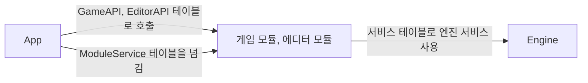

# RuntimeAPI (런타임 API)

## 이것은 무엇이고 왜 있나

RuntimeAPI는 실행 파일 `App` 과, 실행 중에 로드하는 게임 모듈과 에디터 모듈 사이의 약속입니다. 헤더만 있는 CMake INTERFACE 타깃(`RuntimeAPI`) 하나이고, `.cpp` 파일은 하나도 없습니다.

개발 빌드는 App을 끄지 않고 게임과 에디터 DLL을 바꿔 끼웁니다(핫 리로드). 그러려면 App이 모듈 안의 C++ 클래스를 컴파일할 때 알아서는 안 됩니다.
그래서 App과 모듈은 `extern "C"` 함수 포인터 테이블, 불투명 핸들, 서비스 테이블로만 대화합니다. C 함수는 이름 맹글링과 클래스 레이아웃에 영향을 받지 않으므로 DLL을 교체해도 경계가 깨지지 않습니다.
이 테이블과 핸들의 정의를 모은 곳이 RuntimeAPI입니다.

## 머릿속 그림



**API 테이블.** 모듈은 `exportGameApi` 나 `exportEditorApi` 를 내보내고, App은 이 함수를 불러 함수 포인터 테이블(`GameAPI`, `EditorAPI`)을 받습니다.
App은 그 뒤로 모듈 객체를 이 테이블로만 부릅니다. 만들기, 초기화, 업데이트, 상태 직렬화가 모두 이 테이블의 항목입니다.

**불투명 핸들.** 경계를 넘는 객체는 `ABI/RuntimeHandles.h` 의 핸들입니다. `WindowHandle`, `RHIDeviceHandle`, `EditorHandle`, `GameHandle`, `TextureHandle` 이 있습니다.
받는 쪽은 핸들 안의 타입을 모르고, 만든 쪽에 되돌려 줄 때만 씁니다.

**서비스 테이블.** 모듈이 엔진 기능(씬 매니저, 리소스 등)을 쓰려면 App이 넘겨주는 `ModuleService` 를 거칩니다. 서비스 ID 순서로 놓인 포인터 배열 하나입니다.

**ABI 버전과 스탬프.** App과 모듈이 같은 헤더로 빌드됐는지 로드할 때 확인하는 값입니다(`ABI/ModuleAbi.h` 의 `kModuleAbiVersion`, `kModuleAbiStamp`).

## 따라 해 보기 — 게임 모듈이 경계를 넘는 방법

게임 모듈의 `.cpp` 하나에 매크로 한 줄을 두면, 위의 C 진입점이 모두 생깁니다. Empty 게임은 `Source/Games/Empty/EmptyGame.cpp` 끝에서 이렇게 씁니다.

```cpp
SW_IMPLEMENT_GAME_MODULE( sw::EmptyGame );
```

이 매크로는 `Export/GameModuleExports.h` 에 있습니다. 매크로가 만드는 것은 세 가지입니다.

1. `getGameModuleAbiVersion` 과 `getGameModuleAbiStamp` 는 이 모듈이 빌드된 ABI 버전과 스탬프를 돌려줍니다.
2. `exportGameApi` 는 `GameAPI` 테이블의 함수 포인터를 `EmptyGame` 의 메서드로 채웁니다.
3. 서비스 테이블을 받으면 게임 쪽 서비스 로케이터에 연결합니다.

App은 모듈을 로드하면 먼저 버전과 스탬프를 자기 값과 비교하고, 다르면 그 모듈을 쓰지 않습니다. 같으면 `exportGameApi` 로 테이블을 받아 게임 인스턴스를 만듭니다.
에디터 모듈은 같은 방식으로 `SW_IMPLEMENT_EDITOR_MODULE` 을 씁니다(`Source/Editor/ImGuiEditor.cpp`).

## 작동 원리

### 폴더마다 담는 것

| 폴더 | 내용 | include하는 곳 |
|---|---|---|
| `ABI/` | API 테이블, 불투명 핸들, ABI 버전과 스탬프 | App, 모듈, 테스트 |
| `Service/` | 서비스 테이블과 서비스 목록 | App, 모듈 |
| `Export/` | 모듈 진입점을 만드는 `SW_IMPLEMENT_*_MODULE` 매크로 | 모듈의 `.cpp` 만 |

게임 모듈은 `ABI/GameAPI.h`, `GameFramework/Base/Framework/GameService.h`, `Export/GameModuleExports.h` 만 include합니다.
에디터 모듈은 `ABI/EditorAPI.h`, `Editor/Common/Workspace/EditorService.h`, `Export/EditorModuleExports.h` 를 include합니다.
`Export/ModuleForwardUtil.h` 는 불투명 핸들을 구현 객체로 바꿔 전달하는 도우미이고, 널 검사를 한 곳에서 합니다.

에디터 모듈은 헤드리스 에셋 임포트 진입점 `importEditorAssets( kind, checkOnly )` 도 내보냅니다. 심볼 이름은 `kImportEditorAssetsSymbol` 이고, 종류는 `EditorImportKind` 입니다.
`App --import-textures`, `App --import-models`, 그리고 `--check-*` 인자가 이 진입점을 씁니다.

`Service/IModuleCompiler.h` 는 예외입니다. 에디터 안에서 도는 백그라운드 컴파일러 서비스이고, C 함수 테이블이 아니라 C++ 가상 함수 테이블입니다.

### 서비스 테이블

서비스 ID는 두 목록에서 생성합니다. 엔진 서비스는 `Service/EngineServiceList.xxx`, 호스트 서비스는 `Service/HostServiceList.xxx` 입니다.
두 목록이 모두 RuntimeAPI에 있는 것은 서비스 ID가 App과 모듈 사이의 약속이기 때문입니다. 엔진 목록의 타입 이름으로는 전방 선언만 만들고, 나머지 열은 Engine만 읽습니다.

App이 모듈 인스턴스를 만들 때 테이블을 채워서 넘깁니다. 엔진 서비스는 `engine::fillModuleServices` 가 채우고, 호스트 서비스는 `ModuleHost` 가 직접 채웁니다.
게임 모듈에는 `GameVisible` 로 표시한 서비스만 채우고 나머지는 nullptr로 둡니다.

목록의 각 열에는 숫자가 아니라 낱말을 씁니다.

| 열 | 쓸 수 있는 값 |
|---|---|
| `requirement` | `Required`, `Optional` |
| `visibility` | `GameVisible`, `HostOnly` |
| `creator`(엔진 목록만) | `EngineCreated`, `HostCreated` |

`if constexpr` 처럼 값이 필요한 곳에서는 `Service/ServiceListColumns.h` 의 `SW_SERVICE_IS_REQUIRED`, `SW_SERVICE_IS_GAME_VISIBLE`, `SW_SERVICE_IS_ENGINE_CREATED` 매크로로 바꿉니다.
낱말에 오타가 있으면 정의되지 않은 매크로 이름이 되어 컴파일 오류가 납니다. 숫자였다면 틀린 값이 조용히 들어갔을 것입니다.

### export 매크로

export 매크로는 네 가지이고 서로 바꿔 쓰지 않습니다.

| 매크로 | 붙이는 곳 |
|---|---|
| `SW_API` | Engine.dll이 내보내는 심볼 |
| `SW_MODULE_API` | 로드할 수 있는 모든 모듈의 C 진입점 |
| `SW_GF_API` | GameFramework.dll이 내보내는 클래스 |
| `SW_GAMESERVICE_API` | GameService 로케이터 |

## 확장하는 법

**`GameAPI` 나 `EditorAPI` 에 함수를 더할 때**

1. 테이블 구조체에 함수 포인터 항목을 더합니다.
2. `Export/` 의 매크로에서 그 항목을 채웁니다.
3. `ABI/ModuleAbi.h` 의 `kModuleAbiVersion` 을 올리고 `kModuleAbiStamp` 문자열을 고칩니다. 항목 순서만 바꿔도 같습니다.
4. App과 모든 모듈을 함께 다시 빌드합니다.

**엔진 서비스를 하나 더할 때**

1. `Service/EngineServiceList.xxx` 에 한 줄을 더하고, 각 열을 낱말로 적습니다.
2. 게임 모듈에도 보여야 하면 `GameVisible` 로 표시합니다.

## 함정과 주의

**RuntimeAPI에 구현 코드를 두지 않습니다.** 선언과 타입만 둡니다. 동작 코드는 `Engine`, `Editor`, `SWGame` 쪽에 구현합니다.
`Export/` 의 매크로 본문은 예외처럼 보이지만, 그 본문은 모듈의 `.cpp` 안에서 펼쳐지므로 결국 모듈의 코드입니다.

**RuntimeAPI의 헤더는 Engine과 App을 include하지 않습니다.** `Core/` 와 RuntimeAPI 자신만 include합니다. `CheckEngineLayers.py` 가 이 규칙을 검사합니다.
`Export/` 의 매크로가 모듈 쪽 로케이터(`Editor/`, `GameFramework/`)를 끌어오는 것은, 그 본문이 모듈 `.cpp` 에서 펼쳐진다는 약속이 있어서 허용됩니다.

**테이블에 항목을 더하거나 순서를 바꾸면 ABI 버전과 스탬프를 고칩니다.** 고치지 않으면 예전 모듈이 검사를 통과하고, App이 어긋난 함수 포인터를 불러 크래시가 납니다.

**서비스 목록(`EngineServiceList.xxx`)은 RuntimeAPI에 두고 Engine이 include합니다.** 서비스 ID가 App과 모듈 사이의 약속이기 때문입니다.
목록을 ID 목록과 바인딩 목록으로 나누지 않습니다. 나누면 같은 내용을 두 곳에서 맞춰야 합니다.

## 더 볼 곳

- [핫 리로드와 C-ABI](../../docs/03_LiveReload_and_ABI.md): 이 경계 위에서 모듈을 다시 로드하는 순서
- [App](../App/README.md): 모듈을 로드하고 테이블을 부르는 쪽
- [ARCHITECTURE.md](../../ARCHITECTURE.md): 빌드 타깃과 모듈 경계 전체 그림
