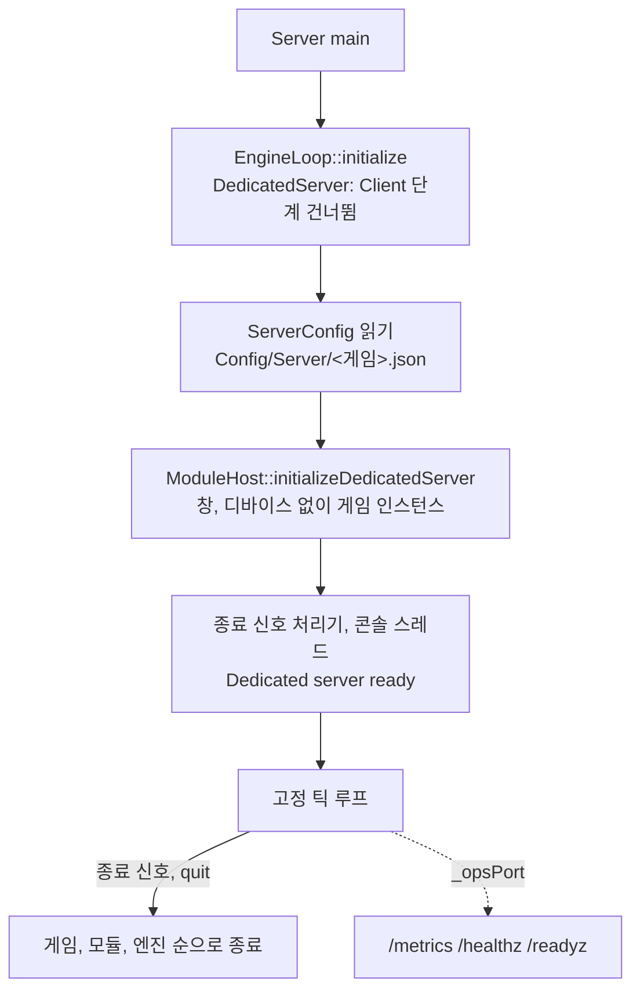

# Server — 전용 서버 실행 파일

## 이것은 무엇이고 왜 있나

멀티플레이 게임의 서버는 화면을 그리지 않습니다. 창, GPU, 오디오 장치, 플레이어 설정 없이 게임 규칙만 일정한 간격으로 진행하면 됩니다.
`Server` 는 그런 전용 서버(dedicated server)용 실행 파일입니다. 게임 모듈을 **고정 틱**으로 돌리고, 운영에 필요한 설정 파일, 상태 확인 엔드포인트, 종료 신호 처리를 갖고 있습니다.
언리얼의 `<Game>Server` 타깃과 유니티의 Dedicated Server 빌드에 해당합니다.

플레이어용 실행 파일 `App` 과는 따로 둡니다. 둘이 같이 쓰는 것은 모듈 호스트와 매니페스트 해석(`ModuleHost` 정적 라이브러리, 소스는 `Source/ModuleHost/`)뿐입니다.
렌더러를 흉내 내는 "널 RHI"를 두지 않고, 엔진 초기화에서 클라이언트 전용 단계를 아예 건너뜁니다. 테스트 하네스가 이미 같은 방식으로 RHI 없이 씬을 돌립니다.

빌드 타깃(`SW_TARGET_TYPE`)에 따라 만들어지는지가 정해집니다.

| 빌드 타깃 | 프리셋 | 만들어지는 것 |
|---|---|---|
| Game | Dev 기본(`Ninja-Debug` 등) | `App` 과 `Server` 모두 |
| Server | `*-Server`(`Ninja-Debug-Server`, `Ninja-Shipping-Server` 등) | `Server` 만 |
| Client | 배포 `*-Shipping` | `App` 만 |

## 머릿속 그림



**고정 틱.** 한 틱은 게임 고정 스텝 하나이고, 델타는 언제나 `1 / _tickRateHz` 입니다. 틱이 끝나면 다음 마감 시각까지 잠듭니다(`MonotonicClock::sleepUntilNanoseconds`).

**호스트 역할.** `EngineLoop::initialize` 에 `EngineHostRole::DedicatedServer` 를 넘기면, 엔진 초기화 목록(`Engine/EngineInitStepList.xxx`)에서 대상이 `Client` 인 단계를 돌리지 않습니다.

**서버 설정.** 포트, 틱 수, TLS 인증서 경로 같은 운영 값은 `ServerConfig` 가 디스크에서 읽습니다. 배포 빌드에서도 파일로 읽으므로 운영자가 고칠 수 있습니다.

**호스트 타깃.** 서버 런타임은 `ResourceUtil::setHostTarget( "Server" )` 로 자신이 서버임을 알립니다. 그러면 서버 패키지에 없는 에셋 종류(텍스처, 셰이더, 오디오)를 없는 것으로 처리합니다.

## 따라 해 보기 — 서버를 띄우고 상태 확인하기

**1단계 — 짧게 실행해 봅니다.** Dev 빌드에는 `App` 옆에 `Server.exe` 가 있습니다. 300 틱 뒤에 스스로 끝나게 실행합니다.

```powershell
build/Ninja-Debug/Bin/Server.exe -gv_serverExitAfterTicks=300
```

로그에 `Dedicated server: startup steps not run - …`, `Dedicated server ready`, `Dedicated server shutdown requested (TickLimit)`, `Dedicated server shutdown complete` 가 차례로 나오고 종료 코드 0으로 끝납니다.

**2단계 — 설정 파일을 줍니다.** 기본 설정 파일은 `Config/Server/<게임>.json` 입니다. 다른 파일을 쓰려면 `-server-config=<경로>` 를 줍니다.
운영 HTTP 포트를 켜려면 설정에 `"_opsPort": 9100` 을 넣습니다.

```powershell
build/Ninja-Debug/Bin/Server.exe -server-config=ops.json
curl -s http://127.0.0.1:9100/healthz   # ok
```

**3단계 — 콘솔 명령을 씁니다.** 실행 중인 서버의 표준 입력에 `status` 를 치면 가동 시간, 틱 수, 틱 시간 평균과 최대, 버린 틱 수가 나옵니다. `quit` 이나 `stop` 은 정상 종료합니다.
Dev 빌드는 개발 콘솔과 같은 명령(개발 명령, `gv_*` 전역 변수)도 받습니다.

**4단계 — 배포 서버를 빌드합니다.** `Ninja-Shipping-Server` 프리셋은 서버만 빌드하고, 쿠킹도 서버 패키지 규칙으로 합니다.

```powershell
build/Ninja-Shipping-Server/Bin/Server.exe -server-config=Config/Server/Empty.json
```

## 작동 원리

### 시작과 종료 순서

1. `EngineLoop::initialize( …, EngineHostRole::DedicatedServer )` 가 `Client` 대상 단계를 건너뜁니다. 지금은 `Fonts`, `UserSettings`, `RHI`, `FrameRenderer`, `RenderThread`, `LiveShader`, `SceneRHI`, `Telemetry`, `UI` 입니다.
   건너뛴 단계는 로그에 한 줄로 남깁니다. 오디오는 장치를 열지 않는 `NullAudioSystem` 을 쓰고, 모듈은 `Server` 대상 모듈만 로드합니다. Game 빌드에서도 에디터와 RHI 모듈은 로드하지 않습니다.
2. 서버 설정(`ServerConfig`)을 읽습니다.
3. `ModuleHost::initializeDedicatedServer` 가 창과 디바이스 없이(`nullptr`) 게임 인스턴스를 만듭니다.
4. 종료 신호 처리기(`Core/Process/ShutdownSignal`)와 표준 입력 명령 스레드(`ServerConsole`)를 띄우고 `Dedicated server ready` 를 남깁니다.
5. 고정 틱 루프를 돕니다. `_maxCatchUpTicks` 보다 많이 밀리면 밀린 시간을 버리고 경고합니다. 느린 서버가 따라잡으려다 더 밀리는 일을 막기 위해서입니다.
6. 종료 요청을 받으면 `Dedicated server shutdown requested (<사유>)` 를 남기고 게임, 모듈, 엔진 순서로 종료한 뒤 `Dedicated server shutdown complete` 를 남기고 종료 코드 0으로 끝납니다.

서버에서 되는 헤드리스 작업은 씬 쿠킹(`--cook-scenes`)뿐입니다. 서버 타깃 빌드의 `CookAssets` 가 `Server --cook-scenes` 로 쿠킹합니다. 셰이더 쿠킹과 원본 임포트는 App의 일이라 서버에서는 오류입니다.

### 서버 패키지에서 빠지는 에셋

서버 패키지에는 텍스처, 셰이더 바이너리, 오디오가 없습니다. 어떤 종류를 뺄지는 `Config/Engine/CookContract.json` 의 `target_excluded_asset_kinds` 한 곳에 적고, 두 곳이 같이 씁니다.

- 쿠커(`CookAssets.py --build-target Server`)는 팩을 만들 때 그 종류를 뺍니다. 서버 타깃 빌드가 이 인자를 넘깁니다.
- 서버 런타임은 그 종류를 요청 단계에서 없는 것으로 처리합니다. "파일 없음" 경고만 내고 오류는 내지 않습니다.

메시와 애니메이션은 충돌, 소켓, 히트박스, 루트 모션에 필요하므로 남깁니다.
Dev의 Server는 팩이 아니라 낱개 파일을 읽지만, 같은 규칙으로 그 종류를 읽지 않습니다. 그래서 개발 중에도 배포 서버와 같은 경로를 지납니다.

### 서버 설정

`ServerConfig`(`Engine/Config/Server/ServerConfig.h`)에는 받는 주소, 게임 UDP 포트와 샤드 수, 서비스 TCP 포트, 운영 HTTP 포트와 주소(`_opsPort`, `_opsListenAddress`), 틱 수, 따라잡기 상한이 있습니다.
콘솔 입력 여부, 종료 유예 시간, TLS 인증서와 개인키 경로, 저장소(`_listStore`)와 캐시(`_listCache`) 항목도 있습니다. 필드별 설명은 [생성 문서 ServerConfig](../../docs/Config/ServerConfig.md)에 있습니다.

- **Shipping도 디스크에서 읽습니다.** 설정을 바이너리에 넣지 않으므로 운영자가 고칠 수 있습니다. 파일이 없으면 Shipping 서버는 시작하지 않고, Dev는 기본값과 경고로 시작합니다.
- 상대 경로는 작업 폴더(`Bin`)에서 위로 올라가며 찾은 프로젝트 루트 기준입니다. 배포 폴더에 `Config/` 가 없으면 `-server-config` 에 절대 경로를 줍니다.
- **비밀 값은 파일에 쓰지 않습니다.** 항목의 `_secretEnvironment` 가 가리키는 환경 변수에서 `ServerSecret::read` 로 읽고, 값은 로그에 남기지 않습니다.
- TLS 인증서와 키 필드가 비어 있으면 Dev만 개발용 자체 서명 인증서를 씁니다. Shipping은 서비스 포트를 열 때 오류를 냅니다.

### 운영 관측

서버는 지표 레지스트리(`Engine/Observability/MetricRegistry`)와 상태 확인 레지스트리(`ServiceHealthRegistry`)를 항상 갖고 있습니다.
지표에는 `server_tick_seconds` 히스토그램과 `server_dropped_ticks_total` 이 있고, 상태 확인은 틱마다 신호를 받으며 종료 요청을 받으면 드레인(draining) 상태가 됩니다.
설정의 `_opsPort` 가 0이 아니면 운영 HTTP 엔드포인트(`OpsHTTPEndpoint`)를 엽니다. GET 하나에 답하고 연결을 닫으며, 평문이고 인증이 없습니다.

| 경로 | 응답 |
|---|---|
| `/metrics` | Prometheus 텍스트 형식 0.0.4 |
| `/healthz` | 틱이 10초 안에 돌았으면 200, 아니면 503. 감시자가 이것을 보고 재시작합니다 |
| `/readyz` | 준비되었으면 200, 아니면 503. 부하 분산기가 새 접속을 보낼지 정합니다 |

`/readyz` 의 "준비"는 살아 있고, 드레인 중이 아니고, 준비에 필수인 검사가 모두 통과한 상태입니다.
응답 본문에는 `live`, `ready`, `draining`, `check` 줄이 들어갑니다.

- 기본 바인드 주소는 `127.0.0.1`(`_opsListenAddress`)입니다. 같은 기계의 에이전트와 감시자만 접근하게 하기 위해서입니다. 다른 기계에서 수집하려면 사설 주소를 주고 방화벽으로 막습니다.
- 운영 포트를 켰는데 열지 못하면(포트 사용 중, 주소 오류) 서버는 시작하지 않습니다.
- 기본값은 꺼짐(`0`)입니다. 테스트나 개발에서 한 기계에 서버 여러 개를 띄우면 포트가 겹치기 때문입니다.

### 종료 신호

| 신호나 이벤트 | 사유(`ShutdownCause`) | 비고 |
|---|---|---|
| Linux `SIGTERM`(systemd, docker stop, kill) | `Terminate` | |
| `SIGINT`, Windows Ctrl+C, Ctrl+Break | `Interrupt` | 두 번째는 즉시 종료(Linux `_exit(130)`, Windows 기본 처리기) |
| Linux `SIGHUP` | `Hangup` | `SIGPIPE` 는 무시합니다 |
| Windows 콘솔 창 닫기, 로그오프, 시스템 종료 | `ConsoleClose`, `SystemShutdown` | 정리 완료(`notifyShutdownComplete`)를 4.5초까지 기다립니다 |
| Windows 서비스 정지, 사전 종료 | `ServiceStop` | `Server --service` 일 때 |
| 콘솔 `quit`, `stop` | `ConsoleCommand` | |
| `-gv_serverExitAfterTicks=N` | `TickLimit` | 테스트용. Shipping에도 있습니다 |

표준 입력이 닫혀도(EOF) 서버는 종료하지 않습니다. systemd나 Windows 서비스, `< /dev/null` 로 띄우면 표준 입력이 처음부터 닫혀 있기 때문입니다.

## 확장하는 법 — 서비스로 배포하기

### Windows 서비스

`Server --service` 는 서비스 제어 관리자(SCM)가 띄운 프로세스에서만 동작합니다(`Server/Windows/WindowsServiceHost`).
작업 폴더를 실행 파일 폴더로 옮기고, SCM의 정지와 사전 종료를 `ServiceStop` 사유로 연결하고, 대기 힌트와 함께 `STOP_PENDING` 과 `STOPPED` 를 보고합니다.
서비스에는 콘솔이 없으므로 로그는 파일로 봅니다. 관리자 PowerShell에서 다음처럼 확인합니다.

```powershell
sc create SwServer binPath= "C:\sw\Bin\Server.exe --service -server-config=C:\sw\server.json" start= demand
sc start SwServer      # 로그에 Dedicated server ready
sc stop SwServer       # 로그에 shutdown requested (ServiceStop), shutdown complete. sc query 가 STOPPED
sc delete SwServer
```

### systemd

```ini
[Unit]
Description=SW dedicated server
After=network-online.target postgresql.service valkey.service

[Service]
Type=simple
WorkingDirectory=/opt/sw-server/Bin
ExecStart=/opt/sw-server/Bin/Server -server-config=/etc/sw-server/server.json
EnvironmentFile=/etc/sw-server/secrets.env
KillSignal=SIGTERM
TimeoutStopSec=30
Restart=on-failure

[Install]
WantedBy=multi-user.target
```

비밀 값은 `EnvironmentFile` 로 환경 변수에 넣고, 설정 파일의 `_secretEnvironment` 가 그 이름을 가리키게 합니다.

## 함정과 주의

- **Linux 서버에 X11을 링크하지 마세요.** X가 없는 기계에서 `main` 이전에 죽습니다. 클라이언트 전용 코드는 `SW_WITH_CLIENT_CODE` 로 서버 빌드에서 뺍니다.
- **서버 배포본에서 Info 로그를 지우지 마세요.** 클라이언트 배포본은 Warning 이상만 컴파일하지만, 서버 배포본은 Info까지 컴파일합니다(`BuildLayout.cmake`).
  준비, 상태, 종료 줄과 콘솔 명령의 답이 Info라서, 빼면 서버가 아무 말도 하지 않습니다. 이 차이는 `ServerBootTest` 가 Shipping-Server 빌드에서 확인합니다.
- **서버 패키지에 없는 에셋을 가리키는 테스트는 서버 전용 빌드에서 건너뛰세요.** `Test/EngineTest/HostTargetTestUtil.h` 를 씁니다.
  그런 에셋을 찾는 엔진 코드(`DDSLoader`, 지형 스플랫 맵)는 `isExcludedForHost` 로 오류 없이 넘어가야 합니다.
- 서버의 크래시 보고와 텔레메트리는 아직 없습니다. `Telemetry` 단계가 `Client` 대상이기 때문입니다. 남은 일은 [백로그](../../docs/06_Backlog.md)에 있습니다.

## 더 볼 곳

| 파일 | 내용 |
|---|---|
| `ServerApp.h` | 시작, 틱 루프, 콘솔 명령, 종료 |
| `ServerConsole.h` | 표준 입력 명령 스레드 |
| `Windows/WindowsServiceHost.h` | Windows 서비스 |
| `Engine/Config/Server/ServerConfig.h` | 서버 설정 |
| `Core/Process/ShutdownSignal.h` | 종료 신호 처리 |
| `Engine/Observability/` | 지표, 상태 확인, 운영 HTTP |

- 엔진 초기화 목록: `Source/Engine/EngineInitStepList.xxx`
- 쿠킹 규칙: `Config/Engine/CookContract.json`
