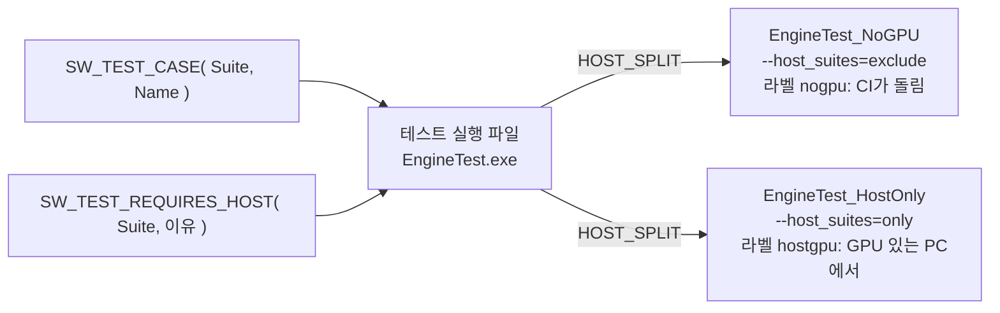

# Test — 자동화 테스트

## 이것은 무엇이고 왜 있나

이 폴더에는 엔진의 자동화 테스트가 있습니다. 테스트 프레임워크는 gtest가 아니라 직접 만든 것(`TestFramework`)이지만, `--gtest_filter` 같은 gtest 형식의 플래그도 받습니다.
테스트는 CTest로 등록되어 `ctest` 한 번으로 모두 돌고, CI는 그중 GPU 없이 도는 것을 돌립니다.

테스트 실행 파일은 **링크하는 의존성**으로 나뉩니다. 새 테스트는 필요한 의존성을 이미 링크하는 실행 파일에 넣고, 그런 것이 없으면 작은 실행 파일을 하나 더 만듭니다.
`EditorUiTest` 와 `AppTest` 가 그렇게 생겼습니다.

| 폴더 | 무엇을 테스트하나 |
|---|---|
| `CoreTest` | `Source/Core` 만. 수학, 문자열, 컨테이너, 델리게이트, 이벤트, 전역 변수 |
| `EngineTest` | 엔진 객체와 GameFramework, 장르 키트. GPU가 필요한 스위트는 따로 갈립니다 |
| `ReflectionTest` | `ReflectionParser` 가 헤더에서 `*.gen.cpp` 를 올바르게 만드는지 |
| `SmokeTest` | 게임 DLL 핫 리로드와 RHI 모듈 동적 로드 같은 런타임 통합 |
| `EditorTest` | 에디터의 UI 없는 부분. 커맨드 스택, 선택, 뷰포트 수학, 문서 더티 상태 |
| `EditorUiTest` | ImGui 컨텍스트가 필요한 에디터 테스트. GPU와 창은 쓰지 않습니다 |
| `AppTest` | App의 정책 코드와, 실제 `App.exe` 를 띄우는 실행 테스트 |
| `ServerTest` | 실제 `Server` 실행 파일을 띄워 시작, 틱, 정상 종료를 확인 |
| `PythonTest` | 파이썬 도구의 단위 테스트와 QA 러너 등록 |
| `FuzzTest` | 커버리지 안내 퍼저(Linux 전용, CTest 항목 아님) |
| `Qa` | QA 러너의 데이터. 게임별 자동 플레이 인자, 골든 이미지, 성능 기준 |
| `TestFramework` | 테스트 등록, 실행, 필터, 결과 수집 |

- `CoreTest` 의 테스트 파일은 Engine, GameFramework, Editor, Games, App 헤더를 include하지 않고 `engine::` 서비스를 부르지 않습니다.
  공용 `TestFramework` 가 Engine을 링크하므로 include 경로로는 막을 수 없어서, `CheckTestSuites.py` 가 이 규칙을 검사합니다. 엔진 타입이 필요하면 `EngineTest` 에 둡니다.
- `EngineTest` 가 GameFramework와 장르 키트를 링크하는 유일한 실행 파일이라, 키트 테스트도 여기에 있습니다. 게임 서비스 바인딩 도우미는 `EngineTest/GameTestUtil.h` 입니다.
- `EditorTest` 는 일부러 ImGui를 링크하지 않습니다. 그래서 ImGui 컨텍스트만 있으면 되는 테스트는 `EditorUiTest` 에 둡니다.
- `App` 은 실행 파일이라 링크할 라이브러리가 없습니다. 그래서 `AppTest` 는 App 소스를 파일 단위로 가져와 정책 코드(`FixedTimestep` 등)를 테스트하고, 실제 App을 띄우는 테스트도 함께 둡니다.
- `PythonTest` 는 `Test*.py` 하나가 CTest 항목 하나(`PythonTest_<이름>`, `nogpu`)입니다.

## 머릿속 그림



**스위트와 케이스.** `SW_TEST_CASE( Suite, Name )` 하나가 케이스 하나이고, 같은 `Suite` 이름의 케이스를 스위트라고 부릅니다. 필터와 CI 분류는 모두 스위트 단위입니다.

**호스트 스위트.** GPU, 디스플레이, DXC가 필요해서 CI가 돌릴 수 없는 스위트입니다. 스위트 파일 안에 `SW_TEST_REQUIRES_HOST( 스위트, "이유" )` 한 줄로 선언합니다.
CMake에는 스위트 이름을 적지 않습니다. `HOST_SPLIT` 으로 등록한 실행 파일(`EngineTest`, `AppTest`)은 이 선언을 보고 CTest 항목을 둘로 나눕니다.

**라벨.** CTest 라벨은 `core`, `editor`, `engine`, `app`, `reflection`, `module`, `server`, `unit`, `nogpu`, `hostgpu`, `lint`, `python`, `qa`, `soak`, `perf` 입니다.
`nogpu` 는 "CI 러너가 돌릴 수 있다"는 약속이고, `hostgpu` 는 CI가 돌릴 수 없는 것입니다.

**작업 폴더.** 테스트는 현재 폴더에서 위로 올라가며 `Resource/` 를 찾습니다. 그 탐색이 성공하는 위치가 `build/<프리셋>/Bin` 이므로, 테스트는 항상 `Bin` 에서 돌립니다. CTest도 그렇게 합니다.

## 따라 해 보기 — 테스트 하나 쓰고 돌리기

`Core/String` 의 Base64 인코더에 테스트 케이스를 더한다고 해 봅시다.

**1단계 — 파일 위치를 정합니다.** 테스트 파일은 소스 폴더를 따릅니다. `Source/Core/String/Base64Util` 의 테스트는 `Test/CoreTest/String/TestBase64Util.cpp` 입니다.
CMake는 하위 폴더까지 glob으로 찾으므로 새 파일을 만들어도 CMake를 고칠 필요가 없습니다. 다만 새 파일은 configure를 한 번 다시 해야 잡힙니다.

**2단계 — 케이스를 씁니다.**

<!-- snippet: Test/CoreTest/String/TestBase64Util.cpp 의 UrlAlphabetHasNoPaddingAndRoundTrips — 5b U7 에서 대조 -->
```cpp
SW_TEST_CASE( Base64UtilTest, UrlAlphabetHasNoPaddingAndRoundTrips )
{
    const uint8 arrByte[] = { 0xFB, 0xFF, 0xBF, 0x00, 0x10 };
    SW_EXPECT_EQUAL( string( "-_-_ABA" ), Base64Util::encodeUrl( arrByte, sizeof( arrByte ) ) );
    SW_EXPECT_EQUAL( string( "+/+/ABA=" ), Base64Util::encode( arrByte, sizeof( arrByte ) ) );
    vector<uint8> decoded;
    SW_ASSERT_TRUE( Base64Util::decodeUrl( "-_-_ABA", decoded ) );
    SW_ASSERT_EQUAL( sizeof( arrByte ), decoded.size() );
    for ( size_t index = 0; index < decoded.size(); ++index )
        SW_EXPECT_EQUAL( arrByte[index], decoded[index] );
}
```

`SW_EXPECT_*` 는 실패를 기록하고 계속 진행합니다. `SW_ASSERT_*` 는 기록하고 그 케이스를 끝냅니다.
뒤 줄이 앞 줄의 결과에 기대는 곳(여기서는 `decoded` 의 크기를 확인한 뒤 원소를 읽는 곳)에만 ASSERT를 씁니다.

**3단계 — 빌드하고 이름으로 돌립니다.**

```powershell
cmake --build --preset Ninja-Debug
py -3 -m Scripts test Base64UtilTest.*
```

`py -3 -m Scripts test` 는 그 스위트가 어느 실행 파일에 있는지 찾아 `Bin` 에서 돌립니다(`Scripts/dev/RunTests.py`). 직접 돌리려면 이렇게 합니다.

```powershell
cd build/Ninja-Debug/Bin
./CoreTest.exe --test_filter=Base64UtilTest.*
```

**4단계 — CTest로 확인합니다.** 커밋 전에 CI와 같은 집합을 돌립니다.

```powershell
ctest --test-dir build/Ninja-Debug -L nogpu --output-on-failure
```

GPU가 필요한 코드를 고쳤다면 GPU가 있는 PC에서 Shipping의 `hostgpu` 도 돌립니다. CI가 이것을 대신 돌려 주지 않습니다.

```powershell
ctest --test-dir build/Ninja-Shipping -L hostgpu --output-on-failure
```

## 작동 원리

### 실행하는 법

```powershell
ctest --test-dir build/Ninja-Debug --output-on-failure      # 전부
ctest --test-dir build/Ninja-Debug -L nogpu                  # CI와 같은 집합
ctest --test-dir build/Ninja-Debug -L core                   # Core만
ctest --preset Ninja-Debug-lint                              # 린트만
```

Ninja는 구성이 하나뿐인 생성기라서 `ctest -C Debug` 의 `-C` 는 아무 일도 하지 않습니다. 구성은 프리셋, 곧 빌드 폴더가 정합니다.

**Shipping의 테스트 실행 파일은 `TestBin` 에 있지만, 작업 폴더는 여전히 `Bin` 입니다.** 배포용 `Bin` 에 테스트 바이너리와 DXC가 섞이지 않게 출력 폴더만 나눈 것입니다.
`TestBin` 에서 그대로 돌리면 리소스 루트를 찾지 못합니다.

```powershell
cd build/Ninja-Shipping/Bin
../TestBin/EngineTest.exe --test_filter=MaterialTest.*
```

`py -3 -m Scripts test` 는 이 차이를 알아서 처리합니다. 실행 파일마다 `--test_list` 로 물어 패턴에 맞는 케이스가 있는 것만 `Bin` 에서 돌립니다.

```powershell
py -3 -m Scripts test "SceneTest.*,ResourceTest.Ensure*" --list   # 어느 실행 파일에 어떤 케이스가 있나
py -3 -m Scripts test ResourceTest.* --preset Ninja-Shipping
py -3 -m Scripts test ProcessTest.* --repeat 20 --shuffle
```

이 스크립트가 모르는 인자(`--host_suites=all` 등)는 실행 파일에 그대로 넘어갑니다. 고른 케이스가 어디에도 없으면 종료 코드 1로 끝납니다. 오타 난 패턴이 "통과"로 보이지 않게 하기 위해서입니다.

**린트도 CTest 항목입니다.** `lint` 라벨은 `Scripts/lint/gate/` 의 게이트와 `Scripts/lint/selftest/` 의 자기 검사 전부입니다.
목록을 손으로 적지 않고, configure 시점에 `Scripts/lint/LintCatalog.py` 가 두 폴더를 훑고 `Scripts/generate/GenerateLintTargets.py` 가 CTest 항목을 만듭니다.
지금 무엇이 도는지는 `ctest --preset Ninja-Debug-lint -N` 으로 봅니다.

### 호스트 스위트 나누기

`HOST_SPLIT` 으로 등록한 실행 파일은 CTest 항목이 두 개입니다. `<타깃>_NoGPU` 는 `--host_suites=exclude` 로 호스트 스위트를 빼고 돌며 `nogpu` 라벨을 받습니다.
`<타깃>_HostOnly` 는 `--host_suites=only` 로 호스트 스위트만 돌고 `hostgpu` 라벨을 받습니다. 지금 선언된 호스트 스위트는 `EngineTest --test_list` 끝에 이유와 함께 출력됩니다.

- `--host_suites=only` 실행이 아무것도 고르지 않으면 실패합니다. 선언한 스위트에 케이스가 없어도 실패합니다.
- **호스트 스위트의 케이스는 예상하지 못한 `[Error]` 로그 하나로 실패합니다.** 검증 레이어와 드라이버 오류는 로그로만 남고 단언은 통과할 수 있기 때문입니다.
  일부러 거절 경로를 부르는 곳은 `SW_TEST_DEFENSIVE_SCOPE( "이유" )` 로 감쌉니다. 그 안의 Error 로그는 표시가 붙어 세지 않습니다.
- 원인이 엔진에 있고 아직 고치지 못한 Error는 스위트 파일에 `SW_TEST_KNOWN_ERROR_LOG( 스위트, "문구", "이유" )` 로 적습니다.
  그 스위트의 그 문구만 허용하고, 실행 요약이 허용한 줄 수를 출력합니다. 한 번도 나오지 않으면 지우라고 알립니다.

**느린 실행 파일은 샤드로 나눕니다.** `sw_addTestExecutable` 에 `SHARDS <n>` 을 주면 `<타깃>_Shard1..n` 으로 등록되고, 각각 `--test_shard=<k>/<n>` 으로 돕니다.
케이스는 스위트 안에서 나눠지므로 느린 스위트 하나가 반으로 쪼개집니다. `HOST_SHARDS <m>` 은 `_HostOnly` 를 나눕니다(`EngineTest` 는 3과 2).
`ReflectionTest` 는 파서 스위트가 30초 제한 중 약 21초를 써서 샤드로 나눴습니다.

### 구성마다 도는 케이스 수가 다릅니다

`ctest` 는 어느 구성에서나 똑같이 "Passed"라고만 말하지만, 실제로 도는 케이스 수는 구성마다 다릅니다. 각 실행 파일에서 `--test_list` 로 셉니다.

- **SmokeTest** 는 Debug보다 Shipping에서 훨씬 적습니다(예: 52개와 3개). 핫 리로드와 모듈 백그라운드 컴파일은 Dev에만 있고, Shipping 스모크는 정적 `exportGameApi` 경로만 보기 때문입니다(`Test/SmokeTest/CMakeLists.txt`).
- **AppTest** 도 Shipping에서 줄어듭니다. 에디터 실행, 백엔드 교체, 메모리 태그 보고 케이스는 배포본에 그 기능이 없어 컴파일되지 않습니다.
- EngineTest와 EditorTest의 차이는 Dev 전용 경로(모듈 코드 해제, 셰이더 라이브 컴파일, 인스펙터 메타데이터) 케이스입니다.
- Shipping은 `SW_LOG_*` 가 컴파일에서 빠지므로 로그를 확인하는 검사가 빠집니다.

어느 구성에서나 스킵되는 것은 **자식 역할 케이스**입니다. 환경 변수가 없으면 스스로 빠지고, 다른 케이스가 자기 실행 파일을 자식 프로세스로 띄울 때만 돕니다.
`CrashReportTest.ChildProcessCrashesAsRequested`, `TestFrameworkTest.ChildRoleEchoesOrHangs`, `ModuleApiTest.SharedModuleChildKeepsItsRegistrations` 가 그 예입니다.

**의도한 축소와 사고를 가르는 기준은 하나입니다. 스위트가 통째로 비면 실패합니다.** 필터로 고른 스위트의 케이스가 전부 스킵되면 아무것도 검증하지 않은 것이므로 프레임워크가 실패로 처리합니다.
DXC가 사라지거나 쿠킹된 셰이더가 없어져도 초록으로 끝나지 않게 하기 위해서입니다. 정말 비어도 되는 실행이면 `--allow_empty_suite` 를 줍니다.
샤드로 나뉜 스위트는 이 검사를 받지 않으므로, 전제 조건이 없으면 스킵하는 스위트는 그 전제를 단언하는 케이스를 하나 둡니다(`ReflectionParserTest.ParserExecutableIsBuilt`).

### 단언과 도우미

모든 단언은 같은 뼈대(`SW_TEST_CHECK_IMPL`, `SW_TEST_CHECK_EQUAL_IMPL`)를 지나고, 실패 처리는 바깥 함수(`test::reportFailure`, `reportNotEqual` 등)에 있습니다.
그래서 단언한 곳에는 비교와 호출 하나만 남고, 새 단언도 뼈대로 한 줄이면 됩니다.

| 도우미 | 쓰는 곳 |
|---|---|
| `SW_ASSERT_TRUE_MSG( 조건, 메시지 )` | 실패하면 메시지를 남기고 케이스를 멈춥니다. 메시지에는 보통 실제로 받은 값을 넣습니다 |
| `test::ScopedLogCollector` | 스코프 동안의 Warning과 Error 로그를 모읍니다 |
| `test::ScopedDefensiveTestLog` | 일부러 내는 오류와 경고 앞에 `[Expected Defensive Test]` 를 붙입니다 |
| `test::ScopedAssertCapture` | 엔진 단언(`SW_ASSERT`, `SW_LOG_ASSERT`)을 멈추지 않고 셉니다 |
| `test::ScopedFailureCapture` | 테스트 단언의 실패를 가로챕니다. 단언 자체를 테스트할 때 씁니다 |
| `test::runThisExecutableAsChild` | 자기 실행 파일을 자식 프로세스로 띄워 케이스 하나를 돌립니다 |

- `ScopedLogCollector` 로 모은 로그는 `countContaining( "..." )` 로 그 경고가 나왔는지 확인하고, 실패 메시지에는 `joined()` 로 붙입니다. 이 도우미들은 `Test/TestFramework/TestFramework.h` 에 있습니다.
- `ScopedDefensiveTestLog` 의 표시는 로그를 읽는 사람이 의도한 오류를 실패로 오해하지 않게 하려는 것입니다.
- Debug의 엔진 단언은 디버거를 멈추지만(`SW_DEBUG_BREAK`), `ScopedAssertCapture` 를 건 동안은 멈추지 않고 셉니다. 그래서 방어 경로 테스트가 Debug에서도 돕니다. 유니티의 `LogAssert.Expect` 와 같습니다.
- `ScopedFailureCapture` 는 gtest의 `EXPECT_FATAL_FAILURE` 와 같은 일을 합니다. `Test/CoreTest/TestTestFramework.cpp` 가 매크로마다 실패를 하나 남기는지, 무엇을 출력하는지, ASSERT가 멈추는지 확인합니다.
- `runThisExecutableAsChild`(`TestFramework/TestChildProcess.h`)는 프로세스마다 한 번뿐인 상태나 프로세스를 죽이는 동작을 테스트할 때 씁니다. 환경 변수는 띄우는 동안만 걸고, 출력을 모으고, **제한 시간을 넘기면 자식을 죽입니다.**
  제한 없이 기다리면 멈춘 자식 하나가 실행 파일 전체를 CTest 제한 시간까지 붙잡습니다.
- 배포본의 `SW_LOG_ASSERT` 는 멈추지 않고 로그만 남긴 뒤 진행합니다. 그래서 `ResourceUtil::initialize()` 를 쓰는 케이스는 그 결과를 `SW_ASSERT_TRUE` 로 감싸 그 자리에서 실패하게 합니다.

### 테스트가 남긴 상태 정리

케이스가 끝나면 프레임워크가 비동기 씬 로드와 TaskManager를 정리합니다. 그 밖에 테스트가 직접 만든 것(코덱 등록, 전역 설정)은 `SW_TEST_DEFER_CLEANUP` 으로 되돌립니다. 등록한 역순으로 실행됩니다.

<!-- snippet: Test/CoreTest/Compression/TestCompression.cpp 의 코덱 등록과 되돌리기 — 5b U7 에서 대조 -->
```cpp
sw::CompressionCodecRegistry& registry  = *sw::CompressionCodecRegistry::getActive();
const bool                    bHadCodec = registry.isCodecRegistered( sw::CompressionCodecType::Custom );

registry.registerCodec( sw::make_unique<XorTestCodec>() );
SW_TEST_DEFER_CLEANUP( SW_DELEGATE_LAMBDA( sw::Delegate<void()>, [bHadCodec]()
{
    if ( bHadCodec == false )
        sw::CompressionCodecRegistry::getActive()->unregisterCodec( sw::CompressionCodecType::Custom );
} ) );
```

AssetManager 전체 종료나 전역 씬 초기화처럼 다른 테스트와 엔진 서비스에 영향을 주는 정리는 자동으로 하지 않습니다.

**임시 파일은 프레임워크가 정리합니다.** `test::makeTempPath( "x.xml" )` 는 `<임시 폴더>/sw_<pid>/<스위트_케이스>/x.xml` 을 돌려주고, 케이스가 끝나면 정리 함수가 돈 뒤 그 케이스 폴더를 통째로 지웁니다.
엔진이 옆에 쿠킹한 `.bin` 과 `.meta` 도 같이 지워집니다. 파일 이름 자체가 의미를 갖는 경우(팩 이름이 우선순위를 정하는 경우)는 `test::makeTempDirectory( "packs" )` 안에 원래 이름으로 둡니다.
파일을 연 채로 두어 지우지 못하면 그 케이스가 실패합니다.

### 반복과 섞기 — 간헐 실패와 순서 의존 찾기

| 플래그 | 하는 일 |
|---|---|
| `--test_repeat=N`(`--gtest_repeat=N`) | 고른 케이스를 N번 반복합니다. 실패하면 몇 번째 반복이었는지 함께 출력합니다 |
| `--test_shuffle`(`--gtest_shuffle`) | 스위트 순서와 스위트 안의 케이스 순서를 섞고, 쓴 씨앗을 맨 앞에 출력합니다 |
| `--test_shuffle=<씨앗>`(`--gtest_random_seed=<씨앗>`) | 그 순서를 다시 만듭니다 |

섞을 때 스위트끼리는 붙어 있습니다(gtest와 같음). 섞어서 실패한 실행은 끝에 다시 돌릴 플래그를 출력합니다.
실행 요약에는 가장 오래 걸린 케이스 다섯 개가 `Slowest cases:` 로 나옵니다. 테스트가 느려지는 것은 조용히 일어나기 때문입니다.

```powershell
cd build/Ninja-Debug/Bin
./CoreTest.exe --test_filter=ProcessTest.* --test_repeat=50   # 간헐 실패
./EngineTest.exe --test_shuffle                               # 앞 케이스가 남긴 상태에 기대는 테스트
./EngineTest.exe --test_shuffle=81234                         # 실패한 순서 다시 만들기
```

### 실제 App을 띄우는 테스트

`AppTest_HostOnly` 는 실제 `App.exe` 를 띄우는 스위트 셋을 직렬로 돌립니다. 창을 띄우고 GPU를 잡기 때문입니다.
`EngineLoop` 전체를 돌리는 자동 테스트는 이것뿐입니다.

- **`AppSmokeTest`** 는 App을 네 백엔드와 에디터 유무 조합으로 띄워 종료 코드와 `[Error]` 로그를 봅니다. 창 닫기, 백엔드 교체, 메모리 태그 보고, 골든 이미지 비교도 여기에 있습니다.
- **`AppScenarioTest`** 는 자동화 시나리오(`*.scenario.xml`)를 백엔드마다 돌리고 종료 코드 0을 확인합니다. 엔진 시나리오와 활성 게임 팩의 시나리오를 모두 찾으므로, 파일을 두기만 하면 돕니다.
  시나리오 형식과 실행기는 [Automation README](../Source/Engine/Automation/README.md)에 있습니다.
- **`AppUiTest`** 는 엔진 시나리오 `engine/automation/uidemo.scenario.xml` 을 백엔드마다 돌려 UI 견본 화면의 스크린샷과 레이아웃 덤프(`UiLayoutDump`)를 받습니다.
  덤프에서 위젯 이름으로 사각형을 찾아, 알려진 영역의 색을 확인하고(주 버튼 가운데는 강조색), 영역마다 평균 색과 가장자리 수를 첫 백엔드와 비교합니다(평균 차 0.02 이하, 가장자리 수 차 2% 이하).

세 스위트 모두 종료 코드 13(건너뜀)과 77(이 기계에 없는 백엔드)은 건너뜁니다. 게임은 프리셋마다 하나이므로, 게임 시나리오는 그 게임의 프리셋에서 돕니다.

```powershell
ctest --test-dir build/Ninja-Debug-Shooter3D -L hostgpu -R AppTest_HostOnly --output-on-failure
```

**벤치 장면 골든 이미지.** `AppSmokeTest.BenchFrameMatchesGoldenImage` 는 벤치 큐브 장면(`-W=256 -H=144 -gv_benchMeshes=8 -gv_benchAnimate=0`)을 불투명과 투명 두 장으로 백엔드마다 찍습니다.
그리고 `Test/AppTest/Golden/<장면>_<백엔드>.ppm.z`(Zlib으로 감싼 PPM)와 채널 차이 2까지 비교합니다.
기준은 백엔드마다 하나이고 Windows 드라이버가 그린 것입니다. Linux는 `.linux` 를 붙인 이름을 따로 두고, 없으면 경고만 남깁니다. 배포본은 링크한 백엔드 하나의 기준과 비교합니다.
실패한 이미지는 `build/<프리셋>/GoldenDiff` 에 남습니다.

### QA 러너 — 게임 골든 이미지, soak, 성능, 퍼징

`PythonTest` 폴더의 CMake가 QA 러너를 CTest에 등록합니다. `QaGoldenImages`(`hostgpu`), `QaSoak`(`soak`), `QaPerfRegression`(`perf`, Release만)입니다.
`soak` 와 `perf` 는 몇 분씩 걸려서 `hostgpu` 에 넣지 않았고, `ctest -L soak` 처럼 직접 고릅니다.

```powershell
py -3 -m Scripts golden --app build/Ninja-Debug-NileCity/Bin/App.exe                         # 네 백엔드로 그려 기준과 비교
py -3 -m Scripts golden --app build/Ninja-Debug-NileCity/Bin/App.exe --record --runs 3       # 기준을 새로 만든다
py -3 -m Scripts soak --app build/Ninja-Debug-NileCity/Bin/App.exe --minutes 10 --out soak.json
py -3 -m Scripts perf --app build/Ninja-Release/Bin/App.exe [--record]
```

**게임 골든 이미지는 픽셀이 아니라 지표로 비교합니다**(`Scripts/common/ImageMetrics.py`). 모서리에서 배경색을 추정해 빼고, 전경 비율, 전경 평균색, (R−B), 경계 밀도, 8×4 격자 밝기를 비교합니다.
자동 플레이는 실제 시간을 따라가서 같은 프레임 번호에서도 장면이 조금씩 다르므로, 허용 오차는 `--record` 가 같은 조건으로 여러 번 돌린 결과의 퍼짐으로 정합니다.

- 기준은 `Test/Qa/Golden/<게임>/<백엔드>.png` 와 `.json` 입니다. 160×90 PNG라 작고 사람이 열어 볼 수 있습니다. 지금 Empty, NileCity, StarSkirmish, Shooter3D에 네 백엔드씩 있습니다.
- 게임마다의 자동 플레이 인자와 캡처 프레임은 `Test/Qa/Games.json` 에 있습니다. 기준이 없는 게임과 돌지 못하는 백엔드는 건너뜁니다(77, CTest Skipped).
- 네 모서리가 두 색으로 갈리는 장면(1인칭에서 위는 하늘, 아래는 땅)은 배경이 없다고 보고 화면 전체를 전경으로 측정합니다.
- 판정이 실제로 실패를 잡는지는 `--extra-arg=-gv_viewMode=2`(와이어프레임)나 `--extra-arg=-gv_benchMeshes=0` 으로 일부러 망가진 이미지를 만들어 봅니다. 이 실행은 기준에 남지 않습니다.
- 실패한 실행의 App 출력은 `%TEMP%/sw_golden_<백엔드>_<회차>_app.log` 에 있습니다.

**soak** 는 `-gv_profileSeconds=<초>` 로 App이 그 시간 동안 돌고 스스로 끝나게 하고, 바깥에서 프라이빗 메모리, 작업 집합, 핸들, GDI와 USER 개체 수를 측정합니다.
판정은 워밍업 뒤의 최소제곱 기울기(MB/분, 개/분)입니다. 처음과 끝 두 점만 보면 캐시 채우기 같은 계단을 누수로 오해하기 때문입니다.

**성능 기준은 기계마다**(호스트, CPU, 백엔드) 따로 있고 `Test/Qa/Perf/<게임>.json` 에 저장됩니다. 여러 번 돌린 결과의 중앙값을 쓰고, `값 > 기준 × (1 + 허용 오차) + 바닥` 이면 실패입니다.

**로더 퍼징.** `EngineTest` 의 `LoaderFuzzTest`(nogpu)는 씨앗을 고정한 변이로 로더를 퍼징합니다. 오래 돌리려면 반복 수를 늘립니다.

```powershell
$env:SW_FUZZ_ITERATIONS=20000; $env:SW_FUZZ_TRACE=1; build/Ninja-Debug/Bin/EngineTest.exe --test_filter=LoaderFuzzTest.*
```

퍼징 대상 목록은 `EngineTest/LoaderFuzzTargets.cpp` 에 있습니다. XML, JSON, DDS, `.mesh`, 팩, 씬 같은 로더 스물몇 개가 들어 있고, 씨앗은 저장소의 실제 파일입니다.
엔진 단언도 결함으로 셉니다. 바깥 데이터로 단언이 걸린다면 입력 검증이 먼저 막아야 하기 때문입니다. 찾은 결함은 그 로더의 스위트에 회귀 테스트로 둡니다.
커버리지 안내 퍼징(libFuzzer)은 `FuzzTest/` 의 `LoaderFuzzer` 가 같은 대상 목록으로 합니다. Linux 전용이고(`SW_ENABLE_FUZZING`, 프리셋 `CI-Fuzz`) `.github/workflows/fuzz.yml` 이 밤마다 돌립니다.
퍼저와 테스트 실행 파일은 같은 초기화 코드(`Test/TestFramework/TestHostRuntime`)를 씁니다.

## 확장하는 법

**GPU가 필요한 테스트를 쓰려면**

1. RHI 디바이스를 만드는 테스트는 `RenderPassGpuTest` 스위트에 넣습니다.
2. 창과 디바이스는 `test::RHITestDevice`(`Test/EngineTest/RHITestDevice.h`)로 만듭니다. 스코프를 벗어나면 정리되므로, 단언으로 일찍 빠져도 다음 케이스에 남지 않습니다.
3. 백엔드마다 도는 케이스는 `test::RHIBackendSweep` 범위로 돕니다. `for ( test::RHITestDevice& device : sweep )` 로 만들어진 백엔드마다 본문을 한 번씩 돌리고, 하나도 없으면 `sweep.getReadyCount() == 0` 으로 건너뜁니다.
4. 새 호스트 스위트를 만들 때는 그 스위트 파일에 `SW_TEST_REQUIRES_HOST` 를 두고, 파일에 다른 스위트를 두지 않습니다.

**렌더링이 의도해서 바뀌었다면 골든 기준을 다시 만듭니다.** 벤치 장면은 `SW_UPDATE_GOLDEN=1` 로 그 케이스를 돌리고, 바뀐 `.ppm.z` 를 같은 커밋에 넣습니다. 게임 골든은 `py -3 -m Scripts golden --record` 를 씁니다.

**새 테스트 실행 파일을 만들려면** `sw_addTestExecutable` 로 등록합니다. 호스트 스위트가 있으면 `HOST_SPLIT`, 느리면 `SHARDS` 를 줍니다. 등록하면 작업 폴더가 `Bin` 인 CTest 항목이 생깁니다(`sw_registerTestRun`).

## 함정과 주의

- **스위트 이름은 `XxxTest` 형식으로 하고, 한 스위트는 한 파일에만 둡니다.** 대문자로 시작하고 `Test` 로 끝나며 밑줄이 없어야 합니다. `Core_` 나 `Engine_` 같은 계층 접두어는 붙이지 않습니다. 실행 파일 이름이 이미 그 정보를 줍니다.
  CI 분류와 `--test_filter` 가 모두 스위트 단위라서 이름이 흔들리면 둘이 흔들립니다. `CheckTestSuites.py` 가 강제합니다.
- **호스트 스위트 파일에 다른 스위트를 두지 마세요.** 섞여 있으면 새 케이스를 옆 스위트에 붙이기 쉽고, 그 순간 GPU가 필요한 케이스가 CI로 들어갑니다.
  `SW_TEST_REQUIRES_HOST` 는 `HOST_SPLIT` 으로 등록된 폴더에 있어야 효력이 있습니다. 그렇지 않으면 아무도 읽지 않아 CI가 그 스위트를 돌립니다. 이것도 `CheckTestSuites.py` 가 확인합니다.
- **실행 파일 폴더(`Bin`)나 소스 트리에 파일을 쓰지 마세요.** 같은 `Bin` 을 쓰는 다른 프로세스와 부딪치고, 단언으로 일찍 빠지면 파일이 남습니다.
  소스 트리의 `Resource/` 에 꼭 써야 한다면 만들기 **전에** `SW_TEST_DEFER_CLEANUP` 으로 지우는 일을 걸어 둡니다(`ResourceTest.ConfigurableResourcePriorityAndDlcSupport`).
- **오브젝트는 지역 `GameObjectManager` 로 만듭니다.** 전역 활성 씬을 빌려 쓰면 테스트끼리 상태가 샙니다.
- **`TestBin` 에서 테스트를 직접 돌리지 마세요.** 리소스 루트를 찾지 못합니다. 작업 폴더는 언제나 `Bin` 입니다.
- **커버리지 안내 퍼징은 Linux에서만 합니다.** Windows의 `clang_rt.fuzzer` 는 정적 런타임(/MT)뿐이라 동적 런타임(/MD)인 엔진과 링크되지 않습니다. 디코더만 /MT로 떼어 돌리지 않고, 같은 코드를 Linux가 퍼징합니다.
- `EditorTest` 는 Editor 소스를 손으로 나열합니다. 나열한 파일이 실제로 있는지, ImGui를 include하지 않는지는 `CheckTestSuites.py` 가 확인합니다.

## 더 볼 곳

| 파일 | 내용 |
|---|---|
| `TestFramework/TestFramework.h` | 매크로, 단언, 도우미 |
| `TestFramework/TestChildProcess.h` | 자식 프로세스로 케이스 돌리기 |
| `EngineTest/RHITestDevice.h` | GPU 테스트 장치 |
| `AppTest/AppTestUtil.h` | App 실행 도우미, 건너뛸 종료 코드 |
| `cmake/Engine/TestTargets.cmake` | `sw_addTestExecutable`, `HOST_SPLIT`, `SHARDS`, `sw_registerTestRun` |

- 검증 절차 전반: [docs/08_Verification.md](../docs/08_Verification.md)
- 자동화 시나리오: [Automation README](../Source/Engine/Automation/README.md)
- 상위 문서: [문서 지도](../docs/02_DocumentMap.md)
