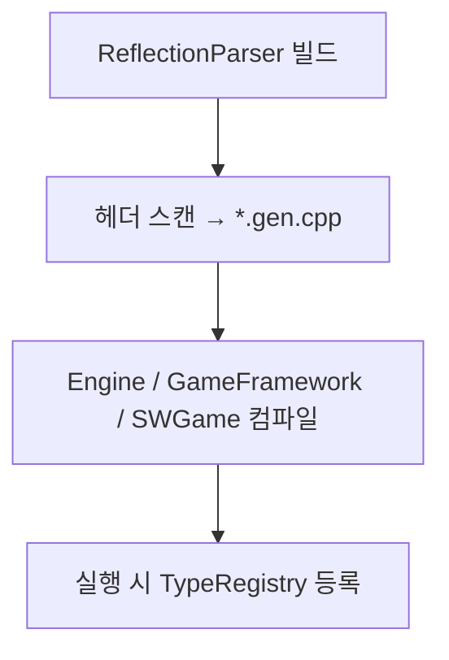
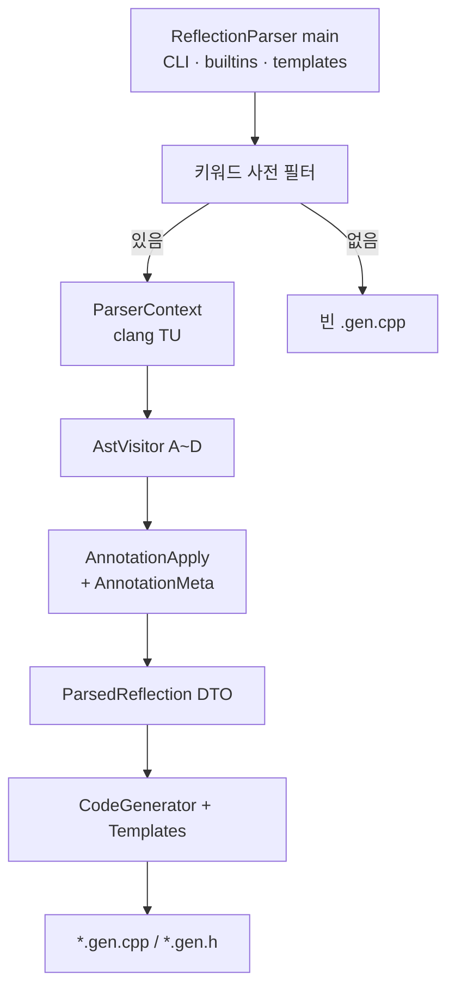

# ReflectionParser (리플렉션 파서)

> **[🏠 위키 홈으로 돌아가기](../../../README.md)** | **[📖 서브시스템 목록](../../../docs/02_EngineSubsystems.md)**

엔진/게임 헤더의 `REFLECT`, `PROPERTY`, `FUNCTION`, `ENUM` 등을 **libclang으로 파싱**해  
런타임 메타데이터 소스(`*.gen.cpp` / `*.gen.h`)를 만드는 **호스트 콘솔 도구**입니다.

경로: `Tools/ReflectionParser/`  
런타임: [Source/Engine/Reflection/README.md](../../Source/Engine/Reflection/README.md)

---

## 왜 먼저 빌드해야 하나?

씬 로드, 에디터 인스펙터, 핫리로드, `addComponentByName` 등이  
모두 **생성된 TypeInfo / Registrar** 에 의존합니다.



CMake는 `ReflectionParser` 타겟이 준비된 뒤에야 `sw_addReflectionStep` 으로 gen을 돌립니다.  
(`cmake/Engine/ReflectionCodeGen.cmake`)

---

## 초심자: 어디부터 읽나?

한 헤더가 `.gen.cpp` 가 되기까지 **파일 역할**만 먼저 잡으면 됩니다.

```text
ReflectionParser.cpp   ← main 단계 1~5 (진입점)
ParsedReflection.h     ← “무엇을 수집했는지” DTO만
AstVisitor.*           ← libclang 커서 순회 (핫패스, 섹션 A~D)
AnnotationApply.*      ← REFLECT/PROPERTY 문자열 → DTO 필드
CodeGenerator.*        ← DTO + Templates/*.tpl → .gen.cpp
ParserContext.*        ← clang 인자·TranslationUnit 수명
ParserDefines.h        ← 매크로/CLI/tpl 이름 계약 (JSON이 아님)
```

| 궁금한 것 | 열 파일 |
|-----------|---------|
| CLI / 병렬 / up-to-date | `ReflectionParser.cpp` |
| 수집 구조체 멤버 | `ParsedReflection.h` |
| `Alias=` 토큰이 어디에 붙나 | `AnnotationApply.cpp` + `AnnotationMeta.txt` |
| AST에서 클래스·필드를 어떻게 찾나 | `AstVisitor.cpp` (A~D) |
| 생성 코드 모양 | `CodeGenerator.cpp` + `Templates/` |
| clang `-DREFLECT...` 인자 | `Config/Environment/parser_config.defaults.json` |

**새 PROPERTY 필드 추가:**  
`Source/Core/Predefined/AnnotationMeta.txt` 별칭 + `AnnotationApply.cpp` apply 테이블을 **함께** 수정.

---

## 한 파일 처리 파이프라인

| 단계 | 담당 | 하는 일 |
|------|------|---------|
| 1. 키워드 스캔 | `ReflectionParser.cpp` | `REFLECT`/`PROPERTY` 없으면 빈 gen만 emit |
| 2. clang TU | `ParserContext` | libclang TranslationUnit 생성 |
| 3. AST 순회 | `AstVisitor` | 타입·멤버 커서 수집 |
| 4. 어노테이션 적용 | `AnnotationMeta` → `AnnotationApply` | 별칭 토큰 → `Parsed*` 필드 |
| 5. 코드 생성 | `CodeGenerator` + `Templates/` | `.gen.cpp` / `.gen.h` |
| 6. 빌드 포함 | CMake `ReflectionCodeGen.cmake` | gen을 타겟에 넣어 컴파일 |



`main` 내부 단계 (`ReflectionParser.cpp`):

1. CLI 파싱  
2. builtins-gen 전용 모드면 여기서 종료  
3. builtins / AnnotationMeta / Templates 로드  
4. `ParserContext::ensureSharedConfig` (clang 인자 1회 캐시)  
5. 타임스탬프 캐시 후 입력별 `std::async` → `processInputFile`

---

## 폴더 구조

```text
ReflectionParser/
├─ ReflectionParser.cpp          # CLI · 병렬 진입 · up-to-date
├─ ParsedReflection.h            # ParsedTypeInfo / Property / Enum …
├─ AstVisitor.h / .cpp           # AST 순회 (A~D)
├─ AnnotationApply.h / .cpp      # 어노테이션 문자열 → DTO
├─ AnnotationMeta.h / .cpp       # AnnotationMeta.txt 로더
├─ CodeGenerator.h / .cpp        # emit 오케스트레이션
├─ CodeEmit.h                    # 생성 텍스트 버퍼 헬퍼
├─ ParserContext.h / .cpp        # clang 설정 · TU
├─ ParserDefines.h               # 매크로/CLI/tpl/JSON 키 계약
├─ ParserUtil.h                  # 경로·토큰 유틸
├─ EmitTemplateStore.h / .cpp    # Templates/*.tpl 캐시
├─ ReflectBuiltinsLoader.*       # ReflectBuiltins.h / .gen.cpp
├─ TypeNameMap.*                 # 스칼라 타입 별칭
├─ ContainerTypeMap.*            # Vector/Map 등 규칙
├─ PredefinedReflectAnnotation.xxx
├─ PredefinedAnnotationKind.xxx
├─ Templates/                    # emit 골격 (.tpl)
├─ CMakeLists.txt
└─ README.md
```

관련 저장소 경로:

| 경로 | 역할 |
|------|------|
| `Source/Core/Predefined/AnnotationMeta.txt` | 어노테이션 별칭 표 |
| `Source/Engine/Reflection/ReflectBuiltins.h` | 빌트인 타입 → `ReflectBuiltins.gen.cpp` |
| `Config/Environment/parser_config.defaults.json` | clang 인자·경로·emit·tuning |
| `Config/Environment/toolchain_config.json` | LLVM/MSVC 절대 경로 (`SetupEnvironment.py`) |

---

## AstVisitor.cpp 섹션 (초심자용)

핫패스이므로 **알고리즘을 함부로 바꾸지 말고**, 위치만 익히면 됩니다.

| 섹션 | 내용 |
|------|------|
| **A** | CXString, AnnotateAttr 검색, 소스 lookback 폴백 |
| **B** | 컨테이너 타입 트리 (Vector/Map 중첩) |
| **C** | PROPERTY / FUNCTION / BODY / FACTORY / enumerator visitor |
| **D** | `visit` / `onStructDecl` / `onEnumDecl` 오케스트레이션 |

어노테이션 **문자열 해석·필드 대입**은 더 이상 여기 있지 않고 `AnnotationApply.*` 입니다.

---

## 생성되는 것

헤더 `MonsterComponent.h` 가 리플렉션 대상이면 대략:

```text
…/MonsterComponent.gen.cpp
  - TypeInfo (프로퍼티 이름, 오프셋, 플래그)
  - StaticType() 정의 (REFLECT_BODY 시)
  - TypeRegistrar / EnumRegistrar
  - Component면 ComponentFactoryRegistrar
  - REFLECT_SCRIPT면 ScriptSystem 등록 조각
…/MonsterComponent.gen.h   (필요 시 enum 비트 연산자 등)
```

**손으로 gen을 고치지 마세요.** 다음 파서 실행에 덮어씁니다.  
고칠 곳: 헤더 매크로 / `Templates/` / `AnnotationMeta.txt` / `AnnotationApply`.

---

## parser_config.defaults.json

clang 인자·SDK 상대경로·emit 확장자·튜닝의 **단일 소스**입니다.  
로컬 `parser_config.json` 은 `SetupEnvironment.py`가 defaults와 병합해 갱신합니다.

| 섹션 | 내용 |
|------|------|
| `parser_args.default` | 공통 clang 인자 (`-std`, `-D__REFLECT_PARSER__` …) |
| `parser_args.platform.*` | OS별 추가 (windows MS 호환 등) |
| `parser_args.extra` | 공통 추가 (예: `-fno-spell-checking`) |
| `paths` | LLVM/MSVC/WinSDK 상대 경로 |
| `clang_flags` | `-I` / `-isystem` / `-resource-dir` |
| `emit` | `.gen.cpp` 확장자·배너·generated 네임스페이스 |
| `tuning` | `source_lookback_bytes` 등 |

**C++에 남는 계약** (`ParserDefines.h`): 매크로 이름, CLI 플래그, tpl stem, `RegisterType` 마커.  
옛 flat 키(`default_parser_args`)도 로더가 읽습니다.

### CLI (CMake가 보통 넘김)

| 인자 | 의미 |
|------|------|
| `--input <file>` | 파싱할 헤더 (여러 번 가능) |
| `--output <dir>` | `.gen.cpp` 출력 디렉터리 |
| `--include <path>` | clang include path |
| `--builtins <ReflectBuiltins.h>` | 빌트인 타입 표 |
| `--annotation-meta <AnnotationMeta.txt>` | 어노테이션 별칭 |
| `--emit-templates <Templates dir>` | tpl 폴더 |
| `--emit-builtins-gen <path>` | builtins 전용 gen 모드 |

로컬에서 직접 돌릴 일은 드물고, 보통:

```bash
cmake --build --preset Ninja-Debug
```

LLVM이 없으면 파서 타겟이 스킵될 수 있습니다.  
환경: `python Scripts/setup/SetupEnvironment.py`  
강제: `-DSW_REQUIRE_REFLECTION=ON|OFF`

---

## Templates (emit 조각)

| 템플릿 | 역할 |
|--------|------|
| `FileHeader.tpl` | gen 머리글 |
| `ReflectTypeTraits.tpl` | 타입 traits |
| `TypeInfoAccessors.tpl` | StaticType / 접근자 |
| `TypeRegistrarBegin/End.tpl` | 타입 등록 블록 |
| `EnumRegistrarBegin/End.tpl` | enum 등록 |
| `ComponentFactoryRegistrar.tpl` | 이름 → emplace 팩토리 |
| `ScriptSystemRegistrar.tpl` | 스크립트 시스템 등록 |
| `Builtin*.tpl` | ReflectBuiltins.gen.cpp |

출력 형식을 바꿀 때는 C++보다 **tpl + CodeGenerator** 를 먼저 보는 편이 안전합니다.

---

## 헤더만 건드릴 때 체크리스트

1. `REFLECT` / `REFLECT_SCRIPT` + 필요 시 `REFLECT_BODY()`  
2. 노출 멤버에 `PROPERTY()` / `FUNCTION()` / `ENUM()`  
3. 빌드 후 해당 타겟 ReflectionGen 재실행 확인  
4. `StaticType` 링크 오류 → BODY 누락 또는 gen 미포함  
5. 직렬화에 필드 없음 → PROPERTY 누락  

매크로 예: [Reflection README](../../Source/Engine/Reflection/README.md).

---

## 의존성 · 링크

- **libclang** (LLVM) — AST  
- **Core** STATIC만 링크 (Engine.dll 순환 방지)

ARCHITECTURE의 “ReflectionParser는 Core만 링크” 규칙과 같습니다.

---

## 강력한 주석 처리 (Robust Comment Handling)

`ReflectionParser`는 매크로 스캔 과정에서 **C/C++ 스타일의 주석(`//`, `/* */`) 내부에 작성된 문자열을 완벽하게 무시**합니다 (`rfindOutsideComments` 알고리즘).
따라서 다음과 같이 주석 안에 예제 코드를 작성해도 파서가 이를 실제 매크로로 오인식하지 않습니다.

```cpp
/**
 * @brief 예제: REFLECT_SCRIPT() 나 PROPERTY() 를 주석에 적어도
 *        ReflectionParser는 이를 투명하게 무시합니다!
 */
REFLECT()
struct MyComponent : public Component
```
주석 내부의 텍스트가 파싱을 방해하지 않으므로, 개발자는 런타임 버그나 빌드 실패 걱정 없이 자유롭게 문서화를 진행할 수 있습니다.

---

## 자주 하는 실수

| 실수 | 결과 | 올바른 방법 |
|------|------|-------------|
| gen 수동 편집 | 다음 빌드에 소실 | 헤더 / tpl / AnnotationMeta / AnnotationApply |
| REFLECT 없는 헤더만 기대 | gen 안 생김 | 매크로 추가 또는 CMake HEADERS 포함 |
| include path 부족 | clang 파싱 실패 | CMake `--include` / preset 확인 |
| `REFLECT_BODY()` 안에 주석 | 전처리 깨짐 | BODY 본문에 주석 금지 |
| AnnotationMeta만 추가 | 토큰 무시 | `AnnotationApply` apply 테이블도 수정 |

---

## 더 볼 곳

- [Source/Engine/Reflection/README.md](../../Source/Engine/Reflection/README.md) — 매크로·TypeRegistry  
- `cmake/Engine/ReflectionCodeGen.cmake` — CMake 연동  
- `Source/Core/Predefined/AnnotationMeta.txt` — 별칭  
- `Source/Engine/Reflection/ReflectBuiltins.h` — 빌트인  
- [ARCHITECTURE.md](../../ARCHITECTURE.md) — 리플렉션·직렬화 개요  
- [Tools/README.md](../README.md) — 호스트 도구 목록
