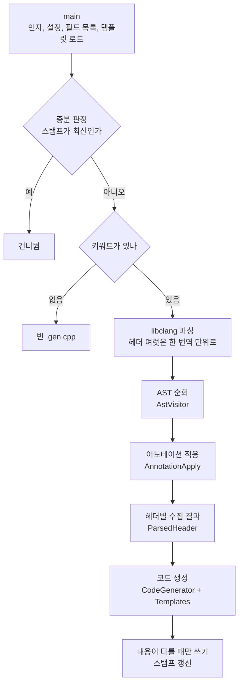

# ReflectionParser — 리플렉션 코드 생성기

> **[🏠 위키 홈으로 돌아가기](../../README.md)** | **[📖 문서 지도](../../docs/02_DocumentMap.md)**

## 이것은 무엇이고 왜 있나

ReflectionParser 는 빌드 중에 실행되는 콘솔 도구입니다. 엔진과 게임 헤더를 libclang 으로 파싱하고, `REFLECT`, `PROPERTY`, `FUNCTION`, `ENUM` 표시가 달린 선언을 찾아
타입 설명을 등록하는 C++ 소스(`*.gen.cpp`, `*.gen.h`)를 생성합니다. 언리얼의 UnrealHeaderTool 에 해당합니다.

씬 로드, 에디터 인스펙터, 핫 리로드, `addComponentByName` 이 모두 이 도구가 만든 등록 코드에 의존합니다. 그래서 ReflectionParser 는 Engine 보다 먼저 빌드됩니다.
생성기가 Engine.dll 을 링크하면 "Engine 을 빌드하려면 생성기가 필요하고, 생성기를 빌드하려면 Engine 이 필요한" 순환이 생기므로, 생성기는 `Core` 만 링크합니다.

리플렉션 전체에서 이 도구가 맡는 부분은 [Reflection 의 머릿속 그림](../../Source/Engine/Reflection/README.md#머릿속-그림)에 있습니다.
이 문서는 그 그림의 빌드 시점 절반, 즉 헤더가 `.gen.cpp` 가 되기까지를 설명합니다. 헤더에 표시를 다는 방법은 Reflection 문서를 보세요.

## 머릿속 그림


```mermaid
flowchart TD
  CLI["main<br/>인자, 설정, 필드 목록, 템플릿 로드"] --> Fresh{"증분 판정<br/>스탬프가 최신인가"}
  Fresh -->|예| Skip[건너뜀]
  Fresh -->|아니오| Scan{"키워드가 있나"}
  Scan -->|없음| Empty["빈 .gen.cpp"]
  Scan -->|있음| Clang["libclang 파싱<br/>헤더 여럿은 한 번역 단위로"]
  Clang --> Visit["AST 순회<br/>AstVisitor"]
  Visit --> Apply["어노테이션 적용<br/>AnnotationApply"]
  Apply --> DTO["헤더별 수집 결과<br/>ParsedHeader"]
  DTO --> Emit["코드 생성<br/>CodeGenerator + Templates"]
  Emit --> Write["내용이 다를 때만 쓰기<br/>스탬프 갱신"]
```

**스탬프.** 산출물마다 `<이름>.gen.cpp.stamp` 파일이 있습니다. 생성에 성공할 때마다 새로 쓰고, 다음 실행은 이 파일의 시각으로 다시 만들지 판단합니다.
산출물 자체의 시각은 쓰지 않습니다. 내용이 같으면 산출물을 다시 쓰지 않기 때문입니다(아래 "증분 판정").

**수집 결과(DTO).** AST 를 순회한 결과는 헤더 하나마다 `ParsedHeader` 에 모입니다. 타입, 프로퍼티, 함수, 이벤트, 열거형이 들어 있고, 구조는 `ParsedReflection.h` 에만 있습니다.
코드 생성기는 이 구조만 읽고 libclang 을 모릅니다.

**어노테이션 필드 목록.** `PROPERTY( Min = 0 )` 의 `Min` 같은 토큰 하나는 `PredefinedAnnotationField.xxx` 의 한 줄입니다.
그 한 줄이 토큰을 DTO 에 넣는 방법, `.gen.cpp` 에 쓰는 방법, 검증을 모두 정합니다. 적용 루프와 출력 코드가 같은 목록을 돌기 때문에 손으로 나열한 필드 목록은 없습니다.

**철자 목록.** `Source/Core/Predefined/AnnotationMeta.txt` 는 토큰의 철자를 필드에 연결합니다. 예를 들어 `flag.ReadOnly = ReadOnly, readOnly` 한 줄이 두 철자를 같은 필드로 받습니다.
이 파일에 없는 토큰을 만나면 생성기는 그 헤더의 생성을 실패로 처리합니다.

## 따라 해 보기 — 생성기가 무엇을 읽었는지 보기

"이 프로퍼티가 왜 인스펙터에 안 나오지?" 같은 질문은 생성기가 헤더에서 무엇을 읽었는지부터 보면 대부분 풀립니다.
빌드가 넘기는 인자 그대로 헤더 하나만 넘기고 `--dump` 를 붙입니다. 저장소 루트에서 실행합니다.

### 생성기가 무엇을 읽었는지 보기

```bash
build/Ninja-Debug/BuildTools/ReflectionParser.exe --dump --input Source/Engine/Object/Component/CameraComponent.h \
  --output <임시 폴더> --include Source --annotation-meta Source/Core/Predefined/AnnotationMeta.txt \
  --builtins Source/Engine/Reflection/ReflectBuiltins.xxx --emit-templates Tools/ReflectionParser/Templates
```

`--dump` 는 스탬프가 최신이어도 다시 파싱하고, 헤더마다 읽은 내용을 표준 출력에 찍습니다. 2초쯤 걸리고, 출력은 이렇게 생겼습니다.

```text
== Source/Engine/Object/Component/CameraComponent.h
REFLECT sw::CameraComponent : sw::SceneComponent  [component factory]
  PROPERTY _fovY : float32  Min=0.100000  Max=3.140000  Units=rad
  PROPERTY _nearZ : float32  Min=0.010000  Max=1000.000000  Units=m
  ...
  FUNCTION $ctor() -> void  [constructor]
ENUM sw::CameraRole : unsigned char
  Game = 0
  Editor = 1
```

- `[component factory]` 가 붙으면 생성 코드가 `TypeInfo::_addComponent` 를 채웁니다. 이 표시가 없으면 이름으로 그 컴포넌트를 만들 수 없습니다.
- 프로퍼티가 목록에 없으면 `PROPERTY()` 가 빠졌거나, 생성기가 다른 선언에 붙은 것으로 읽은 것입니다.
- 범위와 단위가 기대와 다르면 토큰 철자를 `AnnotationMeta.txt` 와 비교합니다.

출력 폴더에는 실제 `.gen.cpp`, `.gen.h`, 스탬프도 생깁니다. 빌드가 쓰는 생성 폴더가 아니라 임시 폴더를 주는 것은 그 때문입니다.

인자 목록은 `--help` 가 보여 줍니다. 인자를 잘못 주어도 같은 사용법이 나옵니다.

| 인자 | 뜻 |
|---|---|
| `--input <header.h>` | 파싱할 헤더. 여러 번 줄 수 있습니다 |
| `--output <dir>` | `.gen.cpp`, `.gen.h`, 스탬프를 쓸 폴더. 필수입니다 |
| `--include <dir>` | clang include 경로. 여러 번 줄 수 있습니다 |
| `--builtins <ReflectBuiltins.xxx>` | 빌트인 타입 목록. 없으면 경고만 합니다 |
| `--annotation-meta <AnnotationMeta.txt>` | 토큰 철자 목록. 필수입니다 |
| `--emit-templates <dir>` | `Templates/*.tpl` 폴더. 필수입니다 |
| `--source-root <dir>` | 모듈 판별에 쓸 상대 경로의 기준 |
| `--emit-builtins-gen <file.cpp>` | `ReflectBuiltins.gen.cpp` 만 쓰고 끝냅니다 |
| `--depfile <file.d>` | 입력이 include 한 헤더를 Makefile 형식 의존 파일로 씁니다 |
| `--dump` | 최신이어도 다시 파싱하고 읽은 내용을 찍습니다 |
| `--help`, `-h` | 사용법을 찍고 0 으로 끝납니다 |

`--annotation-meta` 가 없으면 모든 토큰이 "모르는 토큰"이 되므로 필수입니다. 인자 정의는 `ParserOptions.cpp` 의 `kArrOptionRow` 와 `kArrSwitchRow` 에 있고, 사용법도 거기서 만듭니다.

## 작동 원리

### 빌드에 들어가는 방법

CMake 의 `sw_addReflectionStep`(`cmake/Engine/ReflectionCodeGen.cmake`)이 타깃마다 생성 단계를 만듭니다.

1. 구성 단계에서 타깃 폴더의 헤더 가운데 `REFLECT(`, `ENUM(`, `REFLECT_CONTAINER(` 로 시작하는 줄이 있는 것을 모읍니다.
2. 빌드 단계에서 그 헤더 목록으로 ReflectionParser 를 한 번 실행합니다. 생성기가 쓴 의존 파일(`<출력>/ReflectionParser.d`)을 `DEPFILE` 로 받으므로, 리플렉션 대상이 아닌 헤더가 바뀌어도 이 단계가 다시 실행됩니다.
3. 생성된 `.gen.cpp` 를 그 타깃의 소스에 넣어 컴파일합니다.

LLVM 이 없으면 ReflectionParser 타깃이 만들어지지 않습니다. 이때 `SW_REQUIRE_REFLECTION=ON`(기본값)이면 구성이 실패하고, `OFF` 면 경고만 하고 생성 단계를 건너뜁니다.
LLVM 은 `py -3 Scripts/setup/SetupEnvironment.py` 가 설치합니다.

### 증분 판정

생성기는 입력 헤더마다 다시 만들지 판단합니다(`GeneratedFiles.cpp` 의 `IncrementalCheck`). 다음 조건이 모두 맞으면 건너뜁니다.

- 스탬프의 시각이 입력 헤더, 그 헤더가 include 한 프로젝트 헤더, 생성기 실행 파일, 빌트인 목록, 철자 목록, 템플릿, 설정 파일보다 새롭습니다.
- 스탬프에 적힌 원본 경로가 지금 입력과 같습니다. 헤더를 다른 폴더로 옮기면 이 조건이 깨져서 다시 만듭니다.

스탬프에는 원본 경로, `input <읽기 전 시각>`, 그리고 include 한 헤더마다 `dep <시각> <경로>` 줄이 들어 있습니다.
산출물은 내용이 같으면 다시 쓰지 않습니다. 다시 쓰면 그 파일을 include 하는 번역 단위가 모두 다시 컴파일되기 때문입니다.
그래서 산출물의 시각은 "마지막으로 생성한 시각"이 아니고, 다시 만들었는지는 스탬프로 봅니다.

### 헤더 여럿을 한 번역 단위로 묶기

파싱할 헤더가 둘 이상이면 하나의 번역 단위로 묶어 한 번에 파싱합니다(`ReflectionPipeline::parseBatch`).
파싱 시간의 대부분은 헤더 자신이 아니라 공통 include 에 들기 때문입니다.
한 측정에서 강제 include 하는 `Core/CoreMinimal.h` 하나가 0.52초, Windows 와 D3D 헤더를 포함한 엔진 공통 헤더까지 1.0초였고, Engine 의 입력 27개를 한 번역 단위로 묶어도 1.04초였습니다.

묶은 번역 단위는 입력들을 차례로 `#include` 하는 가상 파일(`ReflectionParser.batch.cpp`)이고, 디스크에 쓰지 않고 libclang 에 메모리로 넘깁니다.
선언은 그 선언이 적힌 파일의 것으로 셉니다. 매크로로 만든 선언이면 매크로가 전개된 위치의 파일입니다(`AstVisitor::findTargetIndex`).

- 한 헤더에 **어노테이션 오류**가 있으면 그 헤더만 실패하고, 나머지 헤더는 생성됩니다.
- 한 헤더에 **C++ 오류**가 있어 배치 전체가 파싱되지 않으면, 헤더마다 따로 병렬로 다시 파싱해 어느 헤더의 오류인지 알려 줍니다.
- 헤더가 하나면 묶지 않고 그 헤더를 주 파일로 파싱합니다.

### AST 순회

`AstVisitor.cpp` 는 주석으로 일곱 부분(A~G)으로 나뉘어 있습니다. 순회 자체는 파일당 몇 ms 이고, 시간은 대부분 파싱에 듭니다.

| 부분 | 내용 |
|---|---|
| A | libclang 문자열과 전체 이름(FQN) |
| B | 애노테이션 찾기 |
| C | 컨테이너 타입 트리(중첩된 Vector, Map) |
| D | 리플렉션 타입의 멤버(부모, 프로퍼티, 함수, 생성자, `REFLECT_BODY` 표시) |
| E | 컴포넌트 판별과 열거자 |
| F | 선언 검증(리플렉션 타입 밖에 붙은 표시) |
| G | 순회 진입점 |

애노테이션은 선언의 자식 속성(`AnnotateAttr`)에서 읽는 것이 기본이고, 그것이 없을 때만 소스 글자를 거꾸로 훑어 찾습니다.
이때 `//` 와 `/* */` 주석 안의 글자는 건너뜁니다(`rfindOutsideComments`). 그래서 헤더 주석에 `REFLECT()` 같은 예시를 적어도 생성기가 실제 표시로 읽지 않습니다.
토큰 글자를 필드에 넣는 일은 순회가 아니라 `AnnotationApply` 와 `AnnotationFields` 가 합니다.

### 타입에 남지 않는 정보는 소스 토큰에서 읽기

libclang 의 타입 정보에 없는 것은 소스 토큰에서 직접 읽습니다.

**기본 인자.** 함수 인자 커서 범위의 토큰에서, 괄호 밖의 첫 `=` 뒤를 C++ 글자 그대로 읽어 `FunctionParameterInfo::_defaultValue` 에 넣습니다. 실행 중에 이 글자를 인자 타입으로 변환합니다.
범위의 시작이 애노테이션 매크로 안이면 위치가 매크로 정의 쪽을 가리켜 토큰이 나오지 않습니다. 그래서 범위의 양 끝을 매크로가 전개된 위치로 옮겨 읽습니다.

**C 고정 배열.** 필드 타입이 `CXType_ConstantArray`(`int32 _arr[4]`)면 `std::array` 와 같은 고정 길이 시퀀스(`ArrayWrapper`)로 모읍니다.
원소가 컨테이너인 C 배열은 오류입니다. 중첩 래퍼가 원소의 `value_type` 을 쓰는데 C 배열에는 그것이 없기 때문입니다.

**이벤트.** `PROPERTY()` 가 달린 필드의 정규 타입이 `sw::MulticastDelegate<` 로 시작하면 프로퍼티가 아니라 이벤트(`ParsedEventInfo`)로 모읍니다.
인자 타입은 정규 타입이 아니라 적힌 형태의 템플릿 인자에서 꺼냅니다. 정규 타입에서 꺼내면 `string` 이 `basic_string<char>` 처럼 펼쳐지기 때문입니다.
인자 이름은 필드 선언 토큰에서 읽고, `using X = MulticastDelegate<…>` 같은 별칭이면 그 별칭 선언에서 읽습니다.
생성 코드는 오프셋, 이름, 인자 목록만 적고, 연결하고 부르는 코드는 `ReflectEventOpsOf<decltype(필드)>` 템플릿이 만듭니다.

### 생성되는 것

헤더 `MeshComponent.h` 가 리플렉션 대상이면 다음 파일이 생깁니다.

- `MeshComponent.gen.cpp` — 타입마다 `Registrar<T>`. 프로퍼티의 이름, 위치, 메타데이터를 담은 `TypeInfo` 를 만들어 등록합니다. `REFLECT_BODY()` 가 있으면 `StaticType()` 정의도 들어 있습니다.
- `MeshComponent.gen.h` — 그 헤더의 `ENUM( Flags )` 열거형을 전방 선언하고 `IsBitFlagEnum` 을 특수화합니다. 비트 플래그가 없으면 머리글만 있습니다.
- `MeshComponent.gen.cpp.stamp` — 증분 판정용 스탬프입니다.
- `FlagOps.gen.h` — 타깃마다 하나. 그 타깃의 `.gen.h` 를 모은 헤더로, 그 타깃의 모든 소스에 강제 include 됩니다.

`FlagOps.gen.h` 는 모든 소스에 들어가므로 원본 헤더를 include 하지 않습니다. 원본을 include 하면 그 헤더가 끌어오는 이름이 모든 소스에 이미 있게 되어, 다른 헤더의 include 누락이 가려집니다.
비트 연산자 자체는 생성하지 않고 `Core/Common/EnumUtil.h` 의 제네릭 연산자를 씁니다.

### 설정 파일

clang 인자, SDK 상대 경로, 출력 확장자, 조정값은 `Config/Environment/parser_config.defaults.json` 한 곳에 있습니다.
로컬의 `parser_config.json` 은 `SetupEnvironment.py` 가 기본값과 합쳐 갱신하며, 기계마다 다른 키(`paths.*`, `parser_args.extra`, `parser_args.force_include`)만 받습니다.

| 키 | 내용 |
|---|---|
| `parser_args.default` | 공통 clang 인자. `-D__REFLECT_PARSER__` 와 어노테이션 매크로 정의가 여기 있습니다 |
| `parser_args.platform.*` | OS 별 추가 인자. Windows 는 MS 호환 플래그 |
| `parser_args.extra` | 공통 추가 인자 |
| `parser_args.force_include` | clang `-include` 로 먼저 넣을 헤더. 기본값은 `Core/CoreMinimal.h` |
| `paths` | LLVM, MSVC, Windows SDK 상대 경로 |
| `clang_flags` | `-I`, `-isystem`, `-resource-dir` 같은 플래그 철자 |
| `emit` | 출력 확장자, 머리글, 생성 네임스페이스 |
| `tuning` | `source_lookback_bytes` 같은 조정값 |

LLVM 과 MSVC 의 절대 경로는 `Config/Environment/toolchain_config.json` 에 있고, 이것도 `SetupEnvironment.py` 가 씁니다.

타깃 매크로(`SW_PLATFORM_*`, `SW_X64`, `SW_ARM64`, `SW_COMPILER_CLANG`)는 설정 파일에 적지 않습니다. 생성기가 자기를 빌드할 때의 매크로를 그대로 넘깁니다(`ParserConfig::load`).
libclang 은 기본 타깃, 즉 생성기를 빌드한 기계로 헤더를 읽으므로 두 값이 같습니다. `Core/Common/TargetMacroCheck.h` 가 그 매크로를 libclang 의 내장 매크로와 비교합니다.

매크로 이름, 인자 철자, 템플릿 이름, `RegisterType` 표시처럼 설정 파일이 아니라 C++ 에 남는 이름은 `ParserDefines.h` 에 있습니다.

## 확장하는 법

### 새 어노테이션 필드 추가하기

`PROPERTY( MyFlag )` 같은 토큰을 새로 받으려면 네 곳을 고칩니다.

1. `PredefinedAnnotationField.xxx` 에 한 줄을 추가합니다. 값을 멤버에 그대로 넣으면 `REGISTER_ANNOTATION_FIELD( Property, ReadOnly, _bReadOnly, Runtime )` 형태이고,
   함수로 변환해 넣으면 `REGISTER_ANNOTATION_FIELD_FN( Property, AssetType, _assetType, applyAssetType, Runtime )` 형태입니다.
   마지막 열은 출력 위치입니다. `Editor` 는 생성 코드의 `#if !defined( SW_SHIPPING )` 안에, `Runtime` 은 그 밖에 쓰고, `Manual` 은 코드 생성기가 손으로 씁니다.
2. `ParsedReflection.h` 의 DTO 에 멤버를 추가합니다. 멤버 타입이 값의 종류를 정합니다. `uint8` 비트필드는 bool, 그 밖에 `string`, `float32`, `FunctionNetRole` 이 있습니다.
3. 출력 위치가 `Editor` 나 `Runtime` 이면 엔진 메타데이터(`Source/Engine/Reflection/ReflectionTypes.h`)에 **같은 이름**의 멤버를 추가합니다.
4. `Source/Core/Predefined/AnnotationMeta.txt` 에 철자를 추가합니다. 예: `flag.MyFlag = MyFlag, myFlag`.

2번과 4번이 1번과 맞지 않으면 생성기가 시작할 때 멈춥니다(`AnnotationFields::validateBindings`).
철자는 있는데 필드 줄이 없거나, 필드 줄은 있는데 철자가 없거나, 종류와 멤버 타입이 다른 경우입니다. 이미 있는 필드에 다른 철자만 더 받으려면 4번만 고칩니다.

`AnnotationMeta.txt` 의 `flag.X` 한 줄은 단독 토큰 `X` 와 `X = true` 를 함께 등록합니다. 두 형태를 따로 적지 않습니다.

### 출력 형식 바꾸기

생성 코드의 골격은 `Templates/*.tpl` 에 있고, 그 사이를 `CodeGenerator.cpp` 가 채웁니다. 출력 형식을 바꿀 때는 C++ 보다 템플릿을 먼저 봅니다.

| 템플릿 | 내용 |
|---|---|
| `FileHeader.tpl` | 생성 파일 머리글 |
| `ReflectTypeTraits.tpl` | 타입 특성 |
| `TypeInfoAccessors.tpl` | `StaticType()` 과 접근자 |
| `TypeRegistrarBegin.tpl`, `TypeRegistrarEnd.tpl` | 타입 등록 블록 |
| `EnumRegistrarBegin.tpl`, `EnumRegistrarEnd.tpl` | 열거형 등록 블록 |
| `Builtin*.tpl` | `ReflectBuiltins.gen.cpp` |

생성기를 고쳤으면 고치기 전과 후의 생성기로 같은 입력의 산출물을 모두 만들어 비교합니다. 아래 "함정과 주의"의 마지막 항목을 보세요.

## 함정과 주의

**생성 파일을 손으로 고치지 마세요.** 다음 실행에서 덮어씁니다. 헤더의 표시, `Templates/`, `AnnotationMeta.txt`, `PredefinedAnnotationField.xxx` 중 하나를 고칩니다.

**모듈 판별 규칙은 `--source-root` 기준 상대 경로로 맞추세요.** `parser_config` 의 `parsing.module_rules` 와 `default_module` 을 절대 경로로 맞추면 상위 폴더 이름에 걸려 다른 모듈로 분류됩니다.

**`REFLECT_BODY()` 안에 주석을 넣지 마세요.** 매크로 본문의 주석 줄에 줄 이음(`\`)이 빠지면 전처리가 깨집니다.

**생성기에게 메모리 레이아웃을 재게 하지 마세요.** 생성기의 clang 인자에는 `SW_DEBUG` 와 `_DEBUG` 가 없어서, Debug 빌드의 레이아웃을 모릅니다.
그래서 비트필드의 위치는 실행 중에 `PropertyInfo::resolveBitField` 가 찾습니다. 범위는 위쪽과 아래쪽을 따로 기록합니다(`_bHasMinRange`, `_bHasMaxRange`).

**모르는 토큰은 빌드를 멈춥니다.** `PROPERTY( Color )` 처럼 철자 목록에 없는 토큰이 있으면 그 헤더의 생성이 실패합니다.
에디터 힌트는 `Meta = "Color"` 로 적고, 단위는 `Units = m` 으로 적습니다. 목록에 있는 단위를 `Meta = "Units=m"` 으로 적으면 철자 검사를 건너뛰게 되므로 거절합니다.
따옴표 없는 값에 공백이 들어가도(`Units = m / s`) 거절합니다. 따옴표 없는 값은 첫 공백에서 끝나기 때문입니다. `Units = "m/s"` 로 씁니다.

**선언이 어느 헤더의 것인지는 `findTargetIndex` 로만 판단하세요.** `clang_Location_isFromMainFile` 은 매크로 위치에 대해 늘 "아니다"라고 답하므로, 매크로로 만든 선언을 놓칩니다.

**타입 별칭과 컨테이너는 정해진 방법으로만 풀립니다.** 사용자 별칭은 `resolvePropertyAlias` 와 `getBaseClassDeclaration` 이 벗깁니다.
컨테이너 규칙은 바깥 템플릿 이름이 규칙과 **같을 때만** 맞습니다(`ContainerTypeMap.cpp`).

**`git mv` 한 헤더는 다시 만들어지지 않을 수 있습니다.** `git mv` 는 파일 시각을 바꾸지 않습니다.
그래서 증분 판정은 스탬프에 적힌 원본 경로를 지금 입력과 비교합니다. 생성 파일 머리말의 `// Source:` 줄에도 원본 경로가 있습니다.

**한 모듈 안에 같은 이름의 헤더를 두 개 두지 마세요.** 생성 파일 이름은 헤더 파일 이름만으로 정하므로 둘이 충돌하고, 생성기가 빌드를 멈춥니다.

**리눅스에서 파일 시각을 다룰 때 부호에 주의하세요.** libstdc++ 의 파일 시계에서는 지금 시각이 음수입니다. 생성기는 시각을 부호 없는 64비트로 읽습니다.

**`Bin` 폴더의 옛 생성기를 돌리지 마세요.** 실행 파일은 `build/<프리셋>/BuildTools/ReflectionParser.exe` 입니다.
테스트의 `findReflectionParserExecutable` 도 `BuildTools` 를 먼저 봅니다. `Bin` 에 남은 옛 사본을 돌린 결과는 지금 코드의 답이 아닙니다.

**Shipping 빌드의 생성기는 Info 로그를 찍지 않습니다.** 그래서 사용법과 `--dump` 결과는 로그가 아니라 표준 출력으로 씁니다.

**생성기를 고쳤으면 생성물을 바이트 단위로 비교하세요.** 고치기 전과 후의 생성기로 같은 입력의 산출물을 모두 만들고 `diff -r` 결과가 비어 있어야 합니다.
마지막으로 비교했을 때 대상은 133개 파일이었습니다(리플렉션 타깃 10개의 산출물과 `ReflectBuiltins.gen.cpp`). 테스트는 생성 코드의 모양을 일부만 보기 때문에, 바이트 비교가 가장 확실한 검증입니다.

## 더 볼 곳

- [Reflection](../../Source/Engine/Reflection/README.md) — 표시를 다는 방법과 실행 중의 타입 정보
- [Tools](../README.md) — 다른 호스트 도구
- [ARCHITECTURE.md](../../ARCHITECTURE.md) — 타깃 그래프에서 생성기의 위치

자주 여는 파일은 다음과 같습니다.

| 파일 | 내용 |
|---|---|
| `ReflectionParser.cpp` | `main`. 인자, 설정, 목록, 템플릿을 읽고 파이프라인을 실행 |
| `ReflectionPipeline.cpp` | 입력 목록에서 산출물까지의 흐름, 배치 파싱, 병렬 처리 |
| `GeneratedFiles.cpp` | 산출물 경로, 쓰기, 스탬프, 증분 판정 |
| `AstVisitor.cpp` | AST 순회 |
| `AnnotationApply.cpp`, `AnnotationFields.cpp` | 토큰을 DTO 에 넣기, 필드 목록 전개 |
| `ParsedReflection.h` | 수집 결과 구조 |
| `CodeGenerator.cpp` | DTO 를 `.gen.cpp` 글자로 |
| `PredefinedAnnotationField.xxx` | 어노테이션 필드 목록 |
| `ParserOptions.cpp` | 명령줄 인자 정의 |
| `cmake/Engine/ReflectionCodeGen.cmake` | CMake 연동 |
