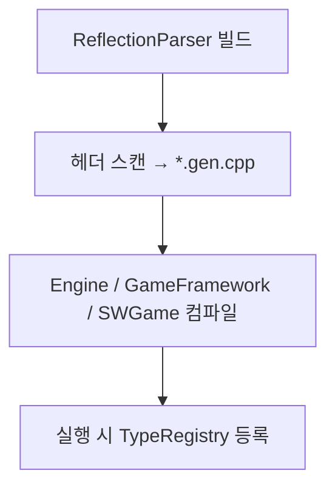
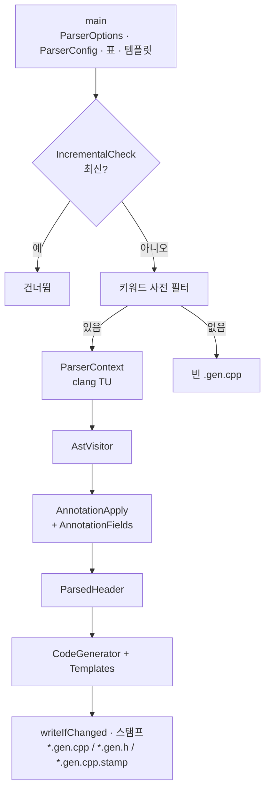

# ReflectionParser (리플렉션 파서)

> **[🏠 위키 홈으로 돌아가기](../../README.md)** | **[📖 서브시스템 목록](../../docs/02_EngineSubsystems.md)**

엔진/게임 헤더의 `REFLECT`, `PROPERTY`, `FUNCTION`, `ENUM` 등을 **libclang으로 파싱**해  
런타임 메타데이터 소스(`*.gen.cpp` / `*.gen.h`)를 만드는 **호스트 콘솔 도구**입니다.

경로: `Tools/ReflectionParser/`  
런타임: [Source/Engine/Reflection/README.md](../../Source/Engine/Reflection/README.md)

---

## 왜 먼저 빌드해야 하나?

씬 로드, 에디터 인스펙터, 핫리로드, `addComponentByName` 등이  
모두 **생성된 TypeInfo / Registrar** 에 의존합니다.


```mermaid
flowchart TD
  A[ReflectionParser 빌드] --> B[헤더 스캔 → *.gen.cpp]
  B --> C[Engine / GameFramework / SWGame 컴파일]
  C --> D[실행 시 TypeRegistry 등록]
```

CMake는 `ReflectionParser` 타겟이 준비된 뒤에야 `sw_addReflectionStep` 으로 gen을 돌립니다.  
(`cmake/Engine/ReflectionCodeGen.cmake`)

---

## 초심자: 어디부터 읽나?

한 헤더가 `.gen.cpp` 가 되기까지 **파일 역할**만 먼저 잡으면 됩니다.

```text
ReflectionParser.cpp   ← main: 옵션 → 설정 · 표 · 템플릿 → 파이프라인
ParserOptions.*        ← CLI (플래그 하나 = 표 한 줄, 사용법도 그 표에서)
ParserConfig.*         ← parser_config / toolchain_config (clang 인자 · 코드젠 표식 · 규칙)
ParserSession.h        ← 실행 한 번의 설정 + 표 넷. main 이 소유하고 아래로 내려 준다
ReflectionPipeline.*   ← 입력 목록 → 산출물: 증분 판정 → 키워드 거르기 → 파싱 → 코드젠 → FlagOps 우산
GeneratedFiles.*       ← 산출물 경로 · 내용이 다를 때만 쓰기 · 스탬프 · 증분 판정
ParserContext.*        ← libclang TranslationUnit 수명
AstVisitor.*           ← libclang 커서 순회 → 헤더 단위 DTO (섹션 A~G)
ParsedReflection.h     ← “무엇을 수집했는지” DTO만
AnnotationApply.*      ← REFLECT/PROPERTY 문자열 → DTO 필드 (필드 표를 도는 루프 하나)
AnnotationFields.*     ← 필드 표: PredefinedAnnotationField.xxx 한 줄 = 적용 · 코드젠 · 검증
CodeGenerator.*        ← DTO + Templates/*.tpl → .gen.cpp / .gen.h **텍스트** (파일은 파이프라인이 쓴다)
ParserDefines.h        ← 매크로/CLI/tpl 이름 계약 (JSON이 아님)
```

| 궁금한 것 | 열 파일 |
|-----------|---------|
| CLI 플래그 | `ParserOptions.cpp` 의 `kArrOptionRow` |
| 최신 판정 · 무엇을 다시 만드나 | `GeneratedFiles.cpp` (`IncrementalCheck`) |
| 흐름 · 병렬 | `ReflectionPipeline.cpp` |
| 수집 구조체 멤버 | `ParsedReflection.h` |
| `Alias=` 토큰이 어디에 붙나 | `PredefinedAnnotationField.xxx`(필드 표) + `AnnotationMeta.txt`(철자) |
| AST에서 클래스·필드를 어떻게 찾나 | `AstVisitor.cpp` (A~G) |
| 생성 코드 모양 | `CodeGenerator.cpp` + `Templates/` |
| clang `-DREFLECT...` 인자 | `Config/Environment/parser_config.defaults.json` |

**새 애노테이션 필드 추가 — 필드 하나는 `PredefinedAnnotationField.xxx` 의 **한 줄**이다.**
그 줄이 적용(토큰 → DTO) · 코드젠(DTO → `.gen.cpp`) · 검증을 모두 정한다. 적용 루프(`AnnotationApply`)와
출력(`CodeGenerator` → `AnnotationFields::emitMetadata`)이 같은 표를 돈다 — **손으로 나열한 필드 목록은 없다.**

```text
REGISTER_ANNOTATION_FIELD( Property, ReadOnly, _bReadOnly, Runtime )                 값을 멤버에 그대로
REGISTER_ANNOTATION_FIELD_FN( Property, AssetType, _assetType, applyAssetType, Runtime )  값을 Fn 이 넣는다
```

1. `.xxx` 한 줄 — `Emit` 이 `Editor`(`#if !defined( SW_SHIPPING )` 안) · `Runtime`(밖) · `Manual`(손으로 쓴다) 중 하나.
2. `ParsedReflection.h` 에 DTO 멤버 — **멤버 타입이 값의 종류다**(uint8 비트필드 = bool, string, float32, FunctionNetRole).
3. `Editor` · `Runtime` 이면 엔진 메타데이터에 **같은 이름**의 멤버(`ReflectionTypes.h`).
4. `Source/Core/Predefined/AnnotationMeta.txt` 에 철자(`flag.ReadOnly = ReadOnly, readOnly`).

2 와 4 가 1 과 어긋나면(철자는 있는데 줄이 없다 · 줄은 있는데 철자가 없다 · kind 와 멤버 타입이 다르다)
**파서가 시작할 때 멈춘다**(`AnnotationFields::validateBindings`). 철자를 더 받아 주기만 할 때는 4 만 고친다.

---

## 한 파일 처리 파이프라인

| 단계 | 담당 | 하는 일 |
|------|------|---------|
| 0. 최신 판정 | `IncrementalCheck` | 스탬프가 입력 · 도구보다 새롭고 원본 경로가 같으면 건너뜀 |
| 1. 키워드 스캔 | `ReflectionPipeline` | `REFLECT`/`PROPERTY`/`FUNCTION`/`ENUM` 없으면 빈 gen만 emit |
| 2. clang TU | `ParserContext` | libclang TranslationUnit 생성 |
| 3. AST 순회 | `AstVisitor` | 타입·멤버 커서 수집 (헤더 단위 `ParsedHeader`) |
| 4. 어노테이션 적용 | `AnnotationMeta` → `AnnotationApply` | 별칭 토큰 → `Parsed*` 필드 |
| 5. 코드 생성 | `CodeGenerator` + `Templates/` | `.gen.cpp` / `.gen.h` 텍스트 |
| 6. 쓰기 | `ReflectionPipeline` + `GeneratedFiles` | 이름 충돌 검사 → 내용이 다를 때만 쓰기 → 스탬프 |
| 7. 빌드 포함 | CMake `ReflectionCodeGen.cmake` | gen을 타겟에 넣어 컴파일 |


```mermaid
flowchart TD
  CLI["main<br/>ParserOptions · ParserConfig · 표 · 템플릿"] --> Fresh{IncrementalCheck<br/>최신?}
  Fresh -->|예| Skip[건너뜀]
  Fresh -->|아니오| Scan[키워드 사전 필터]
  Scan -->|있음| Clang[ParserContext<br/>clang TU]
  Scan -->|없음| Empty[빈 .gen.cpp]
  Clang --> Visit[AstVisitor]
  Visit --> Apply[AnnotationApply<br/>+ AnnotationFields]
  Apply --> DTO[ParsedHeader]
  DTO --> Emit[CodeGenerator + Templates]
  Emit --> Write["writeIfChanged · 스탬프<br/>*.gen.cpp / *.gen.h / *.gen.cpp.stamp"]
```

**최신 판정은 스탬프로 한다** (`<이름>.gen.cpp.stamp` — CMake 의 `ReflectBuiltins.gen.cpp.stamp` 와 같은 규칙). 산출물은 내용이
같으면 다시 쓰지 않으므로(쓰면 include 하는 TU 가 다시 컴파일된다) 산출물의 시각은 "마지막 생성" 이 아니다. 스탬프는 성공한
생성마다 원본 경로를 적어 새로 쓰고, 판정은 **스탬프 시각 > 입력 · 파서 실행 파일 · builtins · 철자 표 · 템플릿 · 설정 파일**,
그리고 **스탬프에 적힌 원본 = 지금 입력**(헤더를 옮긴 경우)이다.

**파싱할 헤더가 둘 이상이면 한 번역 단위로 묶는다** (`ReflectionPipeline::parseBatch`). 파싱 비용의 거의 전부는 헤더 자신이
아니라 공통 include 다 — 강제 include(`Core/CoreMinimal.h`) 하나가 0.52 초, 엔진 공통 헤더(Windows · D3D)까지 1.0 초인데
Engine 입력 27 개를 한 TU 로 묶어도 1.04 초다. 묶음 TU 는 입력들을 차례로 `#include` 하는 가상 파일(`ReflectionParser.batch.cpp`,
디스크에 없다)이고, 선언은 **적힌(매크로면 전개된) 파일**로 헤더마다 나눈다(`AstVisitor::findTargetIndex`).

- 한 헤더의 **애노테이션 오류**는 그 헤더만 실패시킨다(오류는 헤더 단위, 순회는 계속) — 나머지 헤더는 만들어진다.
- 한 헤더의 **C++ 오류**로 묶음이 파싱되지 않으면 헤더마다 병렬로 다시 파싱해 그 헤더의 오류로 알린다(예전 경로).
- 헤더가 하나면 묶지 않는다(그 헤더가 주 파일).

---

## 폴더 구조

```text
ReflectionParser/
├─ ReflectionParser.cpp          # main
├─ ParserOptions.h / .cpp        # CLI 표
├─ ParserConfig.h / .cpp         # parser_config · toolchain_config 로더
├─ ParserSession.h               # 설정 + 표 넷 (실행 한 번)
├─ ReflectionPipeline.h / .cpp   # 입력 목록 → 산출물 흐름
├─ GeneratedFiles.h / .cpp       # 산출물 경로 · 쓰기 · 스탬프 · 최신 판정
├─ ParsedReflection.h            # ParsedTypeInfo / Property / Enum / ParsedHeader
├─ AstVisitor.h / .cpp           # AST 순회 (A~G)
├─ AnnotationApply.h / .cpp      # 어노테이션 문자열 → DTO (표를 도는 루프)
├─ AnnotationFields.h / .cpp     # 필드 표 전개 · 메타데이터 코드젠 · 철자 표 대조
├─ AnnotationMeta.h / .cpp       # AnnotationMeta.txt 로더
├─ CodeGenerator.h / .cpp        # DTO → .gen.cpp / .gen.h 텍스트
├─ CodeEmit.h                    # 생성 텍스트 버퍼 헬퍼
├─ ParserContext.h / .cpp        # libclang TU 수명
├─ ParserDefines.h               # 매크로/CLI/tpl/JSON 키 계약
├─ ParserUtil.h                  # 경로·토큰 유틸
├─ EmitTemplateStore.h / .cpp    # Templates/*.tpl 캐시
├─ ReflectBuiltinsLoader.*       # ReflectBuiltins.h / .gen.cpp
├─ TypeNameMap.*                 # 스칼라 타입 별칭
├─ ContainerTypeMap.*            # Vector/Map 등 규칙
├─ PredefinedReflectAnnotation.xxx  # clang annotate 매크로 목록
├─ PredefinedAnnotationField.xxx    # 애노테이션 필드 표 (필드 하나 = 한 줄)
├─ Templates/                    # emit 골격 (.tpl)
├─ CMakeLists.txt
└─ README.md
```

관련 저장소 경로:

| 경로 | 역할 |
|------|------|
| `Source/Core/Predefined/AnnotationMeta.txt` | 어노테이션 별칭 표 |
| `Source/Core/Predefined/PredefinedAnnotationKind.xxx` | 애노테이션 종류 — `AnnotationMeta.h` 가 여기서 전개한다. 예전에 이 폴더에 같은 이름의 사본이 있었는데 아무도 include 하지 않는 죽은 파일이었다(`Scripts/lint/gate/CheckDataFileReferences.py` 가 이제 막는다) |
| `Source/Engine/Reflection/ReflectBuiltins.h` | 빌트인 타입 → `ReflectBuiltins.gen.cpp` |
| `Config/Environment/parser_config.defaults.json` | clang 인자·경로·emit·tuning |
| `Config/Environment/toolchain_config.json` | LLVM/MSVC 절대 경로 (`SetupEnvironment.py`) |

---

## AstVisitor.cpp 섹션 (초심자용)

순회 시간은 파일당 수 ms 이고(파싱은 수백 ms), 위치만 익히면 됩니다.

| 섹션 | 내용 |
|------|------|
| **A** | CXString · FQN |
| **B** | 애노테이션 찾기 — `hasAnnotation` / `readAnnotation` 한 벌. 자식 속성(AnnotateAttr)이 정본, 소스 창(lookback)은 폴백 |
| **C** | 컨테이너 타입 트리 (Vector/Map 중첩) |
| **D** | REFLECT 타입의 멤버 — 베이스 · PROPERTY · 생성자 · FUNCTION · BODY/FACTORY 마커를 한 번의 순회로 |
| **E** | 컴포넌트 판별 · 열거자 |
| **F** | 선언 검증 — REFLECT 밖의 PROPERTY · FUNCTION · REFLECT_BODY |
| **G** | `visit` / `onStructDeclaration` / `onEnumDeclaration` |

**선언은 적힌(매크로면 전개된) 파일의 것으로 센다** (`findTargetIndex`). 대상은 TU 의 주 파일 하나이거나, 여러
헤더를 한 TU 로 묶었을 때의 그 헤더들이다. 결과는 헤더 단위(`ParsedHeader`)로 나온다.
애노테이션 **문자열 해석·필드 대입**은 여기 있지 않고 `AnnotationApply` · `AnnotationFields` 입니다.

---

## 생성되는 것

헤더 `MonsterComponent.h` 가 리플렉션 대상이면 대략:

```text
…/MonsterComponent.gen.cpp
  - TypeInfo (프로퍼티 이름, 오프셋, 플래그)
  - StaticType() 정의 (REFLECT_BODY 시)
  - TypeRegistrar / EnumRegistrar
  - Component면 ComponentFactoryRegistrar (자동 팩토리 등록)
…/MonsterComponent.gen.h   (필요 시 enum 비트 연산자 등)
…/FlagOps.gen.h            (ENUM(Flags) 비트 연산자 우산)
```

**손으로 gen을 고치지 마세요.** 다음 파서 실행에 덮어씁니다.  
고칠 곳: 헤더 매크로 / `Templates/` / `AnnotationMeta.txt` / `PredefinedAnnotationField.xxx`.

---

## parser_config.defaults.json

clang 인자·SDK 상대경로·emit 확장자·튜닝의 **단일 소스**입니다.  
로컬 `parser_config.json` 은 `SetupEnvironment.py`가 defaults와 병합해 갱신합니다.

| 섹션 | 내용 |
|------|------|
| `parser_args.default` | 공통 clang 인자 (`-std`, `-D__REFLECT_PARSER__` …) |
| `parser_args.platform.*` | OS별 추가 (windows MS 호환 등) |
| `parser_args.extra` | 공통 추가 (예: `-fno-spell-checking`) |
| `parser_args.force_include` | clang `-include` 선포함 (엔진 PCH와 같은 전제. 기본 `Core/CoreMinimal.h`) |
| `paths` | LLVM/MSVC/WinSDK 상대 경로 |
| `clang_flags` | `-I` / `-isystem` / `-resource-dir` |
| `emit` | `.gen.cpp` 확장자·배너·generated 네임스페이스 |
| `tuning` | `source_lookback_bytes` 등 |

**C++에 남는 계약** (`ParserDefines.h`): 매크로 이름, CLI 플래그, tpl stem, `RegisterType` 마커.  

### CLI (CMake가 보통 넘김)

정본은 `ParserOptions.cpp` 의 `kArrOptionRow` 다 — 플래그 하나가 한 줄이고, 인자를 잘못 주면 그 표에서 만든 사용법이 찍힌다.

| 인자 | 의미 |
|------|------|
| `--input <file>` | 파싱할 헤더 (여러 번 가능) |
| `--output <dir>` | `.gen.cpp` · `.gen.h` · 스탬프 출력 디렉터리 (필수) |
| `--include <path>` | clang include path (여러 번 가능) |
| `--builtins <ReflectBuiltins.xxx>` | 빌트인 타입 표 (없으면 경고만) |
| `--annotation-meta <AnnotationMeta.txt>` | 어노테이션 철자 표 (필수 — 없으면 모든 토큰이 "모르는 토큰" 이 된다) |
| `--emit-templates <Templates dir>` | tpl 폴더 (필수) |
| `--source-root <dir>` | 모듈 판별을 이 경로 기준 상대 경로로 |
| `--emit-builtins-gen <path>` | builtins 전용 gen 모드 (`--builtins` · `--emit-templates` 와 함께) |
| `--dump` | 최신이어도 다시 파싱하고, 헤더마다 **무엇을 뽑았는지** 찍는다(타입 · 부모 · 팩토리, 프로퍼티의 타입 · 값 자리 · 컨테이너 · 범위 · 플래그, 함수, enum 값) |
| `--help` · `-h` | 사용법만 찍고 0 으로 끝난다 |

**"왜 이 프로퍼티가 인스펙터에 없지?" 는 `--dump` 로 먼저 본다.** 빌드가 넘기는 인자 그대로 헤더 하나만 주면 된다:

```bash
build/Ninja-Debug/BuildTools/ReflectionParser.exe --dump --input Source/Engine/Object/Component/CameraComponent.h \
  --output <임시 폴더> --include Source --annotation-meta Source/Core/Predefined/AnnotationMeta.txt \
  --builtins Source/Engine/Reflection/ReflectBuiltins.xxx --emit-templates Tools/ReflectionParser/Templates
```

로컬에서 직접 돌릴 일은 드물고, 보통:

```bash
cmake --build --preset Ninja-Debug
```

LLVM이 없으면 파서 타겟이 스킵될 수 있습니다.  
환경: `python Scripts/setup/SetupEnvironment.py`  
강제: `-DSW_REQUIRE_REFLECTION=ON|OFF`

---

## Templates (emit 조각)

| 템플릿 | 역할 |
|--------|------|
| `FileHeader.tpl` | gen 머리글 |
| `ReflectTypeTraits.tpl` | 타입 traits |
| `TypeInfoAccessors.tpl` | StaticType / 접근자 |
| `TypeRegistrarBegin/End.tpl` | 타입 등록 블록 |
| `EnumRegistrarBegin/End.tpl` | enum 등록 |
| `ComponentFactoryRegistrar.tpl` | 이름 → emplace 팩토리 |
| `Builtin*.tpl` | ReflectBuiltins.gen.cpp |

출력 형식을 바꿀 때는 C++보다 **tpl + CodeGenerator** 를 먼저 보는 편이 안전합니다.

---

## 헤더만 건드릴 때 체크리스트

1. `REFLECT` + 필요 시 `REFLECT_BODY()`  
2. 노출 멤버에 `PROPERTY()` / `FUNCTION()` / `ENUM()`  
3. 빌드 후 해당 타겟 ReflectionGen 재실행 확인  
4. `StaticType` 링크 오류 → BODY 누락 또는 gen 미포함  
5. 직렬화에 필드 없음 → PROPERTY 누락  

매크로 예: [Reflection README](../../Source/Engine/Reflection/README.md).

---

## 의존성 · 링크

- **libclang** (LLVM) — AST  
- **Core** STATIC만 링크 (Engine.dll 순환 방지)

ARCHITECTURE의 “ReflectionParser는 Core만 링크” 규칙과 같습니다.

---

## 강력한 주석 처리 (Robust Comment Handling)

`ReflectionParser`는 매크로 스캔 과정에서 **C/C++ 스타일의 주석(`//`, `/* */`) 내부에 작성된 문자열을 완벽하게 무시**합니다 (`rfindOutsideComments` 알고리즘).
따라서 다음과 같이 주석 안에 예제 코드를 작성해도 파서가 이를 실제 매크로로 오인식하지 않습니다.

```cpp
/**
 * @brief 예제: REFLECT() 나 PROPERTY() 를 주석에 적어도
 *        ReflectionParser는 이를 투명하게 무시합니다!
 */
REFLECT()
struct MyComponent : public Component
```
주석 내부의 텍스트가 파싱을 방해하지 않으므로, 개발자는 런타임 버그나 빌드 실패 걱정 없이 자유롭게 문서화를 진행할 수 있습니다.

---

## 자주 하는 실수

| 실수 | 결과 | 올바른 방법 |
|------|------|-------------|
| gen 수동 편집 | 다음 빌드에 소실 | 헤더 / tpl / AnnotationMeta / PredefinedAnnotationField.xxx |
| REFLECT 없는 헤더만 기대 | gen 안 생김 | 매크로 추가 또는 CMake HEADERS 포함 |
| include path 부족 | clang 파싱 실패 | CMake `--include` / preset 확인 |
| `REFLECT_BODY()` 안에 주석 | 전처리 깨짐 | BODY 본문에 주석 금지 |
| AnnotationMeta.txt 에만 철자 추가 | 파서가 시작할 때 멈춤 | `PredefinedAnnotationField.xxx` 에 필드 줄 |
| 표에 없는 토큰(`PROPERTY( Color )`) | 그 헤더의 코드젠이 멈춤 | 에디터 힌트는 `Meta = "Color"` · `Meta = "Units=m"` |

---

## 더 볼 곳

- [Source/Engine/Reflection/README.md](../../Source/Engine/Reflection/README.md) — 매크로·TypeRegistry  
- `cmake/Engine/ReflectionCodeGen.cmake` — CMake 연동  
- `Source/Core/Predefined/AnnotationMeta.txt` — 별칭  
- `Source/Engine/Reflection/ReflectBuiltins.h` — 빌트인  
- [ARCHITECTURE.md](../../ARCHITECTURE.md) — 리플렉션·직렬화 개요  
- [Tools/README.md](../README.md) — 호스트 도구 목록
