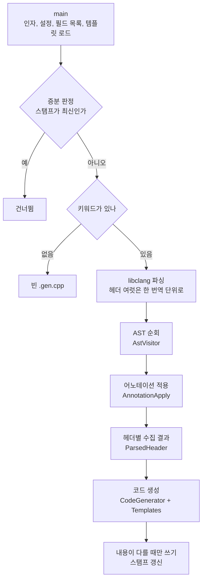

# ReflectionParser — 리플렉션 코드 생성기

> **[🏠 위키 홈으로 돌아가기](../../README.md)** | **[📖 문서 지도](../../docs/02_DocumentMap.md)**

## 이것은 무엇이고 왜 있나

빌드 중에 실행되는 콘솔 도구입니다. 엔진과 게임 헤더를 libclang 으로 파싱해 `REFLECT`, `PROPERTY`, `FUNCTION`, `ENUM` 표시가 달린 선언을 찾고
타입 설명을 등록하는 C++ 소스(`*.gen.cpp`, `*.gen.h`)를 생성합니다(언리얼의 UnrealHeaderTool 에 해당).

씬 로드, 에디터 인스펙터, 핫 리로드, `addComponentByName` 이 모두 이 등록 코드에 의존하므로 ReflectionParser 는 Engine 보다 먼저 빌드됩니다.
순환을 피하려고 생성기는 `Core` 만 링크합니다. 헤더에 표시를 다는 방법과 런타임 쪽은 `Source/Engine/Reflection/` 의 헤더 주석에 있고, 이 문서는 헤더가 `.gen.cpp` 가 되기까지를 다룹니다.

## 머릿속 그림


```mermaid
flowchart TD
  CLI["main<br/>인자, 설정, 필드 목록, 템플릿 로드"] --> Fresh{"증분 판정<br/>스탬프가 최신인가"}
  Fresh -->|예| Skip[건너뜀]
  Fresh -->|아니오| Scan{"키워드가 있나"}
  Scan -->|없음| Empty["빈 .gen.cpp"]
  Scan -->|있음| Clang["libclang 파싱<br/>헤더 여럿은 한 번역 단위로"]
  Clang --> Visit["AST 순회<br/>AstVisitor"]
  Visit --> Apply["어노테이션 적용<br/>AnnotationApply"]
  Apply --> DTO["헤더별 수집 결과<br/>ParsedHeader"]
  DTO --> Emit["코드 생성<br/>CodeGenerator + Templates"]
  Emit --> Write["내용이 다를 때만 쓰기<br/>스탬프 갱신"]
```

- **스탬프.** 산출물마다 `<이름>.gen.cpp.stamp` 가 있고, 생성에 성공할 때마다 새로 씁니다. 다음 실행은 산출물이 아니라 이 파일의 시각으로 다시 만들지 판단합니다.
- **수집 결과(DTO).** 헤더 하나마다 `ParsedHeader`(구조는 `ParsedReflection.h`)에 타입, 프로퍼티, 함수, 이벤트, 열거형이 모입니다. 코드 생성기는 이 구조만 읽고 libclang 을 모릅니다.
- **어노테이션 필드 목록.** `PROPERTY( Min = 0 )` 의 `Min` 같은 토큰 하나는 `PredefinedAnnotationField.xxx` 의 한 줄이고, 그 한 줄이 DTO 에 넣는 법, `.gen.cpp` 에 쓰는 법, 검증을 모두 정합니다. 손으로 나열한 필드 목록은 없습니다.
- **철자 목록.** `Source/Core/Predefined/AnnotationMeta.txt` 가 토큰 철자를 필드에 연결합니다(`flag.ReadOnly = ReadOnly, readOnly`). 이 파일에 없는 토큰을 만나면 그 헤더의 생성이 실패합니다.

## 따라 해 보기 — 생성기가 무엇을 읽었는지 보기

"이 프로퍼티가 왜 인스펙터에 안 나오지?" 는 생성기가 헤더에서 무엇을 읽었는지부터 보면 대부분 풀립니다. 빌드가 넘기는 인자 그대로 헤더 하나만 넘기고 `--dump` 를 붙입니다(저장소 루트에서).

### 생성기가 무엇을 읽었는지 보기

```bash
build/Ninja-Debug/BuildTools/ReflectionParser.exe --dump --input Source/Engine/Object/Component/CameraComponent.h \
  --output <임시 폴더> --include Source --annotation-meta Source/Core/Predefined/AnnotationMeta.txt \
  --builtins Source/Engine/Reflection/ReflectBuiltins.xxx --emit-templates Tools/ReflectionParser/Templates
```

`--dump` 는 스탬프가 최신이어도 다시 파싱하고 헤더마다 읽은 내용을 표준 출력에 찍습니다. 출력 폴더에 실제 `.gen.cpp` · `.gen.h` · 스탬프도 생기므로 빌드의 생성 폴더가 아니라 임시 폴더를 줍니다.

```text
== Source/Engine/Object/Component/CameraComponent.h
REFLECT sw::CameraComponent : sw::SceneComponent  [component factory]
  PROPERTY _fovY : float32  Min=0.100000  Max=3.140000  Units=rad
  ...
  FUNCTION $ctor() -> void  [constructor]
ENUM sw::CameraRole : unsigned char
  Game = 0
  ...
```

- `[component factory]` 가 붙으면 생성 코드가 `TypeInfo::_addComponent` 를 채웁니다. 없으면 이름으로 그 컴포넌트를 만들 수 없습니다.
- 프로퍼티가 목록에 없으면 `PROPERTY()` 가 빠졌거나 다른 선언에 붙은 것으로 읽은 것입니다. 범위와 단위가 기대와 다르면 토큰 철자를 `AnnotationMeta.txt` 와 비교합니다.

| 인자 | 뜻 |
|---|---|
| `--input <header.h>` | 파싱할 헤더. 여러 번 줄 수 있습니다 |
| `--output <dir>` | `.gen.cpp`, `.gen.h`, 스탬프를 쓸 폴더. 필수입니다 |
| `--include <dir>` | clang include 경로. 여러 번 줄 수 있습니다 |
| `--builtins <ReflectBuiltins.xxx>` | 빌트인 타입 목록. 없으면 경고만 합니다 |
| `--annotation-meta <AnnotationMeta.txt>` | 토큰 철자 목록. 필수입니다(없으면 모든 토큰이 "모르는 토큰") |
| `--emit-templates <dir>` | `Templates/*.tpl` 폴더. 필수입니다 |
| `--source-root <dir>` | 모듈 판별에 쓸 상대 경로의 기준 |
| `--emit-builtins-gen <file.cpp>` | `ReflectBuiltins.gen.cpp` 만 쓰고 끝냅니다 |
| `--depfile <file.d>` | 입력이 include 한 헤더를 Makefile 형식 의존 파일로 씁니다 |
| `--dump` | 최신이어도 다시 파싱하고 읽은 내용을 찍습니다 |
| `--module-local` | 대상(실행 파일, 게임 모듈)의 타입이 모듈 경계를 넘지 않습니다. 서버 버스 본문 타입의 내보내기 검사를 하지 않습니다 |
| `--help`, `-h` | 사용법을 찍고 0 으로 끝납니다 |

인자 정의는 `ParserOptions.cpp` 의 `kArrOptionRow` 와 `kArrSwitchRow` 에 있고 사용법도 거기서 만듭니다.

## 작동 원리

### 빌드에 들어가는 방법

CMake 의 `sw_addReflectionStep`(`cmake/Engine/ReflectionCodeGen.cmake`)이 타깃마다 생성 단계를 만듭니다.

1. 구성 단계에서 타깃 폴더의 헤더 가운데 `REFLECT(`, `ENUM(`, `REFLECT_CONTAINER(` 로 시작하는 줄이 있는 것을 모읍니다.
2. 빌드 단계에서 그 목록으로 ReflectionParser 를 한 번 실행합니다. 생성기가 쓴 의존 파일(`<출력>/ReflectionParser.d`)을 `DEPFILE` 로 받으므로 리플렉션 대상이 아닌 헤더가 바뀌어도 이 단계가 다시 돕니다.
3. 생성된 `.gen.cpp` 를 그 타깃의 소스에 넣어 컴파일합니다.

LLVM 이 없으면 ReflectionParser 타깃이 만들어지지 않습니다. `SW_REQUIRE_REFLECTION=ON`(기본)이면 구성이 실패하고 `OFF` 면 경고 후 생성 단계를 건너뜁니다. LLVM 은 `py -3 Scripts/setup/SetupEnvironment.py` 가 설치합니다.

### 증분 판정

`GeneratedFiles.cpp` 의 `IncrementalCheck` 가 입력 헤더마다 판단하며 다음이 모두 맞으면 건너뜁니다.

- 스탬프의 시각이 입력 헤더, 그 헤더가 include 한 프로젝트 헤더, 생성기 실행 파일, 빌트인 목록, 철자 목록, 템플릿, 설정 파일보다 새롭습니다.
- 스탬프에 적힌 원본 경로가 지금 입력과 같습니다(헤더를 옮기면 다시 만듭니다).

스탬프에는 원본 경로, `input <읽기 전 시각>`, include 한 헤더마다 `dep <시각> <경로>` 줄이 있습니다. 산출물은 내용이 같으면 다시 쓰지 않습니다(그 파일을 include 하는 TU 가 모두 다시 컴파일되기 때문). 그래서 다시 만들었는지는 산출물이 아니라 스탬프로 봅니다.

### 헤더 여럿을 한 번역 단위로 묶기

헤더가 둘 이상이면 하나의 번역 단위로 묶어 한 번에 파싱합니다(`ReflectionPipeline::parseBatch`). 파싱 시간 대부분이 헤더 자신이 아니라 공통 include 에 들기 때문입니다.
묶은 번역 단위는 입력들을 차례로 `#include` 하는 가상 파일(`ReflectionParser.batch.cpp`)이고 libclang 에 메모리로 넘깁니다. 선언은 적힌 파일의 것으로 세고, 매크로 선언은 매크로가 전개된 위치의 파일입니다(`AstVisitor::findTargetIndex`).

- 한 헤더의 **어노테이션 오류**는 그 헤더만 실패시키고 나머지는 생성됩니다.
- **C++ 오류**로 배치 전체가 파싱되지 않으면 헤더마다 따로 병렬로 다시 파싱해 어느 헤더의 오류인지 알려 줍니다.
- 헤더가 하나면 묶지 않습니다.

### AST 순회

`AstVisitor.cpp` 는 주석으로 일곱 부분(A~G: 문자열 · FQN, 애노테이션 찾기, 컨테이너 타입 트리, 멤버, 컴포넌트 · 열거자, 선언 검증, 진입점)으로 나뉩니다.
애노테이션은 선언의 `AnnotateAttr` 에서 읽는 것이 기본이고 없을 때만 소스 글자를 거꾸로 훑습니다. 이때 `//` 와 `/* */` 주석 안의 글자는 건너뜁니다(`rfindOutsideComments`) — 헤더 주석의 `REFLECT()` 예시는 표시로 읽히지 않습니다.
토큰을 필드에 넣는 일은 `AnnotationApply` 와 `AnnotationFields` 가 합니다.

### 타입에 남지 않는 정보는 소스 토큰에서 읽기

- **기본 인자.** 함수 인자 커서 범위의 토큰에서 괄호 밖 첫 `=` 뒤를 글자 그대로 `FunctionParameterInfo::_defaultValue` 에 넣고 실행 중에 인자 타입으로 변환합니다. 범위 시작이 애노테이션 매크로 안이면 토큰이 나오지 않아 범위 양 끝을 매크로 전개 위치로 옮겨 읽습니다.
- **C 고정 배열.** `CXType_ConstantArray`(`int32 _arr[4]`)는 `std::array` 와 같은 고정 길이 시퀀스(`ArrayWrapper`)로 모읍니다. 원소가 컨테이너인 C 배열은 오류입니다(중첩 래퍼가 `value_type` 을 쓰는데 C 배열에는 없다).
- **이벤트.** `PROPERTY()` 필드의 정규 타입이 `sw::MulticastDelegate<` 로 시작하면 프로퍼티가 아니라 이벤트(`ParsedEventInfo`)입니다. 인자 타입은 정규 타입이 아니라 적힌 형태의 템플릿 인자에서 꺼냅니다(`string` 이 `basic_string<char>` 로 펼쳐지지 않게).
  인자 이름은 필드 선언 토큰(별칭이면 별칭 선언)에서 읽습니다. 생성 코드는 오프셋 · 이름 · 인자 목록만 적고 연결 · 호출은 `ReflectEventOpsOf<decltype(필드)>` 가 만듭니다.

### 생성되는 것

헤더 `MeshComponent.h` 가 리플렉션 대상이면 다음이 생깁니다.

- `MeshComponent.gen.cpp` — 타입마다 `Registrar<T>`(프로퍼티의 이름 · 위치 · 메타데이터를 담은 `TypeInfo` 등록). `REFLECT_BODY()` 가 있으면 `StaticType()` 정의도 듭니다.
  고정 배치형(B) 코덱도 여기 붙습니다(`FixedCodecGenerator`): 적격 타입은 `fixedWrite` · `fixedRead` · `fixedEquals` · `computeFixedSchemaHash` 와 `info._pFixedCodec` 등록 줄이 생기고 적격이 아니면 이유만 등록합니다. 파일 끝 `// FixedSchema:` 줄이 타입마다의 정규 문자열(또는 이유)입니다.
  열거자 값이 `0..N-1` 로 빈틈없으면 이름 목록 `info._listDenseName` 과 열거자마다의 `static_assert` 가 붙고 `getEnumName` 이 이 목록을 봅니다. 목록은 `EnumInfo` 가 값으로 가집니다(모듈 정적 배열을 가리키면 핫 리로드 해제와 겹쳐 해제된 저장소를 읽는다).
- `FixedSchemas.gen.txt` — 타깃마다 하나, `// FixedSchema:` 줄을 모은 진단 파일(스키마 해시가 왜 바뀌었는지 볼 때). 빌드는 읽지 않습니다.
- `MeshComponent.gen.h` — `ENUM( Flags )` 열거형을 전방 선언하고 `IsBitFlagEnum` 을 특수화합니다. 비트 플래그가 없으면 머리글만 있습니다.
- `MeshComponent.gen.cpp.stamp` — 증분 판정용 스탬프.
- `FlagOps.gen.h` — 타깃마다 하나, 그 타깃의 `.gen.h` 를 모아 모든 소스에 강제 include 됩니다. 원본 헤더를 include 하지 않습니다(그러면 다른 헤더의 include 누락이 가려진다). 비트 연산자는 `Core/Common/EnumUtil.h` 의 제네릭을 씁니다.

### 설정 파일

clang 인자, SDK 상대 경로, 출력 확장자, 조정값은 `Config/Environment/parser_config.defaults.json` 한 곳에 있습니다. 로컬 `parser_config.json` 은 `SetupEnvironment.py` 가 기본값과 합쳐 갱신하며 기계마다 다른 키(`paths.*`, `parser_args.extra`, `parser_args.force_include`)만 받습니다.

| 키 | 내용 |
|---|---|
| `parser_args.default` | 공통 clang 인자(`-D__REFLECT_PARSER__` 와 어노테이션 매크로 정의) |
| `parser_args.platform.*` | OS 별 추가 인자(Windows 는 MS 호환 플래그) |
| `parser_args.extra` | 공통 추가 인자 |
| `parser_args.force_include` | clang `-include` 로 먼저 넣을 헤더. 기본값은 `Core/CoreMinimal.h` |
| `paths` | LLVM, MSVC, Windows SDK 상대 경로 |
| `clang_flags` | `-I`, `-isystem`, `-resource-dir` 같은 플래그 철자 |
| `emit` | 출력 확장자, 머리글, 생성 네임스페이스 |
| `tuning` | `source_lookback_bytes` 같은 조정값 |

LLVM 과 MSVC 의 절대 경로는 `Config/Environment/toolchain_config.json`(`SetupEnvironment.py` 가 씀)에 있습니다. 타깃 매크로(`SW_PLATFORM_*`, `SW_X64`, `SW_ARM64`, `SW_COMPILER_CLANG`)는 설정 파일에 적지 않고 생성기가 자기를 빌드할 때의 매크로를 넘깁니다(`ParserConfig::load`).
`Core/Common/TargetMacroCheck.h` 가 이를 libclang 의 내장 매크로와 비교합니다. 설정 파일이 아니라 C++ 에 남는 이름(매크로 이름, 인자 철자, 템플릿 이름, `RegisterType` 표시)은 `ParserDefines.h` 에 있습니다.

## 확장하는 법

### 새 어노테이션 필드 추가하기

`PROPERTY( MyFlag )` 같은 토큰을 새로 받으려면 네 곳을 고칩니다.

1. `PredefinedAnnotationField.xxx` 에 한 줄. 멤버에 그대로 넣으면 `REGISTER_ANNOTATION_FIELD( Property, ReadOnly, _bReadOnly, Runtime )`, 함수로 변환하면 `REGISTER_ANNOTATION_FIELD_FN( Property, AssetType, _assetType, applyAssetType, Runtime )`.
   마지막 열은 출력 위치입니다. `Editor` 는 생성 코드의 `#if !defined( SW_SHIPPING )` 안, `Runtime` 은 그 밖, `Manual` 은 코드 생성기가 손으로 씁니다.
2. `ParsedReflection.h` 의 DTO 에 멤버를 추가합니다. 멤버 타입이 값의 종류를 정합니다(`uint8` 비트필드는 bool, `string`, `float32`, `FunctionNetRole`, `ParsedRangeExpr`(`Min` · `Max`), `uint32`(`MaxCount`)).
3. 출력 위치가 `Editor` 나 `Runtime` 이면 `Source/Engine/Reflection/ReflectionMetadata.h` 에 **같은 이름**의 멤버를 추가합니다(생성 코드는 `p._metadata->멤버` 로 쓴다. `ReflectionTypes.h` 는 메타데이터를 상자로만 들어 키를 더해도 그 헤더를 읽는 TU 가 다시 컴파일되지 않는다).
4. `Source/Core/Predefined/AnnotationMeta.txt` 에 철자를 추가합니다(`flag.MyFlag = MyFlag, myFlag`). `flag.X` 한 줄이 단독 토큰 `X` 와 `X = true` 를 함께 등록합니다.

2 · 4번이 1번과 맞지 않으면(철자만 있음, 필드 줄만 있음, 종류와 멤버 타입 불일치) 생성기가 시작할 때 멈춥니다(`AnnotationFields::validateBindings`). 이미 있는 필드에 철자만 더 받으려면 4번만 고칩니다.
4번을 고쳤으면 `py -3 Scripts/generate/GenerateReflectionAnnotationKeys.py` 로 편집기용 키 목록도 다시 만듭니다.

### 출력 형식 바꾸기

생성 코드의 골격은 `Templates/*.tpl` 에 있고 `CodeGenerator.cpp` 가 그 사이를 채웁니다. 형식을 바꿀 때는 C++ 보다 템플릿을 먼저 봅니다(`FileHeader` · `ReflectTypeTraits` · `TypeInfoAccessors` · `TypeRegistrarBegin/End` · `EnumRegistrarBegin/End` · `Builtin*`).
생성기를 고쳤으면 아래 "함정과 주의" 마지막 항목대로 산출물을 바이트 비교합니다.

## 함정과 주의

**생성 파일을 손으로 고치지 마세요.** 다음 실행에서 덮어씁니다. 헤더의 표시, `Templates/`, `AnnotationMeta.txt`, `PredefinedAnnotationField.xxx` 중 하나를 고칩니다.

**모듈 판별 규칙은 `--source-root` 기준 상대 경로로 맞추세요.** `parser_config` 의 `parsing.module_rules` 와 `default_module` 을 절대 경로로 맞추면 상위 폴더 이름에 걸려 다른 모듈로 분류됩니다.

**설정 파일이 깨지면 파서가 멈춥니다.** `parser_config.json` · `toolchain_config.json` 을 못 읽거나 JSON 이 깨졌으면 경로와 오류를 남기고 실패합니다(`ParserConfig::load`). 기본값으로 대신 돌지 않습니다. 파일이 없는 것만 선택입니다.

**`REFLECT_BODY()` 안에 주석을 넣지 마세요.** 매크로 본문의 주석 줄에 줄 이음(`\`)이 빠지면 전처리가 깨집니다.

**생성기에게 메모리 레이아웃을 재게 하지 마세요.** 생성기의 clang 인자에는 `SW_DEBUG` 와 `_DEBUG` 가 없어 Debug 레이아웃을 모릅니다. 비트필드 위치는 실행 중에 `PropertyInfo::resolveBitField` 가 찾고, 범위는 위 · 아래를 따로 기록합니다(`_bHasMinRange`, `_bHasMaxRange`).

**`PROPERTY` 의 선언 순서는 고정 배치형 와이어 형식입니다.** B 코덱은 필드를 선언 순서로 태그 없이 씁니다. 순서 · 이름 · 범위 키를 바꾸면 스키마 해시가 바뀌어 다른 빌드의 바이트는 `SchemaMismatch` 로 거절됩니다.
`Min` · `Max` 는 B 의 와이어 범위이기도 해서 정수는 범위 비트 수로 쓰고 범위 밖 값은 쓰기가 실패합니다. 잘못 적은 키(범위 필드가 뒤에 있음, float32 로 정확히 못 나타내는 정수 경계, 못 찾은 범위 이름, 숫자가 아닌 필드의 `Min` · `Max`, 가변 길이가 아닌 필드의 `MaxCount`)는 헤더 경로 · 줄 · 필드와 함께 생성 오류입니다.
표 밖의 타입(포인터, `MaxCount` 없는 vector)은 오류가 아니라 코덱이 없을 뿐입니다. 명세는 [고정 배치형 코덱 계약](../../Source/Engine/Serialization/Fixed/README.md)입니다.

**같은 상한을 코드도 쓰면 `MaxCount` 에 상수 이름을 적으세요.** `PROPERTY( MaxCount = kMaxSlotCount )`, `MaxCount = LedgerConstant::kMaxAssetIDSize` 처럼 적으면 `AstVisitor::resolveMaxCountName` 이 필드가 든 타입과 바깥 범위에서 그 정수 상수를 찾습니다.
상수가 다른 헤더에 있으면 그 헤더를 include 합니다. 못 찾은 이름 · 정수가 아닌 상수 · 1 보다 작은 값은 생성 오류입니다.

**`Min` · `Max` 도 상수 이름을 받습니다.** `Min = 1, Max = RollbackSession::kMaxPrediction`, `Min = -Limit::kMaxRatio` 처럼 적으면 `AstVisitor::resolveRangeConstants` 가 같은 이름 찾기(`findNamedConstant`)로 정수 · 실수 상수를 찾아 코덱 · 정규 문자열 · 인스펙터 범위에 넣습니다.
`_` 로 시작하는 이름은 필드 이름이라 풀지 않습니다. 못 찾았거나 숫자가 아닌 상수는 생성 오류이고 `Step` 은 숫자만 받습니다.

**`REFLECT` 타입은 비가상 베이스를 하나까지만 둡니다.** 둘째 베이스나 가상 베이스는 생성 오류입니다(`AstVisitor.cpp` `collectBase`). `castTo` 는 리플렉션 부모 사슬로 파생을 판단해 `reinterpret_cast` 로 내려가므로 부모가 offset 0 에 있지 않으면 잘못된 주소가 됩니다. `REFLECT()` 없는 인터페이스 베이스도 막습니다.

**서버 버스 본문 타입은 모듈 내보내기 매크로를 답니다.** `static constexpr uint32 kBusVersion` 이 있는 `REFLECT` 타입에 dllexport · dllimport · visibility 속성이 없으면 생성 오류입니다(`validateBusBodyExport`).
다른 모듈의 `ServerBusTopic<T>` 가 `T::StaticType()` 을 부르므로 없으면 서버 키트 링크에서야 미해결 기호로 드러납니다. 파서가 매크로를 속성으로 읽도록 Windows 인자(`parser_args.platform.windows`)에 `SW_GF_IMPORTS` · `SW_KIT_IMPORTS` 를 정의합니다(리눅스는 늘 visibility).
`SW_API` 는 파서에서 비워 두므로 Engine 타입에는 이 검사가 맞지 않습니다(버스 본문 타입은 Base · 키트에만 있다).
모듈 경계를 넘지 않는 타깃은 CMake 가 `--module-local` 을 넘겨 검사하지 않습니다 — 실행 파일(`TYPE EXECUTABLE`)과 게임 모듈(`sw_addModuleLibrary` 의 `KIND game` → `sw_addReflectionStep( MODULE_LOCAL )`). 게임 모듈의 타입은 다른 모듈이 링크하지 않고 내보내는 매크로도 없습니다.

**모르는 토큰은 빌드를 멈춥니다.** `PROPERTY( Color )` 처럼 철자 목록에 없는 토큰은 그 헤더의 생성이 실패합니다. 에디터 힌트는 `Meta = "Color"`, 단위는 `Units = m` 으로 적습니다.
목록에 있는 단위를 `Meta = "Units=m"` 으로 적으면 철자 검사를 건너뛰게 되므로 거절합니다. 따옴표 없는 값은 첫 공백에서 끝나므로 공백이 든 값(`Units = m / s`)도 거절합니다 — `Units = "m/s"` 로 씁니다.

**선언이 어느 헤더의 것인지는 `findTargetIndex` 로만 판단하세요.** `clang_Location_isFromMainFile` 은 매크로 위치에 늘 "아니다"라고 답해 매크로로 만든 선언을 놓칩니다.

**타입 별칭과 컨테이너는 정해진 방법으로만 풀립니다.** 사용자 별칭은 `resolvePropertyAlias` 와 `getBaseClassDeclaration` 이 벗기고, 컨테이너 규칙은 바깥 템플릿 이름이 규칙과 **같을 때만** 맞습니다(`ContainerTypeMap.cpp`).

**`git mv` 한 헤더는 다시 만들어지지 않을 수 있습니다.** `git mv` 는 파일 시각을 바꾸지 않으므로 증분 판정이 스탬프의 원본 경로를 지금 입력과 비교합니다(생성 파일 머리말의 `// Source:` 줄에도 원본 경로가 있다).

**한 모듈 안에 같은 이름의 헤더를 두 개 두지 마세요.** 생성 파일 이름은 헤더 파일 이름만으로 정하므로 충돌하고 생성기가 빌드를 멈춥니다.

**리눅스에서 파일 시각의 부호에 주의하세요.** libstdc++ 의 파일 시계에서는 지금 시각이 음수입니다. 생성기는 시각을 부호 없는 64비트로 읽습니다.

**`Bin` 의 옛 생성기를 돌리지 마세요.** 실행 파일은 `build/<프리셋>/BuildTools/ReflectionParser.exe` 이고 테스트의 `findReflectionParserExecutable` 도 `BuildTools` 를 먼저 봅니다.

**Shipping 빌드의 생성기는 Info 로그를 찍지 않습니다.** 사용법과 `--dump` 결과는 로그가 아니라 표준 출력으로 씁니다.

**생성기를 고쳤으면 생성물을 바이트 단위로 비교하세요.** 고치기 전과 후의 생성기로 같은 입력의 산출물(리플렉션 타깃 전부와 `ReflectBuiltins.gen.cpp`)을 모두 만들어 `diff -r` 결과가 비어 있어야 합니다. 테스트는 생성 코드의 모양을 일부만 보므로 바이트 비교가 가장 확실합니다.

## 더 볼 곳

- [Tools](../README.md) — 다른 호스트 도구
- 진입점: `ReflectionParser.cpp`(main) · `ReflectionPipeline.cpp`(흐름 · 배치 · 병렬) · `GeneratedFiles.cpp`(쓰기 · 스탬프 · 증분) · `AstVisitor.cpp` · `CodeGenerator.cpp` · `ParserOptions.cpp`, 연동은 `cmake/Engine/ReflectionCodeGen.cmake`
