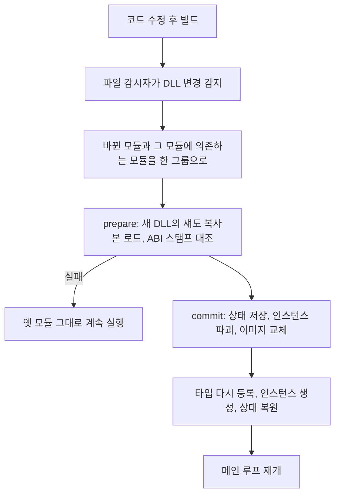

# 🔄 LiveReload & C-ABI (핫리로드 아키텍처)

개발 빌드에서는 게임을 실행한 채로 C++ 코드를 고치고 다시 빌드하면, 엔진이 바뀐 모듈 DLL을 다시 로드해 새 코드로 계속 실행합니다. 이것을 핫 리로드라고 합니다.
이 문서는 핫 리로드가 어떤 순서로 동작하는지, 실패하면 어떻게 되는지, 코드를 쓸 때 무엇을 지켜야 하는지 설명합니다.
직접 해 보는 과정은 [시작하기](01_GettingStarted.md)의 5-4절에 있습니다.

## 1. 왜 C-ABI인가

실행 파일 `App.exe` 는 `Engine` 과 `RuntimeAPI` 만 링크하고, 게임과 에디터 클래스는 컴파일할 때 전혀 모릅니다.
게임 모듈(`SWGame`), 에디터 모듈(`EditorModule`), 장르 키트(`GF_*`)와는 `RuntimeAPI` 에 정의한 `extern "C"` 함수 테이블로만 대화합니다. 게임 모듈의 `exportGameAPI` 가 그 예입니다.

C 함수는 C++ 이름 맹글링, RTTI, 클래스 레이아웃에 영향을 받지 않습니다. 그래서 DLL을 새 것으로 바꿔도 App이 부르는 함수의 형태가 그대로 유지됩니다.
테이블과 핸들의 정의는 [RuntimeAPI 문서](../Source/RuntimeAPI/README.md)에 있습니다.

## 2. 리로드가 동작하는 순서

1. 개발자가 코드를 고치고 빌드합니다. IDE에서 빌드해도 되고, 에디터의 빌드 버튼이나 단축키(게임은 Ctrl+F7, 에디터는 Ctrl+F6)를 써도 됩니다.
2. 호스트 라이브러리(`ModuleHost`)의 `LiveReloadManager` 가 파일 감시로 DLL이 바뀐 것을 알아챕니다. 빌드가 파일을 쓰는 도중에 읽지 않도록, 파일이 더 바뀌지 않을 때까지 기다립니다.
   이 프로세스가 시킨 빌드가 도는 동안에는 변경을 모으기만 합니다.
3. 바뀐 모듈과 그 모듈에 의존하는 모듈을 한 그룹으로 만들고, 의존 순서대로 정렬합니다. 이것을 연쇄 리로드라고 합니다.
4. prepare 단계입니다. 그룹의 새 DLL을 모두 섀도 복사본으로 로드하고, 엔진 ABI 스탬프(`swEngineAbiStamp:`)를 대조합니다.
   원본 대신 복사본을 로드하는 것은, 원본 파일이 잠기면 다음 빌드가 그 파일을 덮어쓸 수 없기 때문입니다.
5. commit 단계입니다. 모듈마다 `ModuleHost::suspendModules` 가 워커 태스크를 비우고, 게임 상태를 메모리에 직렬화하고, 모듈 인스턴스를 파괴합니다.
   그다음 옛 이미지를 새 이미지로 바꿉니다. 옛 이미지는 바로 언로드하지 않고 나중으로 미룹니다.
6. 리플렉션 타입을 다시 등록하고, 게임 API 테이블을 다시 받아 인스턴스를 만든 뒤, 저장한 상태를 역직렬화해 복원합니다.
7. 메인 루프가 다시 돕니다. 이제 새 코드로 실행됩니다.

에디터의 오브젝트 편집 Undo 기록은 엔진 쪽 데이터 명령으로 저장되므로, 에디터 모듈을 리로드한 뒤에도 되돌릴 수 있습니다.

### 실패했을 때

**commit 전에 실패하면 옛 모듈이 그대로 계속 돕니다.** 빌드 실패, ABI 스탬프 불일치, 이미지 검증 실패가 여기에 해당합니다. 아무것도 언로드하지 않았으므로 잃는 것이 없습니다.

**commit 뒤에 실패하면 리로드 그래프를 깨진 상태로 표시합니다**(`markGraphBroken`). 새 모듈의 인스턴스 생성이나 초기화가 실패한 경우입니다.
이때는 옛 모듈과 새 모듈이 섞여 있을 수 있어서, 이후의 리로드 요청은 모두 무시됩니다. 프로세스를 다시 시작해야 합니다.

**상태 복원만 실패하면 저장한 상태를 버리지 않습니다.** 코드를 고쳐 다시 리로드하면 그 상태로 다시 복원을 시도합니다.
복원되기 전까지는 씬 저장을 막습니다. 게임 컴포넌트가 빠진 채로 씬이 저장되면 데이터를 잃기 때문입니다.

### 리로드 코드는 App에 있습니다

`LiveReloadManager` 는 `Source/ModuleHost/` 에 있고 Shipping 빌드에서는 파일째 빠집니다. Engine이 아는 것은 지연 로드 훅이 쓰는 `IModuleHandleProvider` 인터페이스 하나뿐입니다.
Linux에서는 섀도 복사본의 SONAME을 세대마다 다른 이름으로 바꿉니다(`ModuleImagePatch`). 그래야 의존 모듈이 옛 이미지에 연결되지 않습니다.
App 쪽의 세부 규칙은 [App 문서](../Source/App/README.md)의 "함정과 주의" 절에 있습니다.

## 3. 리로드에서 지킬 것

핫 리로드가 안전하게 동작하려면 모듈 코드가 다음 규칙을 지켜야 합니다.

> [!WARNING]
> **모듈 안의 static 변수는 리로드할 때 사라집니다.**
> 리로드는 옛 DLL을 메모리에서 통째로 언로드합니다. 그래서 DLL 안에 선언한 `static` 변수나 싱글턴 데이터는 사라지거나 주소가 바뀝니다.
> 리로드 뒤에도 남아야 하는 전역 상태는 `Engine` 이나 `App` 에 둡니다.

> [!CAUTION]
> **DLL을 언로드하기 전에 리소스와 백그라운드 작업을 멈춥니다.**
> RHI 리소스와 백그라운드 태스크는 DLL이 언로드되기 전에 확실히 멈추고 해제해야 합니다.
> 옛 DLL의 함수 포인터를 가진 비동기 태스크가 살아 있으면, 그 태스크가 실행되는 순간 크래시가 납니다.

> [!NOTE]
> **리로드 전후의 상태는 리플렉션으로만 옮겨집니다.**
> 상태는 직렬화로 옮기므로, 리플렉션에 등록하지 않은 필드는 옮겨지지 않습니다. `REFLECT` 나 `PROPERTY` 가 없는 필드는 기본값으로 돌아갑니다.
> raw 포인터로 들고 있던 다른 객체는 새 인스턴스에서 댕글링 포인터가 됩니다.
> 보존해야 하는 상태는 `PROPERTY` 로 등록하고, 다른 오브젝트는 raw 포인터 대신 `GameObjectHandle` 이나 `ComponentHandle` 로 보관합니다.

---
[◀ 이전: 문서 지도](02_DocumentMap.md) | [🏠 위키 홈으로 돌아가기](../README.md) | [▶ 다음: 코딩 규칙 예시](04_CodingGuidelines.md)
